Directory structure:
└── meta-llama-synthetic-data-kit/
    ├── README.md
    ├── CODE_OF_CONDUCT.md
    ├── CONTRIBUTING.md
    ├── DOCS.md
    ├── LICENSE
    ├── MANIFEST.in
    ├── pyproject.toml
    ├── .pre-commit-config.yaml
    ├── configs/
    │   └── config.yaml
    ├── synthetic_data_kit/
    │   ├── __init__.py
    │   ├── cli.py
    │   ├── config.yaml
    │   ├── core/
    │   │   ├── __init__.py
    │   │   ├── context.py
    │   │   ├── create.py
    │   │   ├── curate.py
    │   │   ├── ingest.py
    │   │   └── save_as.py
    │   ├── generators/
    │   │   ├── __init__.py
    │   │   ├── cot_generator.py
    │   │   ├── multimodal_qa_generator.py
    │   │   ├── qa_generator.py
    │   │   └── vqa_generator.py
    │   ├── models/
    │   │   ├── __init__.py
    │   │   └── llm_client.py
    │   ├── parsers/
    │   │   ├── __init__.py
    │   │   ├── docx_parser.py
    │   │   ├── html_parser.py
    │   │   ├── multimodal_parser.py
    │   │   ├── pdf_parser.py
    │   │   ├── ppt_parser.py
    │   │   ├── txt_parser.py
    │   │   └── youtube_parser.py
    │   ├── server/
    │   │   ├── __init__.py
    │   │   ├── app.py
    │   │   └── templates/
    │   │       ├── base.html
    │   │       ├── create.html
    │   │       ├── curate.html
    │   │       ├── files.html
    │   │       ├── index.html
    │   │       ├── ingest.html
    │   │       ├── upload.html
    │   │       └── view_file.html
    │   └── utils/
    │       ├── __init__.py
    │       ├── config.py
    │       ├── directory_processor.py
    │       ├── format_converter.py
    │       ├── lance_utils.py
    │       ├── llm_processing.py
    │       └── text.py
    ├── tests/
    │   ├── README.md
    │   ├── __init__.py
    │   ├── conftest.py
    │   ├── data/
    │   │   ├── sample.txt
    │   │   └── sample_qa_pairs.json
    │   ├── functional/
    │   │   ├── __init__.py
    │   │   ├── test_cli.py
    │   │   ├── test_multimodal.py
    │   │   └── test_preview_mode.py
    │   ├── integration/
    │   │   ├── __init__.py
    │   │   ├── test_backward_compatibility.py
    │   │   ├── test_create_flow.py
    │   │   ├── test_directory_edge_cases.py
    │   │   ├── test_end_to_end_workflow.py
    │   │   ├── test_multimodal_flow.py
    │   │   └── test_save_as_flow.py
    │   ├── unit/
    │   │   ├── __init__.py
    │   │   ├── test_additional_parsers.py
    │   │   ├── test_context.py
    │   │   ├── test_cot_generator.py
    │   │   ├── test_error_handling.py
    │   │   ├── test_format_converter.py
    │   │   ├── test_llm_client.py
    │   │   ├── test_llm_processing.py
    │   │   ├── test_parsers.py
    │   │   ├── test_qa_generator.py
    │   │   └── test_utils.py
    │   └── utils/
    │       ├── __init__.py
    │       └── test_helpers.py
    ├── use-cases/
    │   ├── README.md
    │   ├── adding_reasoning_to_llama_3/
    │   │   ├── README.md
    │   │   ├── cot_tools_config.yaml
    │   │   └── tt_configs/
    │   │       ├── fft.py
    │   │       ├── ft-config.yaml
    │   │       └── toolcall.py
    │   ├── awesome-synthetic-data-papers/
    │   │   └── ReadMe.MD
    │   └── getting-started/
    │       └── README.md
    └── .github/
        ├── PULL_REQUEST_TEMPLATE.md
        ├── ISSUE_TEMPLATE/
        │   ├── bug.yml
        │   ├── config.yml
        │   └── feature-request.yml
        └── workflows/
            ├── ci.yml
            ├── pr-test.yml
            └── publish.yml


================================================
FILE: README.md
================================================
# Synthetic Data Kit

Tool for generating high-quality synthetic datasets to fine-tune LLMs.

Generate Reasoning Traces, QA Pairs, save them to a fine-tuning format with a simple CLI.

> [Checkout our guide on using the tool to unlock task-specific reasoning in Llama-3 family](https://github.com/meta-llama/synthetic-data-kit/tree/main/use-cases/adding_reasoning_to_llama_3)

# What does Synthetic Data Kit offer? 

Fine-Tuning Large Language Models is easy. There are many mature tools that you can use to fine-tune Llama model family using various post-training techniques.

### Why target data preparation?

Multiple tools support standardized formats. However, most of the times your dataset is not structured in "user", "assistant" threads or in a certain format that plays well with a fine-tuning packages. 

This toolkit simplifies the journey of:

- Using a LLM (vLLM or any local/external API endpoint) to generate examples
- Modular 4 command flow
- Converting your existing files to fine-tuning friendly formats
- Creating synthetic datasets
- Supporting various formats of post-training fine-tuning

# How does Synthetic Data Kit offer it? 

The tool is designed to follow a simple CLI structure with 4 commands:

- `ingest` various file formats
- `create` your fine-tuning format: `QA` pairs, `QA` pairs with CoT, `summary` format
- `curate`: Using Llama as a judge to curate high quality examples. 
- `save-as`: After that you can simply save these to a format that your fine-tuning workflow requires.

You can override any parameter or detail by either using the CLI or overriding the default YAML config.


### Installation

#### From PyPI

```bash
# Create a new environment

conda create -n synthetic-data python=3.10 

conda activate synthetic-data

pip install synthetic-data-kit
```

#### (Alternatively) From Source

```bash
git clone https://github.com/meta-llama/synthetic-data-kit.git
cd synthetic-data-kit
pip install -e .
```

To get an overview of commands type: 

`synthetic-data-kit --help`

### 1. Tool Setup

- The tool can process both individual files and entire directories.

```bash
# Create directory structure for the 4-stage pipeline
mkdir -p data/{input,parsed,generated,curated,final}

# Or use the legacy structure (still supported)
mkdir -p data/{pdf,html,youtube,docx,ppt,txt,output,generated,cleaned,final}
```

- You also need a LLM backend that you will utilize for generating your dataset, if using vLLM:

```bash
# Start vLLM server
# Note you will need to grab your HF Authentication from: https://huggingface.co/settings/tokens
vllm serve meta-llama/Llama-3.3-70B-Instruct --port 8000
```

### 2. Usage

The flow follows 4 simple steps: `ingest`, `create`, `curate`, `save-as`. You can process individual files or entire directories. All data is now stored in Lance format by default.

```bash
# Check if your backend is running
synthetic-data-kit system-check

# SINGLE FILE PROCESSING (Original approach)
# Parse a document to a Lance dataset
synthetic-data-kit ingest docs/report.pdf
# This saves file to data/parsed/report.lance

# Generate QA pairs (default)
synthetic-data-kit create data/parsed/report.lance --type qa

OR 

# Generate Chain of Thought (CoT) reasoning examples
synthetic-data-kit create data/parsed/report.txt --type cot

# Both of these save file to data/generated/report_qa_pairs.json

# Filter content based on quality
synthetic-data-kit curate data/generated/report_qa_pairs.json

# Convert to alpaca fine-tuning format and save as HF arrow file
synthetic-data-kit save-as data/curated/report_cleaned.json --format alpaca --storage hf
```

### 2.1 Batch Directory Processing (New)

Process entire directories of files with a single command:

```bash
# Parse all documents in a directory
synthetic-data-kit ingest ./documents/
# Processes all .pdf, .html, .docx, .pptx, .txt files
# Saves parsed text files to data/parsed/

# Generate QA pairs for all text files
synthetic-data-kit create ./data/parsed/ --type qa
# Processes all .txt files in the directory
# Saves QA pairs to data/generated/

# Curate all generated files
synthetic-data-kit curate ./data/generated/ --threshold 8.0
# Processes all .json files in the directory
# Saves curated files to data/curated/

# Convert all curated files to training format
synthetic-data-kit save-as ./data/curated/ --format alpaca
# Processes all .json files in the directory
# Saves final files to data/final/
```

### 2.2 Preview Mode

Use `--preview` to see what files would be processed without actually processing them:

```bash
# Preview files before processing
synthetic-data-kit ingest ./documents --preview
# Shows: directory stats, file counts by extension, list of files

synthetic-data-kit create ./data/parsed --preview
# Shows: .txt files that would be processed
```
## Configuration

The toolkit uses a YAML configuration file (default: `configs/config.yaml`).

Note, this can be overridden via either CLI arguments OR passing a custom YAML file

```yaml
# Example configuration using vLLM
llm:
  provider: "vllm"

vllm:
  api_base: "http://localhost:8000/v1"
  model: "meta-llama/Llama-3.3-70B-Instruct"
  sleep_time: 0.1

generation:
  temperature: 0.7
  chunk_size: 4000
  num_pairs: 25
  max_context_length: 8000

curate:
  threshold: 7.0
  batch_size: 8
```

or using an API endpoint:

```yaml
# Example configuration using the llama API
llm:
  provider: "api-endpoint"

api-endpoint:
  api_base: "https://api.llama.com/v1"
  api_key: "llama-api-key"
  model: "Llama-4-Maverick-17B-128E-Instruct-FP8"
  sleep_time: 0.5
```

### Customizing Configuration

Create a overriding configuration file and use it with the `-c` flag:

```bash
synthetic-data-kit -c my_config.yaml ingest docs/paper.pdf
```

## Examples

### Processing a Single PDF Document

```bash
# Ingest PDF
synthetic-data-kit ingest research_paper.pdf

# Generate QA pairs
synthetic-data-kit create data/parsed/research_paper.txt -n 30

# Curate data
synthetic-data-kit curate data/generated/research_paper_qa_pairs.json -t 8.5

# Save in OpenAI fine-tuning format (JSON)
synthetic-data-kit save-as data/curated/research_paper_cleaned.json -f ft

# Save in OpenAI fine-tuning format (HF dataset)
synthetic-data-kit save-as data/curated/research_paper_cleaned.json -f ft --storage hf
```

### Processing Multiple Documents (Directory)

```bash
# Process all research papers in a directory
synthetic-data-kit ingest ./research_papers/

# Generate QA pairs for all parsed documents
synthetic-data-kit create ./data/parsed/ --type qa -n 30

# Curate all generated files
synthetic-data-kit curate ./data/generated/ -t 8.5

# Save all curated files in OpenAI fine-tuning format
synthetic-data-kit save-as ./data/curated/ -f ft --storage hf
```

### Preview Before Processing

```bash
# See what files would be processed
synthetic-data-kit ingest ./research_papers --preview
# Output:
# Directory: ./research_papers
# Total files: 15
# Supported files: 12
# Extensions: .pdf (8), .docx (3), .txt (1)
# Files: paper1.pdf, paper2.pdf, ...

# Preview with verbose output
synthetic-data-kit create ./data/parsed --preview --verbose
```

### Processing a YouTube Video

```bash
# Extract transcript
synthetic-data-kit ingest "https://www.youtube.com/watch?v=dQw4w9WgXcQ"

# Generate QA pairs with specific model
synthetic_data_kit create data/parsed/youtube_dQw4w9WgXcQ.lance
```

### Multimodal Usage

The tool can also handle multimodal data, extracting both text and images from documents.

```bash
# Ingest a PDF with multimodal support
synthetic-data-kit ingest docs/report.pdf --multimodal

# This will create a Lance dataset at data/parsed/report.lance
# with 'text' and 'image' columns.

# Generate multimodal-qa pairs from the ingested data
synthetic-data-kit create data/parsed/report.lance --type multimodal-qa
```

### Processing Multiple Files

```bash
# NEW: Process entire directories (recommended)
synthetic-data-kit ingest ./data/input/
synthetic-data-kit create ./data/parsed/ --type qa -n 20
synthetic-data-kit curate ./data/generated/ -t 7.5
synthetic-data-kit save-as ./data/curated/ -f chatml

# LEGACY: Bash script to process multiple files (still supported)
for file in data/pdf/*.pdf; do
  filename=$(basename "$file" .pdf)
  
  synthetic-data-kit ingest "$file"
  synthetic-data-kit create "data/parsed/${filename}.txt" -n 20
  synthetic-data-kit curate "data/generated/${filename}_qa_pairs.json" -t 7.5
  synthetic-data-kit save-as "data/curated/${filename}_cleaned.json" -f chatml
done
```

## Document Processing & Chunking

### How Chunking Works

The Synthetic Data Kit automatically handles documents of any size using an intelligent processing strategy:

- **Small documents** (< 8000 characters): Processed in a single API call for maximum context and quality
- **Large documents** (≥ 8000 characters): Automatically split into chunks with overlap to maintain context

### Controlling Chunking Behavior

You can customize chunking with CLI flags or config settings for both single files and directories:

```bash
# Single file with custom chunking
synthetic-data-kit create document.txt --type qa --chunk-size 2000 --chunk-overlap 100

# Directory processing with custom chunking
synthetic-data-kit create ./data/parsed/ --type cot --num-pairs 50 --chunk-size 6000 --verbose

# Preview directory processing with chunking details
synthetic-data-kit create ./data/parsed/ --preview --verbose
```

### Chunking Parameters

| Parameter | Default | Description |
|-----------|---------|-------------|
| `--chunk-size` | 4000 | Size of text chunks in characters |
| `--chunk-overlap` | 200 | Overlap between chunks to preserve context |
| `--verbose` | false | Show chunking details and progress |

### Understanding Chunking Output

When using `--verbose`, you'll see chunking information for both single files and directories:

```bash
# Single file verbose output
synthetic-data-kit create large_document.txt --type qa --num-pairs 20 --verbose

# Directory verbose output
synthetic-data-kit create ./data/parsed/ --type qa --num-pairs 20 --verbose
```

Output:
```
# Single file output
Generating QA pairs...
Document split into 8 chunks
Using batch size of 32
Processing 8 chunks to generate QA pairs...
  Generated 3 pairs from chunk 1 (total: 3/20)
  Generated 2 pairs from chunk 2 (total: 5/20)
  ...
  Reached target of 20 pairs. Stopping processing.
Generated 20 QA pairs total (requested: 20)

# Directory output
Processing directory: ./data/parsed/
Supported files: 5 (.txt files)
Progress: ████████████████████████████████████████ 100% (5/5 files)
✓ document1.txt: Generated 20 QA pairs
✓ document2.txt: Generated 18 QA pairs
✗ document3.txt: Failed - Invalid format
✓ document4.txt: Generated 20 QA pairs
✓ document5.txt: Generated 15 QA pairs

Processing Summary:
Total files: 5
Successful: 4
Failed: 1
Total pairs generated: 73
```

### Chunking logic

Both QA and CoT generation use the same chunking logic for files and directories:

```bash
# Single file processing
synthetic-data-kit create document.txt --type qa --num-pairs 100 --chunk-size 3000
synthetic-data-kit create document.txt --type cot --num-pairs 20 --chunk-size 3000

# Directory processing
synthetic-data-kit create ./data/parsed/ --type qa --num-pairs 100 --chunk-size 3000
synthetic-data-kit create ./data/parsed/ --type cot --num-pairs 20 --chunk-size 3000
```

## Advanced Usage

### Custom Prompt Templates

Edit the `prompts` section in your configuration file to customize generation behavior:

```yaml
prompts:
  qa_generation: |
    You are creating question-answer pairs for fine-tuning a legal assistant.
    Focus on technical legal concepts, precedents, and statutory interpretation.
    
    Below is a chunk of text about: {summary}...
    
    Create {num_pairs} high-quality question-answer pairs based ONLY on this text.
    
    Return ONLY valid JSON formatted as:
    [
      {
        "question": "Detailed legal question?",
        "answer": "Precise legal answer."
      },
      ...
    ]
    
    Text:
    ---
    {text}
    ---
```

### Mental Model:

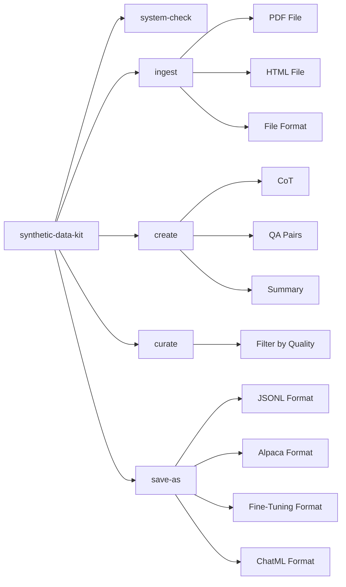

## Troubleshooting FAQs:

### vLLM Server Issues

- Ensure vLLM is installed: `pip install vllm`
- Start server with: `vllm serve <model_name> --port 8000`
- Check connection: `synthetic-data-kit system-check`

### Memory Issues

If you encounter CUDA out of memory errors:
- Use a smaller model
- Reduce batch size in config
- Start vLLM with `--gpu-memory-utilization 0.85`

### JSON Parsing Issues

If you encounter issues with the `curate` command:
- Use the `-v` flag to enable verbose output
- Set smaller batch sizes in your config.yaml
- Ensure the LLM model supports proper JSON output
- Install json5 for enhanced JSON parsing: `pip install json5`

### Parser Errors

- Ensure required dependencies are installed for specific parsers:
  - PDF: `pip install pdfminer.six`
  - HTML: `pip install beautifulsoup4`
  - YouTube: `pip install pytubefix youtube-transcript-api`
  - DOCX: `pip install python-docx`
  - PPTX: `pip install python-pptx`

## License

Read more about the [License](./LICENSE)

## Contributing

Contributions are welcome! [Read our contributing guide](./CONTRIBUTING.md)


================================================
FILE: CODE_OF_CONDUCT.md
================================================
# Code of Conduct

## Our Pledge

In the interest of fostering an open and welcoming environment, we as
contributors and maintainers pledge to make participation in our project and
our community a harassment-free experience for everyone, regardless of age, body
size, disability, ethnicity, sex characteristics, gender identity and expression,
level of experience, education, socio-economic status, nationality, personal
appearance, race, religion, or sexual identity and orientation.

## Our Standards

Examples of behavior that contributes to creating a positive environment
include:

* Using welcoming and inclusive language
* Being respectful of differing viewpoints and experiences
* Gracefully accepting constructive criticism
* Focusing on what is best for the community
* Showing empathy towards other community members

Examples of unacceptable behavior by participants include:

* The use of sexualized language or imagery and unwelcome sexual attention or
advances
* Trolling, insulting/derogatory comments, and personal or political attacks
* Public or private harassment
* Publishing others' private information, such as a physical or electronic
address, without explicit permission
* Other conduct which could reasonably be considered inappropriate in a
professional setting

## Our Responsibilities

Project maintainers are responsible for clarifying the standards of acceptable
behavior and are expected to take appropriate and fair corrective action in
response to any instances of unacceptable behavior.

Project maintainers have the right and responsibility to remove, edit, or
reject comments, commits, code, wiki edits, issues, and other contributions
that are not aligned to this Code of Conduct, or to ban temporarily or
permanently any contributor for other behaviors that they deem inappropriate,
threatening, offensive, or harmful.

## Scope

This Code of Conduct applies within all project spaces, and it also applies when
an individual is representing the project or its community in public spaces.
Examples of representing a project or community include using an official
project e-mail address, posting via an official social media account, or acting
as an appointed representative at an online or offline event. Representation of
a project may be further defined and clarified by project maintainers.

This Code of Conduct also applies outside the project spaces when there is a
reasonable belief that an individual's behavior may have a negative impact on
the project or its community.

## Enforcement

Instances of abusive, harassing, or otherwise unacceptable behavior may be
reported by contacting the project team at <opensource-conduct@meta.com>. All
complaints will be reviewed and investigated and will result in a response that
is deemed necessary and appropriate to the circumstances. The project team is
obligated to maintain confidentiality with regard to the reporter of an incident.
Further details of specific enforcement policies may be posted separately.

Project maintainers who do not follow or enforce the Code of Conduct in good
faith may face temporary or permanent repercussions as determined by other
members of the project's leadership.

## Attribution

This Code of Conduct is adapted from the [Contributor Covenant][homepage], version 1.4,
available at https://www.contributor-covenant.org/version/1/4/code-of-conduct.html

[homepage]: https://www.contributor-covenant.org

For answers to common questions about this code of conduct, see
https://www.contributor-covenant.org/faq


================================================
FILE: CONTRIBUTING.md
================================================
# Contributing to synthetic-data-kit
We want to make contributing to this project as easy and transparent as
possible.

## Pull Requests
We actively welcome your pull requests.

1. Fork the repo and create your branch from `main`.
2. If you've added code that should be tested, add tests.
3. If you've changed APIs, update the documentation.
4. Ensure the test suite passes.
5. Make sure your code lints.
6. If you haven't already, complete the Contributor License Agreement ("CLA").

## Contributor License Agreement ("CLA")
In order to accept your pull request, we need you to submit a CLA. You only need
to do this once to work on any of Facebook's open source projects.

Complete your CLA here: <https://code.facebook.com/cla>

## Issues
We use GitHub issues to track public bugs. Please ensure your description is
clear and has sufficient instructions to be able to reproduce the issue.

Facebook has a [bounty program](https://www.facebook.com/whitehat/) for the safe
disclosure of security bugs. In those cases, please go through the process
outlined on that page and do not file a public issue.

## License
By contributing to synthetic-data-kit, you agree that your contributions will be licensed
under the LICENSE file in the root directory of this source tree.


================================================
FILE: DOCS.md
================================================
# Synthetic Data Kit: Comprehensive Documentation

## Table of Contents

1. [Overview](#1-overview)
2. [Architecture](#2-architecture)
3. [Installation](#3-installation)
4. [CLI Interface](#4-cli-interface)
5. [Configuration System](#5-configuration-system)
6. [Pipeline Stages](#6-pipeline-stages)
7. [Component Reference](#7-component-reference)
8. [Output Formats](#8-output-formats)
9. [Environment Variables](#9-environment-variables)
10. [Workflow Examples](#10-workflow-examples)
11. [Customizing Prompts](#11-customizing-prompts)
12. [Extending the Toolkit](#12-extending-the-toolkit)
13. [Troubleshooting](#13-troubleshooting)
14. [Best Practices](#14-best-practices)

## 1. Overview

Synthetic Data Kit is a toolkit for preparing high-quality synthetic datasets to fine-tune Large Language Models (LLMs). It provides a modular command-line interface (CLI) for the complete data preparation workflow, with 4 simple commands named after their respective actions.

### Design:

- **Document Parsing**: Convert various file formats (PDF, HTML, YouTube, DOCX, PPTX, TXT) to clean text
- **Content Generation**: Generate high-quality QA pairs using local LLM inference
- **Quality Control**: Filter content based on quality metrics
- **Format Conversion**: Export to various training formats (JSONL, Alpaca, OpenAI FT, ChatML)
- **Configurable**: All aspects controlled via YAML configuration
- **Extensible**: Easy to add new parsers, generators, or output formats

## 2. Architecture

### System Overview

Synthetic Data Kit follows a modular architecture with these main components:

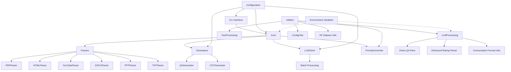

### Directory Structure

```
synthetic-data-kit/
├── synthetic_data_kit/        # Package source code
│   ├── __init__.py           # Package initialization
│   ├── cli.py                # CLI entry point using Typer
│   ├── core/                 # Core functionality
│   │   ├── __init__.py
│   │   ├── context.py        # Application context
│   │   ├── ingest.py         # Document ingestion
│   │   ├── create.py         # Content creation
│   │   ├── cleanup.py        # Content filtering
│   │   └── save_as.py        # Format conversion
│   ├── models/               # LLM integration
│   │   ├── __init__.py
│   │   └── llm_client.py     # VLLM client
│   ├── parsers/              # Document parsers
│   │   ├── __init__.py
│   │   ├── pdf_parser.py     # PDF parser
│   │   ├── html_parser.py    # HTML parser
│   │   ├── youtube_parser.py # YouTube parser
│   │   ├── docx_parser.py    # DOCX parser
│   │   ├── ppt_parser.py     # PPT parser
│   │   └── txt_parser.py     # TXT parser
│   ├── generators/           # Content generators
│   │   ├── __init__.py
│   │   └── qa_generator.py   # QA pair generator
│   └── utils/                # Utilities
│       ├── __init__.py
│       ├── config.py         # Config handling
│       ├── text.py           # Text processing
│       ├── llm_processing.py # LLM output parsing
│       └── format_converter.py # Format conversion
├── configs/                  # Configuration files
│   └── config.yaml           # Default configuration
├── data/                     # Data directories
│   ├── pdf/                  # Input PDFs
│   ├── html/                 # Input HTML files
│   ├── youtube/              # YouTube transcripts
│   ├── docx/                 # Input Word documents
│   ├── ppt/                  # Input PowerPoint files
│   ├── txt/                  # Input text files
│   ├── output/               # Parsed text outputs
│   ├── generated/            # Generated content
│   ├── cleaned/              # Filtered content
│   └── final/                # Formatted outputs
├── setup.py                  # Package setup script
├── pyproject.toml            # Project metadata
├── MANIFEST.in               # Package manifest
└── README.md                 # Project readme
```

### Class Diagram

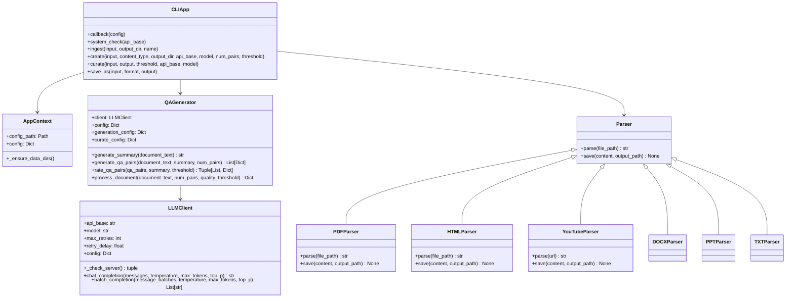

### Data Flow

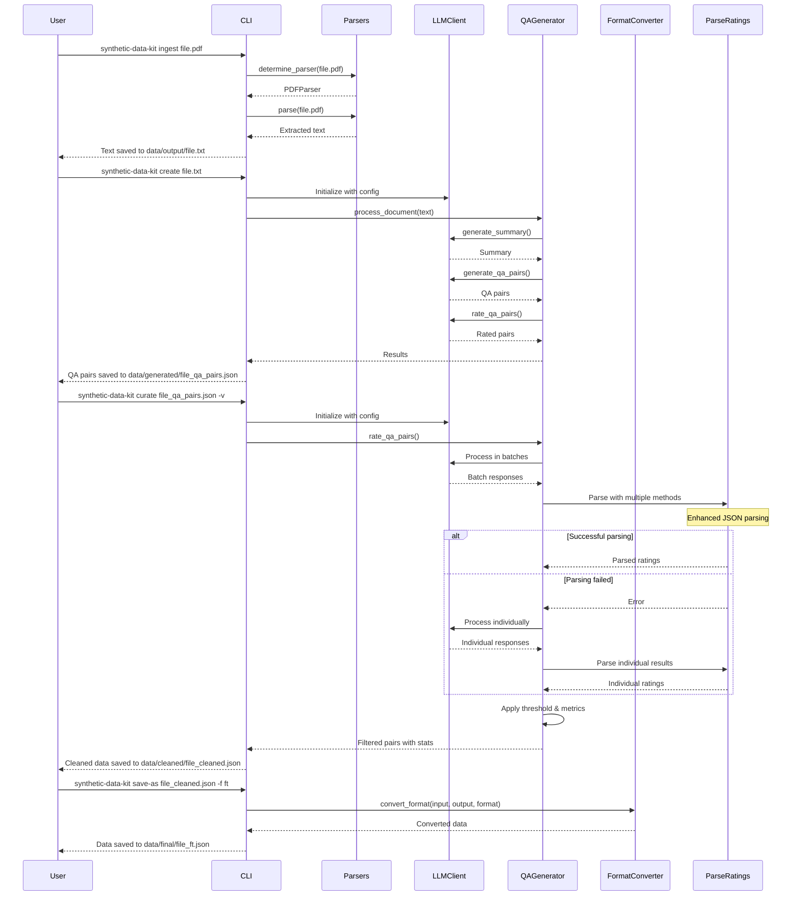

## 3. Installation

### Requirements

- Python 3.8 or later
- VLLM for local inference (recommended)

### Installation Methods

#### From PyPI

```bash
pip install synthetic-data-kit
```

#### From Source

```bash
git clone https://github.com/meta-llama/synthetic-data-kit.git
cd synthetic-data-kit
pip install -e .
```

### Setting Up VLLM

For local inference, you'll need to install and run VLLM:

```bash
pip install vllm

# Start the VLLM server with your preferred model
vllm serve meta-llama/Llama-3.3-70B-Instruct --port 8000
```

## 4. CLI Interface

Synthetic Data Kit provides a Typer-based CLI interface with subcommands for each stage of the pipeline.

### Command Structure

```
synthetic-data-kit [OPTIONS] COMMAND [ARGS]...
```

### Global Options

| Option | Description |
|--------|-------------|
| `-c, --config PATH` | Path to custom configuration file |
| `--help` | Show help message |

### Commands Overview

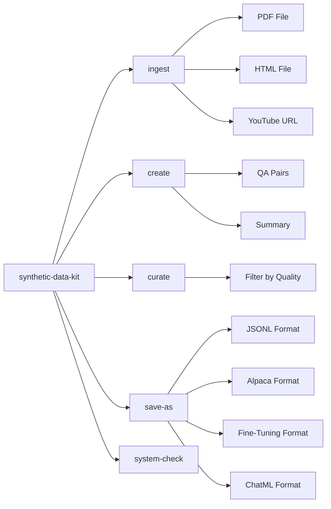

### `system-check` Command

Verifies if the VLLM server is running.

```bash
synthetic-data-kit system-check [OPTIONS]
```

#### Options:

| Option | Description |
|--------|-------------|
| `--api-base TEXT` | VLLM API base URL to check |

#### Example:

```bash
# Check default server
synthetic-data-kit system-check

# Check specific server
synthetic-data-kit system-check --api-base="http://localhost:8000/v1"
```

### `ingest` Command

Parses documents into clean text.

```bash
synthetic-data-kit ingest [OPTIONS] INPUT
```

#### Arguments:

| Argument | Description |
|----------|-------------|
| `INPUT` | File or URL to parse |

#### Options:

| Option | Description |
|--------|-------------|
| `-o, --output-dir PATH` | Directory to save parsed text |
| `-n, --name TEXT` | Custom filename for output |

#### Examples:

```bash
# Parse a PDF file
synthetic-data-kit ingest documents/paper.pdf

# Parse with custom output directory
synthetic-data-kit ingest documents/paper.pdf -o custom_dir/

# Parse a web page
synthetic-data-kit ingest "https://example.com/article"

# Parse a YouTube video
synthetic-data-kit ingest "https://www.youtube.com/watch?v=dQw4w9WgXcQ"
```

### `create` Command

Generates content from text files.

```bash
synthetic-data-kit create [OPTIONS] INPUT
```

#### Arguments:

| Argument | Description |
|----------|-------------|
| `INPUT` | Text file to process |

#### Options:

| Option | Description |
|--------|-------------|
| `--type TEXT` | Content type to generate [qa\|summary\|cot] |
| `-o, --output-dir PATH` | Directory to save generated content |
| `--api-base TEXT` | VLLM API base URL |
| `-m, --model TEXT` | Model to use |
| `-n, --num-pairs INTEGER` | Number of QA pairs to generate |
| `--threshold FLOAT` | Quality threshold (1-10) |

#### Examples:

```bash
# Generate QA pairs
synthetic-data-kit create data/output/document.txt

# Specify number of pairs
synthetic-data-kit create data/output/document.txt -n 30

# Generate summary only
synthetic-data-kit create data/output/document.txt --type summary

# Generate Chain of Thought (CoT) reasoning examples
synthetic-data-kit create data/output/document.txt --type cot

# Use custom model
synthetic-data-kit create data/output/document.txt -m "meta-llama/Llama-3.3-8B-Instruct"
```

### `curate` Command

Filters content based on quality.

```bash
synthetic-data-kit curate [OPTIONS] INPUT
```

#### Arguments:

| Argument | Description |
|----------|-------------|
| `INPUT` | File with QA pairs to clean |

#### Options:

| Option | Description |
|--------|-------------|
| `-o, --output PATH` | Output file path |
| `-t, --threshold FLOAT` | Quality threshold (1-10) |
| `--api-base TEXT` | VLLM API base URL |
| `-m, --model TEXT` | Model to use |

#### Examples:

```bash
# Clean with default settings
synthetic-data-kit curate data/generated/document_qa_pairs.json

# Set higher quality threshold
synthetic-data-kit curate data/generated/document_qa_pairs.json -t 8.5

# Specify output location
synthetic-data-kit curate data/generated/document_qa_pairs.json -o custom_path.json
```

### `save-as` Command

Converts content to different formats.

```bash
synthetic-data-kit save-as [OPTIONS] INPUT
```

#### Arguments:

| Argument | Description |
|----------|-------------|
| `INPUT` | File to convert |

#### Options:

| Option | Description |
|--------|-------------|
| `-f, --format TEXT` | Output format [jsonl\|alpaca\|ft\|chatml] |
| `--storage TEXT` | Storage format [json\|hf] (default: json) |
| `-o, --output PATH` | Output file path |

#### Examples:

```bash
# Convert to JSONL format
synthetic-data-kit save-as data/cleaned/document_cleaned.json -f jsonl

# Convert to fine-tuning format (JSON file)
synthetic-data-kit save-as data/cleaned/document_cleaned.json -f ft

# Convert to fine-tuning format (HF dataset)
synthetic-data-kit save-as data/cleaned/document_cleaned.json -f ft --storage hf

# Convert to ChatML format (HF dataset) with specific output location 
synthetic-data-kit save-as data/cleaned/document_cleaned.json -f chatml --storage hf -o data/final/custom_name
```

## 5. Configuration System

Synthetic Data Kit uses a YAML-based configuration system with a central config file.

### Configuration File Structure

```yaml
# paths: Configure input and output paths
paths:
  input:
    pdf: "data/pdf"
    html: "data/html"
    youtube: "data/youtube"
    docx: "data/docx"
    ppt: "data/ppt"
    txt: "data/txt"
  output:
    parsed: "data/output"
    generated: "data/generated"
    cleaned: "data/cleaned"
    final: "data/final"

# vllm: Configure VLLM server settings
vllm:
  api_base: "http://localhost:8000/v1"
  port: 8000
  model: "meta-llama/Llama-3.3-70B-Instruct"
  max_retries: 3
  retry_delay: 1.0

# generation: Content generation parameters
generation:
  temperature: 0.7
  top_p: 0.95
  chunk_size: 4000
  overlap: 200
  max_tokens: 4096
  num_pairs: 25
  batch_size: 32    # Number of requests to batch together

# curate: Content filtering parameters
curate:
  threshold: 7.0
  batch_size: 8
  temperature: 0.1

# format: Export format parameters
format:
  default: "jsonl"
  include_metadata: true
  pretty_json: true

# prompts: LLM prompts for different tasks
prompts:
  summary: |
    Summarize this document in 3-5 sentences, focusing on the main topic and key concepts.

  qa_generation: |
    Create {num_pairs} question-answer pairs from this text for LLM training.
    
    Rules:
    1. Questions must be about important facts in the text
    2. Answers must be directly supported by the text
    3. Return JSON format only:
    
    [
      {{
        "question": "Question 1?",
        "answer": "Answer 1."
      }},
      {{
        "question": "Question 2?",
        "answer": "Answer 2."
      }}
    ]
    
    Text:
    {text}

  qa_rating: |
    You are a helpful JSON processor that rates question-answer pairs.
    
    Your task is to rate each pair on a scale from 1-10 and return valid JSON with added ratings.
    
    ONLY return a valid JSON array with the original pairs plus ratings. Do not include any explanations or text outside the JSON.
    
    Here are the pairs to rate:
    
    {pairs}
```

### Using Custom Configurations

You can specify a custom configuration file using the `-c` option:

```bash
synthetic-data-kit -c custom_config.yaml ingest documents/paper.pdf
```

### Configuration Priorities

The toolkit uses the following priority for configuration values:

1. Command line arguments (highest priority)
2. Custom configuration file (if specified)
3. Default configuration values (lowest priority)

### Configuration API

```python
from synthetic_data_kit.utils.config import (
    load_config,
    get_path_config,
    get_vllm_config,
    get_generation_config,
    get_curate_config,
    get_format_config,
    get_prompt
)

# Load config from file
config = load_config("path/to/config.yaml")

# Get specific configuration sections
vllm_config = get_vllm_config(config)
generation_config = get_generation_config(config)
curate_config = get_curate_config(config)
format_config = get_format_config(config)

# Get specific path
output_dir = get_path_config(config, "output", "parsed")

# Get prompt template
summary_prompt = get_prompt(config, "summary")
```

## 6. Pipeline Stages

### Stage 1: Document Parsing (Ingest)

The `ingest` stage converts various document formats to plain text.

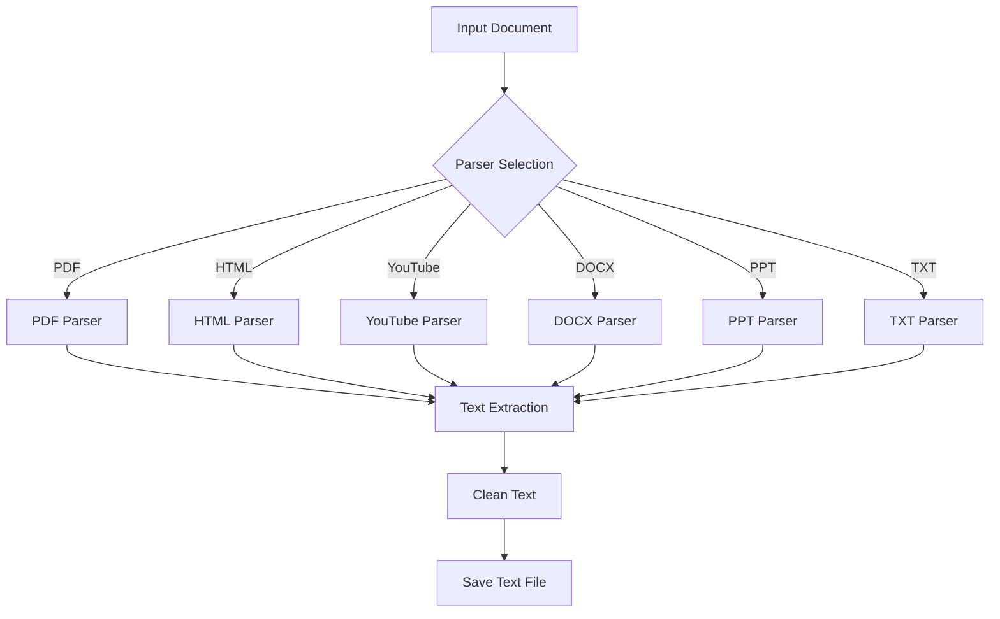

#### Parser Selection Logic

The toolkit selects the appropriate parser based on the file extension or URL pattern:

```python
def determine_parser(file_path, config):
    # URL handling
    if file_path.startswith(('http://', 'https://')):
        if 'youtube.com' in file_path or 'youtu.be' in file_path:
            return YouTubeParser()
        else:
            return HTMLParser()
    
    # File handling
    ext = os.path.splitext(file_path)[1].lower()
    parsers = {
        '.pdf': PDFParser(),
        '.html': HTMLParser(),
        '.htm': HTMLParser(),
        '.docx': DOCXParser(),
        '.pptx': PPTParser(),
        '.txt': TXTParser(),
    }
    
    if ext in parsers:
        return parsers[ext]
    else:
        raise ValueError(f"Unsupported file extension: {ext}")
```

### Stage 2: Content Generation (Create)

The `create` stage generates content from the parsed text.

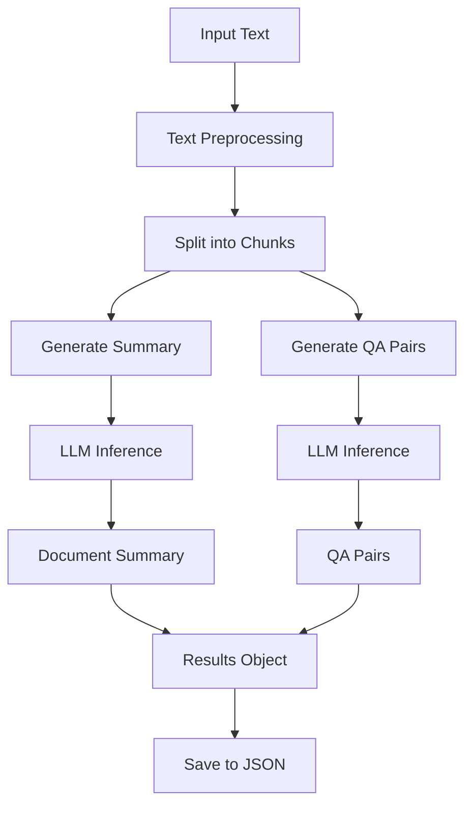

#### Text Chunking

For long documents, the text is split into manageable chunks:

```python
def split_into_chunks(text: str, chunk_size: int = 4000, overlap: int = 200) -> List[str]:
    paragraphs = text.split("\n\n")
    chunks = []
    current_chunk = ""
    
    for para in paragraphs:
        if len(current_chunk) + len(para) > chunk_size and current_chunk:
            chunks.append(current_chunk)
            # Keep some overlap for context
            sentences = current_chunk.split('. ')
            if len(sentences) > 3:
                current_chunk = '. '.join(sentences[-3:]) + "\n\n" + para
            else:
                current_chunk = para
        else:
            if current_chunk:
                current_chunk += "\n\n" + para
            else:
                current_chunk = para
    
    if current_chunk:
        chunks.append(current_chunk)
    
    return chunks
```

### Stage 3: Content Filtering (Cleanup)

The `cleanup` stage filters content based on quality.

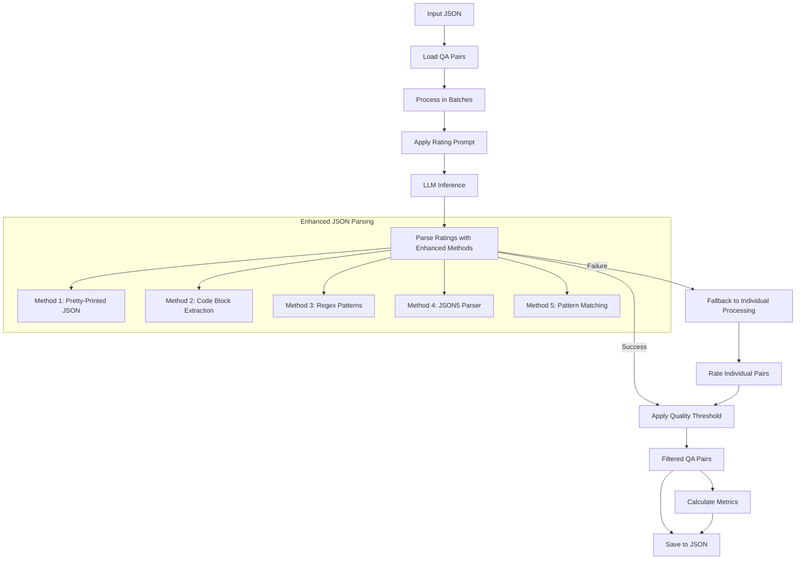

#### Quality Rating Logic

The curate module processes QA pairs in batches for efficiency, with robust error handling and fallback mechanisms. The system has been enhanced to handle JSON parsing edge cases and provide detailed diagnostic information.

```python
def curate_qa_pairs(input_path, output_path, threshold=None, api_base=None, model=None, config_path=None, verbose=False):
    """Clean and filter QA pairs based on quality ratings"""
    # Load input file and extract QA pairs
    with open(input_path, 'r', encoding='utf-8') as f:
        data = json.load(f)
    qa_pairs = data.get("qa_pairs", [])
    summary = data.get("summary", "")
    
    # Initialize LLM client
    client = LLMClient(config_path=config_path, api_base=api_base, model_name=model)
    
    # Get configuration
    curate_config = get_curate_config(client.config)
    
    # Allow environment variable to override batch size for debugging
    env_batch_size = os.environ.get('SDK_BATCH_SIZE')
    if env_batch_size and env_batch_size.isdigit():
        batch_size = int(env_batch_size)
        inference_batch = int(env_batch_size)
    else:
        batch_size = curate_config.get("batch_size", 32)
        inference_batch = curate_config.get("inference_batch", 32)
    
    # Process in batches with smart error handling
    batches = [qa_pairs[i:i+batch_size] for i in range(0, len(qa_pairs), batch_size)]
    for batch_start in range(0, len(all_messages), inference_batch):
        batch_responses = client.batch_completion(current_batch, temperature=rating_temperature)
        
        # Process each response
        for j, response in enumerate(batch_responses):
            try:
                # Pass original batch to enable fallback matching
                rated_batch = parse_ratings(response, original_batch)
                
                # Process ratings
                for pair in rated_batch:
                    if "rating" in pair:
                        rating = pair["rating"]
                        if rating >= threshold:
                            filtered_pairs.append(pair)
            except Exception as e:
                # Attempt individual processing as fallback
                if verbose:
                    print(f"Batch processing failed, trying individual items...")
                    
                # Process individual items in the batch as a fallback strategy
                for item in original_batch:
                    try:
                        # Process single item
                        item_response = client.chat_completion(
                            [{"role": "system", "content": single_item_prompt}]
                        )
                        rated_item = parse_ratings(item_response, [item])
                        # Add to filtered pairs if rating meets threshold
                    except Exception:
                        if verbose:
                            print(f"Failed to process individual item")
                
    # Calculate metrics and return results
    return output_path
```

The system includes several advanced features:

1. **Batch Size Configuration**: Configurable batch sizes for optimal performance
2. **Environment Variable Overrides**: `SDK_BATCH_SIZE` for debugging and testing
3. **Fallback Processing**: If batch processing fails, falls back to single-item processing
4. **Robust JSON Parsing**: Multiple parsing methods to handle different LLM output formats
5. **Verbose Mode**: Detailed diagnostic information with the `-v` flag

### Stage 4: Format Conversion (Save-as)

The `save-as` stage converts the content to different formats.

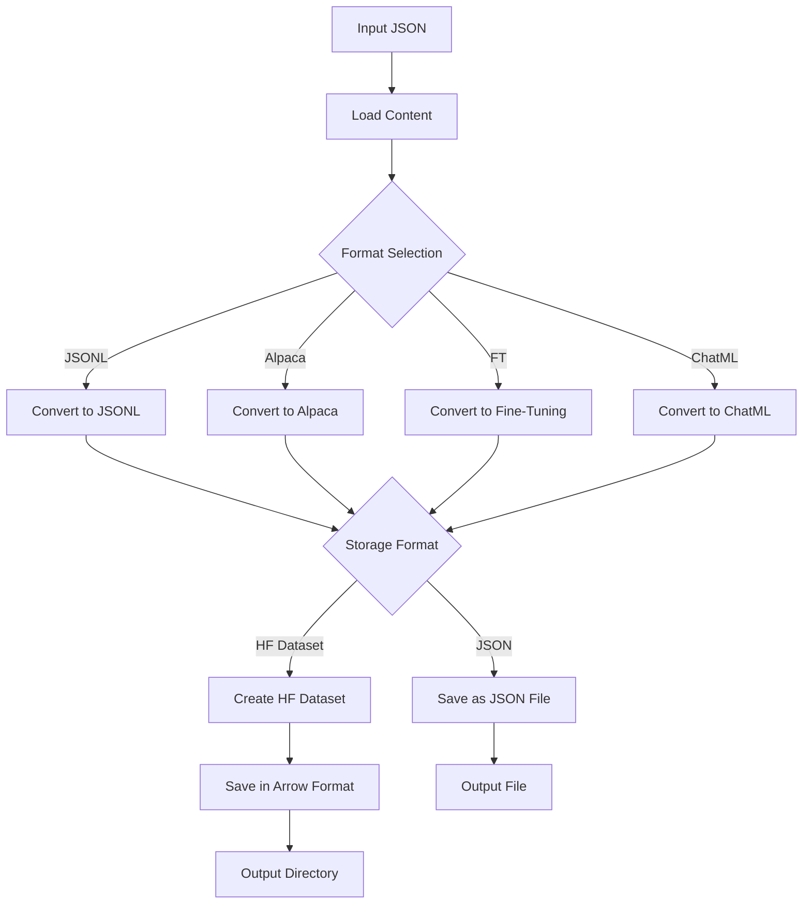

#### Format Converter Logic

```python
def convert_format(input_path, output_path, format_type):
    # Load input file
    with open(input_path, 'r', encoding='utf-8') as f:
        data = json.load(f)
    
    # Extract QA pairs
    if "filtered_pairs" in data:
        qa_pairs = data["filtered_pairs"]
    elif "qa_pairs" in data:
        qa_pairs = data["qa_pairs"]
    else:
        raise ValueError("No QA pairs found in input file")
    
    # Convert to requested format
    if format_type == "jsonl":
        return to_jsonl(qa_pairs, output_path)
    elif format_type == "alpaca":
        return to_alpaca(qa_pairs, output_path)
    elif format_type == "ft":
        return to_fine_tuning(qa_pairs, output_path)
    elif format_type == "chatml":
        return to_chatml(qa_pairs, output_path)
    else:
        raise ValueError(f"Unknown format type: {format_type}")
```

## 7. Component Reference

### LLMClient

```python
class LLMClient:
    def __init__(self, 
                 config_path: Optional[Path] = None,
                 api_base: Optional[str] = None, 
                 model_name: Optional[str] = None,
                 max_retries: Optional[int] = None,
                 retry_delay: Optional[float] = None):
        """Initialize an OpenAI-compatible client that connects to a VLLM server"""
    
    def chat_completion(self, 
                       messages: List[Dict[str, str]], 
                       temperature: float = None, 
                       max_tokens: int = None,
                       top_p: float = None) -> str:
        """Generate a chat completion using the VLLM OpenAI-compatible API"""
    
    def batch_completion(self, 
                        message_batches: List[List[Dict[str, str]]], 
                        temperature: float = None, 
                        max_tokens: int = None,
                        top_p: float = None) -> List[str]:
        """Process multiple message sets sequentially"""
```

### QAGenerator

```python
class QAGenerator:
    def __init__(self, 
                 client: LLMClient,
                 config_path: Optional[Path] = None):
        """Initialize the QA Generator with an LLM client and optional config"""
    
    def generate_summary(self, document_text: str) -> str:
        """Generate a summary of the document"""
    
    def generate_qa_pairs(self, 
                        document_text: str, 
                        summary: str, 
                        num_pairs: int = 25) -> List[Dict[str, str]]:
        """Generate QA pairs from the document"""
    
    def rate_qa_pairs(self, 
                     qa_pairs: List[Dict[str, str]], 
                     summary: str, 
                     threshold: Optional[float] = None) -> Tuple[List[Dict[str, Any]], Dict[str, Any]]:
        """Rate and filter QA pairs by quality"""
    
    def process_document(self, 
                        document_text: str, 
                        num_pairs: int = 25, 
                        quality_threshold: Optional[float] = None) -> Dict[str, Any]:
        """Process a document to generate, rate, and format QA pairs"""
```

### Document Parsers

```python
class Parser:
    def parse(self, file_path: str) -> str:
        """Parse a document into plain text"""
        
    def save(self, content: str, output_path: str) -> None:
        """Save the extracted text to a file"""
```

Each parser implements this interface:

- `PDFParser`: Uses pdfminer.six to extract text from PDF files
- `HTMLParser`: Uses BeautifulSoup4 to extract text from HTML/web pages
- `YouTubeParser`: Uses pytube and youtube-transcript-api to extract transcripts
- `DOCXParser`: Uses python-docx to extract text from Word documents
- `PPTParser`: Uses python-pptx to extract text from PowerPoint presentations
- `TXTParser`: Reads plain text files

### Utility Functions

```python
# Text Processing
def split_into_chunks(text: str, chunk_size: int = 4000, overlap: int = 200) -> List[str]:
    """Split text into chunks with optional overlap"""

# LLM Output Processing
def parse_qa_pairs(text: str) -> List[Dict[str, str]]:
    """Parse QA pairs from LLM output"""
    
def parse_ratings(text: str) -> List[Dict[str, Any]]:
    """Parse rated items from LLM output"""
    
def convert_to_conversation_format(qa_pairs: List[Dict[str, str]]) -> List[List[Dict[str, str]]]:
    """Convert QA pairs to conversation format"""

# Format Conversion
def to_jsonl(data: List[Dict[str, Any]], output_path: str) -> str:
    """Convert data to JSONL format and save to a file"""
    
def to_alpaca(qa_pairs: List[Dict[str, str]], output_path: str) -> str:
    """Convert QA pairs to Alpaca format and save"""
    
def to_fine_tuning(qa_pairs: List[Dict[str, str]], output_path: str) -> str:
    """Convert QA pairs to fine-tuning format and save"""
    
def to_chatml(qa_pairs: List[Dict[str, str]], output_path: str) -> str:
    """Convert QA pairs to ChatML format and save as JSONL"""
```

## 8. Output Formats

### Generated QA Pairs Format

```json
{
  "summary": "Document summary text",
  "qa_pairs": [
    {
      "question": "What is X?",
      "answer": "X is..."
    },
    // More QA pairs...
  ],
  "filtered_pairs": [
    {
      "question": "What is X?",
      "answer": "X is...",
      "rating": 8.5
    },
    // More rated pairs...
  ],
  "conversations": [
    [
      {"role": "system", "content": "You are a helpful AI assistant."},
      {"role": "user", "content": "What is X?"},
      {"role": "assistant", "content": "X is..."}
    ],
    // More conversations...
  ],
  "metrics": {
    "total": 25,
    "filtered": 18,
    "retention_rate": 0.72,
    "avg_score": 7.8
  }
}
```

### Export Formats

#### Content Formats

##### JSONL Format

```jsonl
{"question": "What is X?", "answer": "X is..."}
{"question": "How does Y work?", "answer": "Y works by..."}
```

##### Alpaca Format

```json
[
  {
    "instruction": "What is X?",
    "input": "",
    "output": "X is..."
  },
  {
    "instruction": "How does Y work?",
    "input": "",
    "output": "Y works by..."
  }
]
```

##### Fine-Tuning (FT) Format

```json
[
  {
    "messages": [
      {"role": "system", "content": "You are a helpful assistant."},
      {"role": "user", "content": "What is X?"},
      {"role": "assistant", "content": "X is..."}
    ]
  },
  {
    "messages": [
      {"role": "system", "content": "You are a helpful assistant."},
      {"role": "user", "content": "How does Y work?"},
      {"role": "assistant", "content": "Y works by..."}
    ]
  }
]
```

##### ChatML Format

```jsonl
{"messages":[{"role":"system","content":"You are a helpful AI assistant."},{"role":"user","content":"What is X?"},{"role":"assistant","content":"X is..."}]}
{"messages":[{"role":"system","content":"You are a helpful AI assistant."},{"role":"user","content":"How does Y work?"},{"role":"assistant","content":"Y works by..."}]}
```

#### Storage Formats

##### JSON Files (Default)

Content is stored in standard JSON files as shown in the formats above.

##### Hugging Face Datasets (Arrow Format)

Content can be stored as Hugging Face datasets using the efficient Arrow format, which provides:

- Memory-efficient storage (memory-mapped files)
- Fast random access to data
- Column-oriented storage for efficient operations
- Native compatibility with the HF ecosystem
- Better performance for ML workflows

```python
# Example of loading and using a HF dataset
from datasets import load_from_disk

# Load the dataset
dataset = load_from_disk('data/final/example_ft_hf')

# View the features
print(dataset.features)
# Example output: {'messages': [{'content': Value(dtype='string', id=None), 'role': Value(dtype='string', id=None)}]}

# Access the first example
print(dataset[0])
# Example output: {'messages': [{'role': 'system', 'content': '...'}, {'role': 'user', 'content': '...'}, ...]}

# Use with training libraries
import transformers
trainer = transformers.Trainer(
    model=model,
    train_dataset=dataset,
    # other parameters...
)
```

## 9. Environment Variables

The toolkit supports these environment variables for debugging and configuration:

| Variable | Description | Default | Example |
|----------|-------------|---------|---------|
| `SDK_VERBOSE` | Enable verbose output for all operations | `false` | `export SDK_VERBOSE=true` |
| `SDK_BATCH_SIZE` | Override batch size for curate command | Config setting | `export SDK_BATCH_SIZE=1` |

Setting these variables can help with debugging and performance tuning:

```bash
# Process one QA pair at a time with detailed output
export SDK_VERBOSE=true
export SDK_BATCH_SIZE=1
synthetic-data-kit curate data/generated/results.json
```

## 10. Workflow Examples

### Basic Workflow

```bash
# Start VLLM server (in a separate terminal)
vllm serve meta-llama/Llama-3.3-70B-Instruct --port 8000

# Check if server is running
synthetic-data-kit system-check

# 1. Parse a PDF document
synthetic-data-kit ingest documents/paper.pdf

# 2. Generate QA pairs from the parsed text
synthetic-data-kit create data/output/paper.txt

# 3. Clean and filter the generated content
synthetic-data-kit curate data/generated/paper_qa_pairs.json

# 4. Convert to fine-tuning format
synthetic-data-kit save-as data/cleaned/paper_cleaned.json -f ft
```

### Advanced Configuration Example

Create a custom configuration file `technical_docs.yaml`:

```yaml
vllm:
  model: "meta-llama/Llama-3.3-70B-Instruct"

generation:
  temperature: 0.5
  chunk_size: 3000
  overlap: 300
  num_pairs: 40

cleanup:
  threshold: 8.0
  temperature: 0.05

prompts:
  qa_generation: |
    Create {num_pairs} question-answer pairs about technical documentation.
    
    Focus on questions that:
    1. Test understanding of complex technical concepts
    2. Include code examples and implementation details
    3. Cover API usage patterns
    
    Return only the JSON:
    [
      {{
        "question": "Technical question?",
        "answer": "Technical answer with code if relevant."
      }}
    ]
    
    Text:
    {text}
```

Use the custom configuration:

```bash
# Process technical documentation with custom config
synthetic-data-kit -c technical_docs.yaml ingest documentation/api_docs.pdf
synthetic-data-kit -c technical_docs.yaml create data/output/api_docs.txt
synthetic-data-kit -c technical_docs.yaml curate data/generated/api_docs_qa_pairs.json
synthetic-data-kit -c technical_docs.yaml save-as data/cleaned/api_docs_cleaned.json -f ft
```

### Processing Multiple Files

```bash
# Process all PDFs in a directory
for file in documents/*.pdf; do
  filename=$(basename "$file" .pdf)
  
  # Ingest
  synthetic-data-kit ingest "$file"
  
  # Create QA pairs
  synthetic-data-kit create "data/output/${filename}.txt" -n 20
  
  # Curate
  synthetic-data-kit curate "data/generated/${filename}_qa_pairs.json" -t 7.5
  
  # Save as fine-tuning format
  synthetic-data-kit save-as "data/cleaned/${filename}_cleaned.json" -f ft
done
```

## 11. Customizing Prompts

### Summary Generation Prompt

```yaml
prompts:
  summary: |
    Create a comprehensive summary of this technical document.
    
    Include:
    1. The main topic and purpose
    2. Key technical concepts and methodologies
    3. Important findings or conclusions
    4. System architecture or design patterns
    
    Focus on extracting the most technically relevant information.
```

### QA Generation Prompt

```yaml
prompts:
  qa_generation: |
    You're an expert creating training data for a technical assistant.
    
    From this text, create {num_pairs} question-answer pairs that:
    1. Focus on complex technical concepts
    2. Include implementation details and practical usage
    3. Cover both basic and advanced topics
    4. Represent realistic user queries
    
    Each answer should be comprehensive yet concise, and include code examples where relevant.
    
    Return as JSON:
    [
      {{
        "question": "How does X work in system Y?",
        "answer": "X works in system Y by... For example: `code example`"
      }}
    ]
    
    Text:
    {text}
```

### QA Rating Prompt

```yaml
prompts:
  qa_rating: |
    Evaluate these QA pairs for a technical assistant on a scale of 1-10.
    
    Criteria:
    1. Technical accuracy (0-3 points)
    2. Completeness of answer (0-3 points)
    3. Relevance to practical usage (0-2 points)
    4. Clear explanations (0-2 points)
    
    Return the original pairs with ratings added:
    [
      {"question": "...", "answer": "...", "rating": 8}
    ]
    
    QA Pairs:
    {pairs}
```

## 12. Extending the Toolkit

### Adding a New Parser

Create a new parser in the `parsers` directory:

```python
# synthetic_data_kit/parsers/markdown_parser.py
import os

class MarkdownParser:
    """Parser for Markdown files"""
    
    def parse(self, file_path: str) -> str:
        """Parse a Markdown file into plain text"""
        with open(file_path, 'r', encoding='utf-8') as f:
            content = f.read()
            
        # Remove Markdown formatting
        # This is a simple example - you'd want more robust parsing
        import re
        # Remove headers
        content = re.sub(r'#+\s+(.*)', r'\1', content)
        # Remove bold/italic
        content = re.sub(r'\*\*(.*?)\*\*', r'\1', content)
        content = re.sub(r'\*(.*?)\*', r'\1', content)
        # Remove links
        content = re.sub(r'\[(.*?)\]\(.*?\)', r'\1', content)
        
        return content
    
    def save(self, content: str, output_path: str) -> None:
        """Save the extracted text to a file"""
        os.makedirs(os.path.dirname(output_path), exist_ok=True)
        with open(output_path, 'w', encoding='utf-8') as f:
            f.write(content)
```

Register the parser in `parsers/__init__.py`:

```python
from synthetic_data_kit.parsers.markdown_parser import MarkdownParser
```

Update the parser selection in `core/ingest.py`:

```python
def determine_parser(file_path, config):
    # ... existing code ...
    
    ext = os.path.splitext(file_path)[1].lower()
    parsers = {
        '.pdf': PDFParser(),
        '.html': HTMLParser(),
        '.htm': HTMLParser(),
        '.docx': DOCXParser(),
        '.pptx': PPTParser(),
        '.txt': TXTParser(),
        '.md': MarkdownParser(),  # Add the new parser
        '.markdown': MarkdownParser(),
    }
    
    # ... rest of the function ...
```

### Adding a New Output Format

Add a new converter function in `utils/format_converter.py`:

```python
def to_custom_format(qa_pairs: List[Dict[str, str]], output_path: str) -> str:
    """Convert QA pairs to a custom format and save"""
    
    # Create the custom format structure
    formatted_data = {
        "version": "1.0",
        "created": datetime.now().isoformat(),
        "items": []
    }
    
    for pair in qa_pairs:
        formatted_data["items"].append({
            "input": {
                "query": pair["question"]
            },
            "output": {
                "text": pair["answer"]
            },
            "metadata": {
                "source": "synthetic-data-kit"
            }
        })
    
    # Save to file
    with open(output_path, 'w', encoding='utf-8') as f:
        json.dump(formatted_data, f, indent=2)
    
    return output_path
```

Update the format conversion in `core/save_as.py`:

```python
def convert_format(input_path, output_path, format_type, config=None):
    # ... existing code ...
    
    elif format_type == "custom":
        return to_custom_format(qa_pairs, output_path)
    
    # ... rest of the function ...
```

### Adding a New Generator Type

Create a new generator in the `generators` directory:

```python
# synthetic_data_kit/generators/cot_generator.py
from typing import Dict, List, Any, Optional
import json

from synthetic_data_kit.models.llm_client import LLMClient
from synthetic_data_kit.utils.config import get_prompt

class COTGenerator:
    """Generates chain-of-thought reasoning examples"""
    
    def __init__(self, client: LLMClient, config_path: Optional[str] = None):
        self.client = client
        self.config = client.config
    
    def generate_cot_examples(self, document_text: str, num_examples: int = 5) -> List[Dict[str, Any]]:
        """Generate chain-of-thought reasoning examples"""
        
        # Get the prompt template
        prompt_template = get_prompt(self.config, "cot_generation")
        
        # Format the prompt
        prompt = prompt_template.format(
            num_examples=num_examples,
            text=document_text
        )
        
        # Generate examples
        messages = [{"role": "system", "content": prompt}]
        response = self.client.chat_completion(messages)
        
        # Parse response (simplified for example)
        examples = []
        if '[' in response and ']' in response:
            start = response.find('[')
            end = response.rfind(']') + 1
            try:
                examples = json.loads(response[start:end])
            except:
                print("Error parsing COT examples")
        
        return examples
```

Add the corresponding prompt to `config.yaml`:

```yaml
prompts:
  cot_generation: |
    Generate {num_examples} chain-of-thought reasoning examples from this text.
    
    Each example should have:
    1. A complex problem or question
    2. Step-by-step reasoning to solve it
    3. The final answer
    
    Return as JSON:
    [
      {{
        "question": "Complex problem?",
        "reasoning": "Step 1: ... Step 2: ... Step 3: ...",
        "answer": "Final answer"
      }}
    ]
    
    Text:
    {text}
```

Update the `create` command to use the new generator:

```python
def process_file(...):
    # ... existing code ...
    
    elif content_type == "cot":
        from synthetic_data_kit.generators.cot_generator import COTGenerator
        generator = COTGenerator(client, config_path)
        
        examples = generator.generate_cot_examples(
            document_text,
            num_examples=num_pairs  # Reuse the num_pairs parameter
        )
        
        # Save output
        output_path = os.path.join(output_dir, f"{base_name}_cot_examples.json")
        with open(output_path, 'w', encoding='utf-8') as f:
            json.dump({"cot_examples": examples}, f, indent=2)
        
        return output_path
    
    # ... rest of the function ...
```

## 13. Troubleshooting

### Common Issues

#### VLLM Server Connection Errors

```
Error: VLLM server not available at http://localhost:8000/v1
```

**Solution**:
- Ensure VLLM is installed: `pip install vllm`
- Start the server: `vllm serve <model_name> --port 8000`
- Check if the port is already in use by another process
- Verify network connectivity to the server

#### JSON Parsing Errors

```
Error parsing LLM output: Expecting property name enclosed in double quotes
```

**Solution**:
- Lower the temperature setting (e.g., 0.1) for more predictable outputs
- Improve the prompt to be more explicit about JSON formatting
- Ensure the model is capable of generating valid JSON (larger models tend to do better)

#### Enhanced JSON Parsing System

The toolkit includes a robust, multi-method JSON parsing system for handling LLM responses:

```python
def parse_ratings(text: str, original_items: List[Dict[str, str]] = None) -> List[Dict[str, Any]]:
    """Parse rated items from LLM output with enhanced error recovery"""
    
    # Method 1: Comprehensive approach for pretty-printed JSON
    # Handles indentation and newlines in JSON from LLMs
    
    # Method 2: Code block extraction
    # Finds and parses JSON inside markdown code blocks
    
    # Method 3: Regex-based extraction
    # Uses pattern matching to find JSON-like structures
    
    # Method 4: JSON5 parsing (more lenient)
    # Applies a more forgiving parser if available
    
    # Method 5: Pattern matching with original items
    # Uses original QA pairs to extract ratings when all else fails
```

For optimal JSON parsing, you can:

1. **Install json5**: `pip install json5` for enhanced JSON parsing capabilities
2. **Use verbose mode**: Run commands with `-v` flag to see detailed parsing information
3. **Set environment variables**: `SDK_BATCH_SIZE=1` to process one item at a time for debugging
4. **Adjust prompt templates**: Update config.yaml prompts for better JSON formatting

#### Memory Issues with Large Models

```
CUDA out of memory
```

**Solution**:
- Use a smaller model (e.g., 7B instead of 70B)
- Reduce the batch size in the configuration
- Start VLLM with memory optimization flags:
  ```bash
  vllm serve <model> --gpu-memory-utilization 0.85 --max-model-len 4096
  ```
- If using multiple GPUs, enable tensor parallelism:
  ```bash
  vllm serve <model> --tensor-parallel-size 4
  ```

#### File Not Found Errors

```
File not found: documents/paper.pdf
```

**Solution**:
- Verify the file path is correct (absolute vs. relative)
- Check permissions on the file and directory
- Create the directory structure if it doesn't exist:
  ```bash
  mkdir -p data/{pdf,html,youtube,docx,ppt,txt,output,generated,cleaned,final}
  ```

### Debugging Tips

#### Checking VLLM Server Status

```bash
# Using the built-in system-check command
synthetic-data-kit system-check --api-base="http://localhost:8000/v1"

# Direct API check
curl -X GET http://localhost:8000/v1/models
```

#### Inspecting Generated Files

```bash
# View parsed text file
cat data/output/document.txt

# View generated QA pairs
jq . data/generated/document_qa_pairs.json

# Count QA pairs
jq '.qa_pairs | length' data/generated/document_qa_pairs.json

# View quality metrics
jq '.metrics' data/cleaned/document_cleaned.json
```

#### Testing Pipeline Stages Individually

```bash
# Test just the parser
synthetic-data-kit ingest documents/paper.pdf -o test_output/

# Test just content creation with a small text file
echo "This is a test document." > test.txt
synthetic-data-kit create test.txt -n 2

# Test just format conversion with a known good file
synthetic-data-kit save-as known_good_data.json -f jsonl
```

## 14. Best Practices

### Data Quality

1. **Source Document Selection**
   - Use high-quality, accurate source materials
   - Prefer technical, factual content over subjective or opinion-based text
   - Include a diverse range of topics for better generalization

2. **Content Generation**
   - Start with more pairs than needed (30-50% more)
   - Set a higher quality threshold (8.0+) for critical applications
   - Use lower temperature (0.1-0.3) for more consistent outputs
   - Use larger models (30B+) for more accurate generation

3. **Post-Processing**
   - Manually review a sample of generated content (5-10%)
   - Check for hallucinations or unsupported claims
   - Validate factual accuracy of technical content

### Pipeline Optimization

1. **Text Preprocessing**
   - Clean document text before ingestion
   - For PDFs, ensure they are text-based, not scanned images
   - Remove irrelevant content (headers, footers, page numbers)

2. **Chunking Strategy**
   - Balance chunk size with context requirements
   - Ensure sufficient overlap between chunks (10-15% of chunk size)
   - For technical content, keep related sections together

3. **Prompt Engineering**
   - Be explicit about the expected output format
   - Include examples of desired output quality
   - Customize prompts for different content types

4. **Resource Management**
   - Process large documents in smaller batches
   - Implement checkpointing for very large datasets
   - Use a dedicated machine for VLLM serving


================================================
FILE: LICENSE
================================================
MIT License

Copyright (c) Meta Platforms, Inc. and affiliates

Permission is hereby granted, free of charge, to any person obtaining
a copy of this software and associated documentation files (the
"Software"), to deal in the Software without restriction, including
without limitation the rights to use, copy, modify, merge, publish,
distribute, sublicense, and/or sell copies of the Software, and to
permit persons to whom the Software is furnished to do so, subject to
the following conditions:

The above copyright notice and this permission notice shall be
included in all copies or substantial portions of the Software.

THE SOFTWARE IS PROVIDED "AS IS", WITHOUT WARRANTY OF ANY KIND,
EXPRESS OR IMPLIED, INCLUDING BUT NOT LIMITED TO THE WARRANTIES OF
MERCHANTABILITY, FITNESS FOR A PARTICULAR PURPOSE AND
NONINFRINGEMENT. IN NO EVENT SHALL THE AUTHORS OR COPYRIGHT HOLDERS BE
LIABLE FOR ANY CLAIM, DAMAGES OR OTHER LIABILITY, WHETHER IN AN ACTION
OF CONTRACT, TORT OR OTHERWISE, ARISING FROM, OUT OF OR IN CONNECTION
WITH THE SOFTWARE OR THE USE OR OTHER DEALINGS IN THE SOFTWARE.


================================================
FILE: MANIFEST.in
================================================
include synthetic_data_kit/config.yaml
recursive-include configs *.yaml


================================================
FILE: pyproject.toml
================================================
[build-system]
requires = ["hatchling"]
build-backend = "hatchling.build"

[project]
name = "synthetic-data-kit"
version = "0.0.5b1"
description = "Tool for generating high quality Synthetic datasets"
readme = "README.md"
requires-python = ">=3.8"
license = {text = "MIT"}
dependencies = [
    "datasets>=2.14.0",
    "pdfminer-six>=20221105",
    "pydantic>=2.4.0",
    "python-docx>=0.8.11",
    "python-pptx>=0.6.21",
    "pytube>=15.0.0",
    "pyyaml>=6.0",
    "requests>=2.31.0",
    "rich>=13.4.2",
    "typer>=0.9.0",
    "openai>=1.0.0",
    "flask>=2.0.0",
    "flask-wtf>=1.0.0",
    "bootstrap-flask>=2.2.0",
    "beautifulsoup4>=4.12.0",
    "pylance",
    "PyMuPDF"
]

# These fields appear in pip show
summary = "Create and curate synthetic datasets for fine-tuning LLMs"
authors = [
    {name = "Sanyam Bhutani", email = "sanyambhutani@meta.com"},
    {name = "Hamid Shojanazeri", email = "hamidnazeri@meta.com"},
]
maintainers = [
    {name = "Sanyam Bhutani", email = "sanyambhutani@meta.com"},
    {name = "Hamid Shojanazeri", email = "hamidnazeri@meta.com"},
]
keywords = ["llm", "synthetic-data", "fine-tuning", "llama", "ai", "machine-learning", "nlp", "dataset-generation", "chain-of-thought", "tool-use", "reasoning"]
classifiers = [
    "Development Status :: 3 - Alpha",
    "Intended Audience :: Developers",
    "Intended Audience :: Science/Research",
    "License :: OSI Approved :: MIT License",
    "Programming Language :: Python :: 3",
    "Programming Language :: Python :: 3.8",
    "Programming Language :: Python :: 3.9",
    "Programming Language :: Python :: 3.10",
    "Programming Language :: Python :: 3.11",
    "Programming Language :: Python :: 3.12",
    "Topic :: Scientific/Engineering :: Artificial Intelligence",
    "Topic :: Scientific/Engineering :: Information Analysis",
    "Topic :: Text Processing :: Linguistic",
    "Topic :: Software Development :: Libraries :: Python Modules",
    "Natural Language :: English",
]


[project.urls]
"Homepage" = "https://github.com/meta-llama/synthetic-data-kit"
"Bug Tracker" = "https://github.com/meta-llama/synthetic-data-kit/issues"
"Documentation" = "https://github.com/meta-llama/synthetic-data-kit#readme"
"Getting Started" = "https://github.com/meta-llama/synthetic-data-kit/blob/main/getting-started/README.md"

[project.scripts]
synthetic-data-kit = "synthetic_data_kit.cli:app"

[tool.hatch.build.targets.wheel]
packages = ["synthetic_data_kit"]
include-package-data = true

[tool.hatch.build.targets.sdist]
include = [
    "synthetic_data_kit",
    "configs/config.yaml",
    "README.md",
    "LICENSE",
    "MANIFEST.in",
]

[tool.ruff]
line-length = 100
target-version = "py38"

[tool.ruff.lint]
# select = [
#     "E",  # pycodestyle errors
#     "W",  # pycodestyle warnings
#     "F",  # pyflakes
#     "I",  # isort
#     "B",  # flake8-bugbear
#     "C4", # flake8-comprehensions
#     "UP", # pyupgrade
# ]
select = []  # Disable all linting
ignore = []

[tool.ruff.format]
quote-style = "double"
indent-style = "space"

[project.optional-dependencies]
dev = [
    "pytest>=7.0.0",
    "pytest-cov>=4.0.0",
    "pytest-mock>=3.0.0",
    "ruff>=0.6.0",
    "mypy>=1.0.0",
    "pre-commit>=3.0.0",
    "beautifulsoup4>=4.12.0",
    "PyMuPDF"
]

[tool.mypy]
python_version = "3.8"
warn_return_any = true
warn_unused_configs = true
disallow_untyped_defs = true
disallow_incomplete_defs = true
check_untyped_defs = true
disallow_untyped_decorators = true
no_implicit_optional = true
strict_optional = true

[tool.pytest.ini_options]
testpaths = ["tests"]
python_files = "test_*.py"
python_functions = "test_*"
markers = [
    "unit: marks tests as unit tests",
    "integration: marks tests as integration tests",
    "functional: marks tests as functional tests",
]
filterwarnings = [
    "ignore::DeprecationWarning",
    "ignore::UserWarning",
]


================================================
FILE: .pre-commit-config.yaml
================================================
# repos:
# -   repo: https://github.com/pre-commit/pre-commit-hooks
#     rev: v5.0.0
#     hooks:
#     -   id: trailing-whitespace
#     -   id: end-of-file-fixer
#     -   id: check-yaml
#     -   id: check-added-large-files
#     -   id: check-ast
#     -   id: check-json
#     -   id: check-merge-conflict
#     -   id: detect-private-key
#     -   id: check-executables-have-shebangs
#     -   id: check-toml
repos: []

# -   repo: https://github.com/astral-sh/ruff-pre-commit
#     rev: v0.6.0
#     hooks:
#     -   id: ruff
#         args: [--fix]
#     -   id: ruff-format


================================================
FILE: configs/config.yaml
================================================
# Master configuration file for Synthetic Data Kit

# Global paths configuration
paths:
  # Input data location (directory containing files to process)
  input: "data/input"           # Directory containing PDF, HTML, DOCX, PPT, TXT files
  
  # Output locations (4-stage pipeline directories)
  output:
    parsed: "data/parsed"       # Stage 1: Where parsed text files are saved (ingest output)
    generated: "data/generated" # Stage 2: Where generated QA pairs are saved (create output)
    curated: "data/curated"     # Stage 3: Where curated QA pairs are saved (curate output)
    final: "data/final"         # Stage 4: Where final training formats are saved (save-as output)

# LLM Provider configuration
llm:
  # Provider selection: "vllm" or "api-endpoint"
  provider: "api-endpoint"

# VLLM server configuration
vllm:
  api_base: "http://localhost:8000/v1" # Base URL for VLLM API
  port: 8000                           # Port for VLLM server
  model: "meta-llama/Llama-3.3-70B-Instruct" # Default model to use
  max_retries: 3                       # Number of retries for API calls
  retry_delay: 1.0                     # Initial delay between retries (seconds)
  sleep_time: 0.1                      # Small delay in seconds between batches to avoid rate limits
  
# API endpoint configuration
api-endpoint:
  api_base: "https://api.llama.com/v1" # Optional base URL for API endpoint (null for default API)
  api_key: "llama_api_key"               # API key for API endpoint or compatible service (can use env var instead)
  model: "Llama-4-Maverick-17B-128E-Instruct-FP8" # Default model to use
  max_retries: 3                       # Number of retries for API calls
  retry_delay: 1.0                     # Initial delay between retries (seconds)
  sleep_time: 0.5                      # Small delay in seconds between batches to avoid rate limits

# Ingest configuration
ingest:
  default_format: "txt"  # Default output format for parsed files
  youtube_captions: "auto"  # Options: "auto", "manual" - caption preference

# LLM generation parameters
generation:
  temperature: 0.7   # Higher = more creative, lower = more deterministic
  top_p: 0.95        # Nucleus sampling parameter
  chunk_size: 4000   # Size of text chunks for processing
  overlap: 200       # Overlap between chunks to maintain context
  max_tokens: 4096   # Maximum tokens in LLM responses
  num_pairs: 25      # Default number of QA pairs to generate
  num_cot_examples: 5  # Default number of Chain of Thought examples to generate
  num_cot_enhance_examples: null  # Maximum number of conversations to enhance (null = enhance all)
  batch_size: 32     # Number of requests to batch together (for create)
  max_context_length: 8000       # Context Length of the MODEL. Useful while Generating Summary
  summary_overlap: 0       # Overlap between chunks to maintain context. Useful while Generating Summary
  
# Content curation parameters
curate:
  threshold: 7.0     # Default quality threshold (1-10)
  batch_size: 5      # Number of items per batch for rating (smaller batches for API stability)
  inference_batch: 5 # Number of batches to process at once with VLLM
  temperature: 0.1   # Temperature for rating (lower = more consistent)

# Format conversion parameters
format:
  default: "jsonl"   # Default output format
  include_metadata: true  # Include metadata in output files
  pretty_json: true  # Use indentation in JSON output

# Prompts for different tasks
prompts:
  # Summary generation prompt
  summary: |
    Summarize this document in 3-5 sentences, focusing on the main topic and key concepts.
  
  # QA pair generation prompt
  qa_generation: |
    Create question-answer pairs from this text for LLM training.
    
    Rules:
    1. Questions must be about important facts in the text
    2. Answers must be directly supported by the text
    3. Return JSON format only:
    
    [
      {{
        "question": "Question 1?",
        "answer": "Answer 1."
      }},
      {{
        "question": "Question 2?",
        "answer": "Answer 2."
      }}
    ]
    
    Text:
    {text}
  
  # QA pair rating prompt
  qa_rating: |
    Rate each question-answer pair on a scale from 1-10, based on:
    - Accuracy (0-3): factual correctness
    - Relevance (0-2): relevance to content
    - Clarity (0-2): clear language
    - Usefulness (0-3): value for model learning
    
    YOU MUST RETURN A VALID JSON OBJECT OR ARRAY WITH THIS EXACT SCHEMA:
    {{
      "question": "Exact question text",
      "answer": "Exact answer text",
      "rating": 8
    }}
    
    OR FOR MULTIPLE PAIRS:
    [
      {{"question": "Q1", "answer": "A1", "rating": 8}},
      {{"question": "Q2", "answer": "A2", "rating": 9}}
    ]
    
    *** YOUR RESPONSE MUST BE VALID JSON AND NOTHING ELSE - NO EXPLANATION, NO MARKDOWN ***
    
    QA pairs to rate:
    {pairs}
    
  # Chain of Thought generation prompt
  cot_generation: |
    Create complex reasoning examples from this text that demonstrate chain-of-thought thinking.
    
    Each example should have:
    1. A challenging question that requires step-by-step reasoning
    2. Detailed reasoning steps that break down the problem
    3. A concise final answer
    
    Return JSON format only:
    
    [
      {{
        "question": "Complex question about the text?",
        "reasoning": "Step 1: First, I need to consider...\nStep 2: Then, I analyze...\nStep 3: Finally, I can conclude...",
        "answer": "Final answer based on the reasoning."
      }},
      {{
        "question": "Another complex question?",
        "reasoning": "Step 1: First, I'll analyze...\nStep 2: Next, I need to determine...\nStep 3: Based on this analysis...",
        "answer": "Final answer drawn from the reasoning."
      }}
    ]
    
    Text:
    {text}
  
  # Chain of Thought enhancement prompt
  cot_enhancement: |
    You are an expert reasoning assistant. Your task is to enhance the given conversations by adding chain-of-thought reasoning.
    
    For each conversation, add detailed step-by-step reasoning to the assistant's responses while preserving the original answer.
    
    {include_simple_steps} = Whether to add reasoning to simple responses too. If false, only add reasoning to complex responses.
    
    Return the enhanced conversations as a JSON array matching this format:
    [
      [
        {{"role": "system", "content": "System message"}},
        {{"role": "user", "content": "User question"}},
        {{"role": "assistant", "content": "Let me think through this step by step:\n\n1. First, I need to consider...\n2. Then...\n\nTherefore, [original answer]"}}
      ],
      [
        {{"role": "system", "content": "System message"}},
        {{"role": "user", "content": "Another user question"}},
        {{"role": "assistant", "content": "Let me work through this:\n\n1. I'll start by...\n2. Next...\n\nIn conclusion, [original answer]"}}
      ]
    ]
    
    Original conversations:
    {conversations}


================================================
FILE: synthetic_data_kit/__init__.py
================================================
# Copyright (c) Meta Platforms, Inc. and affiliates.
# All rights reserved.
#
# This source code is licensed under the terms described in the LICENSE file in
# the root directory of this source tree.
"""
Synthetic Data Kit: A toolkit for preparing synthetic data for LLM fine-tuning
"""

__version__ = "0.0.1"


================================================
FILE: synthetic_data_kit/cli.py
================================================
# Copyright (c) Meta Platforms, Inc. and affiliates.
# All rights reserved.
#
# This source code is licensed under the terms described in the LICENSE file in
# the root directory of this source tree.
# CLI Logic for synthetic-data-kit

import os
import typer
from pathlib import Path
from typing import Optional
import requests
from rich.console import Console
from rich.table import Table

from synthetic_data_kit.utils.config import load_config, get_vllm_config, get_openai_config, get_llm_provider, get_path_config
from synthetic_data_kit.core.context import AppContext
from synthetic_data_kit.server.app import run_server

# Initialize Typer app
app = typer.Typer(
    name="synthetic-data-kit",
    help="A toolkit for preparing synthetic datasets for fine-tuning LLMs",
    add_completion=True,
)
console = Console()

# Create app context
ctx = AppContext()

# Define global options
@app.callback()
def callback(
    config: Optional[Path] = typer.Option(
        None, "--config", "-c", help="Path to configuration file"
    ),
):
    """
    Global options for the Synthetic Data Kit CLI
    """
    if config:
        ctx.config_path = config
    ctx.config = load_config(ctx.config_path)


@app.command("system-check")
def system_check(
    api_base: Optional[str] = typer.Option(
        None, "--api-base", help="API base URL to check"
    ),
    provider: Optional[str] = typer.Option(
        None, "--provider", help="Provider to check ('vllm' or 'api-endpoint')"
    )
):
    """
    Check if the selected LLM provider's server is running.
    """
    # Check for API_ENDPOINT_KEY directly from environment
    console.print("Environment variable check:", style="bold blue")
    llama_key = os.environ.get('API_ENDPOINT_KEY')
    console.print(f"API_ENDPOINT_KEY: {'Present' if llama_key else 'Not found'}")
    # Debugging sanity test:
    # if llama_key:
        # console.print(f"  Value starts with: {llama_key[:10]}...")
    
    # To check the rename bug:
    #console.print("Available environment variables:", style="bold blue")
    #env_vars = [key for key in os.environ.keys() if 'API' in key or 'KEY' in key or 'TOKEN' in key]
    #for var in env_vars:
    #    console.print(f"  {var}")
    #console.print("")
    # Get provider from args or config
    selected_provider = provider or get_llm_provider(ctx.config)
    
    if selected_provider == "api-endpoint":
        # Get API endpoint config
        api_endpoint_config = get_openai_config(ctx.config)
        api_base = api_base or api_endpoint_config.get("api_base")
        
        # Check for environment variables
        api_endpoint_key = os.environ.get('API_ENDPOINT_KEY')
        console.print(f"API_ENDPOINT_KEY environment variable: {'Found' if api_endpoint_key else 'Not found'}")
        
        # Set API key with priority: env var > config
        api_key = api_endpoint_key or api_endpoint_config.get("api_key")
        if api_key:
            console.print(f"API key source: {'Environment variable' if api_endpoint_key else 'Config file'}")
        
        model = api_endpoint_config.get("model")
        
        # Check API endpoint access
        with console.status(f"Checking API endpoint access..."):
            try:
                # Try to import OpenAI
                try:
                    from openai import OpenAI
                except ImportError:
                    console.print("L API endpoint package not installed", style="red")
                    console.print("Install with: pip install openai>=1.0.0", style="yellow")
                    return 1
                
                # Create client
                client_kwargs = {}
                if api_key:
                    client_kwargs['api_key'] = api_key
                if api_base:
                    client_kwargs['base_url'] = api_base
                
                # Check API access
                try:
                    client = OpenAI(**client_kwargs)
                    # Try a simple models request to check connectivity
                    messages = [
                        {"role": "user", "content": "Hello"}
                    ]
                    response = client.chat.completions.create(
                        model=model,
                        messages=messages, 
                        temperature=0.1
                    )
                    console.print(f" API endpoint access confirmed", style="green")
                    if api_base:
                        console.print(f"Using custom API base: {api_base}", style="green")
                    console.print(f"Default model: {model}", style="green")
                    console.print(f"Response from model: {response.choices[0].message.content}", style="green")
                    return 0
                except Exception as e:
                    console.print(f"L Error connecting to API endpoint: {str(e)}", style="red")
                    if api_base:
                        console.print(f"Using custom API base: {api_base}", style="yellow")
                    if not api_key and not api_base:
                        console.print("API key is required. Set in config.yaml or as API_ENDPOINT_KEY env var", style="yellow")
                    return 1
            except Exception as e:
                console.print(f"L Error: {str(e)}", style="red")
                return 1
    else:
        # Default to vLLM
        # Get vLLM server details
        vllm_config = get_vllm_config(ctx.config)
        api_base = api_base or vllm_config.get("api_base")
        model = vllm_config.get("model")
        port = vllm_config.get("port", 8000)
        
        with console.status(f"Checking vLLM server at {api_base}..."):
            try:
                response = requests.get(f"{api_base}/models", timeout=2)
                if response.status_code == 200:
                    console.print(f" vLLM server is running at {api_base}", style="green")
                    console.print(f"Available models: {response.json()}")
                    return 0
                else:
                    console.print(f"L vLLM server is not available at {api_base}", style="red")
                    console.print(f"Error: Server returned status code: {response.status_code}")
            except requests.exceptions.RequestException as e:
                console.print(f"L vLLM server is not available at {api_base}", style="red")
                console.print(f"Error: {str(e)}")
                
            # Show instruction to start the server
            console.print("\nTo start the server, run:", style="yellow")
            console.print(f"vllm serve {model} --port {port}", style="bold blue")
            return 1


@app.command()
def ingest(
    input: str = typer.Argument(..., help="File, URL, or directory to parse"),
    output_dir: Optional[Path] = typer.Option(
        None, "--output-dir", "-o", help="Where to save the output"
    ),
    name: Optional[str] = typer.Option(
        None, "--name", "-n", help="Custom output filename (only for single files)"
    ),
    verbose: bool = typer.Option(
        False, "--verbose", "-v", help="Show detailed progress (for directories)"
    ),
    preview: bool = typer.Option(
        False, "--preview", help="Preview files to be processed without actually processing them"
    ),
    multimodal: bool = typer.Option(
        False, "--multimodal", help="Enable multimodal parsing for supported file types"
    ),
):
    """
    Parse documents (PDF, HTML, YouTube, DOCX, PPT, TXT) into clean text.
    
    Can process:
    - Single file: synthetic-data-kit ingest document.pdf
    - Directory: synthetic-data-kit ingest ./documents/
    - URL: synthetic-data-kit ingest https://example.com/page.html
    """
    import os
    from synthetic_data_kit.core.ingest import process_file
    from synthetic_data_kit.utils.directory_processor import is_directory, process_directory_ingest
    
    # Get output directory from args, then config, then default
    if output_dir is None:
        output_dir = get_path_config(ctx.config, "output", "parsed")
    
    try:
        # Check if input is a directory
        if is_directory(input):
            # Process directory
            if name is not None:
                console.print("Warning: --name option is ignored when processing directories", style="yellow")
            
            # Preview mode - show files without processing
            if preview:
                from synthetic_data_kit.utils.directory_processor import get_directory_stats, INGEST_EXTENSIONS
                
                console.print(f"Preview: scanning directory [bold]{input}[/bold]", style="blue")
                stats = get_directory_stats(input, INGEST_EXTENSIONS)
                
                if "error" in stats:
                    console.print(f"❌ {stats['error']}", style="red")
                    return 1
                
                console.print(f"\n📁 Directory: {input}")
                console.print(f"📄 Total files: {stats['total_files']}")
                console.print(f"✅ Supported files: {stats['supported_files']}")
                console.print(f"❌ Unsupported files: {stats['unsupported_files']}")
                
                if stats['supported_files'] > 0:
                    console.print(f"\n📋 Files that would be processed:")
                    for ext, count in stats['by_extension'].items():
                        console.print(f"  {ext}: {count} file(s)")
                    
                    console.print(f"\n📝 File list:")
                    for filename in stats['file_list']:
                        console.print(f"  • {filename}")
                    
                    console.print(f"\n💡 To process these files, run:")
                    console.print(f"   synthetic-data-kit ingest {input} --output-dir {output_dir}", style="bold blue")
                else:
                    console.print(f"\n⚠️  No supported files found.", style="yellow")
                    console.print(f"   Supported extensions: {', '.join(INGEST_EXTENSIONS)}", style="yellow")
                
                return 0
            
            console.print(f"Processing directory: [bold]{input}[/bold]", style="blue")
            results = process_directory_ingest(
                directory=input,
                output_dir=output_dir,
                config=ctx.config,
                verbose=verbose,
                multimodal=multimodal,
            )
            
            # Return appropriate exit code
            if results["failed"] > 0:
                console.print(f"⚠️  Completed with {results['failed']} errors", style="yellow")
                return 1
            else:
                console.print("✅ All files processed successfully!", style="green")
                return 0
        else:
            # Process single file (existing logic)
            if preview:
                console.print("Preview mode is only available for directories. Processing single file...", style="yellow")
            
            with console.status(f"Processing {input}..."):
                output_path = process_file(
                    input,
                    output_dir=output_dir,
                    output_name=name,
                    config=ctx.config,
                    multimodal=multimodal,
                )
            console.print(f"✅ Text successfully extracted to [bold]{output_path}[/bold]", style="green")
            return 0
            
    except Exception as e:
        console.print(f"❌ Error: {e}", style="red")
        return 1


@app.command()
def create(
    input: str = typer.Argument(..., help="File or directory to process"),
    content_type: str = typer.Option(
        "qa", "--type", help="Type of content to generate [qa|summary|cot|cot-enhance|multimodal-qa]"
    ),
    output_dir: Optional[Path] = typer.Option(
        None, "--output-dir", "-o", help="Where to save the output"
    ),
    api_base: Optional[str] = typer.Option(
        None, "--api-base", help="VLLM API base URL"
    ),
    model: Optional[str] = typer.Option(
        None, "--model", "-m", help="Model to use"
    ),
    num_pairs: Optional[int] = typer.Option(
        None, "--num-pairs", "-n", help="Target number of QA pairs or CoT examples to generate"
    ),
    chunk_size: Optional[int] = typer.Option(
        None, "--chunk-size", help="Size of text chunks for processing large documents (default: 4000)"
    ),
    chunk_overlap: Optional[int] = typer.Option(
        None, "--chunk-overlap", help="Overlap between chunks in characters (default: 200)"
    ),
    verbose: bool = typer.Option(
        False, "--verbose", "-v", help="Show detailed output"
    ),
    preview: bool = typer.Option(
        False, "--preview", help="Preview files to be processed without actually processing them"
    ),
):
    """
    Generate content from text using local LLM inference.
    
    Can process:
    - Single file: synthetic-data-kit create document.txt --type qa
    - Directory: synthetic-data-kit create ./processed-text/ --type qa
    
    Content types:
    - qa: Generate question-answer pairs from .txt files (use --num-pairs to specify how many)
    - summary: Generate summaries from .txt files
    - cot: Generate Chain of Thought reasoning examples from .txt files (use --num-pairs to specify how many)
    - multimodal-qa: Generate question-answer pairs from .lance files (use --num-pairs to specify how many)
    - cot-enhance: Enhance existing conversations with Chain of Thought reasoning from .json files
      (use --num-pairs to limit the number of conversations to enhance, default is to enhance all)
      (for cot-enhance, the input must be a JSON file with either:
       - A single conversation in 'conversations' field
       - An array of conversation objects, each with a 'conversations' field
       - A direct array of conversation messages)
    """
    import os
    from synthetic_data_kit.core.create import process_file
    from synthetic_data_kit.utils.directory_processor import is_directory, process_directory_create, get_directory_stats, CREATE_EXTENSIONS
    
    # Check the LLM provider from config
    provider = get_llm_provider(ctx.config)
    console.print(f"🔗 Using {provider} provider", style="green")
    
    if provider == "api-endpoint":
        # Use API endpoint config
        api_endpoint_config = get_openai_config(ctx.config)
        api_base = api_base or api_endpoint_config.get("api_base")
        model = model or api_endpoint_config.get("model")
        # No server check needed for API endpoint
    else:
        # Use vLLM config
        vllm_config = get_vllm_config(ctx.config)
        api_base = api_base or vllm_config.get("api_base")
        model = model or vllm_config.get("model")
        
        # Check vLLM server availability
        try:
            response = requests.get(f"{api_base}/models", timeout=2)
            if response.status_code != 200:
                console.print(f"❌ Error: VLLM server not available at {api_base}", style="red")
                console.print("Please start the VLLM server with:", style="yellow")
                console.print(f"vllm serve {model}", style="bold blue")
                return 1
        except requests.exceptions.RequestException:
            console.print(f"❌ Error: VLLM server not available at {api_base}", style="red")
            console.print("Please start the VLLM server with:", style="yellow")
            console.print(f"vllm serve {model}", style="bold blue")
            return 1
    
    # Get output directory from args, then config, then default
    if output_dir is None:
        output_dir = get_path_config(ctx.config, "output", "generated")
    
    try:
        # Check if input is a directory
        if is_directory(input) and not input.endswith(".lance"):
            # Preview mode - show files without processing
            if preview:
                # For cot-enhance, look for .json files, otherwise .txt files
                extensions = ['.json'] if content_type == "cot-enhance" else CREATE_EXTENSIONS
                
                console.print(f"Preview: scanning directory [bold]{input}[/bold] for {content_type} processing", style="blue")
                stats = get_directory_stats(input, extensions)
                
                if "error" in stats:
                    console.print(f"❌ {stats['error']}", style="red")
                    return 1
                
                console.print(f"\n📁 Directory: {input}")
                console.print(f"📄 Total files: {stats['total_files']}")
                console.print(f"✅ Supported files: {stats['supported_files']}")
                console.print(f"❌ Unsupported files: {stats['unsupported_files']}")
                
                if stats['supported_files'] > 0:
                    console.print(f"\n📋 Files that would be processed for {content_type}:")
                    for ext, count in stats['by_extension'].items():
                        console.print(f"  {ext}: {count} file(s)")
                    
                    console.print(f"\n📝 File list:")
                    for filename in stats['file_list']:
                        console.print(f"  • {filename}")
                    
                    console.print(f"\n💡 To process these files, run:")
                    console.print(f"   synthetic-data-kit create {input} --type {content_type} --output-dir {output_dir}", style="bold blue")
                else:
                    console.print(f"\n⚠️  No supported files found for {content_type}.", style="yellow")
                    if content_type == "cot-enhance":
                        console.print(f"   Looking for: .json files", style="yellow")
                    else:
                        console.print(f"   Looking for: .txt files", style="yellow")
                
                return 0
            
            console.print(f"Processing directory: [bold]{input}[/bold] for {content_type} generation", style="blue")
            results = process_directory_create(
                directory=input,
                output_dir=output_dir,
                config_path=ctx.config_path,
                api_base=api_base,
                model=model,
                content_type=content_type,
                num_pairs=num_pairs,
                verbose=verbose,
                provider=provider,
                chunk_size=chunk_size,
                chunk_overlap=chunk_overlap
            )
            
            # Return appropriate exit code
            if results["failed"] > 0:
                console.print(f"⚠️  Completed with {results['failed']} errors", style="yellow")
                return 1
            else:
                console.print("✅ All files processed successfully!", style="green")
                return 0
        else:
            # Process single file (existing logic)
            if preview:
                console.print("Preview mode is only available for directories. Processing single file...", style="yellow")
            
            with console.status(f"Generating {content_type} content from {input}..."):
                output_path = process_file(
                    input,
                    output_dir,
                    ctx.config_path,
                    api_base,
                    model,
                    content_type,
                    num_pairs,
                    verbose,
                    provider=provider,
                    chunk_size=chunk_size,
                    chunk_overlap=chunk_overlap
                )
            if output_path:
                console.print(f"✅ Content saved to [bold]{output_path}[/bold]", style="green")
            return 0
            
    except Exception as e:
        console.print(f"❌ Error: {e}", style="red")
        return 1


@app.command("curate")
def curate(
    input: str = typer.Argument(..., help="Input file or directory to clean"),
    output: Optional[Path] = typer.Option(
        None, "--output", "-o", help="Output file path (for single files) or directory (for directories)"
    ),
    threshold: Optional[float] = typer.Option(
        None, "--threshold", "-t", help="Quality threshold (1-10)"
    ),
    api_base: Optional[str] = typer.Option(
        None, "--api-base", help="VLLM API base URL"
    ),
    model: Optional[str] = typer.Option(
        None, "--model", "-m", help="Model to use"
    ),
    verbose: bool = typer.Option(
        False, "--verbose", "-v", help="Show detailed output"
    ),
    preview: bool = typer.Option(
        False, "--preview", help="Preview files to be processed without actually processing them"
    ),
):
    """
    Clean and filter content based on quality.
    
    Can process:
    - Single file: synthetic-data-kit curate qa_pairs.json --threshold 8.0
    - Directory: synthetic-data-kit curate ./generated/ --threshold 8.0
    
    Processes .json files containing QA pairs and filters them based on quality ratings.
    """
    import os
    from synthetic_data_kit.core.curate import curate_qa_pairs
    from synthetic_data_kit.utils.directory_processor import is_directory, process_directory_curate, get_directory_stats, CURATE_EXTENSIONS
    
    # Check the LLM provider from config
    provider = get_llm_provider(ctx.config)
    
    console.print(f"🔗 Using {provider} provider", style="green")
    
    if provider == "api-endpoint":
        # Use API endpoint config
        api_endpoint_config = get_openai_config(ctx.config)
        api_base = api_base or api_endpoint_config.get("api_base")
        model = model or api_endpoint_config.get("model")
        # No server check needed for API endpoint
    else:
        # Use vLLM config
        vllm_config = get_vllm_config(ctx.config)
        api_base = api_base or vllm_config.get("api_base")
        model = model or vllm_config.get("model")
        
        # Check vLLM server availability
        try:
            response = requests.get(f"{api_base}/models", timeout=2)
            if response.status_code != 200:
                console.print(f"❌ Error: VLLM server not available at {api_base}", style="red")
                console.print("Please start the VLLM server with:", style="yellow")
                console.print(f"vllm serve {model}", style="bold blue")
                return 1
        except requests.exceptions.RequestException:
            console.print(f"❌ Error: VLLM server not available at {api_base}", style="red")
            console.print("Please start the VLLM server with:", style="yellow")
            console.print(f"vllm serve {model}", style="bold blue")
            return 1
    
    try:
        # Check if input is a directory
        if is_directory(input):
            # Preview mode - show files without processing
            if preview:
                console.print(f"Preview: scanning directory [bold]{input}[/bold] for curation", style="blue")
                stats = get_directory_stats(input, CURATE_EXTENSIONS)
                
                if "error" in stats:
                    console.print(f"❌ {stats['error']}", style="red")
                    return 1
                
                console.print(f"\n📁 Directory: {input}")
                console.print(f"📄 Total files: {stats['total_files']}")
                console.print(f"✅ Supported files: {stats['supported_files']}")
                console.print(f"❌ Unsupported files: {stats['unsupported_files']}")
                
                if stats['supported_files'] > 0:
                    console.print(f"\n📋 Files that would be curated:")
                    for ext, count in stats['by_extension'].items():
                        console.print(f"  {ext}: {count} file(s)")
                    
                    console.print(f"\n📝 File list:")
                    for filename in stats['file_list']:
                        console.print(f"  • {filename}")
                    
                    default_output = get_path_config(ctx.config, "output", "curated")
                    console.print(f"\n💡 To process these files, run:")
                    console.print(f"   synthetic-data-kit curate {input} --threshold {threshold or 7.0} --output {output or default_output}", style="bold blue")
                else:
                    console.print(f"\n⚠️  No supported files found for curation.", style="yellow")
                    console.print(f"   Looking for: .json files with QA pairs", style="yellow")
                
                return 0
            
            # Get default output directory if not provided
            if not output:
                output = get_path_config(ctx.config, "output", "curated")
            
            console.print(f"Processing directory: [bold]{input}[/bold] for curation", style="blue")
            results = process_directory_curate(
                directory=input,
                output_dir=output,
                threshold=threshold,
                api_base=api_base,
                model=model,
                config_path=ctx.config_path,
                verbose=verbose,
                provider=provider
            )
            
            # Return appropriate exit code
            if results["failed"] > 0:
                console.print(f"⚠️  Completed with {results['failed']} errors", style="yellow")
                return 1
            else:
                console.print("✅ All files processed successfully!", style="green")
                return 0
        else:
            # Process single file (existing logic)
            if preview:
                console.print("Preview mode is only available for directories. Processing single file...", style="yellow")
            
            # Get default output path from config if not provided
            if not output:
                curated_dir = get_path_config(ctx.config, "output", "curated")
                os.makedirs(curated_dir, exist_ok=True)
                base_name = os.path.splitext(os.path.basename(input))[0]
                output = os.path.join(curated_dir, f"{base_name}_cleaned.json")
            
            with console.status(f"Cleaning content from {input}..."):
                result_path = curate_qa_pairs(
                    input,
                    output,
                    threshold,
                    api_base,
                    model,
                    ctx.config_path,
                    verbose,
                    provider=provider
                )
            console.print(f"✅ Cleaned content saved to [bold]{result_path}[/bold]", style="green")
            return 0
            
    except Exception as e:
        console.print(f"❌ Error: {e}", style="red")
        return 1


@app.command("save-as")
def save_as(
    input: str = typer.Argument(..., help="Input file or directory to convert"),
    format: Optional[str] = typer.Option(
        None, "--format", "-f", help="Output format [jsonl|alpaca|ft|chatml]"
    ),
    storage: str = typer.Option(
        "json", "--storage", help="Storage format [json|hf]",
        show_default=True
    ),
    output: Optional[Path] = typer.Option(
        None, "--output", "-o", help="Output file path (for single files) or directory (for directories)"
    ),
    verbose: bool = typer.Option(
        False, "--verbose", "-v", help="Show detailed output"
    ),
    preview: bool = typer.Option(
        False, "--preview", help="Preview files to be processed without actually processing them"
    ),
):
    """
    Convert to different formats for fine-tuning.
    
    Can process:
    - Single file: synthetic-data-kit save-as curated_file.json --format alpaca
    - Directory: synthetic-data-kit save-as ./curated/ --format alpaca
    
    The --format option controls the content format (how the data is structured).
    The --storage option controls how the data is stored (JSON file or HF dataset).
    
    When using --storage hf, the output will be a directory containing a Hugging Face 
    dataset in Arrow format, which is optimized for machine learning workflows.
    
    Processes .json files containing curated QA pairs and converts them to training formats.
    """
    import os
    from synthetic_data_kit.core.save_as import convert_format
    from synthetic_data_kit.utils.directory_processor import is_directory, process_directory_save_as, get_directory_stats, SAVE_AS_EXTENSIONS
    
    # Get format from args or config
    if not format:
        format_config = ctx.config.get("format", {})
        format = format_config.get("default", "jsonl")
    
    try:
        # Check if input is a directory
        if is_directory(input):
            # Preview mode - show files without processing
            if preview:
                console.print(f"Preview: scanning directory [bold]{input}[/bold] for format conversion", style="blue")
                stats = get_directory_stats(input, SAVE_AS_EXTENSIONS)
                
                if "error" in stats:
                    console.print(f"❌ {stats['error']}", style="red")
                    return 1
                
                console.print(f"\n📁 Directory: {input}")
                console.print(f"📄 Total files: {stats['total_files']}")
                console.print(f"✅ Supported files: {stats['supported_files']}")
                console.print(f"❌ Unsupported files: {stats['unsupported_files']}")
                
                if stats['supported_files'] > 0:
                    console.print(f"\n📋 Files that would be converted to {format} format:")
                    for ext, count in stats['by_extension'].items():
                        console.print(f"  {ext}: {count} file(s)")
                    
                    console.print(f"\n📝 File list:")
                    for filename in stats['file_list']:
                        console.print(f"  • {filename}")
                    
                    default_output = get_path_config(ctx.config, "output", "final")
                    console.print(f"\n💡 To process these files, run:")
                    console.print(f"   synthetic-data-kit save-as {input} --format {format} --storage {storage} --output {output or default_output}", style="bold blue")
                else:
                    console.print(f"\n⚠️  No supported files found for format conversion.", style="yellow")
                    console.print(f"   Looking for: .json files with curated QA pairs", style="yellow")
                
                return 0
            
            # Get default output directory if not provided
            if not output:
                output = get_path_config(ctx.config, "output", "final")
            
            console.print(f"Processing directory: [bold]{input}[/bold] for format conversion to {format}", style="blue")
            results = process_directory_save_as(
                directory=input,
                output_dir=output,
                format=format,
                storage_format=storage,
                config=ctx.config,
                verbose=verbose
            )
            
            # Return appropriate exit code
            if results["failed"] > 0:
                console.print(f"⚠️  Completed with {results['failed']} errors", style="yellow")
                return 1
            else:
                console.print("✅ All files converted successfully!", style="green")
                return 0
        else:
            # Process single file (existing logic)
            if preview:
                console.print("Preview mode is only available for directories. Processing single file...", style="yellow")
            
            # Set default output path if not provided
            if not output:
                final_dir = get_path_config(ctx.config, "output", "final")
                os.makedirs(final_dir, exist_ok=True)
                base_name = os.path.splitext(os.path.basename(input))[0]
                
                if storage == "hf":
                    # For HF datasets, use a directory name
                    output = os.path.join(final_dir, f"{base_name}_{format}_hf")
                else:
                    # For JSON files, use appropriate extension
                    if format == "jsonl":
                        output = os.path.join(final_dir, f"{base_name}.jsonl")
                    else:
                        output = os.path.join(final_dir, f"{base_name}_{format}.json")
            
            with console.status(f"Converting {input} to {format} format with {storage} storage..."):
                output_path = convert_format(
                    input,
                    output,
                    format,
                    ctx.config,
                    storage_format=storage
                )
            
            if storage == "hf":
                console.print(f"✅ Converted to {format} format and saved as HF dataset to [bold]{output_path}[/bold]", style="green")
            else:
                console.print(f"✅ Converted to {format} format and saved to [bold]{output_path}[/bold]", style="green")
            return 0
            
    except Exception as e:
        console.print(f"❌ Error: {e}", style="red")
        return 1


@app.command("server")
def server(
    host: str = typer.Option(
        "127.0.0.1", "--host", help="Host address to bind the server to"
    ),
    port: int = typer.Option(
        5000, "--port", "-p", help="Port to run the server on"
    ),
    debug: bool = typer.Option(
        False, "--debug", "-d", help="Run the server in debug mode"
    ),
):
    """
    Start a web interface for the Synthetic Data Kit.
    
    This launches a web server that provides a UI for all SDK functionality,
    including generating and curating QA pairs, as well as viewing
    and managing generated files.
    """
    provider = get_llm_provider(ctx.config)
    console.print(f"Starting web server with {provider} provider...", style="green")
    console.print(f"Web interface available at: http://{host}:{port}", style="bold green")
    console.print("Press CTRL+C to stop the server.", style="italic")
    
    # Run the Flask server
    run_server(host=host, port=port, debug=debug)


if __name__ == "__main__":
    app()


================================================
FILE: synthetic_data_kit/config.yaml
================================================
# Master configuration file for Synthetic Data Kit

# Global paths configuration
paths:
  # Input data location (directory containing files to process)
  input: "data/input"           # Directory containing PDF, HTML, DOCX, PPT, TXT files
  
  # Output locations (4-stage pipeline directories)
  output:
    parsed: "data/parsed"       # Stage 1: Where parsed text files are saved (ingest output)
    generated: "data/generated" # Stage 2: Where generated QA pairs are saved (create output)
    curated: "data/curated"     # Stage 3: Where curated QA pairs are saved (curate output)
    final: "data/final"         # Stage 4: Where final training formats are saved (save-as output)

# LLM Provider configuration
llm:
  # Provider selection: "vllm" or "api-endpoint"
  provider: "api-endpoint"

# VLLM server configuration
vllm:
  api_base: "http://localhost:8000/v1" # Base URL for VLLM API
  port: 8000                           # Port for VLLM server
  model: "meta-llama/Llama-3.3-70B-Instruct" # Default model to use
  max_retries: 3                       # Number of retries for API calls
  retry_delay: 1.0                     # Initial delay between retries (seconds)
  
# API endpoint configuration
api-endpoint:
  api_base: "https://api.llama.com/v1" # Optional base URL for API endpoint (null for default API)
  api_key: "llama-api-key"               # API key for API endpoint or compatible service (can use env var instead)
  model: "Llama-4-Maverick-17B-128E-Instruct-FP8" # Default model to use
  max_retries: 3                       # Number of retries for API calls
  retry_delay: 1.0                     # Initial delay between retries (seconds)

# Ingest configuration
ingest:
  default_format: "txt"  # Default output format for parsed files
  youtube_captions: "auto"  # Options: "auto", "manual" - caption preference

# LLM generation parameters
generation:
  temperature: 0.7   # Higher = more creative, lower = more deterministic
  top_p: 0.95        # Nucleus sampling parameter
  
  # Document processing strategy
  # "auto": choose based on document size, "single": force single call, "chunking": force chunking
  processing_strategy: "auto"
  single_call_max_size: 8000  # Documents smaller than this use single call processing
  
  # Chunking parameters (used for large documents)
  chunk_size: 4000   # Size of text chunks for processing large documents
  overlap: 200       # Overlap between chunks to maintain context (prevents losing info at boundaries)
  
  # Model parameters
  max_tokens: 4096   # Maximum tokens in LLM responses
  
  # Content generation targets
  num_pairs: 25      # Default number of QA pairs to generate
  num_cot_examples: 5  # Default number of Chain of Thought examples to generate
  num_cot_enhance_examples: null  # Maximum number of conversations to enhance (null = enhance all)
  
  # Batch processing
  batch_size: 32     # Number of requests to batch together (for create)
  
  # Quality settings
  enable_deduplication: true    # Remove very similar questions/examples
  similarity_threshold: 0.8     # Threshold for considering items similar (0.0-1.0)

# Content curation parameters
curate:
  threshold: 7.0     # Default quality threshold (1-10)
  batch_size: 5      # Number of items per batch for rating (smaller batches for API stability)
  inference_batch: 5 # Number of batches to process at once with VLLM
  temperature: 0.1   # Temperature for rating (lower = more consistent)

# Format conversion parameters
format:
  default: "jsonl"   # Default output format
  include_metadata: true  # Include metadata in output files
  pretty_json: true  # Use indentation in JSON output

# Prompts for different tasks
prompts:
  # Summary generation prompt
  summary: |
    Summarize this document in 3-5 sentences, focusing on the main topic and key concepts.
  
  # QA pair generation prompt
  qa_generation: |
    Create question-answer pairs from this text for LLM training.
    
    Rules:
    1. Questions must be about important facts in the text
    2. Answers must be directly supported by the text
    3. Return JSON format only:
    
    [
      {{
        "question": "Question 1?",
        "answer": "Answer 1."
      }},
      {{
        "question": "Question 2?",
        "answer": "Answer 2."
      }}
    ]
    
    Text:
    {text}
  
  # QA pair rating prompt
  qa_rating: |
    Rate each question-answer pair on a scale from 1-10, based on:
    - Accuracy (0-3): factual correctness
    - Relevance (0-2): relevance to content
    - Clarity (0-2): clear language
    - Usefulness (0-3): value for model learning
    
    YOU MUST RETURN A VALID JSON OBJECT OR ARRAY WITH THIS EXACT SCHEMA:
    {{
      "question": "Exact question text",
      "answer": "Exact answer text",
      "rating": 8
    }}
    
    OR FOR MULTIPLE PAIRS:
    [
      {{"question": "Q1", "answer": "A1", "rating": 8}},
      {{"question": "Q2", "answer": "A2", "rating": 9}}
    ]
    
    *** YOUR RESPONSE MUST BE VALID JSON AND NOTHING ELSE - NO EXPLANATION, NO MARKDOWN ***
    
    QA pairs to rate:
    {pairs}
    
  # Chain of Thought generation prompt
  cot_generation: |
    Create complex reasoning examples from this text that demonstrate chain-of-thought thinking.
    
    Each example should have:
    1. A challenging question that requires step-by-step reasoning
    2. Detailed reasoning steps that break down the problem
    3. A concise final answer
    
    Return JSON format only:
    
    [
      {{
        "question": "Complex question about the text?",
        "reasoning": "Step 1: First, I need to consider...\nStep 2: Then, I analyze...\nStep 3: Finally, I can conclude...",
        "answer": "Final answer based on the reasoning."
      }},
      {{
        "question": "Another complex question?",
        "reasoning": "Step 1: First, I'll analyze...\nStep 2: Next, I need to determine...\nStep 3: Based on this analysis...",
        "answer": "Final answer drawn from the reasoning."
      }}
    ]
    
    Text:
    {text}
  
  # Chain of Thought enhancement prompt
  cot_enhancement: |
    You are an expert reasoning assistant. Your task is to enhance the given conversations by adding chain-of-thought reasoning.
    
    For each conversation, add detailed step-by-step reasoning to the assistant's responses while preserving the original answer.
    
    {include_simple_steps} = Whether to add reasoning to simple responses too. If false, only add reasoning to complex responses.
    
    Return the enhanced conversations as a JSON array matching this format:
    [
      [
        {{"role": "system", "content": "System message"}},
        {{"role": "user", "content": "User question"}},
        {{"role": "assistant", "content": "Let me think through this step by step:\n\n1. First, I need to consider...\n2. Then...\n\nTherefore, [original answer]"}}
      ],
      [
        {{"role": "system", "content": "System message"}},
        {{"role": "user", "content": "Another user question"}},
        {{"role": "assistant", "content": "Let me work through this:\n\n1. I'll start by...\n2. Next...\n\nIn conclusion, [original answer]"}}
      ]
    ]
    
    Original conversations:
    {conversations}


================================================
FILE: synthetic_data_kit/core/__init__.py
================================================
# Copyright (c) Meta Platforms, Inc. and affiliates.
# All rights reserved.
#
# This source code is licensed under the terms described in the LICENSE file in
# the root directory of this source tree.
# Main section that handles the commands
from synthetic_data_kit.core.context import AppContext


================================================
FILE: synthetic_data_kit/core/context.py
================================================
# Copyright (c) Meta Platforms, Inc. and affiliates.
# All rights reserved.
#
# This source code is licensed under the terms described in the LICENSE file in
# the root directory of this source tree.
# Context Manager
from pathlib import Path
from typing import Optional, Dict, Any
import os

from synthetic_data_kit.utils.config import DEFAULT_CONFIG_PATH, load_config, get_path_config

class AppContext:
    """Context manager for global app state"""
    
    def __init__(self, config_path: Optional[Path] = None):
        """Initialize app context"""
        self.config_path = config_path or DEFAULT_CONFIG_PATH
        self.config: Dict[str, Any] = {}
        
        # Ensure data directories exist
        self._ensure_data_dirs()
        
    # Why have separeate folders? Yes ideally you should just be able to ingest an input folder and have everything being ingested and converted BUT
    # Managing context window is hard and there are more edge cases which needs to be handled carefully
    # it's also easier to debug in alpha if we have multiple files. 
    def _ensure_data_dirs(self):
        """Ensure data directories exist based on configuration"""
        # Load config to get proper paths
        config = load_config(self.config_path)
        paths_config = config.get('paths', {})
        
        # Create input directory - handle new config format where input is a string
        input_dir = paths_config.get('input', 'data/input')
        os.makedirs(input_dir, exist_ok=True)
        
        # Create output directories based on config
        output_config = paths_config.get('output', {})
        output_dirs = [
            output_config.get('parsed', 'data/parsed'),
            output_config.get('generated', 'data/generated'), 
            output_config.get('curated', 'data/curated'),
            output_config.get('final', 'data/final'),
        ]
        
        for dir_path in output_dirs:
            os.makedirs(dir_path, exist_ok=True)


================================================
FILE: synthetic_data_kit/core/create.py
================================================
# Copyright (c) Meta Platforms, Inc. and affiliates.
# All rights reserved.
#
# This source code is licensed under the terms described in the LICENSE file in
# the root directory of this source tree.
# Generate the content: CoT/QA/Summary Datasets
import os
import json
from pathlib import Path
from typing import Optional, Dict, Any

from synthetic_data_kit.models.llm_client import LLMClient
from synthetic_data_kit.generators.qa_generator import QAGenerator
from synthetic_data_kit.generators.vqa_generator import VQAGenerator
from synthetic_data_kit.generators.multimodal_qa_generator import MultimodalQAGenerator

from synthetic_data_kit.utils.config import get_generation_config

from synthetic_data_kit.utils.lance_utils import load_lance_dataset

def read_json(file_path):
    # Read the file
    with open(file_path, 'r', encoding='utf-8') as f:
        document_text = f.read()
    return document_text


def process_file(
    file_path: str,
    output_dir: str,
    config_path: Optional[Path] = None,
    api_base: Optional[str] = None,
    model: Optional[str] = None,
    content_type: str = "qa",
    num_pairs: Optional[int] = None,
    verbose: bool = False,
    provider: Optional[str] = None,
    chunk_size: Optional[int] = None,
    chunk_overlap: Optional[int] = None,
    rolling_summary: Optional[bool] = False,
) -> str:
    """Process a file to generate content
    
    Args:
        file_path: Path to the text file to process
        output_dir: Directory to save generated content
        config_path: Path to configuration file
        api_base: VLLM API base URL
        model: Model to use
        content_type: Type of content to generate (qa, summary, cot)
        num_pairs: Target number of QA pairs to generate
        threshold: Quality threshold for filtering (1-10)
    
    Returns:
        Path to the output file
    """
    # Create output directory if it doesn't exist
    # The reason for having this directory logic for now is explained in context.py
    os.makedirs(output_dir, exist_ok=True)
    
    # Initialize LLM client
    client = LLMClient(
        config_path=config_path,
        provider=provider,
        api_base=api_base,
        model_name=model
    )
    
    # Override chunking config if provided
    if chunk_size is not None:
        client.config.setdefault('generation', {})['chunk_size'] = chunk_size
    if chunk_overlap is not None:
        client.config.setdefault('generation', {})['overlap'] = chunk_overlap
    
    # Debug: Print which provider is being used
    print(f"L Using {client.provider} provider")
    
    # Generate base filename for output
    base_name = os.path.splitext(os.path.basename(file_path))[0]
    
    # Generate content based on type
    if file_path.endswith(".lance"):
        dataset = load_lance_dataset(file_path)
        documents = dataset.to_table().to_pylist()
    else:
        documents = [{"text": read_json(file_path), "image": None}]

    if content_type == "qa":
        generator = QAGenerator(client, config_path)

        # Get num_pairs from args or config
        if num_pairs is None:
            config = client.config
            generation_config = get_generation_config(config)
            num_pairs = generation_config.get("num_pairs", 25)
        
        # Process document
        result = generator.process_documents(
            documents,
            num_pairs=num_pairs,
            verbose=verbose,
            rolling_summary=rolling_summary
        )
        
        # Save output
        output_path = os.path.join(output_dir, f"{base_name}_qa_pairs.json")
        print(f"Saving result to {output_path}")
            
        # Now save the actual result
        try:
            with open(output_path, 'w', encoding='utf-8') as f:
                json.dump(result, f, indent=2)
            print(f"Successfully wrote result to {output_path}")
        except Exception as e:
            print(f"Error writing result file: {e}")
        
        return output_path
    
    elif content_type == "multimodal-qa":
        generator = MultimodalQAGenerator(client, config_path)
        output_path = generator.process_dataset(
            documents=documents,
            output_dir=output_dir,
            num_examples=num_pairs,
            verbose=verbose,
            base_name=base_name,
        )
        return output_path

    elif content_type == "vqa":
        generator = VQAGenerator(client, config_path)
        output_path = generator.process_dataset(
            documents=documents,
            output_dir=output_dir,
            num_examples=num_pairs,
            verbose=verbose
        )
        return output_path

    elif content_type == "summary":
        generator = QAGenerator(client, config_path)

        full_text = " ".join([doc["text"] for doc in documents])
        
        # Generate just the summary
        summary = generator.generate_summary(full_text)
        
        # Save output
        output_path = os.path.join(output_dir, f"{base_name}_summary.json")
        with open(output_path, 'w', encoding='utf-8') as f:
            json.dump({"summary": summary}, f, indent=2)
        
        return output_path
    
    # So there are two separate categories of CoT
    # Simply CoT maps to "Hey I want CoT being generated"
    # CoT-enhance maps to "Please enhance my dataset with CoT"
    
    elif content_type == "cot":
        from synthetic_data_kit.generators.cot_generator import COTGenerator
        
        # Initialize the CoT generator
        generator = COTGenerator(client, config_path)

        full_text = " ".join([doc["text"] for doc in documents])
        
        # Get num_examples from args or config
        if num_pairs is None:
            config = client.config
            generation_config = get_generation_config(config)
            num_pairs = generation_config.get("num_cot_examples", 5)
        
        # Process document to generate CoT examples
        result = generator.process_document(
            full_text,
            num_examples=num_pairs,
            include_simple_steps=verbose  # More detailed if verbose is enabled
        )
        
        # Save output
        output_path = os.path.join(output_dir, f"{base_name}_cot_examples.json")
        with open(output_path, 'w', encoding='utf-8') as f:
            json.dump(result, f, indent=2)
        
        if verbose:
            # Print some example content
            if result.get("cot_examples") and len(result.get("cot_examples", [])) > 0:
                first_example = result["cot_examples"][0]
                print("\nFirst CoT Example:")
                print(f"Question: {first_example.get('question', '')}")
                print(f"Reasoning (first 100 chars): {first_example.get('reasoning', '')[:100]}...")
                print(f"Answer: {first_example.get('answer', '')}")
        
        return output_path
        
    elif content_type == "cot-enhance":
        from synthetic_data_kit.generators.cot_generator import COTGenerator
        from tqdm import tqdm
        
        # Initialize the CoT generator
        generator = COTGenerator(client, config_path)

        document_text = read_json(file_path)
        
        # Get max_examples from args or config
        max_examples = None
        if num_pairs is not None:
            max_examples = num_pairs  # If user specified a number, use it
        else:
            config = client.config
            generation_config = get_generation_config(config)
            # Get the config value (will be None by default, meaning enhance all)
            max_examples = generation_config.get("num_cot_enhance_examples")
        
        # Instead of parsing as text, load the file as JSON with conversations
        try:
            with open(file_path, 'r', encoding='utf-8') as f:
                data = json.load(f)
            
            # Handle different dataset formats
            # First, check for QA pairs format (the most common input format)
            if isinstance(data, dict) and "qa_pairs" in data:
                # QA pairs format from "create qa" command (make this the primary format)
                from synthetic_data_kit.utils.llm_processing import convert_to_conversation_format
                
                qa_pairs = data.get("qa_pairs", [])
                if verbose:
                    print(f"Converting {len(qa_pairs)} QA pairs to conversation format")
                
                conv_list = convert_to_conversation_format(qa_pairs)
                # Wrap each conversation in the expected format
                conversations = [{"conversations": conv} for conv in conv_list]
                is_single_conversation = False
            # Then handle other conversation formats for backward compatibility
            elif isinstance(data, dict) and "conversations" in data:
                # Single conversation with a conversations array
                conversations = [data]
                is_single_conversation = True
            elif isinstance(data, list) and all("conversations" in item for item in data if isinstance(item, dict)):
                # Array of conversation objects, each with a conversations array
                conversations = data
                is_single_conversation = False
            elif isinstance(data, list) and all(isinstance(msg, dict) and "from" in msg for msg in data):
                # Direct list of messages for a single conversation
                conversations = [{"conversations": data}]
                is_single_conversation = True
            else:
                # Try to handle as a generic list of conversations
                conversations = data
                is_single_conversation = False
            
            # Limit the number of conversations if needed
            if max_examples is not None and len(conversations) > max_examples:
                if verbose:
                    print(f"Limiting to {max_examples} conversations (from {len(conversations)} total)")
                conversations = conversations[:max_examples]
            
            if verbose:
                print(f"Found {len(conversations)} conversation(s) to enhance")
            
            # Process each conversation
            enhanced_conversations = []
            
            for i, conversation in enumerate(tqdm(conversations, desc="Enhancing conversations")):
                # Check if this item has a conversations field
                if isinstance(conversation, dict) and "conversations" in conversation:
                    conv_messages = conversation["conversations"]
                    
                    # Validate messages format
                    if not isinstance(conv_messages, list):
                        print(f"Warning: conversations field is not a list in item {i}, skipping")
                        enhanced_conversations.append(conversation)  # Keep original
                        continue
                    
                    # Enhance this conversation's messages
                    if verbose:
                        print(f"Debug - Conv_messages type: {type(conv_messages)}")
                        print(f"Debug - Conv_messages structure: {conv_messages[:1] if isinstance(conv_messages, list) else 'Not a list'}")
                    
                    # Always include simple steps when enhancing QA pairs
                    enhanced_messages = generator.enhance_with_cot(conv_messages, include_simple_steps=True)
                    
                    # Handle nested bug
                    if enhanced_messages and isinstance(enhanced_messages, list):
                        # Nested bug
                        if enhanced_messages and isinstance(enhanced_messages[0], list):
                            if verbose:
                                print(f"Debug - Flattening nested array response")
                            enhanced_messages = enhanced_messages[0]
                    
                    # Create enhanced conversation with same structure
                    enhanced_conv = conversation.copy()
                    enhanced_conv["conversations"] = enhanced_messages
                    enhanced_conversations.append(enhanced_conv)
                else:
                    # Not the expected format, just keep original
                    enhanced_conversations.append(conversation)
            
            # Save enhanced conversations
            output_path = os.path.join(output_dir, f"{base_name}_enhanced.json")
            
            with open(output_path, 'w', encoding='utf-8') as f:
                if is_single_conversation and len(enhanced_conversations) == 1:
                    # Save the single conversation
                    json.dump(enhanced_conversations[0], f, indent=2)
                else:
                    # Save the array of conversations
                    json.dump(enhanced_conversations, f, indent=2)
            
            if verbose:
                print(f"Enhanced {len(enhanced_conversations)} conversation(s)")
                
            return output_path
            
        except json.JSONDecodeError:
            raise ValueError(f"Failed to parse {file_path} as JSON. For cot-enhance, input must be a valid JSON file.")


    else:
        raise ValueError(f"Unknown content type: {content_type}")


================================================
FILE: synthetic_data_kit/core/curate.py
================================================
# Copyright (c) Meta Platforms, Inc. and affiliates.
# All rights reserved.
#
# This source code is licensed under the terms described in the LICENSE file in
# the root directory of this source tree.
# Filter low quality examples

import os
import json
from pathlib import Path
from typing import Optional, Dict, Any, List

from synthetic_data_kit.models.llm_client import LLMClient
from synthetic_data_kit.generators.qa_generator import QAGenerator
from synthetic_data_kit.utils.config import get_curate_config, get_prompt
from synthetic_data_kit.utils.llm_processing import convert_to_conversation_format, parse_ratings

def curate_qa_pairs(
    input_path: str,
    output_path: str,
    threshold: Optional[float] = None,
    api_base: Optional[str] = None,
    model: Optional[str] = None,
    config_path: Optional[Path] = None,
    verbose: bool = False,
    provider: Optional[str] = None,
) -> str:
    """Clean and filter QA pairs based on quality ratings
    
    Args:
        input_path: Path to the input file with QA pairs
        output_path: Path to save the cleaned output
        threshold: Quality threshold (1-10)
        api_base: VLLM API base URL
        model: Model to use
        config_path: Path to configuration file
        verbose: Show detailed output
    
    Returns:
        Path to the cleaned output file
    """
    # Set verbose either via CLI or via env variable. If its via CLI, set it to env variable
    if verbose:
        os.environ['SDK_VERBOSE'] = 'true'
    else:
        os.environ['SDK_VERBOSE'] = 'false'
    
    # Load input file
    with open(input_path, 'r', encoding='utf-8') as f:
        data = json.load(f)
    
    # Extract QA pairs
    qa_pairs = data.get("qa_pairs", [])
    summary = data.get("summary", "")
    
    # If there are no QA pairs or they're already filtered
    if not qa_pairs:
        raise ValueError("No QA pairs found in the input file")
    
    # Initialize LLM client
    client = LLMClient(
        config_path=config_path,
        provider=provider,
        api_base=api_base,
        model_name=model
    )
    
    # Get threshold from args, then config, then default
    if threshold is None:
        config = client.config
        cleanup_config = get_curate_config(config)
        threshold = cleanup_config.get("threshold", 7.0)
    
    # Create QA generator
    generator = QAGenerator(client, config_path)
    
    # Get configuration
    curate_config = get_curate_config(client.config)
    
    # Allow environment variable to override batch size (for debugging)
    env_batch_size = os.environ.get('SDK_BATCH_SIZE')
    if env_batch_size and env_batch_size.isdigit():
        batch_size = int(env_batch_size)
        inference_batch = int(env_batch_size)
        if verbose:
            print(f"Using environment-specified batch size: {batch_size}")
    else:
        batch_size = curate_config.get("batch_size", 32)
        inference_batch = curate_config.get("inference_batch", 32)
        
    rating_temperature = curate_config.get("temperature", 0.1)
    
    # Get rating prompt template
    rating_prompt_template = get_prompt(client.config, "qa_rating")
    
    # Split QA pairs into batches
    batches = []
    for i in range(0, len(qa_pairs), batch_size):
        batch = qa_pairs[i:i+batch_size]
        batches.append(batch)
    
    # Prepare all message batches for rating
    all_messages = []
    for batch in batches:
        batch_json = json.dumps(batch, indent=2)
        rating_prompt = rating_prompt_template.format(pairs=batch_json)
        messages = [{"role": "system", "content": rating_prompt}]
        all_messages.append(messages)
    
    # Initialize counters and result containers
    filtered_pairs = []
    total_score = 0
    total_evaluated = 0
    total_passed = 0
    
    # Process batches with simple progress indicator rather than a detailed bar
    # This avoids conflicts with other output messages
    print(f"Processing {len(batches)} batches of QA pairs...")
    
    # Only use detailed progress bar in verbose mode
    if verbose:
        from rich.progress import Progress, BarColumn, TextColumn, TimeElapsedColumn, TimeRemainingColumn
        
        progress_columns = [
            TextColumn("[progress.description]{task.description}"),
            BarColumn(),
            TextColumn("[progress.percentage]{task.percentage:>3.0f}%"),
            TimeElapsedColumn(),
            TimeRemainingColumn(),
        ]
        
        progress_ctx = Progress(*progress_columns)
        rate_task = progress_ctx.add_task(f"Rating QA pairs", total=len(batches))
        progress_ctx.start()
    else:
        progress_ctx = None
        rate_task = None
    
    # Process in inference batches
    for batch_start in range(0, len(all_messages), inference_batch):
        batch_end = min(batch_start + inference_batch, len(all_messages))
        current_batch = all_messages[batch_start:batch_end]
        current_batch_size = len(current_batch)
        
        batch_num = batch_start//inference_batch + 1
        total_batches = (len(all_messages) + inference_batch - 1)//inference_batch
        
        # Simple progress indicator for non-verbose mode
        if not verbose:
            print(f"Processing batch {batch_num}/{total_batches}...", end="\r")
        else:
            print(f"Processing batch {batch_num}/{total_batches}")
        
        try:
            # Get ratings for the batch
            if verbose:
                print(f"Sending batch request with {len(current_batch)} items")
                
            batch_responses = client.batch_completion(
                current_batch,
                temperature=rating_temperature,
                batch_size=inference_batch
            )
            
            if verbose:
                print(f"Received {len(batch_responses)} responses")
                for i, resp in enumerate(batch_responses):
                    print(f"Response {i+1}: {resp[:100]}...")
            
            # Process each response
            for j, response in enumerate(batch_responses):
                original_batch_index = batch_start + j
                if original_batch_index < len(batches):
                    original_batch = batches[original_batch_index]
                    
                    # Parse the ratings with original batch for fallback
                    try:
                        if verbose:
                            print(f"Processing batch {original_batch_index+1}")
                            
                        rated_batch = parse_ratings(response, original_batch)
                        
                        # Process the rated batch
                        for pair in rated_batch:
                            if "rating" in pair:
                                rating = pair["rating"]
                                total_score += rating
                                total_evaluated += 1
                                
                                if rating >= threshold:
                                    filtered_pairs.append(pair)
                                    total_passed += 1
                    except Exception as e:
                        if verbose:
                            print(f"Error processing batch {original_batch_index+1}: {str(e)}")
                            print(f"First 100 chars of response: {response[:100]}")
                        
                        # Try processing one pair at a time as a fallback
                        try:
                            if verbose:
                                print("Attempting to process items individually...")
                            
                            for item in original_batch:
                                item_json = json.dumps(item, indent=2)
                                rating_prompt = rating_prompt_template.format(pairs=item_json)
                                item_response = client.chat_completion(
                                    [{"role": "system", "content": rating_prompt}],
                                    temperature=rating_temperature
                                )
                                try:
                                    # This should be a single item
                                    rated_item = parse_ratings(item_response, [item])
                                    if rated_item and len(rated_item) > 0:
                                        pair = rated_item[0]
                                        if "rating" in pair:
                                            rating = pair["rating"]
                                            total_score += rating
                                            total_evaluated += 1
                                            
                                            if rating >= threshold:
                                                filtered_pairs.append(pair)
                                                total_passed += 1
                                                if verbose:
                                                    print(f"Successfully processed individual item with rating {rating}")
                                except Exception as inner_e:
                                    if verbose:
                                        print(f"Failed to process individual item: {str(inner_e)}")
                        except Exception as fallback_e:
                            if verbose:
                                print(f"Fallback processing failed: {str(fallback_e)}")
                            
                        # Continue processing other batches rather than failing completely
                        pass
            
            # Update progress bar if in verbose mode
            if progress_ctx and rate_task:
                progress_ctx.update(rate_task, advance=current_batch_size)
            
        except Exception as e:
            if verbose:
                print(f"Error processing inference batch {batch_num}: {str(e)}")
            
            # Update progress bar if in verbose mode
            if progress_ctx and rate_task:
                progress_ctx.update(rate_task, advance=current_batch_size)
    
    # Stop progress bar if in verbose mode
    if progress_ctx:
        progress_ctx.stop()
    
    # Clear the progress line in non-verbose mode
    if not verbose:
        print(" " * 80, end="\r")
        print("Batch processing complete.")
    
    # Calculate metrics
    metrics = {
        "total": len(qa_pairs),
        "filtered": len(filtered_pairs),
        "retention_rate": round(len(filtered_pairs) / len(qa_pairs), 2) if qa_pairs else 0,
        "avg_score": round(total_score / total_evaluated, 1) if total_evaluated else 0
    }
    
    # Always print basic stats, even in non-verbose mode
    print(f"Rated {total_evaluated} QA pairs")
    print(f"Retained {total_passed} pairs (threshold: {threshold})")
    print(f"Average score: {metrics['avg_score']}")
    
    # Convert to conversation format
    conversations = convert_to_conversation_format(filtered_pairs)
    
    # Create result with filtered pairs
    result = {
        "summary": summary,
        "qa_pairs": filtered_pairs,
        "conversations": conversations,
        "metrics": metrics
    }
    
    # Ensure output directory exists
    os.makedirs(os.path.dirname(output_path), exist_ok=True)
    
    # Save result
    with open(output_path, 'w', encoding='utf-8') as f:
        json.dump(result, f, indent=2)
    
    return output_path


================================================
FILE: synthetic_data_kit/core/ingest.py
================================================
# Copyright (c) Meta Platforms, Inc. and affiliates.
# All rights reserved.
#
# This source code is licensed under the terms described in the LICENSE file in
# the root directory of this source tree.
# Ingest different file formats

import os
import sys
import requests
from pathlib import Path
from typing import Optional, Dict, Any
import importlib

from synthetic_data_kit.utils.config import get_path_config


def _check_pdf_url(url: str) -> bool:
    """Check if `url` points to PDF content

    Args:
        url: URL to check


    Returns:
        bool: True if the URL points to PDF content, False otherwise
    """
    try:
        response = requests.head(url, allow_redirects=True)
        content_type = response.headers.get("Content-Type", "")
        return "application/pdf" in content_type
    except requests.RequestException:
        return False


def determine_parser(file_path: str, config: Dict[str, Any], multimodal: bool = False):
    """Determine the appropriate parser for a file or URL"""
    from synthetic_data_kit.parsers.pdf_parser import PDFParser
    from synthetic_data_kit.parsers.html_parser import HTMLParser
    from synthetic_data_kit.parsers.youtube_parser import YouTubeParser
    from synthetic_data_kit.parsers.docx_parser import DOCXParser
    from synthetic_data_kit.parsers.ppt_parser import PPTParser
    from synthetic_data_kit.parsers.txt_parser import TXTParser
    from synthetic_data_kit.parsers.multimodal_parser import MultimodalParser

    ext = os.path.splitext(file_path)[1].lower()
    if multimodal:
        if ext in [".pdf", ".docx", ".pptx"]:
            return MultimodalParser()
        else:
            raise ValueError(f"Unsupported file extension for multimodal parsing: {ext}")

    if ext == ".pdf":
        return PDFParser()

    # Check if it's a URL
    if file_path.startswith(("http://", "https://")):
        # YouTube URL
        if "youtube.com" in file_path or "youtu.be" in file_path:
            return YouTubeParser()
        # PDF URL
        elif _check_pdf_url(file_path):
            return MultimodalParser() if multimodal else PDFParser()
        # HTML URL
        else:
            return HTMLParser()

    # File path - determine by extension
    if os.path.exists(file_path):
        parsers = {
            ".html": HTMLParser(),
            ".htm": HTMLParser(),
            ".docx": DOCXParser(),
            ".pptx": PPTParser(),
            ".txt": TXTParser(),
        }

        if ext in parsers:
            return parsers[ext]
        else:
            raise ValueError(f"Unsupported file extension: {ext}")

    raise FileNotFoundError(f"File not found: {file_path}")


def process_file(
    file_path: str,
    output_dir: Optional[str] = None,
    output_name: Optional[str] = None,
    config: Optional[Dict[str, Any]] = None,
    multimodal: bool = False,
) -> str:
    """Process a file using the appropriate parser

    Args:
        file_path: Path to the file or URL to parse
        output_dir: Directory to save parsed text (if None, uses config)
        output_name: Custom filename for output (if None, uses original name)
        config: Configuration dictionary (if None, uses default)
        multimodal: Whether to use the multimodal parser

    Returns:
        Path to the output file
    """
    from synthetic_data_kit.utils.lance_utils import create_lance_dataset
    import pyarrow as pa
    # Create output directory if it doesn't exist
    if not os.path.exists(output_dir):
        os.makedirs(output_dir, exist_ok=True)

    # Determine parser based on file type
    parser = determine_parser(file_path, config, multimodal)

    # Parse the file
    content = parser.parse(file_path)

    # Generate output filename if not provided
    if not output_name:
        if file_path.startswith(("http://", "https://")):
            # Extract filename from URL
            if "youtube.com" in file_path or "youtu.be" in file_path:
                # Use video ID for YouTube URLs
                import re

                video_id = re.search(r"(?:v=|\.be/)([^&]+)", file_path).group(1)
                output_name = f"youtube_{video_id}"
            else:
                # Use domain for other URLs
                from urllib.parse import urlparse

                domain = urlparse(file_path).netloc.replace(".", "_")
                output_name = f"{domain}"
        else:
            # Use original filename
            base_name = os.path.basename(file_path)
            output_name = os.path.splitext(base_name)[0]

    output_name += ".lance"
    output_path = os.path.join(output_dir, output_name)

    schema = pa.schema([
        pa.field("text", pa.string()),
        pa.field("image", pa.binary())
    ]) if multimodal else pa.schema([
        pa.field("text", pa.string())
    ])

    create_lance_dataset(content, output_path, schema=schema)


    return output_path


================================================
FILE: synthetic_data_kit/core/save_as.py
================================================
# Copyright (c) Meta Platforms, Inc. and affiliates.
# All rights reserved.
#
# This source code is licensed under the terms described in the LICENSE file in
# the root directory of this source tree.
# Logic for saving file format

import os
import json
from pathlib import Path
from typing import Optional, Dict, Any, List

from synthetic_data_kit.utils.format_converter import to_jsonl, to_alpaca, to_fine_tuning, to_chatml, to_hf_dataset
from synthetic_data_kit.utils.llm_processing import convert_to_conversation_format

def convert_format(
    input_path: str,
    output_path: str,
    format_type: str,
    config: Optional[Dict[str, Any]] = None,
    storage_format: str = "json",
) -> str:
    """Convert data to different formats
    
    Args:
        input_path: Path to the input file
        output_path: Path to save the output
        format_type: Output format (jsonl, alpaca, ft, chatml)
        config: Configuration dictionary
        storage_format: Storage format, either "json" or "hf" (Hugging Face dataset)
    
    Returns:
        Path to the output file or directory
    """
    # Load input file
    with open(input_path, 'r', encoding='utf-8') as f:
        data = json.load(f)
    
    # Extract data based on known structures
    # Try to handle the case where we have QA pairs or conversations
    if "qa_pairs" in data:
        qa_pairs = data.get("qa_pairs", [])
    elif "filtered_pairs" in data:
        qa_pairs = data.get("filtered_pairs", [])
    elif "conversations" in data:
        conversations = data.get("conversations", [])
        qa_pairs = []
        for conv in conversations:
            if len(conv) >= 3 and conv[1]['role'] == 'user' and conv[2]['role'] == 'assistant':
                qa_pairs.append({
                    'question': conv[1]['content'],
                    'answer': conv[2]['content']
                })
    else:
        # If the file is just an array of objects, check if they look like QA pairs
        if isinstance(data, list):
            qa_pairs = []
            for item in data:
                if isinstance(item, dict) and "question" in item and "answer" in item:
                    qa_pairs.append(item)
        else:
            raise ValueError("Unrecognized data format - expected QA pairs or conversations")
    
    # Ensure output directory exists
    os.makedirs(os.path.dirname(output_path), exist_ok=True)
    
    # When using HF dataset storage format
    if storage_format == "hf":
        # For HF datasets, we need to prepare the data in the right structure
        if format_type == "jsonl":
            # For JSONL, just use the QA pairs directly
            formatted_pairs = qa_pairs
        elif format_type == "alpaca":
            # Format as Alpaca structure
            formatted_pairs = []
            for pair in qa_pairs:
                formatted_pairs.append({
                    "instruction": pair["question"],
                    "input": "",
                    "output": pair["answer"]
                })
        elif format_type == "ft":
            # Format as OpenAI fine-tuning structure
            formatted_pairs = []
            for pair in qa_pairs:
                formatted_pairs.append({
                    "messages": [
                        {"role": "system", "content": "You are a helpful assistant."},
                        {"role": "user", "content": pair["question"]},
                        {"role": "assistant", "content": pair["answer"]}
                    ]
                })
        elif format_type == "chatml":
            # Format as ChatML structure
            formatted_pairs = []
            for pair in qa_pairs:
                formatted_pairs.append({
                    "messages": [
                        {"role": "system", "content": "You are a helpful AI assistant."},
                        {"role": "user", "content": pair["question"]},
                        {"role": "assistant", "content": pair["answer"]}
                    ]
                })
        else:
            raise ValueError(f"Unknown format type: {format_type}")
            
        # Save as HF dataset (Arrow format)
        return to_hf_dataset(formatted_pairs, output_path)
    
    # Standard JSON file storage format
    else:
        # Convert to the requested format using existing functions
        if format_type == "jsonl":
            return to_jsonl(qa_pairs, output_path)
        elif format_type == "alpaca":
            return to_alpaca(qa_pairs, output_path)
        elif format_type == "ft":
            return to_fine_tuning(qa_pairs, output_path)
        elif format_type == "chatml":
            return to_chatml(qa_pairs, output_path)
        else:
            raise ValueError(f"Unknown format type: {format_type}")


================================================
FILE: synthetic_data_kit/generators/__init__.py
================================================
# Copyright (c) Meta Platforms, Inc. and affiliates.
# All rights reserved.
#
# This source code is licensed under the terms described in the LICENSE file in
# the root directory of this source tree.
# Generator logic for both QA 
from synthetic_data_kit.generators.qa_generator import QAGenerator


================================================
FILE: synthetic_data_kit/generators/cot_generator.py
================================================
# Copyright (c) Meta Platforms, Inc. and affiliates.
# All rights reserved.
#
# This source code is licensed under the terms described in the LICENSE file in
# the root directory of this source tree.
# Logic for generating CoT from scratch and also enhancing CoT (take existing format and add CoT)
import os
import json
import re
from typing import Dict, List, Any, Optional
from pathlib import Path

from synthetic_data_kit.models.llm_client import LLMClient
from synthetic_data_kit.utils.config import get_prompt, get_generation_config

class COTGenerator:
    """Generates chain-of-thought reasoning examples"""
    
    def __init__(self, client: LLMClient, config_path: Optional[Path] = None):
        """Initialize the CoT Generator with an LLM client and optional config"""
        self.client = client
        self.config = client.config
        self.generation_config = get_generation_config(self.config)
    
    def parse_json_output(self, output_text: str) -> Optional[List[Dict]]:
        """Parse JSON from LLM output text"""
        verbose = os.environ.get('SDK_VERBOSE', 'false').lower() == 'true'
        output_text = output_text.strip()
        
        # Try to extract JSON array
        json_match = re.search(r"\[.*\]", output_text, re.DOTALL)
        if json_match:
            output_text = json_match.group(0)
        
        try:
            # Handle quoted JSON
            if output_text.startswith('"') and output_text.endswith('"'):
                output_text = json.loads(output_text)
            
            # Load the JSON
            result = json.loads(output_text)
            
            # Ensure it's a list
            if not isinstance(result, list):
                if verbose:
                    print("Warning: Expected a list but got another type")
                return None
            
            return result
        except json.JSONDecodeError as e:
            if verbose:
                print(f"Error parsing output: {e}")
            return None
    
    def generate_cot_examples(self, document_text: str, num_examples: int = None) -> List[Dict[str, Any]]:
        """Generate chain-of-thought reasoning examples using chunking for large documents"""
        verbose = os.environ.get('SDK_VERBOSE', 'false').lower() == 'true'
        
        # Get default num_examples from config if not provided
        if num_examples is None:
            num_examples = self.generation_config.get("num_cot_examples", 5)
        
        # For small documents, use single call
        single_call_max_size = self.generation_config.get("single_call_max_size", 8000)
        if len(document_text) < single_call_max_size:
            return self._generate_single_call(document_text, num_examples)
        
        # For large documents, use chunking (same logic as QA generator)
        return self._generate_with_chunking(document_text, num_examples)
    
    def _generate_single_call(self, document_text: str, num_examples: int) -> List[Dict[str, Any]]:
        """Generate CoT examples in a single API call"""
        verbose = os.environ.get('SDK_VERBOSE', 'false').lower() == 'true'
        
        # Get the prompt template
        prompt_template = get_prompt(self.config, "cot_generation")
        
        # Format the prompt
        prompt = prompt_template.format(
            num_examples=num_examples,
            text=document_text
        )
        
        # Generate examples
        temperature = self.generation_config.get("temperature", 0.7)
        max_tokens = self.generation_config.get("max_tokens", 4096)
        
        if verbose:
            print(f"Generating {num_examples} CoT examples (single call)...")
        
        messages = [{"role": "system", "content": prompt}]
        response = self.client.chat_completion(
            messages, 
            temperature=temperature,
            max_tokens=max_tokens
        )
        
        # Parse response
        examples = self.parse_json_output(response)
        
        if examples is None:
            if verbose:
                print("Failed to parse CoT examples, returning empty list")
            return []
        
        if verbose:
            print(f"Successfully generated {len(examples)} CoT examples")
        
        return examples
    
    def _generate_with_chunking(self, document_text: str, num_examples: int) -> List[Dict[str, Any]]:
        """Generate CoT examples using chunking strategy (copied from QA generator)"""
        from synthetic_data_kit.utils.text import split_into_chunks
        
        verbose = os.environ.get('SDK_VERBOSE', 'false').lower() == 'true'
        
        # Get generation config
        chunk_size = self.generation_config.get("chunk_size", 4000)
        temperature = self.generation_config.get("temperature", 0.7)
        overlap = self.generation_config.get("overlap", 200)
        batch_size = self.generation_config.get("batch_size", 32)
        
        # Split text into chunks
        chunks = split_into_chunks(
            document_text, 
            chunk_size=chunk_size, 
            overlap=overlap
        )
        
        if verbose:
            print(f"Generating CoT examples using chunking...")
            print(f"Document split into {len(chunks)} chunks")
            print(f"Using batch size of {batch_size}")
        
        all_examples = []
        examples_per_chunk = max(1, round(num_examples / len(chunks)))
        
        # Get CoT generation prompt template
        cot_prompt_template = get_prompt(self.config, "cot_generation")
        
        # Prepare all message batches
        all_messages = []
        for i, chunk in enumerate(chunks):
            # Format the prompt with text
            cot_prompt = cot_prompt_template.format(
                num_examples=examples_per_chunk,
                text=chunk
            )
            
            messages = [
                {"role": "system", "content": cot_prompt}
            ]
            all_messages.append(messages)
        
        print(f"Processing {len(chunks)} chunks to generate CoT examples...")
        
        # Process in batches (same logic as QA generator)
        for batch_start in range(0, len(chunks), batch_size):
            # Check if we've already generated enough examples
            if len(all_examples) >= num_examples:
                if verbose:
                    print(f"Reached target of {num_examples} examples. Stopping processing.")
                break
                
            batch_end = min(batch_start + batch_size, len(chunks))
            batch_messages = all_messages[batch_start:batch_end]
            current_batch_size = len(batch_messages)
            
            batch_num = batch_start//batch_size + 1
            total_batches = (len(chunks) + batch_size - 1)//batch_size
            
            # Simple progress indicator for non-verbose mode
            if not verbose:
                print(f"Processing batch {batch_num}/{total_batches}...", end="\r")
            else:
                print(f"Processing batch {batch_num}/{total_batches} with {current_batch_size} chunks")
            
            try:
                # Process the batch
                batch_responses = self.client.batch_completion(
                    batch_messages,
                    temperature=temperature,
                    batch_size=batch_size
                )
                
                # Process each response in the batch
                for j, response in enumerate(batch_responses):
                    # Check if we've reached the target before processing more
                    if len(all_examples) >= num_examples:
                        if verbose:
                            print(f"  Reached target of {num_examples} examples. Stopping batch processing.")
                        break
                        
                    chunk_index = batch_start + j
                    chunk_examples = self.parse_json_output(response)
                    
                    if chunk_examples:
                        # Only add examples up to the target limit
                        remaining_examples = num_examples - len(all_examples)
                        if remaining_examples > 0:
                            examples_to_add = chunk_examples[:remaining_examples]
                            all_examples.extend(examples_to_add)
                            
                            if verbose:
                                print(f"  Generated {len(examples_to_add)} examples from chunk {chunk_index+1} (total: {len(all_examples)}/{num_examples})")
                    
                    # Break if we've reached the target
                    if len(all_examples) >= num_examples:
                        break
                
                # Break outer loop if we've reached the target
                if len(all_examples) >= num_examples:
                    break
                
            except Exception as e:
                if verbose:
                    print(f"  Error processing batch {batch_num}: {str(e)}")
        
        # Clear the progress line in non-verbose mode
        if not verbose:
            print(" " * 80, end="\r")
            print("Batch processing complete.")
        
        # Always print summary information
        print(f"Generated {len(all_examples)} CoT examples total (requested: {num_examples})")
        return all_examples
    
    def enhance_with_cot(self, conversations: List[Dict], include_simple_steps: bool = False) -> List[Dict]:
        """Enhance existing conversations with CoT reasoning"""
        verbose = os.environ.get('SDK_VERBOSE', 'false').lower() == 'true'
        
        # Get the prompt template
        prompt_template = get_prompt(self.config, "cot_enhancement")
        
        if verbose:
            print(f"Debug - Conversations to enhance structure: {type(conversations)}")
            print(f"Debug - First conversation: {json.dumps(conversations[0] if conversations else {}, indent=2)[:100]}...")
        
        # Format the prompt
        conversation_str = json.dumps(conversations, ensure_ascii=False, indent=2)
        prompt = prompt_template.format(
            conversations=conversation_str,
            include_simple_steps=str(include_simple_steps).lower()
        )
        
        # Generate enhanced conversations
        temperature = self.generation_config.get("temperature", 0.2)
        max_tokens = self.generation_config.get("max_tokens", 4096)
        
        if verbose:
            print(f"Enhancing {len(conversations)} conversations with CoT...")
        
        messages = [{"role": "system", "content": prompt}]
        response = self.client.chat_completion(
            messages, 
            temperature=temperature,
            max_tokens=max_tokens
        )
        
        # Parse response
        enhanced_conversations = self.parse_json_output(response)
        
        if enhanced_conversations is None:
            if verbose:
                print("Failed to parse enhanced conversations, returning original")
            return conversations
        
        if verbose:
            print(f"Successfully enhanced conversations with CoT")
        
        return enhanced_conversations
    
    def process_document(self, document_text: str, num_examples: int = None, include_simple_steps: bool = False) -> Dict[str, Any]:
        """Process a document to generate CoT examples"""
        verbose = os.environ.get('SDK_VERBOSE', 'false').lower() == 'true'
        
        # Set the verbose environment variable
        if verbose:
            os.environ['SDK_VERBOSE'] = 'true'
        else:
            os.environ['SDK_VERBOSE'] = 'false'
        
        # Generate summary first (helpful context)
        max_context_length = self.generation_config.get("max_context_length", 8000)
        summary = self.client.chat_completion(
            [{"role": "system", "content": "Summarize this document in 2-3 sentences."},
             {"role": "user", "content": document_text[0:max_context_length]}], 
            temperature=0.1
        )
        
        # Generate CoT examples
        examples = self.generate_cot_examples(document_text, num_examples)
        
        # Format into simple conversation format as well
        conversations = []
        for example in examples:
            if "question" in example and "reasoning" in example and "answer" in example:
                conv = [
                    {"role": "system", "content": "You are a helpful assistant that provides detailed explanations."},
                    {"role": "user", "content": example["question"]},
                    {"role": "assistant", "content": f"Let me think through this step by step:\n\n{example['reasoning']}\n\nSo the answer is: {example['answer']}"}
                ]
                conversations.append(conv)
        
        # Prepare result
        result = {
            "summary": summary,
            "cot_examples": examples,
            "conversations": conversations
        }
        
        # Print stats
        print(f"Generated {len(examples)} chain-of-thought examples")
        
        return result


================================================
FILE: synthetic_data_kit/generators/multimodal_qa_generator.py
================================================
# Copyright (c) Meta Platforms, Inc. and affiliates.
# All rights reserved.
#
# This source code is licensed under the terms described in the LICENSE file in
# the root directory of this source tree.
# Multimodal Question Answering Generator

import os
from typing import Optional

from synthetic_data_kit.models.llm_client import LLMClient
from synthetic_data_kit.utils.config import load_config, get_generation_config
from synthetic_data_kit.utils.text import split_into_chunks
import math
import base64

class MultimodalQAGenerator:
    """Generates Multimodal Question Answering data (text QA from text+image context)"""
    def __init__(self, client: LLMClient, config_path: Optional[str] = None):
        self.client = client
        self.config = load_config(str(config_path) if config_path else None) if config_path else client.config
        self.generation_config = get_generation_config(self.config)

    def generate_qa_pairs(self, documents, num_pairs=25, verbose=False):
        # Concatenate all text and collect all images (if any)
        all_text = " ".join([doc["text"] for doc in documents])
        images = [doc.get("image", None) for doc in documents]
        # Chunk the text
        chunk_size = self.generation_config.get("chunk_size", 4000)
        overlap = self.generation_config.get("overlap", 200)
        chunks = split_into_chunks(all_text, chunk_size=chunk_size, overlap=overlap)
        print(f"Document split into {len(chunks)} chunks")
        # Distribute num_pairs across chunks
        pairs_per_chunk = max(1, math.ceil(num_pairs / len(chunks)))
        # Prepare all message batches
        all_messages = []
        for i, chunk in enumerate(chunks):
            user_content = []
            user_content.append({"type": "text", "text": f"Passage: {chunk}"})
            image = next((img for img in images if img is not None), None)
            if image is not None:
                image_b64 = base64.b64encode(image).decode("utf-8")
                user_content.append({
                    "type": "image_url",
                    "image_url": {"url": f"data:image/png;base64,{image_b64}"}
                })
            system_prompt = (
                f"You are a helpful assistant. Given the following passage and image, generate {pairs_per_chunk} high-quality question-answer pairs. "
                "Return ONLY valid JSON as a list: [{\"question\": \"...\", \"answer\": \"...\"}, ...]. "
                "Do not include any explanation, markdown, or text outside the JSON."
            )
            messages = [
                {"role": "system", "content": system_prompt},
                {"role": "user", "content": user_content}
            ]
            all_messages.append(messages)
        # Batch LLM calls
        batch_size = self.generation_config.get("batch_size", 32)
        all_qa_pairs = []
        for batch_start in range(0, len(all_messages), batch_size):
            batch_end = min(batch_start + batch_size, len(all_messages))
            batch_messages = all_messages[batch_start:batch_end]
            batch_responses = self.client.batch_completion(
                batch_messages,
                temperature=self.generation_config.get("temperature", 0.7),
                batch_size=batch_size
            )
            for response in batch_responses:
                import json as _json
                try:
                    pairs = _json.loads(response)
                    if isinstance(pairs, dict):
                        pairs = [pairs]
                    for qa in pairs:
                        question = qa.get("question", "")
                        answer = qa.get("answer", "")
                        all_qa_pairs.append({"question": question, "answer": answer})
                except Exception:
                    pass
            if len(all_qa_pairs) >= num_pairs:
                break
        return all_qa_pairs[:num_pairs]

    def process_dataset(self, documents, output_dir: str, num_examples=None, verbose=False, base_name: str = "multimodal_qa_pairs") -> str:
        # documents: list of dicts with 'text' and 'image'
        qa_pairs = self.generate_qa_pairs(documents, num_examples or 25, verbose=verbose)
        output_path = os.path.join(output_dir, f"{base_name}.json")
        with open(output_path, "w", encoding="utf-8") as f:
            import json
            json.dump({"qa_pairs": qa_pairs}, f, indent=2)
        if verbose:
            print(f"Saved processed multimodal QA pairs to {output_path}")
        return output_path 


================================================
FILE: synthetic_data_kit/generators/qa_generator.py
================================================
# Copyright (c) Meta Platforms, Inc. and affiliates.
# All rights reserved.
#
# This source code is licensed under the terms described in the LICENSE file in
# the root directory of this source tree.
# Create QA Pairs

from typing import Dict, List, Any, Optional, Tuple
import json
import time
import os
from pathlib import Path
from rich.progress import Progress, BarColumn, TextColumn, TimeElapsedColumn, TimeRemainingColumn

from synthetic_data_kit.models.llm_client import LLMClient
from synthetic_data_kit.utils.text import split_into_chunks
from synthetic_data_kit.utils.llm_processing import parse_qa_pairs, parse_ratings, convert_to_conversation_format
from synthetic_data_kit.utils.config import load_config, get_generation_config, get_curate_config, get_prompt

class QAGenerator:
    def __init__(self, 
                 client: LLMClient,
                 config_path: Optional[Path] = None):
        """Initialize the QA Generator with an LLM client and optional config"""
        self.client = client
        
        # Load config
        self.config = load_config(config_path)
        
        # Get specific configurations
        self.generation_config = get_generation_config(self.config)
        self.curate_config = get_curate_config(self.config)
    
    def generate_summary(self, 
                         document_text: str, 
                         rolling_summary: Optional[bool] = False) -> str:
        """Generate a summary of the document"""
        verbose = os.environ.get('SDK_VERBOSE', 'false').lower() == 'true'
        if verbose:
            print("Generating document summary...")
        
        # Get summary prompt and params from config
        prompt = get_prompt(self.config, "summary")
        max_context_length = self.generation_config.get("max_context_length", 8000)
        summary_overlap = self.generation_config.get("summary_overlap", 0)

        if rolling_summary:
            summary_per_chunk = []
            #split text into long chunks for summarization
            chunks = split_into_chunks(document_text,
                                       chunk_size=max_context_length,
                                       overlap=summary_overlap)

            for chunk in chunks:
                messages = [
                    {"role": "system", "content": prompt},
                    {"role": "user", "content": chunk}
                ]
                new_summary = self.client.chat_completion(
                    messages, 
                    temperature=0.1  # Use lower temperature for summaries
                )
                summary_per_chunk.append(new_summary)

            summary = " .".join(summary_per_chunk)
            # Summarize again to reduce overall length and redundancy
            summary = self.generate_summary(summary,
                                            rolling_summary=False)
        else:
            messages = [
                {"role": "system", "content": prompt},
                {"role": "user", "content": document_text[0:max_context_length]}
            ]
            
            summary = self.client.chat_completion(
                messages, 
                temperature=0.1  # Use lower temperature for summaries
            )
        
        if verbose:
            print(f"Summary generated ({len(summary)} chars)")
        return summary
    
    def generate_qa_pairs(self, 
                        document_text: str, 
                        summary: str, 
                        num_pairs: int = 25) -> List[Dict[str, str]]:
        """Generate QA pairs from the document using batched processing"""
        verbose = os.environ.get('SDK_VERBOSE', 'false').lower() == 'true'
        
        # Get generation config
        chunk_size = self.generation_config.get("chunk_size", 4000)
        temperature = self.generation_config.get("temperature", 0.7)
        overlap = self.generation_config.get("overlap", 200)
        batch_size = self.generation_config.get("batch_size", 32)
        
        # Split text into chunks
        chunks = split_into_chunks(
            document_text, 
            chunk_size=chunk_size, 
            overlap=overlap
        )
        
        if verbose:
            print(f"Generating QA pairs...")
            print(f"Document split into {len(chunks)} chunks")
            print(f"Using batch size of {batch_size}")
        
        all_qa_pairs = []
        pairs_per_chunk = max(1, round(num_pairs / len(chunks)))
        
        # Get QA generation prompt template
        qa_prompt_template = get_prompt(self.config, "qa_generation")
        
        # Prepare all message batches
        all_messages = []
        for i, chunk in enumerate(chunks):
            # Format the prompt with summary and text
            qa_prompt = qa_prompt_template.format(
                num_pairs=pairs_per_chunk,
                summary=summary[:100],
                text=chunk
            )
            
            messages = [
                {"role": "system", "content": qa_prompt}
            ]
            all_messages.append(messages)
        
        print(f"Processing {len(chunks)} chunks to generate QA pairs...")
        
        # Set up progress tracking based on verbose mode
        if verbose:
            from rich.progress import Progress, BarColumn, TextColumn, TimeElapsedColumn, TimeRemainingColumn
            
            progress_columns = [
                TextColumn("[progress.description]{task.description}"),
                BarColumn(),
                TextColumn("[progress.percentage]{task.percentage:>3.0f}%"),
                TimeElapsedColumn(),
                TimeRemainingColumn(),
            ]
            
            progress_ctx = Progress(*progress_columns)
            generate_task = progress_ctx.add_task(f"Generating QA pairs", total=len(chunks))
            progress_ctx.start()
        else:
            progress_ctx = None
            generate_task = None
        
        # Process in batches
        for batch_start in range(0, len(chunks), batch_size):
            # Check if we've already generated enough pairs
            if len(all_qa_pairs) >= num_pairs:
                if verbose:
                    print(f"Reached target of {num_pairs} pairs. Stopping processing.")
                break
                
            batch_end = min(batch_start + batch_size, len(chunks))
            batch_messages = all_messages[batch_start:batch_end]
            current_batch_size = len(batch_messages)
            
            batch_num = batch_start//batch_size + 1
            total_batches = (len(chunks) + batch_size - 1)//batch_size
            
            # Simple progress indicator for non-verbose mode
            if not verbose:
                print(f"Processing batch {batch_num}/{total_batches}...", end="\r")
            else:
                print(f"Processing batch {batch_num}/{total_batches} with {current_batch_size} chunks")
            
            try:
                # Process the batch
                batch_responses = self.client.batch_completion(
                    batch_messages,
                    temperature=temperature,
                    batch_size=batch_size
                )
                
                # Process each response in the batch
                for j, response in enumerate(batch_responses):
                    # Check if we've reached the target before processing more
                    if len(all_qa_pairs) >= num_pairs:
                        if verbose:
                            print(f"  Reached target of {num_pairs} pairs. Stopping batch processing.")
                        break
                        
                    chunk_index = batch_start + j
                    chunk_pairs = parse_qa_pairs(response)
                    
                    # Only add pairs up to the target limit
                    remaining_pairs = num_pairs - len(all_qa_pairs)
                    if remaining_pairs > 0:
                        pairs_to_add = chunk_pairs[:remaining_pairs]
                        all_qa_pairs.extend(pairs_to_add)
                        
                        if verbose:
                            print(f"  Generated {len(pairs_to_add)} pairs from chunk {chunk_index+1} (total: {len(all_qa_pairs)}/{num_pairs})")
                    
                    # Break if we've reached the target
                    if len(all_qa_pairs) >= num_pairs:
                        break
                
                # Update progress bar if in verbose mode
                if progress_ctx and generate_task:
                    progress_ctx.update(generate_task, advance=current_batch_size)
                
                # Break outer loop if we've reached the target
                if len(all_qa_pairs) >= num_pairs:
                    break
                
            except Exception as e:
                if verbose:
                    print(f"  Error processing batch {batch_num}: {str(e)}")
                
                # Update progress bar if in verbose mode
                if progress_ctx and generate_task:
                    progress_ctx.update(generate_task, advance=current_batch_size)
        
        # Stop progress bar if in verbose mode
        if progress_ctx:
            progress_ctx.stop()
        
        # Clear the progress line in non-verbose mode
        if not verbose:
            print(" " * 80, end="\r")
            print("Batch processing complete.")
        
        # Always print summary information, even in non-verbose mode
        print(f"Generated {len(all_qa_pairs)} QA pairs total (requested: {num_pairs})")
        return all_qa_pairs
    
    def rate_qa_pairs(self, 
                    qa_pairs: List[Dict[str, str]], 
                    summary: str, 
                    threshold: Optional[float] = None) -> Tuple[List[Dict[str, Any]], Dict[str, Any]]:
        """Rate and filter QA pairs by quality"""
        verbose = os.environ.get('SDK_VERBOSE', 'false').lower() == 'true'
        
        if not qa_pairs:
            return [], {"total": 0, "filtered": 0, "retention_rate": 0, "avg_score": 0}
        
        # Get threshold from args, then config, then default
        if threshold is None:
            threshold = self.curate_config.get("threshold", 7.0)
            
        if verbose:
            print(f"Evaluating {len(qa_pairs)} pairs...")
        
        # Get rating config
        batch_size = self.curate_config.get("batch_size", 8)
        temperature = self.curate_config.get("temperature", 0.1)
        
        # Get rating prompt template
        rating_prompt_template = get_prompt(self.config, "qa_rating")
        
        # Process in batches
        batches = [qa_pairs[i:i+batch_size] for i in range(0, len(qa_pairs), batch_size)]
        
        rated_pairs = []
        total_score = 0
        
        # Create progress bar
        progress_columns = [
            TextColumn("[progress.description]{task.description}"),
            BarColumn(),
            TextColumn("[progress.percentage]{task.percentage:>3.0f}%"),
            TimeElapsedColumn(),
            TimeRemainingColumn(),
        ]
        
        with Progress(*progress_columns) as progress:
            rating_task = progress.add_task(f"Rating QA pairs", total=len(batches))
            
            for i, batch in enumerate(batches):
                if verbose:
                    print(f"Rating batch {i+1}/{len(batches)}...")
                batch_json = json.dumps(batch, indent=2)
                
                # Format the rating prompt with pairs
                rating_prompt = rating_prompt_template.format(pairs=batch_json)
                
                messages = [
                    {"role": "system", "content": rating_prompt}
                ]
                
                try:
                    response = self.client.chat_completion(
                        messages, 
                        temperature=temperature
                    )
                    
                    rated_batch = parse_ratings(response)
                    
                    for pair in rated_batch:
                        if "rating" in pair:
                            total_score += pair["rating"]
                            if pair["rating"] >= threshold:
                                rated_pairs.append(pair)
                
                except Exception as e:
                    if verbose:
                        print(f"Error rating batch {i+1}: {str(e)}")
                
                time.sleep(0.5)  # Avoid rate limits
                progress.update(rating_task, advance=1)
        
        # Calculate metrics
        metrics = {
            "total": len(qa_pairs),
            "filtered": len(rated_pairs),
            "retention_rate": round(len(rated_pairs) / len(qa_pairs), 2) if qa_pairs else 0,
            "avg_score": round(total_score / len(qa_pairs), 1) if qa_pairs else 0
        }
        
        # Always print summary information, even in non-verbose mode
        print(f"Keeping {len(rated_pairs)} out of {len(qa_pairs)} pairs (threshold: {threshold})")
        print(f"Average score: {metrics['avg_score']}")
        return rated_pairs, metrics
    
    def process_documents(self,
                        documents: List[Dict[str, Any]],
                        num_pairs: int = 25,
                        verbose: bool = False,
                        rolling_summary: Optional[bool] = False) -> Dict[str, Any]:
        """Process a list of documents to generate QA pairs without rating"""
        # Set the verbose environment variable
        if verbose:
            os.environ['SDK_VERBOSE'] = 'true'
        else:
            os.environ['SDK_VERBOSE'] = 'false'

        all_qa_pairs = []
        full_text = " ".join([doc["text"] for doc in documents])

        # Generate summary
        summary = self.generate_summary(full_text, rolling_summary=rolling_summary)

        # Generate QA pairs
        qa_pairs = self.generate_qa_pairs(full_text, summary, num_pairs=num_pairs)

        all_qa_pairs.extend(qa_pairs)

        # Prepare result - no rating at this stage
        result = {
            "summary": summary,
            "qa_pairs": all_qa_pairs
        }

        return result


================================================
FILE: synthetic_data_kit/generators/vqa_generator.py
================================================
# Copyright (c) Meta Platforms, Inc. and affiliates.
# All rights reserved.
#
# This source code is licensed under the terms described in the LICENSE file in
# the root directory of this source tree.
# Visual Question Answering Generator

import os
import json
from typing import Optional
from pathlib import Path

# Note: The following packages are required for this module:
# - openai: For API access to vision models
# - datasets: For handling HuggingFace datasets
# - huggingface_hub: For accessing HuggingFace repositories

from synthetic_data_kit.models.llm_client import LLMClient
from synthetic_data_kit.utils.config import load_config, get_generation_config

class VQAGenerator:
    """Generates Visual Question Answering data with reasoning"""
    
    def __init__(self, 
                 client: LLMClient,
                 config_path: Optional[Path] = None):
        """Initialize the VQA Generator with an LLM client and optional config"""
        self.client = client
        
        # Load config
        self.config = load_config(str(config_path) if config_path else None) if config_path else client.config
        
        # Get specific configurations
        self.generation_config = get_generation_config(self.config)
    
    def encode_image_base64(self, image):
        """Encode an image in base64 format"""
        import io
        import base64
        buffered = io.BytesIO()
        image.save(buffered, format="PNG")
        return base64.b64encode(buffered.getvalue()).decode('utf-8')
    
    def transform(self, messages):
        """Transform messages by adding reasoning to VQA data"""
        verbose = os.environ.get('SDK_VERBOSE', 'false').lower() == 'true'
        
        # Get prompt from config
        prompt = self.config.get("prompt", "")
        
        # Get generation config
        temperature = self.generation_config.get("temperature", 0.7)
        max_tokens = self.generation_config.get("max_tokens", 1024)
        batch_size = self.generation_config.get("batch_size", 32)
        
        # Process the messages from the dataset
        # Create a list of message sets for the model
        messages_list = []
        
        for i in range(len(messages['image'])):
            image = messages['image'][i]
            query = messages['query'][i]
            label = messages['label'][i][0] if isinstance(messages['label'][i], list) else messages['label'][i]
            
            # Encode the image
            image_base64 = self.encode_image_base64(image)
            
            # Prepare the messages for the API request
            message_set = [
                {
                    "role": "system",
                    "content": prompt,
                },
                {
                    "role": "user",
                    "content": [
                        {
                            "type": "image_url",
                            "image_url": {"url": f"data:image/png;base64,{image_base64}"},
                        },
                        {"type": "text", "text": f"{query} Final answer: {label}"},
                    ],
                }
            ]
            messages_list.append(message_set)
        
        if verbose:
            print(f"Processing {len(messages_list)} VQA items...")
            
        # Use the client's batch_completion method instead of our own async implementation
        results = self.client.batch_completion(
            message_batches=messages_list,
            temperature=temperature,
            max_tokens=max_tokens,
            batch_size=batch_size
        )
        
        for i, response in enumerate(results):
            # Update the messages with the response
            messages['label'][i] = response
            
            if verbose and i < 2:  # Show first two examples in verbose mode
                print(f"Example {i+1}:")
                print(f"Query: {messages['query'][i]}")
                print(f"Response: {response[:100]}..." if len(response) > 100 else response)
                print()
        
        return messages
    
    def process_dataset(self, 
                       dataset_source,
                       output_dir: str,
                       num_examples: Optional[int] = None,
                       input_split: Optional[str] = None,
                       output_split: Optional[str] = None,
                       verbose: bool = False) -> str:
        """Process a dataset to add reasoning to VQA data
        
        Args:
            dataset_source: Dataset source (path or HuggingFace dataset ID)
            output_dir: Directory to save the processed dataset
            num_examples: Maximum number of examples to process
            input_split: Dataset split to use as input
            output_split: Dataset split to use for output
            verbose: Whether to print verbose output
            
        Returns:
            Path to the output dataset
        """
        # Set the verbose environment variable
        if verbose:
            os.environ['SDK_VERBOSE'] = 'true'
        else:
            os.environ['SDK_VERBOSE'] = 'false'
            
        try:
            # Try to load from file
            try:
                from datasets import Dataset
            except ImportError:
                raise ImportError("The 'datasets' package is required for this functionality. Please install it using 'pip install datasets'.")
            try:
                with open(dataset_source, 'r', encoding='utf-8') as f:
                    input_data = f.read()
                dataset = Dataset.from_dict(json.loads(input_data))
            except FileNotFoundError as e:
                # If the file doesn't exist, try to load it from the dataset hub
                try:
                    from huggingface_hub import HfApi
                    from datasets import load_dataset
                except ImportError:
                    raise ImportError("The 'huggingface_hub' and 'datasets' packages are required for this functionality. Please install them using 'pip install huggingface_hub datasets'.")

                hf_api = HfApi()
                if hf_api.repo_exists(repo_id=dataset_source, repo_type="dataset"):
                    dataset = load_dataset(dataset_source)
                else:
                    # Uplevel error
                    raise e
                    
            # Get input split from config if not provided
            if input_split is None:
                input_split = self.config.get("input_split", None)
                
            # Get output split from config if not provided
            if output_split is None:
                output_split = self.config.get("output_split", None)

            # Use the specified split if provided
            if input_split is not None:
                dataset = dataset[input_split]
                
            # Get max_examples from args or config
            max_examples = num_examples
            if max_examples is not None and max_examples > 0:
                # Limit the dataset size
                dataset = dataset.select(range(min(max_examples, len(dataset))))
                
            if verbose:
                print(f"Processing {len(dataset)} examples from dataset")

            # Get batch size from config
            batch_size = self.generation_config.get("batch_size", 32)
            
            if verbose:
                print(f"Using batch size of {batch_size} for dataset processing")
                
            # Process the dataset
            ds = dataset.map(
                self.transform,
                batch_size=batch_size,
                batched=True,
            )
            
            # Create output directory if it doesn't exist
            os.makedirs(output_dir, exist_ok=True)

            # Save the processed dataset
            if output_split is not None:
                # Create the split directory
                os.makedirs(f"{output_dir}/{output_split}", exist_ok=True)
                
                # Write output that can be loaded back in with load_dataset
                ds.to_parquet(f"{output_dir}/{output_split}/data.parquet")
                meta_data = {"splits": [output_split]}
                with open(f'{output_dir}/dataset_dict.json', 'w') as f:
                    f.write(json.dumps(meta_data, indent=4))
                    
                output_path = f"{output_dir}/{output_split}/data.parquet"
            else:
                # Just dump it in a parquet file
                ds.to_parquet(f"{output_dir}/data.parquet")
                output_path = f"{output_dir}/data.parquet"
                
            if verbose:
                print(f"Saved processed dataset to {output_path}")
                
            return output_path
            
        except Exception as e:
            print(f"Error processing dataset: {e}")
            raise


================================================
FILE: synthetic_data_kit/models/__init__.py
================================================
# Copyright (c) Meta Platforms, Inc. and affiliates.
# All rights reserved.
#
# This source code is licensed under the terms described in the LICENSE file in
# the root directory of this source tree.
# vLLM client. We will expand to Cerebras, ollama. See RFC for more details
from synthetic_data_kit.models.llm_client import LLMClient


================================================
FILE: synthetic_data_kit/models/llm_client.py
================================================
# Copyright (c) Meta Platforms, Inc. and affiliates.
# All rights reserved.
#
# This source code is licensed under the terms described in the LICENSE file in
# the root directory of this source tree.
# Supports both vLLM and API endpoint (including OpenAI-compatible) providers
from typing import List, Dict, Any, Optional, Union, Tuple
import requests
import json
import time
import os
import logging
import asyncio
from pathlib import Path

from synthetic_data_kit.utils.config import load_config, get_vllm_config, get_openai_config, get_llm_provider

# Set up logging
logging.basicConfig(level=logging.INFO)
logger = logging.getLogger(__name__)

# Try to import OpenAI, but handle case where it's not installed
try:
    from openai import OpenAI
    from openai.types.chat import ChatCompletion
    OPENAI_AVAILABLE = True
except ImportError:
    OPENAI_AVAILABLE = False
    logger.warning("OpenAI package not installed. To use API endpoint provider, install with 'pip install openai>=1.0.0'")

class LLMClient:
    def __init__(self, 
                 config_path: Optional[Path] = None,
                 provider: Optional[str] = None,
                 api_base: Optional[str] = None, 
                 api_key: Optional[str] = None,
                 model_name: Optional[str] = None,
                 max_retries: Optional[int] = None,
                 retry_delay: Optional[float] = None):
        """Initialize an LLM client that supports multiple providers
        
        Args:
            config_path: Path to config file (if None, uses default)
            provider: Override provider from config ('vllm' or 'api-endpoint')
            api_base: Override API base URL from config
            api_key: Override API key for API endpoint (only needed for 'api-endpoint' provider)
            model_name: Override model name from config
            max_retries: Override max retries from config
            retry_delay: Override retry delay from config
        """
        # Load config
        self.config = load_config(config_path)
        
        # Determine provider (with CLI override taking precedence)
        self.provider = provider or get_llm_provider(self.config)
        
        if self.provider == 'api-endpoint':
            if not OPENAI_AVAILABLE:
                raise ImportError("OpenAI package is not installed. Install with 'pip install openai>=1.0.0'")
            
            # Load API endpoint configuration
            api_endpoint_config = get_openai_config(self.config)
            
            # Set parameters, with CLI overrides taking precedence
            self.api_base = api_base or api_endpoint_config.get('api_base')
            
            # Check for environment variables
            api_endpoint_key = os.environ.get('API_ENDPOINT_KEY')
            print(f"API_ENDPOINT_KEY from environment: {'Found' if api_endpoint_key else 'Not found'}")
            
            # Set API key with priority: CLI arg > env var > config
            self.api_key = api_key or api_endpoint_key or api_endpoint_config.get('api_key')
            print(f"Using API key: {'From CLI' if api_key else 'From env var' if api_endpoint_key else 'From config' if api_endpoint_config.get('api_key') else 'None'}")
            
            if not self.api_key and not self.api_base:  # Only require API key for official API
                raise ValueError("API key is required for API endpoint provider. Set in config or API_ENDPOINT_KEY env var.")
            
            self.model = model_name or api_endpoint_config.get('model')
            self.max_retries = max_retries or api_endpoint_config.get('max_retries')
            self.retry_delay = retry_delay or api_endpoint_config.get('retry_delay')
            self.sleep_time = api_endpoint_config.get('sleep_time',0.5)
            
            # Initialize OpenAI client
            self._init_openai_client()
        else:  # Default to vLLM
            # Load vLLM configuration
            vllm_config = get_vllm_config(self.config)
            
            # Set parameters, with CLI overrides taking precedence
            self.api_base = api_base or vllm_config.get('api_base')
            self.model = model_name or vllm_config.get('model')
            self.max_retries = max_retries or vllm_config.get('max_retries')
            self.retry_delay = retry_delay or vllm_config.get('retry_delay')
            self.sleep_time = vllm_config.get('sleep_time',0.1)
            
            # No client to initialize for vLLM as we use requests directly
            # Verify server is running
            available, info = self._check_vllm_server()
            if not available:
                raise ConnectionError(f"VLLM server not available at {self.api_base}: {info}")
    
    def _init_openai_client(self):
        """Initialize OpenAI client with appropriate configuration"""
        client_kwargs = {}
        
        # Add API key if provided
        if self.api_key:
            # Print first few characters of the API key for debugging
            #print(f"Using API key (first 10 chars): {self.api_key[:10]}...")
            client_kwargs['api_key'] = self.api_key
        else:
            print("No API key found!")
        
        # Add base URL if provided (for OpenAI-compatible APIs)
        if self.api_base:
            print(f"Using API base URL: {self.api_base}")
            client_kwargs['base_url'] = self.api_base
        
        self.openai_client = OpenAI(**client_kwargs)
    
    def _check_vllm_server(self) -> tuple:
        """Check if the VLLM server is running and accessible"""
        try:
            response = requests.get(f"{self.api_base}/models", timeout=5)
            if response.status_code == 200:
                return True, response.json()
            return False, f"Server returned status code: {response.status_code}"
        except requests.exceptions.RequestException as e:
            return False, f"Server connection error: {str(e)}"
    
    def chat_completion(self, 
                      messages: List[Dict[str, str]], 
                      temperature: float = None, 
                      max_tokens: int = None,
                      top_p: float = None) -> str:
        """Generate a chat completion using the selected provider
        
        Args:
            messages: List of message dictionaries with 'role' and 'content'
            temperature: Sampling temperature (higher = more random)
            max_tokens: Maximum tokens to generate
            top_p: Nucleus sampling parameter
            
        Returns:
            String containing the generated text
        """
        # Get defaults from config if not provided
        generation_config = self.config.get('generation', {})
        temperature = temperature if temperature is not None else generation_config.get('temperature', 0.1)
        max_tokens = max_tokens if max_tokens is not None else generation_config.get('max_tokens', 4096)
        top_p = top_p if top_p is not None else generation_config.get('top_p', 0.95)
        
        verbose = os.environ.get('SDK_VERBOSE', 'false').lower() == 'true'
        
        if self.provider == 'api-endpoint':
            return self._openai_chat_completion(messages, temperature, max_tokens, top_p, verbose)
        else:  # Default to vLLM
            return self._vllm_chat_completion(messages, temperature, max_tokens, top_p, verbose)
    
    def _openai_chat_completion(self, 
                              messages: List[Dict[str, str]],
                              temperature: float,
                              max_tokens: int,
                              top_p: float,
                              verbose: bool) -> str:
        """Generate a chat completion using the OpenAI API or compatible APIs"""
        debug_mode = os.environ.get('SDK_DEBUG', 'false').lower() == 'true'
        if verbose:
            logger.info(f"Sending request to {self.provider} model {self.model}...")
            
        for attempt in range(self.max_retries):
            try:
                # Create the completion request
                response = self.openai_client.chat.completions.create(
                    model=self.model,
                    messages=messages,
                    temperature=temperature,
                    max_tokens=max_tokens,
                    top_p=top_p
                )
                
                if verbose:
                    logger.info(f"Received response from {self.provider}")
                
                # Log the full response in debug mode
                if debug_mode:
                    if hasattr(response, 'model_dump'):
                        logger.debug(f"Full response: {response.model_dump()}")
                    else:
                        logger.debug(f"Response type: {type(response)}")
                        logger.debug(f"Response attributes: {dir(response)}")
                
                # Method 1: Try standard OpenAI API response format
                try:
                    if hasattr(response, 'choices') and response.choices is not None and len(response.choices) > 0:
                        choice = response.choices[0]
                        if hasattr(choice, 'message') and choice.message is not None:
                            if hasattr(choice.message, 'content') and choice.message.content is not None:
                                return choice.message.content
                except Exception as e:
                    if verbose:
                        logger.info(f"Standard format extraction failed: {e}, trying alternative formats...")
                
                # Method 2: Llama API format
                try:
                    if hasattr(response, 'completion_message') and response.completion_message is not None:
                        completion = response.completion_message
                        # Handle dictionary case
                        if isinstance(completion, dict) and 'content' in completion:
                            content = completion['content']
                            # Different Llama API response formats
                            if isinstance(content, dict) and 'text' in content:
                                return content['text']
                            elif isinstance(content, str):
                                return content
                except Exception as e:
                    if verbose:
                        logger.info(f"Llama API format extraction failed: {e}, trying dictionary access...")
                
                # Method 3: Try dictionary access for both formats
                try:
                    # Convert to dictionary if possible
                    response_dict = None
                    if hasattr(response, 'model_dump'):
                        response_dict = response.model_dump()
                    elif hasattr(response, 'dict'):
                        response_dict = response.dict()
                    elif hasattr(response, '__dict__'):
                        response_dict = response.__dict__
                    elif isinstance(response, dict):
                        response_dict = response
                    
                    if response_dict is not None:
                        # Try Llama API format
                        if 'completion_message' in response_dict and response_dict['completion_message'] is not None:
                            comp = response_dict['completion_message']
                            if isinstance(comp, dict) and 'content' in comp:
                                content = comp['content']
                                if isinstance(content, dict) and 'text' in content:
                                    return content['text']
                                elif isinstance(content, str):
                                    return content
                        
                        # Try OpenAI format
                        if 'choices' in response_dict and response_dict['choices'] is not None and len(response_dict['choices']) > 0:
                            choice = response_dict['choices'][0]
                            if isinstance(choice, dict) and 'message' in choice:
                                message = choice['message']
                                if isinstance(message, dict) and 'content' in message and message['content'] is not None:
                                    return message['content']
                except Exception as e:
                    if verbose:
                        logger.info(f"Dictionary access failed: {e}")
                
                # Last resort: Try to print the full response for debugging
                if verbose or debug_mode:
                    logger.error("Could not extract content from response using any known method")
                    logger.error(f"Response: {response}")
                    if isinstance(response, dict):
                        for k, v in response.items():
                            logger.error(f"Key: {k}, Value type: {type(v)}, Value: {v}")
                    # Try to find any content-like fields
                    all_attrs = dir(response)
                    content_fields = [attr for attr in all_attrs if 'content' in attr.lower() or 'text' in attr.lower() or 'message' in attr.lower()]
                    for field in content_fields:
                        try:
                            logger.error(f"Potential content field '{field}': {getattr(response, field, 'N/A')}")
                        except:
                            pass
                
                raise ValueError(f"Could not extract content from response using any known method")
                
            except Exception as e:
                if verbose:
                    logger.error(f"{self.provider} API error (attempt {attempt+1}/{self.max_retries}): {str(e)}")
                
                if attempt == self.max_retries - 1:
                    raise Exception(f"Failed to get {self.provider} completion after {self.max_retries} attempts: {str(e)}")
                
                time.sleep(self.retry_delay * (attempt + 1))  # Exponential backoff
    
    def _vllm_chat_completion(self, 
                            messages: List[Dict[str, str]],
                            temperature: float,
                            max_tokens: int,
                            top_p: float,
                            verbose: bool) -> str:
        """Generate a chat completion using the VLLM OpenAI-compatible API"""
        data = {
            "model": self.model,
            "messages": messages,
            "temperature": temperature,
            "max_tokens": max_tokens,
            "top_p": top_p
        }
        
        for attempt in range(self.max_retries):
            try:
                # Only print if verbose mode is enabled
                if verbose:
                    logger.info(f"Sending request to vLLM model {self.model}...")
                
                response = requests.post(
                    f"{self.api_base}/chat/completions",
                    headers={"Content-Type": "application/json"},
                    data=json.dumps(data),
                    timeout=180  # Increased timeout to 180 seconds
                )
                
                if verbose:
                    logger.info(f"Received response with status code: {response.status_code}")
                
                response.raise_for_status()
                return response.json()["choices"][0]["message"]["content"]
            
            except (requests.exceptions.RequestException, KeyError, IndexError) as e:
                if attempt == self.max_retries - 1:
                    raise Exception(f"Failed to get vLLM completion after {self.max_retries} attempts: {str(e)}")
                time.sleep(self.retry_delay * (attempt + 1))  # Exponential backoff
    
    def batch_completion(self, 
                       message_batches: List[List[Dict[str, str]]], 
                       temperature: float = None, 
                       max_tokens: int = None,
                       top_p: float = None,
                       batch_size: int = None) -> List[str]:
        """Process multiple message sets in batches
        
        Instead of sending requests one at a time, this method processes
        multiple prompts in batches to maximize throughput.
        """
        # Get defaults from config if not provided
        generation_config = self.config.get('generation', {})
        temperature = temperature if temperature is not None else generation_config.get('temperature', 0.1)
        max_tokens = max_tokens if max_tokens is not None else generation_config.get('max_tokens', 4096)
        top_p = top_p if top_p is not None else generation_config.get('top_p', 0.95)
        batch_size = batch_size if batch_size is not None else generation_config.get('batch_size', 32)
        
        verbose = os.environ.get('SDK_VERBOSE', 'false').lower() == 'true'
        
        if self.provider == 'api-endpoint':
            return self._openai_batch_completion(message_batches, temperature, max_tokens, top_p, batch_size, verbose)
        else:  # Default to vLLM
            return self._vllm_batch_completion(message_batches, temperature, max_tokens, top_p, batch_size, verbose)
    
    async def _process_message_async(self, 
                                    messages: List[Dict[str, str]], 
                                    temperature: float,
                                    max_tokens: int,
                                    top_p: float,
                                    verbose: bool,
                                    debug_mode: bool):
        """Process a single message set asynchronously using the OpenAI API"""
        try:
            from openai import AsyncOpenAI
        except ImportError:
            raise ImportError("The 'openai' package is required for this functionality. Please install it using 'pip install openai>=1.0.0'.")
        
        # Initialize the async OpenAI client
        client_kwargs = {}
        if self.api_key:
            client_kwargs['api_key'] = self.api_key
        if self.api_base:
            client_kwargs['base_url'] = self.api_base
            
        async_client = AsyncOpenAI(**client_kwargs)
        
        for attempt in range(self.max_retries):
            try:
                # Asynchronously call the API
                response = await async_client.chat.completions.create(
                    model=self.model,
                    messages=messages,
                    temperature=temperature,
                    max_tokens=max_tokens,
                    top_p=top_p
                )
                
                if verbose:
                    logger.info(f"Received response from {self.provider}")
                
                # Log the full response in debug mode
                if debug_mode:
                    if hasattr(response, 'model_dump'):
                        logger.debug(f"Full response: {response.model_dump()}")
                    else:
                        logger.debug(f"Response type: {type(response)}")
                        logger.debug(f"Response attributes: {dir(response)}")
                
                content = None
                
                # Method 1: Try standard OpenAI API response format
                try:
                    if hasattr(response, 'choices') and response.choices is not None and len(response.choices) > 0:
                        choice = response.choices[0]
                        if hasattr(choice, 'message') and choice.message is not None:
                            if hasattr(choice.message, 'content') and choice.message.content is not None:
                                content = choice.message.content
                except Exception as e:
                    if verbose:
                        logger.info(f"Standard format extraction failed: {e}, trying alternative formats...")
                
                # Method 2: Llama API format
                if content is None:
                    try:
                        if hasattr(response, 'completion_message') and response.completion_message is not None:
                            completion = response.completion_message
                            # Handle dictionary case
                            if isinstance(completion, dict) and 'content' in completion:
                                content_obj = completion['content']
                                # Different Llama API response formats
                                if isinstance(content_obj, dict) and 'text' in content_obj:
                                    content = content_obj['text']
                                elif isinstance(content_obj, str):
                                    content = content_obj
                    except Exception as e:
                        if verbose:
                            logger.info(f"Llama API format extraction failed: {e}, trying dictionary access...")
                
                # Method 3: Try dictionary access for both formats
                if content is None:
                    try:
                        # Convert to dictionary if possible
                        response_dict = None
                        if hasattr(response, 'model_dump'):
                            response_dict = response.model_dump()
                        elif hasattr(response, 'dict'):
                            response_dict = response.dict()
                        elif hasattr(response, '__dict__'):
                            response_dict = response.__dict__
                        elif isinstance(response, dict):
                            response_dict = response
                        
                        if response_dict is not None:
                            # Try Llama API format
                            if 'completion_message' in response_dict and response_dict['completion_message'] is not None:
                                comp = response_dict['completion_message']
                                if isinstance(comp, dict) and 'content' in comp:
                                    content_obj = comp['content']
                                    if isinstance(content_obj, dict) and 'text' in content_obj:
                                        content = content_obj['text']
                                    elif isinstance(content_obj, str):
                                        content = content_obj
                            
                            # Try OpenAI format
                            if content is None and 'choices' in response_dict and response_dict['choices'] and len(response_dict['choices']) > 0:
                                choice = response_dict['choices'][0]
                                if isinstance(choice, dict) and 'message' in choice:
                                    message = choice['message']
                                    if isinstance(message, dict) and 'content' in message and message['content'] is not None:
                                        content = message['content']
                    except Exception as e:
                        if verbose:
                            logger.info(f"Dictionary access failed: {e}")
                
                # If content is still None, print detailed debug info
                if content is None:
                    if verbose or debug_mode:
                        logger.error("Could not extract content from response using any known method")
                        logger.error(f"Response: {response}")
                        if isinstance(response, dict):
                            for k, v in response.items():
                                logger.error(f"Key: {k}, Value type: {type(v)}, Value: {v}")
                        # Try to find any content-like fields
                        all_attrs = dir(response)
                        content_fields = [attr for attr in all_attrs if 'content' in attr.lower() or 'text' in attr.lower() or 'message' in attr.lower()]
                        for field in content_fields:
                            try:
                                logger.error(f"Potential content field '{field}': {getattr(response, field, 'N/A')}")
                            except:
                                pass
                    
                    raise ValueError(f"Could not extract content from response using any known method")
                
                return content
                
            except Exception as e:
                if verbose:
                    logger.error(f"{self.provider} API error (attempt {attempt+1}/{self.max_retries}): {str(e)}")
                
                if attempt == self.max_retries - 1:
                    return f"ERROR: {str(e)}"
                
                await asyncio.sleep(self.retry_delay * (attempt + 1))  # Exponential backoff
    
    def _openai_batch_completion(self,
                                message_batches: List[List[Dict[str, str]]],
                                temperature: float,
                                max_tokens: int,
                                top_p: float,
                                batch_size: int,
                                verbose: bool) -> List[str]:
        """Process multiple message sets using the OpenAI API or compatible APIs asynchronously"""
        debug_mode = os.environ.get('SDK_DEBUG', 'false').lower() == 'true'
        results = []
        
        # Process message batches in chunks to avoid overloading the API
        for i in range(0, len(message_batches), batch_size):
            batch_chunk = message_batches[i:i+batch_size]
            if verbose:
                logger.info(f"Processing batch {i//batch_size + 1}/{(len(message_batches) + batch_size - 1) // batch_size} with {len(batch_chunk)} requests")
            
            # Import asyncio here to avoid issues if not available
            try:
                import asyncio
            except ImportError:
                raise ImportError("The 'asyncio' package is required for batch processing. Please ensure you're using Python 3.7+.")
            
            # Define async batch processing function
            async def process_batch():
                tasks = []
                for messages in batch_chunk:
                    task = self._process_message_async(
                        messages=messages,
                        temperature=temperature,
                        max_tokens=max_tokens,
                        top_p=top_p,
                        verbose=verbose,
                        debug_mode=debug_mode
                    )
                    tasks.append(task)
                
                # Process all messages in the batch concurrently
                return await asyncio.gather(*tasks)
            
            # Run the async batch processing
            batch_results = asyncio.run(process_batch())
            results.extend(batch_results)
            
            # Small delay between batches to avoid rate limits
            if i + batch_size < len(message_batches):
                time.sleep(self.sleep_time)
        
        return results
    
    def _vllm_batch_completion(self,
                             message_batches: List[List[Dict[str, str]]],
                             temperature: float,
                             max_tokens: int,
                             top_p: float,
                             batch_size: int,
                             verbose: bool) -> List[str]:
        """Process multiple message sets in batches using vLLM's API"""
        results = []
        
        # Process message batches in chunks to avoid overloading the server
        for i in range(0, len(message_batches), batch_size):
            batch_chunk = message_batches[i:i+batch_size]
            if verbose:
                logger.info(f"Processing batch {i//batch_size + 1}/{(len(message_batches) + batch_size - 1) // batch_size} with {len(batch_chunk)} requests")
            
            # Create batch request payload for VLLM
            batch_requests = []
            for messages in batch_chunk:
                batch_requests.append({
                    "model": self.model,
                    "messages": messages,
                    "temperature": temperature,
                    "max_tokens": max_tokens,
                    "top_p": top_p
                })
            
            try:
                # For now, we run these in parallel with multiple requests
                batch_results = []
                for request_data in batch_requests:
                    # Only print if verbose mode is enabled
                    if verbose:
                        logger.info(f"Sending batch request to vLLM model {self.model}...")
                    
                    response = requests.post(
                        f"{self.api_base}/chat/completions",
                        headers={"Content-Type": "application/json"},
                        data=json.dumps(request_data),
                        timeout=180  # Increased timeout for batch processing
                    )
                    
                    if verbose:
                        logger.info(f"Received response with status code: {response.status_code}")
                    
                    response.raise_for_status()
                    content = response.json()["choices"][0]["message"]["content"]
                    batch_results.append(content)
                
                results.extend(batch_results)
                
            except (requests.exceptions.RequestException, KeyError, IndexError) as e:
                raise Exception(f"Failed to process vLLM batch: {str(e)}")
            
            # Small delay between batches
            if i + batch_size < len(message_batches):
                time.sleep(self.sleep_time)
        
        return results
    
    @classmethod
    def from_config(cls, config_path: Path) -> 'LLMClient':
        """Create a client from configuration file"""
        return cls(config_path=config_path)


================================================
FILE: synthetic_data_kit/parsers/__init__.py
================================================
# Copyright (c) Meta Platforms, Inc. and affiliates.
# All rights reserved.
#
# This source code is licensed under the terms described in the LICENSE file in
# the root directory of this source tree.
# Document parsers for different file formats
from synthetic_data_kit.parsers.pdf_parser import PDFParser
from synthetic_data_kit.parsers.html_parser import HTMLParser
from synthetic_data_kit.parsers.youtube_parser import YouTubeParser
from synthetic_data_kit.parsers.docx_parser import DOCXParser
from synthetic_data_kit.parsers.ppt_parser import PPTParser
from synthetic_data_kit.parsers.txt_parser import TXTParser


================================================
FILE: synthetic_data_kit/parsers/docx_parser.py
================================================
# Copyright (c) Meta Platforms, Inc. and affiliates.
# All rights reserved.
#
# This source code is licensed under the terms described in the LICENSE file in
# the root directory of this source tree.
# DOCX parasers
import os
from typing import Dict, Any

class DOCXParser:
    """Parser for Microsoft Word documents"""
    
    def parse(self, file_path: str) -> str:
        """Parse a DOCX file into plain text
        
        Args:
            file_path: Path to the DOCX file
            
        Returns:
            Extracted text from the document
        """
        try:
            import docx
        except ImportError:
            raise ImportError("python-docx is required for DOCX parsing. Install it with: pip install python-docx")
        
        doc = docx.Document(file_path)
        
        # Extract text from paragraphs
        paragraphs = [p.text for p in doc.paragraphs]
        
        # Extract text from tables
        for table in doc.tables:
            for row in table.rows:
                for cell in row.cells:
                    paragraphs.append(cell.text)
        
        text= "\n\n".join(p for p in paragraphs if p)
        return [{"text": text}]
    
    def save(self, content: str, output_path: str) -> None:
        """Save the extracted text to a file
        
        Args:
            content: Extracted text content
            output_path: Path to save the text
        """
        os.makedirs(os.path.dirname(output_path), exist_ok=True)
        with open(output_path, 'w', encoding='utf-8') as f:
            f.write(content)


================================================
FILE: synthetic_data_kit/parsers/html_parser.py
================================================
# Copyright (c) Meta Platforms, Inc. and affiliates.
# All rights reserved.
#
# This source code is licensed under the terms described in the LICENSE file in
# the root directory of this source tree.
# HTML Parsers

import os
import requests
from typing import Dict, Any
from urllib.parse import urlparse

class HTMLParser:
    """Parser for HTML files and web pages"""
    
    def parse(self, file_path: str) -> str:
        """Parse an HTML file or URL into plain text
        
        Args:
            file_path: Path to the HTML file or URL
            
        Returns:
            Extracted text from the HTML
        """
        try:
            from bs4 import BeautifulSoup
        except ImportError:
            raise ImportError("beautifulsoup4 is required for HTML parsing. Install it with: pip install beautifulsoup4")
        
        # Determine if file_path is a URL or a local file
        if file_path.startswith(('http://', 'https://')):
            # It's a URL, fetch content
            response = requests.get(file_path)
            response.raise_for_status()
            html_content = response.text
        else:
            # It's a local file, read it
            with open(file_path, 'r', encoding='utf-8') as f:
                html_content = f.read()
        
        # Parse HTML and extract text
        soup = BeautifulSoup(html_content, 'html.parser')
        
        # Remove script and style elements
        for script in soup(['script', 'style']):
            script.extract()
        
        # Get text
        text = soup.get_text()
        
        # Break into lines and remove leading and trailing space
        lines = (line.strip() for line in text.splitlines())
        # Break multi-headlines into a line each
        chunks = (phrase.strip() for line in lines for phrase in line.split("  "))
        # Drop blank lines
        text = '\n'.join(chunk for chunk in chunks if chunk)
        
        return text
    
    def save(self, content: str, output_path: str) -> None:
        """Save the extracted text to a file
        
        Args:
            content: Extracted text content
            output_path: Path to save the text
        """
        os.makedirs(os.path.dirname(output_path), exist_ok=True)
        with open(output_path, 'w', encoding='utf-8') as f:
            f.write(content)


================================================
FILE: synthetic_data_kit/parsers/multimodal_parser.py
================================================
# Copyright (c) Meta Platforms, Inc. and affiliates.
# All rights reserved.
#
# This source code is licensed under the terms described in the LICENSE file in
# the root directory of this source tree.

import io
from typing import List, Dict, Any

import fitz  # PyMuPDF
from PIL import Image


import os
import docx
from pptx import Presentation

class MultimodalParser:
    def parse(self, file_path: str) -> List[Dict[str, Any]]:
        """
        Parses a file, extracting text and images.

        Args:
            file_path (str): The path to the file.

        Returns:
            List[Dict[str, Any]]: A list of dictionaries, where each dictionary
                                 represents a page with its text and a single image.
        """
        ext = os.path.splitext(file_path)[1].lower()
        if ext == ".pdf":
            return self._parse_pdf(file_path)
        elif ext == ".docx":
            return self._parse_docx(file_path)
        elif ext == ".pptx":
            return self._parse_pptx(file_path)
        else:
            raise ValueError(f"Unsupported file extension for multimodal parsing: {ext}")

    def _parse_pdf(self, file_path: str) -> List[Dict[str, Any]]:
        doc = fitz.open(file_path)
        data = []

        for page_num in range(len(doc)):
            page = doc.load_page(page_num)
            text = page.get_text()
            image_list = page.get_images(full=True)

            if not image_list:
                data.append({"text": text, "image": None})

            for img_index, img in enumerate(image_list):
                xref = img[0]
                base_image = doc.extract_image(xref)
                image_bytes = base_image["image"]
                data.append({"text": text, "image": image_bytes})

        return data

    def _parse_docx(self, file_path: str) -> List[Dict[str, Any]]:
        doc = docx.Document(file_path)
        data = []
        text = ""
        for para in doc.paragraphs:
            text += para.text + "\n"

        for rel in doc.part.rels.values():
            if "image" in rel.target_ref:
                image_bytes = rel.target_part.blob
                data.append({"text": text, "image": image_bytes})

        if not data:
            data.append({"text": text, "image": None})

        return data

    def _parse_pptx(self, file_path: str) -> List[Dict[str, Any]]:
        prs = Presentation(file_path)
        data = []
        for slide in prs.slides:
            text = ""
            for shape in slide.shapes:
                if hasattr(shape, "text"):
                    text += shape.text + "\n"

            for shape in slide.shapes:
                if shape.shape_type == 13:  # Picture
                    image_bytes = shape.image.blob
                    data.append({"text": text, "image": image_bytes})

        if not data:
            text = ""
            for slide in prs.slides:
                for shape in slide.shapes:
                    if hasattr(shape, "text"):
                        text += shape.text + "\n"
            data.append({"text": text, "image": None})

        return data


================================================
FILE: synthetic_data_kit/parsers/pdf_parser.py
================================================
# Copyright (c) Meta Platforms, Inc. and affiliates.
# All rights reserved.
#
# This source code is licensed under the terms described in the LICENSE file in
# the root directory of this source tree.
# PDF parser logic
import os
import tempfile
import requests
from typing import Dict, Any, List
from urllib.parse import urlparse


class PDFParser:
    """Parser for PDF documents"""

    def parse(self, file_path: str) -> List[Dict[str, Any]]:
        """Parse a PDF file into plain text

        Args:
            file_path: Path to the PDF file

        Returns:
            Extracted text from the PDF
        """
        try:
            from pdfminer.high_level import extract_text
        except ImportError:
            raise ImportError(
                "pdfminer.six is required for PDF parsing. Install it with: pip install pdfminer.six"
            )

        if file_path.startswith(("http://", "https://")):
            # Download PDF to temporary file
            response = requests.get(file_path, stream=True)
            response.raise_for_status()  # Raise error for bad status codes

            # Create temp file with .pdf extension to help with mime type detection
            with tempfile.NamedTemporaryFile(suffix=".pdf", delete=False) as temp_file:
                temp_path = temp_file.name
                # Write PDF content to temp file
                for chunk in response.iter_content(chunk_size=8192):
                    temp_file.write(chunk)

            try:
                # Parse the downloaded PDF
                text = extract_text(temp_path)
            finally:
                # Clean up temp file
                os.unlink(temp_path)
        else:
            # Handle local files as before
            text = extract_text(file_path)
        return [{"text": text}]

    def save(self, content: str, output_path: str) -> None:
        """Save the extracted text to a file

        Args:
            content: Extracted text content
            output_path: Path to save the text
        """
        os.makedirs(os.path.dirname(output_path), exist_ok=True)
        with open(output_path, "w", encoding="utf-8") as f:
            f.write(content)


================================================
FILE: synthetic_data_kit/parsers/ppt_parser.py
================================================
# Copyright (c) Meta Platforms, Inc. and affiliates.
# All rights reserved.
#
# This source code is licensed under the terms described in the LICENSE file in
# the root directory of this source tree.
# PPTX parser logic

import os
from typing import Dict, Any

class PPTParser:
    """Parser for PowerPoint presentations"""
    
    def parse(self, file_path: str) -> str:
        """Parse a PPTX file into plain text
        
        Args:
            file_path: Path to the PPTX file
            
        Returns:
            Extracted text from the presentation
        """
        try:
            from pptx import Presentation
        except ImportError:
            raise ImportError("python-pptx is required for PPTX parsing. Install it with: pip install python-pptx")
        
        prs = Presentation(file_path)
        
        # Extract text from slides
        all_text = []
        
        for i, slide in enumerate(prs.slides):
            slide_text = []
            slide_text.append(f"--- Slide {i+1} ---")
            
            # Get slide title
            if slide.shapes.title and slide.shapes.title.text:
                slide_text.append(f"Title: {slide.shapes.title.text}")
            
            # Get text from shapes
            for shape in slide.shapes:
                if hasattr(shape, "text") and shape.text:
                    slide_text.append(shape.text)
            
            all_text.append("\n".join(slide_text))
        
        text = "\n\n".join(all_text)
        return [{"text": text}]
    
    def save(self, content: str, output_path: str) -> None:
        """Save the extracted text to a file
        
        Args:
            content: Extracted text content
            output_path: Path to save the text
        """
        os.makedirs(os.path.dirname(output_path), exist_ok=True)
        with open(output_path, 'w', encoding='utf-8') as f:
            f.write(content)


================================================
FILE: synthetic_data_kit/parsers/txt_parser.py
================================================
# Copyright (c) Meta Platforms, Inc. and affiliates.
# All rights reserved.
#
# This source code is licensed under the terms described in the LICENSE file in
# the root directory of this source tree.
# TXT parsering logic, probably the most minimal
import os
from typing import Dict, Any

class TXTParser:
    """Parser for plain text files"""
    
    def parse(self, file_path: str) -> str:
        """Parse a text file
        
        Args:
            file_path: Path to the text file
            
        Returns:
            Text content
        """
        with open(file_path, 'r', encoding='utf-8') as f:
            return [{"text": f.read()}]
    
    def save(self, content: str, output_path: str) -> None:
        """Save the text to a file
        
        Args:
            content: Text content
            output_path: Path to save the text
        """
        os.makedirs(os.path.dirname(output_path), exist_ok=True)
        with open(output_path, 'w', encoding='utf-8') as f:
            f.write(content)


================================================
FILE: synthetic_data_kit/parsers/youtube_parser.py
================================================
# Copyright (c) Meta Platforms, Inc. and affiliates.
# All rights reserved.
#
# This source code is licensed under the terms described in the LICENSE file in
# the root directory of this source tree.
# Download and save the transcript

import os
from typing import Dict, Any

class YouTubeParser:
    """Parser for YouTube transcripts"""
    
    def parse(self, url: str) -> str:
        """Parse a YouTube video transcript
        
        Args:
            url: YouTube video URL
            
        Returns:
            Transcript text
        """
        try:
            from pytubefix import YouTube
            from youtube_transcript_api import YouTubeTranscriptApi
        except ImportError:
            raise ImportError(
                "pytube and youtube-transcript-api are required for YouTube parsing. "
                "Install them with: pip install pytube youtube-transcript-api"
            )
        
        # Extract video ID from URL
        yt = YouTube(url)
        video_id = yt.video_id
        
        # Get transcript
        transcript = YouTubeTranscriptApi.get_transcript(video_id)
        
        # Combine transcript segments
        combined_text = []
        for segment in transcript:
            combined_text.append(segment['text'])
        
        # Add video metadata
        metadata = (
            f"Title: {yt.title}\n"
            f"Author: {yt.author}\n"
            f"Length: {yt.length} seconds\n"
            f"URL: {url}\n\n"
            f"Transcript:\n"
        )
        
        return metadata + "\n".join(combined_text)
    
    def save(self, content: str, output_path: str) -> None:
        """Save the transcript to a file
        
        Args:
            content: Transcript content
            output_path: Path to save the text
        """
        os.makedirs(os.path.dirname(output_path), exist_ok=True)
        with open(output_path, 'w', encoding='utf-8') as f:
            f.write(content)


================================================
FILE: synthetic_data_kit/server/__init__.py
================================================
"""
Web server module for the Synthetic Data Kit.
This allows running SDK operations through a web interface.
"""


================================================
FILE: synthetic_data_kit/server/app.py
================================================
"""
Flask application for the Synthetic Data Kit web interface.
"""
import os
import json
from pathlib import Path
from typing import Dict, List, Any, Optional, Union

import flask
from flask import Flask, render_template, request, redirect, url_for, jsonify, abort, flash
from flask_wtf import FlaskForm
from wtforms import StringField, TextAreaField, IntegerField, SelectField, FileField, SubmitField
from wtforms.validators import DataRequired, Optional as OptionalValidator

from synthetic_data_kit.utils.config import load_config, get_llm_provider, get_path_config
from synthetic_data_kit.core.create import process_file
from synthetic_data_kit.core.curate import curate_qa_pairs
from synthetic_data_kit.core.ingest import process_file as ingest_process_file

app = Flask(__name__)
app.config['SECRET_KEY'] = os.urandom(24)

# Set default paths
DEFAULT_DATA_DIR = Path(__file__).parents[2] / "data"
DEFAULT_OUTPUT_DIR = DEFAULT_DATA_DIR / "output"
DEFAULT_GENERATED_DIR = DEFAULT_DATA_DIR / "generated"

# Create directories if they don't exist
DEFAULT_OUTPUT_DIR.mkdir(parents=True, exist_ok=True)
DEFAULT_GENERATED_DIR.mkdir(parents=True, exist_ok=True)

# Load SDK config
config = load_config()

# Forms
class CreateForm(FlaskForm):
    """Form for creating content from text"""
    input_file = StringField('Input File Path', validators=[DataRequired()])
    content_type = SelectField('Content Type', choices=[
        ('qa', 'Question-Answer Pairs'), 
        ('summary', 'Summary'), 
        ('cot', 'Chain of Thought'), 
        ('cot-enhance', 'CoT Enhancement')
    ], default='qa')
    num_pairs = IntegerField('Number of QA Pairs', default=10)
    model = StringField('Model Name (optional)')
    api_base = StringField('API Base URL (optional)')
    submit = SubmitField('Generate Content')
    
class IngestForm(FlaskForm):
    """Form for ingesting documents"""
    input_type = SelectField('Input Type', choices=[
        ('file', 'Upload File'),
        ('url', 'URL'),
        ('path', 'Local Path')
    ], default='file')
    upload_file = FileField('Upload Document')
    input_path = StringField('File Path or URL')
    output_name = StringField('Output Filename (optional)')
    submit = SubmitField('Parse Document')

class CurateForm(FlaskForm):
    """Form for curating QA pairs"""
    input_file = StringField('Input JSON File Path', validators=[DataRequired()])
    num_pairs = IntegerField('Number of QA Pairs to Keep', default=0)
    model = StringField('Model Name (optional)')
    api_base = StringField('API Base URL (optional)')
    submit = SubmitField('Curate QA Pairs')

class UploadForm(FlaskForm):
    """Form for uploading files"""
    file = FileField('Upload File', validators=[DataRequired()])
    submit = SubmitField('Upload')

# Routes
@app.route('/')
def index():
    """Main index page"""
    provider = get_llm_provider(config)
    return render_template('index.html', provider=provider)

@app.route('/create', methods=['GET', 'POST'])
def create():
    """Create content from text"""
    form = CreateForm()
    provider = get_llm_provider(config)
    
    if form.validate_on_submit():
        try:
            input_file = form.input_file.data
            content_type = form.content_type.data
            num_pairs = form.num_pairs.data
            model = form.model.data or None
            api_base = form.api_base.data or None
            
            output_path = process_file(
                file_path=input_file,
                output_dir=str(DEFAULT_GENERATED_DIR),
                content_type=content_type,
                num_pairs=num_pairs,
                provider=provider,
                api_base=api_base,
                model=model,
                config_path=None,  # Use default config
                verbose=True
            )
            
            content_type_labels = {
                'qa': 'QA pairs',
                'summary': 'summary',
                'cot': 'Chain of Thought examples',
                'cot-enhance': 'CoT enhanced conversation'
            }
            content_label = content_type_labels.get(content_type, content_type)
            
            flash(f'Successfully generated {content_label}! Output saved to: {output_path}', 'success')
            return redirect(url_for('view_file', file_path=str(Path(output_path).relative_to(DEFAULT_DATA_DIR.parent))))
            
        except Exception as e:
            flash(f'Error: {str(e)}', 'danger')
    
    # Get the list of available input files
    input_files = []
    if DEFAULT_OUTPUT_DIR.exists():
        input_files = [str(f.relative_to(DEFAULT_DATA_DIR.parent)) for f in DEFAULT_OUTPUT_DIR.glob('*.txt')]
    
    return render_template('create.html', form=form, provider=provider, input_files=input_files)

@app.route('/curate', methods=['GET', 'POST'])
def curate():
    """Curate QA pairs interface"""
    form = CurateForm()
    provider = get_llm_provider(config)
    
    if form.validate_on_submit():
        try:
            input_file = form.input_file.data
            num_pairs = form.num_pairs.data
            model = form.model.data or None
            api_base = form.api_base.data or None
            
            # Create output path
            filename = Path(input_file).stem
            output_file = f"{filename}_curated.json"
            output_path = str(Path(DEFAULT_GENERATED_DIR) / output_file)
            
            result_path = curate_qa_pairs(
                input_path=input_file,
                output_path=output_path,
                provider=provider,
                api_base=api_base, 
                model=model,
                config_path=None,  # Use default config
                verbose=True
            )
            
            flash(f'Successfully curated QA pairs! Output saved to: {result_path}', 'success')
            return redirect(url_for('view_file', file_path=str(Path(result_path).relative_to(DEFAULT_DATA_DIR.parent))))
            
        except Exception as e:
            flash(f'Error: {str(e)}', 'danger')
    
    # Get the list of available JSON files
    json_files = []
    if DEFAULT_GENERATED_DIR.exists():
        json_files = [str(f.relative_to(DEFAULT_DATA_DIR.parent)) for f in DEFAULT_GENERATED_DIR.glob('*.json')]
    
    return render_template('curate.html', form=form, provider=provider, json_files=json_files)

@app.route('/files')
def files():
    """File browser"""
    # Get all files in the data directory
    output_files = []
    generated_files = []
    
    if DEFAULT_OUTPUT_DIR.exists():
        output_files = [str(f.relative_to(DEFAULT_DATA_DIR.parent)) for f in DEFAULT_OUTPUT_DIR.glob('*.*')]
    
    if DEFAULT_GENERATED_DIR.exists():
        generated_files = [str(f.relative_to(DEFAULT_DATA_DIR.parent)) for f in DEFAULT_GENERATED_DIR.glob('*.*')]
    
    return render_template('files.html', output_files=output_files, generated_files=generated_files)

@app.route('/view/<path:file_path>')
def view_file(file_path):
    """View a file's contents"""
    full_path = Path(DEFAULT_DATA_DIR.parent, file_path)
    
    if not full_path.exists():
        flash(f'File not found: {file_path}', 'danger')
        return redirect(url_for('files'))
    
    file_content = None
    file_type = "text"
    
    if full_path.suffix.lower() == '.json':
        try:
            with open(full_path, 'r') as f:
                file_content = json.load(f)
            file_type = "json"
            
            # Detect specific JSON formats
            is_qa_pairs = 'qa_pairs' in file_content
            is_cot_examples = 'cot_examples' in file_content
            has_conversations = 'conversations' in file_content
            has_summary = 'summary' in file_content
            
        except Exception as e:
            # If JSON parsing fails, treat as text
            with open(full_path, 'r') as f:
                file_content = f.read()
            file_type = "text"
            is_qa_pairs = False
            is_cot_examples = False
            has_conversations = False
            has_summary = False
    else:
        # Read as text
        with open(full_path, 'r') as f:
            file_content = f.read()
        file_type = "text"
        is_qa_pairs = False
        is_cot_examples = False
        has_conversations = False
        has_summary = False
    
    return render_template('view_file.html', 
                          file_path=file_path, 
                          file_type=file_type, 
                          content=file_content,
                          is_qa_pairs=is_qa_pairs,
                          is_cot_examples=is_cot_examples,
                          has_conversations=has_conversations,
                          has_summary=has_summary)

@app.route('/ingest', methods=['GET', 'POST'])
def ingest():
    """Ingest and parse documents"""
    form = IngestForm()
    
    if form.validate_on_submit():
        try:
            input_type = form.input_type.data
            output_name = form.output_name.data or None
            
            # Get default output directory for parsed files
            output_dir = str(DEFAULT_OUTPUT_DIR)
            
            if input_type == 'file':
                # Handle file upload
                if not form.upload_file.data:
                    flash('Please upload a file', 'warning')
                    return render_template('ingest.html', form=form)
                
                # Save the uploaded file to a temporary location
                temp_file = form.upload_file.data
                original_filename = temp_file.filename
                file_extension = Path(original_filename).suffix
                
                # Use upload filename as the output name if not provided
                if not output_name:
                    output_name = Path(original_filename).stem
                
                # Create a temporary file path in the output directory
                temp_path = DEFAULT_OUTPUT_DIR / f"temp_{output_name}{file_extension}"
                temp_file.save(temp_path)
                
                # Process the file
                input_path = str(temp_path)
            else:
                # URL or local path
                input_path = form.input_path.data
                if not input_path:
                    flash('Please enter a valid path or URL', 'warning')
                    return render_template('ingest.html', form=form)
            
            # Process the file or URL
            output_path = ingest_process_file(
                file_path=input_path,
                output_dir=output_dir,
                output_name=output_name,
                config=config
            )
            
            # Clean up temporary file if it was an upload
            if input_type == 'file' and temp_path.exists():
                try:
                    temp_path.unlink()
                except:
                    pass
            
            flash(f'Successfully parsed document! Output saved to: {output_path}', 'success')
            return redirect(url_for('view_file', file_path=str(Path(output_path).relative_to(DEFAULT_DATA_DIR.parent))))
            
        except Exception as e:
            flash(f'Error: {str(e)}', 'danger')
    
    # Get some example URLs for different document types
    examples = {
        "PDF": "path/to/document.pdf",
        "YouTube": "https://www.youtube.com/watch?v=example",
        "Web Page": "https://example.com/article",
        "Word Document": "path/to/document.docx",
        "PowerPoint": "path/to/presentation.pptx",
        "Text File": "path/to/document.txt"
    }
    
    return render_template('ingest.html', form=form, examples=examples)

@app.route('/upload', methods=['GET', 'POST'])
def upload():
    """Upload a file to the data directory"""
    form = UploadForm()
    
    if form.validate_on_submit():
        f = form.file.data
        filename = f.filename
        filepath = DEFAULT_OUTPUT_DIR / filename
        f.save(filepath)
        flash(f'File uploaded successfully: {filename}', 'success')
        return redirect(url_for('files'))
    
    return render_template('upload.html', form=form)

@app.route('/api/qa_json/<path:file_path>')
def qa_json(file_path):
    """Return QA pairs as JSON for the JSON viewer"""
    full_path = Path(DEFAULT_DATA_DIR.parent, file_path)
    
    if not full_path.exists() or full_path.suffix.lower() != '.json':
        abort(404)
    
    try:
        with open(full_path, 'r') as f:
            data = json.load(f)
        return jsonify(data)
    except:
        abort(500)
        
@app.route('/api/edit_item/<path:file_path>', methods=['POST'])
def edit_item(file_path):
    """Edit an item in a JSON file"""
    full_path = Path(DEFAULT_DATA_DIR.parent, file_path)
    
    if not full_path.exists() or full_path.suffix.lower() != '.json':
        return jsonify({"success": False, "message": "File not found or not a JSON file"}), 404
    
    try:
        # Get the request data
        data = request.json
        item_type = data.get('item_type')  # qa_pairs, cot_examples, conversations
        item_index = data.get('item_index')
        item_content = data.get('item_content')
        
        if not all([item_type, item_index is not None, item_content]):
            return jsonify({"success": False, "message": "Missing required parameters"}), 400
        
        # Read the file
        with open(full_path, 'r') as f:
            file_content = json.load(f)
        
        # Update the item
        if item_type == 'qa_pairs' and 'qa_pairs' in file_content:
            if 0 <= item_index < len(file_content['qa_pairs']):
                file_content['qa_pairs'][item_index] = item_content
            else:
                return jsonify({"success": False, "message": "Invalid item index"}), 400
        elif item_type == 'cot_examples' and 'cot_examples' in file_content:
            if 0 <= item_index < len(file_content['cot_examples']):
                file_content['cot_examples'][item_index] = item_content
            else:
                return jsonify({"success": False, "message": "Invalid item index"}), 400
        elif item_type == 'conversations' and 'conversations' in file_content:
            if 0 <= item_index < len(file_content['conversations']):
                file_content['conversations'][item_index] = item_content
            else:
                return jsonify({"success": False, "message": "Invalid item index"}), 400
        else:
            return jsonify({"success": False, "message": "Invalid item type"}), 400
        
        # Write back to the file
        with open(full_path, 'w') as f:
            json.dump(file_content, f, indent=2)
        
        return jsonify({"success": True, "message": "Item updated successfully"})
    except Exception as e:
        return jsonify({"success": False, "message": str(e)}), 500

@app.route('/api/delete_item/<path:file_path>', methods=['POST'])
def delete_item(file_path):
    """Delete an item from a JSON file"""
    full_path = Path(DEFAULT_DATA_DIR.parent, file_path)
    
    if not full_path.exists() or full_path.suffix.lower() != '.json':
        return jsonify({"success": False, "message": "File not found or not a JSON file"}), 404
    
    try:
        # Get the request data
        data = request.json
        item_type = data.get('item_type')  # qa_pairs, cot_examples, conversations
        item_index = data.get('item_index')
        
        if not all([item_type, item_index is not None]):
            return jsonify({"success": False, "message": "Missing required parameters"}), 400
        
        # Read the file
        with open(full_path, 'r') as f:
            file_content = json.load(f)
        
        # Delete the item
        if item_type == 'qa_pairs' and 'qa_pairs' in file_content:
            if 0 <= item_index < len(file_content['qa_pairs']):
                file_content['qa_pairs'].pop(item_index)
            else:
                return jsonify({"success": False, "message": "Invalid item index"}), 400
        elif item_type == 'cot_examples' and 'cot_examples' in file_content:
            if 0 <= item_index < len(file_content['cot_examples']):
                file_content['cot_examples'].pop(item_index)
            else:
                return jsonify({"success": False, "message": "Invalid item index"}), 400
        elif item_type == 'conversations' and 'conversations' in file_content:
            if 0 <= item_index < len(file_content['conversations']):
                file_content['conversations'].pop(item_index)
            else:
                return jsonify({"success": False, "message": "Invalid item index"}), 400
        else:
            return jsonify({"success": False, "message": "Invalid item type"}), 400
        
        # Write back to the file
        with open(full_path, 'w') as f:
            json.dump(file_content, f, indent=2)
        
        return jsonify({"success": True, "message": "Item deleted successfully"})
    except Exception as e:
        return jsonify({"success": False, "message": str(e)}), 500

def run_server(host="127.0.0.1", port=5000, debug=False):
    """Run the Flask server"""
    app.run(host=host, port=port, debug=debug)

if __name__ == "__main__":
    run_server(debug=True)


================================================
FILE: synthetic_data_kit/server/templates/base.html
================================================
<!DOCTYPE html>
<html lang="en">
<head>
    <meta charset="UTF-8">
    <meta name="viewport" content="width=device-width, initial-scale=1.0">
    <title>Synthetic Data Kit</title>
    
    <!-- Bootstrap CSS -->
    <link href="https://cdn.jsdelivr.net/npm/bootstrap@5.3.0-alpha1/dist/css/bootstrap.min.css" rel="stylesheet">
    <link rel="stylesheet" href="https://cdn.jsdelivr.net/npm/bootstrap-icons@1.10.3/font/bootstrap-icons.css">
    
    <!-- Custom CSS -->
    <style>
        .navbar-brand img {
            height: 30px;
            margin-right: 8px;
        }
        .json-viewer {
            min-height: 400px;
        }
        pre {
            white-space: pre-wrap;
            word-wrap: break-word;
            background-color: #f8f9fa;
            padding: 15px;
            border-radius: 5px;
        }
        .qa-pair {
            margin-bottom: 20px;
            border: 1px solid #ddd;
            border-radius: 5px;
            padding: 15px;
        }
        .qa-pair .question {
            font-weight: bold;
            color: #007bff;
        }
        .qa-pair .answer {
            margin-top: 10px;
        }
        .qa-pair .reasoning {
            margin-top: 10px;
            font-style: italic;
            background-color: #f8f9fa;
            padding: 10px;
            border-radius: 5px;
        }
    </style>
    
    
</head>
<body>
    <!-- Loading Overlay -->
    <div id="loading-overlay" class="position-fixed w-100 h-100 d-none" style="background-color: rgba(0,0,0,0.5); z-index: 9999; top: 0; left: 0;">
      <div class="d-flex justify-content-center align-items-center h-100">
        <div class="text-center text-white">
          <div class="spinner-border text-primary mb-3" role="status" style="width: 3rem; height: 3rem;">
            <span class="visually-hidden">Loading...</span>
          </div>
          <h5 id="loading-message">Processing... Please wait</h5>
          <p class="small">This may take a minute or two depending on the model size and task</p>
        </div>
      </div>
    </div>
    
    <nav class="navbar navbar-expand-lg navbar-dark bg-dark mb-4">
        <div class="container">
            <a class="navbar-brand" href="{{ url_for('index') }}">
                Synthetic Data Kit
            </a>
            <button class="navbar-toggler" type="button" data-bs-toggle="collapse" data-bs-target="#navbarNav">
                <span class="navbar-toggler-icon"></span>
            </button>
            <div class="collapse navbar-collapse" id="navbarNav">
                <ul class="navbar-nav">
                    <li class="nav-item">
                        <a class="nav-link" href="{{ url_for('index') }}">Home</a>
                    </li>
                    <li class="nav-item">
                        <a class="nav-link" href="{{ url_for('ingest') }}">Ingest Document</a>
                    </li>
                    <li class="nav-item">
                        <a class="nav-link" href="{{ url_for('create') }}">Create Content</a>
                    </li>
                    <li class="nav-item">
                        <a class="nav-link" href="{{ url_for('curate') }}">Curate QA Pairs</a>
                    </li>
                    <li class="nav-item">
                        <a class="nav-link" href="{{ url_for('files') }}">File Browser</a>
                    </li>
                    <li class="nav-item">
                        <a class="nav-link" href="{{ url_for('upload') }}">Upload File</a>
                    </li>
                </ul>
            </div>
        </div>
    </nav>

    <div class="container">
        <!-- Flash messages -->
        
            
                
                    <div class="alert alert-{{ category }} alert-dismissible fade show" role="alert">
                        {{ message }}
                        <button type="button" class="btn-close" data-bs-dismiss="alert" aria-label="Close"></button>
                    </div>
                
            
        

        <!-- Main content -->
        
    </div>

    <footer class="mt-5 py-3 bg-light">
        <div class="container text-center">
            <p class="mb-0">Synthetic Data Kit Web Interface</p>
        </div>
    </footer>

    <!-- Bootstrap JS -->
    <script src="https://cdn.jsdelivr.net/npm/bootstrap@5.3.0-alpha1/dist/js/bootstrap.bundle.min.js"></script>
    
    <!-- Custom scripts -->
    
  
  <!-- Common JavaScript for loading indicator -->
  <script>
    document.addEventListener('DOMContentLoaded', function() {
      // Get all forms with class 'loading-form'
      const forms = document.querySelectorAll('form.loading-form');
      const loadingOverlay = document.getElementById('loading-overlay');
      const loadingMessage = document.getElementById('loading-message');
      
      // Add submit event listener to each form
      forms.forEach(function(form) {
        form.addEventListener('submit', function(e) {
          // Get custom loading message if specified
          const customMessage = form.getAttribute('data-loading-message');
          if (customMessage) {
            loadingMessage.textContent = customMessage;
          } else {
            loadingMessage.textContent = 'Processing... Please wait';
          }
          
          // Show loading overlay
          loadingOverlay.classList.remove('d-none');
        });
      });
    });
  </script>
</body>
</html>


================================================
FILE: synthetic_data_kit/server/templates/create.html
================================================


Create QA Pairs


<div class="row">
    <div class="col-md-12">
        <div class="card mb-4">
            <div class="card-header">
                <h2>Generate Content</h2>
            </div>
            <div class="card-body">
                <p>Generate content from text documents using the {{ provider }} provider.</p>
                <div class="alert alert-info">
                    <strong>Content Types:</strong>
                    <ul class="mb-0">
                        <li><strong>QA Pairs:</strong> Generate question-answer pairs from text</li>
                        <li><strong>Summary:</strong> Generate a summary of the text</li>
                        <li><strong>Chain of Thought:</strong> Generate Chain of Thought reasoning examples from text</li>
                        <li><strong>CoT Enhancement:</strong> Enhance existing tool-use conversations with Chain of Thought reasoning</li>
                    </ul>
                </div>
                
                <form method="POST" class="loading-form" data-loading-message="Generating content with LLM... This may take a minute or two">
                    {{ form.csrf_token }}
                    
                    <div class="mb-3">
                        <label for="input_file" class="form-label">{{ form.input_file.label }}</label>
                        
                        <div class="input-group">
                            {{ form.input_file(class="form-control", placeholder="Path to input text file") }}
                            <button class="btn btn-outline-secondary dropdown-toggle" type="button" data-bs-toggle="dropdown">
                                Available Files
                            </button>
                            <ul class="dropdown-menu dropdown-menu-end">
                                
                                <li><a class="dropdown-item file-select" href="#" data-file="{{ file }}">{{ file }}</a></li>
                                
                            </ul>
                        </div>
                        
                        {{ form.input_file(class="form-control", placeholder="Path to input text file") }}
                        
                        
                        <div class="invalid-feedback d-block">
                            
                            {{ error }}
                            
                        </div>
                        
                        <div class="form-text">Enter the path to the text file you want to process.</div>
                    </div>
                    
                    <div class="mb-3">
                        <label for="content_type" class="form-label">{{ form.content_type.label }}</label>
                        {{ form.content_type(class="form-select") }}
                        
                        <div class="invalid-feedback d-block">
                            
                            {{ error }}
                            
                        </div>
                        
                        <div class="form-text">Select the type of content you want to generate.</div>
                    </div>
                    
                    <div class="mb-3">
                        <label for="num_pairs" class="form-label">{{ form.num_pairs.label }}</label>
                        {{ form.num_pairs(class="form-control", placeholder="Number of QA pairs to generate") }}
                        
                        <div class="invalid-feedback d-block">
                            
                            {{ error }}
                            
                        </div>
                        
                        <div class="form-text">Number of items to generate (applies to QA pairs and some other content types).</div>
                    </div>
                    
                    <div class="accordion" id="advancedOptions">
                        <div class="accordion-item">
                            <h2 class="accordion-header" id="headingAdvanced">
                                <button class="accordion-button collapsed" type="button" data-bs-toggle="collapse" data-bs-target="#collapseAdvanced">
                                    Advanced Options
                                </button>
                            </h2>
                            <div id="collapseAdvanced" class="accordion-collapse collapse" data-bs-parent="#advancedOptions">
                                <div class="accordion-body">
                                    <div class="mb-3">
                                        <label for="model" class="form-label">{{ form.model.label }}</label>
                                        {{ form.model(class="form-control", placeholder="Leave blank for default model") }}
                                        <div class="form-text">Specify a model name to use instead of the default.</div>
                                    </div>
                                    
                                    <div class="mb-3">
                                        <label for="api_base" class="form-label">{{ form.api_base.label }}</label>
                                        {{ form.api_base(class="form-control", placeholder="Leave blank for default API URL") }}
                                        <div class="form-text">Specify a custom API base URL.</div>
                                    </div>
                                </div>
                            </div>
                        </div>
                    </div>
                    
                    <div class="d-grid gap-2 d-md-flex justify-content-md-end mt-4">
                        {{ form.submit(class="btn btn-primary") }}
                    </div>
                </form>
            </div>
        </div>
    </div>
</div>



<script>
    document.addEventListener('DOMContentLoaded', function() {
        // File selector for dropdown
        document.querySelectorAll('.file-select').forEach(function(link) {
            link.addEventListener('click', function(e) {
                e.preventDefault();
                document.getElementById('input_file').value = this.getAttribute('data-file');
            });
        });
    });
</script>



================================================
FILE: synthetic_data_kit/server/templates/curate.html
================================================


Curate QA Pairs


<div class="row">
    <div class="col-md-12">
        <div class="card mb-4">
            <div class="card-header">
                <h2>Curate QA Pairs</h2>
            </div>
            <div class="card-body">
                <p>Curate and improve existing question-answer pairs using the {{ provider }} provider.</p>
                
                <form method="POST" class="mt-4 loading-form" data-loading-message="Curating QA pairs with LLM... This may take a minute or two">
                    {{ form.csrf_token }}
                    
                    <div class="mb-3">
                        <label for="input_file" class="form-label">{{ form.input_file.label }}</label>
                        
                        <div class="input-group">
                            {{ form.input_file(class="form-control", placeholder="Path to input JSON file") }}
                            <button class="btn btn-outline-secondary dropdown-toggle" type="button" data-bs-toggle="dropdown">
                                Available Files
                            </button>
                            <ul class="dropdown-menu dropdown-menu-end">
                                
                                <li><a class="dropdown-item file-select" href="#" data-file="{{ file }}">{{ file }}</a></li>
                                
                            </ul>
                        </div>
                        
                        {{ form.input_file(class="form-control", placeholder="Path to input JSON file") }}
                        
                        
                        <div class="invalid-feedback d-block">
                            
                            {{ error }}
                            
                        </div>
                        
                        <div class="form-text">Enter the path to the JSON file containing QA pairs you want to curate.</div>
                    </div>
                    
                    <div class="mb-3">
                        <label for="num_pairs" class="form-label">{{ form.num_pairs.label }}</label>
                        {{ form.num_pairs(class="form-control", placeholder="Number of QA pairs to keep (0 for all)") }}
                        
                        <div class="invalid-feedback d-block">
                            
                            {{ error }}
                            
                        </div>
                        
                        <div class="form-text">Enter the number of QA pairs you want to keep after curation (0 to keep all pairs).</div>
                    </div>
                    
                    <div class="accordion" id="advancedOptions">
                        <div class="accordion-item">
                            <h2 class="accordion-header" id="headingAdvanced">
                                <button class="accordion-button collapsed" type="button" data-bs-toggle="collapse" data-bs-target="#collapseAdvanced">
                                    Advanced Options
                                </button>
                            </h2>
                            <div id="collapseAdvanced" class="accordion-collapse collapse" data-bs-parent="#advancedOptions">
                                <div class="accordion-body">
                                    <div class="mb-3">
                                        <label for="model" class="form-label">{{ form.model.label }}</label>
                                        {{ form.model(class="form-control", placeholder="Leave blank for default model") }}
                                        <div class="form-text">Specify a model name to use instead of the default.</div>
                                    </div>
                                    
                                    <div class="mb-3">
                                        <label for="api_base" class="form-label">{{ form.api_base.label }}</label>
                                        {{ form.api_base(class="form-control", placeholder="Leave blank for default API URL") }}
                                        <div class="form-text">Specify a custom API base URL.</div>
                                    </div>
                                </div>
                            </div>
                        </div>
                    </div>
                    
                    <div class="d-grid gap-2 d-md-flex justify-content-md-end mt-4">
                        {{ form.submit(class="btn btn-success") }}
                    </div>
                </form>
            </div>
        </div>
    </div>
</div>



<script>
    document.addEventListener('DOMContentLoaded', function() {
        // File selector for dropdown
        document.querySelectorAll('.file-select').forEach(function(link) {
            link.addEventListener('click', function(e) {
                e.preventDefault();
                document.getElementById('input_file').value = this.getAttribute('data-file');
            });
        });
    });
</script>



================================================
FILE: synthetic_data_kit/server/templates/files.html
================================================


File Browser


<div class="row">
    <div class="col-md-12">
        <div class="card mb-4">
            <div class="card-header">
                <h2>File Browser</h2>
            </div>
            <div class="card-body">
                <div class="row">
                    <div class="col-md-6">
                        <div class="card mb-3">
                            <div class="card-header bg-primary text-white">
                                <h4>Input Files (Output Directory)</h4>
                            </div>
                            <div class="card-body">
                                
                                <div class="list-group">
                                    
                                    <a href="{{ url_for('view_file', file_path=file) }}" class="list-group-item list-group-item-action">
                                        {{ file }}
                                    </a>
                                    
                                </div>
                                
                                <p class="text-muted">No files found in the output directory.</p>
                                
                            </div>
                            <div class="card-footer text-end">
                                <a href="{{ url_for('upload') }}" class="btn btn-primary btn-sm">Upload File</a>
                            </div>
                        </div>
                    </div>
                    
                    <div class="col-md-6">
                        <div class="card mb-3">
                            <div class="card-header bg-success text-white">
                                <h4>Generated Files</h4>
                            </div>
                            <div class="card-body">
                                
                                <div class="list-group">
                                    
                                    <a href="{{ url_for('view_file', file_path=file) }}" class="list-group-item list-group-item-action">
                                        {{ file }}
                                    </a>
                                    
                                </div>
                                
                                <p class="text-muted">No files found in the generated directory.</p>
                                
                            </div>
                            <div class="card-footer text-end">
                                <a href="{{ url_for('create') }}" class="btn btn-success btn-sm">Generate QA Pairs</a>
                            </div>
                        </div>
                    </div>
                </div>
            </div>
        </div>
    </div>
</div>



================================================
FILE: synthetic_data_kit/server/templates/index.html
================================================


Synthetic Data Kit - Home


<div class="row">
    <div class="col-md-12">
        <div class="card mb-4">
            <div class="card-header">
                <h1 class="card-title">Synthetic Data Kit Web Interface</h1>
            </div>
            <div class="card-body">
                <p>Welcome to the Synthetic Data Kit web interface. This tool allows you to generate and curate synthetic question-answer pairs from text documents.</p>
                
                <h2>Current Configuration</h2>
                <div class="alert alert-info">
                    <p><strong>LLM Provider:</strong> {{ provider }}</p>
                </div>
                
                <h2>Available Operations</h2>
                <div class="row mt-4">
                    <div class="col-md-4 mb-3">
                        <div class="card h-100">
                            <div class="card-header bg-info text-white">
                                Ingest Document
                            </div>
                            <div class="card-body">
                                <p>Parse documents (PDF, HTML, YouTube, DOCX, PPT, TXT) into clean text.</p>
                                <a href="{{ url_for('ingest') }}" class="btn btn-info">Ingest Document</a>
                            </div>
                        </div>
                    </div>
                    <div class="col-md-4 mb-3">
                        <div class="card h-100">
                            <div class="card-header bg-primary text-white">
                                Create Content
                            </div>
                            <div class="card-body">
                                <p>Generate content from text: QA pairs, summaries, Chain of Thought examples.</p>
                                <a href="{{ url_for('create') }}" class="btn btn-primary">Create Content</a>
                            </div>
                        </div>
                    </div>
                    <div class="col-md-4 mb-3">
                        <div class="card h-100">
                            <div class="card-header bg-success text-white">
                                Curate QA Pairs
                            </div>
                            <div class="card-body">
                                <p>Curate and improve existing question-answer pairs with an LLM.</p>
                                <a href="{{ url_for('curate') }}" class="btn btn-success">Curate QA Pairs</a>
                            </div>
                        </div>
                    </div>
                    <div class="col-md-4 mb-3">
                        <div class="card h-100">
                            <div class="card-header bg-secondary text-white">
                                File Browser
                            </div>
                            <div class="card-body">
                                <p>Browse and view generated files and QA pairs in your data directory.</p>
                                <a href="{{ url_for('files') }}" class="btn btn-secondary">Browse Files</a>
                            </div>
                        </div>
                    </div>
                </div>
            </div>
        </div>
    </div>
</div>



================================================
FILE: synthetic_data_kit/server/templates/ingest.html
================================================


Ingest Document


<div class="row">
    <div class="col-md-12">
        <div class="card mb-4">
            <div class="card-header">
                <h2>Ingest Document</h2>
            </div>
            <div class="card-body">
                <p>Parse documents (PDF, HTML, YouTube, DOCX, PPT, TXT) into clean text that can be used for content generation.</p>
                
                <form method="POST" class="mt-4 loading-form" enctype="multipart/form-data" data-loading-message="Parsing document... Please wait">
                    {{ form.csrf_token }}
                    
                    <div class="mb-3">
                        <label for="input_type" class="form-label">{{ form.input_type.label }}</label>
                        {{ form.input_type(class="form-select", id="input_type_selector") }}
                        <div class="form-text">Select how you want to provide your document.</div>
                    </div>
                    
                    <div id="upload_file_div" class="mb-3">
                        <label for="upload_file" class="form-label">{{ form.upload_file.label }}</label>
                        {{ form.upload_file(class="form-control") }}
                        
                        <div class="invalid-feedback d-block">
                            
                            {{ error }}
                            
                        </div>
                        
                        <div class="form-text">Supported formats: PDF, HTML, DOCX, PPT, TXT.</div>
                    </div>
                    
                    <div id="input_path_div" class="mb-3" style="display: none;">
                        <label for="input_path" class="form-label">{{ form.input_path.label }}</label>
                        {{ form.input_path(class="form-control", placeholder="Enter file path or URL") }}
                        
                        <div class="invalid-feedback d-block">
                            
                            {{ error }}
                            
                        </div>
                        
                        <div id="path_help_text" class="form-text">Enter the path to a local file or URL to parse.</div>
                    </div>
                    
                    <div class="mb-3">
                        <label for="output_name" class="form-label">{{ form.output_name.label }}</label>
                        {{ form.output_name(class="form-control", placeholder="Leave blank to use original name") }}
                        
                        <div class="invalid-feedback d-block">
                            
                            {{ error }}
                            
                        </div>
                        
                        <div class="form-text">Optional. Specify a custom filename for the output text file.</div>
                    </div>
                    
                    <div class="d-grid gap-2 d-md-flex justify-content-md-end mt-4">
                        {{ form.submit(class="btn btn-primary") }}
                    </div>
                </form>
                
                <div class="mt-5">
                    <h4>Supported Document Types</h4>
                    <div class="row">
                        <div class="col-md-6">
                            <div class="card mb-3">
                                <div class="card-header">File Types</div>
                                <ul class="list-group list-group-flush">
                                    <li class="list-group-item d-flex justify-content-between align-items-start">
                                        <div>
                                            <strong>PDF Files</strong>
                                            <div class="text-muted small">Extract text from PDF documents</div>
                                        </div>
                                        <span class="badge bg-primary rounded-pill">.pdf</span>
                                    </li>
                                    <li class="list-group-item d-flex justify-content-between align-items-start">
                                        <div>
                                            <strong>Word Documents</strong>
                                            <div class="text-muted small">Parse Microsoft Word documents</div>
                                        </div>
                                        <span class="badge bg-primary rounded-pill">.docx</span>
                                    </li>
                                    <li class="list-group-item d-flex justify-content-between align-items-start">
                                        <div>
                                            <strong>PowerPoint</strong>
                                            <div class="text-muted small">Extract text from presentations</div>
                                        </div>
                                        <span class="badge bg-primary rounded-pill">.pptx</span>
                                    </li>
                                    <li class="list-group-item d-flex justify-content-between align-items-start">
                                        <div>
                                            <strong>Text Files</strong>
                                            <div class="text-muted small">Plain text documents</div>
                                        </div>
                                        <span class="badge bg-primary rounded-pill">.txt</span>
                                    </li>
                                </ul>
                            </div>
                        </div>
                        <div class="col-md-6">
                            <div class="card mb-3">
                                <div class="card-header">Web Content</div>
                                <ul class="list-group list-group-flush">
                                    <li class="list-group-item d-flex justify-content-between align-items-start">
                                        <div>
                                            <strong>Web Pages</strong>
                                            <div class="text-muted small">Extract content from HTML web pages</div>
                                        </div>
                                        <span class="badge bg-success rounded-pill">URL</span>
                                    </li>
                                    <li class="list-group-item d-flex justify-content-between align-items-start">
                                        <div>
                                            <strong>YouTube Videos</strong>
                                            <div class="text-muted small">Extract transcript from YouTube videos</div>
                                        </div>
                                        <span class="badge bg-danger rounded-pill">YouTube</span>
                                    </li>
                                </ul>
                            </div>
                            
                            <div class="card">
                                <div class="card-header">Example URLs</div>
                                <ul class="list-group list-group-flush">
                                    <li class="list-group-item"><strong>YouTube:</strong> <code>https://www.youtube.com/watch?v=example</code></li>
                                    <li class="list-group-item"><strong>Web Page:</strong> <code>https://example.com/article</code></li>
                                </ul>
                            </div>
                        </div>
                    </div>
                </div>
            </div>
        </div>
    </div>
</div>



<script>
    document.addEventListener('DOMContentLoaded', function() {
        // Get form elements
        const inputTypeSelector = document.getElementById('input_type_selector');
        const uploadFileDiv = document.getElementById('upload_file_div');
        const inputPathDiv = document.getElementById('input_path_div');
        const pathHelpText = document.getElementById('path_help_text');
        
        // Function to update form display based on selected input type
        function updateFormDisplay() {
            const selectedValue = inputTypeSelector.value;
            
            // Hide/show appropriate fields based on selection
            if (selectedValue === 'file') {
                uploadFileDiv.style.display = 'block';
                inputPathDiv.style.display = 'none';
            } else {
                uploadFileDiv.style.display = 'none';
                inputPathDiv.style.display = 'block';
                
                // Update help text based on URL or path selection
                if (selectedValue === 'url') {
                    pathHelpText.textContent = 'Enter a URL to parse. Supports web pages and YouTube videos.';
                } else {
                    pathHelpText.textContent = 'Enter the path to a local file. Supported formats: PDF, HTML, DOCX, PPT, TXT.';
                }
            }
        }
        
        // Initial setup
        updateFormDisplay();
        
        // Add event listener for changes
        inputTypeSelector.addEventListener('change', updateFormDisplay);
    });
</script>



================================================
FILE: synthetic_data_kit/server/templates/upload.html
================================================


Upload File


<div class="row">
    <div class="col-md-12">
        <div class="card mb-4">
            <div class="card-header">
                <h2>Upload File</h2>
            </div>
            <div class="card-body">
                <p>Upload a text file to use as input for generating QA pairs.</p>
                
                <form method="POST" enctype="multipart/form-data" class="mt-4 loading-form" data-loading-message="Uploading file... Please wait">
                    {{ form.csrf_token }}
                    
                    <div class="mb-3">
                        <label for="file" class="form-label">{{ form.file.label }}</label>
                        {{ form.file(class="form-control") }}
                        
                        <div class="invalid-feedback d-block">
                            
                            {{ error }}
                            
                        </div>
                        
                        <div class="form-text">Select a text file (.txt) to upload.</div>
                    </div>
                    
                    <div class="d-grid gap-2 d-md-flex justify-content-md-end mt-4">
                        {{ form.submit(class="btn btn-primary") }}
                    </div>
                </form>
            </div>
        </div>
    </div>
</div>



================================================
FILE: synthetic_data_kit/server/templates/view_file.html
================================================


View File - {{ file_path }}



<!-- JSON formatter CSS -->
<link rel="stylesheet" href="https://cdn.jsdelivr.net/npm/jsoneditor@9.9.0/dist/jsoneditor.min.css">
<!-- Bootstrap Icons -->
<link rel="stylesheet" href="https://cdn.jsdelivr.net/npm/bootstrap-icons@1.8.0/font/bootstrap-icons.css">
<style>
    .action-buttons {
        display: flex;
        justify-content: flex-end;
        margin-top: 10px;
    }
    .action-buttons button {
        margin-left: 5px;
    }
    .item-editor {
        display: none;
        margin-top: 10px;
    }
    .editor-container {
        height: 400px;
        margin-bottom: 10px;
    }
    .message.system {
        background-color: #f8f9fa;
    }
    .message.user {
        background-color: #e9ecef;
    }
    .message.assistant {
        background-color: #d1ecf1;
    }
    .qa-pair, .cot-example, .conversation {
        position: relative;
        transition: all 0.3s ease;
    }
    .qa-pair:hover, .cot-example:hover, .conversation:hover {
        box-shadow: 0 0 10px rgba(0,0,0,0.1);
    }
</style>




<div class="row">
    <div class="col-md-12">
        <div class="card mb-4">
            <div class="card-header d-flex justify-content-between align-items-center">
                <h2>File Viewer: {{ file_path }}</h2>
                <a href="{{ url_for('files') }}" class="btn btn-outline-secondary btn-sm">Back to Files</a>
            </div>
            <div class="card-body">
                
                    
                    <ul class="nav nav-tabs mb-3" id="viewTabs" role="tablist">
                        <li class="nav-item" role="presentation">
                            <button class="nav-link active" id="formatted-tab" data-bs-toggle="tab" data-bs-target="#formatted" type="button" role="tab">Formatted View</button>
                        </li>
                        <li class="nav-item" role="presentation">
                            <button class="nav-link" id="json-tab" data-bs-toggle="tab" data-bs-target="#json" type="button" role="tab">JSON View</button>
                        </li>
                    </ul>
                    <div class="tab-content" id="viewTabsContent">
                        <div class="tab-pane fade show active" id="formatted" role="tabpanel">
                            <!-- Summary section if present -->
                            
                            <div class="mb-4">
                                <h3>Summary</h3>
                                <div class="card">
                                    <div class="card-body">
                                        {{ content.summary|replace('\n', '<br>')|safe }}
                                    </div>
                                </div>
                            </div>
                            
                                                        <!-- QA Pairs section -->
                            
                            <div class="qa-container mb-4">
                                <div class="mb-3">
                                    <h3>QA Pairs</h3>
                                    <p class="text-muted">Total: {{ content.qa_pairs|length }} pairs</p>
                                </div>
                                
                                
                                <div class="qa-pair mb-4 p-3 border rounded" id="qa-pair-{{ loop.index0 }}">
                                    <div class="question mb-2"><strong>Question:</strong> {{ qa_pair.question }}</div>
                                    
                                    <div class="reasoning mb-2">
                                        <strong>Reasoning:</strong>
                                        <p>{{ qa_pair.reasoning|replace('\n', '<br>')|safe }}</p>
                                    </div>
                                    
                                    <div class="answer"><strong>Answer:</strong> {{ qa_pair.answer }}</div>
                                    <div class="action-buttons">
                                        <button class="btn btn-sm btn-primary edit-item-btn" data-item-type="qa_pairs" data-item-index="{{ loop.index0 }}"><i class="bi bi-pencil"></i></button>
                                        <button class="btn btn-sm btn-danger delete-item-btn" data-item-type="qa_pairs" data-item-index="{{ loop.index0 }}"><i class="bi bi-trash"></i></button>
                                    </div>
                                    <div class="item-editor" id="editor-qa-{{ loop.index0 }}">
                                        <div class="editor-container" id="json-editor-qa-{{ loop.index0 }}"></div>
                                        <div class="d-flex justify-content-end">
                                            <button class="btn btn-secondary cancel-edit-btn me-2">Cancel</button>
                                            <button class="btn btn-success save-edit-btn" data-item-type="qa_pairs" data-item-index="{{ loop.index0 }}">Save Changes</button>
                                        </div>
                                    </div>
                                </div>
                                
                            </div>
                            
                            
                            <!-- Chain of Thought examples section -->
                            
                            <div class="cot-container mb-4">
                                <div class="mb-3">
                                    <h3>Chain of Thought Examples</h3>
                                    <p class="text-muted">Total: {{ content.cot_examples|length }} examples</p>
                                </div>
                                
                                
                                <div class="cot-example mb-4 p-3 border rounded" id="cot-example-{{ loop.index0 }}">
                                    <div class="question mb-2"><strong>Question:</strong> {{ example.question }}</div>
                                    <div class="reasoning mb-2">
                                        <strong>Reasoning:</strong>
                                        <p>{{ example.reasoning|replace('\n', '<br>')|safe }}</p>
                                    </div>
                                    <div class="answer"><strong>Answer:</strong> {{ example.answer }}</div>
                                    <div class="action-buttons">
                                        <button class="btn btn-sm btn-primary edit-item-btn" data-item-type="cot_examples" data-item-index="{{ loop.index0 }}"><i class="bi bi-pencil"></i></button>
                                        <button class="btn btn-sm btn-danger delete-item-btn" data-item-type="cot_examples" data-item-index="{{ loop.index0 }}"><i class="bi bi-trash"></i></button>
                                    </div>
                                    <div class="item-editor" id="editor-cot-{{ loop.index0 }}">
                                        <div class="editor-container" id="json-editor-cot-{{ loop.index0 }}"></div>
                                        <div class="d-flex justify-content-end">
                                            <button class="btn btn-secondary cancel-edit-btn me-2">Cancel</button>
                                            <button class="btn btn-success save-edit-btn" data-item-type="cot_examples" data-item-index="{{ loop.index0 }}">Save Changes</button>
                                        </div>
                                    </div>
                                </div>
                                
                            </div>
                            
                            
                            <!-- Conversations section -->
                            
                            <div class="conversations-container mb-4">
                                <div class="mb-3">
                                    <h3>Conversations</h3>
                                    <p class="text-muted">Total: {{ content.conversations|length }} conversations</p>
                                </div>
                                
                                
                                <div class="conversation mb-4 p-3 border rounded" id="conversation-{{ loop.index0 }}">
                                    <h4 class="mb-3">Conversation {{ loop.index }}</h4>
                                    
                                    <div class="message mb-2 {{ message.role }} p-2 rounded">
                                        <strong class="d-block mb-1">{{ message.role|capitalize }}:</strong>
                                        <p class="mb-0">{{ message.content|replace('\n', '<br>')|safe }}</p>
                                    </div>
                                    
                                    <div class="action-buttons">
                                        <button class="btn btn-sm btn-primary edit-item-btn" data-item-type="conversations" data-item-index="{{ loop.index0 }}"><i class="bi bi-pencil"></i></button>
                                        <button class="btn btn-sm btn-danger delete-item-btn" data-item-type="conversations" data-item-index="{{ loop.index0 }}"><i class="bi bi-trash"></i></button>
                                    </div>
                                    <div class="item-editor" id="editor-conv-{{ loop.index0 }}">
                                        <div class="editor-container" id="json-editor-conv-{{ loop.index0 }}"></div>
                                        <div class="d-flex justify-content-end">
                                            <button class="btn btn-secondary cancel-edit-btn me-2">Cancel</button>
                                            <button class="btn btn-success save-edit-btn" data-item-type="conversations" data-item-index="{{ loop.index0 }}">Save Changes</button>
                                        </div>
                                    </div>
                                </div>
                                
                            </div>
                            
                            
                            <!-- Warning if no recognized format -->
                            
                            <div class="alert alert-warning">
                                This JSON file doesn't contain QA pairs, CoT examples, or conversations in the expected format.
                            </div>
                            
                        </div>
                        <div class="tab-pane fade" id="json" role="tabpanel">
                            <div id="jsoneditor" class="json-viewer"></div>
                        </div>
                    </div>
                    
                    <!-- Plain JSON view when no recognized format is found -->
                    <div id="jsoneditor" class="json-viewer"></div>
                    
                
                <pre>{{ content }}</pre>
                
            </div>
            <div class="card-footer">
                <div class="d-flex justify-content-between">
                    <small class="text-muted">File type: {{ file_type }}</small>
                    
                    <a href="{{ url_for('curate') }}?input_file={{ file_path }}" class="btn btn-primary btn-sm">Curate this file</a>
                    
                </div>
            </div>
        </div>
    </div>
</div>




<!-- JSON formatter JS -->
<script src="https://cdn.jsdelivr.net/npm/jsoneditor@9.9.0/dist/jsoneditor.min.js"></script>
<script>
    // Store the file data in a JavaScript object
    const fileData = {{ content|tojson }};
    const filePath = "{{ file_path }}";
    
    document.addEventListener('DOMContentLoaded', function() {
        const container = document.getElementById('jsoneditor');
        let editors = {};
        
        // Create options for the JSON editor
        const options = {
            mode: 'view',
            modes: ['view', 'preview'],
            sortObjectKeys: false
        };
        
        // Create the JSON editor for the full file view
        if (container) {
            const editor = new JSONEditor(container, options);
            editor.set(fileData);
            container.style.height = '600px';
        }
        
        // Handle edit button clicks
        document.querySelectorAll('.edit-item-btn').forEach(button => {
            button.addEventListener('click', function() {
                const itemType = this.dataset.itemType;
                const itemIndex = parseInt(this.dataset.itemIndex);
                const editorId = `json-editor-${itemType === 'qa_pairs' ? 'qa' : itemType === 'cot_examples' ? 'cot' : 'conv'}-${itemIndex}`;
                const editorContainer = document.getElementById(editorId);
                
                // Find the parent element and the editor div
                let parentElement;
                if (itemType === 'qa_pairs') {
                    parentElement = document.getElementById(`qa-pair-${itemIndex}`);
                } else if (itemType === 'cot_examples') {
                    parentElement = document.getElementById(`cot-example-${itemIndex}`);
                } else if (itemType === 'conversations') {
                    parentElement = document.getElementById(`conversation-${itemIndex}`);
                }
                
                if (!parentElement) {
                    console.error('Parent element not found');
                    return;
                }
                
                const itemEditorDiv = parentElement.querySelector('.item-editor');
                if (!itemEditorDiv) {
                    console.error('Editor container not found');
                    return;
                }
                
                // Show the editor
                itemEditorDiv.style.display = 'block';
                
                // Get the data based on the item type
                let itemData = null;
                
                if (itemType === 'qa_pairs' && fileData.qa_pairs) {
                    itemData = fileData.qa_pairs[itemIndex];
                } else if (itemType === 'cot_examples' && fileData.cot_examples) {
                    itemData = fileData.cot_examples[itemIndex];
                } else if (itemType === 'conversations' && fileData.conversations) {
                    itemData = fileData.conversations[itemIndex];
                }
                
                if (!itemData) {
                    console.error('Item data not found');
                    return;
                }
                
                // Create editor if it doesn't exist yet
                if (!editors[editorId]) {
                    const editorOptions = {
                        mode: 'code',
                        modes: ['code', 'tree'],
                        sortObjectKeys: false
                    };
                    editors[editorId] = new JSONEditor(editorContainer, editorOptions);
                }
                
                // Set the data
                editors[editorId].set(itemData);
            });
        });
        
        // Handle cancel button clicks
        document.querySelectorAll('.cancel-edit-btn').forEach(button => {
            button.addEventListener('click', function() {
                // Find the closest editor div and hide it
                const itemEditorDiv = this.closest('.item-editor');
                if (itemEditorDiv) {
                    itemEditorDiv.style.display = 'none';
                }
            });
        });
        
        // Handle save button clicks
        document.querySelectorAll('.save-edit-btn').forEach(button => {
            button.addEventListener('click', function() {
                const itemType = this.dataset.itemType;
                const itemIndex = parseInt(this.dataset.itemIndex);
                const editorId = `json-editor-${itemType === 'qa_pairs' ? 'qa' : itemType === 'cot_examples' ? 'cot' : 'conv'}-${itemIndex}`;
                
                try {
                    // Get the edited data
                    const itemData = editors[editorId].get();
                    
                    // Save the changes
                    fetch(`/api/edit_item/${filePath}`, {
                        method: 'POST',
                        headers: {
                            'Content-Type': 'application/json'
                        },
                        body: JSON.stringify({
                            item_type: itemType,
                            item_index: itemIndex,
                            item_content: itemData
                        })
                    })
                    .then(response => response.json())
                    .then(data => {
                        if (data.success) {
                            // Reload the page to show updated content
                            location.reload();
                        } else {
                            alert(`Error: ${data.message}`);
                        }
                    })
                    .catch(error => {
                        console.error('Error:', error);
                        alert('An error occurred while saving changes');
                    });
                } catch (err) {
                    alert(`Invalid JSON format: ${err.message}`);
                }
            });
        });
        
        // Handle delete button clicks
        document.querySelectorAll('.delete-item-btn').forEach(button => {
            button.addEventListener('click', function() {
                const itemType = this.dataset.itemType;
                const itemIndex = parseInt(this.dataset.itemIndex);
                
                // Find the parent element
                let parentElement;
                if (itemType === 'qa_pairs') {
                    parentElement = document.getElementById(`qa-pair-${itemIndex}`);
                } else if (itemType === 'cot_examples') {
                    parentElement = document.getElementById(`cot-example-${itemIndex}`);
                } else if (itemType === 'conversations') {
                    parentElement = document.getElementById(`conversation-${itemIndex}`);
                }
                
                if (!parentElement) {
                    console.error('Parent element not found');
                    return;
                }
                
                if (confirm('Are you sure you want to delete this item? This action cannot be undone.')) {
                    // Send delete request
                    fetch(`/api/delete_item/${filePath}`, {
                        method: 'POST',
                        headers: {
                            'Content-Type': 'application/json'
                        },
                        body: JSON.stringify({
                            item_type: itemType,
                            item_index: itemIndex
                        })
                    })
                    .then(response => response.json())
                    .then(data => {
                        if (data.success) {
                            // Reload the page to update indices and counts
                            location.reload();
                        } else {
                            alert(`Error: ${data.message}`);
                        }
                    })
                    .catch(error => {
                        console.error('Error:', error);
                        alert('An error occurred while deleting the item');
                    });
                }
            });
        });
    });
</script>




================================================
FILE: synthetic_data_kit/utils/__init__.py
================================================
# Copyright (c) Meta Platforms, Inc. and affiliates.
# All rights reserved.
#
# This source code is licensed under the terms described in the LICENSE file in
# the root directory of this source tree.
# Utility files for all classes
from synthetic_data_kit.utils.config import (
    load_config, 
    get_path_config, 
    get_vllm_config, 
    get_generation_config,
    get_curate_config,
    get_format_config,
    get_prompt,
    merge_configs,
)
from synthetic_data_kit.utils.text import split_into_chunks, extract_json_from_text
from synthetic_data_kit.utils.llm_processing import (
    parse_qa_pairs,
    parse_ratings,
    convert_to_conversation_format,
)


================================================
FILE: synthetic_data_kit/utils/config.py
================================================
# Copyright (c) Meta Platforms, Inc. and affiliates.
# All rights reserved.
#
# This source code is licensed under the terms described in the LICENSE file in
# the root directory of this source tree.
# Config Utilities
import yaml
import os
from pathlib import Path
from typing import Dict, Any, Optional

# Default config location relative to the package (original)
ORIGINAL_CONFIG_PATH = os.path.abspath(
    os.path.join(os.path.dirname(os.path.dirname(os.path.dirname(__file__))), 
                "configs", "config.yaml")
)

# Add fallback location inside the package (recommended for installed packages)
PACKAGE_CONFIG_PATH = os.path.abspath(
    os.path.join(os.path.dirname(os.path.dirname(__file__)), "config.yaml")
)

# Use internal package path as default
DEFAULT_CONFIG_PATH = PACKAGE_CONFIG_PATH

def load_config(config_path: Optional[str] = None) -> Dict[str, Any]:
    """Load YAML configuration file"""
    if config_path is None:
        # Try each path in order until one exists
        for path in [PACKAGE_CONFIG_PATH, ORIGINAL_CONFIG_PATH]:
            if os.path.exists(path):
                config_path = path
                break
        else:
            # If none exists, use the default (which will likely fail, but with a clear error)
            config_path = DEFAULT_CONFIG_PATH
    
    if not os.path.exists(config_path):
        raise FileNotFoundError(f"Configuration file not found at {config_path}")
    
    print(f"Loading config from: {config_path}")
    with open(config_path, 'r') as f:
        config = yaml.safe_load(f)
    
    # Debug: Print LLM provider if it exists
    if 'llm' in config and 'provider' in config['llm']:
        print(f"Config has LLM provider set to: {config['llm']['provider']}")
    else:
        print("Config does not have LLM provider set")
    
    return config

def get_path_config(config: Dict[str, Any], path_type: str, file_type: Optional[str] = None) -> str:
    """Get path from configuration based on type and optionally file type"""
    paths = config.get('paths', {})
    
    if path_type == 'input':
        input_config = paths.get('input', 'data/input')
        # Handle both string and dict formats for input
        if isinstance(input_config, str):
            return input_config
        elif isinstance(input_config, dict):
            if file_type and file_type in input_config:
                return input_config[file_type]
            return input_config.get('default', 'data/input')
        else:
            return 'data/input'
    
    elif path_type == 'output':
        output_paths = paths.get('output', {})
        if file_type and file_type in output_paths:
            return output_paths[file_type]
        return output_paths.get('default', 'data/output')
    
    else:
        raise ValueError(f"Unknown path type: {path_type}")

def get_llm_provider(config: Dict[str, Any]) -> str:
    """Get the selected LLM provider
    
    Returns:
        String with provider name: 'vllm' or 'api-endpoint'
    """
    llm_config = config.get('llm', {})
    provider = llm_config.get('provider', 'vllm')
    print(f"get_llm_provider returning: {provider}")
    if provider != 'api-endpoint' and 'llm' in config and 'provider' in config['llm'] and config['llm']['provider'] == 'api-endpoint':
        print(f"WARNING: Config has 'api-endpoint' but returning '{provider}'")
    return provider

def get_vllm_config(config: Dict[str, Any]) -> Dict[str, Any]:
    """Get VLLM configuration"""
    return config.get('vllm', {
        'api_base': 'http://localhost:8000/v1',
        'port': 8000,
        'model': 'meta-llama/Llama-3.3-70B-Instruct',
        'max_retries': 3,
        'retry_delay': 1.0
    })

def get_openai_config(config: Dict[str, Any]) -> Dict[str, Any]:
    """Get API endpoint configuration"""
    return config.get('api-endpoint', {
        'api_base': None,  # None means use default API base URL
        'api_key': None,  # None means use environment variables
        'model': 'gpt-4o',
        'max_retries': 3,
        'retry_delay': 1.0
    })

def get_generation_config(config: Dict[str, Any]) -> Dict[str, Any]:
    """Get generation configuration"""
    return config.get('generation', {
        'temperature': 0.7,
        'top_p': 0.95,
        'chunk_size': 4000,
        'overlap': 200,
        'max_tokens': 4096
    })

def get_curate_config(config: Dict[str, Any]) -> Dict[str, Any]:
    """Get curation configuration"""
    return config.get('curate', {
        'threshold': 7.0,
        'batch_size': 8,
        'temperature': 0.1
    })

def get_format_config(config: Dict[str, Any]) -> Dict[str, Any]:
    """Get format configuration"""
    return config.get('format', {
        'default': 'jsonl',
        'include_metadata': True,
        'pretty_json': True
    })

def get_prompt(config: Dict[str, Any], prompt_name: str) -> str:
    """Get prompt by name"""
    prompts = config.get('prompts', {})
    if prompt_name not in prompts:
        raise ValueError(f"Prompt '{prompt_name}' not found in configuration")
    return prompts[prompt_name]

def merge_configs(base_config: Dict[str, Any], override_config: Dict[str, Any]) -> Dict[str, Any]:
    """Merge two configuration dictionaries"""
    result = base_config.copy()
    for key, value in override_config.items():
        if isinstance(value, dict) and key in result and isinstance(result[key], dict):
            result[key] = merge_configs(result[key], value)
        else:
            result[key] = value
    return result


================================================
FILE: synthetic_data_kit/utils/directory_processor.py
================================================
# Copyright (c) Meta Platforms, Inc. and affiliates.
# All rights reserved.
#
# This source code is licensed under the terms described in the LICENSE file in
# the root directory of this source tree.
# Directory processing utilities for batch operations

import os
from pathlib import Path
from typing import List, Dict, Any, Optional, Callable
from rich.console import Console
from rich.progress import Progress, BarColumn, TextColumn, TimeElapsedColumn

console = Console()

# Supported file extensions for each command
INGEST_EXTENSIONS = ['.pdf', '.html', '.htm', '.docx', '.pptx', '.txt']
CREATE_EXTENSIONS = ['.txt', '.lance']
CURATE_EXTENSIONS = ['.json']
SAVE_AS_EXTENSIONS = ['.json']

def is_directory(path: str) -> bool:
    """Check if path is a directory"""
    return os.path.isdir(path)

def get_supported_files(directory: str, extensions: List[str]) -> List[str]:
    """Get all files with supported extensions in directory (non-recursive)
    
    Args:
        directory: Directory path to scan
        extensions: List of supported file extensions (e.g., ['.pdf', '.txt'])
    
    Returns:
        List of full file paths with supported extensions
    """
    if not os.path.exists(directory):
        raise FileNotFoundError(f"Directory not found: {directory}")
    
    if not os.path.isdir(directory):
        raise ValueError(f"Path is not a directory: {directory}")
    
    supported_files = []
    
    try:
        for filename in os.listdir(directory):
            file_path = os.path.join(directory, filename)
            
            # Skip directories, only process files
            if os.path.isfile(file_path):
                # Check if file has supported extension
                file_ext = os.path.splitext(filename)[1].lower()
                if file_ext in extensions:
                    supported_files.append(file_path)
            elif os.path.isdir(file_path) and file_path.endswith(".lance"):
                supported_files.append(file_path)

    except PermissionError:
        raise PermissionError(f"Permission denied accessing directory: {directory}")
    
    return sorted(supported_files)  # Sort for consistent processing order

def process_directory_ingest(
    directory: str,
    output_dir: Optional[str] = None,
    config: Optional[Dict[str, Any]] = None,
    verbose: bool = False,
    multimodal: bool = False,
) -> Dict[str, Any]:
    """Process all supported files in directory for ingestion
    
    Args:
        directory: Directory containing files to process
        output_dir: Directory to save processed files
        config: Configuration dictionary
        verbose: Show detailed progress
    
    Returns:
        Dictionary with processing results
    """
    from synthetic_data_kit.core.ingest import process_file
    
    # Get all supported files
    supported_files = get_supported_files(directory, INGEST_EXTENSIONS)
    
    if not supported_files:
        console.print(f"No supported files found in {directory}", style="yellow")
        console.print(f"Supported extensions: {', '.join(INGEST_EXTENSIONS)}", style="yellow")
        return {
            "total_files": 0,
            "successful": 0,
            "failed": 0,
            "results": [],
            "errors": []
        }
    
    console.print(f"Found {len(supported_files)} supported files to process", style="blue")
    
    # Initialize results tracking
    results = {
        "total_files": len(supported_files),
        "successful": 0,
        "failed": 0,
        "results": [],
        "errors": []
    }
    
    # Process files with progress bar
    with Progress(
        TextColumn("[progress.description]{task.description}"),
        BarColumn(),
        TextColumn("[progress.percentage]{task.percentage:>3.0f}%"),
        TextColumn("({task.completed}/{task.total})"),
        TimeElapsedColumn(),
        console=console,
        disable=not verbose
    ) as progress:
        
        task = progress.add_task("Processing files", total=len(supported_files))
        
        for file_path in supported_files:
            filename = os.path.basename(file_path)
            
            try:
                # Process individual file
                output_path = process_file(file_path, output_dir, None, config, multimodal=multimodal)
                
                # Record success
                results["successful"] += 1
                results["results"].append({
                    "input_file": file_path,
                    "output_file": output_path,
                    "status": "success"
                })
                
                if verbose:
                    console.print(f"✓ Processed {filename} -> {os.path.basename(output_path)}", style="green")
                else:
                    console.print(f"✓ {filename}", style="green")
                
            except Exception as e:
                # Record failure
                results["failed"] += 1
                results["errors"].append({
                    "input_file": file_path,
                    "error": str(e),
                    "status": "failed"
                })
                
                if verbose:
                    console.print(f"✗ Failed to process {filename}: {e}", style="red")
                else:
                    console.print(f"✗ {filename}: {e}", style="red")
            
            progress.update(task, advance=1)
    
    # Show summary
    console.print("\n" + "="*50, style="bold")
    console.print(f"Processing Summary:", style="bold blue")
    console.print(f"Total files: {results['total_files']}")
    console.print(f"Successful: {results['successful']}", style="green")
    console.print(f"Failed: {results['failed']}", style="red" if results['failed'] > 0 else "green")
    console.print("="*50, style="bold")
    
    return results

def get_directory_stats(directory: str, extensions: List[str]) -> Dict[str, Any]:
    """Get statistics about supported files in directory
    
    Args:
        directory: Directory to analyze
        extensions: List of supported extensions
    
    Returns:
        Dictionary with file statistics
    """
    if not os.path.exists(directory):
        return {"error": f"Directory not found: {directory}"}
    
    if not os.path.isdir(directory):
        return {"error": f"Path is not a directory: {directory}"}
    
    stats = {
        "total_files": 0,
        "supported_files": 0,
        "unsupported_files": 0,
        "by_extension": {},
        "file_list": []
    }
    
    try:
        for filename in os.listdir(directory):
            file_path = os.path.join(directory, filename)
            
            if os.path.isfile(file_path):
                stats["total_files"] += 1
                file_ext = os.path.splitext(filename)[1].lower()
                
                if file_ext in extensions:
                    stats["supported_files"] += 1
                    stats["file_list"].append(filename)
                    
                    # Count by extension
                    if file_ext not in stats["by_extension"]:
                        stats["by_extension"][file_ext] = 0
                    stats["by_extension"][file_ext] += 1
                else:
                    stats["unsupported_files"] += 1
    
    except PermissionError:
        return {"error": f"Permission denied accessing directory: {directory}"}
    
    return stats

def process_directory_create(
    directory: str,
    output_dir: Optional[str] = None,
    config_path: Optional[str] = None,
    api_base: Optional[str] = None,
    model: Optional[str] = None,
    content_type: str = "qa",
    num_pairs: Optional[int] = None,
    verbose: bool = False,
    provider: Optional[str] = None,
    chunk_size: Optional[int] = None,
    chunk_overlap: Optional[int] = None,
) -> Dict[str, Any]:
    """Process all supported files in directory for content creation
    
    Args:
        directory: Directory containing .txt files to process
        output_dir: Directory to save generated content
        config_path: Path to configuration file
        api_base: API base URL
        model: Model to use
        content_type: Type of content to generate (qa, summary, cot, cot-enhance)
        num_pairs: Target number of QA pairs or examples
        verbose: Show detailed progress
        provider: LLM provider to use
    
    Returns:
        Dictionary with processing results
    """
    from synthetic_data_kit.core.create import process_file
    
    # For create command, we process .txt files (output from ingest)
    # For cot-enhance, we process .json files instead
    if content_type == "cot-enhance":
        extensions = ['.json']
    elif content_type == "multimodal-qa":
        extensions = ['.lance']
    else:
        extensions = ['.txt']
    
    # Get all supported files
    supported_files = get_supported_files(directory, extensions)
    
    if not supported_files:
        console.print(f"No supported files found in {directory}", style="yellow")
        if content_type == "cot-enhance":
            console.print(f"For cot-enhance: looking for .json files", style="yellow")
        elif content_type == "multimodal-qa":
            console.print(f"For multimodal-qa: looking for .lance files", style="yellow")
        else:
            console.print(f"For {content_type}: looking for .txt files", style="yellow")
        return {
            "total_files": 0,
            "successful": 0,
            "failed": 0,
            "results": [],
            "errors": []
        }
    
    console.print(f"Found {len(supported_files)} {content_type} files to process", style="blue")
    
    # Initialize results tracking
    results = {
        "total_files": len(supported_files),
        "successful": 0,
        "failed": 0,
        "results": [],
        "errors": []
    }
    
    # Process files with progress bar
    with Progress(
        TextColumn("[progress.description]{task.description}"),
        BarColumn(),
        TextColumn("[progress.percentage]{task.percentage:>3.0f}%"),
        TextColumn("({task.completed}/{task.total})"),
        TimeElapsedColumn(),
        console=console,
        disable=not verbose
    ) as progress:
        
        task = progress.add_task(f"Generating {content_type} content", total=len(supported_files))
        
        for file_path in supported_files:
            filename = os.path.basename(file_path)
            
            try:
                # Process individual file
                output_path = process_file(
                    file_path,
                    output_dir,
                    config_path,
                    api_base,
                    model,
                    content_type,
                    num_pairs,
                    verbose,
                    provider=provider,
                    chunk_size=chunk_size,
                    chunk_overlap=chunk_overlap
                )
                
                # Record success
                results["successful"] += 1
                results["results"].append({
                    "input_file": file_path,
                    "output_file": output_path,
                    "content_type": content_type,
                    "status": "success"
                })
                
                if verbose:
                    console.print(f"✓ Generated {content_type} from {filename} -> {os.path.basename(output_path)}", style="green")
                else:
                    console.print(f"✓ {filename}", style="green")
                
            except Exception as e:
                # Record failure
                results["failed"] += 1
                results["errors"].append({
                    "input_file": file_path,
                    "error": str(e),
                    "content_type": content_type,
                    "status": "failed"
                })
                
                if verbose:
                    console.print(f"✗ Failed to process {filename}: {e}", style="red")
                else:
                    console.print(f"✗ {filename}: {e}", style="red")
            
            progress.update(task, advance=1)
    
    # Show summary
    console.print("\n" + "="*50, style="bold")
    console.print(f"Content Generation Summary ({content_type}):", style="bold blue")
    console.print(f"Total files: {results['total_files']}")
    console.print(f"Successful: {results['successful']}", style="green")
    console.print(f"Failed: {results['failed']}", style="red" if results['failed'] > 0 else "green")
    console.print("="*50, style="bold")
    
    return results

def process_directory_curate(
    directory: str,
    output_dir: Optional[str] = None,
    threshold: Optional[float] = None,
    api_base: Optional[str] = None,
    model: Optional[str] = None,
    config_path: Optional[str] = None,
    verbose: bool = False,
    provider: Optional[str] = None,
) -> Dict[str, Any]:
    """Process all supported files in directory for content curation
    
    Args:
        directory: Directory containing .json files to curate
        output_dir: Directory to save curated content (if None, uses input directory structure)
        threshold: Quality threshold (1-10)
        api_base: API base URL
        model: Model to use
        config_path: Path to configuration file
        verbose: Show detailed progress
        provider: LLM provider to use
    
    Returns:
        Dictionary with processing results
    """
    from synthetic_data_kit.core.curate import curate_qa_pairs
    
    # For curate command, we process .json files (output from create)
    supported_files = get_supported_files(directory, CURATE_EXTENSIONS)  # ['.json']
    
    if not supported_files:
        console.print(f"No supported files found in {directory}", style="yellow")
        console.print(f"For curate: looking for .json files with QA pairs", style="yellow")
        return {
            "total_files": 0,
            "successful": 0,
            "failed": 0,
            "results": [],
            "errors": []
        }
    
    console.print(f"Found {len(supported_files)} JSON files to curate", style="blue")
    
    # Initialize results tracking
    results = {
        "total_files": len(supported_files),
        "successful": 0,
        "failed": 0,
        "results": [],
        "errors": []
    }
    
    # If no output_dir specified, default to cleaned directory
    if output_dir is None:
        from synthetic_data_kit.utils.config import load_config, get_path_config
        config = load_config(config_path)
        output_dir = get_path_config(config, "output", "curated")
    
    # Process files with progress bar
    with Progress(
        TextColumn("[progress.description]{task.description}"),
        BarColumn(),
        TextColumn("[progress.percentage]{task.percentage:>3.0f}%"),
        TextColumn("({task.completed}/{task.total})"),
        TimeElapsedColumn(),
        console=console,
        disable=not verbose
    ) as progress:
        
        task = progress.add_task("Curating QA pairs", total=len(supported_files))
        
        for file_path in supported_files:
            filename = os.path.basename(file_path)
            
            try:
                # Generate output path for this file
                base_name = os.path.splitext(filename)[0]
                output_path = os.path.join(output_dir, f"{base_name}_cleaned.json")
                
                # Process individual file
                result_path = curate_qa_pairs(
                    file_path,
                    output_path,
                    threshold,
                    api_base,
                    model,
                    config_path,
                    verbose,
                    provider=provider
                )
                
                # Record success
                results["successful"] += 1
                results["results"].append({
                    "input_file": file_path,
                    "output_file": result_path,
                    "threshold": threshold,
                    "status": "success"
                })
                
                if verbose:
                    console.print(f"✓ Curated {filename} -> {os.path.basename(result_path)}", style="green")
                else:
                    console.print(f"✓ {filename}", style="green")
                
            except Exception as e:
                # Record failure
                results["failed"] += 1
                results["errors"].append({
                    "input_file": file_path,
                    "error": str(e),
                    "threshold": threshold,
                    "status": "failed"
                })
                
                if verbose:
                    console.print(f"✗ Failed to curate {filename}: {e}", style="red")
                else:
                    console.print(f"✗ {filename}: {e}", style="red")
            
            progress.update(task, advance=1)
    
    # Show summary
    console.print("\n" + "="*50, style="bold")
    console.print(f"Curation Summary (threshold: {threshold}):", style="bold blue")
    console.print(f"Total files: {results['total_files']}")
    console.print(f"Successful: {results['successful']}", style="green")
    console.print(f"Failed: {results['failed']}", style="red" if results['failed'] > 0 else "green")
    console.print("="*50, style="bold")
    
    return results

def process_directory_save_as(
    directory: str,
    output_dir: Optional[str] = None,
    format: str = "jsonl",
    storage_format: str = "json",
    config: Optional[Dict[str, Any]] = None,
    verbose: bool = False,
) -> Dict[str, Any]:
    """Process all supported files in directory for format conversion
    
    Args:
        directory: Directory containing .json files to convert
        output_dir: Directory to save converted files (if None, uses input directory structure)
        format: Output format (jsonl, alpaca, ft, chatml)
        storage_format: Storage format (json, hf)
        config: Configuration dictionary
        verbose: Show detailed progress
    
    Returns:
        Dictionary with processing results
    """
    from synthetic_data_kit.core.save_as import convert_format
    
    # For save-as command, we process .json files (output from curate)
    supported_files = get_supported_files(directory, SAVE_AS_EXTENSIONS)  # ['.json']
    
    if not supported_files:
        console.print(f"No supported files found in {directory}", style="yellow")
        console.print(f"For save-as: looking for .json files with cleaned QA pairs", style="yellow")
        return {
            "total_files": 0,
            "successful": 0,
            "failed": 0,
            "results": [],
            "errors": []
        }
    
    console.print(f"Found {len(supported_files)} JSON files to convert to {format} format", style="blue")
    
    # Initialize results tracking
    results = {
        "total_files": len(supported_files),
        "successful": 0,
        "failed": 0,
        "results": [],
        "errors": []
    }
    
    # If no output_dir specified, default to final directory
    if output_dir is None:
        from synthetic_data_kit.utils.config import load_config, get_path_config
        if config is None:
            config = load_config()
        output_dir = get_path_config(config, "output", "final")
    
    # Process files with progress bar
    with Progress(
        TextColumn("[progress.description]{task.description}"),
        BarColumn(),
        TextColumn("[progress.percentage]{task.percentage:>3.0f}%"),
        TextColumn("({task.completed}/{task.total})"),
        TimeElapsedColumn(),
        console=console,
        disable=not verbose
    ) as progress:
        
        task = progress.add_task(f"Converting to {format} format", total=len(supported_files))
        
        for file_path in supported_files:
            filename = os.path.basename(file_path)
            
            try:
                # Generate output path for this file
                base_name = os.path.splitext(filename)[0]
                
                if storage_format == "hf":
                    # For HF datasets, use a directory name
                    output_path = os.path.join(output_dir, f"{base_name}_{format}_hf")
                else:
                    # For JSON files, use appropriate extension
                    if format == "jsonl":
                        output_path = os.path.join(output_dir, f"{base_name}.jsonl")
                    else:
                        output_path = os.path.join(output_dir, f"{base_name}_{format}.json")
                
                # Process individual file
                result_path = convert_format(
                    file_path,
                    output_path,
                    format,
                    config,
                    storage_format=storage_format
                )
                
                # Record success
                results["successful"] += 1
                results["results"].append({
                    "input_file": file_path,
                    "output_file": result_path,
                    "format": format,
                    "storage": storage_format,
                    "status": "success"
                })
                
                if verbose:
                    console.print(f"✓ Converted {filename} -> {os.path.basename(result_path)} ({format}, {storage_format})", style="green")
                else:
                    console.print(f"✓ {filename}", style="green")
                
            except Exception as e:
                # Record failure
                results["failed"] += 1
                results["errors"].append({
                    "input_file": file_path,
                    "error": str(e),
                    "format": format,
                    "storage": storage_format,
                    "status": "failed"
                })
                
                if verbose:
                    console.print(f"✗ Failed to convert {filename}: {e}", style="red")
                else:
                    console.print(f"✗ {filename}: {e}", style="red")
            
            progress.update(task, advance=1)
    
    # Show summary
    console.print("\n" + "="*50, style="bold")
    console.print(f"Format Conversion Summary ({format}, {storage_format}):", style="bold blue")
    console.print(f"Total files: {results['total_files']}")
    console.print(f"Successful: {results['successful']}", style="green")
    console.print(f"Failed: {results['failed']}", style="red" if results['failed'] > 0 else "green")
    console.print("="*50, style="bold")
    
    return results


================================================
FILE: synthetic_data_kit/utils/format_converter.py
================================================
# Copyright (c) Meta Platforms, Inc. and affiliates.
# All rights reserved.
#
# This source code is licensed under the terms described in the LICENSE file in
# the root directory of this source tree.
# Utils for format conversions
import json
import os
from datetime import datetime
from typing import List, Dict, Any, Optional

def to_jsonl(data: List[Dict[str, Any]], output_path: str) -> str:
    """Convert data to JSONL format and save to a file"""
    with open(output_path, 'w', encoding='utf-8') as f:
        for item in data:
            f.write(json.dumps(item) + '\n')
    return output_path

def to_alpaca(qa_pairs: List[Dict[str, str]], output_path: str) -> str:
    """Convert QA pairs to Alpaca format and save"""
    alpaca_data = []
    
    for pair in qa_pairs:
        alpaca_item = {
            "instruction": pair["question"],
            "input": "",
            "output": pair["answer"]
        }
        alpaca_data.append(alpaca_item)
    
    with open(output_path, 'w', encoding='utf-8') as f:
        json.dump(alpaca_data, f, indent=2)
    
    return output_path

def to_fine_tuning(qa_pairs: List[Dict[str, str]], output_path: str) -> str:
    """Convert QA pairs to fine-tuning format and save"""
    ft_data = []
    
    for pair in qa_pairs:
        ft_item = {
            "messages": [
                {"role": "system", "content": "You are a helpful assistant."},
                {"role": "user", "content": pair["question"]},
                {"role": "assistant", "content": pair["answer"]}
            ]
        }
        ft_data.append(ft_item)
    
    with open(output_path, 'w', encoding='utf-8') as f:
        json.dump(ft_data, f, indent=2)
    
    return output_path

def to_chatml(qa_pairs: List[Dict[str, str]], output_path: str) -> str:
    """Convert QA pairs to ChatML format and save as JSONL"""
    with open(output_path, 'w', encoding='utf-8') as f:
        for pair in qa_pairs:
            chat = [
                {"role": "system", "content": "You are a helpful AI assistant."},
                {"role": "user", "content": pair["question"]},
                {"role": "assistant", "content": pair["answer"]}
            ]
            f.write(json.dumps({"messages": chat}) + '\n')
    
    return output_path

def to_hf_dataset(qa_pairs: List[Dict[str, str]], output_path: str) -> str:
    """
    Convert QA pairs to a Hugging Face dataset and save in Arrow format.
    
    Args:
        qa_pairs: List of question-answer dictionaries
        output_path: Directory path to save the dataset
        
    Returns:
        Path to the saved dataset directory
    """
    try:
        from datasets import Dataset
    except ImportError:
        raise ImportError(
            "The 'datasets' package is required for HF dataset format. "
            "Install it with: pip install datasets"
        )
    
    # Remove file extension if present
    if output_path.endswith(('.json', '.hf')):
        output_path = os.path.splitext(output_path)[0]
    
    # Create directory if needed
    os.makedirs(os.path.dirname(output_path), exist_ok=True)
    
    # Convert list of dicts to dict of lists for Dataset.from_dict()
    dict_of_lists = {}
    for key in qa_pairs[0].keys():
        dict_of_lists[key] = [item.get(key, "") for item in qa_pairs]
    
    # Create dataset
    dataset = Dataset.from_dict(dict_of_lists)
    
    # Save dataset in Arrow format
    dataset.save_to_disk(output_path)
    
    return output_path


================================================
FILE: synthetic_data_kit/utils/lance_utils.py
================================================
# Copyright (c) Meta Platforms, Inc. and affiliates.
# All rights reserved.
#
# This source code is licensed under the terms described in the LICENSE file in
# the root directory of this source tree.

import lance
import pyarrow as pa
from typing import List, Dict, Any, Optional
import os

def create_lance_dataset(
    data: List[Dict[str, Any]],
    output_path: str,
    schema: Optional[pa.Schema] = None
) -> None:
    """Create a Lance dataset from a list of dictionaries.

    Args:
        data (List[Dict[str, Any]]): A list of dictionaries, where each dictionary represents a row.
        output_path (str): The path to save the Lance dataset.
        schema (Optional[pa.Schema], optional): The PyArrow schema. If not provided, it will be inferred. Defaults to None.
    """
    if not data:
        return

    # Ensure the output directory exists
    output_dir = os.path.dirname(output_path)
    if not os.path.exists(output_dir):
        os.makedirs(output_dir)

    table = pa.Table.from_pylist(data, schema=schema)
    lance.write_dataset(table, output_path, mode="overwrite")

def load_lance_dataset(
    dataset_path: str
):
    """Load a Lance dataset.

    Args:
        dataset_path (str): The path to the Lance dataset.

    Returns:
        The loaded Lance dataset, or None if the dataset does not exist.
    """
    if not os.path.exists(dataset_path):
        return None
    return lance.dataset(dataset_path)


================================================
FILE: synthetic_data_kit/utils/llm_processing.py
================================================
# Copyright (c) Meta Platforms, Inc. and affiliates.
# All rights reserved.
#
# This source code is licensed under the terms described in the LICENSE file in
# the root directory of this source tree.
# Output utilities
import re
import json
import os
from typing import List, Dict, Any, Optional

def parse_qa_pairs(text: str) -> List[Dict[str, str]]:
    """Parse QA pairs from LLM output with enhanced error handling"""
    verbose = os.environ.get('SDK_VERBOSE', 'false').lower() == 'true'
    
    if verbose:
        print(f"Parsing response of length {len(text)}")
    
    try:
        # Try direct JSON parsing
        if '[' in text and ']' in text:
            # Find the first [ and last ]
            start = text.find('[')
            end = text.rfind(']') + 1
            json_text = text[start:end]
            
            # Try to clean up the JSON to fix common issues
            cleaned_text = re.sub(r'(\n\s*|\r\s*)', ' ', json_text)  # Remove newlines and extra spaces
            cleaned_text = re.sub(r',(\s*\}|\s*\])', r'\1', cleaned_text)  # Remove trailing commas
            
            try:
                pairs = json.loads(cleaned_text)
                if verbose:
                    print(f"Successfully parsed {len(pairs)} QA pairs")
                return pairs
            except json.JSONDecodeError as e:
                if verbose:
                    print(f"Direct JSON parsing failed: {e}")
                    print(f"Attempted to parse: {cleaned_text[:200]}...")
    except Exception as e:
        if verbose:
            print(f"Error during JSON extraction: {e}")
    
    # Fallback to regex pattern matching
    if verbose:
        print("Falling back to regex pattern matching")
    qa_pattern = r'"question":\s*"((?:[^"\\]|\\.)*)"\s*,\s*"answer":\s*"((?:[^"\\]|\\.)*)"\s*'
    pairs = []
    
    for match in re.finditer(qa_pattern, text):
        try:
            q = match.group(1).replace('\\"', '"')
            a = match.group(2).replace('\\"', '"')
            pairs.append({"question": q, "answer": a})
        except Exception as e:
            if verbose:
                print(f"Error extracting pair: {e}")
    
    if verbose:
        if pairs:
            print(f"Extracted {len(pairs)} QA pairs with regex")
        else:
            print("No QA pairs extracted. Check the model output format.")
    
    return pairs

def parse_ratings(text: str, original_items: List[Dict[str, str]] = None) -> List[Dict[str, Any]]:
    """Parse rated items from LLM output
    
    Attempts to parse JSON from LLM response. Will raise an exception if
    parsing fails. Never adds default ratings - either the model returns valid
    ratings or the function will crash.
    
    Args:
        text: LLM response text to parse
        original_items: Original QA pairs (ignored - no defaults used)
    
    Returns:
        List of items with ratings from the LLM
        
    Raises:
        ValueError: If the response cannot be parsed as valid JSON
    """
    verbose = os.environ.get('SDK_VERBOSE', 'false').lower() == 'true'
    
    if verbose:
        print(f"Parsing ratings response of length {len(text)}")
        print(f"Raw response: {repr(text[:500])}")
    
    # The multiple passes are to for edge cases that emerge when using 8B or smaller models for generating synthetic data. This is to make a comprehensive parser for faster protoyping.
    # With 70B or bigger model, `json.load()` should "just work"
    try:
        # Handle the common case of indented JSON with newlines
        # First, remove any markdown or text before/after the JSON
        # Look for standard JSON start/end markers
        json_content = text.strip()
        
        # Try to normalize escape sequences
        json_content = json_content.replace('\\n', '\n').replace('\\r', '\r').replace('\\t', '\t')
        
        # Check if we have a JSON object
        if '{' in json_content and '}' in json_content:
            start_idx = json_content.find('{')
            end_idx = json_content.rfind('}') + 1
            json_text = json_content[start_idx:end_idx]
            
            # Clean up the JSON string to handle common issues
            # First, convert newlines to spaces in JSON
            json_text = re.sub(r'\s*\n\s*', ' ', json_text)
            
            # Now, try to parse it
            try:
                parsed = json.loads(json_text)
                if isinstance(parsed, dict) and "rating" in parsed:
                    if verbose:
                        print("Successfully parsed single JSON object")
                    return [parsed]
            except json.JSONDecodeError as e:
                if verbose:
                    print(f"JSON parse error for object: {str(e)}")
        
        # Check if we have a JSON array
        if '[' in json_content and ']' in json_content:
            start_idx = json_content.find('[')
            end_idx = json_content.rfind(']') + 1
            json_text = json_content[start_idx:end_idx]
            
            # Clean up the JSON string
            json_text = re.sub(r'\s*\n\s*', ' ', json_text)
            
            try:
                parsed = json.loads(json_text)
                if isinstance(parsed, list):
                    for item in parsed:
                        if not isinstance(item, dict) or "rating" not in item:
                            if verbose:
                                print(f"Array contains invalid item: {item}")
                            return []
                    if verbose:
                        print(f"Successfully parsed {len(parsed)} items in JSON array")
                    return parsed
            except json.JSONDecodeError as e:
                if verbose:
                    print(f"JSON parse error for array: {str(e)}")
    
    except Exception as e:
        if verbose:
            print(f"Error in primary parsing approach: {str(e)}")
    
    # Fallback to more specific methods
    # Method 1: Code block extraction
    try:
        code_blocks = re.findall(r'```(?:json)?\s*([\s\S]*?)```', text)
        if code_blocks:
            for block in code_blocks:
                try:
                    # Clean up newlines in the code block
                    clean_block = re.sub(r'\s*\n\s*', ' ', block.strip())
                    parsed = json.loads(clean_block)
                    if isinstance(parsed, dict) and "rating" in parsed:
                        if verbose:
                            print("Successfully parsed from code block (single object)")
                        return [parsed]
                    elif isinstance(parsed, list):
                        valid_items = True
                        for item in parsed:
                            if not isinstance(item, dict) or "rating" not in item:
                                valid_items = False
                                break
                        if valid_items and len(parsed) > 0:
                            if verbose:
                                print(f"Successfully parsed {len(parsed)} items from code block")
                            return parsed
                except json.JSONDecodeError:
                    pass
    except Exception as e:
        if verbose:
            print(f"Error in code block extraction: {str(e)}")
    
    # Method 2: Regex
    try:
        # Look for JSON patterns in the text
        json_patterns = [
            # Single object pattern
            r'(\{\s*"question"\s*:\s*"[^"]*"\s*,\s*"answer"\s*:\s*"[^"]*"\s*,\s*"rating"\s*:\s*\d+(?:\.\d+)?\s*\})',
            # Array pattern
            r'(\[\s*\{\s*"question"\s*:.*"rating"\s*:\s*\d+(?:\.\d+)?\s*\}\s*\])'
        ]
        
        for pattern in json_patterns:
            matches = re.findall(pattern, text, re.DOTALL)
            if matches:
                for match in matches:
                    try:
                        # Clean up newlines in the match
                        clean_match = re.sub(r'\s*\n\s*', ' ', match)
                        parsed = json.loads(clean_match)
                        if isinstance(parsed, dict) and "rating" in parsed:
                            if verbose:
                                print("Successfully parsed using regex (single object)")
                            return [parsed]
                        elif isinstance(parsed, list) and all("rating" in item for item in parsed):
                            if verbose:
                                print(f"Successfully parsed {len(parsed)} items using regex")
                            return parsed
                    except json.JSONDecodeError:
                        pass
    except Exception as e:
        if verbose:
            print(f"Error in regex extraction: {str(e)}")
    
    # Method 3: Try using json5 if available (more lenient parser)
    try:
        import json5
        try:
            parsed = json5.loads(text)
            if isinstance(parsed, dict) and "rating" in parsed:
                if verbose:
                    print("Successfully parsed using json5 (single object)")
                return [parsed]
            elif isinstance(parsed, list) and all("rating" in item for item in parsed):
                if verbose:
                    print(f"Successfully parsed {len(parsed)} items using json5")
                return parsed
        except:
            pass
    except ImportError:
        if verbose:
            print("json5 not available")
    
    # If we reach here, try one last aggressive approach
    try:
        # Try line-by-line parsing for each item
        if original_items and len(original_items) > 0:
            # Look for patterns that include both the question and rating
            found_items = []
            for item in original_items:
                # Escape regex special characters in question text
                question_escaped = re.escape(item.get("question", ""))
                pattern = f'.*{question_escaped}.*"rating"\\s*:\\s*(\\d+(?:\\.\\d+)?)'
                match = re.search(pattern, text, re.DOTALL)
                if match:
                    try:
                        rating = float(match.group(1))
                        found_items.append({
                            "question": item.get("question", ""),
                            "answer": item.get("answer", ""),
                            "rating": rating
                        })
                        if verbose:
                            print(f"Found rating {rating} for question: {item.get('question', '')[:30]}...")
                    except:
                        pass
            
            if found_items:
                if verbose:
                    print(f"Extracted {len(found_items)} ratings using pattern matching")
                return found_items
    except Exception as e:
        if verbose:
            print(f"Error in final extraction attempt: {str(e)}")
    
    # If we reach here, we couldn't extract valid JSON
    if verbose:
        print("All parsing methods failed")
    
    # Instead of a generic error message, include part of the response
    error_snippet = text[:100] if len(text) > 100 else text
    raise ValueError(f"Could not parse JSON with ratings: {error_snippet}")

def convert_to_conversation_format(qa_pairs: List[Dict[str, str]], 
                                 system_prompt: Optional[str] = None) -> List[List[Dict[str, str]]]:
    """Convert QA pairs to conversation format"""
    if system_prompt is None:
        system_prompt = "You are a helpful AI assistant that provides accurate, detailed responses."
    
    conversations = []
    for pair in qa_pairs:
        conversation = [
            {"role": "system", "content": system_prompt},
            {"role": "user", "content": pair["question"]},
            {"role": "assistant", "content": pair["answer"]}
        ]
        conversations.append(conversation)
    
    return conversations


================================================
FILE: synthetic_data_kit/utils/text.py
================================================
# Copyright (c) Meta Platforms, Inc. and affiliates.
# All rights reserved.
#
# This source code is licensed under the terms described in the LICENSE file in
# the root directory of this source tree.
# Text processing utilities
import re
import json
from typing import List, Dict, Any

def split_into_chunks(text: str, chunk_size: int = 4000, overlap: int = 200) -> List[str]:
    """Split text into chunks with optional overlap"""
    paragraphs = text.split("\n\n")
    chunks = []
    current_chunk = ""
    
    for para in paragraphs:
        if len(current_chunk) + len(para) > chunk_size and current_chunk:
            chunks.append(current_chunk)
            # Keep some overlap for context
            sentences = current_chunk.split('. ')
            if len(sentences) > 3:
                current_chunk = '. '.join(sentences[-3:]) + "\n\n" + para
            else:
                current_chunk = para
        else:
            if current_chunk:
                current_chunk += "\n\n" + para
            else:
                current_chunk = para
    
    if current_chunk:
        chunks.append(current_chunk)
    
    return chunks

def extract_json_from_text(text: str) -> Dict[str, Any]:
    """Extract JSON from text that might contain markdown or other content"""
    text = text.strip()
    
    # Try to parse as complete JSON
    if text.startswith('{') and text.endswith('}') or text.startswith('[') and text.endswith(']'):
        try:
            return json.loads(text)
        except json.JSONDecodeError:
            pass
    
    # Look for JSON within Markdown code blocks
    json_pattern = r'```(?:json)?\s*([\s\S]*?)\s*```'
    match = re.search(json_pattern, text)
    if match:
        try:
            return json.loads(match.group(1).strip())
        except json.JSONDecodeError:
            pass
    
    # Try a more aggressive pattern
    json_pattern = r'\{[\s\S]*\}|\[[\s\S]*\]'
    match = re.search(json_pattern, text)
    if match:
        try:
            return json.loads(match.group(0))
        except json.JSONDecodeError:
            pass
    
    raise ValueError("Could not extract valid JSON from the response")


================================================
FILE: tests/README.md
================================================
# Synthetic Data Kit Tests

This directory contains tests for the Synthetic Data Kit.

## Test Structure

The tests are organized into three categories:

- **Unit Tests** (`unit/`): Test individual components in isolation
- **Integration Tests** (`integration/`): Test interactions between components
- **Functional Tests** (`functional/`): Test end-to-end workflows

## Running Tests

Run all tests:

```bash
pytest
```

Run specific test categories:

```bash
# Unit tests only
pytest tests/unit

# Integration tests only
pytest tests/integration

# Functional tests only
pytest tests/functional
```

Run with coverage:

```bash
pytest --cov=synthetic_data_kit
```

## Important Notes for Test Maintenance

### Environment Variables

The tests are designed to work with mock API keys in CI environments. Make sure the following environment variables are set in your CI workflows:

```yaml
env:
  PROJECT_TEST_ENV: "1"
  OPENAI_API_KEY: "sk-mock-key-for-testing"
  API_ENDPOINT_KEY: "mock-llama-api-key-for-testing"
```

### Mocking Strategy

Our tests use extensive mocking to avoid dependencies on external services:

1. **Config Mocking**: We mock `load_config` to return predictable configurations
2. **API Client Mocking**: We mock `openai.OpenAI` to avoid actual API calls
3. **Environment Variables**: We use `patch.dict(os.environ, ...)` to set environment variables during tests

### Test Isolation

Each test should clean up after itself, removing any temporary files or directories it creates. Use the `try/finally` pattern to ensure cleanup code runs even if the test fails.

## Writing New Tests

When adding new features or fixing bugs, please add appropriate tests. Follow these guidelines:

1. Place tests in the appropriate category directory
2. Use descriptive test names (`test_feature_name.py`)
3. Follow the existing test patterns
4. Use fixtures from `conftest.py` when possible
5. Add test markers (`@pytest.mark.unit`, etc.)
6. Mock external dependencies and API calls

### Example Test Template

```python
@pytest.mark.unit  # or integration, functional
def test_my_feature():
    """Test description."""
    # Setup - create any test data or mock objects

    # Mock dependencies
    with patch("some.dependency", return_value=mock_value):
        # Exercise - call the function you're testing
        result = my_module.my_function()

        # Verify - check the result meets expectations
        assert result == expected_value
```


================================================
FILE: tests/__init__.py
================================================
"""Synthetic Data Kit tests package."""


================================================
FILE: tests/conftest.py
================================================
"""Common pytest fixtures"""

import json
import os
import tempfile
from pathlib import Path
from unittest.mock import MagicMock, patch
from contextlib import contextmanager

import pytest

# Import our test utilities
from tests.utils import TempDirectoryManager


@pytest.fixture
def sample_data_path():
    """Fixture providing path to the sample data directory."""
    base_dir = Path(__file__).parent
    return str(base_dir / "data")


@pytest.fixture
def sample_text_file():
    """Create a temporary text file for testing."""
    with tempfile.NamedTemporaryFile(mode="w+", suffix=".txt", delete=False) as f:
        f.write("This is sample text content for testing Synthetic Data Kit.")
        file_path = f.name

    yield file_path

    # Cleanup
    if os.path.exists(file_path):
        os.unlink(file_path)


@pytest.fixture
def sample_qa_pairs():
    """Return sample QA pairs for testing."""
    return [
        {
            "question": "What is synthetic data?",
            "answer": "Synthetic data is artificially generated data that mimics real data.",
        },
        {
            "question": "Why use synthetic data for fine-tuning?",
            "answer": "Synthetic data can help overcome data scarcity and privacy concerns.",
        },
    ]


@pytest.fixture
def sample_qa_pairs_file():
    """Create a temporary file with sample QA pairs for testing."""
    qa_pairs = [
        {
            "question": "What is synthetic data?",
            "answer": "Synthetic data is artificially generated data that mimics real data.",
        },
        {
            "question": "Why use synthetic data for fine-tuning?",
            "answer": "Synthetic data can help overcome data scarcity and privacy concerns.",
        },
    ]

    with tempfile.NamedTemporaryFile(mode="w+", suffix=".json", delete=False) as f:
        json.dump(qa_pairs, f)
        file_path = f.name

    yield file_path

    # Cleanup
    if os.path.exists(file_path):
        os.unlink(file_path)


# Mock factories for reusable test components


class MockLLMClientFactory:
    """Factory for creating mock LLM clients with different configurations."""

    @staticmethod
    def create_qa_client(qa_pairs=None):
        """Create a mock client for QA generation."""
        if qa_pairs is None:
            qa_pairs = [
                {
                    "question": "What is synthetic data?",
                    "answer": "Synthetic data is artificially generated data that mimics real data.",
                },
                {
                    "question": "Why use synthetic data for fine-tuning?",
                    "answer": "Synthetic data can help overcome data scarcity and privacy concerns.",
                },
            ]

        mock_client = MagicMock()
        mock_client.chat_completion.return_value = json.dumps(qa_pairs)
        mock_client.batch_completion.return_value = [json.dumps([pair]) for pair in qa_pairs]
        return mock_client

    @staticmethod
    def create_cot_client(cot_examples=None):
        """Create a mock client for Chain of Thought generation."""
        if cot_examples is None:
            cot_examples = [
                {
                    "reasoning": "Let me think step by step...",
                    "answer": "Based on my analysis, the answer is...",
                }
            ]

        mock_client = MagicMock()
        mock_client.chat_completion.return_value = json.dumps(cot_examples)
        mock_client.batch_completion.return_value = [
            json.dumps([example]) for example in cot_examples
        ]
        return mock_client

    @staticmethod
    def create_summary_client(summary_text="This is a test summary."):
        """Create a mock client for summary generation."""
        mock_client = MagicMock()
        mock_client.chat_completion.return_value = summary_text
        return mock_client

    @staticmethod
    def create_rating_client(ratings=None):
        """Create a mock client for content rating."""
        if ratings is None:
            ratings = [8, 7, 9]  # Default ratings

        mock_client = MagicMock()
        mock_client.chat_completion.return_value = json.dumps(ratings)
        mock_client.batch_completion.return_value = [json.dumps([rating]) for rating in ratings]
        return mock_client


@pytest.fixture
def llm_client_factory():
    """Factory fixture for creating various mock LLM clients."""
    return MockLLMClientFactory


@pytest.fixture
def mock_llm_client(llm_client_factory):
    """Default mock LLM client for backward compatibility."""
    return llm_client_factory.create_qa_client()


class MockConfigFactory:
    """Factory for creating various mock configurations."""

    @staticmethod
    def create_api_config(provider="api-endpoint", api_key="mock-key", model="mock-model"):
        """Create a mock API endpoint configuration."""
        return {
            "llm": {"provider": provider},
            "api-endpoint": {
                "api_base": "https://api.together.xyz/v1",
                "api_key": api_key,
                "model": model,
                "max_retries": 3,
                "retry_delay": 1,
            },
            "generation": {
                "temperature": 0.7,
                "max_tokens": 4096,
                "top_p": 0.95,
                "batch_size": 32,
            },
            "paths": {
                "data_dir": "data",
                "output_dir": "output",
            },
        }

    @staticmethod
    def create_vllm_config(model="mock-vllm-model"):
        """Create a mock vLLM configuration."""
        return {
            "llm": {"provider": "vllm"},
            "vllm": {
                "api_base": "http://localhost:8000",
                "model": model,
                "max_retries": 3,
                "retry_delay": 1,
            },
            "generation": {
                "temperature": 0.1,
                "max_tokens": 4096,
                "top_p": 0.95,
                "batch_size": 16,
            },
            "paths": {
                "data_dir": "data",
                "output_dir": "output",
            },
        }


@pytest.fixture
def config_factory():
    """Factory fixture for creating various mock configurations."""
    return MockConfigFactory


@pytest.fixture
def mock_config(config_factory):
    """Default mock configuration for backward compatibility."""
    return config_factory.create_api_config()


@pytest.fixture
def test_env():
    """Set test environment variables."""
    original_env = os.environ.copy()
    os.environ["PROJECT_TEST_ENV"] = "1"
    # Only use API_ENDPOINT_KEY for consistency with the code
    os.environ["API_ENDPOINT_KEY"] = "mock-api-key-for-testing"
    os.environ["SDK_VERBOSE"] = "false"

    yield

    # Restore original environment
    os.environ.clear()
    os.environ.update(original_env)


@pytest.fixture
def patch_config(config_factory):
    """Patch the config loader to return a mock configuration."""
    with patch("synthetic_data_kit.utils.config.load_config") as mock_load_config:
        mock_load_config.return_value = config_factory.create_api_config()
        yield mock_load_config


@pytest.fixture
def patch_vllm_config(config_factory):
    """Patch the config loader to return a vLLM configuration."""
    with patch("synthetic_data_kit.utils.config.load_config") as mock_load_config:
        mock_load_config.return_value = config_factory.create_vllm_config()
        yield mock_load_config


# Additional utility fixtures for common test patterns


@pytest.fixture
def temp_output_dir():
    """Create a temporary output directory for tests."""
    with tempfile.TemporaryDirectory() as temp_dir:
        yield temp_dir


@pytest.fixture
def mock_file_operations():
    """Mock common file operations for testing."""
    with patch("builtins.open"), patch("os.makedirs"), patch(
        "os.path.exists", return_value=True
    ), patch("pathlib.Path.exists", return_value=True):
        yield


@pytest.fixture
def sample_cot_data():
    """Sample Chain of Thought data for testing."""
    return [
        {
            "query": "What is 2 + 2?",
            "reasoning": "Let me solve this step by step. First, I need to add 2 and 2. This is a basic arithmetic operation.",
            "answer": "2 + 2 = 4",
        },
        {
            "query": "Explain photosynthesis",
            "reasoning": "To explain photosynthesis, I need to break it down into its key components and process.",
            "answer": "Photosynthesis is the process by which plants convert sunlight into energy.",
        },
    ]


@pytest.fixture
def sample_conversations():
    """Sample conversation data for testing."""
    return [
        {
            "messages": [
                {"role": "user", "content": "How do I bake a cake?"},
                {
                    "role": "assistant",
                    "content": "To bake a cake, you need flour, eggs, sugar, and butter.",
                },
            ]
        },
        {
            "messages": [
                {"role": "user", "content": "What's the weather like?"},
                {"role": "assistant", "content": "I don't have access to current weather data."},
            ]
        },
    ]
#New fixtures
@pytest.fixture
def cli_helper():
    """Fixture providing CLI test helper with common utilities.
    
    This replaces manual CLI testing setup in functional tests.
    """
    from synthetic_data_kit.cli import app
    return CLITestHelper(app)


@pytest.fixture
def temp_env():
    """Fixture providing temporary directory environment with cleanup.
    
    This replaces manual tempfile.mkdtemp() and cleanup logic in multiple tests.
    """
    with TempDirectoryManager() as temp_mgr:
        yield temp_mgr


@pytest.fixture
def standard_test_files():
    """Fixture providing standard test files in a temporary directory.
    
    This replaces repeated file creation patterns across tests.
    """
    with TempDirectoryManager() as temp_mgr:
        # Create standard test files that many tests need
        files = temp_mgr.create_files({
            "test.txt": "This is test content for processing.",
            "sample.txt": "Sample document content for testing.",
            "document.txt": "Document with multiple sentences. It has detailed content for analysis."
        })
        yield temp_mgr, files


@pytest.fixture
def standard_qa_files():
    """Fixture providing standard QA JSON files in a temporary directory.
    
    This replaces repeated QA file creation in integration tests.
    """
    with TempDirectoryManager() as temp_mgr:
        qa_data = {
            "qa1.json": {
                "qa_pairs": [
                    {"question": "What is AI?", "answer": "Artificial Intelligence"},
                    {"question": "What is ML?", "answer": "Machine Learning"}
                ]
            },
            "qa2.json": {
                "qa_pairs": [
                    {"question": "What is data science?", "answer": "Analyzing data for insights"},
                    {"question": "What is Python?", "answer": "A programming language"}
                ]
            }
        }
        files = temp_mgr.create_json_files(qa_data)
        yield temp_mgr, files


class MockPatchManager:
    """Context manager for common patch patterns used across tests.
    
    This reduces repetitive patching patterns found in multiple test files.
    """
    
    @contextmanager
    def patch_process_file(self, return_value=None):
        """Standard process_file patching for ingest tests."""
        with patch("synthetic_data_kit.core.ingest.process_file") as mock_process:
            mock_process.return_value = return_value or "/tmp/mock_output.txt"
            yield mock_process
    
    @contextmanager
    def patch_create_process_file(self, return_value=None):
        """Standard process_file patching for create tests."""
        with patch("synthetic_data_kit.core.create.process_file") as mock_process:
            mock_process.return_value = return_value or "/tmp/mock_qa.json"
            yield mock_process
    
    @contextmanager
    def patch_curate_qa_pairs(self, return_value=None):
        """Standard curate_qa_pairs patching for curate tests."""
        with patch("synthetic_data_kit.core.curate.curate_qa_pairs") as mock_curate:
            mock_curate.return_value = return_value or "/tmp/mock_curated.json"
            yield mock_curate
    
    @contextmanager
    def patch_convert_format(self, return_value=None):
        """Standard convert_format patching for save-as tests."""
        with patch("synthetic_data_kit.core.save_as.convert_format") as mock_convert:
            mock_convert.return_value = return_value or "/tmp/mock_converted.jsonl"
            yield mock_convert
    
    @contextmanager
    def patch_directory_processor(self, success_count=1, failed_count=0):
        """Standard directory processor patching with configurable results."""
        result = {"total_files": success_count + failed_count, "successful": success_count, "failed": failed_count}
        
        patches = [
            patch("synthetic_data_kit.utils.directory_processor.process_directory_ingest", return_value=result),
            patch("synthetic_data_kit.utils.directory_processor.process_directory_create", return_value=result),
            patch("synthetic_data_kit.utils.directory_processor.process_directory_curate", return_value=result),
            patch("synthetic_data_kit.utils.directory_processor.process_directory_save_as", return_value=result),
        ]
        
        with patch.multiple(
            "synthetic_data_kit.utils.directory_processor",
            process_directory_ingest=patches[0],
            process_directory_create=patches[1], 
            process_directory_curate=patches[2],
            process_directory_save_as=patches[3]
        ):
            yield
    
    @contextmanager
    def patch_llm_client(self, response="Mock LLM response"):
        """Standard LLM client patching for create/curate tests."""
        with patch("synthetic_data_kit.models.llm_client.LLMClient") as mock_client_class:
            mock_client = MagicMock()
            mock_client.chat_completion.return_value = response
            mock_client_class.return_value = mock_client
            yield mock_client


@pytest.fixture
def mock_patches():
    """Fixture providing mock patch manager for common patching patterns.
    
    This reduces repetitive mock setup across test files.
    """
    return MockPatchManager()


class StandardTestData:
    """Centralized test data to reduce duplication across test files."""
    
    # Standard file content patterns
    FILE_CONTENTS = {
        'short': "Brief test content.",
        'medium': "Medium length test content with more details and information.",
        'long': "Very long test content with extensive details. " * 20,
        'html': "<html><body><h1>Test HTML</h1><p>HTML content for testing.</p></body></html>",
        'json_qa': '{"qa_pairs": [{"question": "Test?", "answer": "Yes."}]}'
    }
    
    # Standard QA pairs for testing
    QA_PAIRS = [
        {"question": "What is synthetic data?", "answer": "Artificially generated data"},
        {"question": "Why use synthetic data?", "answer": "Privacy and diversity benefits"},
        {"question": "How is it created?", "answer": "Using machine learning models"}
    ]
    
    # Standard directory stats for mocking
    DIRECTORY_STATS = {
        'empty': {'total_files': 0, 'supported_files': 0, 'unsupported_files': 0, 'by_extension': {}, 'file_list': []},
        'single_txt': {'total_files': 1, 'supported_files': 1, 'unsupported_files': 0, 'by_extension': {'.txt': 1}, 'file_list': ['test.txt']},
        'mixed': {'total_files': 3, 'supported_files': 2, 'unsupported_files': 1, 'by_extension': {'.txt': 2, '.xyz': 1}, 'file_list': ['test1.txt', 'test2.txt', 'unsupported.xyz']}
    }
    
    # Standard process results
    PROCESS_RESULTS = {
        'success': {"total_files": 1, "successful": 1, "failed": 0},
        'partial_failure': {"total_files": 3, "successful": 2, "failed": 1},
        'complete_failure': {"total_files": 2, "successful": 0, "failed": 2}
    }


@pytest.fixture 
def test_data():
    """Fixture providing centralized test data constants.
    
    This reduces test data duplication across multiple test files.
    """
    return StandardTestData


@pytest.fixture
def mixed_file_directory():
    """Fixture providing a directory with mixed supported/unsupported files.
    
    This replaces the repeated mixed file setup in edge case tests.
    """
    with TempDirectoryManager() as temp_mgr:
        # Create supported files
        supported_files = temp_mgr.create_files({
            "doc1.txt": "Supported text file content",
            "doc2.txt": "Another supported file"
        })
        
        # Create unsupported files
        unsupported_files = temp_mgr.create_files({
            "file.xyz": "Unsupported file content",
            "data.unknown": "Another unsupported file"
        })
        
        yield temp_mgr, supported_files, unsupported_files


================================================
FILE: tests/data/sample.txt
================================================
This is a sample text file for testing the Synthetic Data Kit.

Synthetic data refers to artificially generated data that mimics real-world data without containing any actual information from the original dataset. This approach is valuable for many reasons:

1. Privacy: Synthetic data helps protect sensitive information since it doesn't contain real user data.
2. Quantity: It allows for creation of large datasets when real data is scarce.
3. Balance: Synthetic data can be generated to address class imbalance or underrepresented cases.
4. Edge cases: It can be designed to include rare scenarios that might not appear frequently in real data.

Fine-tuning large language models often requires substantial amounts of high-quality training data. Synthetic data generation can address this need by producing question-answer pairs, chain-of-thought reasoning examples, and other formats suitable for model training.

The Synthetic Data Kit provides tools for generating, curating, and formatting synthetic data specifically designed for fine-tuning language models. It supports multiple file formats, different generation strategies, and various output formats compatible with popular fine-tuning frameworks.


================================================
FILE: tests/data/sample_qa_pairs.json
================================================
[
  {
    "question": "What is synthetic data?",
    "answer": "Synthetic data is artificially generated data that mimics real-world data without containing any actual information from the original dataset."
  },
  {
    "question": "What are the benefits of using synthetic data?",
    "answer": "The benefits of using synthetic data include protecting privacy by not using real user data, creating large datasets when real data is scarce, addressing class imbalance, and including rare edge cases that might not appear frequently in real data."
  },
  {
    "question": "How does synthetic data help with fine-tuning language models?",
    "answer": "Synthetic data helps with fine-tuning language models by producing question-answer pairs, chain-of-thought reasoning examples, and other formats suitable for model training, addressing the need for substantial amounts of high-quality training data."
  },
  {
    "question": "What does the Synthetic Data Kit provide?",
    "answer": "The Synthetic Data Kit provides tools for generating, curating, and formatting synthetic data specifically designed for fine-tuning language models, supporting multiple file formats, different generation strategies, and various output formats compatible with popular fine-tuning frameworks."
  }
]


================================================
FILE: tests/functional/__init__.py
================================================
"""Functional tests for synthetic-data-kit."""


================================================
FILE: tests/functional/test_cli.py
================================================
"""Functional tests for the CLI interface."""

import json
import os
import tempfile
from unittest.mock import MagicMock, patch

import pytest
from typer.testing import CliRunner

from synthetic_data_kit.cli import app


@pytest.mark.functional
def test_system_check_command_vllm(patch_config):
    """Test the system-check command with vLLM provider."""
    runner = CliRunner()

    # Mock the requests.get to simulate a vLLM server response
    with patch("requests.get") as mock_get:
        mock_response = MagicMock()
        mock_response.status_code = 200
        mock_response.json.return_value = ["Llama-3-70B-Instruct"]
        mock_get.return_value = mock_response

        result = runner.invoke(app, ["system-check", "--provider", "vllm"])

        assert result.exit_code == 0
        # Check for general success rather than specific message
        assert "vLLM server is running" in result.stdout
        mock_get.assert_called_once()


@pytest.mark.functional
def test_system_check_command_api_endpoint(patch_config, test_env):
    """Test the system-check command with API endpoint provider."""
    runner = CliRunner()

    # Mock OpenAI API client
    with patch("openai.OpenAI") as mock_openai:
        mock_client = MagicMock()
        mock_client.models.list.return_value = ["mock-model"]
        mock_openai.return_value = mock_client

        result = runner.invoke(app, ["system-check", "--provider", "api-endpoint"])

        # Just check exit code, not specific message since it varies
        assert result.exit_code == 0
        mock_openai.assert_called_once()


@pytest.mark.functional
def test_ingest_command(patch_config):
    """Test the ingest command with a text file."""
    runner = CliRunner()

    with tempfile.NamedTemporaryFile(suffix=".txt", mode="w+", delete=False) as f:
        f.write("Sample text content for testing.")
        input_path = f.name

    try:
        # Create a mock for process_file
        with patch("synthetic_data_kit.core.ingest.process_file") as mock_process:
            # Set up the mock to return a valid output path
            output_path = os.path.join(os.path.dirname(input_path), "output_test.txt")
            mock_process.return_value = output_path

            # Run the ingest command
            result = runner.invoke(app, ["ingest", input_path])

            # Verify the command executed successfully
            assert result.exit_code == 0
            assert "Text successfully extracted" in result.stdout

            # Verify the process_file function was called with correct arguments
            mock_process.assert_called_once()
            # Check that the first argument (file_path) matches
            assert mock_process.call_args[0][0] == input_path

    finally:
        # Clean up the temporary file
        if os.path.exists(input_path):
            os.unlink(input_path)


@pytest.mark.functional
def test_create_command(patch_config, test_env):
    """Test the create command with a text file."""
    runner = CliRunner()

    with tempfile.NamedTemporaryFile(suffix=".txt", mode="w+", delete=False) as f:
        f.write("Sample text content for testing.")
        input_path = f.name

    try:
        # Create a mock for process_file
        with patch("synthetic_data_kit.core.create.process_file") as mock_process:
            # Set up the mock to return a valid output path
            output_path = os.path.join(os.path.dirname(input_path), "output_qa_pairs.json")
            mock_process.return_value = output_path

            # Run the create command
            result = runner.invoke(app, ["create", input_path, "--type", "qa"])

            # Verify the command executed successfully
            assert result.exit_code == 0
            assert "Content saved to" in result.stdout

            # Verify the process_file function was called with correct arguments
            mock_process.assert_called_once()
            # Check that the first argument (file_path) matches
            assert mock_process.call_args[0][0] == input_path

    finally:
        # Clean up the temporary file
        if os.path.exists(input_path):
            os.unlink(input_path)


@pytest.mark.functional
def test_curate_command(patch_config, test_env):
    """Test the curate command with a JSON file."""
    runner = CliRunner()

    # Create a temporary QA pairs file
    with tempfile.NamedTemporaryFile(suffix=".json", mode="w+", delete=False) as f:
        json.dump(
            [
                {"question": "What is synthetic data?", "answer": "Sample answer."},
                {"question": "Why use synthetic data?", "answer": "Another sample answer."},
            ],
            f,
        )
        input_path = f.name

    try:
        # Create a mock for curate_qa_pairs
        with patch("synthetic_data_kit.core.curate.curate_qa_pairs") as mock_curate:
            # Set up the mock to return a valid output path
            output_path = os.path.join(os.path.dirname(input_path), "output_cleaned.json")
            mock_curate.return_value = output_path

            # Run the curate command
            result = runner.invoke(app, ["curate", input_path, "--threshold", "7.0"])

            # Verify the command executed successfully
            assert result.exit_code == 0
            assert "Cleaned content saved to" in result.stdout

            # Verify the curate_qa_pairs function was called with correct arguments
            mock_curate.assert_called_once()
            # Check that the first argument (file_path) matches
            assert mock_curate.call_args[0][0] == input_path

    finally:
        # Clean up the temporary file
        if os.path.exists(input_path):
            os.unlink(input_path)


@pytest.mark.functional
def test_save_as_command(patch_config):
    """Test the save-as command with a JSON file."""
    runner = CliRunner()

    # Create a temporary QA pairs file
    with tempfile.NamedTemporaryFile(suffix=".json", mode="w+", delete=False) as f:
        json.dump(
            [
                {"question": "What is synthetic data?", "answer": "Sample answer."},
                {"question": "Why use synthetic data?", "answer": "Another sample answer."},
            ],
            f,
        )
        input_path = f.name

    try:
        # Create a mock for convert_format
        with patch("synthetic_data_kit.core.save_as.convert_format") as mock_convert:
            # Set up the mock to return a valid output path
            output_path = os.path.join(os.path.dirname(input_path), "output.jsonl")
            mock_convert.return_value = output_path

            # Run the save-as command
            result = runner.invoke(app, ["save-as", input_path, "--format", "jsonl"])

            # Verify the command executed successfully
            assert result.exit_code == 0
            assert "Converted to jsonl format" in result.stdout

            # Verify the convert_format function was called with correct arguments
            mock_convert.assert_called_once()
            # Check that the first argument (file_path) matches
            assert mock_convert.call_args[0][0] == input_path

    finally:
        # Clean up the temporary file
        if os.path.exists(input_path):
            os.unlink(input_path)


================================================
FILE: tests/functional/test_multimodal.py
================================================
import os
import shutil
import subprocess
import pytest
import requests
import lance

# URL of a sample PDF with images for testing
PDF_URL = "https://www.adobe.com/support/products/enterprise/knowledgecenter/media/c4611_sample_explain.pdf"
PDF_FILENAME = "sample_multimodal.pdf"
OUTPUT_DIR = "test_output"

@pytest.fixture(scope="module")
def setup_module():
    """Download the test PDF and create the output directory."""
    os.makedirs(OUTPUT_DIR, exist_ok=True)
    response = requests.get(PDF_URL)
    pdf_path = os.path.join(OUTPUT_DIR, PDF_FILENAME)
    with open(pdf_path, "wb") as f:
        f.write(response.content)

    yield

    # Teardown: remove the created directory and its contents
    shutil.rmtree(OUTPUT_DIR)

def run_cli_command(command):
    """Helper function to run a CLI command and return the output."""
    result = subprocess.run(command, capture_output=True, text=True, check=True)
    return result

def test_ingest_pdf_default(setup_module):
    """Test default PDF ingestion (text only)."""
    pdf_path = os.path.join(OUTPUT_DIR, PDF_FILENAME)
    output_lance_path = os.path.join(OUTPUT_DIR, "sample_multimodal.lance")

    # Run the ingest command
    run_cli_command([
        "synthetic-data-kit", "ingest", pdf_path, "--output-dir", OUTPUT_DIR
    ])

    # Verify the output
    assert os.path.exists(output_lance_path)

    # Check the contents of the Lance dataset
    dataset = lance.dataset(output_lance_path)
    assert dataset.count_rows() > 0

    # Verify schema and data
    schema = dataset.schema
    assert "text" in schema.names
    assert "image" not in schema.names

    table = dataset.to_table()
    text_column = table.column("text")
    assert all(text is not None and len(text.as_py()) > 0 for text in text_column)

def test_ingest_pdf_multimodal(setup_module):
    """Test multimodal PDF ingestion (text and images)."""
    pdf_path = os.path.join(OUTPUT_DIR, PDF_FILENAME)
    output_lance_path = os.path.join(OUTPUT_DIR, "sample_multimodal.lance")

    # Clean up previous run if necessary
    if os.path.exists(output_lance_path):
        shutil.rmtree(output_lance_path)

    # Run the ingest command with the --multimodal flag
    run_cli_command([
        "synthetic-data-kit", "ingest", pdf_path, "--output-dir", OUTPUT_DIR, "--multimodal"
    ])

    # Verify the output
    assert os.path.exists(output_lance_path)

    # Check the contents of the Lance dataset
    dataset = lance.dataset(output_lance_path)
    assert dataset.count_rows() > 0

    # Verify schema and data
    schema = dataset.schema
    assert "text" in schema.names
    assert "image" in schema.names

    table = dataset.to_table()
    text_column = table.column("text")
    image_column = table.column("image")

    # Check that text and image data is not null where expected
    assert all(text is not None for text in text_column)

    # At least one image should be present in a multimodal PDF
    assert any(image is not None for image in image_column)


================================================
FILE: tests/functional/test_preview_mode.py
================================================
"""Functional tests for preview mode across all CLI commands."""

import os
import tempfile
import json
from unittest.mock import patch

import pytest


@pytest.mark.functional
def test_ingest_preview_mode(patch_config):
    """Test ingest command with --preview flag."""
    temp_dir = tempfile.mkdtemp()
    
    try:
        # Create test files
        txt_file = os.path.join(temp_dir, "test.txt")
        with open(txt_file, "w") as f:
            f.write("Test content")
            
        pdf_file = os.path.join(temp_dir, "test.pdf")
        with open(pdf_file, "w") as f:
            f.write("PDF content")
            
        # Mock CLI execution
        with patch('sys.argv', ['synthetic-data-kit', 'ingest', temp_dir, '--preview']):
            from synthetic_data_kit.cli import app
            from typer.testing import CliRunner
            
            runner = CliRunner()
            result = runner.invoke(app, ['ingest', temp_dir, '--preview'])
            
            # Should show preview without processing
            assert result.exit_code == 0
            assert "Preview:" in result.stdout
            assert "Total files:" in result.stdout
            assert "Supported files:" in result.stdout
            assert "test.txt" in result.stdout
            assert "test.pdf" in result.stdout
            assert "To process these files, run:" in result.stdout
            
    finally:
        # Clean up
        for filename in os.listdir(temp_dir):
            os.unlink(os.path.join(temp_dir, filename))
        os.rmdir(temp_dir)


@pytest.mark.functional
def test_create_preview_mode(patch_config):
    """Test create command with --preview flag."""
    temp_dir = tempfile.mkdtemp()
    
    try:
        # Create test .txt files for create command
        txt_file1 = os.path.join(temp_dir, "test1.txt")
        with open(txt_file1, "w") as f:
            f.write("Test content 1")
            
        txt_file2 = os.path.join(temp_dir, "test2.txt")
        with open(txt_file2, "w") as f:
            f.write("Test content 2")
            
        # Mock CLI execution
        from synthetic_data_kit.cli import app
        from typer.testing import CliRunner
        
        runner = CliRunner()
        result = runner.invoke(app, ['create', temp_dir, '--type', 'qa', '--preview'])
        
        # Should show preview without processing
        assert result.exit_code == 0
        assert "Preview:" in result.stdout
        assert "qa processing" in result.stdout
        assert "Total files:" in result.stdout
        assert "Supported files: 2" in result.stdout
        assert "test1.txt" in result.stdout
        assert "test2.txt" in result.stdout
        
    finally:
        # Clean up
        for filename in os.listdir(temp_dir):
            os.unlink(os.path.join(temp_dir, filename))
        os.rmdir(temp_dir)


@pytest.mark.functional
def test_curate_preview_mode(patch_config):
    """Test curate command with --preview flag."""
    temp_dir = tempfile.mkdtemp()
    
    try:
        # Create test .json files for curate command
        json_file1 = os.path.join(temp_dir, "test1.json")
        with open(json_file1, "w") as f:
            json.dump({"qa_pairs": [{"question": "Q1?", "answer": "A1."}]}, f)
            
        json_file2 = os.path.join(temp_dir, "test2.json") 
        with open(json_file2, "w") as f:
            json.dump({"qa_pairs": [{"question": "Q2?", "answer": "A2."}]}, f)
            
        # Mock CLI execution
        from synthetic_data_kit.cli import app
        from typer.testing import CliRunner
        
        runner = CliRunner()
        result = runner.invoke(app, ['curate', temp_dir, '--threshold', '7.0', '--preview'])
        
        # Should show preview without processing
        assert result.exit_code == 0
        assert "Preview:" in result.stdout
        assert "curation" in result.stdout
        assert "Total files:" in result.stdout
        assert "Supported files: 2" in result.stdout
        assert "test1.json" in result.stdout
        assert "test2.json" in result.stdout
        
    finally:
        # Clean up
        for filename in os.listdir(temp_dir):
            os.unlink(os.path.join(temp_dir, filename))
        os.rmdir(temp_dir)


@pytest.mark.functional
def test_save_as_preview_mode(patch_config):
    """Test save-as command with --preview flag."""
    temp_dir = tempfile.mkdtemp()
    
    try:
        # Create test .json files for save-as command
        json_file1 = os.path.join(temp_dir, "test1.json")
        with open(json_file1, "w") as f:
            json.dump({"qa_pairs": [{"question": "Q1?", "answer": "A1."}]}, f)
            
        json_file2 = os.path.join(temp_dir, "test2.json")
        with open(json_file2, "w") as f:
            json.dump({"qa_pairs": [{"question": "Q2?", "answer": "A2."}]}, f)
            
        # Mock CLI execution
        from synthetic_data_kit.cli import app
        from typer.testing import CliRunner
        
        runner = CliRunner()
        result = runner.invoke(app, ['save-as', temp_dir, '--format', 'alpaca', '--preview'])
        
        # Should show preview without processing
        assert result.exit_code == 0
        assert "Preview:" in result.stdout
        assert "for format" in result.stdout and "conversion" in result.stdout  # Handle line breaks
        assert "Total files:" in result.stdout
        assert "Supported files: 2" in result.stdout
        assert "alpaca format" in result.stdout
        assert "test1.json" in result.stdout
        assert "test2.json" in result.stdout
        
    finally:
        # Clean up
        for filename in os.listdir(temp_dir):
            os.unlink(os.path.join(temp_dir, filename))
        os.rmdir(temp_dir)


@pytest.mark.functional
def test_preview_mode_empty_directory(patch_config):
    """Test preview mode with empty directory."""
    temp_dir = tempfile.mkdtemp()
    
    try:
        # Test with empty directory
        from synthetic_data_kit.cli import app
        from typer.testing import CliRunner
        
        runner = CliRunner()
        result = runner.invoke(app, ['ingest', temp_dir, '--preview'])
        
        # Should handle empty directory gracefully
        assert result.exit_code == 0
        assert "Preview:" in result.stdout
        assert "Total files: 0" in result.stdout
        assert "No supported files found" in result.stdout
        
    finally:
        os.rmdir(temp_dir)


@pytest.mark.functional
def test_preview_mode_single_file_warning(patch_config):
    """Test that preview mode shows warning for single files."""
    with tempfile.NamedTemporaryFile(mode="w", suffix=".txt", delete=False) as f:
        f.write("Test content")
        temp_file = f.name
        
    try:
        # Test preview mode with single file
        from synthetic_data_kit.cli import app
        from typer.testing import CliRunner
        
        runner = CliRunner()
        result = runner.invoke(app, ['ingest', temp_file, '--preview'])
        
        # Should show warning that preview is only for directories
        assert result.exit_code == 0
        assert "Preview mode is only available for directories" in result.stdout
        
    finally:
        os.unlink(temp_file)


================================================
FILE: tests/integration/__init__.py
================================================
"""Integration tests for synthetic-data-kit."""


================================================
FILE: tests/integration/test_backward_compatibility.py
================================================
"""Integration tests for backward compatibility with single-file processing."""

import os
import tempfile
import json
from unittest.mock import patch, MagicMock

import pytest


@pytest.mark.integration
def test_single_file_ingest_still_works(patch_config):
    """Test that single file ingest processing works unchanged."""
    with tempfile.NamedTemporaryFile(mode="w", suffix=".txt", delete=False) as f:
        f.write("This is test content for single file processing.")
        input_file = f.name
        
    output_dir = tempfile.mkdtemp()
    
    try:
        # Mock the core process_file function
        with patch("synthetic_data_kit.core.ingest.process_file") as mock_process:
            expected_output = os.path.join(output_dir, "test_output.txt")
            mock_process.return_value = expected_output
            
            # Test single file processing through CLI
            from synthetic_data_kit.cli import app
            from typer.testing import CliRunner
            
            runner = CliRunner()
            result = runner.invoke(app, ['ingest', input_file, '--output-dir', output_dir])
            
            # Should process single file successfully
            assert result.exit_code == 0
            assert "successfully extracted" in result.stdout
            
            # Should call process_file once
            mock_process.assert_called_once()
            call_args, call_kwargs = mock_process.call_args
            assert call_args[0] == input_file
            assert str(call_kwargs['output_dir']) == output_dir
            
    finally:
        os.unlink(input_file)
        os.rmdir(output_dir)


@pytest.mark.integration
def test_single_file_create_still_works(patch_config):
    """Test that single file create processing works unchanged."""
    with tempfile.NamedTemporaryFile(mode="w", suffix=".txt", delete=False) as f:
        f.write("This is test content for QA generation.")
        input_file = f.name
        
    output_dir = tempfile.mkdtemp()
    
    try:
        # Mock the core process_file function and LLM components
        with patch("synthetic_data_kit.core.create.process_file") as mock_process:
            expected_output = os.path.join(output_dir, "test_qa.json")
            mock_process.return_value = expected_output
            
            # Test single file processing through CLI
            from synthetic_data_kit.cli import app
            from typer.testing import CliRunner
            
            runner = CliRunner()
            result = runner.invoke(app, ['create', input_file, '--type', 'qa', '--output-dir', output_dir])
            
            # Should process single file successfully
            assert result.exit_code == 0
            assert "Content saved to" in result.stdout
            
            # Should call process_file once
            mock_process.assert_called_once()
            
    finally:
        os.unlink(input_file)
        os.rmdir(output_dir)


@pytest.mark.integration
def test_single_file_curate_still_works(patch_config):
    """Test that single file curate processing works unchanged."""
    # Create test QA pairs file
    qa_pairs = {
        "qa_pairs": [
            {"question": "What is AI?", "answer": "Artificial Intelligence"},
            {"question": "What is ML?", "answer": "Machine Learning"}
        ]
    }
    
    with tempfile.NamedTemporaryFile(mode="w", suffix=".json", delete=False) as f:
        json.dump(qa_pairs, f)
        input_file = f.name
        
    output_dir = tempfile.mkdtemp()
    
    try:
        # Mock the core curate function
        with patch("synthetic_data_kit.core.curate.curate_qa_pairs") as mock_curate:
            expected_output = os.path.join(output_dir, "curated.json")
            mock_curate.return_value = expected_output
            
            # Test single file processing through CLI
            from synthetic_data_kit.cli import app
            from typer.testing import CliRunner
            
            runner = CliRunner()
            result = runner.invoke(app, ['curate', input_file, '--threshold', '7.0', '--output', expected_output])
            
            # Should process single file successfully
            assert result.exit_code == 0
            assert "Cleaned content saved to" in result.stdout
            
            # Should call curate_qa_pairs once
            mock_curate.assert_called_once()
            
    finally:
        os.unlink(input_file)
        os.rmdir(output_dir)


@pytest.mark.integration
def test_single_file_save_as_still_works(patch_config):
    """Test that single file save-as processing works unchanged."""
    # Create test QA pairs file
    qa_pairs = {
        "qa_pairs": [
            {"question": "What is AI?", "answer": "Artificial Intelligence"},
            {"question": "What is ML?", "answer": "Machine Learning"}
        ]
    }
    
    with tempfile.NamedTemporaryFile(mode="w", suffix=".json", delete=False) as f:
        json.dump(qa_pairs, f)
        input_file = f.name
        
    output_dir = tempfile.mkdtemp()
    
    try:
        # Mock the core convert_format function
        with patch("synthetic_data_kit.core.save_as.convert_format") as mock_convert:
            expected_output = os.path.join(output_dir, "converted.jsonl")
            mock_convert.return_value = expected_output
            
            # Test single file processing through CLI
            from synthetic_data_kit.cli import app
            from typer.testing import CliRunner
            
            runner = CliRunner()
            result = runner.invoke(app, ['save-as', input_file, '--format', 'jsonl', '--output', expected_output])
            
            # Should process single file successfully
            assert result.exit_code == 0
            assert "Converted to jsonl format" in result.stdout
            
            # Should call convert_format once
            mock_convert.assert_called_once()
            
    finally:
        os.unlink(input_file)
        os.rmdir(output_dir)


@pytest.mark.integration
def test_single_file_with_name_option():
    """Test that --name option still works for single files."""
    with tempfile.NamedTemporaryFile(mode="w", suffix=".txt", delete=False) as f:
        f.write("Test content with custom name.")
        input_file = f.name
        
    output_dir = tempfile.mkdtemp()
    custom_name = "custom_output_name"
    
    try:
        # Mock the core process_file function
        with patch("synthetic_data_kit.core.ingest.process_file") as mock_process:
            expected_output = os.path.join(output_dir, f"{custom_name}.txt")
            mock_process.return_value = expected_output
            
            # Test single file processing with custom name
            from synthetic_data_kit.cli import app
            from typer.testing import CliRunner
            
            runner = CliRunner()
            result = runner.invoke(app, ['ingest', input_file, '--output-dir', output_dir, '--name', custom_name])
            
            # Should process single file successfully
            assert result.exit_code == 0
            
            # Should call process_file with custom name
            mock_process.assert_called_once()
            call_args, call_kwargs = mock_process.call_args
            assert call_kwargs['output_name'] == custom_name
            
    finally:
        os.unlink(input_file)
        os.rmdir(output_dir)


@pytest.mark.integration
def test_single_file_error_handling_unchanged():
    """Test that single file error handling works as before."""
    # Test with non-existent file by calling the CLI function directly
    from synthetic_data_kit.cli import ingest
    
    # Mock the context to avoid directory creation issues
    with patch("synthetic_data_kit.cli.ctx") as mock_ctx:
        mock_ctx.config = {}
        
        # Call ingest directly with non-existent file
        try:
            result = ingest('/path/that/does/not/exist.txt')
            # Should return 1 for error
            assert result == 1
        except SystemExit as e:
            # Or should raise SystemExit with code 1
            assert e.code == 1


@pytest.mark.integration
def test_directory_name_option_ignored():
    """Test that --name option is ignored for directories with warning."""
    temp_dir = tempfile.mkdtemp()
    
    try:
        # Create a test file
        test_file = os.path.join(temp_dir, "test.txt")
        with open(test_file, "w") as f:
            f.write("Test content")
            
        # Mock the directory processor
        with patch("synthetic_data_kit.utils.directory_processor.process_directory_ingest") as mock_process:
            mock_process.return_value = {"total_files": 1, "successful": 1, "failed": 0}
            
            # Test directory processing with --name option
            from synthetic_data_kit.cli import app
            from typer.testing import CliRunner
            
            runner = CliRunner()
            result = runner.invoke(app, ['ingest', temp_dir, '--name', 'ignored_name'])
            
            # Should show warning about ignored --name option
            assert result.exit_code == 0
            assert "Warning: --name option is ignored when processing directories" in result.stdout
            
    finally:
        os.unlink(test_file)
        os.rmdir(temp_dir)


================================================
FILE: tests/integration/test_create_flow.py
================================================
"""Integration tests for the create workflow."""

import os
import tempfile
from unittest.mock import MagicMock, patch

import pytest

from synthetic_data_kit.core import create


@pytest.mark.integration
def test_process_file(patch_config, test_env):
    """Test processing a file to generate QA pairs."""
    with tempfile.NamedTemporaryFile(mode="w+", delete=False) as f:
        f.write("This is sample text content for testing QA pair generation.")
        input_path = f.name

    output_dir = tempfile.mkdtemp()
    output_path = None

    try:
        # Mock LLMClient
        with patch("synthetic_data_kit.core.create.LLMClient") as mock_llm_client_class:
            # Setup mock LLM client
            mock_llm_client = MagicMock()
            mock_llm_client_class.return_value = mock_llm_client

            # Mock QAGenerator with simplified behavior
            with patch("synthetic_data_kit.core.create.QAGenerator") as mock_qa_gen_class:
                # Create a mock generator that returns a predefined document
                mock_generator = MagicMock()
                mock_generator.process_documents.return_value = {
                    "summary": "A sample text for testing.",
                    "qa_pairs": [
                        {"question": "What is this?", "answer": "This is sample text."},
                        {"question": "What is it for?", "answer": "For testing QA generation."},
                    ],
                }
                mock_qa_gen_class.return_value = mock_generator

                # Mock file operations
                with patch("builtins.open", create=True), patch("json.dump") as mock_json_dump:
                    # Mock os.path.exists to return True for our output file
                    with patch("os.path.exists", return_value=True), patch(
                        "os.path.join",
                        return_value=os.path.join(output_dir, "output_qa_pairs.json"),
                    ):
                        # Run the process_file function with minimal arguments
                        output_path = create.process_file(
                            file_path=input_path,
                            output_dir=output_dir,
                            config_path=None,
                            api_base=None,
                            model=None,
                            content_type="qa",
                            num_pairs=2,
                            verbose=False,
                            provider="api-endpoint",
                        )

                        # Verify function doesn't raise an exception
                        assert output_path is not None

                        # Verify the LLM client was created
                        mock_llm_client_class.assert_called_once()

                        # Verify QA generator was created and used
                        mock_qa_gen_class.assert_called_once()
                        mock_generator.process_documents.assert_called_once()

                        # Verify data was written to a file
                        mock_json_dump.assert_called()

    finally:
        # Clean up temporary files
        if os.path.exists(input_path):
            os.unlink(input_path)
        try:
            os.rmdir(output_dir)
        except:
            pass


@pytest.mark.integration
def test_process_directory(patch_config, test_env):
    """Test processing a directory to generate QA pairs."""
    # Create a temporary directory with test files
    temp_dir = tempfile.mkdtemp()
    output_dir = tempfile.mkdtemp()

    try:
        # Create a few test files
        file_paths = []
        for i in range(2):
            with tempfile.NamedTemporaryFile(
                mode="w+", suffix=".txt", dir=temp_dir, delete=False
            ) as f:
                f.write(f"This is sample text content {i} for testing QA pair generation.")
                file_paths.append(f.name)

        # Mock LLMClient
        with patch("synthetic_data_kit.core.create.LLMClient") as mock_llm_client_class:
            # Setup mock LLM client
            mock_llm_client = MagicMock()
            mock_llm_client_class.return_value = mock_llm_client

            # Mock QAGenerator
            with patch("synthetic_data_kit.core.create.QAGenerator") as mock_qa_gen_class:
                # Create a mock generator that returns a predefined document
                mock_generator = MagicMock()
                mock_generator.process_document.return_value = {
                    "summary": "A sample text for testing.",
                    "qa_pairs": [
                        {"question": "What is this?", "answer": "This is sample text."},
                        {"question": "What is it for?", "answer": "For testing QA generation."},
                    ],
                }
                mock_qa_gen_class.return_value = mock_generator

                # Mock glob to return our test files
                with patch("glob.glob", return_value=file_paths):
                    # Mock file operations
                    with patch("builtins.open", create=True), patch("json.dump"):
                        # Mock the process_file function to return a predictable output path
                        with patch(
                            "synthetic_data_kit.core.create.process_file"
                        ) as mock_process_file:
                            # Have process_file return output paths for each input file
                            output_files = [
                                os.path.join(output_dir, f"output_{i}.json")
                                for i in range(len(file_paths))
                            ]
                            mock_process_file.side_effect = output_files

                            # Import and run the process_directory function from directory_processor
                            from synthetic_data_kit.utils.directory_processor import process_directory_create
                            results = process_directory_create(
                                directory=temp_dir,
                                output_dir=output_dir,
                                config_path=None,
                                api_base=None,
                                model=None,
                                content_type="qa",
                                num_pairs=2,
                                verbose=False,
                                provider="api-endpoint",
                            )

                            # Verify process_file was called the right number of times
                            assert mock_process_file.call_count == len(file_paths)

                            # Verify function returns expected results structure
                            assert isinstance(results, dict)
                            assert "total_files" in results
                            assert "successful" in results
                            assert results["total_files"] == len(file_paths)

    finally:
        # Clean up temporary files and directories
        for file_path in file_paths:
            if os.path.exists(file_path):
                try:
                    os.unlink(file_path)
                except:
                    pass

        try:
            os.rmdir(temp_dir)
        except:
            pass

        try:
            os.rmdir(output_dir)
        except:
            pass


================================================
FILE: tests/integration/test_directory_edge_cases.py
================================================
"""Integration tests for directory processing edge cases."""

import os
import tempfile
import json
from unittest.mock import patch, MagicMock

import pytest

from synthetic_data_kit.utils.directory_processor import (
    process_directory_ingest,
    process_directory_save_as,
    get_directory_stats,
    INGEST_EXTENSIONS,
    SAVE_AS_EXTENSIONS
)


@pytest.mark.integration
def test_empty_directory_handling(patch_config):
    """Test processing empty directories doesn't crash."""
    temp_dir = tempfile.mkdtemp()
    output_dir = tempfile.mkdtemp()
    
    try:
        # Test ingest with empty directory
        results = process_directory_ingest(
            directory=temp_dir,
            output_dir=output_dir,
            config=None,
            verbose=False
        )
        
        # Should handle gracefully
        assert results["total_files"] == 0
        assert results["successful"] == 0
        assert results["failed"] == 0
        
    finally:
        os.rmdir(temp_dir)
        os.rmdir(output_dir)


@pytest.mark.integration  
def test_mixed_file_types_directory(patch_config):
    """Test processing directories with supported and unsupported files."""
    temp_dir = tempfile.mkdtemp()
    output_dir = tempfile.mkdtemp()
    
    try:
        # Create supported file
        supported_file = os.path.join(temp_dir, "test.txt")
        with open(supported_file, "w") as f:
            f.write("Test content")
            
        # Create unsupported file
        unsupported_file = os.path.join(temp_dir, "test.xyz")
        with open(unsupported_file, "w") as f:
            f.write("Unsupported content")
            
        # Mock the process_file function
        with patch("synthetic_data_kit.core.ingest.process_file") as mock_process:
            mock_process.return_value = os.path.join(output_dir, "test.txt")
            
            results = process_directory_ingest(
                directory=temp_dir,
                output_dir=output_dir,
                config=None,
                verbose=False
            )
            
            # Should process only supported file
            assert results["total_files"] == 1  # Only .txt file counted
            assert results["successful"] == 1
            assert results["failed"] == 0
            assert mock_process.call_count == 1
            
    finally:
        # Clean up
        for filename in os.listdir(temp_dir):
            os.unlink(os.path.join(temp_dir, filename))
        os.rmdir(temp_dir)
        os.rmdir(output_dir)


@pytest.mark.integration
def test_directory_stats_functionality():
    """Test get_directory_stats function for preview mode."""
    temp_dir = tempfile.mkdtemp()
    
    try:
        # Create test files
        txt_file = os.path.join(temp_dir, "test.txt")
        with open(txt_file, "w") as f:
            f.write("Test content")
            
        pdf_file = os.path.join(temp_dir, "test.pdf") 
        with open(pdf_file, "w") as f:
            f.write("PDF content")
            
        unsupported_file = os.path.join(temp_dir, "test.xyz")
        with open(unsupported_file, "w") as f:
            f.write("Unsupported")
            
        # Test stats for ingest extensions
        stats = get_directory_stats(temp_dir, INGEST_EXTENSIONS)
        
        assert stats["total_files"] == 3
        assert stats["supported_files"] == 2  # .txt and .pdf
        assert stats["unsupported_files"] == 1  # .xyz
        assert ".txt" in stats["by_extension"]
        assert ".pdf" in stats["by_extension"]
        assert stats["by_extension"][".txt"] == 1
        assert stats["by_extension"][".pdf"] == 1
        assert len(stats["file_list"]) == 2
        
    finally:
        # Clean up
        for filename in os.listdir(temp_dir):
            os.unlink(os.path.join(temp_dir, filename))
        os.rmdir(temp_dir)


@pytest.mark.integration
def test_nonexistent_directory_error():
    """Test handling of non-existent directories."""
    nonexistent_dir = "/path/that/does/not/exist"
    
    # Test directory stats with non-existent directory
    stats = get_directory_stats(nonexistent_dir, INGEST_EXTENSIONS)
    assert "error" in stats
    assert "not found" in stats["error"]


@pytest.mark.integration  
def test_file_as_directory_error():
    """Test handling when a file path is passed as directory."""
    # Create a temporary file
    with tempfile.NamedTemporaryFile(delete=False) as f:
        f.write(b"test")
        file_path = f.name
        
    try:
        # Test directory stats with file path
        stats = get_directory_stats(file_path, INGEST_EXTENSIONS)
        assert "error" in stats
        assert "not a directory" in stats["error"]
        
    finally:
        os.unlink(file_path)


@pytest.mark.integration
def test_partial_processing_failures(patch_config):
    """Test that some files failing doesn't stop entire directory processing."""
    temp_dir = tempfile.mkdtemp()
    output_dir = tempfile.mkdtemp()
    
    try:
        # Create test JSON files for save-as processing
        good_file = os.path.join(temp_dir, "good.json")
        with open(good_file, "w") as f:
            json.dump({"qa_pairs": [{"question": "Q?", "answer": "A."}]}, f)
            
        bad_file = os.path.join(temp_dir, "bad.json")
        with open(bad_file, "w") as f:
            f.write("invalid json content")
            
        # Process directory - should handle partial failures
        results = process_directory_save_as(
            directory=temp_dir,
            output_dir=output_dir,
            format="jsonl",
            storage_format="json",
            config=None,
            verbose=False
        )
        
        # Should have mix of success and failure
        assert results["total_files"] == 2
        assert results["successful"] >= 0  # At least some should succeed
        assert results["failed"] >= 0      # Some might fail
        assert results["successful"] + results["failed"] == 2
        
    finally:
        # Clean up
        for filename in os.listdir(temp_dir):
            os.unlink(os.path.join(temp_dir, filename))
        os.rmdir(temp_dir)
        
        # Clean up output dir
        for filename in os.listdir(output_dir):
            file_path = os.path.join(output_dir, filename)
            if os.path.isfile(file_path):
                os.unlink(file_path)
        os.rmdir(output_dir)


@pytest.mark.integration
def test_directory_with_subdirectories():
    """Test that subdirectories are ignored (non-recursive processing)."""
    temp_dir = tempfile.mkdtemp()
    
    try:
        # Create file in main directory
        main_file = os.path.join(temp_dir, "main.txt")
        with open(main_file, "w") as f:
            f.write("Main content")
            
        # Create subdirectory with file
        sub_dir = os.path.join(temp_dir, "subdir")
        os.makedirs(sub_dir)
        sub_file = os.path.join(sub_dir, "sub.txt")
        with open(sub_file, "w") as f:
            f.write("Sub content")
            
        # Test stats - should only count main directory files
        stats = get_directory_stats(temp_dir, INGEST_EXTENSIONS)
        
        assert stats["total_files"] == 1  # Only main.txt
        assert stats["supported_files"] == 1
        assert len(stats["file_list"]) == 1
        assert "main.txt" in stats["file_list"]
        
    finally:
        # Clean up
        os.unlink(os.path.join(sub_dir, "sub.txt"))
        os.rmdir(sub_dir)
        os.unlink(main_file)
        os.rmdir(temp_dir)


================================================
FILE: tests/integration/test_end_to_end_workflow.py
================================================
"""End-to-end integration tests for the complete workflow."""

import json
import os
import tempfile
from unittest.mock import MagicMock, patch

import pytest

from synthetic_data_kit.core import create, ingest, save_as
from synthetic_data_kit.parsers.txt_parser import TXTParser


@pytest.mark.integration
def test_complete_workflow(patch_config, test_env):
    """Test the complete workflow from ingest to save-as."""
    # Create a temporary source document
    with tempfile.NamedTemporaryFile(mode="w+", suffix=".txt", delete=False) as f:
        f.write(
            "This is a sample document about synthetic data. It contains information about generation techniques."
        )
        source_path = f.name

    # Create temporary directories for intermediate outputs
    temp_dir = tempfile.mkdtemp()
    output_dir = os.path.join(temp_dir, "output")
    generated_dir = os.path.join(temp_dir, "generated")
    cleaned_dir = os.path.join(temp_dir, "cleaned")
    final_dir = os.path.join(temp_dir, "final")

    # Create the directories
    os.makedirs(output_dir, exist_ok=True)
    os.makedirs(generated_dir, exist_ok=True)
    os.makedirs(cleaned_dir, exist_ok=True)
    os.makedirs(final_dir, exist_ok=True)

    # Define paths for intermediate files
    parsed_path = os.path.join(output_dir, "sample.txt")
    qa_pairs_path = os.path.join(generated_dir, "sample_qa_pairs.json")
    curated_path = os.path.join(cleaned_dir, "sample_cleaned.json")
    final_path = os.path.join(final_dir, "sample.jsonl")

    try:
        # 1. Ingest step - mock the determine_parser function
        with patch("synthetic_data_kit.core.ingest.determine_parser") as mock_determine_parser:
            parser = TXTParser()
            mock_determine_parser.return_value = parser

            # Parse the document
            output_path = ingest.process_file(
                file_path=source_path,
                output_dir=output_dir,
                output_name="sample.lance",  # Specify output name to match expected path
            )

            # Check that parsing was successful
            assert output_path.endswith(".lance")

        # 2. Create step - mock the LLM client
        with patch("synthetic_data_kit.core.create.LLMClient") as mock_llm_client_class:
            # Setup mock LLM client with config
            mock_llm_client = MagicMock()
            mock_llm_client.config = {
                "prompts": {
                    "qa_generation": "Generate question-answer pairs based on this text: {text}",
                }
            }
            mock_llm_client_class.return_value = mock_llm_client

            # Mock QA Generator
            with patch("synthetic_data_kit.core.create.QAGenerator") as mock_qa_gen_class:
                # Create a mock generator that returns predefined QA pairs
                mock_generator = MagicMock()
                mock_generator.process_documents.return_value = {
                    "summary": "A sample document about synthetic data generation.",
                    "qa_pairs": [
                        {
                            "question": "What is the document about?",
                            "answer": "Synthetic data generation techniques.",
                        },
                        {
                            "question": "Why is synthetic data useful?",
                            "answer": "It helps in training machine learning models without real data.",
                        },
                    ],
                }
                mock_qa_gen_class.return_value = mock_generator

                # Generate QA pairs
                generated_path = create.process_file(
                    file_path=output_path, output_dir=generated_dir, content_type="qa", num_pairs=2
                )

                # Check that QA pairs were generated
                assert generated_path.endswith(".json")

                # Write mock QA pairs to the output path
                with open(generated_path, "w") as f:
                    json.dump(
                        {
                            "summary": "A sample document about synthetic data generation.",
                            "qa_pairs": [
                                {
                                    "question": "What is the document about?",
                                    "answer": "Synthetic data generation techniques.",
                                },
                                {
                                    "question": "Why is synthetic data useful?",
                                    "answer": "It helps in training machine learning models without real data.",
                                },
                            ],
                        },
                        f,
                    )

        # 3. Curate step - skip actual curation for simplicity
        # Just create the expected output file manually
        with open(curated_path, "w") as f:
            json.dump(
                {
                    "summary": "A sample document about synthetic data generation.",
                    "filtered_pairs": [
                        {
                            "question": "What is the document about?",
                            "answer": "Synthetic data generation techniques.",
                            "rating": 9.0,
                        }
                    ],
                    "conversations": [
                        [
                            {"role": "system", "content": "You are a helpful assistant."},
                            {"role": "user", "content": "What is the document about?"},
                            {
                                "role": "assistant",
                                "content": "Synthetic data generation techniques.",
                            },
                        ]
                    ],
                    "metrics": {"total": 2, "filtered": 1, "retention_rate": 0.5},
                },
                f,
            )

        # 4. Save-as step
        output_path = save_as.convert_format(
            input_path=curated_path, output_path=final_path, format_type="jsonl"
        )

        # Check that the final file was created
        assert output_path == final_path
        assert os.path.exists(final_path)

        # Read the file and check content
        with open(final_path) as f:
            lines = f.readlines()

        # Should have one line (one QA pair passed the curation)
        assert len(lines) == 1

        # Check content
        line_data = json.loads(lines[0])
        assert line_data["question"] == "What is the document about?"
        assert line_data["answer"] == "Synthetic data generation techniques."

    finally:
        # Clean up
        if os.path.exists(source_path):
            os.unlink(source_path)

        # Clean up temporary directories
        for path in [parsed_path, qa_pairs_path, curated_path, final_path]:
            if os.path.exists(path):
                os.unlink(path)

        # Remove directories
        for dir_path in [output_dir, generated_dir, cleaned_dir, final_dir, temp_dir]:
            try:
                os.rmdir(dir_path)
            except:
                pass


================================================
FILE: tests/integration/test_multimodal_flow.py
================================================
"""Integration tests for the multimodal workflow."""

import os
import tempfile
from unittest.mock import MagicMock, patch

import pytest
import fitz  # PyMuPDF
from PIL import Image

from synthetic_data_kit.core import ingest, create


def _create_dummy_pdf(pdf_path, text, image_path):
    doc = fitz.open()
    page = doc.new_page()
    page.insert_text((50, 50), text)
    rect = fitz.Rect(50, 100, 150, 200)
    page.insert_image(rect, filename=image_path)
    doc.save(pdf_path)
    doc.close()


def _create_dummy_docx(docx_path, text, image_path):
    from docx import Document
    document = Document()
    document.add_paragraph(text)
    document.add_picture(image_path)
    document.save(docx_path)


def _create_dummy_pptx(pptx_path, text, image_path):
    from pptx import Presentation
    from pptx.util import Inches
    prs = Presentation()
    slide = prs.slides.add_slide(prs.slide_layouts[5])
    left = top = Inches(1)
    slide.shapes.add_textbox(left, top, Inches(8), Inches(1)).text = text
    slide.shapes.add_picture(image_path, left, top + Inches(2))
    prs.save(pptx_path)


@pytest.mark.integration
@pytest.mark.parametrize("file_type, create_dummy_file", [
    ("pdf", _create_dummy_pdf),
    ("docx", _create_dummy_docx),
    ("pptx", _create_dummy_pptx),
])
def test_multimodal_flow(patch_config, test_env, file_type, create_dummy_file):
    """Test the full multimodal workflow from ingestion to creation."""
    with tempfile.NamedTemporaryFile(suffix=f".{file_type}", delete=False) as dummy_file, \
         tempfile.NamedTemporaryFile(suffix=".png", delete=False) as img_file:
        # Create a dummy image
        img = Image.new('RGB', (100, 100), color = 'red')
        img.save(img_file.name)

        # Create a dummy file
        create_dummy_file(dummy_file.name, "This is a test.", img_file.name)

        ingest_output_dir = tempfile.mkdtemp()
        create_output_dir = tempfile.mkdtemp()

        try:
            # Ingest the file with multimodal flag
            lance_path = ingest.process_file(
                dummy_file.name,
                output_dir=ingest_output_dir,
                multimodal=True
            )
            assert os.path.exists(lance_path)
            assert lance_path.endswith(".lance")

            # Mock LLMClient and MultimodalQAGenerator for the create step
            with patch("synthetic_data_kit.core.create.LLMClient") as mock_llm_client_class, \
                 patch("synthetic_data_kit.core.create.MultimodalQAGenerator") as mock_mm_gen_class:
                mock_llm_client = MagicMock()
                mock_llm_client_class.return_value = mock_llm_client

                mock_generator = MagicMock()
                output_path = os.path.join(create_output_dir, "data.json")
                mock_generator.process_dataset.return_value = output_path
                mock_mm_gen_class.return_value = mock_generator

                # Create a dummy json file to be returned by the mock
                os.makedirs(create_output_dir, exist_ok=True)
                with open(output_path, "w") as f:
                    f.write("dummy content")

                # Create multimodal-qa pairs from the Lance dataset
                json_path = create.process_file(
                    lance_path,
                    output_dir=create_output_dir,
                    content_type="multimodal-qa"
                )
                assert os.path.exists(json_path)
                assert json_path.endswith(".json")

                mock_generator.process_dataset.assert_called_once()

        finally:
            # Clean up temporary files and directories
            if os.path.exists(dummy_file.name):
                os.unlink(dummy_file.name)
            if os.path.exists(img_file.name):
                os.unlink(img_file.name)
            if os.path.exists(ingest_output_dir):
                import shutil
                shutil.rmtree(ingest_output_dir)
            if os.path.exists(create_output_dir):
                import shutil
                shutil.rmtree(create_output_dir)


================================================
FILE: tests/integration/test_save_as_flow.py
================================================
"""Integration tests for the save-as workflow."""

import json
import os
import tempfile
from unittest.mock import patch

import pytest

from synthetic_data_kit.core import save_as


@pytest.mark.integration
def test_convert_format():
    """Test converting QA pairs to different formats."""
    # Create sample QA pairs
    qa_pairs = [
        {
            "question": "What is synthetic data?",
            "answer": "Synthetic data is artificially generated data.",
        },
        {
            "question": "Why use synthetic data?",
            "answer": "To protect privacy and create diverse training examples.",
        },
    ]

    # Create a temporary file with QA pairs
    with tempfile.NamedTemporaryFile(mode="w+", suffix=".json", delete=False) as f:
        json.dump({"qa_pairs": qa_pairs}, f)
        input_path = f.name

    # Create temporary output directory
    output_dir = tempfile.mkdtemp()

    try:
        # Test converting to JSONL format
        jsonl_output = os.path.join(output_dir, "output.jsonl")
        result_path = save_as.convert_format(
            input_path=input_path, output_path=jsonl_output, format_type="jsonl"
        )

        # Check that the file was created
        assert os.path.exists(result_path)

        # Read the file and check content
        with open(result_path) as f:
            lines = f.readlines()

        # Should have two lines (one for each QA pair)
        assert len(lines) == 2

        # Each line should be valid JSON
        line1_data = json.loads(lines[0])
        line2_data = json.loads(lines[1])

        # Check content
        assert line1_data["question"] == "What is synthetic data?"
        assert line2_data["question"] == "Why use synthetic data?"

        # Test converting to Alpaca format
        alpaca_output = os.path.join(output_dir, "output_alpaca.json")
        result_path = save_as.convert_format(
            input_path=input_path, output_path=alpaca_output, format_type="alpaca"
        )

        # Check that the file was created
        assert os.path.exists(result_path)

        # Read the file and check content
        with open(result_path) as f:
            data = json.load(f)

        # Should have two items in the list
        assert len(data) == 2

        # Check format structure
        assert "instruction" in data[0]
        assert "input" in data[0]
        assert "output" in data[0]

        # Check content
        assert data[0]["instruction"] == "What is synthetic data?"
        assert data[0]["output"] == "Synthetic data is artificially generated data."

    finally:
        # Clean up
        if os.path.exists(input_path):
            os.unlink(input_path)

        # Clean up output files
        for filename in os.listdir(output_dir):
            file_path = os.path.join(output_dir, filename)
            if os.path.isfile(file_path):
                os.unlink(file_path)
        os.rmdir(output_dir)


@pytest.mark.integration
def test_convert_format_with_filtered_pairs():
    """Test converting filtered_pairs to different formats."""
    # Create sample QA pairs with ratings
    filtered_pairs = [
        {
            "question": "What is synthetic data?",
            "answer": "Synthetic data is artificially generated data.",
            "rating": 8.5,
        },
        {
            "question": "Why use synthetic data?",
            "answer": "To protect privacy and create diverse training examples.",
            "rating": 9.0,
        },
    ]

    # Create a temporary file with filtered pairs
    with tempfile.NamedTemporaryFile(mode="w+", suffix=".json", delete=False) as f:
        json.dump({"filtered_pairs": filtered_pairs}, f)
        input_path = f.name

    # Create temporary output directory
    output_dir = tempfile.mkdtemp()

    try:
        # Test converting to fine-tuning format
        ft_output = os.path.join(output_dir, "output_ft.json")
        result_path = save_as.convert_format(
            input_path=input_path, output_path=ft_output, format_type="ft"
        )

        # Check that the file was created
        assert os.path.exists(result_path)

        # Read the file and check content
        with open(result_path) as f:
            data = json.load(f)

        # Should have two items in the list
        assert len(data) == 2

        # Check format structure
        assert "messages" in data[0]
        assert len(data[0]["messages"]) == 3

        # Check message roles and content
        assert data[0]["messages"][0]["role"] == "system"
        assert data[0]["messages"][1]["role"] == "user"
        assert data[0]["messages"][1]["content"] == "What is synthetic data?"
        assert data[0]["messages"][2]["role"] == "assistant"
        assert data[0]["messages"][2]["content"] == "Synthetic data is artificially generated data."

    finally:
        # Clean up
        if os.path.exists(input_path):
            os.unlink(input_path)

        # Clean up output files
        for filename in os.listdir(output_dir):
            file_path = os.path.join(output_dir, filename)
            if os.path.isfile(file_path):
                os.unlink(file_path)
        os.rmdir(output_dir)


@pytest.mark.integration
def test_convert_format_with_conversations():
    """Test converting conversations to different formats."""
    # Create sample conversations
    conversations = [
        [
            {"role": "system", "content": "You are a helpful assistant."},
            {"role": "user", "content": "What is synthetic data?"},
            {"role": "assistant", "content": "Synthetic data is artificially generated data."},
        ],
        [
            {"role": "system", "content": "You are a helpful assistant."},
            {"role": "user", "content": "Why use synthetic data?"},
            {
                "role": "assistant",
                "content": "To protect privacy and create diverse training examples.",
            },
        ],
    ]

    # Create a temporary file with conversations
    with tempfile.NamedTemporaryFile(mode="w+", suffix=".json", delete=False) as f:
        json.dump({"conversations": conversations}, f)
        input_path = f.name

    # Create temporary output directory
    output_dir = tempfile.mkdtemp()

    try:
        # Test converting to ChatML format
        chatml_output = os.path.join(output_dir, "output_chatml.jsonl")
        result_path = save_as.convert_format(
            input_path=input_path, output_path=chatml_output, format_type="chatml"
        )

        # Check that the file was created
        assert os.path.exists(result_path)

        # Read the file and check content
        with open(result_path) as f:
            lines = f.readlines()

        # Should have two lines (one for each conversation)
        assert len(lines) == 2

        # Each line should be valid JSON
        line1_data = json.loads(lines[0])

        # Check format structure
        assert "messages" in line1_data
        assert len(line1_data["messages"]) == 3

        # Check message roles and content
        assert line1_data["messages"][0]["role"] == "system"
        assert line1_data["messages"][1]["role"] == "user"
        assert line1_data["messages"][1]["content"] == "What is synthetic data?"
        assert line1_data["messages"][2]["role"] == "assistant"
        assert (
            line1_data["messages"][2]["content"] == "Synthetic data is artificially generated data."
        )

    finally:
        # Clean up
        if os.path.exists(input_path):
            os.unlink(input_path)

        # Clean up output files
        for filename in os.listdir(output_dir):
            file_path = os.path.join(output_dir, filename)
            if os.path.isfile(file_path):
                os.unlink(file_path)
        os.rmdir(output_dir)


@pytest.mark.integration
def test_process_multiple_files():
    """Test processing multiple files."""
    # Create sample QA pairs
    qa_pairs1 = [
        {
            "question": "What is synthetic data?",
            "answer": "Synthetic data is artificially generated data.",
        },
    ]

    qa_pairs2 = [
        {
            "question": "Why use synthetic data?",
            "answer": "To protect privacy and create diverse training examples.",
        },
    ]

    # Create temporary input files
    input_dir = tempfile.mkdtemp()
    input_files = []

    # Create first input file
    file1_path = os.path.join(input_dir, "file1_cleaned.json")
    with open(file1_path, "w") as f:
        json.dump({"qa_pairs": qa_pairs1}, f)
    input_files.append(file1_path)

    # Create second input file
    file2_path = os.path.join(input_dir, "file2_cleaned.json")
    with open(file2_path, "w") as f:
        json.dump({"qa_pairs": qa_pairs2}, f)
    input_files.append(file2_path)

    # Create temporary output directory
    output_dir = tempfile.mkdtemp()

    try:
        # Process multiple files using directory processor
        from synthetic_data_kit.utils.directory_processor import process_directory_save_as
        results = process_directory_save_as(
            directory=input_dir,
            output_dir=output_dir,
            format="jsonl",
            storage_format="json",
            config=None,
            verbose=False,
        )

        # Check that files were processed successfully
        assert isinstance(results, dict)
        assert results["successful"] == 2
        assert results["failed"] == 0
        
        # Check that output files were created
        output_files = [result["output_file"] for result in results["results"]]
        assert len(output_files) == 2
        for output_file in output_files:
            assert os.path.exists(output_file)

        # Check the content of the first output file
        with open(output_files[0]) as f:
            lines = f.readlines()

        # Should have one line for the first file
        assert len(lines) == 1

        # Check content
        line_data = json.loads(lines[0])
        assert line_data["question"] == "What is synthetic data?"

        # Check the content of the second output file
        with open(output_files[1]) as f:
            lines = f.readlines()

        # Should have one line for the second file
        assert len(lines) == 1

        # Check content
        line_data = json.loads(lines[0])
        assert line_data["question"] == "Why use synthetic data?"

    finally:
        # Clean up input files
        for file_path in input_files:
            if os.path.exists(file_path):
                os.unlink(file_path)
        os.rmdir(input_dir)

        # Clean up output files
        for filename in os.listdir(output_dir):
            file_path = os.path.join(output_dir, filename)
            if os.path.isfile(file_path):
                os.unlink(file_path)
        os.rmdir(output_dir)


@pytest.mark.integration
def test_process_directory():
    """Test processing a directory."""
    # Create sample QA pairs
    qa_pairs1 = [
        {
            "question": "What is synthetic data?",
            "answer": "Synthetic data is artificially generated data.",
        },
    ]

    qa_pairs2 = [
        {
            "question": "Why use synthetic data?",
            "answer": "To protect privacy and create diverse training examples.",
        },
    ]

    # Create temporary input directory
    input_dir = tempfile.mkdtemp()

    # Create input files
    file1_path = os.path.join(input_dir, "file1_cleaned.json")
    with open(file1_path, "w") as f:
        json.dump({"qa_pairs": qa_pairs1}, f)

    file2_path = os.path.join(input_dir, "file2_cleaned.json")
    with open(file2_path, "w") as f:
        json.dump({"qa_pairs": qa_pairs2}, f)

    # Create temporary output directory
    output_dir = tempfile.mkdtemp()

    try:
        # Process directory using directory processor
        from synthetic_data_kit.utils.directory_processor import process_directory_save_as
        results = process_directory_save_as(
            directory=input_dir,
            output_dir=output_dir,
            format="jsonl",
            storage_format="json",
            config=None,
            verbose=False,
        )

        # Check that files were processed successfully
        assert isinstance(results, dict)
        assert results["successful"] == 2
        assert results["failed"] == 0

        # Check the output files were created
        output_files = [result["output_file"] for result in results["results"]]
        assert len(output_files) == 2
        for output_file in output_files:
            assert os.path.exists(output_file)

    finally:
        # Clean up input files
        for filename in os.listdir(input_dir):
            file_path = os.path.join(input_dir, filename)
            if os.path.isfile(file_path):
                os.unlink(file_path)
        os.rmdir(input_dir)

        # Clean up output files
        for filename in os.listdir(output_dir):
            file_path = os.path.join(output_dir, filename)
            if os.path.isfile(file_path):
                os.unlink(file_path)
        os.rmdir(output_dir)


================================================
FILE: tests/unit/__init__.py
================================================
"""Unit tests for synthetic-data-kit."""


================================================
FILE: tests/unit/test_additional_parsers.py
================================================
# Copyright (c) Meta Platforms, Inc. and affiliates.
# All rights reserved.
#
# This source code is licensed under the terms described in the LICENSE file in
# the root directory of this source tree.

import os
import tempfile
from unittest.mock import MagicMock, patch

import pytest

from synthetic_data_kit.parsers.docx_parser import DOCXParser
from synthetic_data_kit.parsers.ppt_parser import PPTParser
from synthetic_data_kit.parsers.youtube_parser import YouTubeParser


class TestDOCXParser:
    """Test cases for DOCX parser"""

    def test_docx_parser_initialization(self):
        """Test that DOCX parser can be initialized"""
        parser = DOCXParser()
        assert parser is not None

    @patch("builtins.__import__")
    def test_docx_parse_success(self, mock_import):
        """Test successful DOCX parsing with paragraphs and tables"""
        # Setup mock docx module
        mock_docx = MagicMock()
        mock_doc = MagicMock()
        mock_docx.Document.return_value = mock_doc
        mock_import.return_value = mock_docx

        # Mock paragraphs
        mock_paragraph1 = MagicMock()
        mock_paragraph1.text = "First paragraph"
        mock_paragraph2 = MagicMock()
        mock_paragraph2.text = "Second paragraph"
        mock_paragraph3 = MagicMock()
        mock_paragraph3.text = ""  # Empty paragraph should be filtered

        mock_doc.paragraphs = [mock_paragraph1, mock_paragraph2, mock_paragraph3]

        # Mock tables
        mock_cell1 = MagicMock()
        mock_cell1.text = "Cell 1"
        mock_cell2 = MagicMock()
        mock_cell2.text = "Cell 2"

        mock_row = MagicMock()
        mock_row.cells = [mock_cell1, mock_cell2]

        mock_table = MagicMock()
        mock_table.rows = [mock_row]

        mock_doc.tables = [mock_table]

        # Test parsing
        parser = DOCXParser()
        result = parser.parse("/fake/path.docx")
        
        expected = "First paragraph\n\nSecond paragraph\n\nCell 1\n\nCell 2"
        assert result == [{"text": expected}]
        # Verify docx import was called (first argument of any call should be 'docx')
        import_calls = [call[0][0] for call in mock_import.call_args_list if call[0]]
        assert "docx" in import_calls
        mock_docx.Document.assert_called_once_with("/fake/path.docx")

    @patch("builtins.__import__")
    def test_docx_parse_import_error(self, mock_import):
        """Test ImportError when docx module is not available"""
        mock_import.side_effect = ImportError("No module named 'docx'")
        parser = DOCXParser()
        with pytest.raises(ImportError, match="python-docx is required"):
            parser.parse("/fake/path.docx")

    def test_docx_save(self):
        """Test saving DOCX content to file"""
        parser = DOCXParser()
        content = "Test content"

        with tempfile.TemporaryDirectory() as temp_dir:
            output_path = os.path.join(temp_dir, "subdir", "output.txt")
            parser.save(content, output_path)

            # Verify file was created and content is correct
            assert os.path.exists(output_path)
            with open(output_path, encoding="utf-8") as f:
                assert f.read() == content


class TestPPTParser:
    """Test cases for PowerPoint parser"""

    def test_ppt_parser_initialization(self):
        """Test that PPT parser can be initialized"""
        parser = PPTParser()
        assert parser is not None

    @patch("builtins.__import__")
    def test_ppt_parse_success(self, mock_import):
        """Test successful PPTX parsing with slides and shapes"""
        # Setup mock pptx module
        mock_pptx = MagicMock()
        mock_presentation_class = MagicMock()
        mock_prs = MagicMock()
        mock_presentation_class.return_value = mock_prs
        mock_pptx.Presentation = mock_presentation_class
        mock_import.return_value = mock_pptx

        # Mock slide 1
        mock_slide1 = MagicMock()
        mock_title1 = MagicMock()
        mock_title1.text = "Slide 1 Title"

        # Setup shapes collection with title attribute
        mock_shapes1 = MagicMock()
        mock_shapes1.title = mock_title1
        mock_shapes1.__iter__ = lambda self: iter([mock_title1, MagicMock(text="Slide 1 content")])
        mock_slide1.shapes = mock_shapes1

        # Mock slide 2 (no title)
        mock_slide2 = MagicMock()
        mock_shapes2 = MagicMock()
        mock_shapes2.title = None
        mock_shape2 = MagicMock()
        mock_shape2.text = "Slide 2 content"
        mock_shapes2.__iter__ = lambda self: iter([mock_shape2])
        mock_slide2.shapes = mock_shapes2

        mock_prs.slides = [mock_slide1, mock_slide2]

        # Test parsing
        parser = PPTParser()
        result = parser.parse("/fake/path.pptx")

        expected_lines = [
            "--- Slide 1 ---",
            "Title: Slide 1 Title",
            "Slide 1 Title",
            "Slide 1 content",
            "",  # Empty line between slides
            "--- Slide 2 ---",
            "Slide 2 content",
        ]
        expected = "\n\n".join(["\n".join(expected_lines[:4]), "\n".join(expected_lines[5:])])
        assert result == [{"text": expected}]
        # Verify pptx import was called
        import_calls = [call[0][0] for call in mock_import.call_args_list if call[0]]
        assert "pptx" in import_calls
        mock_presentation_class.assert_called_once_with("/fake/path.pptx")

    @patch("builtins.__import__")
    def test_ppt_parse_import_error(self, mock_import):
        """Test ImportError when pptx module is not available"""
        mock_import.side_effect = ImportError("No module named 'pptx'")
        parser = PPTParser()
        with pytest.raises(ImportError, match="python-pptx is required"):
            parser.parse("/fake/path.pptx")

    def test_ppt_save(self):
        """Test saving PPT content to file"""
        parser = PPTParser()
        content = "Test presentation content"

        with tempfile.TemporaryDirectory() as temp_dir:
            output_path = os.path.join(temp_dir, "subdir", "output.txt")
            parser.save(content, output_path)

            # Verify file was created and content is correct
            assert os.path.exists(output_path)
            with open(output_path, encoding="utf-8") as f:
                assert f.read() == content


class TestYouTubeParser:
    """Test cases for YouTube parser"""

    def test_youtube_parser_initialization(self):
        """Test that YouTube parser can be initialized"""
        parser = YouTubeParser()
        assert parser is not None

    @patch("builtins.__import__")
    def test_youtube_parse_success(self, mock_import):
        """Test successful YouTube transcript parsing"""

        # Setup mock modules
        def mock_import_side_effect(name, *args, **kwargs):
            if name == "pytubefix":
                mock_pytubefix = MagicMock()
                mock_yt = MagicMock()
                mock_yt.video_id = "test_video_id"
                mock_yt.title = "Test Video Title"
                mock_yt.author = "Test Author"
                mock_yt.length = 120
                mock_pytubefix.YouTube.return_value = mock_yt
                return mock_pytubefix
            elif name == "youtube_transcript_api":
                mock_transcript_api = MagicMock()
                mock_transcript = [
                    {"text": "Hello everyone"},
                    {"text": "Welcome to this video"},
                    {"text": "Today we'll learn about testing"},
                ]
                mock_transcript_api.YouTubeTranscriptApi.get_transcript.return_value = (
                    mock_transcript
                )
                return mock_transcript_api
            return MagicMock()  # fallback for other imports

        mock_import.side_effect = mock_import_side_effect

        # Test parsing
        parser = YouTubeParser()
        test_url = "https://www.youtube.com/watch?v=test_video_id"
        result = parser.parse(test_url)

        # Verify the result structure
        assert "Title: Test Video Title" in result
        assert "Author: Test Author" in result
        assert "Length: 120 seconds" in result
        assert test_url in result
        assert "Transcript:" in result
        assert "Hello everyone" in result
        assert "Welcome to this video" in result
        assert "Today we'll learn about testing" in result

        # Verify imports were called
        import_calls = [call[0][0] for call in mock_import.call_args_list]
        assert "pytubefix" in import_calls
        assert "youtube_transcript_api" in import_calls

    @patch("builtins.__import__")
    def test_youtube_parse_import_error_pytube(self, mock_import):
        """Test ImportError when YouTube module is not available"""

        def import_side_effect(name, *args, **kwargs):
            if name == "pytubefix":
                raise ImportError("No module named 'pytubefix'")
            return MagicMock()

        mock_import.side_effect = import_side_effect
        parser = YouTubeParser()
        with pytest.raises(ImportError, match="pytube and youtube-transcript-api are required"):
            parser.parse("https://www.youtube.com/watch?v=test")

    @patch("builtins.__import__")
    def test_youtube_parse_import_error_transcript(self, mock_import):
        """Test ImportError when transcript API is not available"""

        def import_side_effect(name, *args, **kwargs):
            if name == "youtube_transcript_api":
                raise ImportError("No module named 'youtube_transcript_api'")
            elif name == "pytubefix":
                return MagicMock()  # pytubefix succeeds
            return MagicMock()

        mock_import.side_effect = import_side_effect
        parser = YouTubeParser()
        with pytest.raises(ImportError, match="pytube and youtube-transcript-api are required"):
            parser.parse("https://www.youtube.com/watch?v=test")

    def test_youtube_save(self):
        """Test saving YouTube transcript to file"""
        parser = YouTubeParser()
        content = "Test transcript content"

        with tempfile.TemporaryDirectory() as temp_dir:
            output_path = os.path.join(temp_dir, "subdir", "output.txt")
            parser.save(content, output_path)

            # Verify file was created and content is correct
            assert os.path.exists(output_path)
            with open(output_path, encoding="utf-8") as f:
                assert f.read() == content

    @patch("builtins.__import__")
    def test_youtube_parse_empty_transcript(self, mock_import):
        """Test parsing with empty transcript"""

        # Setup mock modules with empty transcript
        def mock_import_side_effect(name, *args, **kwargs):
            if name == "pytubefix":
                mock_pytubefix = MagicMock()
                mock_yt = MagicMock()
                mock_yt.video_id = "test_video_id"
                mock_yt.title = "Empty Video"
                mock_yt.author = "Test Author"
                mock_yt.length = 0
                mock_pytubefix.YouTube.return_value = mock_yt
                return mock_pytubefix
            elif name == "youtube_transcript_api":
                mock_transcript_api = MagicMock()
                mock_transcript_api.YouTubeTranscriptApi.get_transcript.return_value = []
                return mock_transcript_api
            return MagicMock()

        mock_import.side_effect = mock_import_side_effect

        # Test parsing
        parser = YouTubeParser()
        test_url = "https://www.youtube.com/watch?v=test_video_id"
        result = parser.parse(test_url)

        # Should still have metadata even with empty transcript
        assert "Title: Empty Video" in result
        assert "Author: Test Author" in result
        assert "Length: 0 seconds" in result
        assert "Transcript:" in result


================================================
FILE: tests/unit/test_context.py
================================================
# Copyright (c) Meta Platforms, Inc. and affiliates.
# All rights reserved.
#
# This source code is licensed under the terms described in the LICENSE file in
# the root directory of this source tree.

import os
import tempfile
from pathlib import Path
from unittest.mock import patch

import pytest

from synthetic_data_kit.core.context import AppContext


class TestAppContext:
    """Test cases for AppContext class"""

    def test_app_context_initialization_default_config(self):
        """Test AppContext initialization with default config path"""
        with patch("synthetic_data_kit.core.context.DEFAULT_CONFIG_PATH", "/fake/default/path"):
            with patch.object(AppContext, "_ensure_data_dirs"):
                context = AppContext()
                assert context.config_path == "/fake/default/path"
                assert context.config == {}

    def test_app_context_initialization_custom_config(self):
        """Test AppContext initialization with custom config path"""
        custom_path = Path("/custom/config/path")
        with patch.object(AppContext, "_ensure_data_dirs"):
            context = AppContext(config_path=custom_path)
            assert context.config_path == custom_path
            assert context.config == {}

    @patch("synthetic_data_kit.core.context.os.makedirs")
    @patch("synthetic_data_kit.core.context.load_config")
    def test_ensure_data_dirs(self, mock_load_config, mock_makedirs):
        """Test that _ensure_data_dirs creates all required directories"""
        # Mock config with default directory structure
        mock_config = {
            'paths': {
                'input': 'data/input',
                'output': {
                    'parsed': 'data/parsed',
                    'generated': 'data/generated', 
                    'curated': 'data/curated',
                    'final': 'data/final'
                }
            }
        }
        mock_load_config.return_value = mock_config
        
        with patch("synthetic_data_kit.core.context.DEFAULT_CONFIG_PATH", "/fake/path"):
            AppContext()

            # Verify all expected directories are created
            expected_dirs = [
                "data/input",
                "data/parsed",
                "data/generated",
                "data/curated",
                "data/final",
            ]

            assert mock_makedirs.call_count == len(expected_dirs)

            # Check that each expected directory was created with exist_ok=True
            for expected_dir in expected_dirs:
                mock_makedirs.assert_any_call(expected_dir, exist_ok=True)

    @patch("synthetic_data_kit.core.context.load_config")
    def test_ensure_data_dirs_integration(self, mock_load_config):
        """Integration test for directory creation"""
        # Mock config with default directory structure
        mock_config = {
            'paths': {
                'input': 'data/input',
                'output': {
                    'parsed': 'data/parsed',
                    'generated': 'data/generated', 
                    'curated': 'data/curated',
                    'final': 'data/final'
                }
            }
        }
        mock_load_config.return_value = mock_config
        
        with tempfile.TemporaryDirectory() as temp_dir:
            # Change to temp directory for this test
            original_cwd = os.getcwd()
            try:
                os.chdir(temp_dir)

                with patch("synthetic_data_kit.core.context.DEFAULT_CONFIG_PATH", "/fake/path"):
                    AppContext()

                # Verify all directories were actually created
                expected_dirs = [
                    "data/input",
                    "data/parsed",
                    "data/generated",
                    "data/curated",
                    "data/final",
                ]

                for dir_path in expected_dirs:
                    full_path = os.path.join(temp_dir, dir_path)
                    assert os.path.exists(full_path), f"Directory {dir_path} was not created"
                    assert os.path.isdir(full_path), f"{dir_path} exists but is not a directory"

            finally:
                os.chdir(original_cwd)

    def test_config_attribute_mutable(self):
        """Test that config attribute can be modified"""
        with patch.object(AppContext, "_ensure_data_dirs"):
            context = AppContext()

            # Initially empty
            assert context.config == {}

            # Should be able to modify
            context.config["test_key"] = "test_value"
            assert context.config["test_key"] == "test_value"

            # Should be able to add nested structure
            context.config["nested"] = {"inner_key": "inner_value"}
            assert context.config["nested"]["inner_key"] == "inner_value"

    def test_multiple_instances_independent(self):
        """Test that multiple AppContext instances are independent"""
        with patch.object(AppContext, "_ensure_data_dirs"):
            context1 = AppContext(config_path=Path("/path1"))
            context2 = AppContext(config_path=Path("/path2"))

            # Different config paths
            assert context1.config_path != context2.config_path

            # Independent config dictionaries
            context1.config["key1"] = "value1"
            context2.config["key2"] = "value2"

            assert "key1" in context1.config
            assert "key1" not in context2.config
            assert "key2" in context2.config
            assert "key2" not in context1.config

    @patch("synthetic_data_kit.core.context.os.makedirs")
    @patch("synthetic_data_kit.core.context.load_config")
    def test_ensure_data_dirs_exception_handling(self, mock_load_config, mock_makedirs):
        """Test that AppContext handles directory creation errors gracefully"""
        # Mock config with default directory structure
        mock_config = {
            'paths': {
                'input': 'data/input',
                'output': {
                    'parsed': 'data/parsed',
                    'generated': 'data/generated', 
                    'curated': 'data/curated',
                    'final': 'data/final'
                }
            }
        }
        mock_load_config.return_value = mock_config
        
        # Mock makedirs to raise an exception
        mock_makedirs.side_effect = OSError("Permission denied")

        with patch("synthetic_data_kit.core.context.DEFAULT_CONFIG_PATH", "/fake/path"):
            # Should raise the OSError since _ensure_data_dirs doesn't catch exceptions
            with pytest.raises(OSError, match="Permission denied"):
                AppContext()

    def test_config_path_type_handling(self):
        """Test that config_path handles different path types correctly"""
        with patch.object(AppContext, "_ensure_data_dirs"):
            # Test with string path
            string_path = "/string/path"
            context1 = AppContext(config_path=string_path)
            assert context1.config_path == string_path

            # Test with Path object
            path_obj = Path("/path/object")
            context2 = AppContext(config_path=path_obj)
            assert context2.config_path == path_obj
            assert isinstance(context2.config_path, Path)


================================================
FILE: tests/unit/test_cot_generator.py
================================================
"""Unit tests for COT Generator."""

import json
from unittest.mock import MagicMock

import pytest

from synthetic_data_kit.generators.cot_generator import COTGenerator


@pytest.mark.unit
def test_cot_generator_initialization(patch_config):
    """Test COT generator initialization."""
    # Create mock LLM client
    mock_client = MagicMock()

    # Initialize generator
    generator = COTGenerator(client=mock_client)

    # Check that the generator was initialized correctly
    assert generator.client == mock_client
    assert generator.config is not None
    assert generator.generation_config is not None


@pytest.mark.unit
def test_parse_json_output():
    """Test parsing JSON output from LLM."""
    # Create mock LLM client
    mock_client = MagicMock()

    # Initialize generator
    generator = COTGenerator(client=mock_client)

    # Test with valid JSON array
    valid_json_text = """
    Here is the result:
    [
        {
            "question": "What is synthetic data?",
            "reasoning": "Synthetic data is data that is artificially created rather than collected from real-world events. It's generated using algorithms and often mirrors statistical properties of real data.",
            "answer": "Synthetic data is artificially generated data."
        },
        {
            "question": "Why use synthetic data?",
            "reasoning": "There are several reasons to use synthetic data. First, it helps protect privacy by not using real personal data. Second, it can be used to balance datasets for machine learning. Third, it can be generated in large quantities without collecting real data.",
            "answer": "To protect privacy and create diverse training examples."
        }
    ]
    """

    result = generator.parse_json_output(valid_json_text)

    # Check that parsing was successful
    assert result is not None
    assert len(result) == 2
    assert result[0]["question"] == "What is synthetic data?"
    assert "reasoning" in result[0]
    assert result[0]["answer"] == "Synthetic data is artificially generated data."

    # Test with invalid JSON
    invalid_json_text = """
    Here is the result:
    This is not JSON at all.
    """

    result = generator.parse_json_output(invalid_json_text)

    # Check that parsing failed gracefully
    assert result is None


@pytest.mark.unit
def test_generate_cot_examples(patch_config):
    """Test generating chain-of-thought examples."""
    # Create mock LLM client with config
    mock_client = MagicMock()
    mock_client.config = {
        "prompts": {
            "cot_generation": "Generate {num_examples} Chain of Thought reasoning examples from the following text:\n\nText:\n{text}",
            "cot_enhancement": "Enhance the following conversations with Chain of Thought reasoning. Include_simple_steps: {include_simple_steps}\n\nConversations:\n{conversations}",
        }
    }
    mock_client.chat_completion.return_value = json.dumps(
        [
            {
                "question": "What is synthetic data?",
                "reasoning": "Synthetic data is data that is artificially created rather than collected from real-world events. It's generated using algorithms and often mirrors statistical properties of real data.",
                "answer": "Synthetic data is artificially generated data.",
            },
            {
                "question": "Why use synthetic data?",
                "reasoning": "There are several reasons to use synthetic data. First, it helps protect privacy by not using real personal data. Second, it can be used to balance datasets for machine learning. Third, it can be generated in large quantities without collecting real data.",
                "answer": "To protect privacy and create diverse training examples.",
            },
            {
                "question": "How is synthetic data generated?",
                "reasoning": "Synthetic data can be generated using various techniques. These include statistical models, machine learning algorithms, and rule-based systems. The choice of method depends on the type of data and the intended use case.",
                "answer": "Using statistical models, ML algorithms, and rule-based systems.",
            },
        ]
    )

    # Initialize generator
    generator = COTGenerator(client=mock_client)

    # Generate examples - explicitly request 3 examples
    examples = generator.generate_cot_examples(
        document_text="This is a document about synthetic data.", num_examples=3
    )

    # Check that we get 3 examples as requested
    assert len(examples) == 3, f"Expected 3 examples, got {len(examples)}"

    # Check that examples were generated correctly
    assert examples[0]["question"] == "What is synthetic data?"
    assert "reasoning" in examples[0]
    assert examples[0]["answer"] == "Synthetic data is artificially generated data."

    # Check if the document text was used properly in the prompt
    # We may call the API multiple times if needed to get enough examples
    assert mock_client.chat_completion.call_count > 0, "Chat completion was never called"

    # Get the first call's arguments
    call_args = mock_client.chat_completion.call_args_list[0][0][0]
    prompt_content = call_args[0]["content"]

    # Print for debugging
    print(f"DEBUG - Prompt content: {prompt_content}")

    # Bug #2 check: Was the actual document text included?
    assert "This is a document about synthetic data" in prompt_content, (
        f"Document text not included in prompt. Actual prompt: {prompt_content}"
    )


@pytest.mark.unit
def test_enhance_with_cot(patch_config):
    """Test enhancing existing conversations with COT reasoning."""
    # Create mock LLM client with config
    mock_client = MagicMock()
    mock_client.config = {
        "prompts": {
            "cot_generation": "Generate {num_examples} Chain of Thought reasoning examples from the following text:\n\nText:\n{text}",
            "cot_enhancement": "Enhance the following conversations with Chain of Thought reasoning. Include_simple_steps: {include_simple_steps}\n\nConversations:\n{conversations}",
        },
        "generation": {"batch_size": 2},  # Set batch size to match our test case
    }
    # Mock the response to include two enhanced conversations
    mock_client.chat_completion.return_value = json.dumps(
        [
            [
                {
                    "role": "system",
                    "content": "You are a helpful assistant that provides detailed explanations.",
                },
                {"role": "user", "content": "What is synthetic data?"},
                {
                    "role": "assistant",
                    "content": "Let me think through this step by step:\n\nSynthetic data is data that is artificially created rather than collected from real-world events. It's generated using algorithms and often mirrors statistical properties of real data.\n\nSo the answer is: Synthetic data is artificially generated data.",
                },
            ],
            [
                {
                    "role": "system",
                    "content": "You are a helpful assistant that provides detailed explanations.",
                },
                {"role": "user", "content": "Why use synthetic data?"},
                {
                    "role": "assistant",
                    "content": "Let me think through this step by step:\n\nThere are several reasons to use synthetic data. First, it helps protect privacy by not using real personal data. Second, it can be used to balance datasets for machine learning. Third, it can be generated in large quantities without collecting real data.\n\nSo the answer is: To protect privacy and create diverse training examples.",
                },
            ],
        ]
    )

    # Initialize generator
    generator = COTGenerator(client=mock_client)

    # Sample conversations to enhance - create multiple
    conversations = [
        [
            {"role": "system", "content": "You are a helpful assistant."},
            {"role": "user", "content": "What is synthetic data?"},
            {"role": "assistant", "content": "Synthetic data is artificially generated data."},
        ],
        [
            {"role": "system", "content": "You are a helpful assistant."},
            {"role": "user", "content": "Why use synthetic data?"},
            {
                "role": "assistant",
                "content": "To protect privacy and create diverse training examples.",
            },
        ],
    ]

    # Enhance conversations
    enhanced = generator.enhance_with_cot(conversations)

    # Check that ALL conversations were enhanced (not just the first one)
    assert len(enhanced) == 2, f"Expected 2 enhanced conversations, got {len(enhanced)}"

    # Check that enhancement was successful
    assert enhanced[0][0]["role"] == "system"
    assert enhanced[0][1]["role"] == "user"
    assert enhanced[0][2]["role"] == "assistant"

    # Check that reasoning was added
    assert "Let me think through this step by step" in enhanced[0][2]["content"]

    # Check if include_simple_steps parameter was respected and matches what was requested
    assert mock_client.chat_completion.call_count > 0, "Chat completion was never called"
    call_args = mock_client.chat_completion.call_args_list[0][0][0]
    call_args[0]["content"]

    # Reset mock to check second call with include_simple_steps=True
    mock_client.reset_mock()
    mock_client.chat_completion.return_value = json.dumps(
        [
            [
                {
                    "role": "system",
                    "content": "You are a helpful assistant that provides detailed explanations.",
                },
                {"role": "user", "content": "What is synthetic data?"},
                {
                    "role": "assistant",
                    "content": "Let me think through this step by step:\n\nSynthetic data is data that is artificially created rather than collected from real-world events.\n\nSo the answer is: Synthetic data is artificially generated data.",
                },
            ],
            [
                {
                    "role": "system",
                    "content": "You are a helpful assistant that provides detailed explanations.",
                },
                {"role": "user", "content": "Why use synthetic data?"},
                {
                    "role": "assistant",
                    "content": "Let me think through this step by step:\n\nThere are several reasons to use synthetic data.\n\nSo the answer is: To protect privacy and create diverse training examples.",
                },
            ],
        ]
    )

    # Try with include_simple_steps=True
    generator.enhance_with_cot(conversations, include_simple_steps=True)

    # Should have been called at least once
    assert mock_client.chat_completion.call_count > 0, (
        "Chat completion was never called with include_simple_steps=True"
    )

    call_args_true = mock_client.chat_completion.call_args_list[0][0][0]
    prompt_content_true = call_args_true[0]["content"]

    # The parameter value should be respected, not hardcoded
    assert "include_simple_steps: true" in prompt_content_true.lower(), (
        f"include_simple_steps=True not respected. Actual prompt: {prompt_content_true}"
    )


@pytest.mark.unit
def test_process_document(patch_config):
    """Test processing a document to generate COT examples."""
    # Create mock LLM client with config
    mock_client = MagicMock()
    mock_client.config = {
        "prompts": {
            "cot_generation": "Generate {num_examples} Chain of Thought reasoning examples from the following text:\n\nText:\n{text}",
            "cot_enhancement": "Enhance the following conversations with Chain of Thought reasoning. Include_simple_steps: {include_simple_steps}\n\nConversations:\n{conversations}",
        }
    }

    # Mock the summary generation
    mock_client.chat_completion.side_effect = [
        "This is a summary about synthetic data.",  # First call for summary
        json.dumps(
            [  # Second call for CoT examples
                {
                    "question": "What is synthetic data?",
                    "reasoning": "Synthetic data is data that is artificially created rather than collected from real-world events.",
                    "answer": "Synthetic data is artificially generated data.",
                },
                {
                    "question": "Why use synthetic data?",
                    "reasoning": "There are several reasons to use synthetic data including privacy protection.",
                    "answer": "To protect privacy and create diverse training examples.",
                },
            ]
        ),
    ]

    # Initialize generator
    generator = COTGenerator(client=mock_client)

    # Process document
    result = generator.process_document(
        document_text="This is a document about synthetic data.", num_examples=2
    )

    # Check that the result contains expected fields
    assert "summary" in result
    assert "cot_examples" in result
    assert "conversations" in result

    # Check summary
    assert result["summary"] == "This is a summary about synthetic data."

    # Check CoT examples
    assert len(result["cot_examples"]) == 2
    assert result["cot_examples"][0]["question"] == "What is synthetic data?"

    # Check conversations
    assert len(result["conversations"]) == 2
    assert len(result["conversations"][0]) == 3  # system, user, assistant
    assert "reasoning" in result["cot_examples"][0]

    # Check that client was called twice
    assert mock_client.chat_completion.call_count == 2


================================================
FILE: tests/unit/test_error_handling.py
================================================
"""Unit tests for error handling."""

import json
import os
import tempfile
from unittest.mock import patch

import pytest

from synthetic_data_kit.core import create, curate, save_as
from synthetic_data_kit.models.llm_client import LLMClient
from synthetic_data_kit.utils.llm_processing import parse_qa_pairs


@pytest.mark.unit
def test_parse_qa_pairs_invalid_json():
    """Test handling of invalid JSON in parse_qa_pairs."""
    # Invalid JSON that doesn't parse
    invalid_json = "This is not JSON at all"
    result = parse_qa_pairs(invalid_json)

    # Should return an empty list or a list with partial results rather than crashing
    assert isinstance(result, list)

    # Partial JSON that looks like JSON but is malformed
    partial_json = """
    Here are some results:
    [
        {"question": "What is synthetic data?", "answer": "It's artificial data."},
        {"question": "Why use synthetic data?",
    """
    result = parse_qa_pairs(partial_json)

    # Should return at least something rather than crashing
    assert isinstance(result, list)
    # It may use regex fallback to extract the one valid pair
    if result:
        assert "question" in result[0]


@pytest.mark.unit
def test_llm_client_error_handling(patch_config, test_env):
    """Test error handling in LLM client."""
    with patch("synthetic_data_kit.models.llm_client.OpenAI") as mock_openai:
        # Setup mock to raise an exception
        mock_openai.side_effect = Exception("API Error")

        # Should handle the exception gracefully
        with pytest.raises(Exception) as excinfo:
            LLMClient(provider="api-endpoint")

        # Check that the error message is helpful
        assert "API Error" in str(excinfo.value)


@pytest.mark.unit
def test_save_as_unknown_format():
    """Test error handling for unknown format in save_as."""
    # Create sample QA pairs
    qa_pairs = [
        {
            "question": "What is synthetic data?",
            "answer": "Synthetic data is artificially generated data.",
        },
    ]

    # Create a temporary file with QA pairs
    with tempfile.NamedTemporaryFile(mode="w+", suffix=".json", delete=False) as f:
        json.dump({"qa_pairs": qa_pairs}, f)
        input_path = f.name

    # Create temporary output path
    with tempfile.NamedTemporaryFile(suffix=".json", delete=False) as f:
        output_path = f.name

    try:
        # Try to convert to an unknown format
        with pytest.raises(ValueError) as excinfo:
            save_as.convert_format(
                input_path=input_path, output_path=output_path, format_type="unknown-format"
            )

        # Check that the error message is helpful
        assert "Unknown format type" in str(excinfo.value)
    finally:
        # Clean up
        if os.path.exists(input_path):
            os.unlink(input_path)
        if os.path.exists(output_path):
            os.unlink(output_path)


@pytest.mark.unit
def test_save_as_unrecognized_data_format():
    """Test error handling for unrecognized data format in save_as."""
    # Create a file with unrecognized structure
    with tempfile.NamedTemporaryFile(mode="w+", suffix=".json", delete=False) as f:
        json.dump({"something_unexpected": "data"}, f)
        input_path = f.name

    # Create temporary output path
    with tempfile.NamedTemporaryFile(suffix=".json", delete=False) as f:
        output_path = f.name

    try:
        # Try to convert a file with unrecognized structure
        with pytest.raises(ValueError) as excinfo:
            save_as.convert_format(
                input_path=input_path, output_path=output_path, format_type="jsonl"
            )

        # Check that the error message is helpful
        assert "Unrecognized data format" in str(excinfo.value)
    finally:
        # Clean up
        if os.path.exists(input_path):
            os.unlink(input_path)
        if os.path.exists(output_path):
            os.unlink(output_path)


@pytest.mark.unit
def test_create_invalid_content_type(patch_config, test_env):
    """Test error handling for invalid content type in create."""
    # Create a temporary text file
    with tempfile.NamedTemporaryFile(mode="w+", suffix=".txt", delete=False) as f:
        f.write("Sample text content")
        file_path = f.name

    # Create temporary output directory
    output_dir = tempfile.mkdtemp()

    try:
        # Mock the LLM client
        with patch("synthetic_data_kit.core.create.LLMClient"):
            # Try to create with an invalid content type
            with pytest.raises(ValueError) as excinfo:
                create.process_file(
                    file_path=file_path, output_dir=output_dir, content_type="invalid-type"
                )

            # Check that the error message mentions the content type
            # The actual message is "Unknown content type: invalid-type"
            assert "content type" in str(excinfo.value).lower()
            assert "invalid-type" in str(excinfo.value)
    finally:
        # Clean up
        if os.path.exists(file_path):
            os.unlink(file_path)
        os.rmdir(output_dir)


@pytest.mark.unit
def test_curate_input_validation(patch_config, test_env):
    """Test input validation for curate function."""
    # Create a temporary file with QA pairs
    qa_pairs = [
        {
            "question": "What is synthetic data?",
            "answer": "Synthetic data is artificially generated data.",
        },
    ]

    with tempfile.NamedTemporaryFile(mode="w+", suffix=".json", delete=False) as f:
        json.dump({"qa_pairs": qa_pairs}, f)
        file_path = f.name

    # Create temporary output directory
    output_dir = tempfile.mkdtemp()
    output_path = os.path.join(output_dir, "output.json")

    try:
        # Create empty file to test error handling
        with tempfile.NamedTemporaryFile(mode="w+", suffix=".json", delete=False) as f:
            json.dump({}, f)
            empty_file_path = f.name

        # Mock the LLM client
        with patch("synthetic_data_kit.core.curate.LLMClient"):
            # Try to curate an empty file
            with pytest.raises(ValueError) as excinfo:
                curate.curate_qa_pairs(input_path=empty_file_path, output_path=output_path)

            # Check that the error message is helpful
            assert "No QA pairs found" in str(excinfo.value)
    finally:
        # Clean up
        if os.path.exists(file_path):
            os.unlink(file_path)
        if os.path.exists(empty_file_path):
            os.unlink(empty_file_path)
        if os.path.exists(output_dir):
            try:
                os.rmdir(output_dir)
            except OSError:
                pass


================================================
FILE: tests/unit/test_format_converter.py
================================================
"""Unit tests for format converters."""

import json
import os
import tempfile
from unittest.mock import MagicMock, patch

import pytest

from synthetic_data_kit.utils.format_converter import (
    to_alpaca,
    to_chatml,
    to_fine_tuning,
    to_hf_dataset,
    to_jsonl,
)


@pytest.mark.unit
def test_to_jsonl():
    """Test conversion to JSONL format."""
    # Create sample QA pairs
    qa_pairs = [
        {
            "question": "What is synthetic data?",
            "answer": "Synthetic data is artificially generated data.",
        },
        {
            "question": "Why use synthetic data?",
            "answer": "To protect privacy and create diverse training examples.",
        },
    ]

    # Create a temporary output path
    with tempfile.NamedTemporaryFile(suffix=".jsonl", delete=False) as temp_file:
        output_path = temp_file.name

    try:
        # Convert to JSONL
        result_path = to_jsonl(qa_pairs, output_path)

        # Check that the result path is correct
        assert result_path == output_path

        # Check that the file was created
        assert os.path.exists(output_path)

        # Read the file and check content
        with open(output_path) as f:
            lines = f.readlines()

        # Should have two lines (one for each QA pair)
        assert len(lines) == 2

        # Each line should be valid JSON
        line1_data = json.loads(lines[0])
        line2_data = json.loads(lines[1])

        # Check content
        assert line1_data["question"] == "What is synthetic data?"
        assert line2_data["question"] == "Why use synthetic data?"
    finally:
        # Clean up
        if os.path.exists(output_path):
            os.unlink(output_path)


@pytest.mark.unit
def test_to_alpaca():
    """Test conversion to Alpaca format."""
    # Create sample QA pairs
    qa_pairs = [
        {
            "question": "What is synthetic data?",
            "answer": "Synthetic data is artificially generated data.",
        },
        {
            "question": "Why use synthetic data?",
            "answer": "To protect privacy and create diverse training examples.",
        },
    ]

    # Create a temporary output path
    with tempfile.NamedTemporaryFile(suffix=".json", delete=False) as temp_file:
        output_path = temp_file.name

    try:
        # Convert to Alpaca format
        result_path = to_alpaca(qa_pairs, output_path)

        # Check that the result path is correct
        assert result_path == output_path

        # Check that the file was created
        assert os.path.exists(output_path)

        # Read the file and check content
        with open(output_path) as f:
            data = json.load(f)

        # Should have two items in the list
        assert len(data) == 2

        # Check format structure
        assert "instruction" in data[0]
        assert "input" in data[0]
        assert "output" in data[0]

        # Check content
        assert data[0]["instruction"] == "What is synthetic data?"
        assert data[0]["input"] == ""
        assert data[0]["output"] == "Synthetic data is artificially generated data."
    finally:
        # Clean up
        if os.path.exists(output_path):
            os.unlink(output_path)


@pytest.mark.unit
def test_to_fine_tuning():
    """Test conversion to fine-tuning format."""
    # Create sample QA pairs
    qa_pairs = [
        {
            "question": "What is synthetic data?",
            "answer": "Synthetic data is artificially generated data.",
        },
        {
            "question": "Why use synthetic data?",
            "answer": "To protect privacy and create diverse training examples.",
        },
    ]

    # Create a temporary output path
    with tempfile.NamedTemporaryFile(suffix=".json", delete=False) as temp_file:
        output_path = temp_file.name

    try:
        # Convert to fine-tuning format
        result_path = to_fine_tuning(qa_pairs, output_path)

        # Check that the result path is correct
        assert result_path == output_path

        # Check that the file was created
        assert os.path.exists(output_path)

        # Read the file and check content
        with open(output_path) as f:
            data = json.load(f)

        # Should have two items in the list
        assert len(data) == 2

        # Check format structure
        assert "messages" in data[0]
        assert len(data[0]["messages"]) == 3

        # Check message roles and content
        assert data[0]["messages"][0]["role"] == "system"
        assert data[0]["messages"][1]["role"] == "user"
        assert data[0]["messages"][1]["content"] == "What is synthetic data?"
        assert data[0]["messages"][2]["role"] == "assistant"
        assert data[0]["messages"][2]["content"] == "Synthetic data is artificially generated data."
    finally:
        # Clean up
        if os.path.exists(output_path):
            os.unlink(output_path)


@pytest.mark.unit
def test_to_chatml():
    """Test conversion to ChatML format."""
    # Create sample QA pairs
    qa_pairs = [
        {
            "question": "What is synthetic data?",
            "answer": "Synthetic data is artificially generated data.",
        },
        {
            "question": "Why use synthetic data?",
            "answer": "To protect privacy and create diverse training examples.",
        },
    ]

    # Create a temporary output path
    with tempfile.NamedTemporaryFile(suffix=".jsonl", delete=False) as temp_file:
        output_path = temp_file.name

    try:
        # Convert to ChatML format
        result_path = to_chatml(qa_pairs, output_path)

        # Check that the result path is correct
        assert result_path == output_path

        # Check that the file was created
        assert os.path.exists(output_path)

        # Read the file and check content
        with open(output_path) as f:
            lines = f.readlines()

        # Should have two lines (one for each QA pair)
        assert len(lines) == 2

        # Each line should be valid JSON
        line1_data = json.loads(lines[0])

        # Check format structure
        assert "messages" in line1_data
        assert len(line1_data["messages"]) == 3

        # Check message roles and content
        assert line1_data["messages"][0]["role"] == "system"
        assert line1_data["messages"][1]["role"] == "user"
        assert line1_data["messages"][1]["content"] == "What is synthetic data?"
        assert line1_data["messages"][2]["role"] == "assistant"
        assert (
            line1_data["messages"][2]["content"] == "Synthetic data is artificially generated data."
        )
    finally:
        # Clean up
        if os.path.exists(output_path):
            os.unlink(output_path)


@pytest.mark.unit
def test_to_hf_dataset():
    """Test conversion to Hugging Face dataset."""
    # Create sample QA pairs
    qa_pairs = [
        {
            "question": "What is synthetic data?",
            "answer": "Synthetic data is artificially generated data.",
        },
        {
            "question": "Why use synthetic data?",
            "answer": "To protect privacy and create diverse training examples.",
        },
    ]

    # Create a temporary directory for output
    temp_dir = tempfile.mkdtemp()
    output_path = os.path.join(temp_dir, "test_dataset")

    try:
        # Skip this test if datasets module is not available
        pytest.importorskip("datasets")
        # Mock the datasets module
        with patch("datasets.Dataset") as mock_dataset:
            # Setup mock dataset
            mock_dataset_instance = MagicMock()
            mock_dataset.from_dict.return_value = mock_dataset_instance

            # Convert to HF dataset
            to_hf_dataset(qa_pairs, output_path)

            # Check that Dataset.from_dict was called with the right structure
            mock_dataset.from_dict.assert_called_once()
            call_args = mock_dataset.from_dict.call_args[0][0]
            assert "question" in call_args
            assert "answer" in call_args
            assert call_args["question"] == ["What is synthetic data?", "Why use synthetic data?"]

            # Check that save_to_disk was called
            mock_dataset_instance.save_to_disk.assert_called_once_with(output_path)
    finally:
        # No need to clean up files as we mocked the saving
        pass


================================================
FILE: tests/unit/test_llm_client.py
================================================
"""Unit tests for LLM client."""

from unittest.mock import MagicMock, patch

import pytest

from synthetic_data_kit.models.llm_client import LLMClient


@pytest.mark.unit
def test_llm_client_initialization(patch_config, test_env):
    """Test LLM client initialization with API endpoint provider."""
    with patch("synthetic_data_kit.models.llm_client.OpenAI") as mock_openai:
        mock_client = MagicMock()
        mock_openai.return_value = mock_client

        # Initialize client
        client = LLMClient(provider="api-endpoint")

        # Check that the client was initialized correctly
        assert client.provider == "api-endpoint"
        assert client.api_base is not None
        assert client.model is not None
        # Check that OpenAI client was initialized
        assert mock_openai.called


@pytest.mark.unit
def test_llm_client_vllm_initialization(patch_config, test_env):
    """Test LLM client initialization with vLLM provider."""
    with patch("requests.get") as mock_get:
        mock_response = MagicMock()
        mock_response.status_code = 200
        mock_response.json.return_value = ["mock-model"]
        mock_get.return_value = mock_response

        # Initialize client
        client = LLMClient(provider="vllm")

        # Check that the client was initialized correctly
        assert client.provider == "vllm"
        assert client.api_base is not None
        assert client.model is not None
        # Check that vLLM server was checked
        assert mock_get.called


@pytest.mark.unit
def test_llm_client_chat_completion(patch_config, test_env):
    """Test LLM client chat completion with API endpoint provider."""
    with patch("synthetic_data_kit.models.llm_client.OpenAI") as mock_openai:
        # Create a proper mock chain for OpenAI client
        mock_client = MagicMock()
        mock_chat = MagicMock()
        mock_completions = MagicMock()
        mock_create = MagicMock()

        # Setup the nested mock structure
        mock_openai.return_value = mock_client
        mock_client.chat = mock_chat
        mock_chat.completions = mock_completions
        mock_completions.create = mock_create

        # Setup mock response
        mock_response = MagicMock()
        mock_choice = MagicMock()
        mock_message = MagicMock()

        mock_message.content = "This is a test response"
        mock_choice.message = mock_message
        mock_response.choices = [mock_choice]

        # Connect the create function to return our mock response
        mock_create.return_value = mock_response

        # Initialize client
        client = LLMClient(provider="api-endpoint")

        # Test chat completion
        messages = [
            {"role": "system", "content": "You are a helpful assistant."},
            {"role": "user", "content": "What is synthetic data?"},
        ]

        response = client.chat_completion(messages, temperature=0.7)

        # Check that the response is correct
        assert response == "This is a test response"
        # Check that OpenAI client was called
        assert mock_create.called


@pytest.mark.unit
def test_llm_client_vllm_chat_completion(patch_config, test_env):
    """Test LLM client chat completion with vLLM provider."""
    with patch("requests.post") as mock_post, patch("requests.get") as mock_get:
        # Mock vLLM server check
        mock_check_response = MagicMock()
        mock_check_response.status_code = 200
        mock_check_response.json.return_value = ["mock-model"]
        mock_get.return_value = mock_check_response

        # Mock vLLM API response
        mock_response = MagicMock()
        mock_response.status_code = 200
        mock_response.json.return_value = {
            "choices": [{"message": {"content": "This is a test response"}}]
        }
        mock_post.return_value = mock_response

        # Initialize client
        client = LLMClient(provider="vllm")

        # Test chat completion
        messages = [
            {"role": "system", "content": "You are a helpful assistant."},
            {"role": "user", "content": "What is synthetic data?"},
        ]

        response = client.chat_completion(messages, temperature=0.7)

        # Check that the response is correct
        assert response == "This is a test response"
        # Check that vLLM API was called
        assert mock_post.called


================================================
FILE: tests/unit/test_llm_processing.py
================================================
"""Unit tests for LLM processing utilities."""

import pytest

from synthetic_data_kit.utils import llm_processing


@pytest.mark.unit
def test_parse_qa_pairs():
    """Test parsing QA pairs from LLM output."""
    # Test with a JSON array containing multiple QA pairs
    json_text = """
    Here is the result:
    [
        {
            "question": "What is synthetic data?",
            "answer": "Synthetic data is artificially generated data."
        },
        {
            "question": "Why use synthetic data?",
            "answer": "To protect privacy and create diverse training examples."
        },
        {
            "question": "How can synthetic data help with ML?",
            "answer": "It can provide more training examples, especially for rare cases."
        }
    ]
    """

    result = llm_processing.parse_qa_pairs(json_text)

    # Check that all 3 QA pairs were extracted
    assert len(result) == 3
    assert result[0]["question"] == "What is synthetic data?"
    assert result[1]["question"] == "Why use synthetic data?"
    assert result[2]["question"] == "How can synthetic data help with ML?"


@pytest.mark.unit
def test_parse_qa_pairs_with_regex():
    """Test parsing QA pairs using regex fallback."""
    # Test with a non-JSON format that requires regex pattern matching
    # Format the text exactly as the regex pattern expects
    text = """
    Here are the QA pairs:
    {"question": "What is synthetic data?", "answer": "Synthetic data is artificially generated data."}
    {"question": "Why use synthetic data?", "answer": "To protect privacy and create diverse training examples."}
    """

    result = llm_processing.parse_qa_pairs(text)

    # Check that both QA pairs were extracted using regex
    assert len(result) == 2
    assert result[0]["question"] == "What is synthetic data?"
    assert result[1]["question"] == "Why use synthetic data?"


@pytest.mark.unit
def test_convert_to_conversation_format():
    """Test converting QA pairs to conversation format."""
    qa_pairs = [
        {
            "question": "What is synthetic data?",
            "answer": "Synthetic data is artificially generated data.",
        },
        {
            "question": "Why use synthetic data?",
            "answer": "To protect privacy and create diverse training examples.",
        },
    ]

    conversations = llm_processing.convert_to_conversation_format(qa_pairs)

    # Check that conversations were created correctly
    assert len(conversations) == 2

    # Check first conversation
    assert len(conversations[0]) == 3  # system, user, assistant
    assert conversations[0][0]["role"] == "system"
    assert conversations[0][1]["role"] == "user"
    assert conversations[0][1]["content"] == "What is synthetic data?"
    assert conversations[0][2]["role"] == "assistant"
    assert conversations[0][2]["content"] == "Synthetic data is artificially generated data."

    # Check second conversation
    assert conversations[1][1]["content"] == "Why use synthetic data?"


================================================
FILE: tests/unit/test_parsers.py
================================================
"""Unit tests for document parsers."""

import os
import tempfile
from unittest.mock import MagicMock, patch

import pytest

from synthetic_data_kit.parsers.html_parser import HTMLParser
from synthetic_data_kit.parsers.pdf_parser import PDFParser
from synthetic_data_kit.parsers.txt_parser import TXTParser


@pytest.mark.unit
def test_txt_parser():
    """Test TXT parser."""
    # Create a temporary text file
    with tempfile.NamedTemporaryFile(mode="w+", suffix=".txt", delete=False) as f:
        f.write("This is sample text content for testing.")
        file_path = f.name

    try:
        # Initialize parser
        parser = TXTParser()

        # Parse the file
        content = parser.parse(file_path)

        # Check that content was extracted correctly
        assert content == [{"text": "This is sample text content for testing."}]

        # Convert content to str
        text_content = "\n".join([item["text"] for item in content])

        # Test saving content
        output_path = os.path.join(tempfile.gettempdir(), "output.txt")
        parser.save(text_content, output_path)

        # Check that the file was saved correctly
        with open(output_path) as f:
            saved_content = f.read()

        assert saved_content == text_content
    finally:
        # Clean up
        if os.path.exists(file_path):
            os.unlink(file_path)
        if os.path.exists(output_path):
            os.unlink(output_path)


@pytest.mark.unit
def test_html_parser():
    """Test HTML parser."""
    # Create a temporary HTML file
    html_content = """
    <!DOCTYPE html>
    <html>
    <head>
        <title>Test Page</title>
    </head>
    <body>
        <h1>Test Heading</h1>
        <p>This is sample HTML content for testing.</p>
    </body>
    </html>
    """
    with tempfile.NamedTemporaryFile(mode="w+", suffix=".html", delete=False) as f:
        f.write(html_content)
        file_path = f.name

    output_path = os.path.join(tempfile.gettempdir(), "output.txt")

    try:
        # Mock bs4.BeautifulSoup (since it's imported inside the method)
        with patch("bs4.BeautifulSoup") as mock_bs:
            mock_soup = MagicMock()
            mock_soup.get_text.return_value = (
                "Test Heading\nThis is sample HTML content for testing."
            )
            mock_bs.return_value = mock_soup

            # Initialize parser
            parser = HTMLParser()

            # Parse the file
            content = parser.parse(file_path)

            # Check that BeautifulSoup was called
            mock_bs.assert_called_once()

            # Check that content extraction method was called
            mock_soup.get_text.assert_called_once()

            # Test saving content
            parser.save(content, output_path)

            # Check that the file was saved correctly
            with open(output_path) as f:
                saved_content = f.read()

            assert saved_content == content
    finally:
        # Clean up
        if os.path.exists(file_path):
            os.unlink(file_path)
        if os.path.exists(output_path):
            os.unlink(output_path)


@pytest.mark.unit
def test_pdf_parser():
    """Test PDF parser."""
    # Mock pdfminer.high_level.extract_text (since it's imported inside the method)
    with patch("pdfminer.high_level.extract_text") as mock_extract:
        mock_extract.return_value = "This is sample PDF content for testing."

        # Create a dummy file path
        file_path = "/dummy/path/to/file.pdf"

        # Initialize parser
        parser = PDFParser()

        # Parse the file
        content = parser.parse(file_path)

        # Check that extract_text was called
        mock_extract.assert_called_once_with(file_path)

        # Check that content matches our mock return value
        assert content == [{"text": "This is sample PDF content for testing."}]

        # Test saving content
        with tempfile.TemporaryDirectory() as temp_dir:
            output_path = os.path.join(temp_dir, "output.txt")
            parser.save(content[0]["text"], output_path)

            # Check that the file was saved correctly
            with open(output_path) as f:
                saved_content = f.read()

            assert saved_content == "This is sample PDF content for testing."


================================================
FILE: tests/unit/test_qa_generator.py
================================================
"""Unit tests for QA generator."""

import json
from unittest.mock import MagicMock

import pytest

from synthetic_data_kit.generators.qa_generator import QAGenerator


@pytest.mark.unit
def test_qa_generator_initialization(patch_config):
    """Test QA generator initialization."""
    # Create mock LLM client
    mock_client = MagicMock()

    # Initialize generator
    generator = QAGenerator(client=mock_client)

    # Check that the generator was initialized correctly
    assert generator.client == mock_client
    assert generator.config is not None
    assert generator.generation_config is not None
    assert generator.curate_config is not None


@pytest.mark.unit
def test_generate_summary(patch_config):
    """Test generating summary."""
    # Create mock LLM client
    mock_client = MagicMock()
    mock_client.chat_completion.return_value = "This is a summary of the document."

    # Initialize generator
    generator = QAGenerator(client=mock_client)

    # Generate summary
    summary = generator.generate_summary("This is a document to summarize.")

    # Check that the summary was generated correctly
    assert summary == "This is a summary of the document."
    # Check that client was called
    assert mock_client.chat_completion.called


@pytest.mark.unit
def test_generate_qa_pairs(patch_config):
    """Test generating QA pairs."""
    # Create mock LLM client
    mock_client = MagicMock()
    mock_client.batch_completion.return_value = [
        json.dumps(
            [
                {
                    "question": "What is synthetic data?",
                    "answer": "Synthetic data is artificially generated data.",
                }
            ]
        ),
        json.dumps(
            [
                {
                    "question": "Why use synthetic data?",
                    "answer": "To protect privacy and create diverse training examples.",
                }
            ]
        ),
    ]

    # Initialize generator
    generator = QAGenerator(client=mock_client)

    # Generate QA pairs
    qa_pairs = generator.generate_qa_pairs(
        document_text="This is a document to generate QA pairs from.",
        summary="This is a summary of the document.",
        num_pairs=2,
    )

    # Check that the QA pairs were generated correctly
    assert len(qa_pairs) == 2
    assert qa_pairs[0]["question"] == "What is synthetic data?"
    assert qa_pairs[1]["question"] == "Why use synthetic data?"
    # Check that client was called
    assert mock_client.batch_completion.called


@pytest.mark.unit
def test_rate_qa_pairs(patch_config):
    """Test rating QA pairs."""
    # Create mock LLM client
    mock_client = MagicMock()
    mock_client.chat_completion.return_value = json.dumps(
        [
            {
                "question": "What is synthetic data?",
                "answer": "Synthetic data is artificially generated data.",
                "rating": 8,
            },
            {
                "question": "Why use synthetic data?",
                "answer": "To protect privacy and create diverse training examples.",
                "rating": 6,
            },
        ]
    )

    # Initialize generator
    generator = QAGenerator(client=mock_client)

    # Sample QA pairs to rate
    qa_pairs = [
        {
            "question": "What is synthetic data?",
            "answer": "Synthetic data is artificially generated data.",
        },
        {
            "question": "Why use synthetic data?",
            "answer": "To protect privacy and create diverse training examples.",
        },
    ]

    # Rate QA pairs with threshold 7
    rated_pairs, metrics = generator.rate_qa_pairs(
        qa_pairs=qa_pairs, summary="This is a summary of the document.", threshold=7.0
    )

    # Check that only pairs with rating >= threshold were kept
    assert len(rated_pairs) == 1
    assert rated_pairs[0]["question"] == "What is synthetic data?"
    assert rated_pairs[0]["rating"] == 8

    # Check metrics
    assert metrics["total"] == 2
    assert metrics["filtered"] == 1
    assert metrics["retention_rate"] == 0.5

    # Check that client was called
    assert mock_client.chat_completion.called


@pytest.mark.unit
def test_process_document(patch_config):
    """Test processing a document end-to-end."""
    # Create mock LLM client
    mock_client = MagicMock()
    mock_client.chat_completion.return_value = "This is a summary of the document."
    mock_client.batch_completion.return_value = [
        json.dumps(
            [
                {
                    "question": "What is synthetic data?",
                    "answer": "Synthetic data is artificially generated data.",
                }
            ]
        ),
        json.dumps(
            [
                {
                    "question": "Why use synthetic data?",
                    "answer": "To protect privacy and create diverse training examples.",
                }
            ]
        ),
    ]

    # Initialize generator
    generator = QAGenerator(client=mock_client)

    # Process document
    result = generator.process_documents(
        documents=[{"text": "This is a document to process."}], num_pairs=2, verbose=False
    )

    # Check that the result contains summary and QA pairs
    assert "summary" in result
    assert "qa_pairs" in result
    assert result["summary"] == "This is a summary of the document."
    assert len(result["qa_pairs"]) == 2


================================================
FILE: tests/unit/test_utils.py
================================================
"""Unit tests for utility functions."""

from pathlib import Path

import pytest

from synthetic_data_kit.utils import config, text


@pytest.mark.unit
def test_split_into_chunks():
    """Test splitting text into chunks."""
    # Create multi-paragraph text
    paragraphs = ["Paragraph one." * 5, "Paragraph two." * 5, "Paragraph three." * 5]
    text_content = "\n\n".join(paragraphs)

    # Using a small chunk size to ensure splitting
    chunks = text.split_into_chunks(text_content, chunk_size=50, overlap=10)

    # Check that chunks were created
    assert len(chunks) > 0

    # For this specific test case, we should have at least 2 chunks
    assert len(chunks) >= 2

    # Due to chunking logic, some content might be trimmed at chunk boundaries.
    # The real test is that we have multiple chunks and they aren't empty.
    assert all(len(chunk) > 0 for chunk in chunks)

    # Test edge case: empty text
    empty_chunks = text.split_into_chunks("", chunk_size=50, overlap=10)

    # Empty text should produce an empty list, not a list with an empty string
    assert empty_chunks == []


@pytest.mark.unit
def test_extract_json_from_text():
    """Test extracting JSON from text."""
    # Test valid JSON in code block
    json_text = """
    Some random text before the JSON
    ```json
    {
        "question": "What is synthetic data?",
        "answer": "Synthetic data is artificially generated data."
    }
    ```
    Some random text after the JSON
    """

    result = text.extract_json_from_text(json_text)

    assert isinstance(result, dict)
    assert "question" in result
    assert result["question"] == "What is synthetic data?"
    assert result["answer"] == "Synthetic data is artificially generated data."

    # Test invalid JSON - should raise ValueError
    invalid_json = """
    This is not JSON at all, but the function should try the various extraction methods
    and ultimately raise an error when no valid JSON is found.
    """

    with pytest.raises(ValueError):
        text.extract_json_from_text(invalid_json)


@pytest.mark.unit
def test_extract_json_list_from_text():
    """Test extracting JSON list from text."""
    json_text = """
    Some random text before the JSON
    ```json
    [
        {
            "question": "What is synthetic data?",
            "answer": "Synthetic data is artificially generated data."
        },
        {
            "question": "Why use synthetic data?",
            "answer": "To protect privacy and create diverse training examples."
        }
    ]
    ```
    Some random text after the JSON
    """

    result = text.extract_json_from_text(json_text)

    assert isinstance(result, list)
    assert len(result) == 2
    assert result[0]["question"] == "What is synthetic data?"
    assert result[1]["question"] == "Why use synthetic data?"


@pytest.mark.unit
def test_load_config(tmpdir):
    """Test loading config from file."""
    # Create a temporary config file

    config_path = Path(tmpdir) / "test_config.yaml"
    with open(config_path, "w") as f:
        f.write(
            "llm:\n  provider: test-provider\ntest-provider:\n  api_base: http://test-api.com\n  model: test-model"
        )

    # Load the config
    loaded_config = config.load_config(config_path)

    # Check that the config was loaded correctly
    assert loaded_config["llm"]["provider"] == "test-provider"
    assert loaded_config["test-provider"]["api_base"] == "http://test-api.com"
    assert loaded_config["test-provider"]["model"] == "test-model"


@pytest.mark.unit
def test_get_llm_provider(mock_config):
    """Test getting the LLM provider from config."""
    provider = config.get_llm_provider(mock_config)
    assert provider == "api-endpoint"

    # Test with empty config
    empty_config = {}
    default_provider = config.get_llm_provider(empty_config)
    assert default_provider == "vllm"  # Should return the default provider


@pytest.mark.unit
def test_get_path_config():
    """Test getting path configuration."""
    # Create a test config with proper structure
    test_config = {
        "paths": {
            "output": {"default": "data/output", "generated": "data/generated"},
            "input": {"default": "data/input", "pdf": "data/pdf"},
        }
    }

    # Test with valid path type and file type
    output_path = config.get_path_config(test_config, "output", "default")
    assert output_path == "data/output"

    output_path_specific = config.get_path_config(test_config, "output", "generated")
    assert output_path_specific == "data/generated"

    # Test input path type
    input_path = config.get_path_config(test_config, "input", "default")
    assert input_path == "data/input"

    input_path_specific = config.get_path_config(test_config, "input", "pdf")
    assert input_path_specific == "data/pdf"

    # Test with unknown path type - should raise ValueError
    with pytest.raises(ValueError):
        config.get_path_config(test_config, "nonexistent", "default")

    # Test with empty config
    empty_config = {}
    default_path = config.get_path_config(empty_config, "output", "default")
    assert default_path == "data/output"


================================================
FILE: tests/utils/__init__.py
================================================
"""Test utilities package for synthetic-data-kit tests."""

from .test_helpers import (
    TestFileFactory,
    DirectoryStatsHelper,
    MockConfigHelper,
    TempDirectoryManager,
    SAMPLE_QA_PAIRS,
    SAMPLE_TEXT_CONTENT,
    SAMPLE_FILE_SPECS,
    SAMPLE_JSON_SPECS
)

__all__ = [
    'TestFileFactory',
    'DirectoryStatsHelper',
    'MockConfigHelper',
    'TempDirectoryManager',
    'SAMPLE_QA_PAIRS',
    'SAMPLE_TEXT_CONTENT',
    'SAMPLE_FILE_SPECS',
    'SAMPLE_JSON_SPECS'
]


================================================
FILE: tests/utils/test_helpers.py
================================================
import os
import tempfile
import json
from typing import Dict, List, Tuple, Optional, Any
from pathlib import Path
from unittest.mock import patch
class TestFileFactory:
    """Factory for creating test files with various content types."""
    
    @staticmethod
    def create_test_files(directory: str, file_specs: Dict[str, str]) -> List[str]:
        """Create test files with specified content.
        
        Args:
            directory: Directory to create files in
            file_specs: Dict mapping filename to content
            
        Returns:
            List of created file paths
        """
        created_files = []
        for filename, content in file_specs.items():
            file_path = os.path.join(directory, filename)
            with open(file_path, 'w') as f:
                f.write(content)
            created_files.append(file_path)
        return created_files
    
    @staticmethod
    def create_json_files(directory: str, file_specs: Dict[str, Dict[str, Any]]) -> List[str]:
        """Create JSON test files with specified content.
        
        Args:
            directory: Directory to create files in
            file_specs: Dict mapping filename to JSON content
            
        Returns:
            List of created file paths
        """
        created_files = []
        for filename, content in file_specs.items():
            file_path = os.path.join(directory, filename)
            with open(file_path, 'w') as f:
                json.dump(content, f)
            created_files.append(file_path)
        return created_files

    @staticmethod
    def create_mixed_directory(directory: str, 
                             supported_files: int = 2, 
                             unsupported_files: int = 1) -> Tuple[List[str], List[str]]:
        """Create a directory with mixed supported and unsupported files.
        
        Args:
            directory: Directory to create files in
            supported_files: Number of supported files to create
            unsupported_files: Number of unsupported files to create
            
        Returns:
            Tuple of (supported_file_paths, unsupported_file_paths)
        """
        supported_paths = []
        unsupported_paths = []
        
        # Create supported files
        for i in range(supported_files):
            file_path = os.path.join(directory, f"supported_{i}.txt")
            with open(file_path, 'w') as f:
                f.write(f"Test content {i}")
            supported_paths.append(file_path)
        
        # Create unsupported files
        for i in range(unsupported_files):
            file_path = os.path.join(directory, f"unsupported_{i}.xyz")
            with open(file_path, 'w') as f:
                f.write(f"Unsupported content {i}")
            unsupported_paths.append(file_path)
        
        return supported_paths, unsupported_paths


class DirectoryStatsHelper:
    """Helper for asserting directory statistics."""
    
    @staticmethod
    def assert_directory_stats(stats: Dict[str, Any], 
                             expected_total: int, 
                             expected_supported: int):
        """Assert directory statistics match expectations.
        
        Args:
            stats: Directory statistics dict
            expected_total: Expected total file count
            expected_supported: Expected supported file count
        """
        assert stats.get('total_files') == expected_total, \
            f"Expected {expected_total} total files, got {stats.get('total_files')}"
        
        assert stats.get('supported_files') == expected_supported, \
            f"Expected {expected_supported} supported files, got {stats.get('supported_files')}"
        
        expected_unsupported = expected_total - expected_supported
        assert stats.get('unsupported_files') == expected_unsupported, \
            f"Expected {expected_unsupported} unsupported files, got {stats.get('unsupported_files')}"


class MockConfigHelper:
    """Helper for creating mock configurations."""
    
    @staticmethod
    def create_default_config() -> Dict[str, Any]:
        """Create a default mock configuration."""
        return {
            'paths': {
                'input': 'data/input',  # String format like actual config
                'output': {
                    'parsed': 'data/parsed',
                    'generated': 'data/generated', 
                    'curated': 'data/curated',
                    'final': 'data/final'
                }
            },
            'llm': {
                'provider': 'vllm'
            },
            'vllm': {
                'api_base': 'http://localhost:8000/v1',
                'model': 'test-model'
            }
        }
    
    @staticmethod
    def create_api_endpoint_config() -> Dict[str, Any]:
        """Create a mock configuration for API endpoint provider."""
        config = MockConfigHelper.create_default_config()
        config['llm']['provider'] = 'api-endpoint'
        config['api-endpoint'] = {
            'api_base': 'https://api.example.com/v1',
            'model': 'gpt-4',
            'api_key': 'test-key'
        }
        return config


class TempDirectoryManager:
    """Context manager for handling temporary directories with cleanup."""
    
    def __init__(self):
        self.temp_dir = None
        self.created_files = []
    
    def __enter__(self):
        self.temp_dir = tempfile.mkdtemp()
        return self
    
    def __exit__(self, exc_type, exc_val, exc_tb):
        if self.temp_dir and os.path.exists(self.temp_dir):
            # Clean up all created files
            for file_path in self.created_files:
                try:
                    if os.path.exists(file_path):
                        os.unlink(file_path)
                except OSError:
                    pass  # Ignore cleanup errors
            
            # Remove directory
            try:
                import shutil
                shutil.rmtree(self.temp_dir)
            except OSError:
                pass  # Ignore cleanup errors
    
    def create_files(self, file_specs: Dict[str, str]) -> List[str]:
        """Create files in the temporary directory."""
        file_paths = TestFileFactory.create_test_files(self.temp_dir, file_specs)
        self.created_files.extend(file_paths)
        return file_paths
    
    def create_json_files(self, file_specs: Dict[str, Dict[str, Any]]) -> List[str]:
        """Create JSON files in the temporary directory."""
        file_paths = TestFileFactory.create_json_files(self.temp_dir, file_specs)
        self.created_files.extend(file_paths)
        return file_paths
    
    @property
    def path(self) -> str:
        """Get the temporary directory path."""
        return self.temp_dir


# Common test data constants
SAMPLE_QA_PAIRS = {
    "qa_pairs": [
        {"question": "What is AI?", "answer": "Artificial Intelligence"},
        {"question": "What is ML?", "answer": "Machine Learning"}
    ]
}

SAMPLE_TEXT_CONTENT = "This is sample text content for testing."

SAMPLE_FILE_SPECS = {
    "test1.txt": "First test file content",
    "test2.txt": "Second test file content",
    "test3.pdf": "PDF-like content",
    "unsupported.xyz": "Unsupported file content"
}

SAMPLE_JSON_SPECS = {
    "qa1.json": SAMPLE_QA_PAIRS,
    "qa2.json": {
        "qa_pairs": [
            {"question": "What is Python?", "answer": "A programming language"},
            {"question": "What is testing?", "answer": "Quality assurance process"}
        ]
    }
}


================================================
FILE: use-cases/README.md
================================================
## Welcome to Use-Cases section:

### Adding Reasoning to Llama-3:

[Checkout the guide here](./adding_reasoning_to_llama_3/): teaches you how to "unlock" reasoning in Llama-3 and improving tool-calling in Llama-3 family

### Beginner guide:

[Guide link](./getting-started/) walks you through a zero to hero guide


================================================
FILE: use-cases/adding_reasoning_to_llama_3/README.md
================================================
# Unlocking Reasoning in Llama 3

This guide demonstrates how to enhance tool-use conversations with Chain of Thought (CoT) reasoning using Synthetic Data Kit. We'll process the ToolACE dataset by adding reasoning traces before tool calls.

It also raises the significant question: Can Llama-3.3 teach itself how to do reasoning effectively?

## High-level Approach:

We use our CLI to unlock reasoning in Llama-3 models:

- We "unlock" reasoning behaviour in Llama-3 model family
- We use Tool-calling as an example implementation
- With the [tool](https://pypi.org/project/synthetic-data-kit/) we enhance [ToolACE dataset](https://huggingface.co/datasets/Team-ACE/ToolACE) to now include CoT
- We measure performance on [BFCL benchmark](https://gorilla.cs.berkeley.edu/leaderboard.html)
- After using FFT for 2 epochs via TorchTune (configs here), we achieve the following results:


## Details:

Using approx 10k examples of Tool Calling pairs, we introduce new "reasoning" behaviour in Llama-3 model family. Below is an example of a behaviour change with the model:

## Before: 

**Assistant:** <tool>[calc_binomial_probability(n=20, k=5, p=1/6)]</tool>

## After using synthetic dataset:

**Assistant:** To solve this problem, I need to identify the relevant function that can calculate the probability of getting a certain number of successes in a given number of trials. The function 'calc_binomial_probability' seems to fit this purpose, as it calculates the probability of getting k successes in n trials. Now, let's analyze the parameters required by this function: n, k, and p. In this case, n is the number of trials, which is 20 (the number of times the die is rolled). k is the number of successes, which is 5 (the number of times we want to land on a 6). p is the probability of success, which is 1/6 (the probability of landing on a 6 in a single roll).
With these parameters in mind, I can now make the function call. <tool>[calc_binomial_probability(n=20, k=5, p=1/6)]</tool>

This guide shows you how to use the `cot-enhance` feature of the CLI to "unlock" new behaviour in Llama-3 family.

## Why BFCL?

Why do we measure improvements using BFCL?

Tool calling is one of the fundamental tasks at improving LLMs' agentic performance. BFCL is the default benchmark for measuring tool-calling performance. 

It has an independent score of model performance that we can measure and validate.

The benchmark tests approx 4k prompts on various categories giving a thorough understanding of the challenge.

# Steps to preparing the dataset:

Quick overview:

1. `pip install synthetic-data-kit`
2. Follow the [notebook](./cot_enhancement_tutorial.ipynb) to prepare the dataset
3. This will conver the ToolACE with a new prompt and wrap <tool></tool> tags around tool responses
4. Use the `synthetic-data-kit -c cot_tools_config.yaml create /path/to/input/file --type cot-enhance -o /path/to/output/file`
5. After this we will have to clean a few bad examples
6. Now we are ready to perform FFT using this dataset
7. Finally, we re-evaluate numbers on BFCL


## Step 1: Understanding the Dataset

The ToolLlama dataset contains conversations where an assistant makes tool calls to fulfill user requests. The dataset has been formatted with tool calls wrapped in `<tool></tool>` XML tags for easier identification and processing.

Key structure:
- Each conversation starts with a system prompt
- User messages contain questions or requests
- Assistant messages include tool calls and regular responses
- Tool responses contain the results of tool executions

## Step 2: Creating a Custom CoT Configuration

First, we'll create a custom configuration file specifically for enhancing tool conversations with Chain of Thought reasoning:

```yaml
# cot_tools_config.yaml

vllm:
  api_base: "http://localhost:8000/v1"
  model: "unsloth/Meta-Llama-3.3-70B-Instruct"
  max_retries: 3
  retry_delay: 1.0

generation:
  temperature: 0.2   # Lower temperature for more consistent reasoning
  top_p: 0.95
  max_tokens: 8192   # Allow for longer outputs to accommodate CoT reasoning

# The most important part - our custom Chain of Thought prompt
prompts:
  cot_enhancement: |
    You are a highly intelligent AI with an IQ of 170, and your job is to enhance existing conversation examples. Remember to return the entire conversation as is, BUT

    BUT, we will add Chain of Thought and planning to "Assistant" messages whenever they return a tool call.

    Remember, ONLY when an assistant message returns a tool call will we add thinking and reasoning traces before it to add logic. Otherwise, we don't touch the conversation history.

    Remember to return the entire message, but only enhance the assistant messages whenever a tool is called in the conversation by adding thoughts.

    Please keep in mind that we are not modifying anything in the example, nor are we changing what it does. We are only adding CoT every time a tool gets called in the conversation.

    Think out loud and maximize your tokens when adding CoT.

    For example, if you see:
    
    "from": "assistant",
    "value": "<tool>[Some API(param=\"value\")]</tool>"
    
    Change it to:
    
    "from": "assistant",
    "value": "Let me think about this request. I need to gather X information using Tool Y. 
    To do this, I need to set the parameter to 'value' because of reason Z. 
    <tool>[Some API(param=\"value\")]</tool>"
    
    BEGIN WORK NOW. Enhance the assistant's messages with detailed Chain of Thought reasoning before each tool call:
    {conversations}
```

## Step 3: Extracting a Test Example

Let's extract a single conversation example from the dataset to work with:

```bash
# Create a directory for test files if it doesn't exist
mkdir -p test_files

# Extract a single conversation to a JSON file
python -c "
import json
from datasets import load_from_disk

# Load dataset
dataset = load_from_disk('toolllama_formatted_dataset')

# Get first example
example = dataset['train'][0]

# Save conversations to file
with open('test_files/conversation_example.json', 'w') as f:
    json.dump({'conversations': example['conversations']}, f, indent=2)

print('Example saved to test_files/conversation_example.json')
"
```

## Step 4: Applying Chain of Thought Enhancement with the CLI

We've extended the Synthetic Data Kit CLI to support enhancing tool-use conversations with Chain of Thought reasoning through a new `cot-enhance` content type. Now, you can use the CLI to enhance your tool-use conversations:

```bash
# Use the create command with type=cot-enhance and our custom config
synthetic-data-kit -c cot_tools_config.yaml create test_files/conversation_example.json \
  --type cot-enhance \
  -o enhanced_output/
```

This will enhance the conversations in the input file by adding Chain of Thought reasoning before each tool call. The output will be saved as `enhanced_output/conversation_example_enhanced.json`.

### How It Works

When you use the `--type cot-enhance` option:

1. The CLI loads the JSON file containing conversations
2. It extracts the conversations from the file
3. For each assistant message containing a tool call (identified by `<tool>` tags), it adds detailed reasoning
4. The enhanced conversations are saved to the output file

This makes it easy to bulk process tool-use conversations to create high-quality training data with explicit reasoning.

### Using the `cot-enhance` Feature in Your Workflow

The `cot-enhance` feature is designed to be easily integrated into your data processing pipeline. Here's how you might use it in practice:

1. **Direct Command Line Usage**:
   ```bash
   # Process a single file
   synthetic-data-kit -c custom_config.yaml create input.json --type cot-enhance -o enhanced_output/
   
   # Process multiple files with a loop
   for file in input_files/*.json; do
     basename=$(basename "$file" .json)
     synthetic-data-kit -c custom_config.yaml create "$file" --type cot-enhance -o "enhanced_output/${basename}_enhanced.json"
   done
   ```

2. **Python Integration**:
   ```python
   from synthetic_data_kit.core.create import process_file
   from pathlib import Path
   
   # Process a batch of files
   input_files = ["file1.json", "file2.json", "file3.json"]
   for input_file in input_files:
       output_path = process_file(
           file_path=input_file,
           output_dir="enhanced_output",
           config_path=Path("custom_config.yaml"),
           content_type="cot-enhance",
           verbose=True
       )
       print(f"Enhanced {input_file} -> {output_path}")
   ```

3. **Expected Input Format**: The input must be a JSON file with one of these formats:
   - A single conversation in the `conversations` field
   - An array of conversation objects, each with a `conversations` field
   - A direct array of conversation messages with `from` and `value` fields

4. **Output Format**: The output preserves the structure of the input but enhances assistant messages containing tool calls by adding Chain of Thought reasoning.

## Running it on the entire dataset:

After following the short guide above, we can use the output from the [Notebook](./cot_enhancement_tutorial.ipynb) and enhance the examples

## Fine-Tuning configs:

Finally, we can prepare our dataset for fine-tuning and use the [TorchTune configs here](./tt_configs/)


Following these on 8xH100 takes about 2-3 hours and we can finally run our new checkpoints on BFCL.

## Troubleshooting and Tips

When working with the CoT enhancement process, you might encounter some challenges:

### VLLM Server Issues

- **Problem**: The enhancement process runs but doesn't add CoT reasoning
- **Solution**: 
  - Ensure your VLLM server is running with `vllm serve your-model --port 8000`
  - Check connectivity with `synthetic-data-kit system-check`
  - Verify your model is capable of following complex prompts (Llama-3-70B-Instruct or similar recommended)

### Prompt Engineering

- **Problem**: The CoT reasoning is too brief or not insightful
- **Solution**:
  - Try adjusting the prompt in your configuration file
  - Experiment with different temperature settings (0.2-0.7 works well)
  - Add specific instructions about reasoning depth or steps to include

### Dataset Format Issues

- **Problem**: The enhancement process fails with JSON errors
- **Solution**:
  - Ensure your input follows one of the expected formats
  - Use the verbose flag (`--verbose`) to see detailed processing information
  - Check that tool calls are properly wrapped in `<tool></tool>` tags


================================================
FILE: use-cases/adding_reasoning_to_llama_3/cot_tools_config.yaml
================================================
# Custom configuration for tool use Chain of Thought enhancement

vllm:
  api_base: "http://localhost:8000/v1"
  model: "unsloth/Meta-Llama-3.3-70B-Instruct"
  max_retries: 3
  retry_delay: 1.0

generation:
  temperature: 0.2   # Lower temperature for more consistent reasoning
  top_p: 0.95
  max_tokens: 8192   # Allow for longer outputs to accommodate CoT reasoning

# The most important part - our custom Chain of Thought prompt
prompts:
  cot_enhancement: |
        You are a highly intelligent AI with an IQ of 170, and your job is to enhance existing conversation examples. Remember to return the entire conversation as is, BUT
    BUT, we will add Chain of Thought and planning to "Assistant" messages whenever they return a tool call.
    Remember, ONLY when an assistant message returns a tool call will we add thinking and reasoning traces before it to add logic. Otherwise, we don't touch the conversation history.
    Remember to return the entire message, but only enhance the assistant messages whenever a tool is called in the conversation by adding thoughts.
    Please keep in mind that we are not modifying anything in the example, nor are we changing what it does. We are only adding CoT every time a tool gets called in the conversation.
    Think out loud and maximize your tokens when adding CoT.

    For example, if you see:
    
    "from": "assistant",
    "value": "<tool>[Some API(param=\"value\")]</tool>"
    
    Change it to:
    
    "from": "assistant",
    "value": "Let me think about this request. I need to gather X information using Tool Y. 
    To do this, I need to set the parameter to 'value' because of reason Z. 
    <tool>[Some API(param=\"value\")]</tool>"
    
    BEGIN WORK NOW. Enhance the assistant's messages with detailed Chain of Thought reasoning before each tool call:
    {conversations}


================================================
FILE: use-cases/adding_reasoning_to_llama_3/tt_configs/fft.py
================================================
# Copyright (c) Meta Platforms, Inc. and affiliates.
# All rights reserved.
#
# This source code is licensed under the BSD-style license found in the
# LICENSE file in the root directory of this source tree.

import sys
import time

from functools import partial
from typing import Any, Dict, List, Optional, Tuple, Union
from warnings import warn

import torch
from omegaconf import DictConfig, ListConfig

from torch import nn
from torch.distributed import (
    destroy_process_group,
    init_device_mesh,
    init_process_group,
)
from torch.distributed._tensor import DTensor
from torch.distributed.tensor.parallel import parallelize_module
from torch.optim import Optimizer
from torch.utils.data import DataLoader, DistributedSampler
from torchtune import config, modules, training, utils
from torchtune.config._utils import _get_component_from_path
from torchtune.data import padded_collate_packed
from torchtune.datasets import ConcatDataset
from torchtune.recipe_interfaces import FTRecipeInterface
from torchtune.training import DummyProfiler, PROFILER_KEY
from torchtune.training.activations import apply_selective_activation_checkpointing
from torchtune.training.checkpointing._checkpoint_client import (
    CheckpointClient,
    TrainingProgress,
)
from torchtune.training.lr_schedulers import get_lr

from tqdm import tqdm

log = utils.get_logger("DEBUG")


class FullFinetuneRecipeDistributed(FTRecipeInterface):
    """
    Full finetuning recipe for dense transformer-based LLMs such as Llama2. This recipe supports
    distributed training and can be run on a single node (1 to 8 GPUs).

    Features:
        - FSDP. Supported using PyTorch's FSDP APIs. CPU offload of parameters, gradients, and optimizer states
            is supported via ``fsdp_cpu_offload``. Resharding of parameters after the forward pass is
            done by default (corresponding to FULL_SHARD sharding strategy), but can be disabled by setting the config
            ``fsdp_reshard_after_forward`` to False (this corresponds to SHARD_GRAD_OP sharding strategy).
            DDP is currently not supported. Training on CPU is not supported.

        - Activation Checkpointing. This can be controlled using the ``enable_activation_checkpointing``
            flag. Activation checkpointing helps reduce the memory footprint since we no longer keep
            activations in memory and instead recompute them during the backward pass. This is especially
            helpful for larger batch sizes when you're memory constrained. But these savings in memory
            come at the cost of training performance. In most cases training can slow-down quite a bit as
            a result of this activation recomputation.

        - Activation Offloading. This can be controlled using the ``enable_activation_offloading``
            flag. Activation offloading is a technique similar to activations checkpointing that helps
            reduce the memory footprint to prevent OOMs on CUDA and enable bigger batches. Where activations
            checkpointing drops the activation in the forward to recompute it later in the backward,
            activations offloading will drop the activation in the forward to the CPU and bring it
            back during the backward pass. As always, there is a tradeoff--these savings in memory can
            come at the cost of training performance and CPU resources. To recover some runtime cost,
            we've added an option to enable offloading on a different stream to permit overlapping with
            the computation. This option is currently only available on PyTorch 2.5 or later and will
            be enabled by default if an acceptable torch version is found. Activation offloading can be
            used in conjunction with activation checkpointing.

        - Precision. Full fp32 and bf16 training are supported. Precision is controlled using the ``dtype``
            flag. When ``dtype=bf16``, all activations, gradients and optimizer states are in bfloat16. In
            most cases this should halve the memory footprint of full precision (fp32) training, without
            loss in model quality (will depend on the model, training data and other settings). For
            GPUs which do not support bfloat16, we fall back to fp32. Mixed precision training and fp16
            precision are currently not supported.

        - Gradient Accumulation. You can simulate larger batch sizes by accumulating gradients. This is
            controlled using the ``gradient_accumulation_steps`` flag.

                Total Batch Size = batch_size * number of GPUs * gradient accumulation steps.

            For example: with batch_size=1, nproc_per_node=2 and gradient_accumulation_steps=32 we get a
            total batch size of 64.

            Gradient accumulation is especially useful when you are memory constrained. In this case,
            accumulating gradients might give you better training speed than enabling activation
            checkpointing.

        - Checkpointing. Model weights are checkpointed both at the end of each epoch and at the end of
            training. Optimizer state and recipe state (seed, total_epochs, number of epochs run etc) are
            only saved at the end of a given epoch and used in case of resuming training.

            Resuming training is controlled by the ``resume_from_checkpoint`` flag. Mid-epoch checkpointing is
            currently not supported.

            For more details on the checkpointer, please take a look at
            our checkpointer deepdive (https://pytorch.org/torchtune/main/deep_dives/checkpointer.html).

        - Logging. Terminal, Disk, WandB and TensorBoard are all supported.

        - Gradient Clipping. Gradient clipping is supported using the ``clip_grad_norm`` flag. By default,
            ``clip_grad_norm`` is set to ``None``. If you only want to log the grad norm, you can set
            ``clip_grad_norm='inf'``.

    For a full list of example configs for this recipe, run ``tune ls`` on the command line. Each config
    has example commands for how to kick-off training.

    Args:
        cfg (DictConfig): OmegaConf object parsed from yaml file

    Raises:
        ValueError: If ``dtype`` is set to fp16.
        RuntimeError: If ``dtype`` is set to bf16 and the hardware does not support bf16.
        RuntimeError: If ``left_pad_sequence`` is set as the data collator.
        RuntimeError: If ``enable_activation_offloading`` is True and device is not CUDA.
        RuntimeError: If ``enable_activation_offloading`` is True and ``enable_activation_checkpointing`` is False.
    """

    def __init__(self, cfg: DictConfig) -> None:
        device_type = cfg.device
        self._device = utils.get_device(device=device_type)
        self._dtype = training.get_dtype(cfg.dtype, device=self._device)

        if self._dtype == torch.float16:
            raise ValueError(
                "full fp16 training is not supported with this recipe. Please use bf16 or fp32 instead."
            )

        # Set up the backend for distributed training (NCCL, GLOO, etc.)
        self._enable_async_checkpointing = cfg.get("enable_async_checkpointing", False)
        self.fsdp_cpu_offload = cfg.get("fsdp_cpu_offload", False)
        self.distributed_backend = training.get_distributed_backend(
            device_type,
            offload_ops_to_cpu=self.fsdp_cpu_offload
            or self._enable_async_checkpointing,
        )
        init_process_group(self.distributed_backend)

        # Initialize distributed variables
        self.world_size, self.rank = utils.get_world_size_and_rank()
        self._is_rank_zero = self.rank == 0
        self.tensor_parallel_plan = config.instantiate(
            cfg.get("tensor_parallel_plan", None)
        )
        self.tensor_parallel_dim = cfg.get("tensor_parallel_dim", 1)
        if self.tensor_parallel_dim > 1 and self.tensor_parallel_plan is None:
            raise ValueError(
                "Tensor Parallel plan needs to be provided when tensor parallel is enabled."
            )
        if self.world_size % self.tensor_parallel_dim != 0:
            raise ValueError(
                f"world_size {self.world_size} must be divisible by tensor_parallel_dim {self.tensor_parallel_dim}"
            )
        self.data_parallel_dim = self.world_size // self.tensor_parallel_dim

        # Logging attributes
        self._output_dir = cfg.output_dir
        self._log_every_n_steps = cfg.get("log_every_n_steps", 1)
        self._log_peak_memory_stats = cfg.get("log_peak_memory_stats", False)
        if self._log_peak_memory_stats and device_type != "cuda":
            log.info(
                "log_peak_memory_stats was set to True, however, training does not use cuda. Setting log_peak_memory_stats=False."
            )
            self._log_peak_memory_stats = False

        # Training cfg
        self._resume_from_checkpoint = cfg.resume_from_checkpoint
        self._gradient_accumulation_steps = cfg.gradient_accumulation_steps
        self._optimizer_in_bwd = cfg.get("optimizer_in_bwd", False)
        self._clip_grad_norm = cfg.get("clip_grad_norm", None)
        self._checkpoint_client = CheckpointClient(cfg)
        self.save_every_epochs = cfg.get("save_every_epochs", 1)

        # Optimizer in backward is not compatible with gradient accumulation or gradient clipping
        if self._optimizer_in_bwd:
            if self._clip_grad_norm is not None:
                raise RuntimeError(
                    "Gradient clipping is not supported with optimizer in bwd."
                    "Please set clip_grad_norm=None, or optimizer_in_bwd=False."
                )
            if self._gradient_accumulation_steps > 1:
                raise RuntimeError(
                    "Gradient accumulation is not supported with optimizer in bwd."
                    "Please set gradient_accumulation_steps=1, or optimizer_in_bwd=False."
                )

        # activation checkpointing/offloading
        self._enable_activation_checkpointing = cfg.get(
            "enable_activation_checkpointing", False
        )
        self._enable_activation_offloading = cfg.get(
            "enable_activation_offloading", False
        )
        if self._enable_activation_offloading:
            if device_type != "cuda":
                raise RuntimeError(
                    "enable_activation_offloading should only be True when training on CUDA"
                )
            if not self._enable_activation_checkpointing:
                raise RuntimeError(
                    "enable_activation_offloading should only be True when enable_activation_checkpointing is True"
                )
        elif (
            self._enable_activation_checkpointing
            and cfg.checkpointer.model_type != "LLAMA3_VISION"
        ):
            utils.log_rank_zero(
                log,
                "Hint: enable_activation_checkpointing is True, but enable_activation_offloading isn't. "
                "Enabling activation offloading should reduce memory further.",
            )

        # These are public properties which are updated by the checkpoint loader
        # when ``resume_from_checkpoint`` is `True` or validated in tests
        self.seed = training.set_seed(
            seed=cfg.seed, debug_mode=cfg.get("cudnn_deterministic_mode", None)
        )
        self.epochs_run = 0
        self.total_epochs = cfg.epochs
        self.max_steps_per_epoch = cfg.max_steps_per_epoch
        self.global_step = 0

    def _update_recipe_state(self, ckpt_dict: Dict[str, Any]) -> None:
        """
        Updates the recipe state from checkpoint.
        """
        try:
            self.epochs_run = ckpt_dict[training.EPOCHS_KEY]

            # on mismatch, warn the user and prevent the override
            if self.seed != ckpt_dict[training.SEED_KEY]:
                warn(
                    message=(
                        "Config value for seed does not match the checkpoint value, "
                        f"using the checkpoint value: {ckpt_dict[training.SEED_KEY]}"
                    )
                )
                self.seed = ckpt_dict[training.SEED_KEY]
            if self.max_steps_per_epoch != ckpt_dict[training.MAX_STEPS_KEY]:
                warn(
                    message=(
                        "Config value for max_steps_per_epoch does not match the checkpoint value, "
                        f"using the checkpoint value: {ckpt_dict[training.MAX_STEPS_KEY]}"
                    )
                )
                self.max_steps_per_epoch = ckpt_dict[training.MAX_STEPS_KEY]

            # on mismatch, warn the user but allow the override
            if self.total_epochs != ckpt_dict[training.TOTAL_EPOCHS_KEY]:
                warn(
                    message=(
                        "Config value for total_epochs does not match the checkpoint value, "
                        f"using the config value: {self.total_epochs}"
                    )
                )

        except KeyError as e:
            raise KeyError(
                "Checkpoint does not contain the required keys needed for updating recipe state. "
                "Are you sure you passed in the right recipe checkpoint?"
            ) from e

    def setup(self, cfg: DictConfig) -> None:
        """
        Setup the recipe. This includes training state (if resume_from_checkpoint is True),
        model, tokenizer, loss, optimizer, lr scheduler, sampler, and dataloader.
        """
        if self.fsdp_cpu_offload:
            # Utilize all available CPU cores for intra-op parallelism. This provides ~2x
            # speed up when benchmarking fused AdamW on CPU
            training.set_torch_num_threads()

        if self._is_rank_zero:
            self._metric_logger = config.instantiate(cfg.metric_logger)
            # log config with parameter override
            self._metric_logger.log_config(cfg)

        # Load the base model
        checkpoint_dict = self._checkpoint_client.load_base_checkpoint()

        self._compile = cfg.get("compile", False)
        self._model = self._setup_model(
            cfg_model=cfg.model,
            enable_activation_checkpointing=self._enable_activation_checkpointing,
            enable_activation_offloading=self._enable_activation_offloading,
            custom_sharded_layers=cfg.get("custom_sharded_layers", None),
            fsdp_cpu_offload=self.fsdp_cpu_offload,
            reshard_after_forward=cfg.get("fsdp_reshard_after_forward", True),
            model_state_dict=checkpoint_dict[training.MODEL_KEY],
            ac_mode=cfg.get("ac_mode", None),
            ac_option=cfg.get("ac_option", None),
        )
        self._tokenizer = config.instantiate(cfg.tokenizer)

        self._optimizer = self._setup_optimizer(
            cfg_optimizer=cfg.optimizer,
            optimizer_in_bwd=self._optimizer_in_bwd,
            opt_state_dict=(
                checkpoint_dict[training.OPT_KEY]
                if training.OPT_KEY in checkpoint_dict
                else None
            ),
        )

        if self._resume_from_checkpoint:
            # If async checkpointing is enabled, intermediate checkpoints are saved asynchronously
            # using the DistributedCheckpointer.
            # Therefore the recipe needs to load the distributed checkpoint to restore the training
            # progress.
            if self._enable_async_checkpointing:
                try:
                    checkpoint_dict = (
                        self._checkpoint_client.load_distributed_checkpoint(
                            self._model,
                            (
                                self._optim_ckpt_wrapper
                                if self._optimizer_in_bwd
                                else self._optimizer
                            ),
                        )
                    )
                except Exception as e:
                    log.warning(
                        f"Failed to load distributed checkpoint: {e}. Training will start from the base checkpoint."
                    )

            # Update the recipe state from the checkpoint state dict.
            self._update_recipe_state(checkpoint_dict)

        # initialize loss
        self._loss_fn = config.instantiate(cfg.loss)

        if self._compile:
            training.compile_loss(self._loss_fn, verbose=self._is_rank_zero)

        if self._loss_fn.__class__.__name__ == "CEWithChunkedOutputLoss":
            # set num_output_chunks for model
            self._model.set_num_output_chunks(self._loss_fn.num_output_chunks)

        utils.log_rank_zero(log, "Loss is initialized.")

        # sampler and dataloader depend on the tokenizer and loss_fn and should be
        # setup after both of these are initialized
        collate_name = cfg.get("collate_fn", "torchtune.data.padded_collate_sft")
        self._sampler, self._dataloader = self._setup_data(
            cfg_dataset=cfg.dataset,
            shuffle=cfg.shuffle,
            batch_size=cfg.batch_size,
            collate_fn=collate_name,
        )

        # Finally update the recipe state which can only be correctly set after all of the
        # other components have been initialized and updated.
        #
        # Number of training steps in each epoch depends on the number of batches produced
        # by the dataloader, the max_steps_per_epoch param set by the user and the
        # gradient_accumulation_steps param. This value is used for logging and tracking
        # training state. The computation should happen after the dataloader has been setup
        self._steps_per_epoch = (
            len(self._dataloader) // self._gradient_accumulation_steps
        )
        if (
            self.max_steps_per_epoch is not None
            and self.max_steps_per_epoch < self._steps_per_epoch
        ):
            self._steps_per_epoch = self.max_steps_per_epoch
        self.global_step = self.epochs_run * self._steps_per_epoch

        # Setup lr scheduler
        self._lr_scheduler = self._setup_lr_scheduler(
            cfg_lr_scheduler=cfg.get("lr_scheduler", None),
            num_training_steps=self.total_epochs * self._steps_per_epoch,
            last_epoch=self.global_step - 1,
        )

        # Set up profiler, returns DummyProfiler (nullcontext object with no-op `step` method)
        # if cfg is missing profiler key or if `cfg.profiler.enabled = False`
        self._profiler = self._setup_profiler(cfg.get(PROFILER_KEY, None))

        # Used to ignore labels for loss computation
        self.ignore_labels_cache = torch.full(
            (cfg.batch_size, 1), self._loss_fn.ignore_index, device=self._device
        )

    def _setup_lr_scheduler(
        self,
        cfg_lr_scheduler: Optional[DictConfig],
        num_training_steps: int,
        last_epoch: int,
    ) -> Optional[Optimizer]:
        """
        Set up the learning rate scheduler based on the provided configuration.
        It supports both standard optimization and optimizer-in-backward cases.

        Args:
            cfg_lr_scheduler (Optional[DictConfig]): The learning rate scheduler configuration.
            num_training_steps (int): The total number of training steps.
            last_epoch (int): The index of the last epoch.

        Returns:
            lr_scheduler (Optional[Optimizer]): The learning rate scheduler.
        """
        if cfg_lr_scheduler is None:
            if self._is_rank_zero:
                log.info(
                    "No learning rate scheduler configured. Using constant learning rate."
                )
            return None

        if self._optimizer_in_bwd:
            # Use the first optimizer from the wrapper to represent the learning rate
            optimizer = next(iter(self._optim_ckpt_wrapper.optim_map.values()))
        else:
            # Standard case: use the single optimizer
            optimizer = self._optimizer

        # Instantiate the learning rate scheduler
        lr_scheduler = config.instantiate(
            cfg_lr_scheduler,
            optimizer,
            num_training_steps=num_training_steps,
            last_epoch=last_epoch,
        )

        if self._optimizer_in_bwd:
            # Modify the scheduler for optimizer_in_bwd case
            self._optim_ckpt_wrapper.set_lr_scheduler(lr_scheduler)

        if self._is_rank_zero:
            log.info("Learning rate scheduler is initialized.")

        return lr_scheduler

    def _setup_profiler(
        self, cfg_profiler: Optional[DictConfig] = None
    ) -> Union[torch.profiler.profile, DummyProfiler]:
        """
        Parses the `profiler` section of top-level `cfg` and sets up profiler

        Args:
            cfg_profiler (Optional[DictConfig]): ``profiler`` section of the top-level ``cfg`` (the main config passed to
                `recipe.main`). Default None.

        Returns:
            profiler: Union[torch.profiler.profile, DummyProfiler] - DummyProfiler is a nullcontext with no-op methods
            for `start`, `stop`, and `step` that can be used in place of `torch.profiler.profile` if profiler is not enabled such
            that the instrumented training loop does not need to be changed profiling is disabled.

        The profiler config can be provided in configs under the `profiler` key with the following layout:

        .. code-block:: yaml
            profiler:
                enabled: bool

                #Output directory of trace artifacts
                output_dir: str

            #`torch.profiler.ProfilerActivity` types to trace
            cpu: bool
            cuda: bool

                #Trace options
                profile_memory: bool
                with_stack: bool
                record_shapes: bool
                with_flops: bool

            # `torch.profiler.schedule` options:
            # wait_steps -> wait, warmup_steps -> warmup, active_steps -> active, num_cycles -> repeat
            wait_steps: int
            warmup_steps: int
            active_steps: int
            num_cycles: int
        """
        # Missing profiler section in config, assume disabled
        if cfg_profiler is None:
            cfg_profiler = DictConfig({"enabled": False})

        # Check that component is included and set correctly
        if cfg_profiler.get("_component_", None) is None:
            cfg_profiler["_component_"] = "torchtune.training.setup_torch_profiler"
        else:
            assert (
                cfg_profiler.get("_component_")
                == "torchtune.training.setup_torch_profiler"
            ), "Only torch profiler supported currently: component must be `torchtune.training.setup_torch_profiler`"

        profiler, profiler_cfg = config.instantiate(cfg_profiler)

        utils.log_rank_zero(
            log, f" Profiler config after instantiation: {profiler_cfg}"
        )
        if self._is_rank_zero:
            self.profiler_profile_memory = profiler_cfg.get("profile_memory", False)
            if profiler_cfg["enabled"]:
                self.profiler_wait_steps = profiler_cfg["wait_steps"]
                self.profiler_warmup_steps = profiler_cfg["warmup_steps"]
                self.profiler_active_steps = profiler_cfg["active_steps"]

        return profiler

    def _setup_model(
        self,
        cfg_model: DictConfig,
        enable_activation_checkpointing: bool,
        enable_activation_offloading: bool,
        fsdp_cpu_offload: bool,
        reshard_after_forward: bool,
        model_state_dict: Dict[str, Any],
        custom_sharded_layers: Optional[List[str]] = None,
        ac_mode: Optional[str] = None,
        ac_option: Optional[int] = None,
    ) -> nn.Module:
        """
        Model initialization has some important considerations:
           a. To minimize GPU peak memory, we initialize the model on meta device with
              the right dtype
           b. All ranks calls ``load_state_dict`` without peaking CPU RAMs since
              full state dicts are loaded with ``torch.load(mmap=True)``
        """

        utils.log_rank_zero(
            log,
            "Distributed training is enabled. Instantiating model and loading checkpoint on Rank 0 ...",
        )
        init_start = time.perf_counter()

        with training.set_default_dtype(self._dtype), torch.device("meta"):
            model = config.instantiate(cfg_model)

        if self._compile:
            training.compile_model(model, verbose=self._is_rank_zero)

        device_mesh = init_device_mesh(
            self._device.type,
            mesh_shape=(self.data_parallel_dim, self.tensor_parallel_dim),
            mesh_dim_names=("dp", "tp"),
        )
        self.dp_size = device_mesh["dp"].size()
        self.dp_rank = device_mesh["dp"].get_local_rank()

        # Apply tensor parallelism to the model
        if self.tensor_parallel_dim > 1:
            # Use the local number (num_heads, num_kv_heads, embed_dim) to account for tensor parallel
            model = training.prepare_mha_for_tp(model, device_mesh["tp"])
            parallelize_module(
                model,
                device_mesh["tp"],
                parallelize_plan=self.tensor_parallel_plan,
            )

        # We currently have two versions of activation checkpointing in this recipe
        # for testing and BC purposes. ``enable_activation_checkpointing`` controls
        # the older version of AC and this behavior is unchanged
        # ac_mode and ac_option together control selective AC. This is only enabled
        # when these are set AND ``enable_activation_checkpointing`` is set to False
        # We'll clean this up as soon as testing of AC is complete
        if (not enable_activation_checkpointing) and (ac_mode is not None):
            apply_selective_activation_checkpointing(
                model,
                ac_mode,
                ac_option,
            )

        # original activation checkpointing (full) - flip the condition above
        if enable_activation_checkpointing and ac_mode is None:
            training.set_activation_checkpointing(
                model, auto_wrap_policy={modules.TransformerSelfAttentionLayer}
            )

        # Apply Fully Sharded Data Parallelism to the model
        if self.data_parallel_dim > 1:
            fsdp_shard_conditions = [
                partial(
                    training.get_shard_conditions,
                    names_to_match=custom_sharded_layers,
                )
            ]
            training.shard_model(
                model=model,
                shard_conditions=fsdp_shard_conditions,
                cpu_offload=fsdp_cpu_offload,
                reshard_after_forward=reshard_after_forward,
                dp_mesh=device_mesh["dp"],
            )

        with training.set_default_dtype(self._dtype), self._device:
            for m in model.modules():
                # RoPE is not covered in state dict
                if hasattr(m, "rope_init"):
                    m.rope_init()

        # This method will convert the full model state dict into a sharded state
        # dict and load into the model
        training.load_from_full_model_state_dict(
            model,
            model_state_dict,
            self._device,
            strict=True,
            cpu_offload=fsdp_cpu_offload,
        )

        # activation offloading
        self.activations_handling_ctx = training.get_act_offloading_ctx_manager(
            model, enable_activation_offloading
        )

        # Ensure no params and buffers are on meta device
        training.validate_no_params_on_meta_device(model)

        utils.log_rank_zero(
            log,
            f"Instantiating model and loading checkpoint took {time.perf_counter() - init_start:.2f} secs",
        )

        if self._is_rank_zero:
            memory_stats = training.get_memory_stats(device=self._device)
            training.log_memory_stats(memory_stats)

        # synchronize before training begins
        torch.distributed.barrier()

        return model

    def _setup_optimizer(
        self,
        cfg_optimizer: DictConfig,
        optimizer_in_bwd: bool = False,
        opt_state_dict: Optional[Dict[str, Any]] = None,
    ) -> Optional[Optimizer]:
        if optimizer_in_bwd:
            # Maintain a dict of optims for every parameter.
            optim_dict = {
                param: config.instantiate(cfg_optimizer, [param])
                for param in self._model.parameters()
            }

            # Register optimizer step hooks on the model to run optimizer in backward.
            training.register_optim_in_bwd_hooks(
                model=self._model, optim_dict=optim_dict
            )
            # Create a wrapper for checkpoint save/load of optimizer states when running in backward.
            self._optim_ckpt_wrapper = training.create_optim_in_bwd_wrapper(
                model=self._model, optim_dict=optim_dict
            )
            # Load optimizer states for each param. If optimizer states are being restored in an optimizer in
            # backward run, these need to have been saved with the same setting. Cannot restore from runs that
            # did not use optimizer in backward.
            if opt_state_dict is not None:
                for param in opt_state_dict.keys():
                    try:
                        training.load_from_full_optimizer_state_dict(
                            self._model,
                            self._optim_ckpt_wrapper.optim_map[param],
                            opt_state_dict[param],
                            self._device,
                        )
                    except BaseException as e:
                        raise RuntimeError(
                            "Failed loading in-backward optimizer checkpoints."
                            "Please make sure run being restored from was using in-backward optimizer."
                        ) from e
            utils.log_rank_zero(log, "In-backward optimizers are set up.")
            return None
        else:
            optimizer = config.instantiate(cfg_optimizer, self._model.parameters())
            if opt_state_dict:
                training.load_from_full_optimizer_state_dict(
                    self._model,
                    optimizer,
                    opt_state_dict,
                    self._device,
                )

            utils.log_rank_zero(log, "Optimizer is initialized.")
            return optimizer

    def _setup_data(
        self,
        cfg_dataset: DictConfig,
        shuffle: bool,
        batch_size: int,
        collate_fn: str,
    ) -> Tuple[DistributedSampler, DataLoader]:
        """
        All data related setup happens here. Currently this recipe only supports the
        DistributedSamplers with Map-style Datasets which fit into memory. Other samplers,
        iterable datasets and streaming datasets are not supported.
        """
        if isinstance(cfg_dataset, ListConfig):
            datasets = [
                config.instantiate(single_cfg_dataset, self._tokenizer)
                for single_cfg_dataset in cfg_dataset
            ]
            ds = ConcatDataset(datasets=datasets)
            packed = getattr(ds, "packed", False)
        else:
            ds = config.instantiate(cfg_dataset, self._tokenizer)
            packed = cfg_dataset.get("packed", False)

        # Instantiate collate_fn
        if "left_pad_sequence" in collate_fn:
            raise RuntimeError("left_pad_sequence collator is only for inference.")
        collate_fn = _get_component_from_path(collate_fn)

        sampler = DistributedSampler(
            ds, num_replicas=self.dp_size, rank=self.dp_rank, shuffle=shuffle, seed=0
        )
        dataloader = DataLoader(
            dataset=ds,
            batch_size=batch_size,
            sampler=sampler,
            # dropping last avoids shape issues with compile + flex attention
            drop_last=True,
            collate_fn=(
                partial(
                    collate_fn,
                    padding_idx=self._tokenizer.pad_id,
                    ignore_idx=self._loss_fn.ignore_index,
                )
                if not packed
                else padded_collate_packed
            ),
        )

        utils.log_rank_zero(log, "Dataset and Sampler are initialized.")

        return sampler, dataloader

    def train(self) -> None:
        """
        The core training loop.
        """
        # clean up before training begins
        training.cleanup_before_training()

        # zero out the gradients before starting training
        if not self._optimizer_in_bwd:
            self._optimizer.zero_grad()
        else:
            for opt in self._optim_ckpt_wrapper.optim_map.values():
                opt.zero_grad()

        # Initialize tokens count and running loss (for grad accumulation)
        t0 = time.perf_counter()
        running_loss = 0
        num_tokens = 0

        self._profiler.start()
        # self.epochs_run should be non-zero when we're resuming from a checkpoint
        for curr_epoch in range(self.epochs_run, self.total_epochs):
            # Update the sampler to ensure data is correctly shuffled across epochs
            # in case shuffle is True
            self._sampler.set_epoch(curr_epoch)

            pbar = tqdm(total=self._steps_per_epoch, disable=not self._is_rank_zero)
            for idx, batch in enumerate(self._dataloader):
                if (
                    self.max_steps_per_epoch is not None
                    and (idx // self._gradient_accumulation_steps)
                    == self.max_steps_per_epoch
                ):
                    break

                # Start tracking CUDA memory for active steps for just the first epoch
                if (
                    self._is_rank_zero
                    and curr_epoch == 0
                    and self.profiler_profile_memory
                    and idx == self.profiler_wait_steps + self.profiler_warmup_steps
                    and self._device.type == "cuda"
                ):
                    torch.cuda.memory._record_memory_history()
                utils.batch_to_device(batch, self._device)

                # Calculate the number of unmasked tokens in the current batch
                # and increment the total number of tokens seen in the step
                current_num_tokens = (
                    batch["labels"] != self._loss_fn.ignore_index
                ).sum()
                num_tokens += current_num_tokens

                # Shape [b, s], needed for the loss not the model
                labels = batch.pop("labels")

                with self.activations_handling_ctx:
                    logits = self._model(**batch)

                # Shift labels to compute loss
                # equivalent to doing labels[..., 1:] and logits[..., :-1, :]
                # But this way we dont need to slice the logits. We just add an ignore index to labels.
                labels = torch.hstack(
                    (labels[..., 1:], self.ignore_labels_cache[: labels.shape[0]])
                )
                if not isinstance(logits, list):
                    labels = labels.reshape(-1)
                    logits = logits.reshape(-1, logits.size(-1))

                # Compute loss
                # Loss is normalized by default so we multiply by the number of tokens
                # This way we can normalize by the total number of tokens if we're accumulating gradients
                current_loss = self._loss_fn(logits, labels) * current_num_tokens

                # free logits otherwise it peaks backward memory
                del logits

                running_loss += current_loss

                # For optimizer in backward, we need to normalize before calling backward
                # This case and gradient accumulation are mutually exclusive
                if self._optimizer_in_bwd:
                    torch.distributed.all_reduce(num_tokens)
                    torch.distributed.all_reduce(running_loss)

                    # We multiply by world_size to undo FSDP2 gradient normalization.
                    current_loss = current_loss * (self.world_size / num_tokens)

                current_loss.backward()

                # Step with optimizer
                if (idx + 1) % self._gradient_accumulation_steps == 0:
                    if not self._optimizer_in_bwd:
                        # Get total number of tokens across all ranks to normalize gradients
                        torch.distributed.all_reduce(num_tokens)
                        # This will ensure that the logged loss matches what we're optimizing
                        torch.distributed.all_reduce(running_loss)
                        # Manually scale the gradients from unnormalized loss by total # of tokens
                        # We multiply by world_size to undo FSDP2 gradient normalization.
                        training.scale_grads(self._model, self.world_size / num_tokens)
                        if self._clip_grad_norm is not None:
                            grad_norm = torch.nn.utils.clip_grad_norm_(
                                self._model.parameters(),
                                max_norm=float(self._clip_grad_norm),
                            )
                            # If sharded, collect the DTensor here
                            if isinstance(grad_norm, DTensor):
                                grad_norm = grad_norm.full_tensor()
                        self._optimizer.step()
                        self._optimizer.zero_grad(set_to_none=True)

                    # Update the number of steps when the weights are updated
                    self.global_step += 1

                    # Step the learning rate scheduler
                    if self._lr_scheduler is not None:
                        self._lr_scheduler.step()

                    loss_to_log = running_loss.item() / num_tokens
                    pbar.update(1)
                    pbar.set_description(
                        f"{curr_epoch + 1}|{self.global_step}|Loss: {loss_to_log}"
                    )

                    # Log per-step metrics
                    if (
                        self.global_step % self._log_every_n_steps == 0
                        and self._is_rank_zero
                    ):
                        time_per_step = time.perf_counter() - t0
                        log_dict = {
                            "loss": loss_to_log,
                            "lr": get_lr(
                                (
                                    self._optimizer
                                    if not self._optimizer_in_bwd
                                    else self._optim_ckpt_wrapper
                                ),
                            ),
                            "tokens_per_second_per_gpu": num_tokens
                            / (time_per_step * self.world_size),
                        }
                        if self._log_peak_memory_stats:
                            log_dict.update(
                                training.get_memory_stats(device=self._device)
                            )
                        if self._clip_grad_norm is not None:
                            log_dict.update({"grad_norm": grad_norm})
                        self._metric_logger.log_dict(
                            log_dict,
                            step=self.global_step,
                        )

                    # Reset running stats for the next step
                    running_loss = 0
                    num_tokens = 0
                    t0 = time.perf_counter()

                    # Stop tracking CUDA memory now that active steps are complete
                    if (
                        self._is_rank_zero
                        and curr_epoch == 0
                        and self.profiler_profile_memory
                        and idx
                        == self.profiler_wait_steps
                        + self.profiler_warmup_steps
                        + self.profiler_active_steps
                        and self._device.type == "cuda"
                    ):
                        torch.cuda.memory._record_memory_history(enabled=None)

                    # Step profiler
                    # Note that this is called within gradient accumulation block, hence
                    # will include multiple forward / backward passes if gradient accumulation > 1
                    self._profiler.step()

            self.epochs_run += 1
            # self._checkpoint_client.save_checkpoint(
            #     model=self._model,
            #     optimizer=(
            #         self._optimizer
            #         if not self._optimizer_in_bwd
            #         else self._optim_ckpt_wrapper
            #     ),
            #     training_progress=TrainingProgress(
            #         seed=self.seed,
            #         epochs_run=self.epochs_run,
            #         total_epochs=self.total_epochs,
            #         max_steps_per_epoch=self.max_steps_per_epoch,
            #     ),
            #     epoch=curr_epoch,
            # )
            self.epochs_run += 1
            if curr_epoch > 0 and curr_epoch % self.save_every_epochs == 0:
                utils.log_rank_zero(log, f"Saving checkpoint at epoch {curr_epoch}")
                self._checkpoint_client.save_checkpoint(
                    model=self._model,
                    optimizer=(
                        self._optimizer
                        if not self._optimizer_in_bwd
                        else self._optim_ckpt_wrapper
                    ),
                    training_progress=TrainingProgress(
                        seed=self.seed,
                        epochs_run=self.epochs_run,
                        total_epochs=self.total_epochs,
                        max_steps_per_epoch=self.max_steps_per_epoch,
                    ),
                    epoch=curr_epoch,
                )

        self._profiler.stop()

    def cleanup(self) -> None:
        if self._is_rank_zero:
            self._metric_logger.close()
        destroy_process_group()


@config.parse
def recipe_main(cfg: DictConfig) -> None:
    """
    Entry point for the recipe.

    Configurable parameters are read in the following order:
        - Parameters specified in config (see available configs through ``tune ls``)
        - Overwritten by arguments from the command-line
    """
    config.log_config(recipe_name="FullFinetuneRecipeDistributed", cfg=cfg)
    recipe = FullFinetuneRecipeDistributed(cfg=cfg)
    recipe.setup(cfg=cfg)
    recipe.train()
    recipe.cleanup()


if __name__ == "__main__":
    sys.exit(recipe_main())


================================================
FILE: use-cases/adding_reasoning_to_llama_3/tt_configs/ft-config.yaml
================================================
# Config for multi-device full finetuning in full_finetune_distributed.py
# using a Llama3.1 70B Instruct model
#
# This config assumes that you've run the following command before launching
# this run:
#   tune download meta-llama/Meta-Llama-3.3-70B-Instruct --output-dir /tmp/Meta-Llama-3.3-70B-Instruct --ignore-patterns "original/consolidated*"
#
# To launch on 8 devices, run the following command from root:
#   tune run --nproc_per_node 8 tune run --nproc_per_node 8 full_finetune_distributed --config ft-config.yaml 

output_dir: /tmp/torchtune/llama3_3_70B/full # /tmp may be deleted by your system. Change it to your preference.
seed: 69
shuffle: True
# Parallelism
tensor_parallel_dim: 1
tensor_parallel_plan:
  _component_: torchtune.models.llama3.base_llama_tp_plan

# Tokenizer
tokenizer:
  _component_: torchtune.models.llama3.llama3_tokenizer
  path: /tmp/Meta-Llama-3.3-70B-Instruct/original/tokenizer.model
  max_seq_len: 16384

dataset:
  _component_: toolcall.custom_dataset
  #data_files: "train_data.json"
  #split: "train"


# Model Arguments
model:
  _component_: torchtune.models.llama3_1.llama3_1_70b

checkpointer:
  _component_: torchtune.training.FullModelHFCheckpointer
  checkpoint_dir: /tmp/Meta-Llama-3.3-70B-Instruct/
  checkpoint_files:
    filename_format: model-{}-of-{}.safetensors
    max_filename: "00030"
  recipe_checkpoint: null
  output_dir: ${output_dir}
  model_type: LLAMA3
resume_from_checkpoint: False

# Fine-tuning arguments
batch_size: 4
epochs: 30
save_every_epochs: 10
max_steps_per_epoch: null

lr_scheduler:
  _component_: torchtune.training.lr_schedulers.get_cosine_schedule_with_warmup
  num_warmup_steps: 10

optimizer:
  _component_: torch.optim.AdamW
  lr: 2e-5
  # Note: highly recommended to use fused=True optimizer flag
  # with CPU offload for faster optimizer step.
  fused: False

loss:
  _component_: torchtune.modules.loss.CEWithChunkedOutputLoss
gradient_accumulation_steps: 1  # Use to increase effective batch size


# Training env
device: cuda

# Memory management
enable_activation_checkpointing: True  # True reduces memory
enable_activation_offloading: False  # True reduces memory
#custom_sharded_layers: ['tok_embeddings', 'output']  # Layers to shard separately (useful for large vocab size models). Lower Memory, but lower speed.
fsdp_cpu_offload: False
clip_grad_norm: null
compile: False  # torch.compile the model + loss, True increases speed + decreases memory
optimizer_in_bwd: False  # True saves memory. Requires gradient_accumulation_steps=1

# Reduced precision
dtype: bf16

# Logging
metric_logger:
  _component_: torchtune.training.metric_logging.WandBLogger
  project: ctt
  log_dir: ${output_dir}/logs
log_every_n_steps: 1
log_peak_memory_stats: True


# Profiler (disabled)
profiler:
  _component_: torchtune.training.setup_torch_profiler
  enabled: False

  #Output directory of trace artifacts
  output_dir: ${output_dir}/profiling_outputs

  #`torch.profiler.ProfilerActivity` types to trace
  cpu: True
  cuda: True

  #trace options passed to `torch.profiler.profile`
  profile_memory: False
  with_stack: False
  record_shapes: True
  with_flops: False

  # `torch.profiler.schedule` options:
  # wait_steps -> wait, warmup_steps -> warmup, active_steps -> active, num_cycles -> repeat
  wait_steps: 5
  warmup_steps: 3
  active_steps: 2
  num_cycles: 1


================================================
FILE: use-cases/adding_reasoning_to_llama_3/tt_configs/toolcall.py
================================================
# Copyright (c) Meta Platforms, Inc. and affiliates.
# All rights reserved.
#
# This source code is licensed under the terms described in the LICENSE file in
# the root directory of this source tree.
import os
from pprint import pprint
from typing import Any, Mapping

from torchtune.data import Message
from torchtune.datasets._packed import PackedDataset
from torchtune.datasets import SFTDataset
from torchtune.modules.transforms import Transform
from torchtune.modules.transforms.tokenizers import ModelTokenizer


class ToolCallMessages(Transform):
    def __init__(self, train_on_input=False):
        self._role_map = {
            "system": "system",
            "human": "user",
            "gpt": "assistant",
            "tool": "ipython",
            "user": "user",  # to avoid key errors
            "assistant": "assistant",  # avoid key errors again, lol
        }
        self.train_on_input = train_on_input

    def __call__(self, sample):
        conversations = sample["cot_conversations"]
        messages = []
        # EOT Logic we agreed on after debating a lot, more notes here: https://github.com/pytorch/torchtune/issues/2405#issuecomment-2670392887
        for i, msg in enumerate(conversations):
            next_is_tool = (
                i < len(conversations) - 1 and conversations[i + 1]["from"] == "tool"
            )
            messages.append(
                Message(
                    role=self._role_map[msg["from"]],
                    content=msg["value"],
                    masked=(
                        False
                        if self.train_on_input
                        else self._role_map[msg["from"]] != "assistant"
                    ),
                    eot=not (
                        msg["from"] == "tool" or (msg["from"] == "gpt" and next_is_tool)
                    ),
                )
            )
        return {"messages": messages}

        return {"messages": messages}


def custom_dataset(
    tokenizer,
    train_on_input=False,
    packed: bool = False,
    **load_dataset_kwargs,
) -> SFTDataset:
    message_transform = ToolCallMessages(train_on_input=train_on_input)

    dataset_path = "/path/to/file/train/"
    arrow_files = [
        os.path.join(dataset_path, x)
        for x in os.listdir(dataset_path)
        if x.endswith(".arrow")
    ]

    ds = SFTDataset(
        source="arrow",
        data_files=arrow_files,
        split="train",
        message_transform=message_transform,
        model_transform=tokenizer,
        **load_dataset_kwargs,
    )

    if packed:
        if tokenizer is None:
            raise ValueError(
                "Needs tokenizer to pack samples."
            )
        if tokenizer.max_seq_len is None:
            raise ValueError(
                "PackedDataset requires a max_seq_len to be set on the tokenizer."
            )
        return PackedDataset(ds, max_seq_len=tokenizer.max_seq_len)
    return ds


================================================
FILE: use-cases/awesome-synthetic-data-papers/ReadMe.MD
================================================
<div align="center">

# Awesome Synthetic Data Papers 🚀


**A curated progression of techniques along with implementations for generating high-quality synthetic data for LLM fine-tuning**

</div>

**Goal:** The goal of this list is to present a mini roadmap of great papers along with their key ideas implemented using synthetic data kit. The focus is on simple ideas that work well in practise.

> Note: The list presents a curated list of great papers along with certain key ideas presented in a simplified manner. These papers cover a lot of great details and the ideas are simplified to a single line as well as focussed on how to quickly get started with [synthetic-data-kit](https://pypi.org/project/synthetic-data-kit/). Please checkout their respective links to learn all the details presented. Contributions are always welcomed!

<details>
<summary><b>Papers Roadmap</b> (click to expand)</summary>

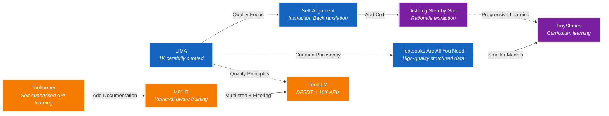

A curated list of papers on synthetic data generation for training language models, organized progressively.

</details>


## Which Approach Should You Use?

<b>Decision flowchart</b>

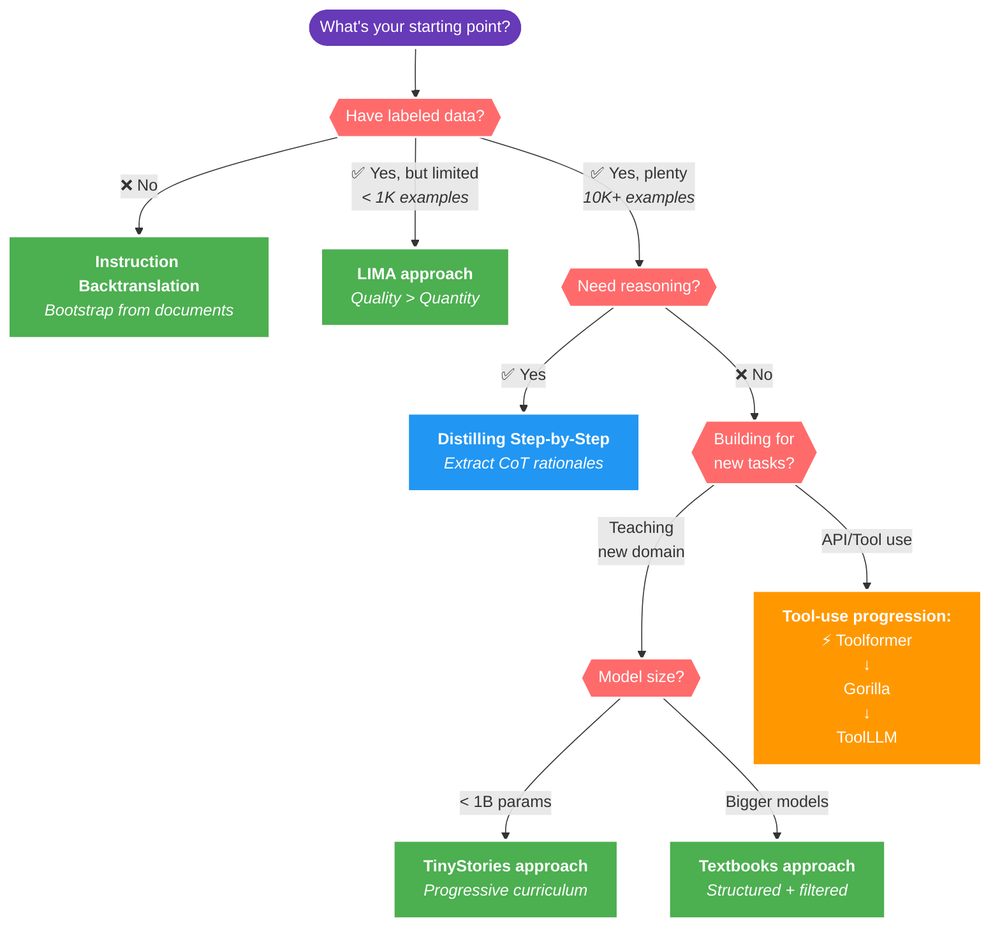

### Quick TL;DR:

Below is a very quick summary of the roamap:

- **No labeled data?** Use [**Self-Alignment with Instruction Backtranslation**](#2-self-alignment-with-instruction-backtranslation) to generate high-quality examples from raw text
- **Limited high-quality data?** Follow the [**LIMA approach**](#1-lima-less-is-more-for-alignment) with extreme curation focus
- **Need to create small reasoning model?** Apply [**Distilling Step-by-Step**](#3-distilling-step-by-step-outperforming-larger-language-models) to add CoT to your examples
- **Teaching a new domain?** Use a [**TinyStories approach**](#4-tinystories-how-small-can-language-models-be-and-still-speak-coherent-english) with progressively complex content
- **Building tools and API integrations?** Read the [**Toolformer**](#6-toolformer-language-models-can-teach-themselves-to-use-tools), add documentation like [**Gorilla**](#7-gorilla-large-language-model-connected-with-massive-apis), then apply filtering from [**ToolLLM**](#8-toolllm-facilitating-large-language-models-to-master-16000-real-world-apis)

## Contents
- [LIMA: Less Is More for Alignment](#1-lima-less-is-more-for-alignment) `#quality` `#curation`
- [Self-Alignment with Instruction Backtranslation](#2-self-alignment-with-instruction-backtranslation) `#quality` `#self-improvement`
- [Distilling Step-by-Step! Outperforming Larger Language Models](#3-distilling-step-by-step-outperforming-larger-language-models) `#reasoning` `#distillation`
- [TinyStories: How Small Can Language Models Be](#4-tinystories-how-small-can-language-models-be-and-still-speak-coherent-english) `#small-models` `#curriculum`
- [Textbooks Are All You Need](#5-textbooks-are-all-you-need) `#quality` `#progressive-learning`
- [Toolformer: Language Models Can Teach Themselves to Use Tools](#6-toolformer-language-models-can-teach-themselves-to-use-tools) `#tool-use` `#self-improvement`
- [Gorilla: Large Language Model Connected with Massive APIs](#7-gorilla-large-language-model-connected-with-massive-apis) `#tool-use` `#documentation`
- [ToolLLM: Facilitating Large Language Models to Master 16000+ Real-world APIs](#8-toolllm-facilitating-large-language-models-to-master-16000-real-world-apis) `#tool-use` `#quality-filtering`

---

For all implementations, we will show how to use the synthetic-data-kit in a minimal example. Learn how to get started [here](https://github.com/meta-llama/synthetic-data-kit/tree/main/use-cases/getting-started)

Just follow the following for quick commands:

`pip install synthetic-data-kit`

`synthetic-data-kit --help`

## 1. **LIMA: Less Is More for Alignment**

**Key idea:** How many QA examples are enough for strong results? As low as 1000 carefully curated examples show great results - focus on Curating and Quality!

> Caveat: This depends on the domain and the gap in the model's existing knowledge. However, the point is you can get great results even as low as 1000 examples are great!

**Extra ideas worth highlighting:**
- Diversity matters more than quantity - examples should span different formats and domains
- High quality curation consistently beats automated filtering approaches

<details>
<summary><b>Applying in practice</b> (click to expand)</summary>

```bash
# Create a custom config that emphasizes quality over quantity
cat > lima_config.yaml << EOF
llm:
  provider: "vllm"

vllm:
  api_base: "http://localhost:8000/v1"
  model: "meta-llama/Llama-3.3-70B-Instruct"

# Generate fewer but higher quality examples
generation:
  temperature: 0.5
  num_pairs: 30  # Start with a manageable number

# Set a high quality threshold for LIMA-style curation
curate:
  threshold: 8.5  # Only keep the highest quality examples
  batch_size: 8
```

```# Apply strict quality filtering (LIMA's core principle)
synthetic-data-kit -c lima_config.yaml curate path/to_qa_pairs.json

# Save in your preferred fine-tuning format
synthetic-data-kit -c lima_config.yaml save-as data/cleaned/document_cleaned.json -f chatml
```
</details>

**[Link to the paper](https://arxiv.org/abs/2305.11206)**

---

## 2. **Self-Alignment with Instruction Backtranslation**

**Key idea:** If you lack QA pairs and have a lot of information in various documents: You can prompt a LLM to convert your documents to QA pairs and then curate these via LLM as a judge

**Extra ideas worth highlighting:**
- Iterative self-improvement without human annotation
- Quality scoring (1-5 scale) by the model itself for curation
- Use different system prompts for seed vs generated data

<details>
<summary><b>Applying in practice</b> (click to expand)</summary>

Note: This is what synthetic-data-kit offers out of box when you `ingest` and `create` from various file formats

```bash
# Process workflow: ingest → create → curate → save-as
# 1. Convert your documents to text
synthetic-data-kit -c self_align_config.yaml ingest data/pdf/technical_document.pdf

# 2. Generate instruction-response pairs with customized prompt
synthetic-data-kit -c self_align_config.yaml create data/output/technical_document.txt -n 50

# 3. Self-critique with the LLM as judge
synthetic-data-kit -c self_align_config.yaml curate data/generated/technical_document_qa_pairs.json -t 7.5

# 4. Save in a fine-tuning format
synthetic-data-kit -c self_align_config.yaml save-as data/cleaned/technical_document_cleaned.json -f alpaca
```
</details>

**[Link to the paper](https://arxiv.org/abs/2308.06259)**

---

## 3. **Distilling Step-by-Step! Outperforming Larger Language Models**

**Key idea:** Extract Chain-of-Thought reasoning from large models to train smaller models that can outperform their teachers.

**Extra ideas worth highlighting:**
- Paper shows up to 2000x model size reduction with similar performance (Note: This obviously depends on the domain)
- Teaches smaller models rationale
- Small models can outperform their teachers with this approach

<details>
<summary><b>Applying in practice</b> (click to expand)</summary>

```bash
# Two approaches for CoT distillation:

# APPROACH 1: Generate CoT examples from scratch
# 1. Generate new CoT examples from a document
synthetic-data-kit -c cot_distill_config.yaml create data/output/reasoning_document.txt --type cot

# 2. Save in your preferred fine-tuning format
synthetic-data-kit -c cot_distill_config.yaml save-as data/generated/reasoning_document_cot_examples.json -f chatml

# APPROACH 2: Enhance existing QA pairs with CoT reasoning
# 1. First create a JSON file with conversations/QA pairs
# Example: existing_qa_pairs.json containing Q&A pairs or conversations

# 2. Enhance the existing conversations with CoT reasoning
synthetic-data-kit -c cot_distill_config.yaml create data/existing_qa_pairs.json --type cot-enhance

# 3. Save the enhanced dataset
synthetic-data-kit -c cot_distill_config.yaml save-as data/generated/existing_qa_pairs_enhanced.json -f chatml
```
</details>

**[Link to the paper](https://arxiv.org/abs/2305.02301)**

---

## 4. **TinyStories: How Small Can Language Models Be and Still Speak Coherent English?**

**Key idea:** Great idea if you're starting to teach a model from scratch or teaching it a new domain. Simplify the concepts and teach it in a progressive curriculum

**Extra ideas worth highlighting:**
- Models as small as 1M parameters can generate coherent text

<details>
<summary><b>Applying in practice</b> (click to expand)</summary>

```bash
# Create a config for TinyStories-style simple examples
cat > tiny_stories_config.yaml << EOF
llm:
  provider: "api-endpoint"

api-endpoint:
  api_base: "https://api.llama.com/v1"
  model: "Llama-3-70B-Instruct"

generation:
  temperature: 0.7
  num_pairs: 15

prompts:
  # Custom prompt for generating simple stories
  qa_generation: |
    Create {num_pairs} simple stories for teaching basic language skills.
    
    Requirements:
    1. Use only the 1500 most common English words
    2. Keep sentences short and simple (5-8 words per sentence)
    3. Each story should teach a basic concept (colors, numbers, animals, etc.)
    4. Include a simple question at the end that tests understanding
    
    Format each as a question-answer pair:
    
    [
      {
        "question": "Read this story and answer the question at the end: [STORY WITH QUESTION]",
        "answer": "Simple, clear answer using only basic vocabulary"
      }
    ]
    
    Text:
    {text}

  # Custom prompt for progressive difficulty curation
  qa_rating: |
    Rate these educational stories on a scale of 1-10 based on:
    
    - Simplicity (0-3): Uses only basic vocabulary and simple sentences
    - Educational value (0-3): Teaches a useful concept clearly
    - Engagement (0-2): Would hold a young learner's attention
    - Progression (0-2): Builds on fundamental concepts appropriately
    
    Also add a "difficulty" field rated 1-5 (1=simplest, 5=most advanced)
    
    Return as valid JSON:
    [
      {
        "question": "Original question with story",
        "answer": "Original answer",
        "rating": 8,
        "difficulty": 2
      }
    ]
    
    Stories to rate:
    {pairs}
EOF

# Generate simple TinyStories-style content
# 1. Start with a simple source document (can be anything)
synthetic-data-kit -c tiny_stories_config.yaml create data/output/source_document.txt

# 2. Rate examples including difficulty level
synthetic-data-kit -c tiny_stories_config.yaml curate data/generated/source_document_qa_pairs.json

# 3. Create a curriculum by organizing by difficulty level
# (This would require post-processing the output JSON to sort by difficulty)
mkdir -p data/curriculum/level_{1..5}

# 4. Save in a format for fine-tuning
synthetic-data-kit -c tiny_stories_config.yaml save-as data/cleaned/source_document_cleaned.json -f jsonl
```
</details>

**[Link to the paper](https://arxiv.org/abs/2305.07759)**

---

## 5. **Textbooks Are All You Need**

**Key idea:** High-quality 'textbook-style' synthetic data with careful filtering enables small models to outperform much larger ones

**Extra ideas worth highlighting:**
- Focus on teaching concepts progressively, not memorization
- Data quality and structure >> raw scale

<details>
<summary><b>Applying in practice</b> (click to expand)</summary>

```bash
# Create a config for textbook-quality data generation
cat > textbook_config.yaml << EOF
llm:
  provider: "vllm"

vllm:
  api_base: "http://localhost:8000/v1"
  model: "meta-llama/Llama-3.3-70B-Instruct"

generation:
  temperature: 0.2  # Lower temperature for more precise output
  num_pairs: 15

curate:
  threshold: 9.0  # Extremely high quality bar
  batch_size: 5   # Smaller batch for more careful evaluation

prompts:
  # Custom prompt for generating textbook-quality content
  qa_generation: |
    Create {num_pairs} high-quality textbook-style examples that explain important concepts clearly.
    
    Requirements:
    1. Structure each example as a concept explanation followed by exercise questions
    2. Include clear definitions, examples, and step-by-step reasoning
    3. Ensure explanations build on fundamental concepts before introducing complex ones
    4. Use precise, unambiguous language as found in high-quality textbooks
    
    Format as question-answer pairs:
    [
      {
        "question": "Explain concept X and solve the following problem: [PROBLEM]",
        "answer": "Detailed textbook-style explanation with step-by-step solution"
      }
    ]
    
    Text:
    {text}

  # Custom prompt for textbook-quality rating
  qa_rating: |
    Rate these educational examples on a scale of 1-10 based on:
    
    - Clarity (0-3): Is the explanation clear, precise, and unambiguous?
    - Pedagogical value (0-3): Does it build concepts progressively?
    - Accuracy (0-2): Is all information factually correct?
    - Exercise quality (0-2): Do exercises reinforce the concepts effectively?
    
    Rate EXTREMELY strictly - only the highest quality examples should score above 8.
    
    Return valid JSON with ratings:
    [
      {"question": "Original question", "answer": "Original answer", "rating": 9}
    ]
    
    Examples to rate:
    {pairs}
EOF

# Generate and curate textbook-quality content
# 1. Generate from source material or educational content
synthetic-data-kit -c textbook_config.yaml create data/output/source_material.txt

# 2. Apply extremely strict quality filtering
synthetic-data-kit -c textbook_config.yaml curate data/generated/source_material_qa_pairs.json

# 3. Save as high-quality fine-tuning data
synthetic-data-kit -c textbook_config.yaml save-as data/cleaned/source_material_cleaned.json -f chatml --storage hf
```
</details>

**[Link to the paper](https://arxiv.org/abs/2306.11644)**

---

## 6. **Toolformer: Language Models Can Teach Themselves to Use Tools**

**Key idea:** The first paper that showed models can be taught to perform API and tool calling

**Extra ideas worth highlighting:**
- Self-supervised learning of when and how to use tools
- Model decides autonomously when tools would help

**[Link to the paper](https://arxiv.org/abs/2302.04761)**

---

## 7. **Gorilla: Large Language Model Connected with Massive APIs**

**Key idea:** When performing SFT for tool calling, including documentation of the API improves the model

**Extra ideas worth highlighting:**
- Retrieval-aware training significantly reduces hallucination
- Trained on 1,600+ ML API documentations (Torch, TensorFlow, HuggingFace)
- API documentation in context is crucial for accuracy

<details>
<summary><b>Applying in practice</b> (click to expand)</summary>

```bash
# Create a config focused on API documentation
cat > gorilla_config.yaml << EOF
llm:
  provider: "vllm"

vllm:
  api_base: "http://localhost:8000/v1"
  model: "meta-llama/Llama-3.3-70B-Instruct"

generation:
  temperature: 0.3
  num_pairs: 15

curate:
  threshold: 8.0  # High bar for API accuracy
  batch_size: 10

prompts:
  # Custom rating prompt for API documentation quality
  qa_rating: |
    Rate these API usage examples on a scale from 1-10 based on:
    
    - Documentation quality (0-3): Is the API documentation clear and complete?
    - API call correctness (0-3): Is the syntax and usage correct?
    - Explanation quality (0-2): Is the explanation helpful and accurate?
    - Parameter coverage (0-2): Are parameters well explained and correctly used?
    
    Immediately reject any example where the API call doesn't match the documentation.
    
    Return valid JSON with ratings:
    [
      {"question": "Original question", "answer": "Original answer with documentation", "rating": 8}
    ]
    
    Examples to rate:
    {pairs}
    
  # Custom prompt for enhancing examples with documentation
  cot_enhancement: |
    You are enhancing API usage examples by adding detailed documentation.
    
    For each conversation, add the following to the assistant's responses:
    1. Relevant API documentation with syntax and parameter descriptions
    2. Clear explanation of why this API is appropriate
    3. Description of what each parameter does
    
    Return the enhanced conversations as a JSON array matching this format:
    [
      {
        "role": "system", 
        "content": "System message"
      },
      {
        "role": "user", 
        "content": "How do I use function X?"
      },
      {
        "role": "assistant", 
        "content": "Here's the documentation for this API:\n\n```\nfunction X(param1, param2) -> return_type\n  param1: description of param1\n  param2: description of param2\n  returns: what is returned\n```\n\nHere's how you can use it:\n\n```python\nresult = X(value1, value2)\n```\n\nThis works because [detailed explanation]..."
      }
    ]
    
    Original conversations:
    {conversations}
EOF

# Enhance existing examples with documentation using cot-enhance
# 1. First prepare a JSON file with basic API usage examples (without detailed docs)
# Example: api_examples.json with basic Q&A pairs about APIs

# 2. Enhance these examples by adding detailed documentation
synthetic-data-kit -c gorilla_config.yaml create data/api_examples.json --type cot-enhance

# 3. Save the enhanced dataset
synthetic-data-kit -c gorilla_config.yaml save-as data/generated/api_examples_enhanced.json -f chatml
```
</details>

**[Link to the paper](https://arxiv.org/abs/2305.15334)**

---

## 8. **ToolLLM: Facilitating Large Language Models to Master 16000+ Real-world APIs**

**Key idea:** Combines insights from Toolformer & Gorilla, introduces DFSDT to generate and filter high-quality multi-step tool-use examples

**Extra ideas worth highlighting:**
- DFSDT prevents error cascading in complex multi-step tasks
- Covers 16k real-world REST APIs across 49 categories
- Automatic evaluation framework (ToolEval) for tool-use capabilities

**[Link to the paper](https://arxiv.org/abs/2307.16789)**

---

## Contributing

This is a living document intended to curate synthetic data generation techniques for LLMs. We welcome contributions!


================================================
FILE: use-cases/getting-started/README.md
================================================
# Getting Started with Synthetic Data Kit: Onboarding Guide

Welcome to the Getting Started guide for Synthetic Data Kit, a comprehensive toolkit for creating high-quality synthetic datasets for fine-tuning Large Language Models.

## Prerequisites

To follow this guide, you'll need:

1. Python 3.8 or later
2. Access to an LLM via local VLLM server
3. The Synthetic Data Kit package (installation instructions below)

## 1. Installation

Install Synthetic Data Kit using pip:

```bash
pip install synthetic-data-kit
```

## 2. Setting Up Directory Structure

Create the necessary directory structure:

```bash
# New recommended 4-stage pipeline structure
mkdir -p data/{input,parsed,generated,curated,final}

# Or use the legacy structure (still supported)
mkdir -p data/{pdf,html,youtube,docx,ppt,txt,output,generated,cleaned,final}
```

## 3. Start VLLM Server (Required)

Synthetic Data Kit requires a running VLLM server. Start one with:

```bash
# If you have the Llama 3 model:
vllm serve meta-llama/Llama-3.3-70B-Instruct --port 8000

# Alternatively, you can use a smaller model:
vllm serve meta-llama/Llama-3.1-8B-Instruct --port 8000
```

## 4. Basic Workflow with Examples

Let's go through the process of converting documents to training data. You can process individual files or entire directories:

### Step 1: Verify VLLM Server

First, check if the VLLM server is running:

```bash
synthetic-data-kit system-check
```

You should see a success message if the server is running.

### Step 2: Parse Documents

#### Single File Processing:
```bash
synthetic-data-kit ingest example_document.pdf
```
This saves the extracted text to `data/parsed/example_document.txt`.

#### Directory Processing (New):
```bash
# Place all your documents in data/input/
synthetic-data-kit ingest ./data/input/
```
This processes all supported files (.pdf, .html, .docx, .pptx, .txt) and saves parsed text to `data/parsed/`.

#### Preview Before Processing:
```bash
# See what files would be processed
synthetic-data-kit ingest ./data/input/ --preview
```

### Step 3: Generate QA Pairs

#### Single File:
```bash
synthetic-data-kit create data/parsed/example_document.txt
```
This creates QA pairs in `data/generated/example_document_qa_pairs.json`.

#### Directory Processing:
```bash
# Generate QA pairs for all parsed documents
synthetic-data-kit create ./data/parsed/ --type qa
```
This processes all .txt files and saves QA pairs to `data/generated/`.

### Step 4: Filter for Quality

#### Single File:
```bash
synthetic-data-kit curate data/generated/example_document_qa_pairs.json
```
This saves the filtered content to `data/curated/example_document_cleaned.json`.

#### Directory Processing:
```bash
# Curate all generated files
synthetic-data-kit curate ./data/generated/ --threshold 8.0
```
This processes all .json files and saves curated content to `data/curated/`.

### Step 5: Convert to Fine-tuning Format

#### Single File:
```bash
synthetic-data-kit save-as data/curated/example_document_cleaned.json -f ft
```
The final output will be saved in `data/final/example_document_ft.json` in OpenAI fine-tuning format.

#### Directory Processing:
```bash
# Convert all curated files to training format
synthetic-data-kit save-as ./data/curated/ -f ft
```
This processes all .json files and saves final training data to `data/final/`.

### Step 6: View the Results

You can examine each output to understand the transformation process:

```bash
# View extracted text
cat data/parsed/example_document.txt | head -n 20

# View generated QA pairs
cat data/generated/example_document_qa_pairs.json | head -n 50

# View filtered pairs
cat data/curated/example_document_cleaned.json | head -n 50

# View final fine-tuning format
cat data/final/example_document_ft.json | head -n 50
```

## 5. Command-Line Customization

Synthetic Data Kit supports various command-line options to customize its behavior. Here's how to use them:

### Controlling QA Pair Generation

Generate a specific number of QA pairs:

```bash
# Single file
synthetic-data-kit create data/parsed/example_document.txt -n 30

# Directory processing
synthetic-data-kit create ./data/parsed/ --type qa -n 30
```

Generate Chain of Thought (CoT) reasoning examples instead of QA pairs:

```bash
# Single file
synthetic-data-kit create data/parsed/example_document.txt --type cot

# Directory processing
synthetic-data-kit create ./data/parsed/ --type cot
```

Enhance tool-use conversations with Chain of Thought reasoning:

```bash
synthetic-data-kit create tool_conversations.json --type cot-enhance
```

## 5.1. Document Processing & Chunking Control

The Synthetic Data Kit automatically handles documents of any size using intelligent processing:

### How Chunking Works

- **Small documents** (< 8000 characters): Processed in a single API call for maximum context
- **Large documents** (≥ 8000 characters): Automatically split into overlapping chunks

### Controlling Chunking with CLI Flags

Use `--chunk-size` and `--chunk-overlap` to customize how large documents are processed:

```bash
# Smaller chunks for detailed processing
synthetic-data-kit create data/output/large_document.txt --chunk-size 2000 --chunk-overlap 100

# Larger chunks for faster processing with more context
synthetic-data-kit create data/output/large_document.txt --chunk-size 6000 --chunk-overlap 300

# Generate many examples with custom chunking
synthetic-data-kit create data/output/large_document.txt --type cot --num-pairs 50 --chunk-size 3000
```

### Understanding Chunking Output

Use `--verbose` to see how your documents are being processed:

```bash
# Single file verbose output
synthetic-data-kit create data/parsed/large_document.txt --type qa --num-pairs 20 --verbose

# Directory verbose output
synthetic-data-kit create ./data/parsed/ --type qa --num-pairs 20 --verbose
```

Example output:
```
# Single file output
Generating QA pairs...
Document split into 8 chunks
Using batch size of 32
Processing 8 chunks to generate QA pairs...
  Generated 3 pairs from chunk 1 (total: 3/20)
  Generated 2 pairs from chunk 2 (total: 5/20)
  Generated 3 pairs from chunk 3 (total: 8/20)
  ...
  Reached target of 20 pairs. Stopping processing.
Generated 20 QA pairs total (requested: 20)

# Directory output
Processing directory: ./data/parsed/
Supported files: 5 (.txt files)
Progress: ████████████████████████████████████████ 100% (5/5 files)
✓ document1.txt: Generated 20 QA pairs
✓ document2.txt: Generated 18 QA pairs
✗ document3.txt: Failed - Invalid format
✓ document4.txt: Generated 20 QA pairs
✓ document5.txt: Generated 15 QA pairs

Processing Summary:
Total files: 5
Successful: 4
Failed: 1
Total pairs generated: 73
```

### Chunking Parameters Guide

| Parameter | Default | Best For | Description |
|-----------|---------|----------|-------------|
| `--chunk-size 2000` | 4000 | Detailed analysis | More chunks, slower but detailed |
| `--chunk-size 6000` | 4000 | Fast processing | Fewer chunks, faster processing |
| `--chunk-overlap 50` | 200 | Reducing repetition | Minimal overlap between chunks |
| `--chunk-overlap 400` | 200 | Preserving context | Maximum context preservation |

### Content Type Consistency

Both QA and CoT generation use the same chunking logic for consistent behavior:

```bash
# Single file processing
synthetic-data-kit create large_doc.txt --type qa --num-pairs 100 --chunk-size 3000
synthetic-data-kit create large_doc.txt --type cot --num-pairs 20 --chunk-size 3000

# Directory processing
synthetic-data-kit create ./data/parsed/ --type qa --num-pairs 100 --chunk-size 3000
synthetic-data-kit create ./data/parsed/ --type cot --num-pairs 20 --chunk-size 3000
```

### Customizing Quality Thresholds

Apply a stricter quality threshold during curation:

```bash
# Single file
synthetic-data-kit curate data/generated/example_document_qa_pairs.json -t 8.5

# Directory processing
synthetic-data-kit curate ./data/generated/ -t 8.5
```

Enable verbose output to see detailed quality ratings:

```bash
# Single file
synthetic-data-kit curate data/generated/example_document_qa_pairs.json -v

# Directory processing
synthetic-data-kit curate ./data/generated/ -v
```

### Specifying Output Formats

Convert to ChatML format:

```bash
# Single file
synthetic-data-kit save-as data/curated/example_document_cleaned.json -f chatml

# Directory processing
synthetic-data-kit save-as ./data/curated/ -f chatml
```

Save as a Hugging Face dataset (Arrow format):

```bash
# Single file
synthetic-data-kit save-as data/curated/example_document_cleaned.json -f ft --storage hf

# Directory processing
synthetic-data-kit save-as ./data/curated/ -f ft --storage hf
```

## 6. Configuration File Customization

While command-line options are convenient, configuration files provide more extensive customization. Let's create a custom configuration:

### Creating a Custom Configuration

Create a file named `custom_config.yaml` with the following content:

```yaml
# Custom configuration for document processing
vllm:
  api_base: "http://localhost:8000/v1"
  model: "meta-llama/Llama-3.3-70B-Instruct"
  max_retries: 3
  retry_delay: 1.0
  sleep_time: 0.1   # Small delay in seconds between batches to avoid rate limits

generation:
  temperature: 0.5   # Lower temperature for more deterministic outputs
  top_p: 0.95
  max_context_length: 8000  # Context Length of the MODEL. Useful while Generating Summary
  
  # Document processing strategy
  processing_strategy: "auto"     # "auto", "single", or "chunking"
  single_call_max_size: 8000      # Documents smaller than this use single call
  
  # Chunking configuration for large documents
  chunk_size: 3000   # Smaller chunks for better processing
  overlap: 300       # More overlap to maintain context
  
  # Generation targets
  num_pairs: 40      # Generate more pairs
  num_cot_examples: 10  # Generate more CoT examples
  
  # Model parameters
  max_tokens: 4096
  batch_size: 32
  
  # Quality settings  
  enable_deduplication: true    # Remove similar questions
  similarity_threshold: 0.8     # How similar is considered duplicate

curate:
  threshold: 8.0     # Higher quality threshold
  batch_size: 16     # Smaller batch size for more detailed processing
  temperature: 0.05  # Lower temperature for more consistent ratings

format:
  default: "ft"      # Default to fine-tuning format
  include_metadata: true
  pretty_json: true

prompts:
  qa_generation: |
    Create {num_pairs} high-quality question-answer pairs about this document.
    
    Focus on questions that:
    1. Test understanding of key concepts
    2. Include important details and examples
    3. Cover main topics comprehensively
    
    Return only the JSON:
    [
      {{
        "question": "Specific question?",
        "answer": "Detailed answer."
      }}
    ]
    
    Text:
    {text}
```

### Using Custom Configuration

Use the custom configuration with any command:

```bash
# Ingest with custom config
synthetic-data-kit -c custom_config.yaml ingest example_document.pdf

# Create with custom config
synthetic-data-kit -c custom_config.yaml create data/output/example_document.txt

# Curate with custom config
synthetic-data-kit -c custom_config.yaml curate data/generated/example_document_qa_pairs.json

# Save with custom config
synthetic-data-kit -c custom_config.yaml save-as data/cleaned/example_document_cleaned.json -f ft
```

## 7. Advanced Command Combinations

You can combine custom configuration with command-line options to override specific settings:

```bash
# Use custom config but override number of pairs
synthetic-data-kit -c custom_config.yaml create data/output/example_document.txt -n 50

# Use custom config but save in a different format
synthetic-data-kit -c custom_config.yaml save-as data/cleaned/example_document_cleaned.json -f chatml
```

## 8. Processing Multiple Documents

### Directory Processing (Recommended)

Process entire directories with a single command:

```bash
# Complete pipeline for directory processing
synthetic-data-kit -c custom_config.yaml ingest ./data/input/
synthetic-data-kit -c custom_config.yaml create ./data/parsed/ --type qa -n 20
synthetic-data-kit -c custom_config.yaml curate ./data/generated/ -t 7.5
synthetic-data-kit -c custom_config.yaml save-as ./data/curated/ -f ft
```

### Legacy Batch Processing (Still Supported)

For more control, you can use a shell script:

```bash
#!/bin/bash
# batch_process.sh

# Process all PDFs in a directory
for file in data/pdf/*.pdf; do
  filename=$(basename "$file" .pdf)
  
  # Full pipeline with custom config
  synthetic-data-kit -c custom_config.yaml ingest "$file"
  synthetic-data-kit -c custom_config.yaml create "data/parsed/${filename}.txt" -n 20
  synthetic-data-kit -c custom_config.yaml curate "data/generated/${filename}_qa_pairs.json" -t 7.5
  synthetic-data-kit -c custom_config.yaml save-as "data/curated/${filename}_cleaned.json" -f ft
done
```

## 9. Customizing Output Location

Specify custom output directories and filenames:

```bash
# Custom output directory for parsed text
synthetic-data-kit ingest example_document.pdf -o custom_output/

# Custom output file for curation (single file only)
synthetic-data-kit curate data/generated/example_document_qa_pairs.json -o custom_output/high_quality.json

# Preview custom processing
synthetic-data-kit ingest ./documents --preview
synthetic-data-kit create ./custom_input/ --preview
```

## 10. Troubleshooting Common Issues

### Chunking Problems

**Problem**: Getting fewer items than requested
- **Cause**: Document too small or chunks don't contain enough content
- **Solution**: Try smaller `--num-pairs` or combine multiple documents

**Problem**: Repetitive or similar questions
- **Cause**: High chunk overlap causing similar content to be processed multiple times
- **Solution**: Reduce overlap or increase chunk size
```bash
synthetic-data-kit create document.txt --chunk-overlap 50 --chunk-size 5000
```

**Problem**: Poor quality questions across chunks  
- **Cause**: Chunks too small, losing important context
- **Solution**: Increase chunk size to preserve more context
```bash
synthetic-data-kit create document.txt --chunk-size 6000
```

**Problem**: Processing takes too long
- **Cause**: Document creates too many small chunks
- **Solution**: Use larger chunks to reduce processing time
```bash
synthetic-data-kit create document.txt --chunk-size 8000 --num-pairs 20
```

**Problem**: Want to understand what's happening
- **Solution**: Use verbose mode to see chunking details
```bash
synthetic-data-kit create document.txt --verbose
```

### Performance Tips

- **Small documents** (< 8000 chars): Let the tool use single-call processing automatically
- **Medium documents** (8000-50000 chars): Use default settings (`--chunk-size 4000`)
- **Large documents** (> 50000 chars): Consider larger chunks (`--chunk-size 6000-8000`)
- **Very large documents**: Process in smaller batches with fewer `--num-pairs` per run
- **Directory processing**: Use `--preview` to estimate processing time before running
- **Large directories**: Consider processing in smaller subdirectories if you encounter memory issues

## Next Steps

For specific use cases and real-world examples, explore the [Use Cases](../Readme.md) section, including:

- Enhancing tool-use conversations with Chain of Thought reasoning
- Creating specialized datasets for different domains
- Advanced customization techniques

After working through this guide, refer to the project's main [README.md](../../ReadMe.MD) and [DOCS.md](../../DOCS.md) for complete documentation of all features and capabilities of the Synthetic Data Kit.


================================================
FILE: .github/PULL_REQUEST_TEMPLATE.md
================================================
# Pull Request

## Description

Please share details of what you have added and why?

Fixes # (issue)

## Type of change

Please non-releavant options

- [ ] Bug fix (non-breaking change which fixes an issue)
- [ ] New feature (non-breaking change which adds functionality)
- [ ] Breaking change
- [ ] Documentation update


================================================
FILE: .github/ISSUE_TEMPLATE/bug.yml
================================================
name: Bug Report
description: File a bug report
title: "[Bug]: "
labels: ["bug", "triage"]
body:
  - type: markdown
    attributes:
      value: |
        Thanks for taking the time to fill out this bug report!
  - type: input
    id: version
    attributes:
      label: Version
      description: What version of synthetic-data-kit are you running?
      placeholder: ex. 0.0.4b2
    validations:
      required: true
  - type: dropdown
    id: os
    attributes:
      label: Operating System
      description: What operating system are you seeing the problem on?
      options:
        - Windows
        - macOS
        - Linux
        - Other
    validations:
      required: true
  - type: dropdown
    id: python
    attributes:
      label: Python Version
      description: What Python version are you using?
      options:
        - 3.8
        - 3.9
        - 3.10
        - 3.11
        - 3.12
        - Other
    validations:
      required: true
  - type: textarea
    id: what-happened
    attributes:
      label: What happened?
      description: Also tell us, what did you expect to happen?
      placeholder: Tell us what you see!
    validations:
      required: true
  - type: textarea
    id: logs
    attributes:
      label: Relevant log output
      description: Please copy and paste any relevant log output. This will be automatically formatted into code, so no need for backticks.
      render: shell
  - type: textarea
    id: reproduce
    attributes:
      label: Steps to reproduce
      description: Please provide detailed steps to reproduce the issue
      placeholder: |
        1. Run command '...'
        2. With input '...'
        3. See error '...'
    validations:
      required: true


================================================
FILE: .github/ISSUE_TEMPLATE/config.yml
================================================
blank_issues_enabled: false
contact_links:
  - name: Documentation
    url: https://github.com/meta-llama/synthetic-data-kit#readme
    about: Check the documentation for answers to common questions
  - name: Getting Started
    url: https://github.com/meta-llama/synthetic-data-kit/blob/main/getting-started/README.md
    about: Read the getting started guide for quick setup instructions


================================================
FILE: .github/ISSUE_TEMPLATE/feature-request.yml
================================================
name: Feature Request
description: Suggest an idea for this project
title: "[Feature]: "
labels: ["enhancement"]
body:
  - type: markdown
    attributes:
      value: |
        Thanks for taking the time to suggest a new feature!
  - type: textarea
    id: problem
    attributes:
      label: Is your feature request related to a problem? Please describe.
      description: A clear and concise description of what the problem is.
      placeholder: I'm always frustrated when [...]
    validations:
      required: true
  - type: textarea
    id: solution
    attributes:
      label: Describe the solution you'd like
      description: A clear and concise description of what you want to happen.
    validations:
      required: true
  - type: textarea
    id: alternatives
    attributes:
      label: Describe alternatives you've considered
      description: A clear and concise description of any alternative solutions or features you've considered.
  - type: textarea
    id: context
    attributes:
      label: Additional context
      description: Add any other context or screenshots about the feature request here.


================================================
FILE: .github/workflows/ci.yml
================================================
name: CI

on:
  push:
    branches: [ main ]
  pull_request:
    branches: [ main ]

permissions:
  contents: read
  checks: write
  pull-requests: write

jobs:
  lint:
    runs-on: ubuntu-latest
    steps:
    - uses: actions/checkout@v4

    - name: Set up Python
      uses: actions/setup-python@v5
      with:
        python-version: '3.10'
        cache: 'pip'

    - name: Cache pip dependencies
      uses: actions/cache@v4
      with:
        path: ~/.cache/pip
        key: ${{ runner.os }}-lint-pip-${{ hashFiles('pyproject.toml') }}
        restore-keys: |
          ${{ runner.os }}-lint-pip-

    - name: Install dependencies
      run: |
        python -m pip install --upgrade pip
        pip install -e .[dev]

    - name: Install pre-commit
      run: pip install pre-commit

    - name: Cache pre-commit
      uses: actions/cache@v4
      with:
        path: ~/.cache/pre-commit
        key: ${{ runner.os }}-pre-commit-${{ hashFiles('.pre-commit-config.yaml') }}
        restore-keys: |
          ${{ runner.os }}-pre-commit-

    - name: Run pre-commit
      run: pre-commit run --all-files

    - name: Run ruff (fallback)
      if: failure()
      run: |
        ruff check synthetic_data_kit tests
        ruff format --check synthetic_data_kit tests

  test:
    runs-on: ubuntu-latest
    strategy:
      matrix:
        python-version: ['3.8', '3.9', '3.10', '3.11', '3.12']

    steps:
    - uses: actions/checkout@v4

    - name: Set up Python ${{ matrix.python-version }}
      uses: actions/setup-python@v5
      with:
        python-version: ${{ matrix.python-version }}
        cache: 'pip'

    - name: Cache pip dependencies
      uses: actions/cache@v4
      with:
        path: ~/.cache/pip
        key: ${{ runner.os }}-test-pip-${{ matrix.python-version }}-${{ hashFiles('pyproject.toml') }}
        restore-keys: |
          ${{ runner.os }}-test-pip-${{ matrix.python-version }}-
          ${{ runner.os }}-test-pip-

    - name: Install dependencies
      run: |
        python -m pip install --upgrade pip
        pip install -e .[dev]

    - name: Run tests with coverage
      env:
        PROJECT_TEST_ENV: "1"
        API_ENDPOINT_KEY: "mock-api-key-for-testing"
      run: |
        synthetic-data-kit system-check
        synthetic-data-kit --help        
        pytest --cov=synthetic_data_kit --cov-report=xml --cov-report=term tests/


================================================
FILE: .github/workflows/pr-test.yml
================================================
name: PR Tests

on:
  pull_request:
    branches: [ main ]

permissions:
  contents: read
  pull-requests: write

jobs:
  test-pr:
    runs-on: ubuntu-latest
    steps:
    - uses: actions/checkout@v4

    - name: Set up Python
      uses: actions/setup-python@v5
      with:
        python-version: '3.10'
        cache: 'pip'

    - name: Install dependencies
      run: |
        python -m pip install --upgrade pip
        pip install -e .[dev]

    - name: Lint code
      run: |
        ruff check synthetic_data_kit tests
        ruff format --check synthetic_data_kit tests

    - name: Run tests
      env:
        PROJECT_TEST_ENV: "1"
        API_ENDPOINT_KEY: "mock-api-key-for-testing"
      run: |
        pytest tests/

    - name: Run coverage check
      env:
        PROJECT_TEST_ENV: "1"
        API_ENDPOINT_KEY: "mock-api-key-for-testing"
      run: |
        pytest --cov=synthetic_data_kit --cov-report=term-missing tests/

    - name: Comment PR with Results
      uses: actions/github-script@v7
      if: always()
      with:
        github-token: ${{ secrets.GITHUB_TOKEN }}
        script: |
          const fs = require('fs');
          const testResults = process.env.TEST_RESULTS || 'Test results not available';

          let comment = `## PR Test Results

          ### Lint Status: ${{ job.status == 'success' ? '✅ Passed' : '❌ Failed' }}

          ### Test Status: ${{ job.status == 'success' ? '✅ Passed' : '❌ Failed' }}

          Please make sure all tests pass before merging this PR.
          `;

          github.rest.issues.createComment({
            issue_number: context.issue.number,
            owner: context.repo.owner,
            repo: context.repo.repo,
            body: comment
          });


================================================
FILE: .github/workflows/publish.yml
================================================
name: Publish to PyPI

on:
  release:
    types: [created]
  workflow_dispatch:
    inputs:
      confirm_publish:
        description: 'Confirm publishing to PyPI'
        required: true
        default: 'no'
        type: choice
        options:
          - 'yes'
          - 'no'

permissions:
  contents: read
  id-token: write  # For trusted publishing to PyPI

jobs:
  deploy:
    runs-on: ubuntu-latest
    steps:
    - uses: actions/checkout@v4
      with:
        fetch-depth: 0

    - name: Set up Python
      uses: actions/setup-python@v5
      with:
        python-version: '3.10'
        cache: 'pip'

    - name: Install dependencies
      run: |
        python -m pip install --upgrade pip
        pip install build twine

    - name: Verify version
      run: |
        # Extract version from pyproject.toml
        VERSION=$(grep -m 1 'version' pyproject.toml | cut -d '"' -f 2)
        echo "Package version: $VERSION"

        # Check if this version already exists on PyPI
        if pip index versions synthetic-data-kit 2>/dev/null | grep -q "$VERSION"; then
          echo "Error: Version $VERSION already exists on PyPI"
          exit 1
        fi
        echo "Version check passed: $VERSION is not on PyPI yet"

    - name: Build package
      run: python -m build

    - name: Check package
      run: twine check dist/*

    - name: Publish to PyPI
      if: github.event_name == 'release' || github.event.inputs.confirm_publish == 'yes'
      env:
        TWINE_USERNAME: ${{ secrets.PYPI_USERNAME }}
        TWINE_PASSWORD: ${{ secrets.PYPI_API_TOKEN }}
      run: twine upload dist/*
