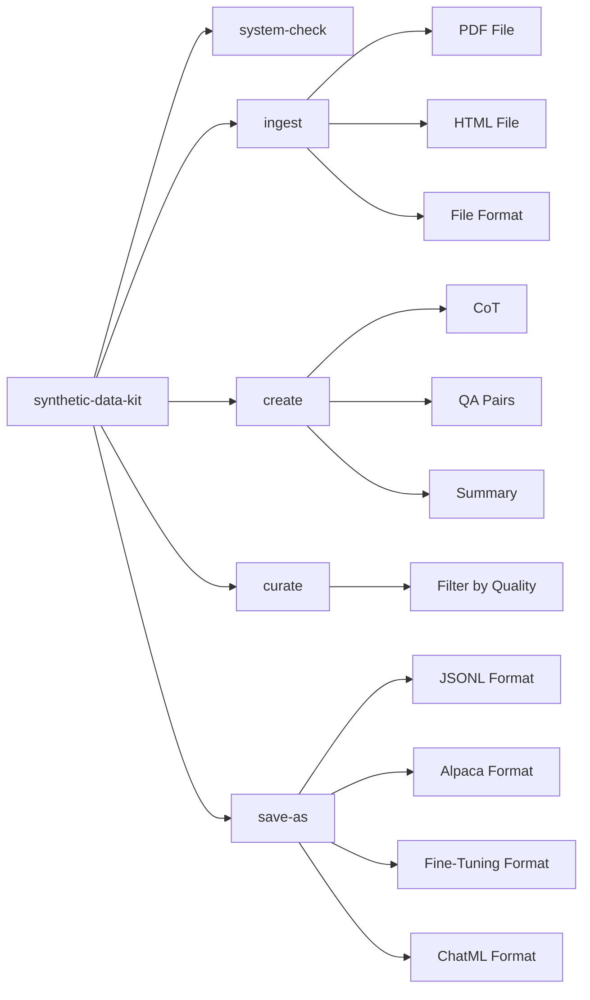

Directory structure:
└── meta-llama-synthetic-data-kit/
    ├── README.md
    ├── configs/
    │   └── config.yaml
    ├── synthetic_data_kit/
    │   ├── __init__.py
    │   ├── cli.py
    │   ├── config.yaml
    │   ├── core/
    │   │   ├── __init__.py
    │   │   ├── context.py
    │   │   ├── create.py
    │   │   ├── curate.py
    │   │   ├── ingest.py
    │   │   └── save_as.py
    │   ├── generators/
    │   │   ├── __init__.py
    │   │   ├── cot_generator.py
    │   │   ├── multimodal_qa_generator.py
    │   │   ├── qa_generator.py
    │   │   └── vqa_generator.py
    │   ├── models/
    │   │   ├── __init__.py
    │   │   └── llm_client.py
    │   ├── parsers/
    │   │   ├── __init__.py
    │   │   ├── docx_parser.py
    │   │   ├── html_parser.py
    │   │   ├── multimodal_parser.py
    │   │   ├── pdf_parser.py
    │   │   ├── ppt_parser.py
    │   │   ├── txt_parser.py
    │   │   └── youtube_parser.py
    │   ├── server/
    │   │   ├── __init__.py
    │   │   ├── app.py
    │   │   └── templates/
    │   │       ├── base.html
    │   │       ├── create.html
    │   │       ├── curate.html
    │   │       ├── files.html
    │   │       ├── index.html
    │   │       ├── ingest.html
    │   │       ├── upload.html
    │   │       └── view_file.html
    │   └── utils/
    │       ├── __init__.py
    │       ├── config.py
    │       ├── directory_processor.py
    │       ├── format_converter.py
    │       ├── lance_utils.py
    │       ├── llm_processing.py
    │       └── text.py
    ├── tests/
    │   └── README.md
    └── use-cases/
        ├── README.md
        ├── adding_reasoning_to_llama_3/
        │   └── README.md
        └── getting-started/
            └── README.md


================================================
FILE: README.md
================================================
# Synthetic Data Kit

Tool for generating high-quality synthetic datasets to fine-tune LLMs.

Generate Reasoning Traces, QA Pairs, save them to a fine-tuning format with a simple CLI.

> [Checkout our guide on using the tool to unlock task-specific reasoning in Llama-3 family](https://github.com/meta-llama/synthetic-data-kit/tree/main/use-cases/adding_reasoning_to_llama_3)

# What does Synthetic Data Kit offer? 

Fine-Tuning Large Language Models is easy. There are many mature tools that you can use to fine-tune Llama model family using various post-training techniques.

### Why target data preparation?

Multiple tools support standardized formats. However, most of the times your dataset is not structured in "user", "assistant" threads or in a certain format that plays well with a fine-tuning packages. 

This toolkit simplifies the journey of:

- Using a LLM (vLLM or any local/external API endpoint) to generate examples
- Modular 4 command flow
- Converting your existing files to fine-tuning friendly formats
- Creating synthetic datasets
- Supporting various formats of post-training fine-tuning

# How does Synthetic Data Kit offer it? 

The tool is designed to follow a simple CLI structure with 4 commands:

- `ingest` various file formats
- `create` your fine-tuning format: `QA` pairs, `QA` pairs with CoT, `summary` format
- `curate`: Using Llama as a judge to curate high quality examples. 
- `save-as`: After that you can simply save these to a format that your fine-tuning workflow requires.

You can override any parameter or detail by either using the CLI or overriding the default YAML config.


### Installation

#### From PyPI

```bash
# Create a new environment

conda create -n synthetic-data python=3.10 

conda activate synthetic-data

pip install synthetic-data-kit
```

#### (Alternatively) From Source

```bash
git clone https://github.com/meta-llama/synthetic-data-kit.git
cd synthetic-data-kit
pip install -e .
```

To get an overview of commands type: 

`synthetic-data-kit --help`

### 1. Tool Setup

- The tool can process both individual files and entire directories.

```bash
# Create directory structure for the 4-stage pipeline
mkdir -p data/{input,parsed,generated,curated,final}

# Or use the legacy structure (still supported)
mkdir -p data/{pdf,html,youtube,docx,ppt,txt,output,generated,cleaned,final}
```

- You also need a LLM backend that you will utilize for generating your dataset, if using vLLM:

```bash
# Start vLLM server
# Note you will need to grab your HF Authentication from: https://huggingface.co/settings/tokens
vllm serve meta-llama/Llama-3.3-70B-Instruct --port 8000
```

### 2. Usage

The flow follows 4 simple steps: `ingest`, `create`, `curate`, `save-as`. You can process individual files or entire directories. All data is now stored in Lance format by default.

```bash
# Check if your backend is running
synthetic-data-kit system-check

# SINGLE FILE PROCESSING (Original approach)
# Parse a document to a Lance dataset
synthetic-data-kit ingest docs/report.pdf
# This saves file to data/parsed/report.lance

# Generate QA pairs (default)
synthetic-data-kit create data/parsed/report.lance --type qa

OR 

# Generate Chain of Thought (CoT) reasoning examples
synthetic-data-kit create data/parsed/report.txt --type cot

# Both of these save file to data/generated/report_qa_pairs.json

# Filter content based on quality
synthetic-data-kit curate data/generated/report_qa_pairs.json

# Convert to alpaca fine-tuning format and save as HF arrow file
synthetic-data-kit save-as data/curated/report_cleaned.json --format alpaca --storage hf
```

### 2.1 Batch Directory Processing (New)

Process entire directories of files with a single command:

```bash
# Parse all documents in a directory
synthetic-data-kit ingest ./documents/
# Processes all .pdf, .html, .docx, .pptx, .txt files
# Saves parsed text files to data/parsed/

# Generate QA pairs for all text files
synthetic-data-kit create ./data/parsed/ --type qa
# Processes all .txt files in the directory
# Saves QA pairs to data/generated/

# Curate all generated files
synthetic-data-kit curate ./data/generated/ --threshold 8.0
# Processes all .json files in the directory
# Saves curated files to data/curated/

# Convert all curated files to training format
synthetic-data-kit save-as ./data/curated/ --format alpaca
# Processes all .json files in the directory
# Saves final files to data/final/
```

### 2.2 Preview Mode

Use `--preview` to see what files would be processed without actually processing them:

```bash
# Preview files before processing
synthetic-data-kit ingest ./documents --preview
# Shows: directory stats, file counts by extension, list of files

synthetic-data-kit create ./data/parsed --preview
# Shows: .txt files that would be processed
```
## Configuration

The toolkit uses a YAML configuration file (default: `configs/config.yaml`).

Note, this can be overridden via either CLI arguments OR passing a custom YAML file

```yaml
# Example configuration using vLLM
llm:
  provider: "vllm"

vllm:
  api_base: "http://localhost:8000/v1"
  model: "meta-llama/Llama-3.3-70B-Instruct"
  sleep_time: 0.1

generation:
  temperature: 0.7
  chunk_size: 4000
  num_pairs: 25
  max_context_length: 8000

curate:
  threshold: 7.0
  batch_size: 8
```

or using an API endpoint:

```yaml
# Example configuration using the llama API
llm:
  provider: "api-endpoint"

api-endpoint:
  api_base: "https://api.llama.com/v1"
  api_key: "llama-api-key"
  model: "Llama-4-Maverick-17B-128E-Instruct-FP8"
  sleep_time: 0.5
```

### Customizing Configuration

Create a overriding configuration file and use it with the `-c` flag:

```bash
synthetic-data-kit -c my_config.yaml ingest docs/paper.pdf
```

## Examples

### Processing a Single PDF Document

```bash
# Ingest PDF
synthetic-data-kit ingest research_paper.pdf

# Generate QA pairs
synthetic-data-kit create data/parsed/research_paper.txt -n 30

# Curate data
synthetic-data-kit curate data/generated/research_paper_qa_pairs.json -t 8.5

# Save in OpenAI fine-tuning format (JSON)
synthetic-data-kit save-as data/curated/research_paper_cleaned.json -f ft

# Save in OpenAI fine-tuning format (HF dataset)
synthetic-data-kit save-as data/curated/research_paper_cleaned.json -f ft --storage hf
```

### Processing Multiple Documents (Directory)

```bash
# Process all research papers in a directory
synthetic-data-kit ingest ./research_papers/

# Generate QA pairs for all parsed documents
synthetic-data-kit create ./data/parsed/ --type qa -n 30

# Curate all generated files
synthetic-data-kit curate ./data/generated/ -t 8.5

# Save all curated files in OpenAI fine-tuning format
synthetic-data-kit save-as ./data/curated/ -f ft --storage hf
```

### Preview Before Processing

```bash
# See what files would be processed
synthetic-data-kit ingest ./research_papers --preview
# Output:
# Directory: ./research_papers
# Total files: 15
# Supported files: 12
# Extensions: .pdf (8), .docx (3), .txt (1)
# Files: paper1.pdf, paper2.pdf, ...

# Preview with verbose output
synthetic-data-kit create ./data/parsed --preview --verbose
```

### Processing a YouTube Video

```bash
# Extract transcript
synthetic-data-kit ingest "https://www.youtube.com/watch?v=dQw4w9WgXcQ"

# Generate QA pairs with specific model
synthetic_data_kit create data/parsed/youtube_dQw4w9WgXcQ.lance
```

### Multimodal Usage

The tool can also handle multimodal data, extracting both text and images from documents.

```bash
# Ingest a PDF with multimodal support
synthetic-data-kit ingest docs/report.pdf --multimodal

# This will create a Lance dataset at data/parsed/report.lance
# with 'text' and 'image' columns.

# Generate multimodal-qa pairs from the ingested data
synthetic-data-kit create data/parsed/report.lance --type multimodal-qa
```

### Processing Multiple Files

```bash
# NEW: Process entire directories (recommended)
synthetic-data-kit ingest ./data/input/
synthetic-data-kit create ./data/parsed/ --type qa -n 20
synthetic-data-kit curate ./data/generated/ -t 7.5
synthetic-data-kit save-as ./data/curated/ -f chatml

# LEGACY: Bash script to process multiple files (still supported)
for file in data/pdf/*.pdf; do
  filename=$(basename "$file" .pdf)
  
  synthetic-data-kit ingest "$file"
  synthetic-data-kit create "data/parsed/${filename}.txt" -n 20
  synthetic-data-kit curate "data/generated/${filename}_qa_pairs.json" -t 7.5
  synthetic-data-kit save-as "data/curated/${filename}_cleaned.json" -f chatml
done
```

## Document Processing & Chunking

### How Chunking Works

The Synthetic Data Kit automatically handles documents of any size using an intelligent processing strategy:

- **Small documents** (< 8000 characters): Processed in a single API call for maximum context and quality
- **Large documents** (≥ 8000 characters): Automatically split into chunks with overlap to maintain context

### Controlling Chunking Behavior

You can customize chunking with CLI flags or config settings for both single files and directories:

```bash
# Single file with custom chunking
synthetic-data-kit create document.txt --type qa --chunk-size 2000 --chunk-overlap 100

# Directory processing with custom chunking
synthetic-data-kit create ./data/parsed/ --type cot --num-pairs 50 --chunk-size 6000 --verbose

# Preview directory processing with chunking details
synthetic-data-kit create ./data/parsed/ --preview --verbose
```

### Chunking Parameters

| Parameter | Default | Description |
|-----------|---------|-------------|
| `--chunk-size` | 4000 | Size of text chunks in characters |
| `--chunk-overlap` | 200 | Overlap between chunks to preserve context |
| `--verbose` | false | Show chunking details and progress |

### Understanding Chunking Output

When using `--verbose`, you'll see chunking information for both single files and directories:

```bash
# Single file verbose output
synthetic-data-kit create large_document.txt --type qa --num-pairs 20 --verbose

# Directory verbose output
synthetic-data-kit create ./data/parsed/ --type qa --num-pairs 20 --verbose
```

Output:
```
# Single file output
Generating QA pairs...
Document split into 8 chunks
Using batch size of 32
Processing 8 chunks to generate QA pairs...
  Generated 3 pairs from chunk 1 (total: 3/20)
  Generated 2 pairs from chunk 2 (total: 5/20)
  ...
  Reached target of 20 pairs. Stopping processing.
Generated 20 QA pairs total (requested: 20)

# Directory output
Processing directory: ./data/parsed/
Supported files: 5 (.txt files)
Progress: ████████████████████████████████████████ 100% (5/5 files)
✓ document1.txt: Generated 20 QA pairs
✓ document2.txt: Generated 18 QA pairs
✗ document3.txt: Failed - Invalid format
✓ document4.txt: Generated 20 QA pairs
✓ document5.txt: Generated 15 QA pairs

Processing Summary:
Total files: 5
Successful: 4
Failed: 1
Total pairs generated: 73
```

### Chunking logic

Both QA and CoT generation use the same chunking logic for files and directories:

```bash
# Single file processing
synthetic-data-kit create document.txt --type qa --num-pairs 100 --chunk-size 3000
synthetic-data-kit create document.txt --type cot --num-pairs 20 --chunk-size 3000

# Directory processing
synthetic-data-kit create ./data/parsed/ --type qa --num-pairs 100 --chunk-size 3000
synthetic-data-kit create ./data/parsed/ --type cot --num-pairs 20 --chunk-size 3000
```

## Advanced Usage

### Custom Prompt Templates

Edit the `prompts` section in your configuration file to customize generation behavior:

```yaml
prompts:
  qa_generation: |
    You are creating question-answer pairs for fine-tuning a legal assistant.
    Focus on technical legal concepts, precedents, and statutory interpretation.
    
    Below is a chunk of text about: {summary}...
    
    Create {num_pairs} high-quality question-answer pairs based ONLY on this text.
    
    Return ONLY valid JSON formatted as:
    [
      {
        "question": "Detailed legal question?",
        "answer": "Precise legal answer."
      },
      ...
    ]
    
    Text:
    ---
    {text}
    ---
```

### Mental Model:



## Troubleshooting FAQs:

### vLLM Server Issues

- Ensure vLLM is installed: `pip install vllm`
- Start server with: `vllm serve <model_name> --port 8000`
- Check connection: `synthetic-data-kit system-check`

### Memory Issues

If you encounter CUDA out of memory errors:
- Use a smaller model
- Reduce batch size in config
- Start vLLM with `--gpu-memory-utilization 0.85`

### JSON Parsing Issues

If you encounter issues with the `curate` command:
- Use the `-v` flag to enable verbose output
- Set smaller batch sizes in your config.yaml
- Ensure the LLM model supports proper JSON output
- Install json5 for enhanced JSON parsing: `pip install json5`

### Parser Errors

- Ensure required dependencies are installed for specific parsers:
  - PDF: `pip install pdfminer.six`
  - HTML: `pip install beautifulsoup4`
  - YouTube: `pip install pytubefix youtube-transcript-api`
  - DOCX: `pip install python-docx`
  - PPTX: `pip install python-pptx`

## License

Read more about the [License](./LICENSE)

## Contributing

Contributions are welcome! [Read our contributing guide](./CONTRIBUTING.md)


================================================
FILE: configs/config.yaml
================================================
# Master configuration file for Synthetic Data Kit

# Global paths configuration
paths:
  # Input data location (directory containing files to process)
  input: "data/input"           # Directory containing PDF, HTML, DOCX, PPT, TXT files
  
  # Output locations (4-stage pipeline directories)
  output:
    parsed: "data/parsed"       # Stage 1: Where parsed text files are saved (ingest output)
    generated: "data/generated" # Stage 2: Where generated QA pairs are saved (create output)
    curated: "data/curated"     # Stage 3: Where curated QA pairs are saved (curate output)
    final: "data/final"         # Stage 4: Where final training formats are saved (save-as output)

# LLM Provider configuration
llm:
  # Provider selection: "vllm" or "api-endpoint"
  provider: "api-endpoint"

# VLLM server configuration
vllm:
  api_base: "http://localhost:8000/v1" # Base URL for VLLM API
  port: 8000                           # Port for VLLM server
  model: "meta-llama/Llama-3.3-70B-Instruct" # Default model to use
  max_retries: 3                       # Number of retries for API calls
  retry_delay: 1.0                     # Initial delay between retries (seconds)
  sleep_time: 0.1                      # Small delay in seconds between batches to avoid rate limits
  
# API endpoint configuration
api-endpoint:
  api_base: "https://api.llama.com/v1" # Optional base URL for API endpoint (null for default API)
  api_key: "llama_api_key"               # API key for API endpoint or compatible service (can use env var instead)
  model: "Llama-4-Maverick-17B-128E-Instruct-FP8" # Default model to use
  max_retries: 3                       # Number of retries for API calls
  retry_delay: 1.0                     # Initial delay between retries (seconds)
  sleep_time: 0.5                      # Small delay in seconds between batches to avoid rate limits

# Ingest configuration
ingest:
  default_format: "txt"  # Default output format for parsed files
  youtube_captions: "auto"  # Options: "auto", "manual" - caption preference

# LLM generation parameters
generation:
  temperature: 0.7   # Higher = more creative, lower = more deterministic
  top_p: 0.95        # Nucleus sampling parameter
  chunk_size: 4000   # Size of text chunks for processing
  overlap: 200       # Overlap between chunks to maintain context
  max_tokens: 4096   # Maximum tokens in LLM responses
  num_pairs: 25      # Default number of QA pairs to generate
  num_cot_examples: 5  # Default number of Chain of Thought examples to generate
  num_cot_enhance_examples: null  # Maximum number of conversations to enhance (null = enhance all)
  batch_size: 32     # Number of requests to batch together (for create)
  max_context_length: 8000       # Context Length of the MODEL. Useful while Generating Summary
  summary_overlap: 0       # Overlap between chunks to maintain context. Useful while Generating Summary
  
# Content curation parameters
curate:
  threshold: 7.0     # Default quality threshold (1-10)
  batch_size: 5      # Number of items per batch for rating (smaller batches for API stability)
  inference_batch: 5 # Number of batches to process at once with VLLM
  temperature: 0.1   # Temperature for rating (lower = more consistent)

# Format conversion parameters
format:
  default: "jsonl"   # Default output format
  include_metadata: true  # Include metadata in output files
  pretty_json: true  # Use indentation in JSON output

# Prompts for different tasks
prompts:
  # Summary generation prompt
  summary: |
    Summarize this document in 3-5 sentences, focusing on the main topic and key concepts.
  
  # QA pair generation prompt
  qa_generation: |
    Create question-answer pairs from this text for LLM training.
    
    Rules:
    1. Questions must be about important facts in the text
    2. Answers must be directly supported by the text
    3. Return JSON format only:
    
    [
      {{
        "question": "Question 1?",
        "answer": "Answer 1."
      }},
      {{
        "question": "Question 2?",
        "answer": "Answer 2."
      }}
    ]
    
    Text:
    {text}
  
  # QA pair rating prompt
  qa_rating: |
    Rate each question-answer pair on a scale from 1-10, based on:
    - Accuracy (0-3): factual correctness
    - Relevance (0-2): relevance to content
    - Clarity (0-2): clear language
    - Usefulness (0-3): value for model learning
    
    YOU MUST RETURN A VALID JSON OBJECT OR ARRAY WITH THIS EXACT SCHEMA:
    {{
      "question": "Exact question text",
      "answer": "Exact answer text",
      "rating": 8
    }}
    
    OR FOR MULTIPLE PAIRS:
    [
      {{"question": "Q1", "answer": "A1", "rating": 8}},
      {{"question": "Q2", "answer": "A2", "rating": 9}}
    ]
    
    *** YOUR RESPONSE MUST BE VALID JSON AND NOTHING ELSE - NO EXPLANATION, NO MARKDOWN ***
    
    QA pairs to rate:
    {pairs}
    
  # Chain of Thought generation prompt
  cot_generation: |
    Create complex reasoning examples from this text that demonstrate chain-of-thought thinking.
    
    Each example should have:
    1. A challenging question that requires step-by-step reasoning
    2. Detailed reasoning steps that break down the problem
    3. A concise final answer
    
    Return JSON format only:
    
    [
      {{
        "question": "Complex question about the text?",
        "reasoning": "Step 1: First, I need to consider...\nStep 2: Then, I analyze...\nStep 3: Finally, I can conclude...",
        "answer": "Final answer based on the reasoning."
      }},
      {{
        "question": "Another complex question?",
        "reasoning": "Step 1: First, I'll analyze...\nStep 2: Next, I need to determine...\nStep 3: Based on this analysis...",
        "answer": "Final answer drawn from the reasoning."
      }}
    ]
    
    Text:
    {text}
  
  # Chain of Thought enhancement prompt
  cot_enhancement: |
    You are an expert reasoning assistant. Your task is to enhance the given conversations by adding chain-of-thought reasoning.
    
    For each conversation, add detailed step-by-step reasoning to the assistant's responses while preserving the original answer.
    
    {include_simple_steps} = Whether to add reasoning to simple responses too. If false, only add reasoning to complex responses.
    
    Return the enhanced conversations as a JSON array matching this format:
    [
      [
        {{"role": "system", "content": "System message"}},
        {{"role": "user", "content": "User question"}},
        {{"role": "assistant", "content": "Let me think through this step by step:\n\n1. First, I need to consider...\n2. Then...\n\nTherefore, [original answer]"}}
      ],
      [
        {{"role": "system", "content": "System message"}},
        {{"role": "user", "content": "Another user question"}},
        {{"role": "assistant", "content": "Let me work through this:\n\n1. I'll start by...\n2. Next...\n\nIn conclusion, [original answer]"}}
      ]
    ]
    
    Original conversations:
    {conversations}


================================================
FILE: synthetic_data_kit/__init__.py
================================================
# Copyright (c) Meta Platforms, Inc. and affiliates.
# All rights reserved.
#
# This source code is licensed under the terms described in the LICENSE file in
# the root directory of this source tree.
"""
Synthetic Data Kit: A toolkit for preparing synthetic data for LLM fine-tuning
"""

__version__ = "0.0.1"


================================================
FILE: synthetic_data_kit/cli.py
================================================
# Copyright (c) Meta Platforms, Inc. and affiliates.
# All rights reserved.
#
# This source code is licensed under the terms described in the LICENSE file in
# the root directory of this source tree.
# CLI Logic for synthetic-data-kit

import os
import typer
from pathlib import Path
from typing import Optional
import requests
from rich.console import Console
from rich.table import Table

from synthetic_data_kit.utils.config import load_config, get_vllm_config, get_openai_config, get_llm_provider, get_path_config
from synthetic_data_kit.core.context import AppContext
from synthetic_data_kit.server.app import run_server

# Initialize Typer app
app = typer.Typer(
    name="synthetic-data-kit",
    help="A toolkit for preparing synthetic datasets for fine-tuning LLMs",
    add_completion=True,
)
console = Console()

# Create app context
ctx = AppContext()

# Define global options
@app.callback()
def callback(
    config: Optional[Path] = typer.Option(
        None, "--config", "-c", help="Path to configuration file"
    ),
):
    """
    Global options for the Synthetic Data Kit CLI
    """
    if config:
        ctx.config_path = config
    ctx.config = load_config(ctx.config_path)


@app.command("system-check")
def system_check(
    api_base: Optional[str] = typer.Option(
        None, "--api-base", help="API base URL to check"
    ),
    provider: Optional[str] = typer.Option(
        None, "--provider", help="Provider to check ('vllm' or 'api-endpoint')"
    )
):
    """
    Check if the selected LLM provider's server is running.
    """
    # Check for API_ENDPOINT_KEY directly from environment
    console.print("Environment variable check:", style="bold blue")
    llama_key = os.environ.get('API_ENDPOINT_KEY')
    console.print(f"API_ENDPOINT_KEY: {'Present' if llama_key else 'Not found'}")
    # Debugging sanity test:
    # if llama_key:
        # console.print(f"  Value starts with: {llama_key[:10]}...")
    
    # To check the rename bug:
    #console.print("Available environment variables:", style="bold blue")
    #env_vars = [key for key in os.environ.keys() if 'API' in key or 'KEY' in key or 'TOKEN' in key]
    #for var in env_vars:
    #    console.print(f"  {var}")
    #console.print("")
    # Get provider from args or config
    selected_provider = provider or get_llm_provider(ctx.config)
    
    if selected_provider == "api-endpoint":
        # Get API endpoint config
        api_endpoint_config = get_openai_config(ctx.config)
        api_base = api_base or api_endpoint_config.get("api_base")
        
        # Check for environment variables
        api_endpoint_key = os.environ.get('API_ENDPOINT_KEY')
        console.print(f"API_ENDPOINT_KEY environment variable: {'Found' if api_endpoint_key else 'Not found'}")
        
        # Set API key with priority: env var > config
        api_key = api_endpoint_key or api_endpoint_config.get("api_key")
        if api_key:
            console.print(f"API key source: {'Environment variable' if api_endpoint_key else 'Config file'}")
        
        model = api_endpoint_config.get("model")
        
        # Check API endpoint access
        with console.status(f"Checking API endpoint access..."):
            try:
                # Try to import OpenAI
                try:
                    from openai import OpenAI
                except ImportError:
                    console.print("L API endpoint package not installed", style="red")
                    console.print("Install with: pip install openai>=1.0.0", style="yellow")
                    return 1
                
                # Create client
                client_kwargs = {}
                if api_key:
                    client_kwargs['api_key'] = api_key
                if api_base:
                    client_kwargs['base_url'] = api_base
                
                # Check API access
                try:
                    client = OpenAI(**client_kwargs)
                    # Try a simple models request to check connectivity
                    messages = [
                        {"role": "user", "content": "Hello"}
                    ]
                    response = client.chat.completions.create(
                        model=model,
                        messages=messages, 
                        temperature=0.1
                    )
                    console.print(f" API endpoint access confirmed", style="green")
                    if api_base:
                        console.print(f"Using custom API base: {api_base}", style="green")
                    console.print(f"Default model: {model}", style="green")
                    console.print(f"Response from model: {response.choices[0].message.content}", style="green")
                    return 0
                except Exception as e:
                    console.print(f"L Error connecting to API endpoint: {str(e)}", style="red")
                    if api_base:
                        console.print(f"Using custom API base: {api_base}", style="yellow")
                    if not api_key and not api_base:
                        console.print("API key is required. Set in config.yaml or as API_ENDPOINT_KEY env var", style="yellow")
                    return 1
            except Exception as e:
                console.print(f"L Error: {str(e)}", style="red")
                return 1
    else:
        # Default to vLLM
        # Get vLLM server details
        vllm_config = get_vllm_config(ctx.config)
        api_base = api_base or vllm_config.get("api_base")
        model = vllm_config.get("model")
        port = vllm_config.get("port", 8000)
        
        with console.status(f"Checking vLLM server at {api_base}..."):
            try:
                response = requests.get(f"{api_base}/models", timeout=2)
                if response.status_code == 200:
                    console.print(f" vLLM server is running at {api_base}", style="green")
                    console.print(f"Available models: {response.json()}")
                    return 0
                else:
                    console.print(f"L vLLM server is not available at {api_base}", style="red")
                    console.print(f"Error: Server returned status code: {response.status_code}")
            except requests.exceptions.RequestException as e:
                console.print(f"L vLLM server is not available at {api_base}", style="red")
                console.print(f"Error: {str(e)}")
                
            # Show instruction to start the server
            console.print("\nTo start the server, run:", style="yellow")
            console.print(f"vllm serve {model} --port {port}", style="bold blue")
            return 1


@app.command()
def ingest(
    input: str = typer.Argument(..., help="File, URL, or directory to parse"),
    output_dir: Optional[Path] = typer.Option(
        None, "--output-dir", "-o", help="Where to save the output"
    ),
    name: Optional[str] = typer.Option(
        None, "--name", "-n", help="Custom output filename (only for single files)"
    ),
    verbose: bool = typer.Option(
        False, "--verbose", "-v", help="Show detailed progress (for directories)"
    ),
    preview: bool = typer.Option(
        False, "--preview", help="Preview files to be processed without actually processing them"
    ),
    multimodal: bool = typer.Option(
        False, "--multimodal", help="Enable multimodal parsing for supported file types"
    ),
):
    """
    Parse documents (PDF, HTML, YouTube, DOCX, PPT, TXT) into clean text.
    
    Can process:
    - Single file: synthetic-data-kit ingest document.pdf
    - Directory: synthetic-data-kit ingest ./documents/
    - URL: synthetic-data-kit ingest https://example.com/page.html
    """
    import os
    from synthetic_data_kit.core.ingest import process_file
    from synthetic_data_kit.utils.directory_processor import is_directory, process_directory_ingest
    
    # Get output directory from args, then config, then default
    if output_dir is None:
        output_dir = get_path_config(ctx.config, "output", "parsed")
    
    try:
        # Check if input is a directory
        if is_directory(input):
            # Process directory
            if name is not None:
                console.print("Warning: --name option is ignored when processing directories", style="yellow")
            
            # Preview mode - show files without processing
            if preview:
                from synthetic_data_kit.utils.directory_processor import get_directory_stats, INGEST_EXTENSIONS
                
                console.print(f"Preview: scanning directory [bold]{input}[/bold]", style="blue")
                stats = get_directory_stats(input, INGEST_EXTENSIONS)
                
                if "error" in stats:
                    console.print(f"❌ {stats['error']}", style="red")
                    return 1
                
                console.print(f"\n📁 Directory: {input}")
                console.print(f"📄 Total files: {stats['total_files']}")
                console.print(f"✅ Supported files: {stats['supported_files']}")
                console.print(f"❌ Unsupported files: {stats['unsupported_files']}")
                
                if stats['supported_files'] > 0:
                    console.print(f"\n📋 Files that would be processed:")
                    for ext, count in stats['by_extension'].items():
                        console.print(f"  {ext}: {count} file(s)")
                    
                    console.print(f"\n📝 File list:")
                    for filename in stats['file_list']:
                        console.print(f"  • {filename}")
                    
                    console.print(f"\n💡 To process these files, run:")
                    console.print(f"   synthetic-data-kit ingest {input} --output-dir {output_dir}", style="bold blue")
                else:
                    console.print(f"\n⚠️  No supported files found.", style="yellow")
                    console.print(f"   Supported extensions: {', '.join(INGEST_EXTENSIONS)}", style="yellow")
                
                return 0
            
            console.print(f"Processing directory: [bold]{input}[/bold]", style="blue")
            results = process_directory_ingest(
                directory=input,
                output_dir=output_dir,
                config=ctx.config,
                verbose=verbose,
                multimodal=multimodal,
            )
            
            # Return appropriate exit code
            if results["failed"] > 0:
                console.print(f"⚠️  Completed with {results['failed']} errors", style="yellow")
                return 1
            else:
                console.print("✅ All files processed successfully!", style="green")
                return 0
        else:
            # Process single file (existing logic)
            if preview:
                console.print("Preview mode is only available for directories. Processing single file...", style="yellow")
            
            with console.status(f"Processing {input}..."):
                output_path = process_file(
                    input,
                    output_dir=output_dir,
                    output_name=name,
                    config=ctx.config,
                    multimodal=multimodal,
                )
            console.print(f"✅ Text successfully extracted to [bold]{output_path}[/bold]", style="green")
            return 0
            
    except Exception as e:
        console.print(f"❌ Error: {e}", style="red")
        return 1


@app.command()
def create(
    input: str = typer.Argument(..., help="File or directory to process"),
    content_type: str = typer.Option(
        "qa", "--type", help="Type of content to generate [qa|summary|cot|cot-enhance|multimodal-qa]"
    ),
    output_dir: Optional[Path] = typer.Option(
        None, "--output-dir", "-o", help="Where to save the output"
    ),
    api_base: Optional[str] = typer.Option(
        None, "--api-base", help="VLLM API base URL"
    ),
    model: Optional[str] = typer.Option(
        None, "--model", "-m", help="Model to use"
    ),
    num_pairs: Optional[int] = typer.Option(
        None, "--num-pairs", "-n", help="Target number of QA pairs or CoT examples to generate"
    ),
    chunk_size: Optional[int] = typer.Option(
        None, "--chunk-size", help="Size of text chunks for processing large documents (default: 4000)"
    ),
    chunk_overlap: Optional[int] = typer.Option(
        None, "--chunk-overlap", help="Overlap between chunks in characters (default: 200)"
    ),
    verbose: bool = typer.Option(
        False, "--verbose", "-v", help="Show detailed output"
    ),
    preview: bool = typer.Option(
        False, "--preview", help="Preview files to be processed without actually processing them"
    ),
):
    """
    Generate content from text using local LLM inference.
    
    Can process:
    - Single file: synthetic-data-kit create document.txt --type qa
    - Directory: synthetic-data-kit create ./processed-text/ --type qa
    
    Content types:
    - qa: Generate question-answer pairs from .txt files (use --num-pairs to specify how many)
    - summary: Generate summaries from .txt files
    - cot: Generate Chain of Thought reasoning examples from .txt files (use --num-pairs to specify how many)
    - multimodal-qa: Generate question-answer pairs from .lance files (use --num-pairs to specify how many)
    - cot-enhance: Enhance existing conversations with Chain of Thought reasoning from .json files
      (use --num-pairs to limit the number of conversations to enhance, default is to enhance all)
      (for cot-enhance, the input must be a JSON file with either:
       - A single conversation in 'conversations' field
       - An array of conversation objects, each with a 'conversations' field
       - A direct array of conversation messages)
    """
    import os
    from synthetic_data_kit.core.create import process_file
    from synthetic_data_kit.utils.directory_processor import is_directory, process_directory_create, get_directory_stats, CREATE_EXTENSIONS
    
    # Check the LLM provider from config
    provider = get_llm_provider(ctx.config)
    console.print(f"🔗 Using {provider} provider", style="green")
    
    if provider == "api-endpoint":
        # Use API endpoint config
        api_endpoint_config = get_openai_config(ctx.config)
        api_base = api_base or api_endpoint_config.get("api_base")
        model = model or api_endpoint_config.get("model")
        # No server check needed for API endpoint
    else:
        # Use vLLM config
        vllm_config = get_vllm_config(ctx.config)
        api_base = api_base or vllm_config.get("api_base")
        model = model or vllm_config.get("model")
        
        # Check vLLM server availability
        try:
            response = requests.get(f"{api_base}/models", timeout=2)
            if response.status_code != 200:
                console.print(f"❌ Error: VLLM server not available at {api_base}", style="red")
                console.print("Please start the VLLM server with:", style="yellow")
                console.print(f"vllm serve {model}", style="bold blue")
                return 1
        except requests.exceptions.RequestException:
            console.print(f"❌ Error: VLLM server not available at {api_base}", style="red")
            console.print("Please start the VLLM server with:", style="yellow")
            console.print(f"vllm serve {model}", style="bold blue")
            return 1
    
    # Get output directory from args, then config, then default
    if output_dir is None:
        output_dir = get_path_config(ctx.config, "output", "generated")
    
    try:
        # Check if input is a directory
        if is_directory(input) and not input.endswith(".lance"):
            # Preview mode - show files without processing
            if preview:
                # For cot-enhance, look for .json files, otherwise .txt files
                extensions = ['.json'] if content_type == "cot-enhance" else CREATE_EXTENSIONS
                
                console.print(f"Preview: scanning directory [bold]{input}[/bold] for {content_type} processing", style="blue")
                stats = get_directory_stats(input, extensions)
                
                if "error" in stats:
                    console.print(f"❌ {stats['error']}", style="red")
                    return 1
                
                console.print(f"\n📁 Directory: {input}")
                console.print(f"📄 Total files: {stats['total_files']}")
                console.print(f"✅ Supported files: {stats['supported_files']}")
                console.print(f"❌ Unsupported files: {stats['unsupported_files']}")
                
                if stats['supported_files'] > 0:
                    console.print(f"\n📋 Files that would be processed for {content_type}:")
                    for ext, count in stats['by_extension'].items():
                        console.print(f"  {ext}: {count} file(s)")
                    
                    console.print(f"\n📝 File list:")
                    for filename in stats['file_list']:
                        console.print(f"  • {filename}")
                    
                    console.print(f"\n💡 To process these files, run:")
                    console.print(f"   synthetic-data-kit create {input} --type {content_type} --output-dir {output_dir}", style="bold blue")
                else:
                    console.print(f"\n⚠️  No supported files found for {content_type}.", style="yellow")
                    if content_type == "cot-enhance":
                        console.print(f"   Looking for: .json files", style="yellow")
                    else:
                        console.print(f"   Looking for: .txt files", style="yellow")
                
                return 0
            
            console.print(f"Processing directory: [bold]{input}[/bold] for {content_type} generation", style="blue")
            results = process_directory_create(
                directory=input,
                output_dir=output_dir,
                config_path=ctx.config_path,
                api_base=api_base,
                model=model,
                content_type=content_type,
                num_pairs=num_pairs,
                verbose=verbose,
                provider=provider,
                chunk_size=chunk_size,
                chunk_overlap=chunk_overlap
            )
            
            # Return appropriate exit code
            if results["failed"] > 0:
                console.print(f"⚠️  Completed with {results['failed']} errors", style="yellow")
                return 1
            else:
                console.print("✅ All files processed successfully!", style="green")
                return 0
        else:
            # Process single file (existing logic)
            if preview:
                console.print("Preview mode is only available for directories. Processing single file...", style="yellow")
            
            with console.status(f"Generating {content_type} content from {input}..."):
                output_path = process_file(
                    input,
                    output_dir,
                    ctx.config_path,
                    api_base,
                    model,
                    content_type,
                    num_pairs,
                    verbose,
                    provider=provider,
                    chunk_size=chunk_size,
                    chunk_overlap=chunk_overlap
                )
            if output_path:
                console.print(f"✅ Content saved to [bold]{output_path}[/bold]", style="green")
            return 0
            
    except Exception as e:
        console.print(f"❌ Error: {e}", style="red")
        return 1


@app.command("curate")
def curate(
    input: str = typer.Argument(..., help="Input file or directory to clean"),
    output: Optional[Path] = typer.Option(
        None, "--output", "-o", help="Output file path (for single files) or directory (for directories)"
    ),
    threshold: Optional[float] = typer.Option(
        None, "--threshold", "-t", help="Quality threshold (1-10)"
    ),
    api_base: Optional[str] = typer.Option(
        None, "--api-base", help="VLLM API base URL"
    ),
    model: Optional[str] = typer.Option(
        None, "--model", "-m", help="Model to use"
    ),
    verbose: bool = typer.Option(
        False, "--verbose", "-v", help="Show detailed output"
    ),
    preview: bool = typer.Option(
        False, "--preview", help="Preview files to be processed without actually processing them"
    ),
):
    """
    Clean and filter content based on quality.
    
    Can process:
    - Single file: synthetic-data-kit curate qa_pairs.json --threshold 8.0
    - Directory: synthetic-data-kit curate ./generated/ --threshold 8.0
    
    Processes .json files containing QA pairs and filters them based on quality ratings.
    """
    import os
    from synthetic_data_kit.core.curate import curate_qa_pairs
    from synthetic_data_kit.utils.directory_processor import is_directory, process_directory_curate, get_directory_stats, CURATE_EXTENSIONS
    
    # Check the LLM provider from config
    provider = get_llm_provider(ctx.config)
    
    console.print(f"🔗 Using {provider} provider", style="green")
    
    if provider == "api-endpoint":
        # Use API endpoint config
        api_endpoint_config = get_openai_config(ctx.config)
        api_base = api_base or api_endpoint_config.get("api_base")
        model = model or api_endpoint_config.get("model")
        # No server check needed for API endpoint
    else:
        # Use vLLM config
        vllm_config = get_vllm_config(ctx.config)
        api_base = api_base or vllm_config.get("api_base")
        model = model or vllm_config.get("model")
        
        # Check vLLM server availability
        try:
            response = requests.get(f"{api_base}/models", timeout=2)
            if response.status_code != 200:
                console.print(f"❌ Error: VLLM server not available at {api_base}", style="red")
                console.print("Please start the VLLM server with:", style="yellow")
                console.print(f"vllm serve {model}", style="bold blue")
                return 1
        except requests.exceptions.RequestException:
            console.print(f"❌ Error: VLLM server not available at {api_base}", style="red")
            console.print("Please start the VLLM server with:", style="yellow")
            console.print(f"vllm serve {model}", style="bold blue")
            return 1
    
    try:
        # Check if input is a directory
        if is_directory(input):
            # Preview mode - show files without processing
            if preview:
                console.print(f"Preview: scanning directory [bold]{input}[/bold] for curation", style="blue")
                stats = get_directory_stats(input, CURATE_EXTENSIONS)
                
                if "error" in stats:
                    console.print(f"❌ {stats['error']}", style="red")
                    return 1
                
                console.print(f"\n📁 Directory: {input}")
                console.print(f"📄 Total files: {stats['total_files']}")
                console.print(f"✅ Supported files: {stats['supported_files']}")
                console.print(f"❌ Unsupported files: {stats['unsupported_files']}")
                
                if stats['supported_files'] > 0:
                    console.print(f"\n📋 Files that would be curated:")
                    for ext, count in stats['by_extension'].items():
                        console.print(f"  {ext}: {count} file(s)")
                    
                    console.print(f"\n📝 File list:")
                    for filename in stats['file_list']:
                        console.print(f"  • {filename}")
                    
                    default_output = get_path_config(ctx.config, "output", "curated")
                    console.print(f"\n💡 To process these files, run:")
                    console.print(f"   synthetic-data-kit curate {input} --threshold {threshold or 7.0} --output {output or default_output}", style="bold blue")
                else:
                    console.print(f"\n⚠️  No supported files found for curation.", style="yellow")
                    console.print(f"   Looking for: .json files with QA pairs", style="yellow")
                
                return 0
            
            # Get default output directory if not provided
            if not output:
                output = get_path_config(ctx.config, "output", "curated")
            
            console.print(f"Processing directory: [bold]{input}[/bold] for curation", style="blue")
            results = process_directory_curate(
                directory=input,
                output_dir=output,
                threshold=threshold,
                api_base=api_base,
                model=model,
                config_path=ctx.config_path,
                verbose=verbose,
                provider=provider
            )
            
            # Return appropriate exit code
            if results["failed"] > 0:
                console.print(f"⚠️  Completed with {results['failed']} errors", style="yellow")
                return 1
            else:
                console.print("✅ All files processed successfully!", style="green")
                return 0
        else:
            # Process single file (existing logic)
            if preview:
                console.print("Preview mode is only available for directories. Processing single file...", style="yellow")
            
            # Get default output path from config if not provided
            if not output:
                curated_dir = get_path_config(ctx.config, "output", "curated")
                os.makedirs(curated_dir, exist_ok=True)
                base_name = os.path.splitext(os.path.basename(input))[0]
                output = os.path.join(curated_dir, f"{base_name}_cleaned.json")
            
            with console.status(f"Cleaning content from {input}..."):
                result_path = curate_qa_pairs(
                    input,
                    output,
                    threshold,
                    api_base,
                    model,
                    ctx.config_path,
                    verbose,
                    provider=provider
                )
            console.print(f"✅ Cleaned content saved to [bold]{result_path}[/bold]", style="green")
            return 0
            
    except Exception as e:
        console.print(f"❌ Error: {e}", style="red")
        return 1


@app.command("save-as")
def save_as(
    input: str = typer.Argument(..., help="Input file or directory to convert"),
    format: Optional[str] = typer.Option(
        None, "--format", "-f", help="Output format [jsonl|alpaca|ft|chatml]"
    ),
    storage: str = typer.Option(
        "json", "--storage", help="Storage format [json|hf]",
        show_default=True
    ),
    output: Optional[Path] = typer.Option(
        None, "--output", "-o", help="Output file path (for single files) or directory (for directories)"
    ),
    verbose: bool = typer.Option(
        False, "--verbose", "-v", help="Show detailed output"
    ),
    preview: bool = typer.Option(
        False, "--preview", help="Preview files to be processed without actually processing them"
    ),
):
    """
    Convert to different formats for fine-tuning.
    
    Can process:
    - Single file: synthetic-data-kit save-as curated_file.json --format alpaca
    - Directory: synthetic-data-kit save-as ./curated/ --format alpaca
    
    The --format option controls the content format (how the data is structured).
    The --storage option controls how the data is stored (JSON file or HF dataset).
    
    When using --storage hf, the output will be a directory containing a Hugging Face 
    dataset in Arrow format, which is optimized for machine learning workflows.
    
    Processes .json files containing curated QA pairs and converts them to training formats.
    """
    import os
    from synthetic_data_kit.core.save_as import convert_format
    from synthetic_data_kit.utils.directory_processor import is_directory, process_directory_save_as, get_directory_stats, SAVE_AS_EXTENSIONS
    
    # Get format from args or config
    if not format:
        format_config = ctx.config.get("format", {})
        format = format_config.get("default", "jsonl")
    
    try:
        # Check if input is a directory
        if is_directory(input):
            # Preview mode - show files without processing
            if preview:
                console.print(f"Preview: scanning directory [bold]{input}[/bold] for format conversion", style="blue")
                stats = get_directory_stats(input, SAVE_AS_EXTENSIONS)
                
                if "error" in stats:
                    console.print(f"❌ {stats['error']}", style="red")
                    return 1
                
                console.print(f"\n📁 Directory: {input}")
                console.print(f"📄 Total files: {stats['total_files']}")
                console.print(f"✅ Supported files: {stats['supported_files']}")
                console.print(f"❌ Unsupported files: {stats['unsupported_files']}")
                
                if stats['supported_files'] > 0:
                    console.print(f"\n📋 Files that would be converted to {format} format:")
                    for ext, count in stats['by_extension'].items():
                        console.print(f"  {ext}: {count} file(s)")
                    
                    console.print(f"\n📝 File list:")
                    for filename in stats['file_list']:
                        console.print(f"  • {filename}")
                    
                    default_output = get_path_config(ctx.config, "output", "final")
                    console.print(f"\n💡 To process these files, run:")
                    console.print(f"   synthetic-data-kit save-as {input} --format {format} --storage {storage} --output {output or default_output}", style="bold blue")
                else:
                    console.print(f"\n⚠️  No supported files found for format conversion.", style="yellow")
                    console.print(f"   Looking for: .json files with curated QA pairs", style="yellow")
                
                return 0
            
            # Get default output directory if not provided
            if not output:
                output = get_path_config(ctx.config, "output", "final")
            
            console.print(f"Processing directory: [bold]{input}[/bold] for format conversion to {format}", style="blue")
            results = process_directory_save_as(
                directory=input,
                output_dir=output,
                format=format,
                storage_format=storage,
                config=ctx.config,
                verbose=verbose
            )
            
            # Return appropriate exit code
            if results["failed"] > 0:
                console.print(f"⚠️  Completed with {results['failed']} errors", style="yellow")
                return 1
            else:
                console.print("✅ All files converted successfully!", style="green")
                return 0
        else:
            # Process single file (existing logic)
            if preview:
                console.print("Preview mode is only available for directories. Processing single file...", style="yellow")
            
            # Set default output path if not provided
            if not output:
                final_dir = get_path_config(ctx.config, "output", "final")
                os.makedirs(final_dir, exist_ok=True)
                base_name = os.path.splitext(os.path.basename(input))[0]
                
                if storage == "hf":
                    # For HF datasets, use a directory name
                    output = os.path.join(final_dir, f"{base_name}_{format}_hf")
                else:
                    # For JSON files, use appropriate extension
                    if format == "jsonl":
                        output = os.path.join(final_dir, f"{base_name}.jsonl")
                    else:
                        output = os.path.join(final_dir, f"{base_name}_{format}.json")
            
            with console.status(f"Converting {input} to {format} format with {storage} storage..."):
                output_path = convert_format(
                    input,
                    output,
                    format,
                    ctx.config,
                    storage_format=storage
                )
            
            if storage == "hf":
                console.print(f"✅ Converted to {format} format and saved as HF dataset to [bold]{output_path}[/bold]", style="green")
            else:
                console.print(f"✅ Converted to {format} format and saved to [bold]{output_path}[/bold]", style="green")
            return 0
            
    except Exception as e:
        console.print(f"❌ Error: {e}", style="red")
        return 1


@app.command("server")
def server(
    host: str = typer.Option(
        "127.0.0.1", "--host", help="Host address to bind the server to"
    ),
    port: int = typer.Option(
        5000, "--port", "-p", help="Port to run the server on"
    ),
    debug: bool = typer.Option(
        False, "--debug", "-d", help="Run the server in debug mode"
    ),
):
    """
    Start a web interface for the Synthetic Data Kit.
    
    This launches a web server that provides a UI for all SDK functionality,
    including generating and curating QA pairs, as well as viewing
    and managing generated files.
    """
    provider = get_llm_provider(ctx.config)
    console.print(f"Starting web server with {provider} provider...", style="green")
    console.print(f"Web interface available at: http://{host}:{port}", style="bold green")
    console.print("Press CTRL+C to stop the server.", style="italic")
    
    # Run the Flask server
    run_server(host=host, port=port, debug=debug)


if __name__ == "__main__":
    app()


================================================
FILE: synthetic_data_kit/config.yaml
================================================
# Master configuration file for Synthetic Data Kit

# Global paths configuration
paths:
  # Input data location (directory containing files to process)
  input: "data/input"           # Directory containing PDF, HTML, DOCX, PPT, TXT files
  
  # Output locations (4-stage pipeline directories)
  output:
    parsed: "data/parsed"       # Stage 1: Where parsed text files are saved (ingest output)
    generated: "data/generated" # Stage 2: Where generated QA pairs are saved (create output)
    curated: "data/curated"     # Stage 3: Where curated QA pairs are saved (curate output)
    final: "data/final"         # Stage 4: Where final training formats are saved (save-as output)

# LLM Provider configuration
llm:
  # Provider selection: "vllm" or "api-endpoint"
  provider: "api-endpoint"

# VLLM server configuration
vllm:
  api_base: "http://localhost:8000/v1" # Base URL for VLLM API
  port: 8000                           # Port for VLLM server
  model: "meta-llama/Llama-3.3-70B-Instruct" # Default model to use
  max_retries: 3                       # Number of retries for API calls
  retry_delay: 1.0                     # Initial delay between retries (seconds)
  
# API endpoint configuration
api-endpoint:
  api_base: "https://api.llama.com/v1" # Optional base URL for API endpoint (null for default API)
  api_key: "llama-api-key"               # API key for API endpoint or compatible service (can use env var instead)
  model: "Llama-4-Maverick-17B-128E-Instruct-FP8" # Default model to use
  max_retries: 3                       # Number of retries for API calls
  retry_delay: 1.0                     # Initial delay between retries (seconds)

# Ingest configuration
ingest:
  default_format: "txt"  # Default output format for parsed files
  youtube_captions: "auto"  # Options: "auto", "manual" - caption preference

# LLM generation parameters
generation:
  temperature: 0.7   # Higher = more creative, lower = more deterministic
  top_p: 0.95        # Nucleus sampling parameter
  
  # Document processing strategy
  # "auto": choose based on document size, "single": force single call, "chunking": force chunking
  processing_strategy: "auto"
  single_call_max_size: 8000  # Documents smaller than this use single call processing
  
  # Chunking parameters (used for large documents)
  chunk_size: 4000   # Size of text chunks for processing large documents
  overlap: 200       # Overlap between chunks to maintain context (prevents losing info at boundaries)
  
  # Model parameters
  max_tokens: 4096   # Maximum tokens in LLM responses
  
  # Content generation targets
  num_pairs: 25      # Default number of QA pairs to generate
  num_cot_examples: 5  # Default number of Chain of Thought examples to generate
  num_cot_enhance_examples: null  # Maximum number of conversations to enhance (null = enhance all)
  
  # Batch processing
  batch_size: 32     # Number of requests to batch together (for create)
  
  # Quality settings
  enable_deduplication: true    # Remove very similar questions/examples
  similarity_threshold: 0.8     # Threshold for considering items similar (0.0-1.0)

# Content curation parameters
curate:
  threshold: 7.0     # Default quality threshold (1-10)
  batch_size: 5      # Number of items per batch for rating (smaller batches for API stability)
  inference_batch: 5 # Number of batches to process at once with VLLM
  temperature: 0.1   # Temperature for rating (lower = more consistent)

# Format conversion parameters
format:
  default: "jsonl"   # Default output format
  include_metadata: true  # Include metadata in output files
  pretty_json: true  # Use indentation in JSON output

# Prompts for different tasks
prompts:
  # Summary generation prompt
  summary: |
    Summarize this document in 3-5 sentences, focusing on the main topic and key concepts.
  
  # QA pair generation prompt
  qa_generation: |
    Create question-answer pairs from this text for LLM training.
    
    Rules:
    1. Questions must be about important facts in the text
    2. Answers must be directly supported by the text
    3. Return JSON format only:
    
    [
      {{
        "question": "Question 1?",
        "answer": "Answer 1."
      }},
      {{
        "question": "Question 2?",
        "answer": "Answer 2."
      }}
    ]
    
    Text:
    {text}
  
  # QA pair rating prompt
  qa_rating: |
    Rate each question-answer pair on a scale from 1-10, based on:
    - Accuracy (0-3): factual correctness
    - Relevance (0-2): relevance to content
    - Clarity (0-2): clear language
    - Usefulness (0-3): value for model learning
    
    YOU MUST RETURN A VALID JSON OBJECT OR ARRAY WITH THIS EXACT SCHEMA:
    {{
      "question": "Exact question text",
      "answer": "Exact answer text",
      "rating": 8
    }}
    
    OR FOR MULTIPLE PAIRS:
    [
      {{"question": "Q1", "answer": "A1", "rating": 8}},
      {{"question": "Q2", "answer": "A2", "rating": 9}}
    ]
    
    *** YOUR RESPONSE MUST BE VALID JSON AND NOTHING ELSE - NO EXPLANATION, NO MARKDOWN ***
    
    QA pairs to rate:
    {pairs}
    
  # Chain of Thought generation prompt
  cot_generation: |
    Create complex reasoning examples from this text that demonstrate chain-of-thought thinking.
    
    Each example should have:
    1. A challenging question that requires step-by-step reasoning
    2. Detailed reasoning steps that break down the problem
    3. A concise final answer
    
    Return JSON format only:
    
    [
      {{
        "question": "Complex question about the text?",
        "reasoning": "Step 1: First, I need to consider...\nStep 2: Then, I analyze...\nStep 3: Finally, I can conclude...",
        "answer": "Final answer based on the reasoning."
      }},
      {{
        "question": "Another complex question?",
        "reasoning": "Step 1: First, I'll analyze...\nStep 2: Next, I need to determine...\nStep 3: Based on this analysis...",
        "answer": "Final answer drawn from the reasoning."
      }}
    ]
    
    Text:
    {text}
  
  # Chain of Thought enhancement prompt
  cot_enhancement: |
    You are an expert reasoning assistant. Your task is to enhance the given conversations by adding chain-of-thought reasoning.
    
    For each conversation, add detailed step-by-step reasoning to the assistant's responses while preserving the original answer.
    
    {include_simple_steps} = Whether to add reasoning to simple responses too. If false, only add reasoning to complex responses.
    
    Return the enhanced conversations as a JSON array matching this format:
    [
      [
        {{"role": "system", "content": "System message"}},
        {{"role": "user", "content": "User question"}},
        {{"role": "assistant", "content": "Let me think through this step by step:\n\n1. First, I need to consider...\n2. Then...\n\nTherefore, [original answer]"}}
      ],
      [
        {{"role": "system", "content": "System message"}},
        {{"role": "user", "content": "Another user question"}},
        {{"role": "assistant", "content": "Let me work through this:\n\n1. I'll start by...\n2. Next...\n\nIn conclusion, [original answer]"}}
      ]
    ]
    
    Original conversations:
    {conversations}


================================================
FILE: synthetic_data_kit/core/__init__.py
================================================
# Copyright (c) Meta Platforms, Inc. and affiliates.
# All rights reserved.
#
# This source code is licensed under the terms described in the LICENSE file in
# the root directory of this source tree.
# Main section that handles the commands
from synthetic_data_kit.core.context import AppContext


================================================
FILE: synthetic_data_kit/core/context.py
================================================
# Copyright (c) Meta Platforms, Inc. and affiliates.
# All rights reserved.
#
# This source code is licensed under the terms described in the LICENSE file in
# the root directory of this source tree.
# Context Manager
from pathlib import Path
from typing import Optional, Dict, Any
import os

from synthetic_data_kit.utils.config import DEFAULT_CONFIG_PATH, load_config, get_path_config

class AppContext:
    """Context manager for global app state"""
    
    def __init__(self, config_path: Optional[Path] = None):
        """Initialize app context"""
        self.config_path = config_path or DEFAULT_CONFIG_PATH
        self.config: Dict[str, Any] = {}
        
        # Ensure data directories exist
        self._ensure_data_dirs()
        
    # Why have separeate folders? Yes ideally you should just be able to ingest an input folder and have everything being ingested and converted BUT
    # Managing context window is hard and there are more edge cases which needs to be handled carefully
    # it's also easier to debug in alpha if we have multiple files. 
    def _ensure_data_dirs(self):
        """Ensure data directories exist based on configuration"""
        # Load config to get proper paths
        config = load_config(self.config_path)
        paths_config = config.get('paths', {})
        
        # Create input directory - handle new config format where input is a string
        input_dir = paths_config.get('input', 'data/input')
        os.makedirs(input_dir, exist_ok=True)
        
        # Create output directories based on config
        output_config = paths_config.get('output', {})
        output_dirs = [
            output_config.get('parsed', 'data/parsed'),
            output_config.get('generated', 'data/generated'), 
            output_config.get('curated', 'data/curated'),
            output_config.get('final', 'data/final'),
        ]
        
        for dir_path in output_dirs:
            os.makedirs(dir_path, exist_ok=True)


================================================
FILE: synthetic_data_kit/core/create.py
================================================
# Copyright (c) Meta Platforms, Inc. and affiliates.
# All rights reserved.
#
# This source code is licensed under the terms described in the LICENSE file in
# the root directory of this source tree.
# Generate the content: CoT/QA/Summary Datasets
import os
import json
from pathlib import Path
from typing import Optional, Dict, Any

from synthetic_data_kit.models.llm_client import LLMClient
from synthetic_data_kit.generators.qa_generator import QAGenerator
from synthetic_data_kit.generators.vqa_generator import VQAGenerator
from synthetic_data_kit.generators.multimodal_qa_generator import MultimodalQAGenerator

from synthetic_data_kit.utils.config import get_generation_config

from synthetic_data_kit.utils.lance_utils import load_lance_dataset

def read_json(file_path):
    # Read the file
    with open(file_path, 'r', encoding='utf-8') as f:
        document_text = f.read()
    return document_text


def process_file(
    file_path: str,
    output_dir: str,
    config_path: Optional[Path] = None,
    api_base: Optional[str] = None,
    model: Optional[str] = None,
    content_type: str = "qa",
    num_pairs: Optional[int] = None,
    verbose: bool = False,
    provider: Optional[str] = None,
    chunk_size: Optional[int] = None,
    chunk_overlap: Optional[int] = None,
    rolling_summary: Optional[bool] = False,
) -> str:
    """Process a file to generate content
    
    Args:
        file_path: Path to the text file to process
        output_dir: Directory to save generated content
        config_path: Path to configuration file
        api_base: VLLM API base URL
        model: Model to use
        content_type: Type of content to generate (qa, summary, cot)
        num_pairs: Target number of QA pairs to generate
        threshold: Quality threshold for filtering (1-10)
    
    Returns:
        Path to the output file
    """
    # Create output directory if it doesn't exist
    # The reason for having this directory logic for now is explained in context.py
    os.makedirs(output_dir, exist_ok=True)
    
    # Initialize LLM client
    client = LLMClient(
        config_path=config_path,
        provider=provider,
        api_base=api_base,
        model_name=model
    )
    
    # Override chunking config if provided
    if chunk_size is not None:
        client.config.setdefault('generation', {})['chunk_size'] = chunk_size
    if chunk_overlap is not None:
        client.config.setdefault('generation', {})['overlap'] = chunk_overlap
    
    # Debug: Print which provider is being used
    print(f"L Using {client.provider} provider")
    
    # Generate base filename for output
    base_name = os.path.splitext(os.path.basename(file_path))[0]
    
    # Generate content based on type
    if file_path.endswith(".lance"):
        dataset = load_lance_dataset(file_path)
        documents = dataset.to_table().to_pylist()
    else:
        documents = [{"text": read_json(file_path), "image": None}]

    if content_type == "qa":
        generator = QAGenerator(client, config_path)

        # Get num_pairs from args or config
        if num_pairs is None:
            config = client.config
            generation_config = get_generation_config(config)
            num_pairs = generation_config.get("num_pairs", 25)
        
        # Process document
        result = generator.process_documents(
            documents,
            num_pairs=num_pairs,
            verbose=verbose,
            rolling_summary=rolling_summary
        )
        
        # Save output
        output_path = os.path.join(output_dir, f"{base_name}_qa_pairs.json")
        print(f"Saving result to {output_path}")
            
        # Now save the actual result
        try:
            with open(output_path, 'w', encoding='utf-8') as f:
                json.dump(result, f, indent=2)
            print(f"Successfully wrote result to {output_path}")
        except Exception as e:
            print(f"Error writing result file: {e}")
        
        return output_path
    
    elif content_type == "multimodal-qa":
        generator = MultimodalQAGenerator(client, config_path)
        output_path = generator.process_dataset(
            documents=documents,
            output_dir=output_dir,
            num_examples=num_pairs,
            verbose=verbose,
            base_name=base_name,
        )
        return output_path

    elif content_type == "vqa":
        generator = VQAGenerator(client, config_path)
        output_path = generator.process_dataset(
            documents=documents,
            output_dir=output_dir,
            num_examples=num_pairs,
            verbose=verbose
        )
        return output_path

    elif content_type == "summary":
        generator = QAGenerator(client, config_path)

        full_text = " ".join([doc["text"] for doc in documents])
        
        # Generate just the summary
        summary = generator.generate_summary(full_text)
        
        # Save output
        output_path = os.path.join(output_dir, f"{base_name}_summary.json")
        with open(output_path, 'w', encoding='utf-8') as f:
            json.dump({"summary": summary}, f, indent=2)
        
        return output_path
    
    # So there are two separate categories of CoT
    # Simply CoT maps to "Hey I want CoT being generated"
    # CoT-enhance maps to "Please enhance my dataset with CoT"
    
    elif content_type == "cot":
        from synthetic_data_kit.generators.cot_generator import COTGenerator
        
        # Initialize the CoT generator
        generator = COTGenerator(client, config_path)

        full_text = " ".join([doc["text"] for doc in documents])
        
        # Get num_examples from args or config
        if num_pairs is None:
            config = client.config
            generation_config = get_generation_config(config)
            num_pairs = generation_config.get("num_cot_examples", 5)
        
        # Process document to generate CoT examples
        result = generator.process_document(
            full_text,
            num_examples=num_pairs,
            include_simple_steps=verbose  # More detailed if verbose is enabled
        )
        
        # Save output
        output_path = os.path.join(output_dir, f"{base_name}_cot_examples.json")
        with open(output_path, 'w', encoding='utf-8') as f:
            json.dump(result, f, indent=2)
        
        if verbose:
            # Print some example content
            if result.get("cot_examples") and len(result.get("cot_examples", [])) > 0:
                first_example = result["cot_examples"][0]
                print("\nFirst CoT Example:")
                print(f"Question: {first_example.get('question', '')}")
                print(f"Reasoning (first 100 chars): {first_example.get('reasoning', '')[:100]}...")
                print(f"Answer: {first_example.get('answer', '')}")
        
        return output_path
        
    elif content_type == "cot-enhance":
        from synthetic_data_kit.generators.cot_generator import COTGenerator
        from tqdm import tqdm
        
        # Initialize the CoT generator
        generator = COTGenerator(client, config_path)

        document_text = read_json(file_path)
        
        # Get max_examples from args or config
        max_examples = None
        if num_pairs is not None:
            max_examples = num_pairs  # If user specified a number, use it
        else:
            config = client.config
            generation_config = get_generation_config(config)
            # Get the config value (will be None by default, meaning enhance all)
            max_examples = generation_config.get("num_cot_enhance_examples")
        
        # Instead of parsing as text, load the file as JSON with conversations
        try:
            with open(file_path, 'r', encoding='utf-8') as f:
                data = json.load(f)
            
            # Handle different dataset formats
            # First, check for QA pairs format (the most common input format)
            if isinstance(data, dict) and "qa_pairs" in data:
                # QA pairs format from "create qa" command (make this the primary format)
                from synthetic_data_kit.utils.llm_processing import convert_to_conversation_format
                
                qa_pairs = data.get("qa_pairs", [])
                if verbose:
                    print(f"Converting {len(qa_pairs)} QA pairs to conversation format")
                
                conv_list = convert_to_conversation_format(qa_pairs)
                # Wrap each conversation in the expected format
                conversations = [{"conversations": conv} for conv in conv_list]
                is_single_conversation = False
            # Then handle other conversation formats for backward compatibility
            elif isinstance(data, dict) and "conversations" in data:
                # Single conversation with a conversations array
                conversations = [data]
                is_single_conversation = True
            elif isinstance(data, list) and all("conversations" in item for item in data if isinstance(item, dict)):
                # Array of conversation objects, each with a conversations array
                conversations = data
                is_single_conversation = False
            elif isinstance(data, list) and all(isinstance(msg, dict) and "from" in msg for msg in data):
                # Direct list of messages for a single conversation
                conversations = [{"conversations": data}]
                is_single_conversation = True
            else:
                # Try to handle as a generic list of conversations
                conversations = data
                is_single_conversation = False
            
            # Limit the number of conversations if needed
            if max_examples is not None and len(conversations) > max_examples:
                if verbose:
                    print(f"Limiting to {max_examples} conversations (from {len(conversations)} total)")
                conversations = conversations[:max_examples]
            
            if verbose:
                print(f"Found {len(conversations)} conversation(s) to enhance")
            
            # Process each conversation
            enhanced_conversations = []
            
            for i, conversation in enumerate(tqdm(conversations, desc="Enhancing conversations")):
                # Check if this item has a conversations field
                if isinstance(conversation, dict) and "conversations" in conversation:
                    conv_messages = conversation["conversations"]
                    
                    # Validate messages format
                    if not isinstance(conv_messages, list):
                        print(f"Warning: conversations field is not a list in item {i}, skipping")
                        enhanced_conversations.append(conversation)  # Keep original
                        continue
                    
                    # Enhance this conversation's messages
                    if verbose:
                        print(f"Debug - Conv_messages type: {type(conv_messages)}")
                        print(f"Debug - Conv_messages structure: {conv_messages[:1] if isinstance(conv_messages, list) else 'Not a list'}")
                    
                    # Always include simple steps when enhancing QA pairs
                    enhanced_messages = generator.enhance_with_cot(conv_messages, include_simple_steps=True)
                    
                    # Handle nested bug
                    if enhanced_messages and isinstance(enhanced_messages, list):
                        # Nested bug
                        if enhanced_messages and isinstance(enhanced_messages[0], list):
                            if verbose:
                                print(f"Debug - Flattening nested array response")
                            enhanced_messages = enhanced_messages[0]
                    
                    # Create enhanced conversation with same structure
                    enhanced_conv = conversation.copy()
                    enhanced_conv["conversations"] = enhanced_messages
                    enhanced_conversations.append(enhanced_conv)
                else:
                    # Not the expected format, just keep original
                    enhanced_conversations.append(conversation)
            
            # Save enhanced conversations
            output_path = os.path.join(output_dir, f"{base_name}_enhanced.json")
            
            with open(output_path, 'w', encoding='utf-8') as f:
                if is_single_conversation and len(enhanced_conversations) == 1:
                    # Save the single conversation
                    json.dump(enhanced_conversations[0], f, indent=2)
                else:
                    # Save the array of conversations
                    json.dump(enhanced_conversations, f, indent=2)
            
            if verbose:
                print(f"Enhanced {len(enhanced_conversations)} conversation(s)")
                
            return output_path
            
        except json.JSONDecodeError:
            raise ValueError(f"Failed to parse {file_path} as JSON. For cot-enhance, input must be a valid JSON file.")


    else:
        raise ValueError(f"Unknown content type: {content_type}")


================================================
FILE: synthetic_data_kit/core/curate.py
================================================
# Copyright (c) Meta Platforms, Inc. and affiliates.
# All rights reserved.
#
# This source code is licensed under the terms described in the LICENSE file in
# the root directory of this source tree.
# Filter low quality examples

import os
import json
from pathlib import Path
from typing import Optional, Dict, Any, List

from synthetic_data_kit.models.llm_client import LLMClient
from synthetic_data_kit.generators.qa_generator import QAGenerator
from synthetic_data_kit.utils.config import get_curate_config, get_prompt
from synthetic_data_kit.utils.llm_processing import convert_to_conversation_format, parse_ratings

def curate_qa_pairs(
    input_path: str,
    output_path: str,
    threshold: Optional[float] = None,
    api_base: Optional[str] = None,
    model: Optional[str] = None,
    config_path: Optional[Path] = None,
    verbose: bool = False,
    provider: Optional[str] = None,
) -> str:
    """Clean and filter QA pairs based on quality ratings
    
    Args:
        input_path: Path to the input file with QA pairs
        output_path: Path to save the cleaned output
        threshold: Quality threshold (1-10)
        api_base: VLLM API base URL
        model: Model to use
        config_path: Path to configuration file
        verbose: Show detailed output
    
    Returns:
        Path to the cleaned output file
    """
    # Set verbose either via CLI or via env variable. If its via CLI, set it to env variable
    if verbose:
        os.environ['SDK_VERBOSE'] = 'true'
    else:
        os.environ['SDK_VERBOSE'] = 'false'
    
    # Load input file
    with open(input_path, 'r', encoding='utf-8') as f:
        data = json.load(f)
    
    # Extract QA pairs
    qa_pairs = data.get("qa_pairs", [])
    summary = data.get("summary", "")
    
    # If there are no QA pairs or they're already filtered
    if not qa_pairs:
        raise ValueError("No QA pairs found in the input file")
    
    # Initialize LLM client
    client = LLMClient(
        config_path=config_path,
        provider=provider,
        api_base=api_base,
        model_name=model
    )
    
    # Get threshold from args, then config, then default
    if threshold is None:
        config = client.config
        cleanup_config = get_curate_config(config)
        threshold = cleanup_config.get("threshold", 7.0)
    
    # Create QA generator
    generator = QAGenerator(client, config_path)
    
    # Get configuration
    curate_config = get_curate_config(client.config)
    
    # Allow environment variable to override batch size (for debugging)
    env_batch_size = os.environ.get('SDK_BATCH_SIZE')
    if env_batch_size and env_batch_size.isdigit():
        batch_size = int(env_batch_size)
        inference_batch = int(env_batch_size)
        if verbose:
            print(f"Using environment-specified batch size: {batch_size}")
    else:
        batch_size = curate_config.get("batch_size", 32)
        inference_batch = curate_config.get("inference_batch", 32)
        
    rating_temperature = curate_config.get("temperature", 0.1)
    
    # Get rating prompt template
    rating_prompt_template = get_prompt(client.config, "qa_rating")
    
    # Split QA pairs into batches
    batches = []
    for i in range(0, len(qa_pairs), batch_size):
        batch = qa_pairs[i:i+batch_size]
        batches.append(batch)
    
    # Prepare all message batches for rating
    all_messages = []
    for batch in batches:
        batch_json = json.dumps(batch, indent=2)
        rating_prompt = rating_prompt_template.format(pairs=batch_json)
        messages = [{"role": "system", "content": rating_prompt}]
        all_messages.append(messages)
    
    # Initialize counters and result containers
    filtered_pairs = []
    total_score = 0
    total_evaluated = 0
    total_passed = 0
    
    # Process batches with simple progress indicator rather than a detailed bar
    # This avoids conflicts with other output messages
    print(f"Processing {len(batches)} batches of QA pairs...")
    
    # Only use detailed progress bar in verbose mode
    if verbose:
        from rich.progress import Progress, BarColumn, TextColumn, TimeElapsedColumn, TimeRemainingColumn
        
        progress_columns = [
            TextColumn("[progress.description]{task.description}"),
            BarColumn(),
            TextColumn("[progress.percentage]{task.percentage:>3.0f}%"),
            TimeElapsedColumn(),
            TimeRemainingColumn(),
        ]
        
        progress_ctx = Progress(*progress_columns)
        rate_task = progress_ctx.add_task(f"Rating QA pairs", total=len(batches))
        progress_ctx.start()
    else:
        progress_ctx = None
        rate_task = None
    
    # Process in inference batches
    for batch_start in range(0, len(all_messages), inference_batch):
        batch_end = min(batch_start + inference_batch, len(all_messages))
        current_batch = all_messages[batch_start:batch_end]
        current_batch_size = len(current_batch)
        
        batch_num = batch_start//inference_batch + 1
        total_batches = (len(all_messages) + inference_batch - 1)//inference_batch
        
        # Simple progress indicator for non-verbose mode
        if not verbose:
            print(f"Processing batch {batch_num}/{total_batches}...", end="\r")
        else:
            print(f"Processing batch {batch_num}/{total_batches}")
        
        try:
            # Get ratings for the batch
            if verbose:
                print(f"Sending batch request with {len(current_batch)} items")
                
            batch_responses = client.batch_completion(
                current_batch,
                temperature=rating_temperature,
                batch_size=inference_batch
            )
            
            if verbose:
                print(f"Received {len(batch_responses)} responses")
                for i, resp in enumerate(batch_responses):
                    print(f"Response {i+1}: {resp[:100]}...")
            
            # Process each response
            for j, response in enumerate(batch_responses):
                original_batch_index = batch_start + j
                if original_batch_index < len(batches):
                    original_batch = batches[original_batch_index]
                    
                    # Parse the ratings with original batch for fallback
                    try:
                        if verbose:
                            print(f"Processing batch {original_batch_index+1}")
                            
                        rated_batch = parse_ratings(response, original_batch)
                        
                        # Process the rated batch
                        for pair in rated_batch:
                            if "rating" in pair:
                                rating = pair["rating"]
                                total_score += rating
                                total_evaluated += 1
                                
                                if rating >= threshold:
                                    filtered_pairs.append(pair)
                                    total_passed += 1
                    except Exception as e:
                        if verbose:
                            print(f"Error processing batch {original_batch_index+1}: {str(e)}")
                            print(f"First 100 chars of response: {response[:100]}")
                        
                        # Try processing one pair at a time as a fallback
                        try:
                            if verbose:
                                print("Attempting to process items individually...")
                            
                            for item in original_batch:
                                item_json = json.dumps(item, indent=2)
                                rating_prompt = rating_prompt_template.format(pairs=item_json)
                                item_response = client.chat_completion(
                                    [{"role": "system", "content": rating_prompt}],
                                    temperature=rating_temperature
                                )
                                try:
                                    # This should be a single item
                                    rated_item = parse_ratings(item_response, [item])
                                    if rated_item and len(rated_item) > 0:
                                        pair = rated_item[0]
                                        if "rating" in pair:
                                            rating = pair["rating"]
                                            total_score += rating
                                            total_evaluated += 1
                                            
                                            if rating >= threshold:
                                                filtered_pairs.append(pair)
                                                total_passed += 1
                                                if verbose:
                                                    print(f"Successfully processed individual item with rating {rating}")
                                except Exception as inner_e:
                                    if verbose:
                                        print(f"Failed to process individual item: {str(inner_e)}")
                        except Exception as fallback_e:
                            if verbose:
                                print(f"Fallback processing failed: {str(fallback_e)}")
                            
                        # Continue processing other batches rather than failing completely
                        pass
            
            # Update progress bar if in verbose mode
            if progress_ctx and rate_task:
                progress_ctx.update(rate_task, advance=current_batch_size)
            
        except Exception as e:
            if verbose:
                print(f"Error processing inference batch {batch_num}: {str(e)}")
            
            # Update progress bar if in verbose mode
            if progress_ctx and rate_task:
                progress_ctx.update(rate_task, advance=current_batch_size)
    
    # Stop progress bar if in verbose mode
    if progress_ctx:
        progress_ctx.stop()
    
    # Clear the progress line in non-verbose mode
    if not verbose:
        print(" " * 80, end="\r")
        print("Batch processing complete.")
    
    # Calculate metrics
    metrics = {
        "total": len(qa_pairs),
        "filtered": len(filtered_pairs),
        "retention_rate": round(len(filtered_pairs) / len(qa_pairs), 2) if qa_pairs else 0,
        "avg_score": round(total_score / total_evaluated, 1) if total_evaluated else 0
    }
    
    # Always print basic stats, even in non-verbose mode
    print(f"Rated {total_evaluated} QA pairs")
    print(f"Retained {total_passed} pairs (threshold: {threshold})")
    print(f"Average score: {metrics['avg_score']}")
    
    # Convert to conversation format
    conversations = convert_to_conversation_format(filtered_pairs)
    
    # Create result with filtered pairs
    result = {
        "summary": summary,
        "qa_pairs": filtered_pairs,
        "conversations": conversations,
        "metrics": metrics
    }
    
    # Ensure output directory exists
    os.makedirs(os.path.dirname(output_path), exist_ok=True)
    
    # Save result
    with open(output_path, 'w', encoding='utf-8') as f:
        json.dump(result, f, indent=2)
    
    return output_path


================================================
FILE: synthetic_data_kit/core/ingest.py
================================================
# Copyright (c) Meta Platforms, Inc. and affiliates.
# All rights reserved.
#
# This source code is licensed under the terms described in the LICENSE file in
# the root directory of this source tree.
# Ingest different file formats

import os
import sys
import requests
from pathlib import Path
from typing import Optional, Dict, Any
import importlib

from synthetic_data_kit.utils.config import get_path_config


def _check_pdf_url(url: str) -> bool:
    """Check if `url` points to PDF content

    Args:
        url: URL to check


    Returns:
        bool: True if the URL points to PDF content, False otherwise
    """
    try:
        response = requests.head(url, allow_redirects=True)
        content_type = response.headers.get("Content-Type", "")
        return "application/pdf" in content_type
    except requests.RequestException:
        return False


def determine_parser(file_path: str, config: Dict[str, Any], multimodal: bool = False):
    """Determine the appropriate parser for a file or URL"""
    from synthetic_data_kit.parsers.pdf_parser import PDFParser
    from synthetic_data_kit.parsers.html_parser import HTMLParser
    from synthetic_data_kit.parsers.youtube_parser import YouTubeParser
    from synthetic_data_kit.parsers.docx_parser import DOCXParser
    from synthetic_data_kit.parsers.ppt_parser import PPTParser
    from synthetic_data_kit.parsers.txt_parser import TXTParser
    from synthetic_data_kit.parsers.multimodal_parser import MultimodalParser

    ext = os.path.splitext(file_path)[1].lower()
    if multimodal:
        if ext in [".pdf", ".docx", ".pptx"]:
            return MultimodalParser()
        else:
            raise ValueError(f"Unsupported file extension for multimodal parsing: {ext}")

    if ext == ".pdf":
        return PDFParser()

    # Check if it's a URL
    if file_path.startswith(("http://", "https://")):
        # YouTube URL
        if "youtube.com" in file_path or "youtu.be" in file_path:
            return YouTubeParser()
        # PDF URL
        elif _check_pdf_url(file_path):
            return MultimodalParser() if multimodal else PDFParser()
        # HTML URL
        else:
            return HTMLParser()

    # File path - determine by extension
    if os.path.exists(file_path):
        parsers = {
            ".html": HTMLParser(),
            ".htm": HTMLParser(),
            ".docx": DOCXParser(),
            ".pptx": PPTParser(),
            ".txt": TXTParser(),
        }

        if ext in parsers:
            return parsers[ext]
        else:
            raise ValueError(f"Unsupported file extension: {ext}")

    raise FileNotFoundError(f"File not found: {file_path}")


def process_file(
    file_path: str,
    output_dir: Optional[str] = None,
    output_name: Optional[str] = None,
    config: Optional[Dict[str, Any]] = None,
    multimodal: bool = False,
) -> str:
    """Process a file using the appropriate parser

    Args:
        file_path: Path to the file or URL to parse
        output_dir: Directory to save parsed text (if None, uses config)
        output_name: Custom filename for output (if None, uses original name)
        config: Configuration dictionary (if None, uses default)
        multimodal: Whether to use the multimodal parser

    Returns:
        Path to the output file
    """
    from synthetic_data_kit.utils.lance_utils import create_lance_dataset
    import pyarrow as pa
    # Create output directory if it doesn't exist
    if not os.path.exists(output_dir):
        os.makedirs(output_dir, exist_ok=True)

    # Determine parser based on file type
    parser = determine_parser(file_path, config, multimodal)

    # Parse the file
    content = parser.parse(file_path)

    # Generate output filename if not provided
    if not output_name:
        if file_path.startswith(("http://", "https://")):
            # Extract filename from URL
            if "youtube.com" in file_path or "youtu.be" in file_path:
                # Use video ID for YouTube URLs
                import re

                video_id = re.search(r"(?:v=|\.be/)([^&]+)", file_path).group(1)
                output_name = f"youtube_{video_id}"
            else:
                # Use domain for other URLs
                from urllib.parse import urlparse

                domain = urlparse(file_path).netloc.replace(".", "_")
                output_name = f"{domain}"
        else:
            # Use original filename
            base_name = os.path.basename(file_path)
            output_name = os.path.splitext(base_name)[0]

    output_name += ".lance"
    output_path = os.path.join(output_dir, output_name)

    schema = pa.schema([
        pa.field("text", pa.string()),
        pa.field("image", pa.binary())
    ]) if multimodal else pa.schema([
        pa.field("text", pa.string())
    ])

    create_lance_dataset(content, output_path, schema=schema)


    return output_path


================================================
FILE: synthetic_data_kit/core/save_as.py
================================================
# Copyright (c) Meta Platforms, Inc. and affiliates.
# All rights reserved.
#
# This source code is licensed under the terms described in the LICENSE file in
# the root directory of this source tree.
# Logic for saving file format

import os
import json
from pathlib import Path
from typing import Optional, Dict, Any, List

from synthetic_data_kit.utils.format_converter import to_jsonl, to_alpaca, to_fine_tuning, to_chatml, to_hf_dataset
from synthetic_data_kit.utils.llm_processing import convert_to_conversation_format

def convert_format(
    input_path: str,
    output_path: str,
    format_type: str,
    config: Optional[Dict[str, Any]] = None,
    storage_format: str = "json",
) -> str:
    """Convert data to different formats
    
    Args:
        input_path: Path to the input file
        output_path: Path to save the output
        format_type: Output format (jsonl, alpaca, ft, chatml)
        config: Configuration dictionary
        storage_format: Storage format, either "json" or "hf" (Hugging Face dataset)
    
    Returns:
        Path to the output file or directory
    """
    # Load input file
    with open(input_path, 'r', encoding='utf-8') as f:
        data = json.load(f)
    
    # Extract data based on known structures
    # Try to handle the case where we have QA pairs or conversations
    if "qa_pairs" in data:
        qa_pairs = data.get("qa_pairs", [])
    elif "filtered_pairs" in data:
        qa_pairs = data.get("filtered_pairs", [])
    elif "conversations" in data:
        conversations = data.get("conversations", [])
        qa_pairs = []
        for conv in conversations:
            if len(conv) >= 3 and conv[1]['role'] == 'user' and conv[2]['role'] == 'assistant':
                qa_pairs.append({
                    'question': conv[1]['content'],
                    'answer': conv[2]['content']
                })
    else:
        # If the file is just an array of objects, check if they look like QA pairs
        if isinstance(data, list):
            qa_pairs = []
            for item in data:
                if isinstance(item, dict) and "question" in item and "answer" in item:
                    qa_pairs.append(item)
        else:
            raise ValueError("Unrecognized data format - expected QA pairs or conversations")
    
    # Ensure output directory exists
    os.makedirs(os.path.dirname(output_path), exist_ok=True)
    
    # When using HF dataset storage format
    if storage_format == "hf":
        # For HF datasets, we need to prepare the data in the right structure
        if format_type == "jsonl":
            # For JSONL, just use the QA pairs directly
            formatted_pairs = qa_pairs
        elif format_type == "alpaca":
            # Format as Alpaca structure
            formatted_pairs = []
            for pair in qa_pairs:
                formatted_pairs.append({
                    "instruction": pair["question"],
                    "input": "",
                    "output": pair["answer"]
                })
        elif format_type == "ft":
            # Format as OpenAI fine-tuning structure
            formatted_pairs = []
            for pair in qa_pairs:
                formatted_pairs.append({
                    "messages": [
                        {"role": "system", "content": "You are a helpful assistant."},
                        {"role": "user", "content": pair["question"]},
                        {"role": "assistant", "content": pair["answer"]}
                    ]
                })
        elif format_type == "chatml":
            # Format as ChatML structure
            formatted_pairs = []
            for pair in qa_pairs:
                formatted_pairs.append({
                    "messages": [
                        {"role": "system", "content": "You are a helpful AI assistant."},
                        {"role": "user", "content": pair["question"]},
                        {"role": "assistant", "content": pair["answer"]}
                    ]
                })
        else:
            raise ValueError(f"Unknown format type: {format_type}")
            
        # Save as HF dataset (Arrow format)
        return to_hf_dataset(formatted_pairs, output_path)
    
    # Standard JSON file storage format
    else:
        # Convert to the requested format using existing functions
        if format_type == "jsonl":
            return to_jsonl(qa_pairs, output_path)
        elif format_type == "alpaca":
            return to_alpaca(qa_pairs, output_path)
        elif format_type == "ft":
            return to_fine_tuning(qa_pairs, output_path)
        elif format_type == "chatml":
            return to_chatml(qa_pairs, output_path)
        else:
            raise ValueError(f"Unknown format type: {format_type}")


================================================
FILE: synthetic_data_kit/generators/__init__.py
================================================
# Copyright (c) Meta Platforms, Inc. and affiliates.
# All rights reserved.
#
# This source code is licensed under the terms described in the LICENSE file in
# the root directory of this source tree.
# Generator logic for both QA 
from synthetic_data_kit.generators.qa_generator import QAGenerator


================================================
FILE: synthetic_data_kit/generators/cot_generator.py
================================================
# Copyright (c) Meta Platforms, Inc. and affiliates.
# All rights reserved.
#
# This source code is licensed under the terms described in the LICENSE file in
# the root directory of this source tree.
# Logic for generating CoT from scratch and also enhancing CoT (take existing format and add CoT)
import os
import json
import re
from typing import Dict, List, Any, Optional
from pathlib import Path

from synthetic_data_kit.models.llm_client import LLMClient
from synthetic_data_kit.utils.config import get_prompt, get_generation_config

class COTGenerator:
    """Generates chain-of-thought reasoning examples"""
    
    def __init__(self, client: LLMClient, config_path: Optional[Path] = None):
        """Initialize the CoT Generator with an LLM client and optional config"""
        self.client = client
        self.config = client.config
        self.generation_config = get_generation_config(self.config)
    
    def parse_json_output(self, output_text: str) -> Optional[List[Dict]]:
        """Parse JSON from LLM output text"""
        verbose = os.environ.get('SDK_VERBOSE', 'false').lower() == 'true'
        output_text = output_text.strip()
        
        # Try to extract JSON array
        json_match = re.search(r"\[.*\]", output_text, re.DOTALL)
        if json_match:
            output_text = json_match.group(0)
        
        try:
            # Handle quoted JSON
            if output_text.startswith('"') and output_text.endswith('"'):
                output_text = json.loads(output_text)
            
            # Load the JSON
            result = json.loads(output_text)
            
            # Ensure it's a list
            if not isinstance(result, list):
                if verbose:
                    print("Warning: Expected a list but got another type")
                return None
            
            return result
        except json.JSONDecodeError as e:
            if verbose:
                print(f"Error parsing output: {e}")
            return None
    
    def generate_cot_examples(self, document_text: str, num_examples: int = None) -> List[Dict[str, Any]]:
        """Generate chain-of-thought reasoning examples using chunking for large documents"""
        verbose = os.environ.get('SDK_VERBOSE', 'false').lower() == 'true'
        
        # Get default num_examples from config if not provided
        if num_examples is None:
            num_examples = self.generation_config.get("num_cot_examples", 5)
        
        # For small documents, use single call
        single_call_max_size = self.generation_config.get("single_call_max_size", 8000)
        if len(document_text) < single_call_max_size:
            return self._generate_single_call(document_text, num_examples)
        
        # For large documents, use chunking (same logic as QA generator)
        return self._generate_with_chunking(document_text, num_examples)
    
    def _generate_single_call(self, document_text: str, num_examples: int) -> List[Dict[str, Any]]:
        """Generate CoT examples in a single API call"""
        verbose = os.environ.get('SDK_VERBOSE', 'false').lower() == 'true'
        
        # Get the prompt template
        prompt_template = get_prompt(self.config, "cot_generation")
        
        # Format the prompt
        prompt = prompt_template.format(
            num_examples=num_examples,
            text=document_text
        )
        
        # Generate examples
        temperature = self.generation_config.get("temperature", 0.7)
        max_tokens = self.generation_config.get("max_tokens", 4096)
        
        if verbose:
            print(f"Generating {num_examples} CoT examples (single call)...")
        
        messages = [{"role": "system", "content": prompt}]
        response = self.client.chat_completion(
            messages, 
            temperature=temperature,
            max_tokens=max_tokens
        )
        
        # Parse response
        examples = self.parse_json_output(response)
        
        if examples is None:
            if verbose:
                print("Failed to parse CoT examples, returning empty list")
            return []
        
        if verbose:
            print(f"Successfully generated {len(examples)} CoT examples")
        
        return examples
    
    def _generate_with_chunking(self, document_text: str, num_examples: int) -> List[Dict[str, Any]]:
        """Generate CoT examples using chunking strategy (copied from QA generator)"""
        from synthetic_data_kit.utils.text import split_into_chunks
        
        verbose = os.environ.get('SDK_VERBOSE', 'false').lower() == 'true'
        
        # Get generation config
        chunk_size = self.generation_config.get("chunk_size", 4000)
        temperature = self.generation_config.get("temperature", 0.7)
        overlap = self.generation_config.get("overlap", 200)
        batch_size = self.generation_config.get("batch_size", 32)
        
        # Split text into chunks
        chunks = split_into_chunks(
            document_text, 
            chunk_size=chunk_size, 
            overlap=overlap
        )
        
        if verbose:
            print(f"Generating CoT examples using chunking...")
            print(f"Document split into {len(chunks)} chunks")
            print(f"Using batch size of {batch_size}")
        
        all_examples = []
        examples_per_chunk = max(1, round(num_examples / len(chunks)))
        
        # Get CoT generation prompt template
        cot_prompt_template = get_prompt(self.config, "cot_generation")
        
        # Prepare all message batches
        all_messages = []
        for i, chunk in enumerate(chunks):
            # Format the prompt with text
            cot_prompt = cot_prompt_template.format(
                num_examples=examples_per_chunk,
                text=chunk
            )
            
            messages = [
                {"role": "system", "content": cot_prompt}
            ]
            all_messages.append(messages)
        
        print(f"Processing {len(chunks)} chunks to generate CoT examples...")
        
        # Process in batches (same logic as QA generator)
        for batch_start in range(0, len(chunks), batch_size):
            # Check if we've already generated enough examples
            if len(all_examples) >= num_examples:
                if verbose:
                    print(f"Reached target of {num_examples} examples. Stopping processing.")
                break
                
            batch_end = min(batch_start + batch_size, len(chunks))
            batch_messages = all_messages[batch_start:batch_end]
            current_batch_size = len(batch_messages)
            
            batch_num = batch_start//batch_size + 1
            total_batches = (len(chunks) + batch_size - 1)//batch_size
            
            # Simple progress indicator for non-verbose mode
            if not verbose:
                print(f"Processing batch {batch_num}/{total_batches}...", end="\r")
            else:
                print(f"Processing batch {batch_num}/{total_batches} with {current_batch_size} chunks")
            
            try:
                # Process the batch
                batch_responses = self.client.batch_completion(
                    batch_messages,
                    temperature=temperature,
                    batch_size=batch_size
                )
                
                # Process each response in the batch
                for j, response in enumerate(batch_responses):
                    # Check if we've reached the target before processing more
                    if len(all_examples) >= num_examples:
                        if verbose:
                            print(f"  Reached target of {num_examples} examples. Stopping batch processing.")
                        break
                        
                    chunk_index = batch_start + j
                    chunk_examples = self.parse_json_output(response)
                    
                    if chunk_examples:
                        # Only add examples up to the target limit
                        remaining_examples = num_examples - len(all_examples)
                        if remaining_examples > 0:
                            examples_to_add = chunk_examples[:remaining_examples]
                            all_examples.extend(examples_to_add)
                            
                            if verbose:
                                print(f"  Generated {len(examples_to_add)} examples from chunk {chunk_index+1} (total: {len(all_examples)}/{num_examples})")
                    
                    # Break if we've reached the target
                    if len(all_examples) >= num_examples:
                        break
                
                # Break outer loop if we've reached the target
                if len(all_examples) >= num_examples:
                    break
                
            except Exception as e:
                if verbose:
                    print(f"  Error processing batch {batch_num}: {str(e)}")
        
        # Clear the progress line in non-verbose mode
        if not verbose:
            print(" " * 80, end="\r")
            print("Batch processing complete.")
        
        # Always print summary information
        print(f"Generated {len(all_examples)} CoT examples total (requested: {num_examples})")
        return all_examples
    
    def enhance_with_cot(self, conversations: List[Dict], include_simple_steps: bool = False) -> List[Dict]:
        """Enhance existing conversations with CoT reasoning"""
        verbose = os.environ.get('SDK_VERBOSE', 'false').lower() == 'true'
        
        # Get the prompt template
        prompt_template = get_prompt(self.config, "cot_enhancement")
        
        if verbose:
            print(f"Debug - Conversations to enhance structure: {type(conversations)}")
            print(f"Debug - First conversation: {json.dumps(conversations[0] if conversations else {}, indent=2)[:100]}...")
        
        # Format the prompt
        conversation_str = json.dumps(conversations, ensure_ascii=False, indent=2)
        prompt = prompt_template.format(
            conversations=conversation_str,
            include_simple_steps=str(include_simple_steps).lower()
        )
        
        # Generate enhanced conversations
        temperature = self.generation_config.get("temperature", 0.2)
        max_tokens = self.generation_config.get("max_tokens", 4096)
        
        if verbose:
            print(f"Enhancing {len(conversations)} conversations with CoT...")
        
        messages = [{"role": "system", "content": prompt}]
        response = self.client.chat_completion(
            messages, 
            temperature=temperature,
            max_tokens=max_tokens
        )
        
        # Parse response
        enhanced_conversations = self.parse_json_output(response)
        
        if enhanced_conversations is None:
            if verbose:
                print("Failed to parse enhanced conversations, returning original")
            return conversations
        
        if verbose:
            print(f"Successfully enhanced conversations with CoT")
        
        return enhanced_conversations
    
    def process_document(self, document_text: str, num_examples: int = None, include_simple_steps: bool = False) -> Dict[str, Any]:
        """Process a document to generate CoT examples"""
        verbose = os.environ.get('SDK_VERBOSE', 'false').lower() == 'true'
        
        # Set the verbose environment variable
        if verbose:
            os.environ['SDK_VERBOSE'] = 'true'
        else:
            os.environ['SDK_VERBOSE'] = 'false'
        
        # Generate summary first (helpful context)
        max_context_length = self.generation_config.get("max_context_length", 8000)
        summary = self.client.chat_completion(
            [{"role": "system", "content": "Summarize this document in 2-3 sentences."},
             {"role": "user", "content": document_text[0:max_context_length]}], 
            temperature=0.1
        )
        
        # Generate CoT examples
        examples = self.generate_cot_examples(document_text, num_examples)
        
        # Format into simple conversation format as well
        conversations = []
        for example in examples:
            if "question" in example and "reasoning" in example and "answer" in example:
                conv = [
                    {"role": "system", "content": "You are a helpful assistant that provides detailed explanations."},
                    {"role": "user", "content": example["question"]},
                    {"role": "assistant", "content": f"Let me think through this step by step:\n\n{example['reasoning']}\n\nSo the answer is: {example['answer']}"}
                ]
                conversations.append(conv)
        
        # Prepare result
        result = {
            "summary": summary,
            "cot_examples": examples,
            "conversations": conversations
        }
        
        # Print stats
        print(f"Generated {len(examples)} chain-of-thought examples")
        
        return result


================================================
FILE: synthetic_data_kit/generators/multimodal_qa_generator.py
================================================
# Copyright (c) Meta Platforms, Inc. and affiliates.
# All rights reserved.
#
# This source code is licensed under the terms described in the LICENSE file in
# the root directory of this source tree.
# Multimodal Question Answering Generator

import os
from typing import Optional

from synthetic_data_kit.models.llm_client import LLMClient
from synthetic_data_kit.utils.config import load_config, get_generation_config
from synthetic_data_kit.utils.text import split_into_chunks
import math
import base64

class MultimodalQAGenerator:
    """Generates Multimodal Question Answering data (text QA from text+image context)"""
    def __init__(self, client: LLMClient, config_path: Optional[str] = None):
        self.client = client
        self.config = load_config(str(config_path) if config_path else None) if config_path else client.config
        self.generation_config = get_generation_config(self.config)

    def generate_qa_pairs(self, documents, num_pairs=25, verbose=False):
        # Concatenate all text and collect all images (if any)
        all_text = " ".join([doc["text"] for doc in documents])
        images = [doc.get("image", None) for doc in documents]
        # Chunk the text
        chunk_size = self.generation_config.get("chunk_size", 4000)
        overlap = self.generation_config.get("overlap", 200)
        chunks = split_into_chunks(all_text, chunk_size=chunk_size, overlap=overlap)
        print(f"Document split into {len(chunks)} chunks")
        # Distribute num_pairs across chunks
        pairs_per_chunk = max(1, math.ceil(num_pairs / len(chunks)))
        # Prepare all message batches
        all_messages = []
        for i, chunk in enumerate(chunks):
            user_content = []
            user_content.append({"type": "text", "text": f"Passage: {chunk}"})
            image = next((img for img in images if img is not None), None)
            if image is not None:
                image_b64 = base64.b64encode(image).decode("utf-8")
                user_content.append({
                    "type": "image_url",
                    "image_url": {"url": f"data:image/png;base64,{image_b64}"}
                })
            system_prompt = (
                f"You are a helpful assistant. Given the following passage and image, generate {pairs_per_chunk} high-quality question-answer pairs. "
                "Return ONLY valid JSON as a list: [{\"question\": \"...\", \"answer\": \"...\"}, ...]. "
                "Do not include any explanation, markdown, or text outside the JSON."
            )
            messages = [
                {"role": "system", "content": system_prompt},
                {"role": "user", "content": user_content}
            ]
            all_messages.append(messages)
        # Batch LLM calls
        batch_size = self.generation_config.get("batch_size", 32)
        all_qa_pairs = []
        for batch_start in range(0, len(all_messages), batch_size):
            batch_end = min(batch_start + batch_size, len(all_messages))
            batch_messages = all_messages[batch_start:batch_end]
            batch_responses = self.client.batch_completion(
                batch_messages,
                temperature=self.generation_config.get("temperature", 0.7),
                batch_size=batch_size
            )
            for response in batch_responses:
                import json as _json
                try:
                    pairs = _json.loads(response)
                    if isinstance(pairs, dict):
                        pairs = [pairs]
                    for qa in pairs:
                        question = qa.get("question", "")
                        answer = qa.get("answer", "")
                        all_qa_pairs.append({"question": question, "answer": answer})
                except Exception:
                    pass
            if len(all_qa_pairs) >= num_pairs:
                break
        return all_qa_pairs[:num_pairs]

    def process_dataset(self, documents, output_dir: str, num_examples=None, verbose=False, base_name: str = "multimodal_qa_pairs") -> str:
        # documents: list of dicts with 'text' and 'image'
        qa_pairs = self.generate_qa_pairs(documents, num_examples or 25, verbose=verbose)
        output_path = os.path.join(output_dir, f"{base_name}.json")
        with open(output_path, "w", encoding="utf-8") as f:
            import json
            json.dump({"qa_pairs": qa_pairs}, f, indent=2)
        if verbose:
            print(f"Saved processed multimodal QA pairs to {output_path}")
        return output_path 


================================================
FILE: synthetic_data_kit/generators/qa_generator.py
================================================
# Copyright (c) Meta Platforms, Inc. and affiliates.
# All rights reserved.
#
# This source code is licensed under the terms described in the LICENSE file in
# the root directory of this source tree.
# Create QA Pairs

from typing import Dict, List, Any, Optional, Tuple
import json
import time
import os
from pathlib import Path
from rich.progress import Progress, BarColumn, TextColumn, TimeElapsedColumn, TimeRemainingColumn

from synthetic_data_kit.models.llm_client import LLMClient
from synthetic_data_kit.utils.text import split_into_chunks
from synthetic_data_kit.utils.llm_processing import parse_qa_pairs, parse_ratings, convert_to_conversation_format
from synthetic_data_kit.utils.config import load_config, get_generation_config, get_curate_config, get_prompt

class QAGenerator:
    def __init__(self, 
                 client: LLMClient,
                 config_path: Optional[Path] = None):
        """Initialize the QA Generator with an LLM client and optional config"""
        self.client = client
        
        # Load config
        self.config = load_config(config_path)
        
        # Get specific configurations
        self.generation_config = get_generation_config(self.config)
        self.curate_config = get_curate_config(self.config)
    
    def generate_summary(self, 
                         document_text: str, 
                         rolling_summary: Optional[bool] = False) -> str:
        """Generate a summary of the document"""
        verbose = os.environ.get('SDK_VERBOSE', 'false').lower() == 'true'
        if verbose:
            print("Generating document summary...")
        
        # Get summary prompt and params from config
        prompt = get_prompt(self.config, "summary")
        max_context_length = self.generation_config.get("max_context_length", 8000)
        summary_overlap = self.generation_config.get("summary_overlap", 0)

        if rolling_summary:
            summary_per_chunk = []
            #split text into long chunks for summarization
            chunks = split_into_chunks(document_text,
                                       chunk_size=max_context_length,
                                       overlap=summary_overlap)

            for chunk in chunks:
                messages = [
                    {"role": "system", "content": prompt},
                    {"role": "user", "content": chunk}
                ]
                new_summary = self.client.chat_completion(
                    messages, 
                    temperature=0.1  # Use lower temperature for summaries
                )
                summary_per_chunk.append(new_summary)

            summary = " .".join(summary_per_chunk)
            # Summarize again to reduce overall length and redundancy
            summary = self.generate_summary(summary,
                                            rolling_summary=False)
        else:
            messages = [
                {"role": "system", "content": prompt},
                {"role": "user", "content": document_text[0:max_context_length]}
            ]
            
            summary = self.client.chat_completion(
                messages, 
                temperature=0.1  # Use lower temperature for summaries
            )
        
        if verbose:
            print(f"Summary generated ({len(summary)} chars)")
        return summary
    
    def generate_qa_pairs(self, 
                        document_text: str, 
                        summary: str, 
                        num_pairs: int = 25) -> List[Dict[str, str]]:
        """Generate QA pairs from the document using batched processing"""
        verbose = os.environ.get('SDK_VERBOSE', 'false').lower() == 'true'
        
        # Get generation config
        chunk_size = self.generation_config.get("chunk_size", 4000)
        temperature = self.generation_config.get("temperature", 0.7)
        overlap = self.generation_config.get("overlap", 200)
        batch_size = self.generation_config.get("batch_size", 32)
        
        # Split text into chunks
        chunks = split_into_chunks(
            document_text, 
            chunk_size=chunk_size, 
            overlap=overlap
        )
        
        if verbose:
            print(f"Generating QA pairs...")
            print(f"Document split into {len(chunks)} chunks")
            print(f"Using batch size of {batch_size}")
        
        all_qa_pairs = []
        pairs_per_chunk = max(1, round(num_pairs / len(chunks)))
        
        # Get QA generation prompt template
        qa_prompt_template = get_prompt(self.config, "qa_generation")
        
        # Prepare all message batches
        all_messages = []
        for i, chunk in enumerate(chunks):
            # Format the prompt with summary and text
            qa_prompt = qa_prompt_template.format(
                num_pairs=pairs_per_chunk,
                summary=summary[:100],
                text=chunk
            )
            
            messages = [
                {"role": "system", "content": qa_prompt}
            ]
            all_messages.append(messages)
        
        print(f"Processing {len(chunks)} chunks to generate QA pairs...")
        
        # Set up progress tracking based on verbose mode
        if verbose:
            from rich.progress import Progress, BarColumn, TextColumn, TimeElapsedColumn, TimeRemainingColumn
            
            progress_columns = [
                TextColumn("[progress.description]{task.description}"),
                BarColumn(),
                TextColumn("[progress.percentage]{task.percentage:>3.0f}%"),
                TimeElapsedColumn(),
                TimeRemainingColumn(),
            ]
            
            progress_ctx = Progress(*progress_columns)
            generate_task = progress_ctx.add_task(f"Generating QA pairs", total=len(chunks))
            progress_ctx.start()
        else:
            progress_ctx = None
            generate_task = None
        
        # Process in batches
        for batch_start in range(0, len(chunks), batch_size):
            # Check if we've already generated enough pairs
            if len(all_qa_pairs) >= num_pairs:
                if verbose:
                    print(f"Reached target of {num_pairs} pairs. Stopping processing.")
                break
                
            batch_end = min(batch_start + batch_size, len(chunks))
            batch_messages = all_messages[batch_start:batch_end]
            current_batch_size = len(batch_messages)
            
            batch_num = batch_start//batch_size + 1
            total_batches = (len(chunks) + batch_size - 1)//batch_size
            
            # Simple progress indicator for non-verbose mode
            if not verbose:
                print(f"Processing batch {batch_num}/{total_batches}...", end="\r")
            else:
                print(f"Processing batch {batch_num}/{total_batches} with {current_batch_size} chunks")
            
            try:
                # Process the batch
                batch_responses = self.client.batch_completion(
                    batch_messages,
                    temperature=temperature,
                    batch_size=batch_size
                )
                
                # Process each response in the batch
                for j, response in enumerate(batch_responses):
                    # Check if we've reached the target before processing more
                    if len(all_qa_pairs) >= num_pairs:
                        if verbose:
                            print(f"  Reached target of {num_pairs} pairs. Stopping batch processing.")
                        break
                        
                    chunk_index = batch_start + j
                    chunk_pairs = parse_qa_pairs(response)
                    
                    # Only add pairs up to the target limit
                    remaining_pairs = num_pairs - len(all_qa_pairs)
                    if remaining_pairs > 0:
                        pairs_to_add = chunk_pairs[:remaining_pairs]
                        all_qa_pairs.extend(pairs_to_add)
                        
                        if verbose:
                            print(f"  Generated {len(pairs_to_add)} pairs from chunk {chunk_index+1} (total: {len(all_qa_pairs)}/{num_pairs})")
                    
                    # Break if we've reached the target
                    if len(all_qa_pairs) >= num_pairs:
                        break
                
                # Update progress bar if in verbose mode
                if progress_ctx and generate_task:
                    progress_ctx.update(generate_task, advance=current_batch_size)
                
                # Break outer loop if we've reached the target
                if len(all_qa_pairs) >= num_pairs:
                    break
                
            except Exception as e:
                if verbose:
                    print(f"  Error processing batch {batch_num}: {str(e)}")
                
                # Update progress bar if in verbose mode
                if progress_ctx and generate_task:
                    progress_ctx.update(generate_task, advance=current_batch_size)
        
        # Stop progress bar if in verbose mode
        if progress_ctx:
            progress_ctx.stop()
        
        # Clear the progress line in non-verbose mode
        if not verbose:
            print(" " * 80, end="\r")
            print("Batch processing complete.")
        
        # Always print summary information, even in non-verbose mode
        print(f"Generated {len(all_qa_pairs)} QA pairs total (requested: {num_pairs})")
        return all_qa_pairs
    
    def rate_qa_pairs(self, 
                    qa_pairs: List[Dict[str, str]], 
                    summary: str, 
                    threshold: Optional[float] = None) -> Tuple[List[Dict[str, Any]], Dict[str, Any]]:
        """Rate and filter QA pairs by quality"""
        verbose = os.environ.get('SDK_VERBOSE', 'false').lower() == 'true'
        
        if not qa_pairs:
            return [], {"total": 0, "filtered": 0, "retention_rate": 0, "avg_score": 0}
        
        # Get threshold from args, then config, then default
        if threshold is None:
            threshold = self.curate_config.get("threshold", 7.0)
            
        if verbose:
            print(f"Evaluating {len(qa_pairs)} pairs...")
        
        # Get rating config
        batch_size = self.curate_config.get("batch_size", 8)
        temperature = self.curate_config.get("temperature", 0.1)
        
        # Get rating prompt template
        rating_prompt_template = get_prompt(self.config, "qa_rating")
        
        # Process in batches
        batches = [qa_pairs[i:i+batch_size] for i in range(0, len(qa_pairs), batch_size)]
        
        rated_pairs = []
        total_score = 0
        
        # Create progress bar
        progress_columns = [
            TextColumn("[progress.description]{task.description}"),
            BarColumn(),
            TextColumn("[progress.percentage]{task.percentage:>3.0f}%"),
            TimeElapsedColumn(),
            TimeRemainingColumn(),
        ]
        
        with Progress(*progress_columns) as progress:
            rating_task = progress.add_task(f"Rating QA pairs", total=len(batches))
            
            for i, batch in enumerate(batches):
                if verbose:
                    print(f"Rating batch {i+1}/{len(batches)}...")
                batch_json = json.dumps(batch, indent=2)
                
                # Format the rating prompt with pairs
                rating_prompt = rating_prompt_template.format(pairs=batch_json)
                
                messages = [
                    {"role": "system", "content": rating_prompt}
                ]
                
                try:
                    response = self.client.chat_completion(
                        messages, 
                        temperature=temperature
                    )
                    
                    rated_batch = parse_ratings(response)
                    
                    for pair in rated_batch:
                        if "rating" in pair:
                            total_score += pair["rating"]
                            if pair["rating"] >= threshold:
                                rated_pairs.append(pair)
                
                except Exception as e:
                    if verbose:
                        print(f"Error rating batch {i+1}: {str(e)}")
                
                time.sleep(0.5)  # Avoid rate limits
                progress.update(rating_task, advance=1)
        
        # Calculate metrics
        metrics = {
            "total": len(qa_pairs),
            "filtered": len(rated_pairs),
            "retention_rate": round(len(rated_pairs) / len(qa_pairs), 2) if qa_pairs else 0,
            "avg_score": round(total_score / len(qa_pairs), 1) if qa_pairs else 0
        }
        
        # Always print summary information, even in non-verbose mode
        print(f"Keeping {len(rated_pairs)} out of {len(qa_pairs)} pairs (threshold: {threshold})")
        print(f"Average score: {metrics['avg_score']}")
        return rated_pairs, metrics
    
    def process_documents(self,
                        documents: List[Dict[str, Any]],
                        num_pairs: int = 25,
                        verbose: bool = False,
                        rolling_summary: Optional[bool] = False) -> Dict[str, Any]:
        """Process a list of documents to generate QA pairs without rating"""
        # Set the verbose environment variable
        if verbose:
            os.environ['SDK_VERBOSE'] = 'true'
        else:
            os.environ['SDK_VERBOSE'] = 'false'

        all_qa_pairs = []
        full_text = " ".join([doc["text"] for doc in documents])

        # Generate summary
        summary = self.generate_summary(full_text, rolling_summary=rolling_summary)

        # Generate QA pairs
        qa_pairs = self.generate_qa_pairs(full_text, summary, num_pairs=num_pairs)

        all_qa_pairs.extend(qa_pairs)

        # Prepare result - no rating at this stage
        result = {
            "summary": summary,
            "qa_pairs": all_qa_pairs
        }

        return result


================================================
FILE: synthetic_data_kit/generators/vqa_generator.py
================================================
# Copyright (c) Meta Platforms, Inc. and affiliates.
# All rights reserved.
#
# This source code is licensed under the terms described in the LICENSE file in
# the root directory of this source tree.
# Visual Question Answering Generator

import os
import json
from typing import Optional
from pathlib import Path

# Note: The following packages are required for this module:
# - openai: For API access to vision models
# - datasets: For handling HuggingFace datasets
# - huggingface_hub: For accessing HuggingFace repositories

from synthetic_data_kit.models.llm_client import LLMClient
from synthetic_data_kit.utils.config import load_config, get_generation_config

class VQAGenerator:
    """Generates Visual Question Answering data with reasoning"""
    
    def __init__(self, 
                 client: LLMClient,
                 config_path: Optional[Path] = None):
        """Initialize the VQA Generator with an LLM client and optional config"""
        self.client = client
        
        # Load config
        self.config = load_config(str(config_path) if config_path else None) if config_path else client.config
        
        # Get specific configurations
        self.generation_config = get_generation_config(self.config)
    
    def encode_image_base64(self, image):
        """Encode an image in base64 format"""
        import io
        import base64
        buffered = io.BytesIO()
        image.save(buffered, format="PNG")
        return base64.b64encode(buffered.getvalue()).decode('utf-8')
    
    def transform(self, messages):
        """Transform messages by adding reasoning to VQA data"""
        verbose = os.environ.get('SDK_VERBOSE', 'false').lower() == 'true'
        
        # Get prompt from config
        prompt = self.config.get("prompt", "")
        
        # Get generation config
        temperature = self.generation_config.get("temperature", 0.7)
        max_tokens = self.generation_config.get("max_tokens", 1024)
        batch_size = self.generation_config.get("batch_size", 32)
        
        # Process the messages from the dataset
        # Create a list of message sets for the model
        messages_list = []
        
        for i in range(len(messages['image'])):
            image = messages['image'][i]
            query = messages['query'][i]
            label = messages['label'][i][0] if isinstance(messages['label'][i], list) else messages['label'][i]
            
            # Encode the image
            image_base64 = self.encode_image_base64(image)
            
            # Prepare the messages for the API request
            message_set = [
                {
                    "role": "system",
                    "content": prompt,
                },
                {
                    "role": "user",
                    "content": [
                        {
                            "type": "image_url",
                            "image_url": {"url": f"data:image/png;base64,{image_base64}"},
                        },
                        {"type": "text", "text": f"{query} Final answer: {label}"},
                    ],
                }
            ]
            messages_list.append(message_set)
        
        if verbose:
            print(f"Processing {len(messages_list)} VQA items...")
            
        # Use the client's batch_completion method instead of our own async implementation
        results = self.client.batch_completion(
            message_batches=messages_list,
            temperature=temperature,
            max_tokens=max_tokens,
            batch_size=batch_size
        )
        
        for i, response in enumerate(results):
            # Update the messages with the response
            messages['label'][i] = response
            
            if verbose and i < 2:  # Show first two examples in verbose mode
                print(f"Example {i+1}:")
                print(f"Query: {messages['query'][i]}")
                print(f"Response: {response[:100]}..." if len(response) > 100 else response)
                print()
        
        return messages
    
    def process_dataset(self, 
                       dataset_source,
                       output_dir: str,
                       num_examples: Optional[int] = None,
                       input_split: Optional[str] = None,
                       output_split: Optional[str] = None,
                       verbose: bool = False) -> str:
        """Process a dataset to add reasoning to VQA data
        
        Args:
            dataset_source: Dataset source (path or HuggingFace dataset ID)
            output_dir: Directory to save the processed dataset
            num_examples: Maximum number of examples to process
            input_split: Dataset split to use as input
            output_split: Dataset split to use for output
            verbose: Whether to print verbose output
            
        Returns:
            Path to the output dataset
        """
        # Set the verbose environment variable
        if verbose:
            os.environ['SDK_VERBOSE'] = 'true'
        else:
            os.environ['SDK_VERBOSE'] = 'false'
            
        try:
            # Try to load from file
            try:
                from datasets import Dataset
            except ImportError:
                raise ImportError("The 'datasets' package is required for this functionality. Please install it using 'pip install datasets'.")
            try:
                with open(dataset_source, 'r', encoding='utf-8') as f:
                    input_data = f.read()
                dataset = Dataset.from_dict(json.loads(input_data))
            except FileNotFoundError as e:
                # If the file doesn't exist, try to load it from the dataset hub
                try:
                    from huggingface_hub import HfApi
                    from datasets import load_dataset
                except ImportError:
                    raise ImportError("The 'huggingface_hub' and 'datasets' packages are required for this functionality. Please install them using 'pip install huggingface_hub datasets'.")

                hf_api = HfApi()
                if hf_api.repo_exists(repo_id=dataset_source, repo_type="dataset"):
                    dataset = load_dataset(dataset_source)
                else:
                    # Uplevel error
                    raise e
                    
            # Get input split from config if not provided
            if input_split is None:
                input_split = self.config.get("input_split", None)
                
            # Get output split from config if not provided
            if output_split is None:
                output_split = self.config.get("output_split", None)

            # Use the specified split if provided
            if input_split is not None:
                dataset = dataset[input_split]
                
            # Get max_examples from args or config
            max_examples = num_examples
            if max_examples is not None and max_examples > 0:
                # Limit the dataset size
                dataset = dataset.select(range(min(max_examples, len(dataset))))
                
            if verbose:
                print(f"Processing {len(dataset)} examples from dataset")

            # Get batch size from config
            batch_size = self.generation_config.get("batch_size", 32)
            
            if verbose:
                print(f"Using batch size of {batch_size} for dataset processing")
                
            # Process the dataset
            ds = dataset.map(
                self.transform,
                batch_size=batch_size,
                batched=True,
            )
            
            # Create output directory if it doesn't exist
            os.makedirs(output_dir, exist_ok=True)

            # Save the processed dataset
            if output_split is not None:
                # Create the split directory
                os.makedirs(f"{output_dir}/{output_split}", exist_ok=True)
                
                # Write output that can be loaded back in with load_dataset
                ds.to_parquet(f"{output_dir}/{output_split}/data.parquet")
                meta_data = {"splits": [output_split]}
                with open(f'{output_dir}/dataset_dict.json', 'w') as f:
                    f.write(json.dumps(meta_data, indent=4))
                    
                output_path = f"{output_dir}/{output_split}/data.parquet"
            else:
                # Just dump it in a parquet file
                ds.to_parquet(f"{output_dir}/data.parquet")
                output_path = f"{output_dir}/data.parquet"
                
            if verbose:
                print(f"Saved processed dataset to {output_path}")
                
            return output_path
            
        except Exception as e:
            print(f"Error processing dataset: {e}")
            raise


================================================
FILE: synthetic_data_kit/models/__init__.py
================================================
# Copyright (c) Meta Platforms, Inc. and affiliates.
# All rights reserved.
#
# This source code is licensed under the terms described in the LICENSE file in
# the root directory of this source tree.
# vLLM client. We will expand to Cerebras, ollama. See RFC for more details
from synthetic_data_kit.models.llm_client import LLMClient


================================================
FILE: synthetic_data_kit/models/llm_client.py
================================================
# Copyright (c) Meta Platforms, Inc. and affiliates.
# All rights reserved.
#
# This source code is licensed under the terms described in the LICENSE file in
# the root directory of this source tree.
# Supports both vLLM and API endpoint (including OpenAI-compatible) providers
from typing import List, Dict, Any, Optional, Union, Tuple
import requests
import json
import time
import os
import logging
import asyncio
from pathlib import Path

from synthetic_data_kit.utils.config import load_config, get_vllm_config, get_openai_config, get_llm_provider

# Set up logging
logging.basicConfig(level=logging.INFO)
logger = logging.getLogger(__name__)

# Try to import OpenAI, but handle case where it's not installed
try:
    from openai import OpenAI
    from openai.types.chat import ChatCompletion
    OPENAI_AVAILABLE = True
except ImportError:
    OPENAI_AVAILABLE = False
    logger.warning("OpenAI package not installed. To use API endpoint provider, install with 'pip install openai>=1.0.0'")

class LLMClient:
    def __init__(self, 
                 config_path: Optional[Path] = None,
                 provider: Optional[str] = None,
                 api_base: Optional[str] = None, 
                 api_key: Optional[str] = None,
                 model_name: Optional[str] = None,
                 max_retries: Optional[int] = None,
                 retry_delay: Optional[float] = None):
        """Initialize an LLM client that supports multiple providers
        
        Args:
            config_path: Path to config file (if None, uses default)
            provider: Override provider from config ('vllm' or 'api-endpoint')
            api_base: Override API base URL from config
            api_key: Override API key for API endpoint (only needed for 'api-endpoint' provider)
            model_name: Override model name from config
            max_retries: Override max retries from config
            retry_delay: Override retry delay from config
        """
        # Load config
        self.config = load_config(config_path)
        
        # Determine provider (with CLI override taking precedence)
        self.provider = provider or get_llm_provider(self.config)
        
        if self.provider == 'api-endpoint':
            if not OPENAI_AVAILABLE:
                raise ImportError("OpenAI package is not installed. Install with 'pip install openai>=1.0.0'")
            
            # Load API endpoint configuration
            api_endpoint_config = get_openai_config(self.config)
            
            # Set parameters, with CLI overrides taking precedence
            self.api_base = api_base or api_endpoint_config.get('api_base')
            
            # Check for environment variables
            api_endpoint_key = os.environ.get('API_ENDPOINT_KEY')
            print(f"API_ENDPOINT_KEY from environment: {'Found' if api_endpoint_key else 'Not found'}")
            
            # Set API key with priority: CLI arg > env var > config
            self.api_key = api_key or api_endpoint_key or api_endpoint_config.get('api_key')
            print(f"Using API key: {'From CLI' if api_key else 'From env var' if api_endpoint_key else 'From config' if api_endpoint_config.get('api_key') else 'None'}")
            
            if not self.api_key and not self.api_base:  # Only require API key for official API
                raise ValueError("API key is required for API endpoint provider. Set in config or API_ENDPOINT_KEY env var.")
            
            self.model = model_name or api_endpoint_config.get('model')
            self.max_retries = max_retries or api_endpoint_config.get('max_retries')
            self.retry_delay = retry_delay or api_endpoint_config.get('retry_delay')
            self.sleep_time = api_endpoint_config.get('sleep_time',0.5)
            
            # Initialize OpenAI client
            self._init_openai_client()
        else:  # Default to vLLM
            # Load vLLM configuration
            vllm_config = get_vllm_config(self.config)
            
            # Set parameters, with CLI overrides taking precedence
            self.api_base = api_base or vllm_config.get('api_base')
            self.model = model_name or vllm_config.get('model')
            self.max_retries = max_retries or vllm_config.get('max_retries')
            self.retry_delay = retry_delay or vllm_config.get('retry_delay')
            self.sleep_time = vllm_config.get('sleep_time',0.1)
            
            # No client to initialize for vLLM as we use requests directly
            # Verify server is running
            available, info = self._check_vllm_server()
            if not available:
                raise ConnectionError(f"VLLM server not available at {self.api_base}: {info}")
    
    def _init_openai_client(self):
        """Initialize OpenAI client with appropriate configuration"""
        client_kwargs = {}
        
        # Add API key if provided
        if self.api_key:
            # Print first few characters of the API key for debugging
            #print(f"Using API key (first 10 chars): {self.api_key[:10]}...")
            client_kwargs['api_key'] = self.api_key
        else:
            print("No API key found!")
        
        # Add base URL if provided (for OpenAI-compatible APIs)
        if self.api_base:
            print(f"Using API base URL: {self.api_base}")
            client_kwargs['base_url'] = self.api_base
        
        self.openai_client = OpenAI(**client_kwargs)
    
    def _check_vllm_server(self) -> tuple:
        """Check if the VLLM server is running and accessible"""
        try:
            response = requests.get(f"{self.api_base}/models", timeout=5)
            if response.status_code == 200:
                return True, response.json()
            return False, f"Server returned status code: {response.status_code}"
        except requests.exceptions.RequestException as e:
            return False, f"Server connection error: {str(e)}"
    
    def chat_completion(self, 
                      messages: List[Dict[str, str]], 
                      temperature: float = None, 
                      max_tokens: int = None,
                      top_p: float = None) -> str:
        """Generate a chat completion using the selected provider
        
        Args:
            messages: List of message dictionaries with 'role' and 'content'
            temperature: Sampling temperature (higher = more random)
            max_tokens: Maximum tokens to generate
            top_p: Nucleus sampling parameter
            
        Returns:
            String containing the generated text
        """
        # Get defaults from config if not provided
        generation_config = self.config.get('generation', {})
        temperature = temperature if temperature is not None else generation_config.get('temperature', 0.1)
        max_tokens = max_tokens if max_tokens is not None else generation_config.get('max_tokens', 4096)
        top_p = top_p if top_p is not None else generation_config.get('top_p', 0.95)
        
        verbose = os.environ.get('SDK_VERBOSE', 'false').lower() == 'true'
        
        if self.provider == 'api-endpoint':
            return self._openai_chat_completion(messages, temperature, max_tokens, top_p, verbose)
        else:  # Default to vLLM
            return self._vllm_chat_completion(messages, temperature, max_tokens, top_p, verbose)
    
    def _openai_chat_completion(self, 
                              messages: List[Dict[str, str]],
                              temperature: float,
                              max_tokens: int,
                              top_p: float,
                              verbose: bool) -> str:
        """Generate a chat completion using the OpenAI API or compatible APIs"""
        debug_mode = os.environ.get('SDK_DEBUG', 'false').lower() == 'true'
        if verbose:
            logger.info(f"Sending request to {self.provider} model {self.model}...")
            
        for attempt in range(self.max_retries):
            try:
                # Create the completion request
                response = self.openai_client.chat.completions.create(
                    model=self.model,
                    messages=messages,
                    temperature=temperature,
                    max_tokens=max_tokens,
                    top_p=top_p
                )
                
                if verbose:
                    logger.info(f"Received response from {self.provider}")
                
                # Log the full response in debug mode
                if debug_mode:
                    if hasattr(response, 'model_dump'):
                        logger.debug(f"Full response: {response.model_dump()}")
                    else:
                        logger.debug(f"Response type: {type(response)}")
                        logger.debug(f"Response attributes: {dir(response)}")
                
                # Method 1: Try standard OpenAI API response format
                try:
                    if hasattr(response, 'choices') and response.choices is not None and len(response.choices) > 0:
                        choice = response.choices[0]
                        if hasattr(choice, 'message') and choice.message is not None:
                            if hasattr(choice.message, 'content') and choice.message.content is not None:
                                return choice.message.content
                except Exception as e:
                    if verbose:
                        logger.info(f"Standard format extraction failed: {e}, trying alternative formats...")
                
                # Method 2: Llama API format
                try:
                    if hasattr(response, 'completion_message') and response.completion_message is not None:
                        completion = response.completion_message
                        # Handle dictionary case
                        if isinstance(completion, dict) and 'content' in completion:
                            content = completion['content']
                            # Different Llama API response formats
                            if isinstance(content, dict) and 'text' in content:
                                return content['text']
                            elif isinstance(content, str):
                                return content
                except Exception as e:
                    if verbose:
                        logger.info(f"Llama API format extraction failed: {e}, trying dictionary access...")
                
                # Method 3: Try dictionary access for both formats
                try:
                    # Convert to dictionary if possible
                    response_dict = None
                    if hasattr(response, 'model_dump'):
                        response_dict = response.model_dump()
                    elif hasattr(response, 'dict'):
                        response_dict = response.dict()
                    elif hasattr(response, '__dict__'):
                        response_dict = response.__dict__
                    elif isinstance(response, dict):
                        response_dict = response
                    
                    if response_dict is not None:
                        # Try Llama API format
                        if 'completion_message' in response_dict and response_dict['completion_message'] is not None:
                            comp = response_dict['completion_message']
                            if isinstance(comp, dict) and 'content' in comp:
                                content = comp['content']
                                if isinstance(content, dict) and 'text' in content:
                                    return content['text']
                                elif isinstance(content, str):
                                    return content
                        
                        # Try OpenAI format
                        if 'choices' in response_dict and response_dict['choices'] is not None and len(response_dict['choices']) > 0:
                            choice = response_dict['choices'][0]
                            if isinstance(choice, dict) and 'message' in choice:
                                message = choice['message']
                                if isinstance(message, dict) and 'content' in message and message['content'] is not None:
                                    return message['content']
                except Exception as e:
                    if verbose:
                        logger.info(f"Dictionary access failed: {e}")
                
                # Last resort: Try to print the full response for debugging
                if verbose or debug_mode:
                    logger.error("Could not extract content from response using any known method")
                    logger.error(f"Response: {response}")
                    if isinstance(response, dict):
                        for k, v in response.items():
                            logger.error(f"Key: {k}, Value type: {type(v)}, Value: {v}")
                    # Try to find any content-like fields
                    all_attrs = dir(response)
                    content_fields = [attr for attr in all_attrs if 'content' in attr.lower() or 'text' in attr.lower() or 'message' in attr.lower()]
                    for field in content_fields:
                        try:
                            logger.error(f"Potential content field '{field}': {getattr(response, field, 'N/A')}")
                        except:
                            pass
                
                raise ValueError(f"Could not extract content from response using any known method")
                
            except Exception as e:
                if verbose:
                    logger.error(f"{self.provider} API error (attempt {attempt+1}/{self.max_retries}): {str(e)}")
                
                if attempt == self.max_retries - 1:
                    raise Exception(f"Failed to get {self.provider} completion after {self.max_retries} attempts: {str(e)}")
                
                time.sleep(self.retry_delay * (attempt + 1))  # Exponential backoff
    
    def _vllm_chat_completion(self, 
                            messages: List[Dict[str, str]],
                            temperature: float,
                            max_tokens: int,
                            top_p: float,
                            verbose: bool) -> str:
        """Generate a chat completion using the VLLM OpenAI-compatible API"""
        data = {
            "model": self.model,
            "messages": messages,
            "temperature": temperature,
            "max_tokens": max_tokens,
            "top_p": top_p
        }
        
        for attempt in range(self.max_retries):
            try:
                # Only print if verbose mode is enabled
                if verbose:
                    logger.info(f"Sending request to vLLM model {self.model}...")
                
                response = requests.post(
                    f"{self.api_base}/chat/completions",
                    headers={"Content-Type": "application/json"},
                    data=json.dumps(data),
                    timeout=180  # Increased timeout to 180 seconds
                )
                
                if verbose:
                    logger.info(f"Received response with status code: {response.status_code}")
                
                response.raise_for_status()
                return response.json()["choices"][0]["message"]["content"]
            
            except (requests.exceptions.RequestException, KeyError, IndexError) as e:
                if attempt == self.max_retries - 1:
                    raise Exception(f"Failed to get vLLM completion after {self.max_retries} attempts: {str(e)}")
                time.sleep(self.retry_delay * (attempt + 1))  # Exponential backoff
    
    def batch_completion(self, 
                       message_batches: List[List[Dict[str, str]]], 
                       temperature: float = None, 
                       max_tokens: int = None,
                       top_p: float = None,
                       batch_size: int = None) -> List[str]:
        """Process multiple message sets in batches
        
        Instead of sending requests one at a time, this method processes
        multiple prompts in batches to maximize throughput.
        """
        # Get defaults from config if not provided
        generation_config = self.config.get('generation', {})
        temperature = temperature if temperature is not None else generation_config.get('temperature', 0.1)
        max_tokens = max_tokens if max_tokens is not None else generation_config.get('max_tokens', 4096)
        top_p = top_p if top_p is not None else generation_config.get('top_p', 0.95)
        batch_size = batch_size if batch_size is not None else generation_config.get('batch_size', 32)
        
        verbose = os.environ.get('SDK_VERBOSE', 'false').lower() == 'true'
        
        if self.provider == 'api-endpoint':
            return self._openai_batch_completion(message_batches, temperature, max_tokens, top_p, batch_size, verbose)
        else:  # Default to vLLM
            return self._vllm_batch_completion(message_batches, temperature, max_tokens, top_p, batch_size, verbose)
    
    async def _process_message_async(self, 
                                    messages: List[Dict[str, str]], 
                                    temperature: float,
                                    max_tokens: int,
                                    top_p: float,
                                    verbose: bool,
                                    debug_mode: bool):
        """Process a single message set asynchronously using the OpenAI API"""
        try:
            from openai import AsyncOpenAI
        except ImportError:
            raise ImportError("The 'openai' package is required for this functionality. Please install it using 'pip install openai>=1.0.0'.")
        
        # Initialize the async OpenAI client
        client_kwargs = {}
        if self.api_key:
            client_kwargs['api_key'] = self.api_key
        if self.api_base:
            client_kwargs['base_url'] = self.api_base
            
        async_client = AsyncOpenAI(**client_kwargs)
        
        for attempt in range(self.max_retries):
            try:
                # Asynchronously call the API
                response = await async_client.chat.completions.create(
                    model=self.model,
                    messages=messages,
                    temperature=temperature,
                    max_tokens=max_tokens,
                    top_p=top_p
                )
                
                if verbose:
                    logger.info(f"Received response from {self.provider}")
                
                # Log the full response in debug mode
                if debug_mode:
                    if hasattr(response, 'model_dump'):
                        logger.debug(f"Full response: {response.model_dump()}")
                    else:
                        logger.debug(f"Response type: {type(response)}")
                        logger.debug(f"Response attributes: {dir(response)}")
                
                content = None
                
                # Method 1: Try standard OpenAI API response format
                try:
                    if hasattr(response, 'choices') and response.choices is not None and len(response.choices) > 0:
                        choice = response.choices[0]
                        if hasattr(choice, 'message') and choice.message is not None:
                            if hasattr(choice.message, 'content') and choice.message.content is not None:
                                content = choice.message.content
                except Exception as e:
                    if verbose:
                        logger.info(f"Standard format extraction failed: {e}, trying alternative formats...")
                
                # Method 2: Llama API format
                if content is None:
                    try:
                        if hasattr(response, 'completion_message') and response.completion_message is not None:
                            completion = response.completion_message
                            # Handle dictionary case
                            if isinstance(completion, dict) and 'content' in completion:
                                content_obj = completion['content']
                                # Different Llama API response formats
                                if isinstance(content_obj, dict) and 'text' in content_obj:
                                    content = content_obj['text']
                                elif isinstance(content_obj, str):
                                    content = content_obj
                    except Exception as e:
                        if verbose:
                            logger.info(f"Llama API format extraction failed: {e}, trying dictionary access...")
                
                # Method 3: Try dictionary access for both formats
                if content is None:
                    try:
                        # Convert to dictionary if possible
                        response_dict = None
                        if hasattr(response, 'model_dump'):
                            response_dict = response.model_dump()
                        elif hasattr(response, 'dict'):
                            response_dict = response.dict()
                        elif hasattr(response, '__dict__'):
                            response_dict = response.__dict__
                        elif isinstance(response, dict):
                            response_dict = response
                        
                        if response_dict is not None:
                            # Try Llama API format
                            if 'completion_message' in response_dict and response_dict['completion_message'] is not None:
                                comp = response_dict['completion_message']
                                if isinstance(comp, dict) and 'content' in comp:
                                    content_obj = comp['content']
                                    if isinstance(content_obj, dict) and 'text' in content_obj:
                                        content = content_obj['text']
                                    elif isinstance(content_obj, str):
                                        content = content_obj
                            
                            # Try OpenAI format
                            if content is None and 'choices' in response_dict and response_dict['choices'] and len(response_dict['choices']) > 0:
                                choice = response_dict['choices'][0]
                                if isinstance(choice, dict) and 'message' in choice:
                                    message = choice['message']
                                    if isinstance(message, dict) and 'content' in message and message['content'] is not None:
                                        content = message['content']
                    except Exception as e:
                        if verbose:
                            logger.info(f"Dictionary access failed: {e}")
                
                # If content is still None, print detailed debug info
                if content is None:
                    if verbose or debug_mode:
                        logger.error("Could not extract content from response using any known method")
                        logger.error(f"Response: {response}")
                        if isinstance(response, dict):
                            for k, v in response.items():
                                logger.error(f"Key: {k}, Value type: {type(v)}, Value: {v}")
                        # Try to find any content-like fields
                        all_attrs = dir(response)
                        content_fields = [attr for attr in all_attrs if 'content' in attr.lower() or 'text' in attr.lower() or 'message' in attr.lower()]
                        for field in content_fields:
                            try:
                                logger.error(f"Potential content field '{field}': {getattr(response, field, 'N/A')}")
                            except:
                                pass
                    
                    raise ValueError(f"Could not extract content from response using any known method")
                
                return content
                
            except Exception as e:
                if verbose:
                    logger.error(f"{self.provider} API error (attempt {attempt+1}/{self.max_retries}): {str(e)}")
                
                if attempt == self.max_retries - 1:
                    return f"ERROR: {str(e)}"
                
                await asyncio.sleep(self.retry_delay * (attempt + 1))  # Exponential backoff
    
    def _openai_batch_completion(self,
                                message_batches: List[List[Dict[str, str]]],
                                temperature: float,
                                max_tokens: int,
                                top_p: float,
                                batch_size: int,
                                verbose: bool) -> List[str]:
        """Process multiple message sets using the OpenAI API or compatible APIs asynchronously"""
        debug_mode = os.environ.get('SDK_DEBUG', 'false').lower() == 'true'
        results = []
        
        # Process message batches in chunks to avoid overloading the API
        for i in range(0, len(message_batches), batch_size):
            batch_chunk = message_batches[i:i+batch_size]
            if verbose:
                logger.info(f"Processing batch {i//batch_size + 1}/{(len(message_batches) + batch_size - 1) // batch_size} with {len(batch_chunk)} requests")
            
            # Import asyncio here to avoid issues if not available
            try:
                import asyncio
            except ImportError:
                raise ImportError("The 'asyncio' package is required for batch processing. Please ensure you're using Python 3.7+.")
            
            # Define async batch processing function
            async def process_batch():
                tasks = []
                for messages in batch_chunk:
                    task = self._process_message_async(
                        messages=messages,
                        temperature=temperature,
                        max_tokens=max_tokens,
                        top_p=top_p,
                        verbose=verbose,
                        debug_mode=debug_mode
                    )
                    tasks.append(task)
                
                # Process all messages in the batch concurrently
                return await asyncio.gather(*tasks)
            
            # Run the async batch processing
            batch_results = asyncio.run(process_batch())
            results.extend(batch_results)
            
            # Small delay between batches to avoid rate limits
            if i + batch_size < len(message_batches):
                time.sleep(self.sleep_time)
        
        return results
    
    def _vllm_batch_completion(self,
                             message_batches: List[List[Dict[str, str]]],
                             temperature: float,
                             max_tokens: int,
                             top_p: float,
                             batch_size: int,
                             verbose: bool) -> List[str]:
        """Process multiple message sets in batches using vLLM's API"""
        results = []
        
        # Process message batches in chunks to avoid overloading the server
        for i in range(0, len(message_batches), batch_size):
            batch_chunk = message_batches[i:i+batch_size]
            if verbose:
                logger.info(f"Processing batch {i//batch_size + 1}/{(len(message_batches) + batch_size - 1) // batch_size} with {len(batch_chunk)} requests")
            
            # Create batch request payload for VLLM
            batch_requests = []
            for messages in batch_chunk:
                batch_requests.append({
                    "model": self.model,
                    "messages": messages,
                    "temperature": temperature,
                    "max_tokens": max_tokens,
                    "top_p": top_p
                })
            
            try:
                # For now, we run these in parallel with multiple requests
                batch_results = []
                for request_data in batch_requests:
                    # Only print if verbose mode is enabled
                    if verbose:
                        logger.info(f"Sending batch request to vLLM model {self.model}...")
                    
                    response = requests.post(
                        f"{self.api_base}/chat/completions",
                        headers={"Content-Type": "application/json"},
                        data=json.dumps(request_data),
                        timeout=180  # Increased timeout for batch processing
                    )
                    
                    if verbose:
                        logger.info(f"Received response with status code: {response.status_code}")
                    
                    response.raise_for_status()
                    content = response.json()["choices"][0]["message"]["content"]
                    batch_results.append(content)
                
                results.extend(batch_results)
                
            except (requests.exceptions.RequestException, KeyError, IndexError) as e:
                raise Exception(f"Failed to process vLLM batch: {str(e)}")
            
            # Small delay between batches
            if i + batch_size < len(message_batches):
                time.sleep(self.sleep_time)
        
        return results
    
    @classmethod
    def from_config(cls, config_path: Path) -> 'LLMClient':
        """Create a client from configuration file"""
        return cls(config_path=config_path)


================================================
FILE: synthetic_data_kit/parsers/__init__.py
================================================
# Copyright (c) Meta Platforms, Inc. and affiliates.
# All rights reserved.
#
# This source code is licensed under the terms described in the LICENSE file in
# the root directory of this source tree.
# Document parsers for different file formats
from synthetic_data_kit.parsers.pdf_parser import PDFParser
from synthetic_data_kit.parsers.html_parser import HTMLParser
from synthetic_data_kit.parsers.youtube_parser import YouTubeParser
from synthetic_data_kit.parsers.docx_parser import DOCXParser
from synthetic_data_kit.parsers.ppt_parser import PPTParser
from synthetic_data_kit.parsers.txt_parser import TXTParser


================================================
FILE: synthetic_data_kit/parsers/docx_parser.py
================================================
# Copyright (c) Meta Platforms, Inc. and affiliates.
# All rights reserved.
#
# This source code is licensed under the terms described in the LICENSE file in
# the root directory of this source tree.
# DOCX parasers
import os
from typing import Dict, Any

class DOCXParser:
    """Parser for Microsoft Word documents"""
    
    def parse(self, file_path: str) -> str:
        """Parse a DOCX file into plain text
        
        Args:
            file_path: Path to the DOCX file
            
        Returns:
            Extracted text from the document
        """
        try:
            import docx
        except ImportError:
            raise ImportError("python-docx is required for DOCX parsing. Install it with: pip install python-docx")
        
        doc = docx.Document(file_path)
        
        # Extract text from paragraphs
        paragraphs = [p.text for p in doc.paragraphs]
        
        # Extract text from tables
        for table in doc.tables:
            for row in table.rows:
                for cell in row.cells:
                    paragraphs.append(cell.text)
        
        text= "\n\n".join(p for p in paragraphs if p)
        return [{"text": text}]
    
    def save(self, content: str, output_path: str) -> None:
        """Save the extracted text to a file
        
        Args:
            content: Extracted text content
            output_path: Path to save the text
        """
        os.makedirs(os.path.dirname(output_path), exist_ok=True)
        with open(output_path, 'w', encoding='utf-8') as f:
            f.write(content)


================================================
FILE: synthetic_data_kit/parsers/html_parser.py
================================================
# Copyright (c) Meta Platforms, Inc. and affiliates.
# All rights reserved.
#
# This source code is licensed under the terms described in the LICENSE file in
# the root directory of this source tree.
# HTML Parsers

import os
import requests
from typing import Dict, Any
from urllib.parse import urlparse

class HTMLParser:
    """Parser for HTML files and web pages"""
    
    def parse(self, file_path: str) -> str:
        """Parse an HTML file or URL into plain text
        
        Args:
            file_path: Path to the HTML file or URL
            
        Returns:
            Extracted text from the HTML
        """
        try:
            from bs4 import BeautifulSoup
        except ImportError:
            raise ImportError("beautifulsoup4 is required for HTML parsing. Install it with: pip install beautifulsoup4")
        
        # Determine if file_path is a URL or a local file
        if file_path.startswith(('http://', 'https://')):
            # It's a URL, fetch content
            response = requests.get(file_path)
            response.raise_for_status()
            html_content = response.text
        else:
            # It's a local file, read it
            with open(file_path, 'r', encoding='utf-8') as f:
                html_content = f.read()
        
        # Parse HTML and extract text
        soup = BeautifulSoup(html_content, 'html.parser')
        
        # Remove script and style elements
        for script in soup(['script', 'style']):
            script.extract()
        
        # Get text
        text = soup.get_text()
        
        # Break into lines and remove leading and trailing space
        lines = (line.strip() for line in text.splitlines())
        # Break multi-headlines into a line each
        chunks = (phrase.strip() for line in lines for phrase in line.split("  "))
        # Drop blank lines
        text = '\n'.join(chunk for chunk in chunks if chunk)
        
        return text
    
    def save(self, content: str, output_path: str) -> None:
        """Save the extracted text to a file
        
        Args:
            content: Extracted text content
            output_path: Path to save the text
        """
        os.makedirs(os.path.dirname(output_path), exist_ok=True)
        with open(output_path, 'w', encoding='utf-8') as f:
            f.write(content)


================================================
FILE: synthetic_data_kit/parsers/multimodal_parser.py
================================================
# Copyright (c) Meta Platforms, Inc. and affiliates.
# All rights reserved.
#
# This source code is licensed under the terms described in the LICENSE file in
# the root directory of this source tree.

import io
from typing import List, Dict, Any

import fitz  # PyMuPDF
from PIL import Image


import os
import docx
from pptx import Presentation

class MultimodalParser:
    def parse(self, file_path: str) -> List[Dict[str, Any]]:
        """
        Parses a file, extracting text and images.

        Args:
            file_path (str): The path to the file.

        Returns:
            List[Dict[str, Any]]: A list of dictionaries, where each dictionary
                                 represents a page with its text and a single image.
        """
        ext = os.path.splitext(file_path)[1].lower()
        if ext == ".pdf":
            return self._parse_pdf(file_path)
        elif ext == ".docx":
            return self._parse_docx(file_path)
        elif ext == ".pptx":
            return self._parse_pptx(file_path)
        else:
            raise ValueError(f"Unsupported file extension for multimodal parsing: {ext}")

    def _parse_pdf(self, file_path: str) -> List[Dict[str, Any]]:
        doc = fitz.open(file_path)
        data = []

        for page_num in range(len(doc)):
            page = doc.load_page(page_num)
            text = page.get_text()
            image_list = page.get_images(full=True)

            if not image_list:
                data.append({"text": text, "image": None})

            for img_index, img in enumerate(image_list):
                xref = img[0]
                base_image = doc.extract_image(xref)
                image_bytes = base_image["image"]
                data.append({"text": text, "image": image_bytes})

        return data

    def _parse_docx(self, file_path: str) -> List[Dict[str, Any]]:
        doc = docx.Document(file_path)
        data = []
        text = ""
        for para in doc.paragraphs:
            text += para.text + "\n"

        for rel in doc.part.rels.values():
            if "image" in rel.target_ref:
                image_bytes = rel.target_part.blob
                data.append({"text": text, "image": image_bytes})

        if not data:
            data.append({"text": text, "image": None})

        return data

    def _parse_pptx(self, file_path: str) -> List[Dict[str, Any]]:
        prs = Presentation(file_path)
        data = []
        for slide in prs.slides:
            text = ""
            for shape in slide.shapes:
                if hasattr(shape, "text"):
                    text += shape.text + "\n"

            for shape in slide.shapes:
                if shape.shape_type == 13:  # Picture
                    image_bytes = shape.image.blob
                    data.append({"text": text, "image": image_bytes})

        if not data:
            text = ""
            for slide in prs.slides:
                for shape in slide.shapes:
                    if hasattr(shape, "text"):
                        text += shape.text + "\n"
            data.append({"text": text, "image": None})

        return data


================================================
FILE: synthetic_data_kit/parsers/pdf_parser.py
================================================
# Copyright (c) Meta Platforms, Inc. and affiliates.
# All rights reserved.
#
# This source code is licensed under the terms described in the LICENSE file in
# the root directory of this source tree.
# PDF parser logic
import os
import tempfile
import requests
from typing import Dict, Any, List
from urllib.parse import urlparse


class PDFParser:
    """Parser for PDF documents"""

    def parse(self, file_path: str) -> List[Dict[str, Any]]:
        """Parse a PDF file into plain text

        Args:
            file_path: Path to the PDF file

        Returns:
            Extracted text from the PDF
        """
        try:
            from pdfminer.high_level import extract_text
        except ImportError:
            raise ImportError(
                "pdfminer.six is required for PDF parsing. Install it with: pip install pdfminer.six"
            )

        if file_path.startswith(("http://", "https://")):
            # Download PDF to temporary file
            response = requests.get(file_path, stream=True)
            response.raise_for_status()  # Raise error for bad status codes

            # Create temp file with .pdf extension to help with mime type detection
            with tempfile.NamedTemporaryFile(suffix=".pdf", delete=False) as temp_file:
                temp_path = temp_file.name
                # Write PDF content to temp file
                for chunk in response.iter_content(chunk_size=8192):
                    temp_file.write(chunk)

            try:
                # Parse the downloaded PDF
                text = extract_text(temp_path)
            finally:
                # Clean up temp file
                os.unlink(temp_path)
        else:
            # Handle local files as before
            text = extract_text(file_path)
        return [{"text": text}]

    def save(self, content: str, output_path: str) -> None:
        """Save the extracted text to a file

        Args:
            content: Extracted text content
            output_path: Path to save the text
        """
        os.makedirs(os.path.dirname(output_path), exist_ok=True)
        with open(output_path, "w", encoding="utf-8") as f:
            f.write(content)


================================================
FILE: synthetic_data_kit/parsers/ppt_parser.py
================================================
# Copyright (c) Meta Platforms, Inc. and affiliates.
# All rights reserved.
#
# This source code is licensed under the terms described in the LICENSE file in
# the root directory of this source tree.
# PPTX parser logic

import os
from typing import Dict, Any

class PPTParser:
    """Parser for PowerPoint presentations"""
    
    def parse(self, file_path: str) -> str:
        """Parse a PPTX file into plain text
        
        Args:
            file_path: Path to the PPTX file
            
        Returns:
            Extracted text from the presentation
        """
        try:
            from pptx import Presentation
        except ImportError:
            raise ImportError("python-pptx is required for PPTX parsing. Install it with: pip install python-pptx")
        
        prs = Presentation(file_path)
        
        # Extract text from slides
        all_text = []
        
        for i, slide in enumerate(prs.slides):
            slide_text = []
            slide_text.append(f"--- Slide {i+1} ---")
            
            # Get slide title
            if slide.shapes.title and slide.shapes.title.text:
                slide_text.append(f"Title: {slide.shapes.title.text}")
            
            # Get text from shapes
            for shape in slide.shapes:
                if hasattr(shape, "text") and shape.text:
                    slide_text.append(shape.text)
            
            all_text.append("\n".join(slide_text))
        
        text = "\n\n".join(all_text)
        return [{"text": text}]
    
    def save(self, content: str, output_path: str) -> None:
        """Save the extracted text to a file
        
        Args:
            content: Extracted text content
            output_path: Path to save the text
        """
        os.makedirs(os.path.dirname(output_path), exist_ok=True)
        with open(output_path, 'w', encoding='utf-8') as f:
            f.write(content)


================================================
FILE: synthetic_data_kit/parsers/txt_parser.py
================================================
# Copyright (c) Meta Platforms, Inc. and affiliates.
# All rights reserved.
#
# This source code is licensed under the terms described in the LICENSE file in
# the root directory of this source tree.
# TXT parsering logic, probably the most minimal
import os
from typing import Dict, Any

class TXTParser:
    """Parser for plain text files"""
    
    def parse(self, file_path: str) -> str:
        """Parse a text file
        
        Args:
            file_path: Path to the text file
            
        Returns:
            Text content
        """
        with open(file_path, 'r', encoding='utf-8') as f:
            return [{"text": f.read()}]
    
    def save(self, content: str, output_path: str) -> None:
        """Save the text to a file
        
        Args:
            content: Text content
            output_path: Path to save the text
        """
        os.makedirs(os.path.dirname(output_path), exist_ok=True)
        with open(output_path, 'w', encoding='utf-8') as f:
            f.write(content)


================================================
FILE: synthetic_data_kit/parsers/youtube_parser.py
================================================
# Copyright (c) Meta Platforms, Inc. and affiliates.
# All rights reserved.
#
# This source code is licensed under the terms described in the LICENSE file in
# the root directory of this source tree.
# Download and save the transcript

import os
from typing import Dict, Any

class YouTubeParser:
    """Parser for YouTube transcripts"""
    
    def parse(self, url: str) -> str:
        """Parse a YouTube video transcript
        
        Args:
            url: YouTube video URL
            
        Returns:
            Transcript text
        """
        try:
            from pytubefix import YouTube
            from youtube_transcript_api import YouTubeTranscriptApi
        except ImportError:
            raise ImportError(
                "pytube and youtube-transcript-api are required for YouTube parsing. "
                "Install them with: pip install pytube youtube-transcript-api"
            )
        
        # Extract video ID from URL
        yt = YouTube(url)
        video_id = yt.video_id
        
        # Get transcript
        transcript = YouTubeTranscriptApi.get_transcript(video_id)
        
        # Combine transcript segments
        combined_text = []
        for segment in transcript:
            combined_text.append(segment['text'])
        
        # Add video metadata
        metadata = (
            f"Title: {yt.title}\n"
            f"Author: {yt.author}\n"
            f"Length: {yt.length} seconds\n"
            f"URL: {url}\n\n"
            f"Transcript:\n"
        )
        
        return metadata + "\n".join(combined_text)
    
    def save(self, content: str, output_path: str) -> None:
        """Save the transcript to a file
        
        Args:
            content: Transcript content
            output_path: Path to save the text
        """
        os.makedirs(os.path.dirname(output_path), exist_ok=True)
        with open(output_path, 'w', encoding='utf-8') as f:
            f.write(content)


================================================
FILE: synthetic_data_kit/server/__init__.py
================================================
"""
Web server module for the Synthetic Data Kit.
This allows running SDK operations through a web interface.
"""


================================================
FILE: synthetic_data_kit/server/app.py
================================================
"""
Flask application for the Synthetic Data Kit web interface.
"""
import os
import json
from pathlib import Path
from typing import Dict, List, Any, Optional, Union

import flask
from flask import Flask, render_template, request, redirect, url_for, jsonify, abort, flash
from flask_wtf import FlaskForm
from wtforms import StringField, TextAreaField, IntegerField, SelectField, FileField, SubmitField
from wtforms.validators import DataRequired, Optional as OptionalValidator

from synthetic_data_kit.utils.config import load_config, get_llm_provider, get_path_config
from synthetic_data_kit.core.create import process_file
from synthetic_data_kit.core.curate import curate_qa_pairs
from synthetic_data_kit.core.ingest import process_file as ingest_process_file

app = Flask(__name__)
app.config['SECRET_KEY'] = os.urandom(24)

# Set default paths
DEFAULT_DATA_DIR = Path(__file__).parents[2] / "data"
DEFAULT_OUTPUT_DIR = DEFAULT_DATA_DIR / "output"
DEFAULT_GENERATED_DIR = DEFAULT_DATA_DIR / "generated"

# Create directories if they don't exist
DEFAULT_OUTPUT_DIR.mkdir(parents=True, exist_ok=True)
DEFAULT_GENERATED_DIR.mkdir(parents=True, exist_ok=True)

# Load SDK config
config = load_config()

# Forms
class CreateForm(FlaskForm):
    """Form for creating content from text"""
    input_file = StringField('Input File Path', validators=[DataRequired()])
    content_type = SelectField('Content Type', choices=[
        ('qa', 'Question-Answer Pairs'), 
        ('summary', 'Summary'), 
        ('cot', 'Chain of Thought'), 
        ('cot-enhance', 'CoT Enhancement')
    ], default='qa')
    num_pairs = IntegerField('Number of QA Pairs', default=10)
    model = StringField('Model Name (optional)')
    api_base = StringField('API Base URL (optional)')
    submit = SubmitField('Generate Content')
    
class IngestForm(FlaskForm):
    """Form for ingesting documents"""
    input_type = SelectField('Input Type', choices=[
        ('file', 'Upload File'),
        ('url', 'URL'),
        ('path', 'Local Path')
    ], default='file')
    upload_file = FileField('Upload Document')
    input_path = StringField('File Path or URL')
    output_name = StringField('Output Filename (optional)')
    submit = SubmitField('Parse Document')

class CurateForm(FlaskForm):
    """Form for curating QA pairs"""
    input_file = StringField('Input JSON File Path', validators=[DataRequired()])
    num_pairs = IntegerField('Number of QA Pairs to Keep', default=0)
    model = StringField('Model Name (optional)')
    api_base = StringField('API Base URL (optional)')
    submit = SubmitField('Curate QA Pairs')

class UploadForm(FlaskForm):
    """Form for uploading files"""
    file = FileField('Upload File', validators=[DataRequired()])
    submit = SubmitField('Upload')

# Routes
@app.route('/')
def index():
    """Main index page"""
    provider = get_llm_provider(config)
    return render_template('index.html', provider=provider)

@app.route('/create', methods=['GET', 'POST'])
def create():
    """Create content from text"""
    form = CreateForm()
    provider = get_llm_provider(config)
    
    if form.validate_on_submit():
        try:
            input_file = form.input_file.data
            content_type = form.content_type.data
            num_pairs = form.num_pairs.data
            model = form.model.data or None
            api_base = form.api_base.data or None
            
            output_path = process_file(
                file_path=input_file,
                output_dir=str(DEFAULT_GENERATED_DIR),
                content_type=content_type,
                num_pairs=num_pairs,
                provider=provider,
                api_base=api_base,
                model=model,
                config_path=None,  # Use default config
                verbose=True
            )
            
            content_type_labels = {
                'qa': 'QA pairs',
                'summary': 'summary',
                'cot': 'Chain of Thought examples',
                'cot-enhance': 'CoT enhanced conversation'
            }
            content_label = content_type_labels.get(content_type, content_type)
            
            flash(f'Successfully generated {content_label}! Output saved to: {output_path}', 'success')
            return redirect(url_for('view_file', file_path=str(Path(output_path).relative_to(DEFAULT_DATA_DIR.parent))))
            
        except Exception as e:
            flash(f'Error: {str(e)}', 'danger')
    
    # Get the list of available input files
    input_files = []
    if DEFAULT_OUTPUT_DIR.exists():
        input_files = [str(f.relative_to(DEFAULT_DATA_DIR.parent)) for f in DEFAULT_OUTPUT_DIR.glob('*.txt')]
    
    return render_template('create.html', form=form, provider=provider, input_files=input_files)

@app.route('/curate', methods=['GET', 'POST'])
def curate():
    """Curate QA pairs interface"""
    form = CurateForm()
    provider = get_llm_provider(config)
    
    if form.validate_on_submit():
        try:
            input_file = form.input_file.data
            num_pairs = form.num_pairs.data
            model = form.model.data or None
            api_base = form.api_base.data or None
            
            # Create output path
            filename = Path(input_file).stem
            output_file = f"{filename}_curated.json"
            output_path = str(Path(DEFAULT_GENERATED_DIR) / output_file)
            
            result_path = curate_qa_pairs(
                input_path=input_file,
                output_path=output_path,
                provider=provider,
                api_base=api_base, 
                model=model,
                config_path=None,  # Use default config
                verbose=True
            )
            
            flash(f'Successfully curated QA pairs! Output saved to: {result_path}', 'success')
            return redirect(url_for('view_file', file_path=str(Path(result_path).relative_to(DEFAULT_DATA_DIR.parent))))
            
        except Exception as e:
            flash(f'Error: {str(e)}', 'danger')
    
    # Get the list of available JSON files
    json_files = []
    if DEFAULT_GENERATED_DIR.exists():
        json_files = [str(f.relative_to(DEFAULT_DATA_DIR.parent)) for f in DEFAULT_GENERATED_DIR.glob('*.json')]
    
    return render_template('curate.html', form=form, provider=provider, json_files=json_files)

@app.route('/files')
def files():
    """File browser"""
    # Get all files in the data directory
    output_files = []
    generated_files = []
    
    if DEFAULT_OUTPUT_DIR.exists():
        output_files = [str(f.relative_to(DEFAULT_DATA_DIR.parent)) for f in DEFAULT_OUTPUT_DIR.glob('*.*')]
    
    if DEFAULT_GENERATED_DIR.exists():
        generated_files = [str(f.relative_to(DEFAULT_DATA_DIR.parent)) for f in DEFAULT_GENERATED_DIR.glob('*.*')]
    
    return render_template('files.html', output_files=output_files, generated_files=generated_files)

@app.route('/view/<path:file_path>')
def view_file(file_path):
    """View a file's contents"""
    full_path = Path(DEFAULT_DATA_DIR.parent, file_path)
    
    if not full_path.exists():
        flash(f'File not found: {file_path}', 'danger')
        return redirect(url_for('files'))
    
    file_content = None
    file_type = "text"
    
    if full_path.suffix.lower() == '.json':
        try:
            with open(full_path, 'r') as f:
                file_content = json.load(f)
            file_type = "json"
            
            # Detect specific JSON formats
            is_qa_pairs = 'qa_pairs' in file_content
            is_cot_examples = 'cot_examples' in file_content
            has_conversations = 'conversations' in file_content
            has_summary = 'summary' in file_content
            
        except Exception as e:
            # If JSON parsing fails, treat as text
            with open(full_path, 'r') as f:
                file_content = f.read()
            file_type = "text"
            is_qa_pairs = False
            is_cot_examples = False
            has_conversations = False
            has_summary = False
    else:
        # Read as text
        with open(full_path, 'r') as f:
            file_content = f.read()
        file_type = "text"
        is_qa_pairs = False
        is_cot_examples = False
        has_conversations = False
        has_summary = False
    
    return render_template('view_file.html', 
                          file_path=file_path, 
                          file_type=file_type, 
                          content=file_content,
                          is_qa_pairs=is_qa_pairs,
                          is_cot_examples=is_cot_examples,
                          has_conversations=has_conversations,
                          has_summary=has_summary)

@app.route('/ingest', methods=['GET', 'POST'])
def ingest():
    """Ingest and parse documents"""
    form = IngestForm()
    
    if form.validate_on_submit():
        try:
            input_type = form.input_type.data
            output_name = form.output_name.data or None
            
            # Get default output directory for parsed files
            output_dir = str(DEFAULT_OUTPUT_DIR)
            
            if input_type == 'file':
                # Handle file upload
                if not form.upload_file.data:
                    flash('Please upload a file', 'warning')
                    return render_template('ingest.html', form=form)
                
                # Save the uploaded file to a temporary location
                temp_file = form.upload_file.data
                original_filename = temp_file.filename
                file_extension = Path(original_filename).suffix
                
                # Use upload filename as the output name if not provided
                if not output_name:
                    output_name = Path(original_filename).stem
                
                # Create a temporary file path in the output directory
                temp_path = DEFAULT_OUTPUT_DIR / f"temp_{output_name}{file_extension}"
                temp_file.save(temp_path)
                
                # Process the file
                input_path = str(temp_path)
            else:
                # URL or local path
                input_path = form.input_path.data
                if not input_path:
                    flash('Please enter a valid path or URL', 'warning')
                    return render_template('ingest.html', form=form)
            
            # Process the file or URL
            output_path = ingest_process_file(
                file_path=input_path,
                output_dir=output_dir,
                output_name=output_name,
                config=config
            )
            
            # Clean up temporary file if it was an upload
            if input_type == 'file' and temp_path.exists():
                try:
                    temp_path.unlink()
                except:
                    pass
            
            flash(f'Successfully parsed document! Output saved to: {output_path}', 'success')
            return redirect(url_for('view_file', file_path=str(Path(output_path).relative_to(DEFAULT_DATA_DIR.parent))))
            
        except Exception as e:
            flash(f'Error: {str(e)}', 'danger')
    
    # Get some example URLs for different document types
    examples = {
        "PDF": "path/to/document.pdf",
        "YouTube": "https://www.youtube.com/watch?v=example",
        "Web Page": "https://example.com/article",
        "Word Document": "path/to/document.docx",
        "PowerPoint": "path/to/presentation.pptx",
        "Text File": "path/to/document.txt"
    }
    
    return render_template('ingest.html', form=form, examples=examples)

@app.route('/upload', methods=['GET', 'POST'])
def upload():
    """Upload a file to the data directory"""
    form = UploadForm()
    
    if form.validate_on_submit():
        f = form.file.data
        filename = f.filename
        filepath = DEFAULT_OUTPUT_DIR / filename
        f.save(filepath)
        flash(f'File uploaded successfully: {filename}', 'success')
        return redirect(url_for('files'))
    
    return render_template('upload.html', form=form)

@app.route('/api/qa_json/<path:file_path>')
def qa_json(file_path):
    """Return QA pairs as JSON for the JSON viewer"""
    full_path = Path(DEFAULT_DATA_DIR.parent, file_path)
    
    if not full_path.exists() or full_path.suffix.lower() != '.json':
        abort(404)
    
    try:
        with open(full_path, 'r') as f:
            data = json.load(f)
        return jsonify(data)
    except:
        abort(500)
        
@app.route('/api/edit_item/<path:file_path>', methods=['POST'])
def edit_item(file_path):
    """Edit an item in a JSON file"""
    full_path = Path(DEFAULT_DATA_DIR.parent, file_path)
    
    if not full_path.exists() or full_path.suffix.lower() != '.json':
        return jsonify({"success": False, "message": "File not found or not a JSON file"}), 404
    
    try:
        # Get the request data
        data = request.json
        item_type = data.get('item_type')  # qa_pairs, cot_examples, conversations
        item_index = data.get('item_index')
        item_content = data.get('item_content')
        
        if not all([item_type, item_index is not None, item_content]):
            return jsonify({"success": False, "message": "Missing required parameters"}), 400
        
        # Read the file
        with open(full_path, 'r') as f:
            file_content = json.load(f)
        
        # Update the item
        if item_type == 'qa_pairs' and 'qa_pairs' in file_content:
            if 0 <= item_index < len(file_content['qa_pairs']):
                file_content['qa_pairs'][item_index] = item_content
            else:
                return jsonify({"success": False, "message": "Invalid item index"}), 400
        elif item_type == 'cot_examples' and 'cot_examples' in file_content:
            if 0 <= item_index < len(file_content['cot_examples']):
                file_content['cot_examples'][item_index] = item_content
            else:
                return jsonify({"success": False, "message": "Invalid item index"}), 400
        elif item_type == 'conversations' and 'conversations' in file_content:
            if 0 <= item_index < len(file_content['conversations']):
                file_content['conversations'][item_index] = item_content
            else:
                return jsonify({"success": False, "message": "Invalid item index"}), 400
        else:
            return jsonify({"success": False, "message": "Invalid item type"}), 400
        
        # Write back to the file
        with open(full_path, 'w') as f:
            json.dump(file_content, f, indent=2)
        
        return jsonify({"success": True, "message": "Item updated successfully"})
    except Exception as e:
        return jsonify({"success": False, "message": str(e)}), 500

@app.route('/api/delete_item/<path:file_path>', methods=['POST'])
def delete_item(file_path):
    """Delete an item from a JSON file"""
    full_path = Path(DEFAULT_DATA_DIR.parent, file_path)
    
    if not full_path.exists() or full_path.suffix.lower() != '.json':
        return jsonify({"success": False, "message": "File not found or not a JSON file"}), 404
    
    try:
        # Get the request data
        data = request.json
        item_type = data.get('item_type')  # qa_pairs, cot_examples, conversations
        item_index = data.get('item_index')
        
        if not all([item_type, item_index is not None]):
            return jsonify({"success": False, "message": "Missing required parameters"}), 400
        
        # Read the file
        with open(full_path, 'r') as f:
            file_content = json.load(f)
        
        # Delete the item
        if item_type == 'qa_pairs' and 'qa_pairs' in file_content:
            if 0 <= item_index < len(file_content['qa_pairs']):
                file_content['qa_pairs'].pop(item_index)
            else:
                return jsonify({"success": False, "message": "Invalid item index"}), 400
        elif item_type == 'cot_examples' and 'cot_examples' in file_content:
            if 0 <= item_index < len(file_content['cot_examples']):
                file_content['cot_examples'].pop(item_index)
            else:
                return jsonify({"success": False, "message": "Invalid item index"}), 400
        elif item_type == 'conversations' and 'conversations' in file_content:
            if 0 <= item_index < len(file_content['conversations']):
                file_content['conversations'].pop(item_index)
            else:
                return jsonify({"success": False, "message": "Invalid item index"}), 400
        else:
            return jsonify({"success": False, "message": "Invalid item type"}), 400
        
        # Write back to the file
        with open(full_path, 'w') as f:
            json.dump(file_content, f, indent=2)
        
        return jsonify({"success": True, "message": "Item deleted successfully"})
    except Exception as e:
        return jsonify({"success": False, "message": str(e)}), 500

def run_server(host="127.0.0.1", port=5000, debug=False):
    """Run the Flask server"""
    app.run(host=host, port=port, debug=debug)

if __name__ == "__main__":
    run_server(debug=True)


================================================
FILE: synthetic_data_kit/server/templates/base.html
================================================
<!DOCTYPE html>
<html lang="en">
<head>
    <meta charset="UTF-8">
    <meta name="viewport" content="width=device-width, initial-scale=1.0">
    <title>Synthetic Data Kit</title>
    
    <!-- Bootstrap CSS -->
    <link href="https://cdn.jsdelivr.net/npm/bootstrap@5.3.0-alpha1/dist/css/bootstrap.min.css" rel="stylesheet">
    <link rel="stylesheet" href="https://cdn.jsdelivr.net/npm/bootstrap-icons@1.10.3/font/bootstrap-icons.css">
    
    <!-- Custom CSS -->
    <style>
        .navbar-brand img {
            height: 30px;
            margin-right: 8px;
        }
        .json-viewer {
            min-height: 400px;
        }
        pre {
            white-space: pre-wrap;
            word-wrap: break-word;
            background-color: #f8f9fa;
            padding: 15px;
            border-radius: 5px;
        }
        .qa-pair {
            margin-bottom: 20px;
            border: 1px solid #ddd;
            border-radius: 5px;
            padding: 15px;
        }
        .qa-pair .question {
            font-weight: bold;
            color: #007bff;
        }
        .qa-pair .answer {
            margin-top: 10px;
        }
        .qa-pair .reasoning {
            margin-top: 10px;
            font-style: italic;
            background-color: #f8f9fa;
            padding: 10px;
            border-radius: 5px;
        }
    </style>
    
    
</head>
<body>
    <!-- Loading Overlay -->
    <div id="loading-overlay" class="position-fixed w-100 h-100 d-none" style="background-color: rgba(0,0,0,0.5); z-index: 9999; top: 0; left: 0;">
      <div class="d-flex justify-content-center align-items-center h-100">
        <div class="text-center text-white">
          <div class="spinner-border text-primary mb-3" role="status" style="width: 3rem; height: 3rem;">
            <span class="visually-hidden">Loading...</span>
          </div>
          <h5 id="loading-message">Processing... Please wait</h5>
          <p class="small">This may take a minute or two depending on the model size and task</p>
        </div>
      </div>
    </div>
    
    <nav class="navbar navbar-expand-lg navbar-dark bg-dark mb-4">
        <div class="container">
            <a class="navbar-brand" href="{{ url_for('index') }}">
                Synthetic Data Kit
            </a>
            <button class="navbar-toggler" type="button" data-bs-toggle="collapse" data-bs-target="#navbarNav">
                <span class="navbar-toggler-icon"></span>
            </button>
            <div class="collapse navbar-collapse" id="navbarNav">
                <ul class="navbar-nav">
                    <li class="nav-item">
                        <a class="nav-link" href="{{ url_for('index') }}">Home</a>
                    </li>
                    <li class="nav-item">
                        <a class="nav-link" href="{{ url_for('ingest') }}">Ingest Document</a>
                    </li>
                    <li class="nav-item">
                        <a class="nav-link" href="{{ url_for('create') }}">Create Content</a>
                    </li>
                    <li class="nav-item">
                        <a class="nav-link" href="{{ url_for('curate') }}">Curate QA Pairs</a>
                    </li>
                    <li class="nav-item">
                        <a class="nav-link" href="{{ url_for('files') }}">File Browser</a>
                    </li>
                    <li class="nav-item">
                        <a class="nav-link" href="{{ url_for('upload') }}">Upload File</a>
                    </li>
                </ul>
            </div>
        </div>
    </nav>

    <div class="container">
        <!-- Flash messages -->
        
            
                
                    <div class="alert alert-{{ category }} alert-dismissible fade show" role="alert">
                        {{ message }}
                        <button type="button" class="btn-close" data-bs-dismiss="alert" aria-label="Close"></button>
                    </div>
                
            
        

        <!-- Main content -->
        
    </div>

    <footer class="mt-5 py-3 bg-light">
        <div class="container text-center">
            <p class="mb-0">Synthetic Data Kit Web Interface</p>
        </div>
    </footer>

    <!-- Bootstrap JS -->
    <script src="https://cdn.jsdelivr.net/npm/bootstrap@5.3.0-alpha1/dist/js/bootstrap.bundle.min.js"></script>
    
    <!-- Custom scripts -->
    
  
  <!-- Common JavaScript for loading indicator -->
  <script>
    document.addEventListener('DOMContentLoaded', function() {
      // Get all forms with class 'loading-form'
      const forms = document.querySelectorAll('form.loading-form');
      const loadingOverlay = document.getElementById('loading-overlay');
      const loadingMessage = document.getElementById('loading-message');
      
      // Add submit event listener to each form
      forms.forEach(function(form) {
        form.addEventListener('submit', function(e) {
          // Get custom loading message if specified
          const customMessage = form.getAttribute('data-loading-message');
          if (customMessage) {
            loadingMessage.textContent = customMessage;
          } else {
            loadingMessage.textContent = 'Processing... Please wait';
          }
          
          // Show loading overlay
          loadingOverlay.classList.remove('d-none');
        });
      });
    });
  </script>
</body>
</html>


================================================
FILE: synthetic_data_kit/server/templates/create.html
================================================


Create QA Pairs


<div class="row">
    <div class="col-md-12">
        <div class="card mb-4">
            <div class="card-header">
                <h2>Generate Content</h2>
            </div>
            <div class="card-body">
                <p>Generate content from text documents using the {{ provider }} provider.</p>
                <div class="alert alert-info">
                    <strong>Content Types:</strong>
                    <ul class="mb-0">
                        <li><strong>QA Pairs:</strong> Generate question-answer pairs from text</li>
                        <li><strong>Summary:</strong> Generate a summary of the text</li>
                        <li><strong>Chain of Thought:</strong> Generate Chain of Thought reasoning examples from text</li>
                        <li><strong>CoT Enhancement:</strong> Enhance existing tool-use conversations with Chain of Thought reasoning</li>
                    </ul>
                </div>
                
                <form method="POST" class="loading-form" data-loading-message="Generating content with LLM... This may take a minute or two">
                    {{ form.csrf_token }}
                    
                    <div class="mb-3">
                        <label for="input_file" class="form-label">{{ form.input_file.label }}</label>
                        
                        <div class="input-group">
                            {{ form.input_file(class="form-control", placeholder="Path to input text file") }}
                            <button class="btn btn-outline-secondary dropdown-toggle" type="button" data-bs-toggle="dropdown">
                                Available Files
                            </button>
                            <ul class="dropdown-menu dropdown-menu-end">
                                
                                <li><a class="dropdown-item file-select" href="#" data-file="{{ file }}">{{ file }}</a></li>
                                
                            </ul>
                        </div>
                        
                        {{ form.input_file(class="form-control", placeholder="Path to input text file") }}
                        
                        
                        <div class="invalid-feedback d-block">
                            
                            {{ error }}
                            
                        </div>
                        
                        <div class="form-text">Enter the path to the text file you want to process.</div>
                    </div>
                    
                    <div class="mb-3">
                        <label for="content_type" class="form-label">{{ form.content_type.label }}</label>
                        {{ form.content_type(class="form-select") }}
                        
                        <div class="invalid-feedback d-block">
                            
                            {{ error }}
                            
                        </div>
                        
                        <div class="form-text">Select the type of content you want to generate.</div>
                    </div>
                    
                    <div class="mb-3">
                        <label for="num_pairs" class="form-label">{{ form.num_pairs.label }}</label>
                        {{ form.num_pairs(class="form-control", placeholder="Number of QA pairs to generate") }}
                        
                        <div class="invalid-feedback d-block">
                            
                            {{ error }}
                            
                        </div>
                        
                        <div class="form-text">Number of items to generate (applies to QA pairs and some other content types).</div>
                    </div>
                    
                    <div class="accordion" id="advancedOptions">
                        <div class="accordion-item">
                            <h2 class="accordion-header" id="headingAdvanced">
                                <button class="accordion-button collapsed" type="button" data-bs-toggle="collapse" data-bs-target="#collapseAdvanced">
                                    Advanced Options
                                </button>
                            </h2>
                            <div id="collapseAdvanced" class="accordion-collapse collapse" data-bs-parent="#advancedOptions">
                                <div class="accordion-body">
                                    <div class="mb-3">
                                        <label for="model" class="form-label">{{ form.model.label }}</label>
                                        {{ form.model(class="form-control", placeholder="Leave blank for default model") }}
                                        <div class="form-text">Specify a model name to use instead of the default.</div>
                                    </div>
                                    
                                    <div class="mb-3">
                                        <label for="api_base" class="form-label">{{ form.api_base.label }}</label>
                                        {{ form.api_base(class="form-control", placeholder="Leave blank for default API URL") }}
                                        <div class="form-text">Specify a custom API base URL.</div>
                                    </div>
                                </div>
                            </div>
                        </div>
                    </div>
                    
                    <div class="d-grid gap-2 d-md-flex justify-content-md-end mt-4">
                        {{ form.submit(class="btn btn-primary") }}
                    </div>
                </form>
            </div>
        </div>
    </div>
</div>



<script>
    document.addEventListener('DOMContentLoaded', function() {
        // File selector for dropdown
        document.querySelectorAll('.file-select').forEach(function(link) {
            link.addEventListener('click', function(e) {
                e.preventDefault();
                document.getElementById('input_file').value = this.getAttribute('data-file');
            });
        });
    });
</script>



================================================
FILE: synthetic_data_kit/server/templates/curate.html
================================================


Curate QA Pairs


<div class="row">
    <div class="col-md-12">
        <div class="card mb-4">
            <div class="card-header">
                <h2>Curate QA Pairs</h2>
            </div>
            <div class="card-body">
                <p>Curate and improve existing question-answer pairs using the {{ provider }} provider.</p>
                
                <form method="POST" class="mt-4 loading-form" data-loading-message="Curating QA pairs with LLM... This may take a minute or two">
                    {{ form.csrf_token }}
                    
                    <div class="mb-3">
                        <label for="input_file" class="form-label">{{ form.input_file.label }}</label>
                        
                        <div class="input-group">
                            {{ form.input_file(class="form-control", placeholder="Path to input JSON file") }}
                            <button class="btn btn-outline-secondary dropdown-toggle" type="button" data-bs-toggle="dropdown">
                                Available Files
                            </button>
                            <ul class="dropdown-menu dropdown-menu-end">
                                
                                <li><a class="dropdown-item file-select" href="#" data-file="{{ file }}">{{ file }}</a></li>
                                
                            </ul>
                        </div>
                        
                        {{ form.input_file(class="form-control", placeholder="Path to input JSON file") }}
                        
                        
                        <div class="invalid-feedback d-block">
                            
                            {{ error }}
                            
                        </div>
                        
                        <div class="form-text">Enter the path to the JSON file containing QA pairs you want to curate.</div>
                    </div>
                    
                    <div class="mb-3">
                        <label for="num_pairs" class="form-label">{{ form.num_pairs.label }}</label>
                        {{ form.num_pairs(class="form-control", placeholder="Number of QA pairs to keep (0 for all)") }}
                        
                        <div class="invalid-feedback d-block">
                            
                            {{ error }}
                            
                        </div>
                        
                        <div class="form-text">Enter the number of QA pairs you want to keep after curation (0 to keep all pairs).</div>
                    </div>
                    
                    <div class="accordion" id="advancedOptions">
                        <div class="accordion-item">
                            <h2 class="accordion-header" id="headingAdvanced">
                                <button class="accordion-button collapsed" type="button" data-bs-toggle="collapse" data-bs-target="#collapseAdvanced">
                                    Advanced Options
                                </button>
                            </h2>
                            <div id="collapseAdvanced" class="accordion-collapse collapse" data-bs-parent="#advancedOptions">
                                <div class="accordion-body">
                                    <div class="mb-3">
                                        <label for="model" class="form-label">{{ form.model.label }}</label>
                                        {{ form.model(class="form-control", placeholder="Leave blank for default model") }}
                                        <div class="form-text">Specify a model name to use instead of the default.</div>
                                    </div>
                                    
                                    <div class="mb-3">
                                        <label for="api_base" class="form-label">{{ form.api_base.label }}</label>
                                        {{ form.api_base(class="form-control", placeholder="Leave blank for default API URL") }}
                                        <div class="form-text">Specify a custom API base URL.</div>
                                    </div>
                                </div>
                            </div>
                        </div>
                    </div>
                    
                    <div class="d-grid gap-2 d-md-flex justify-content-md-end mt-4">
                        {{ form.submit(class="btn btn-success") }}
                    </div>
                </form>
            </div>
        </div>
    </div>
</div>



<script>
    document.addEventListener('DOMContentLoaded', function() {
        // File selector for dropdown
        document.querySelectorAll('.file-select').forEach(function(link) {
            link.addEventListener('click', function(e) {
                e.preventDefault();
                document.getElementById('input_file').value = this.getAttribute('data-file');
            });
        });
    });
</script>



================================================
FILE: synthetic_data_kit/server/templates/files.html
================================================


File Browser


<div class="row">
    <div class="col-md-12">
        <div class="card mb-4">
            <div class="card-header">
                <h2>File Browser</h2>
            </div>
            <div class="card-body">
                <div class="row">
                    <div class="col-md-6">
                        <div class="card mb-3">
                            <div class="card-header bg-primary text-white">
                                <h4>Input Files (Output Directory)</h4>
                            </div>
                            <div class="card-body">
                                
                                <div class="list-group">
                                    
                                    <a href="{{ url_for('view_file', file_path=file) }}" class="list-group-item list-group-item-action">
                                        {{ file }}
                                    </a>
                                    
                                </div>
                                
                                <p class="text-muted">No files found in the output directory.</p>
                                
                            </div>
                            <div class="card-footer text-end">
                                <a href="{{ url_for('upload') }}" class="btn btn-primary btn-sm">Upload File</a>
                            </div>
                        </div>
                    </div>
                    
                    <div class="col-md-6">
                        <div class="card mb-3">
                            <div class="card-header bg-success text-white">
                                <h4>Generated Files</h4>
                            </div>
                            <div class="card-body">
                                
                                <div class="list-group">
                                    
                                    <a href="{{ url_for('view_file', file_path=file) }}" class="list-group-item list-group-item-action">
                                        {{ file }}
                                    </a>
                                    
                                </div>
                                
                                <p class="text-muted">No files found in the generated directory.</p>
                                
                            </div>
                            <div class="card-footer text-end">
                                <a href="{{ url_for('create') }}" class="btn btn-success btn-sm">Generate QA Pairs</a>
                            </div>
                        </div>
                    </div>
                </div>
            </div>
        </div>
    </div>
</div>



================================================
FILE: synthetic_data_kit/server/templates/index.html
================================================


Synthetic Data Kit - Home


<div class="row">
    <div class="col-md-12">
        <div class="card mb-4">
            <div class="card-header">
                <h1 class="card-title">Synthetic Data Kit Web Interface</h1>
            </div>
            <div class="card-body">
                <p>Welcome to the Synthetic Data Kit web interface. This tool allows you to generate and curate synthetic question-answer pairs from text documents.</p>
                
                <h2>Current Configuration</h2>
                <div class="alert alert-info">
                    <p><strong>LLM Provider:</strong> {{ provider }}</p>
                </div>
                
                <h2>Available Operations</h2>
                <div class="row mt-4">
                    <div class="col-md-4 mb-3">
                        <div class="card h-100">
                            <div class="card-header bg-info text-white">
                                Ingest Document
                            </div>
                            <div class="card-body">
                                <p>Parse documents (PDF, HTML, YouTube, DOCX, PPT, TXT) into clean text.</p>
                                <a href="{{ url_for('ingest') }}" class="btn btn-info">Ingest Document</a>
                            </div>
                        </div>
                    </div>
                    <div class="col-md-4 mb-3">
                        <div class="card h-100">
                            <div class="card-header bg-primary text-white">
                                Create Content
                            </div>
                            <div class="card-body">
                                <p>Generate content from text: QA pairs, summaries, Chain of Thought examples.</p>
                                <a href="{{ url_for('create') }}" class="btn btn-primary">Create Content</a>
                            </div>
                        </div>
                    </div>
                    <div class="col-md-4 mb-3">
                        <div class="card h-100">
                            <div class="card-header bg-success text-white">
                                Curate QA Pairs
                            </div>
                            <div class="card-body">
                                <p>Curate and improve existing question-answer pairs with an LLM.</p>
                                <a href="{{ url_for('curate') }}" class="btn btn-success">Curate QA Pairs</a>
                            </div>
                        </div>
                    </div>
                    <div class="col-md-4 mb-3">
                        <div class="card h-100">
                            <div class="card-header bg-secondary text-white">
                                File Browser
                            </div>
                            <div class="card-body">
                                <p>Browse and view generated files and QA pairs in your data directory.</p>
                                <a href="{{ url_for('files') }}" class="btn btn-secondary">Browse Files</a>
                            </div>
                        </div>
                    </div>
                </div>
            </div>
        </div>
    </div>
</div>



================================================
FILE: synthetic_data_kit/server/templates/ingest.html
================================================


Ingest Document


<div class="row">
    <div class="col-md-12">
        <div class="card mb-4">
            <div class="card-header">
                <h2>Ingest Document</h2>
            </div>
            <div class="card-body">
                <p>Parse documents (PDF, HTML, YouTube, DOCX, PPT, TXT) into clean text that can be used for content generation.</p>
                
                <form method="POST" class="mt-4 loading-form" enctype="multipart/form-data" data-loading-message="Parsing document... Please wait">
                    {{ form.csrf_token }}
                    
                    <div class="mb-3">
                        <label for="input_type" class="form-label">{{ form.input_type.label }}</label>
                        {{ form.input_type(class="form-select", id="input_type_selector") }}
                        <div class="form-text">Select how you want to provide your document.</div>
                    </div>
                    
                    <div id="upload_file_div" class="mb-3">
                        <label for="upload_file" class="form-label">{{ form.upload_file.label }}</label>
                        {{ form.upload_file(class="form-control") }}
                        
                        <div class="invalid-feedback d-block">
                            
                            {{ error }}
                            
                        </div>
                        
                        <div class="form-text">Supported formats: PDF, HTML, DOCX, PPT, TXT.</div>
                    </div>
                    
                    <div id="input_path_div" class="mb-3" style="display: none;">
                        <label for="input_path" class="form-label">{{ form.input_path.label }}</label>
                        {{ form.input_path(class="form-control", placeholder="Enter file path or URL") }}
                        
                        <div class="invalid-feedback d-block">
                            
                            {{ error }}
                            
                        </div>
                        
                        <div id="path_help_text" class="form-text">Enter the path to a local file or URL to parse.</div>
                    </div>
                    
                    <div class="mb-3">
                        <label for="output_name" class="form-label">{{ form.output_name.label }}</label>
                        {{ form.output_name(class="form-control", placeholder="Leave blank to use original name") }}
                        
                        <div class="invalid-feedback d-block">
                            
                            {{ error }}
                            
                        </div>
                        
                        <div class="form-text">Optional. Specify a custom filename for the output text file.</div>
                    </div>
                    
                    <div class="d-grid gap-2 d-md-flex justify-content-md-end mt-4">
                        {{ form.submit(class="btn btn-primary") }}
                    </div>
                </form>
                
                <div class="mt-5">
                    <h4>Supported Document Types</h4>
                    <div class="row">
                        <div class="col-md-6">
                            <div class="card mb-3">
                                <div class="card-header">File Types</div>
                                <ul class="list-group list-group-flush">
                                    <li class="list-group-item d-flex justify-content-between align-items-start">
                                        <div>
                                            <strong>PDF Files</strong>
                                            <div class="text-muted small">Extract text from PDF documents</div>
                                        </div>
                                        <span class="badge bg-primary rounded-pill">.pdf</span>
                                    </li>
                                    <li class="list-group-item d-flex justify-content-between align-items-start">
                                        <div>
                                            <strong>Word Documents</strong>
                                            <div class="text-muted small">Parse Microsoft Word documents</div>
                                        </div>
                                        <span class="badge bg-primary rounded-pill">.docx</span>
                                    </li>
                                    <li class="list-group-item d-flex justify-content-between align-items-start">
                                        <div>
                                            <strong>PowerPoint</strong>
                                            <div class="text-muted small">Extract text from presentations</div>
                                        </div>
                                        <span class="badge bg-primary rounded-pill">.pptx</span>
                                    </li>
                                    <li class="list-group-item d-flex justify-content-between align-items-start">
                                        <div>
                                            <strong>Text Files</strong>
                                            <div class="text-muted small">Plain text documents</div>
                                        </div>
                                        <span class="badge bg-primary rounded-pill">.txt</span>
                                    </li>
                                </ul>
                            </div>
                        </div>
                        <div class="col-md-6">
                            <div class="card mb-3">
                                <div class="card-header">Web Content</div>
                                <ul class="list-group list-group-flush">
                                    <li class="list-group-item d-flex justify-content-between align-items-start">
                                        <div>
                                            <strong>Web Pages</strong>
                                            <div class="text-muted small">Extract content from HTML web pages</div>
                                        </div>
                                        <span class="badge bg-success rounded-pill">URL</span>
                                    </li>
                                    <li class="list-group-item d-flex justify-content-between align-items-start">
                                        <div>
                                            <strong>YouTube Videos</strong>
                                            <div class="text-muted small">Extract transcript from YouTube videos</div>
                                        </div>
                                        <span class="badge bg-danger rounded-pill">YouTube</span>
                                    </li>
                                </ul>
                            </div>
                            
                            <div class="card">
                                <div class="card-header">Example URLs</div>
                                <ul class="list-group list-group-flush">
                                    <li class="list-group-item"><strong>YouTube:</strong> <code>https://www.youtube.com/watch?v=example</code></li>
                                    <li class="list-group-item"><strong>Web Page:</strong> <code>https://example.com/article</code></li>
                                </ul>
                            </div>
                        </div>
                    </div>
                </div>
            </div>
        </div>
    </div>
</div>



<script>
    document.addEventListener('DOMContentLoaded', function() {
        // Get form elements
        const inputTypeSelector = document.getElementById('input_type_selector');
        const uploadFileDiv = document.getElementById('upload_file_div');
        const inputPathDiv = document.getElementById('input_path_div');
        const pathHelpText = document.getElementById('path_help_text');
        
        // Function to update form display based on selected input type
        function updateFormDisplay() {
            const selectedValue = inputTypeSelector.value;
            
            // Hide/show appropriate fields based on selection
            if (selectedValue === 'file') {
                uploadFileDiv.style.display = 'block';
                inputPathDiv.style.display = 'none';
            } else {
                uploadFileDiv.style.display = 'none';
                inputPathDiv.style.display = 'block';
                
                // Update help text based on URL or path selection
                if (selectedValue === 'url') {
                    pathHelpText.textContent = 'Enter a URL to parse. Supports web pages and YouTube videos.';
                } else {
                    pathHelpText.textContent = 'Enter the path to a local file. Supported formats: PDF, HTML, DOCX, PPT, TXT.';
                }
            }
        }
        
        // Initial setup
        updateFormDisplay();
        
        // Add event listener for changes
        inputTypeSelector.addEventListener('change', updateFormDisplay);
    });
</script>



================================================
FILE: synthetic_data_kit/server/templates/upload.html
================================================


Upload File


<div class="row">
    <div class="col-md-12">
        <div class="card mb-4">
            <div class="card-header">
                <h2>Upload File</h2>
            </div>
            <div class="card-body">
                <p>Upload a text file to use as input for generating QA pairs.</p>
                
                <form method="POST" enctype="multipart/form-data" class="mt-4 loading-form" data-loading-message="Uploading file... Please wait">
                    {{ form.csrf_token }}
                    
                    <div class="mb-3">
                        <label for="file" class="form-label">{{ form.file.label }}</label>
                        {{ form.file(class="form-control") }}
                        
                        <div class="invalid-feedback d-block">
                            
                            {{ error }}
                            
                        </div>
                        
                        <div class="form-text">Select a text file (.txt) to upload.</div>
                    </div>
                    
                    <div class="d-grid gap-2 d-md-flex justify-content-md-end mt-4">
                        {{ form.submit(class="btn btn-primary") }}
                    </div>
                </form>
            </div>
        </div>
    </div>
</div>



================================================
FILE: synthetic_data_kit/server/templates/view_file.html
================================================


View File - {{ file_path }}



<!-- JSON formatter CSS -->
<link rel="stylesheet" href="https://cdn.jsdelivr.net/npm/jsoneditor@9.9.0/dist/jsoneditor.min.css">
<!-- Bootstrap Icons -->
<link rel="stylesheet" href="https://cdn.jsdelivr.net/npm/bootstrap-icons@1.8.0/font/bootstrap-icons.css">
<style>
    .action-buttons {
        display: flex;
        justify-content: flex-end;
        margin-top: 10px;
    }
    .action-buttons button {
        margin-left: 5px;
    }
    .item-editor {
        display: none;
        margin-top: 10px;
    }
    .editor-container {
        height: 400px;
        margin-bottom: 10px;
    }
    .message.system {
        background-color: #f8f9fa;
    }
    .message.user {
        background-color: #e9ecef;
    }
    .message.assistant {
        background-color: #d1ecf1;
    }
    .qa-pair, .cot-example, .conversation {
        position: relative;
        transition: all 0.3s ease;
    }
    .qa-pair:hover, .cot-example:hover, .conversation:hover {
        box-shadow: 0 0 10px rgba(0,0,0,0.1);
    }
</style>




<div class="row">
    <div class="col-md-12">
        <div class="card mb-4">
            <div class="card-header d-flex justify-content-between align-items-center">
                <h2>File Viewer: {{ file_path }}</h2>
                <a href="{{ url_for('files') }}" class="btn btn-outline-secondary btn-sm">Back to Files</a>
            </div>
            <div class="card-body">
                
                    
                    <ul class="nav nav-tabs mb-3" id="viewTabs" role="tablist">
                        <li class="nav-item" role="presentation">
                            <button class="nav-link active" id="formatted-tab" data-bs-toggle="tab" data-bs-target="#formatted" type="button" role="tab">Formatted View</button>
                        </li>
                        <li class="nav-item" role="presentation">
                            <button class="nav-link" id="json-tab" data-bs-toggle="tab" data-bs-target="#json" type="button" role="tab">JSON View</button>
                        </li>
                    </ul>
                    <div class="tab-content" id="viewTabsContent">
                        <div class="tab-pane fade show active" id="formatted" role="tabpanel">
                            <!-- Summary section if present -->
                            
                            <div class="mb-4">
                                <h3>Summary</h3>
                                <div class="card">
                                    <div class="card-body">
                                        {{ content.summary|replace('\n', '<br>')|safe }}
                                    </div>
                                </div>
                            </div>
                            
                                                        <!-- QA Pairs section -->
                            
                            <div class="qa-container mb-4">
                                <div class="mb-3">
                                    <h3>QA Pairs</h3>
                                    <p class="text-muted">Total: {{ content.qa_pairs|length }} pairs</p>
                                </div>
                                
                                
                                <div class="qa-pair mb-4 p-3 border rounded" id="qa-pair-{{ loop.index0 }}">
                                    <div class="question mb-2"><strong>Question:</strong> {{ qa_pair.question }}</div>
                                    
                                    <div class="reasoning mb-2">
                                        <strong>Reasoning:</strong>
                                        <p>{{ qa_pair.reasoning|replace('\n', '<br>')|safe }}</p>
                                    </div>
                                    
                                    <div class="answer"><strong>Answer:</strong> {{ qa_pair.answer }}</div>
                                    <div class="action-buttons">
                                        <button class="btn btn-sm btn-primary edit-item-btn" data-item-type="qa_pairs" data-item-index="{{ loop.index0 }}"><i class="bi bi-pencil"></i></button>
                                        <button class="btn btn-sm btn-danger delete-item-btn" data-item-type="qa_pairs" data-item-index="{{ loop.index0 }}"><i class="bi bi-trash"></i></button>
                                    </div>
                                    <div class="item-editor" id="editor-qa-{{ loop.index0 }}">
                                        <div class="editor-container" id="json-editor-qa-{{ loop.index0 }}"></div>
                                        <div class="d-flex justify-content-end">
                                            <button class="btn btn-secondary cancel-edit-btn me-2">Cancel</button>
                                            <button class="btn btn-success save-edit-btn" data-item-type="qa_pairs" data-item-index="{{ loop.index0 }}">Save Changes</button>
                                        </div>
                                    </div>
                                </div>
                                
                            </div>
                            
                            
                            <!-- Chain of Thought examples section -->
                            
                            <div class="cot-container mb-4">
                                <div class="mb-3">
                                    <h3>Chain of Thought Examples</h3>
                                    <p class="text-muted">Total: {{ content.cot_examples|length }} examples</p>
                                </div>
                                
                                
                                <div class="cot-example mb-4 p-3 border rounded" id="cot-example-{{ loop.index0 }}">
                                    <div class="question mb-2"><strong>Question:</strong> {{ example.question }}</div>
                                    <div class="reasoning mb-2">
                                        <strong>Reasoning:</strong>
                                        <p>{{ example.reasoning|replace('\n', '<br>')|safe }}</p>
                                    </div>
                                    <div class="answer"><strong>Answer:</strong> {{ example.answer }}</div>
                                    <div class="action-buttons">
                                        <button class="btn btn-sm btn-primary edit-item-btn" data-item-type="cot_examples" data-item-index="{{ loop.index0 }}"><i class="bi bi-pencil"></i></button>
                                        <button class="btn btn-sm btn-danger delete-item-btn" data-item-type="cot_examples" data-item-index="{{ loop.index0 }}"><i class="bi bi-trash"></i></button>
                                    </div>
                                    <div class="item-editor" id="editor-cot-{{ loop.index0 }}">
                                        <div class="editor-container" id="json-editor-cot-{{ loop.index0 }}"></div>
                                        <div class="d-flex justify-content-end">
                                            <button class="btn btn-secondary cancel-edit-btn me-2">Cancel</button>
                                            <button class="btn btn-success save-edit-btn" data-item-type="cot_examples" data-item-index="{{ loop.index0 }}">Save Changes</button>
                                        </div>
                                    </div>
                                </div>
                                
                            </div>
                            
                            
                            <!-- Conversations section -->
                            
                            <div class="conversations-container mb-4">
                                <div class="mb-3">
                                    <h3>Conversations</h3>
                                    <p class="text-muted">Total: {{ content.conversations|length }} conversations</p>
                                </div>
                                
                                
                                <div class="conversation mb-4 p-3 border rounded" id="conversation-{{ loop.index0 }}">
                                    <h4 class="mb-3">Conversation {{ loop.index }}</h4>
                                    
                                    <div class="message mb-2 {{ message.role }} p-2 rounded">
                                        <strong class="d-block mb-1">{{ message.role|capitalize }}:</strong>
                                        <p class="mb-0">{{ message.content|replace('\n', '<br>')|safe }}</p>
                                    </div>
                                    
                                    <div class="action-buttons">
                                        <button class="btn btn-sm btn-primary edit-item-btn" data-item-type="conversations" data-item-index="{{ loop.index0 }}"><i class="bi bi-pencil"></i></button>
                                        <button class="btn btn-sm btn-danger delete-item-btn" data-item-type="conversations" data-item-index="{{ loop.index0 }}"><i class="bi bi-trash"></i></button>
                                    </div>
                                    <div class="item-editor" id="editor-conv-{{ loop.index0 }}">
                                        <div class="editor-container" id="json-editor-conv-{{ loop.index0 }}"></div>
                                        <div class="d-flex justify-content-end">
                                            <button class="btn btn-secondary cancel-edit-btn me-2">Cancel</button>
                                            <button class="btn btn-success save-edit-btn" data-item-type="conversations" data-item-index="{{ loop.index0 }}">Save Changes</button>
                                        </div>
                                    </div>
                                </div>
                                
                            </div>
                            
                            
                            <!-- Warning if no recognized format -->
                            
                            <div class="alert alert-warning">
                                This JSON file doesn't contain QA pairs, CoT examples, or conversations in the expected format.
                            </div>
                            
                        </div>
                        <div class="tab-pane fade" id="json" role="tabpanel">
                            <div id="jsoneditor" class="json-viewer"></div>
                        </div>
                    </div>
                    
                    <!-- Plain JSON view when no recognized format is found -->
                    <div id="jsoneditor" class="json-viewer"></div>
                    
                
                <pre>{{ content }}</pre>
                
            </div>
            <div class="card-footer">
                <div class="d-flex justify-content-between">
                    <small class="text-muted">File type: {{ file_type }}</small>
                    
                    <a href="{{ url_for('curate') }}?input_file={{ file_path }}" class="btn btn-primary btn-sm">Curate this file</a>
                    
                </div>
            </div>
        </div>
    </div>
</div>




<!-- JSON formatter JS -->
<script src="https://cdn.jsdelivr.net/npm/jsoneditor@9.9.0/dist/jsoneditor.min.js"></script>
<script>
    // Store the file data in a JavaScript object
    const fileData = {{ content|tojson }};
    const filePath = "{{ file_path }}";
    
    document.addEventListener('DOMContentLoaded', function() {
        const container = document.getElementById('jsoneditor');
        let editors = {};
        
        // Create options for the JSON editor
        const options = {
            mode: 'view',
            modes: ['view', 'preview'],
            sortObjectKeys: false
        };
        
        // Create the JSON editor for the full file view
        if (container) {
            const editor = new JSONEditor(container, options);
            editor.set(fileData);
            container.style.height = '600px';
        }
        
        // Handle edit button clicks
        document.querySelectorAll('.edit-item-btn').forEach(button => {
            button.addEventListener('click', function() {
                const itemType = this.dataset.itemType;
                const itemIndex = parseInt(this.dataset.itemIndex);
                const editorId = `json-editor-${itemType === 'qa_pairs' ? 'qa' : itemType === 'cot_examples' ? 'cot' : 'conv'}-${itemIndex}`;
                const editorContainer = document.getElementById(editorId);
                
                // Find the parent element and the editor div
                let parentElement;
                if (itemType === 'qa_pairs') {
                    parentElement = document.getElementById(`qa-pair-${itemIndex}`);
                } else if (itemType === 'cot_examples') {
                    parentElement = document.getElementById(`cot-example-${itemIndex}`);
                } else if (itemType === 'conversations') {
                    parentElement = document.getElementById(`conversation-${itemIndex}`);
                }
                
                if (!parentElement) {
                    console.error('Parent element not found');
                    return;
                }
                
                const itemEditorDiv = parentElement.querySelector('.item-editor');
                if (!itemEditorDiv) {
                    console.error('Editor container not found');
                    return;
                }
                
                // Show the editor
                itemEditorDiv.style.display = 'block';
                
                // Get the data based on the item type
                let itemData = null;
                
                if (itemType === 'qa_pairs' && fileData.qa_pairs) {
                    itemData = fileData.qa_pairs[itemIndex];
                } else if (itemType === 'cot_examples' && fileData.cot_examples) {
                    itemData = fileData.cot_examples[itemIndex];
                } else if (itemType === 'conversations' && fileData.conversations) {
                    itemData = fileData.conversations[itemIndex];
                }
                
                if (!itemData) {
                    console.error('Item data not found');
                    return;
                }
                
                // Create editor if it doesn't exist yet
                if (!editors[editorId]) {
                    const editorOptions = {
                        mode: 'code',
                        modes: ['code', 'tree'],
                        sortObjectKeys: false
                    };
                    editors[editorId] = new JSONEditor(editorContainer, editorOptions);
                }
                
                // Set the data
                editors[editorId].set(itemData);
            });
        });
        
        // Handle cancel button clicks
        document.querySelectorAll('.cancel-edit-btn').forEach(button => {
            button.addEventListener('click', function() {
                // Find the closest editor div and hide it
                const itemEditorDiv = this.closest('.item-editor');
                if (itemEditorDiv) {
                    itemEditorDiv.style.display = 'none';
                }
            });
        });
        
        // Handle save button clicks
        document.querySelectorAll('.save-edit-btn').forEach(button => {
            button.addEventListener('click', function() {
                const itemType = this.dataset.itemType;
                const itemIndex = parseInt(this.dataset.itemIndex);
                const editorId = `json-editor-${itemType === 'qa_pairs' ? 'qa' : itemType === 'cot_examples' ? 'cot' : 'conv'}-${itemIndex}`;
                
                try {
                    // Get the edited data
                    const itemData = editors[editorId].get();
                    
                    // Save the changes
                    fetch(`/api/edit_item/${filePath}`, {
                        method: 'POST',
                        headers: {
                            'Content-Type': 'application/json'
                        },
                        body: JSON.stringify({
                            item_type: itemType,
                            item_index: itemIndex,
                            item_content: itemData
                        })
                    })
                    .then(response => response.json())
                    .then(data => {
                        if (data.success) {
                            // Reload the page to show updated content
                            location.reload();
                        } else {
                            alert(`Error: ${data.message}`);
                        }
                    })
                    .catch(error => {
                        console.error('Error:', error);
                        alert('An error occurred while saving changes');
                    });
                } catch (err) {
                    alert(`Invalid JSON format: ${err.message}`);
                }
            });
        });
        
        // Handle delete button clicks
        document.querySelectorAll('.delete-item-btn').forEach(button => {
            button.addEventListener('click', function() {
                const itemType = this.dataset.itemType;
                const itemIndex = parseInt(this.dataset.itemIndex);
                
                // Find the parent element
                let parentElement;
                if (itemType === 'qa_pairs') {
                    parentElement = document.getElementById(`qa-pair-${itemIndex}`);
                } else if (itemType === 'cot_examples') {
                    parentElement = document.getElementById(`cot-example-${itemIndex}`);
                } else if (itemType === 'conversations') {
                    parentElement = document.getElementById(`conversation-${itemIndex}`);
                }
                
                if (!parentElement) {
                    console.error('Parent element not found');
                    return;
                }
                
                if (confirm('Are you sure you want to delete this item? This action cannot be undone.')) {
                    // Send delete request
                    fetch(`/api/delete_item/${filePath}`, {
                        method: 'POST',
                        headers: {
                            'Content-Type': 'application/json'
                        },
                        body: JSON.stringify({
                            item_type: itemType,
                            item_index: itemIndex
                        })
                    })
                    .then(response => response.json())
                    .then(data => {
                        if (data.success) {
                            // Reload the page to update indices and counts
                            location.reload();
                        } else {
                            alert(`Error: ${data.message}`);
                        }
                    })
                    .catch(error => {
                        console.error('Error:', error);
                        alert('An error occurred while deleting the item');
                    });
                }
            });
        });
    });
</script>




================================================
FILE: synthetic_data_kit/utils/__init__.py
================================================
# Copyright (c) Meta Platforms, Inc. and affiliates.
# All rights reserved.
#
# This source code is licensed under the terms described in the LICENSE file in
# the root directory of this source tree.
# Utility files for all classes
from synthetic_data_kit.utils.config import (
    load_config, 
    get_path_config, 
    get_vllm_config, 
    get_generation_config,
    get_curate_config,
    get_format_config,
    get_prompt,
    merge_configs,
)
from synthetic_data_kit.utils.text import split_into_chunks, extract_json_from_text
from synthetic_data_kit.utils.llm_processing import (
    parse_qa_pairs,
    parse_ratings,
    convert_to_conversation_format,
)


================================================
FILE: synthetic_data_kit/utils/config.py
================================================
# Copyright (c) Meta Platforms, Inc. and affiliates.
# All rights reserved.
#
# This source code is licensed under the terms described in the LICENSE file in
# the root directory of this source tree.
# Config Utilities
import yaml
import os
from pathlib import Path
from typing import Dict, Any, Optional

# Default config location relative to the package (original)
ORIGINAL_CONFIG_PATH = os.path.abspath(
    os.path.join(os.path.dirname(os.path.dirname(os.path.dirname(__file__))), 
                "configs", "config.yaml")
)

# Add fallback location inside the package (recommended for installed packages)
PACKAGE_CONFIG_PATH = os.path.abspath(
    os.path.join(os.path.dirname(os.path.dirname(__file__)), "config.yaml")
)

# Use internal package path as default
DEFAULT_CONFIG_PATH = PACKAGE_CONFIG_PATH

def load_config(config_path: Optional[str] = None) -> Dict[str, Any]:
    """Load YAML configuration file"""
    if config_path is None:
        # Try each path in order until one exists
        for path in [PACKAGE_CONFIG_PATH, ORIGINAL_CONFIG_PATH]:
            if os.path.exists(path):
                config_path = path
                break
        else:
            # If none exists, use the default (which will likely fail, but with a clear error)
            config_path = DEFAULT_CONFIG_PATH
    
    if not os.path.exists(config_path):
        raise FileNotFoundError(f"Configuration file not found at {config_path}")
    
    print(f"Loading config from: {config_path}")
    with open(config_path, 'r') as f:
        config = yaml.safe_load(f)
    
    # Debug: Print LLM provider if it exists
    if 'llm' in config and 'provider' in config['llm']:
        print(f"Config has LLM provider set to: {config['llm']['provider']}")
    else:
        print("Config does not have LLM provider set")
    
    return config

def get_path_config(config: Dict[str, Any], path_type: str, file_type: Optional[str] = None) -> str:
    """Get path from configuration based on type and optionally file type"""
    paths = config.get('paths', {})
    
    if path_type == 'input':
        input_config = paths.get('input', 'data/input')
        # Handle both string and dict formats for input
        if isinstance(input_config, str):
            return input_config
        elif isinstance(input_config, dict):
            if file_type and file_type in input_config:
                return input_config[file_type]
            return input_config.get('default', 'data/input')
        else:
            return 'data/input'
    
    elif path_type == 'output':
        output_paths = paths.get('output', {})
        if file_type and file_type in output_paths:
            return output_paths[file_type]
        return output_paths.get('default', 'data/output')
    
    else:
        raise ValueError(f"Unknown path type: {path_type}")

def get_llm_provider(config: Dict[str, Any]) -> str:
    """Get the selected LLM provider
    
    Returns:
        String with provider name: 'vllm' or 'api-endpoint'
    """
    llm_config = config.get('llm', {})
    provider = llm_config.get('provider', 'vllm')
    print(f"get_llm_provider returning: {provider}")
    if provider != 'api-endpoint' and 'llm' in config and 'provider' in config['llm'] and config['llm']['provider'] == 'api-endpoint':
        print(f"WARNING: Config has 'api-endpoint' but returning '{provider}'")
    return provider

def get_vllm_config(config: Dict[str, Any]) -> Dict[str, Any]:
    """Get VLLM configuration"""
    return config.get('vllm', {
        'api_base': 'http://localhost:8000/v1',
        'port': 8000,
        'model': 'meta-llama/Llama-3.3-70B-Instruct',
        'max_retries': 3,
        'retry_delay': 1.0
    })

def get_openai_config(config: Dict[str, Any]) -> Dict[str, Any]:
    """Get API endpoint configuration"""
    return config.get('api-endpoint', {
        'api_base': None,  # None means use default API base URL
        'api_key': None,  # None means use environment variables
        'model': 'gpt-4o',
        'max_retries': 3,
        'retry_delay': 1.0
    })

def get_generation_config(config: Dict[str, Any]) -> Dict[str, Any]:
    """Get generation configuration"""
    return config.get('generation', {
        'temperature': 0.7,
        'top_p': 0.95,
        'chunk_size': 4000,
        'overlap': 200,
        'max_tokens': 4096
    })

def get_curate_config(config: Dict[str, Any]) -> Dict[str, Any]:
    """Get curation configuration"""
    return config.get('curate', {
        'threshold': 7.0,
        'batch_size': 8,
        'temperature': 0.1
    })

def get_format_config(config: Dict[str, Any]) -> Dict[str, Any]:
    """Get format configuration"""
    return config.get('format', {
        'default': 'jsonl',
        'include_metadata': True,
        'pretty_json': True
    })

def get_prompt(config: Dict[str, Any], prompt_name: str) -> str:
    """Get prompt by name"""
    prompts = config.get('prompts', {})
    if prompt_name not in prompts:
        raise ValueError(f"Prompt '{prompt_name}' not found in configuration")
    return prompts[prompt_name]

def merge_configs(base_config: Dict[str, Any], override_config: Dict[str, Any]) -> Dict[str, Any]:
    """Merge two configuration dictionaries"""
    result = base_config.copy()
    for key, value in override_config.items():
        if isinstance(value, dict) and key in result and isinstance(result[key], dict):
            result[key] = merge_configs(result[key], value)
        else:
            result[key] = value
    return result


================================================
FILE: synthetic_data_kit/utils/directory_processor.py
================================================
# Copyright (c) Meta Platforms, Inc. and affiliates.
# All rights reserved.
#
# This source code is licensed under the terms described in the LICENSE file in
# the root directory of this source tree.
# Directory processing utilities for batch operations

import os
from pathlib import Path
from typing import List, Dict, Any, Optional, Callable
from rich.console import Console
from rich.progress import Progress, BarColumn, TextColumn, TimeElapsedColumn

console = Console()

# Supported file extensions for each command
INGEST_EXTENSIONS = ['.pdf', '.html', '.htm', '.docx', '.pptx', '.txt']
CREATE_EXTENSIONS = ['.txt', '.lance']
CURATE_EXTENSIONS = ['.json']
SAVE_AS_EXTENSIONS = ['.json']

def is_directory(path: str) -> bool:
    """Check if path is a directory"""
    return os.path.isdir(path)

def get_supported_files(directory: str, extensions: List[str]) -> List[str]:
    """Get all files with supported extensions in directory (non-recursive)
    
    Args:
        directory: Directory path to scan
        extensions: List of supported file extensions (e.g., ['.pdf', '.txt'])
    
    Returns:
        List of full file paths with supported extensions
    """
    if not os.path.exists(directory):
        raise FileNotFoundError(f"Directory not found: {directory}")
    
    if not os.path.isdir(directory):
        raise ValueError(f"Path is not a directory: {directory}")
    
    supported_files = []
    
    try:
        for filename in os.listdir(directory):
            file_path = os.path.join(directory, filename)
            
            # Skip directories, only process files
            if os.path.isfile(file_path):
                # Check if file has supported extension
                file_ext = os.path.splitext(filename)[1].lower()
                if file_ext in extensions:
                    supported_files.append(file_path)
            elif os.path.isdir(file_path) and file_path.endswith(".lance"):
                supported_files.append(file_path)

    except PermissionError:
        raise PermissionError(f"Permission denied accessing directory: {directory}")
    
    return sorted(supported_files)  # Sort for consistent processing order

def process_directory_ingest(
    directory: str,
    output_dir: Optional[str] = None,
    config: Optional[Dict[str, Any]] = None,
    verbose: bool = False,
    multimodal: bool = False,
) -> Dict[str, Any]:
    """Process all supported files in directory for ingestion
    
    Args:
        directory: Directory containing files to process
        output_dir: Directory to save processed files
        config: Configuration dictionary
        verbose: Show detailed progress
    
    Returns:
        Dictionary with processing results
    """
    from synthetic_data_kit.core.ingest import process_file
    
    # Get all supported files
    supported_files = get_supported_files(directory, INGEST_EXTENSIONS)
    
    if not supported_files:
        console.print(f"No supported files found in {directory}", style="yellow")
        console.print(f"Supported extensions: {', '.join(INGEST_EXTENSIONS)}", style="yellow")
        return {
            "total_files": 0,
            "successful": 0,
            "failed": 0,
            "results": [],
            "errors": []
        }
    
    console.print(f"Found {len(supported_files)} supported files to process", style="blue")
    
    # Initialize results tracking
    results = {
        "total_files": len(supported_files),
        "successful": 0,
        "failed": 0,
        "results": [],
        "errors": []
    }
    
    # Process files with progress bar
    with Progress(
        TextColumn("[progress.description]{task.description}"),
        BarColumn(),
        TextColumn("[progress.percentage]{task.percentage:>3.0f}%"),
        TextColumn("({task.completed}/{task.total})"),
        TimeElapsedColumn(),
        console=console,
        disable=not verbose
    ) as progress:
        
        task = progress.add_task("Processing files", total=len(supported_files))
        
        for file_path in supported_files:
            filename = os.path.basename(file_path)
            
            try:
                # Process individual file
                output_path = process_file(file_path, output_dir, None, config, multimodal=multimodal)
                
                # Record success
                results["successful"] += 1
                results["results"].append({
                    "input_file": file_path,
                    "output_file": output_path,
                    "status": "success"
                })
                
                if verbose:
                    console.print(f"✓ Processed {filename} -> {os.path.basename(output_path)}", style="green")
                else:
                    console.print(f"✓ {filename}", style="green")
                
            except Exception as e:
                # Record failure
                results["failed"] += 1
                results["errors"].append({
                    "input_file": file_path,
                    "error": str(e),
                    "status": "failed"
                })
                
                if verbose:
                    console.print(f"✗ Failed to process {filename}: {e}", style="red")
                else:
                    console.print(f"✗ {filename}: {e}", style="red")
            
            progress.update(task, advance=1)
    
    # Show summary
    console.print("\n" + "="*50, style="bold")
    console.print(f"Processing Summary:", style="bold blue")
    console.print(f"Total files: {results['total_files']}")
    console.print(f"Successful: {results['successful']}", style="green")
    console.print(f"Failed: {results['failed']}", style="red" if results['failed'] > 0 else "green")
    console.print("="*50, style="bold")
    
    return results

def get_directory_stats(directory: str, extensions: List[str]) -> Dict[str, Any]:
    """Get statistics about supported files in directory
    
    Args:
        directory: Directory to analyze
        extensions: List of supported extensions
    
    Returns:
        Dictionary with file statistics
    """
    if not os.path.exists(directory):
        return {"error": f"Directory not found: {directory}"}
    
    if not os.path.isdir(directory):
        return {"error": f"Path is not a directory: {directory}"}
    
    stats = {
        "total_files": 0,
        "supported_files": 0,
        "unsupported_files": 0,
        "by_extension": {},
        "file_list": []
    }
    
    try:
        for filename in os.listdir(directory):
            file_path = os.path.join(directory, filename)
            
            if os.path.isfile(file_path):
                stats["total_files"] += 1
                file_ext = os.path.splitext(filename)[1].lower()
                
                if file_ext in extensions:
                    stats["supported_files"] += 1
                    stats["file_list"].append(filename)
                    
                    # Count by extension
                    if file_ext not in stats["by_extension"]:
                        stats["by_extension"][file_ext] = 0
                    stats["by_extension"][file_ext] += 1
                else:
                    stats["unsupported_files"] += 1
    
    except PermissionError:
        return {"error": f"Permission denied accessing directory: {directory}"}
    
    return stats

def process_directory_create(
    directory: str,
    output_dir: Optional[str] = None,
    config_path: Optional[str] = None,
    api_base: Optional[str] = None,
    model: Optional[str] = None,
    content_type: str = "qa",
    num_pairs: Optional[int] = None,
    verbose: bool = False,
    provider: Optional[str] = None,
    chunk_size: Optional[int] = None,
    chunk_overlap: Optional[int] = None,
) -> Dict[str, Any]:
    """Process all supported files in directory for content creation
    
    Args:
        directory: Directory containing .txt files to process
        output_dir: Directory to save generated content
        config_path: Path to configuration file
        api_base: API base URL
        model: Model to use
        content_type: Type of content to generate (qa, summary, cot, cot-enhance)
        num_pairs: Target number of QA pairs or examples
        verbose: Show detailed progress
        provider: LLM provider to use
    
    Returns:
        Dictionary with processing results
    """
    from synthetic_data_kit.core.create import process_file
    
    # For create command, we process .txt files (output from ingest)
    # For cot-enhance, we process .json files instead
    if content_type == "cot-enhance":
        extensions = ['.json']
    elif content_type == "multimodal-qa":
        extensions = ['.lance']
    else:
        extensions = ['.txt']
    
    # Get all supported files
    supported_files = get_supported_files(directory, extensions)
    
    if not supported_files:
        console.print(f"No supported files found in {directory}", style="yellow")
        if content_type == "cot-enhance":
            console.print(f"For cot-enhance: looking for .json files", style="yellow")
        elif content_type == "multimodal-qa":
            console.print(f"For multimodal-qa: looking for .lance files", style="yellow")
        else:
            console.print(f"For {content_type}: looking for .txt files", style="yellow")
        return {
            "total_files": 0,
            "successful": 0,
            "failed": 0,
            "results": [],
            "errors": []
        }
    
    console.print(f"Found {len(supported_files)} {content_type} files to process", style="blue")
    
    # Initialize results tracking
    results = {
        "total_files": len(supported_files),
        "successful": 0,
        "failed": 0,
        "results": [],
        "errors": []
    }
    
    # Process files with progress bar
    with Progress(
        TextColumn("[progress.description]{task.description}"),
        BarColumn(),
        TextColumn("[progress.percentage]{task.percentage:>3.0f}%"),
        TextColumn("({task.completed}/{task.total})"),
        TimeElapsedColumn(),
        console=console,
        disable=not verbose
    ) as progress:
        
        task = progress.add_task(f"Generating {content_type} content", total=len(supported_files))
        
        for file_path in supported_files:
            filename = os.path.basename(file_path)
            
            try:
                # Process individual file
                output_path = process_file(
                    file_path,
                    output_dir,
                    config_path,
                    api_base,
                    model,
                    content_type,
                    num_pairs,
                    verbose,
                    provider=provider,
                    chunk_size=chunk_size,
                    chunk_overlap=chunk_overlap
                )
                
                # Record success
                results["successful"] += 1
                results["results"].append({
                    "input_file": file_path,
                    "output_file": output_path,
                    "content_type": content_type,
                    "status": "success"
                })
                
                if verbose:
                    console.print(f"✓ Generated {content_type} from {filename} -> {os.path.basename(output_path)}", style="green")
                else:
                    console.print(f"✓ {filename}", style="green")
                
            except Exception as e:
                # Record failure
                results["failed"] += 1
                results["errors"].append({
                    "input_file": file_path,
                    "error": str(e),
                    "content_type": content_type,
                    "status": "failed"
                })
                
                if verbose:
                    console.print(f"✗ Failed to process {filename}: {e}", style="red")
                else:
                    console.print(f"✗ {filename}: {e}", style="red")
            
            progress.update(task, advance=1)
    
    # Show summary
    console.print("\n" + "="*50, style="bold")
    console.print(f"Content Generation Summary ({content_type}):", style="bold blue")
    console.print(f"Total files: {results['total_files']}")
    console.print(f"Successful: {results['successful']}", style="green")
    console.print(f"Failed: {results['failed']}", style="red" if results['failed'] > 0 else "green")
    console.print("="*50, style="bold")
    
    return results

def process_directory_curate(
    directory: str,
    output_dir: Optional[str] = None,
    threshold: Optional[float] = None,
    api_base: Optional[str] = None,
    model: Optional[str] = None,
    config_path: Optional[str] = None,
    verbose: bool = False,
    provider: Optional[str] = None,
) -> Dict[str, Any]:
    """Process all supported files in directory for content curation
    
    Args:
        directory: Directory containing .json files to curate
        output_dir: Directory to save curated content (if None, uses input directory structure)
        threshold: Quality threshold (1-10)
        api_base: API base URL
        model: Model to use
        config_path: Path to configuration file
        verbose: Show detailed progress
        provider: LLM provider to use
    
    Returns:
        Dictionary with processing results
    """
    from synthetic_data_kit.core.curate import curate_qa_pairs
    
    # For curate command, we process .json files (output from create)
    supported_files = get_supported_files(directory, CURATE_EXTENSIONS)  # ['.json']
    
    if not supported_files:
        console.print(f"No supported files found in {directory}", style="yellow")
        console.print(f"For curate: looking for .json files with QA pairs", style="yellow")
        return {
            "total_files": 0,
            "successful": 0,
            "failed": 0,
            "results": [],
            "errors": []
        }
    
    console.print(f"Found {len(supported_files)} JSON files to curate", style="blue")
    
    # Initialize results tracking
    results = {
        "total_files": len(supported_files),
        "successful": 0,
        "failed": 0,
        "results": [],
        "errors": []
    }
    
    # If no output_dir specified, default to cleaned directory
    if output_dir is None:
        from synthetic_data_kit.utils.config import load_config, get_path_config
        config = load_config(config_path)
        output_dir = get_path_config(config, "output", "curated")
    
    # Process files with progress bar
    with Progress(
        TextColumn("[progress.description]{task.description}"),
        BarColumn(),
        TextColumn("[progress.percentage]{task.percentage:>3.0f}%"),
        TextColumn("({task.completed}/{task.total})"),
        TimeElapsedColumn(),
        console=console,
        disable=not verbose
    ) as progress:
        
        task = progress.add_task("Curating QA pairs", total=len(supported_files))
        
        for file_path in supported_files:
            filename = os.path.basename(file_path)
            
            try:
                # Generate output path for this file
                base_name = os.path.splitext(filename)[0]
                output_path = os.path.join(output_dir, f"{base_name}_cleaned.json")
                
                # Process individual file
                result_path = curate_qa_pairs(
                    file_path,
                    output_path,
                    threshold,
                    api_base,
                    model,
                    config_path,
                    verbose,
                    provider=provider
                )
                
                # Record success
                results["successful"] += 1
                results["results"].append({
                    "input_file": file_path,
                    "output_file": result_path,
                    "threshold": threshold,
                    "status": "success"
                })
                
                if verbose:
                    console.print(f"✓ Curated {filename} -> {os.path.basename(result_path)}", style="green")
                else:
                    console.print(f"✓ {filename}", style="green")
                
            except Exception as e:
                # Record failure
                results["failed"] += 1
                results["errors"].append({
                    "input_file": file_path,
                    "error": str(e),
                    "threshold": threshold,
                    "status": "failed"
                })
                
                if verbose:
                    console.print(f"✗ Failed to curate {filename}: {e}", style="red")
                else:
                    console.print(f"✗ {filename}: {e}", style="red")
            
            progress.update(task, advance=1)
    
    # Show summary
    console.print("\n" + "="*50, style="bold")
    console.print(f"Curation Summary (threshold: {threshold}):", style="bold blue")
    console.print(f"Total files: {results['total_files']}")
    console.print(f"Successful: {results['successful']}", style="green")
    console.print(f"Failed: {results['failed']}", style="red" if results['failed'] > 0 else "green")
    console.print("="*50, style="bold")
    
    return results

def process_directory_save_as(
    directory: str,
    output_dir: Optional[str] = None,
    format: str = "jsonl",
    storage_format: str = "json",
    config: Optional[Dict[str, Any]] = None,
    verbose: bool = False,
) -> Dict[str, Any]:
    """Process all supported files in directory for format conversion
    
    Args:
        directory: Directory containing .json files to convert
        output_dir: Directory to save converted files (if None, uses input directory structure)
        format: Output format (jsonl, alpaca, ft, chatml)
        storage_format: Storage format (json, hf)
        config: Configuration dictionary
        verbose: Show detailed progress
    
    Returns:
        Dictionary with processing results
    """
    from synthetic_data_kit.core.save_as import convert_format
    
    # For save-as command, we process .json files (output from curate)
    supported_files = get_supported_files(directory, SAVE_AS_EXTENSIONS)  # ['.json']
    
    if not supported_files:
        console.print(f"No supported files found in {directory}", style="yellow")
        console.print(f"For save-as: looking for .json files with cleaned QA pairs", style="yellow")
        return {
            "total_files": 0,
            "successful": 0,
            "failed": 0,
            "results": [],
            "errors": []
        }
    
    console.print(f"Found {len(supported_files)} JSON files to convert to {format} format", style="blue")
    
    # Initialize results tracking
    results = {
        "total_files": len(supported_files),
        "successful": 0,
        "failed": 0,
        "results": [],
        "errors": []
    }
    
    # If no output_dir specified, default to final directory
    if output_dir is None:
        from synthetic_data_kit.utils.config import load_config, get_path_config
        if config is None:
            config = load_config()
        output_dir = get_path_config(config, "output", "final")
    
    # Process files with progress bar
    with Progress(
        TextColumn("[progress.description]{task.description}"),
        BarColumn(),
        TextColumn("[progress.percentage]{task.percentage:>3.0f}%"),
        TextColumn("({task.completed}/{task.total})"),
        TimeElapsedColumn(),
        console=console,
        disable=not verbose
    ) as progress:
        
        task = progress.add_task(f"Converting to {format} format", total=len(supported_files))
        
        for file_path in supported_files:
            filename = os.path.basename(file_path)
            
            try:
                # Generate output path for this file
                base_name = os.path.splitext(filename)[0]
                
                if storage_format == "hf":
                    # For HF datasets, use a directory name
                    output_path = os.path.join(output_dir, f"{base_name}_{format}_hf")
                else:
                    # For JSON files, use appropriate extension
                    if format == "jsonl":
                        output_path = os.path.join(output_dir, f"{base_name}.jsonl")
                    else:
                        output_path = os.path.join(output_dir, f"{base_name}_{format}.json")
                
                # Process individual file
                result_path = convert_format(
                    file_path,
                    output_path,
                    format,
                    config,
                    storage_format=storage_format
                )
                
                # Record success
                results["successful"] += 1
                results["results"].append({
                    "input_file": file_path,
                    "output_file": result_path,
                    "format": format,
                    "storage": storage_format,
                    "status": "success"
                })
                
                if verbose:
                    console.print(f"✓ Converted {filename} -> {os.path.basename(result_path)} ({format}, {storage_format})", style="green")
                else:
                    console.print(f"✓ {filename}", style="green")
                
            except Exception as e:
                # Record failure
                results["failed"] += 1
                results["errors"].append({
                    "input_file": file_path,
                    "error": str(e),
                    "format": format,
                    "storage": storage_format,
                    "status": "failed"
                })
                
                if verbose:
                    console.print(f"✗ Failed to convert {filename}: {e}", style="red")
                else:
                    console.print(f"✗ {filename}: {e}", style="red")
            
            progress.update(task, advance=1)
    
    # Show summary
    console.print("\n" + "="*50, style="bold")
    console.print(f"Format Conversion Summary ({format}, {storage_format}):", style="bold blue")
    console.print(f"Total files: {results['total_files']}")
    console.print(f"Successful: {results['successful']}", style="green")
    console.print(f"Failed: {results['failed']}", style="red" if results['failed'] > 0 else "green")
    console.print("="*50, style="bold")
    
    return results


================================================
FILE: synthetic_data_kit/utils/format_converter.py
================================================
# Copyright (c) Meta Platforms, Inc. and affiliates.
# All rights reserved.
#
# This source code is licensed under the terms described in the LICENSE file in
# the root directory of this source tree.
# Utils for format conversions
import json
import os
from datetime import datetime
from typing import List, Dict, Any, Optional

def to_jsonl(data: List[Dict[str, Any]], output_path: str) -> str:
    """Convert data to JSONL format and save to a file"""
    with open(output_path, 'w', encoding='utf-8') as f:
        for item in data:
            f.write(json.dumps(item) + '\n')
    return output_path

def to_alpaca(qa_pairs: List[Dict[str, str]], output_path: str) -> str:
    """Convert QA pairs to Alpaca format and save"""
    alpaca_data = []
    
    for pair in qa_pairs:
        alpaca_item = {
            "instruction": pair["question"],
            "input": "",
            "output": pair["answer"]
        }
        alpaca_data.append(alpaca_item)
    
    with open(output_path, 'w', encoding='utf-8') as f:
        json.dump(alpaca_data, f, indent=2)
    
    return output_path

def to_fine_tuning(qa_pairs: List[Dict[str, str]], output_path: str) -> str:
    """Convert QA pairs to fine-tuning format and save"""
    ft_data = []
    
    for pair in qa_pairs:
        ft_item = {
            "messages": [
                {"role": "system", "content": "You are a helpful assistant."},
                {"role": "user", "content": pair["question"]},
                {"role": "assistant", "content": pair["answer"]}
            ]
        }
        ft_data.append(ft_item)
    
    with open(output_path, 'w', encoding='utf-8') as f:
        json.dump(ft_data, f, indent=2)
    
    return output_path

def to_chatml(qa_pairs: List[Dict[str, str]], output_path: str) -> str:
    """Convert QA pairs to ChatML format and save as JSONL"""
    with open(output_path, 'w', encoding='utf-8') as f:
        for pair in qa_pairs:
            chat = [
                {"role": "system", "content": "You are a helpful AI assistant."},
                {"role": "user", "content": pair["question"]},
                {"role": "assistant", "content": pair["answer"]}
            ]
            f.write(json.dumps({"messages": chat}) + '\n')
    
    return output_path

def to_hf_dataset(qa_pairs: List[Dict[str, str]], output_path: str) -> str:
    """
    Convert QA pairs to a Hugging Face dataset and save in Arrow format.
    
    Args:
        qa_pairs: List of question-answer dictionaries
        output_path: Directory path to save the dataset
        
    Returns:
        Path to the saved dataset directory
    """
    try:
        from datasets import Dataset
    except ImportError:
        raise ImportError(
            "The 'datasets' package is required for HF dataset format. "
            "Install it with: pip install datasets"
        )
    
    # Remove file extension if present
    if output_path.endswith(('.json', '.hf')):
        output_path = os.path.splitext(output_path)[0]
    
    # Create directory if needed
    os.makedirs(os.path.dirname(output_path), exist_ok=True)
    
    # Convert list of dicts to dict of lists for Dataset.from_dict()
    dict_of_lists = {}
    for key in qa_pairs[0].keys():
        dict_of_lists[key] = [item.get(key, "") for item in qa_pairs]
    
    # Create dataset
    dataset = Dataset.from_dict(dict_of_lists)
    
    # Save dataset in Arrow format
    dataset.save_to_disk(output_path)
    
    return output_path


================================================
FILE: synthetic_data_kit/utils/lance_utils.py
================================================
# Copyright (c) Meta Platforms, Inc. and affiliates.
# All rights reserved.
#
# This source code is licensed under the terms described in the LICENSE file in
# the root directory of this source tree.

import lance
import pyarrow as pa
from typing import List, Dict, Any, Optional
import os

def create_lance_dataset(
    data: List[Dict[str, Any]],
    output_path: str,
    schema: Optional[pa.Schema] = None
) -> None:
    """Create a Lance dataset from a list of dictionaries.

    Args:
        data (List[Dict[str, Any]]): A list of dictionaries, where each dictionary represents a row.
        output_path (str): The path to save the Lance dataset.
        schema (Optional[pa.Schema], optional): The PyArrow schema. If not provided, it will be inferred. Defaults to None.
    """
    if not data:
        return

    # Ensure the output directory exists
    output_dir = os.path.dirname(output_path)
    if not os.path.exists(output_dir):
        os.makedirs(output_dir)

    table = pa.Table.from_pylist(data, schema=schema)
    lance.write_dataset(table, output_path, mode="overwrite")

def load_lance_dataset(
    dataset_path: str
):
    """Load a Lance dataset.

    Args:
        dataset_path (str): The path to the Lance dataset.

    Returns:
        The loaded Lance dataset, or None if the dataset does not exist.
    """
    if not os.path.exists(dataset_path):
        return None
    return lance.dataset(dataset_path)


================================================
FILE: synthetic_data_kit/utils/llm_processing.py
================================================
# Copyright (c) Meta Platforms, Inc. and affiliates.
# All rights reserved.
#
# This source code is licensed under the terms described in the LICENSE file in
# the root directory of this source tree.
# Output utilities
import re
import json
import os
from typing import List, Dict, Any, Optional

def parse_qa_pairs(text: str) -> List[Dict[str, str]]:
    """Parse QA pairs from LLM output with enhanced error handling"""
    verbose = os.environ.get('SDK_VERBOSE', 'false').lower() == 'true'
    
    if verbose:
        print(f"Parsing response of length {len(text)}")
    
    try:
        # Try direct JSON parsing
        if '[' in text and ']' in text:
            # Find the first [ and last ]
            start = text.find('[')
            end = text.rfind(']') + 1
            json_text = text[start:end]
            
            # Try to clean up the JSON to fix common issues
            cleaned_text = re.sub(r'(\n\s*|\r\s*)', ' ', json_text)  # Remove newlines and extra spaces
            cleaned_text = re.sub(r',(\s*\}|\s*\])', r'\1', cleaned_text)  # Remove trailing commas
            
            try:
                pairs = json.loads(cleaned_text)
                if verbose:
                    print(f"Successfully parsed {len(pairs)} QA pairs")
                return pairs
            except json.JSONDecodeError as e:
                if verbose:
                    print(f"Direct JSON parsing failed: {e}")
                    print(f"Attempted to parse: {cleaned_text[:200]}...")
    except Exception as e:
        if verbose:
            print(f"Error during JSON extraction: {e}")
    
    # Fallback to regex pattern matching
    if verbose:
        print("Falling back to regex pattern matching")
    qa_pattern = r'"question":\s*"((?:[^"\\]|\\.)*)"\s*,\s*"answer":\s*"((?:[^"\\]|\\.)*)"\s*'
    pairs = []
    
    for match in re.finditer(qa_pattern, text):
        try:
            q = match.group(1).replace('\\"', '"')
            a = match.group(2).replace('\\"', '"')
            pairs.append({"question": q, "answer": a})
        except Exception as e:
            if verbose:
                print(f"Error extracting pair: {e}")
    
    if verbose:
        if pairs:
            print(f"Extracted {len(pairs)} QA pairs with regex")
        else:
            print("No QA pairs extracted. Check the model output format.")
    
    return pairs

def parse_ratings(text: str, original_items: List[Dict[str, str]] = None) -> List[Dict[str, Any]]:
    """Parse rated items from LLM output
    
    Attempts to parse JSON from LLM response. Will raise an exception if
    parsing fails. Never adds default ratings - either the model returns valid
    ratings or the function will crash.
    
    Args:
        text: LLM response text to parse
        original_items: Original QA pairs (ignored - no defaults used)
    
    Returns:
        List of items with ratings from the LLM
        
    Raises:
        ValueError: If the response cannot be parsed as valid JSON
    """
    verbose = os.environ.get('SDK_VERBOSE', 'false').lower() == 'true'
    
    if verbose:
        print(f"Parsing ratings response of length {len(text)}")
        print(f"Raw response: {repr(text[:500])}")
    
    # The multiple passes are to for edge cases that emerge when using 8B or smaller models for generating synthetic data. This is to make a comprehensive parser for faster protoyping.
    # With 70B or bigger model, `json.load()` should "just work"
    try:
        # Handle the common case of indented JSON with newlines
        # First, remove any markdown or text before/after the JSON
        # Look for standard JSON start/end markers
        json_content = text.strip()
        
        # Try to normalize escape sequences
        json_content = json_content.replace('\\n', '\n').replace('\\r', '\r').replace('\\t', '\t')
        
        # Check if we have a JSON object
        if '{' in json_content and '}' in json_content:
            start_idx = json_content.find('{')
            end_idx = json_content.rfind('}') + 1
            json_text = json_content[start_idx:end_idx]
            
            # Clean up the JSON string to handle common issues
            # First, convert newlines to spaces in JSON
            json_text = re.sub(r'\s*\n\s*', ' ', json_text)
            
            # Now, try to parse it
            try:
                parsed = json.loads(json_text)
                if isinstance(parsed, dict) and "rating" in parsed:
                    if verbose:
                        print("Successfully parsed single JSON object")
                    return [parsed]
            except json.JSONDecodeError as e:
                if verbose:
                    print(f"JSON parse error for object: {str(e)}")
        
        # Check if we have a JSON array
        if '[' in json_content and ']' in json_content:
            start_idx = json_content.find('[')
            end_idx = json_content.rfind(']') + 1
            json_text = json_content[start_idx:end_idx]
            
            # Clean up the JSON string
            json_text = re.sub(r'\s*\n\s*', ' ', json_text)
            
            try:
                parsed = json.loads(json_text)
                if isinstance(parsed, list):
                    for item in parsed:
                        if not isinstance(item, dict) or "rating" not in item:
                            if verbose:
                                print(f"Array contains invalid item: {item}")
                            return []
                    if verbose:
                        print(f"Successfully parsed {len(parsed)} items in JSON array")
                    return parsed
            except json.JSONDecodeError as e:
                if verbose:
                    print(f"JSON parse error for array: {str(e)}")
    
    except Exception as e:
        if verbose:
            print(f"Error in primary parsing approach: {str(e)}")
    
    # Fallback to more specific methods
    # Method 1: Code block extraction
    try:
        code_blocks = re.findall(r'```(?:json)?\s*([\s\S]*?)```', text)
        if code_blocks:
            for block in code_blocks:
                try:
                    # Clean up newlines in the code block
                    clean_block = re.sub(r'\s*\n\s*', ' ', block.strip())
                    parsed = json.loads(clean_block)
                    if isinstance(parsed, dict) and "rating" in parsed:
                        if verbose:
                            print("Successfully parsed from code block (single object)")
                        return [parsed]
                    elif isinstance(parsed, list):
                        valid_items = True
                        for item in parsed:
                            if not isinstance(item, dict) or "rating" not in item:
                                valid_items = False
                                break
                        if valid_items and len(parsed) > 0:
                            if verbose:
                                print(f"Successfully parsed {len(parsed)} items from code block")
                            return parsed
                except json.JSONDecodeError:
                    pass
    except Exception as e:
        if verbose:
            print(f"Error in code block extraction: {str(e)}")
    
    # Method 2: Regex
    try:
        # Look for JSON patterns in the text
        json_patterns = [
            # Single object pattern
            r'(\{\s*"question"\s*:\s*"[^"]*"\s*,\s*"answer"\s*:\s*"[^"]*"\s*,\s*"rating"\s*:\s*\d+(?:\.\d+)?\s*\})',
            # Array pattern
            r'(\[\s*\{\s*"question"\s*:.*"rating"\s*:\s*\d+(?:\.\d+)?\s*\}\s*\])'
        ]
        
        for pattern in json_patterns:
            matches = re.findall(pattern, text, re.DOTALL)
            if matches:
                for match in matches:
                    try:
                        # Clean up newlines in the match
                        clean_match = re.sub(r'\s*\n\s*', ' ', match)
                        parsed = json.loads(clean_match)
                        if isinstance(parsed, dict) and "rating" in parsed:
                            if verbose:
                                print("Successfully parsed using regex (single object)")
                            return [parsed]
                        elif isinstance(parsed, list) and all("rating" in item for item in parsed):
                            if verbose:
                                print(f"Successfully parsed {len(parsed)} items using regex")
                            return parsed
                    except json.JSONDecodeError:
                        pass
    except Exception as e:
        if verbose:
            print(f"Error in regex extraction: {str(e)}")
    
    # Method 3: Try using json5 if available (more lenient parser)
    try:
        import json5
        try:
            parsed = json5.loads(text)
            if isinstance(parsed, dict) and "rating" in parsed:
                if verbose:
                    print("Successfully parsed using json5 (single object)")
                return [parsed]
            elif isinstance(parsed, list) and all("rating" in item for item in parsed):
                if verbose:
                    print(f"Successfully parsed {len(parsed)} items using json5")
                return parsed
        except:
            pass
    except ImportError:
        if verbose:
            print("json5 not available")
    
    # If we reach here, try one last aggressive approach
    try:
        # Try line-by-line parsing for each item
        if original_items and len(original_items) > 0:
            # Look for patterns that include both the question and rating
            found_items = []
            for item in original_items:
                # Escape regex special characters in question text
                question_escaped = re.escape(item.get("question", ""))
                pattern = f'.*{question_escaped}.*"rating"\\s*:\\s*(\\d+(?:\\.\\d+)?)'
                match = re.search(pattern, text, re.DOTALL)
                if match:
                    try:
                        rating = float(match.group(1))
                        found_items.append({
                            "question": item.get("question", ""),
                            "answer": item.get("answer", ""),
                            "rating": rating
                        })
                        if verbose:
                            print(f"Found rating {rating} for question: {item.get('question', '')[:30]}...")
                    except:
                        pass
            
            if found_items:
                if verbose:
                    print(f"Extracted {len(found_items)} ratings using pattern matching")
                return found_items
    except Exception as e:
        if verbose:
            print(f"Error in final extraction attempt: {str(e)}")
    
    # If we reach here, we couldn't extract valid JSON
    if verbose:
        print("All parsing methods failed")
    
    # Instead of a generic error message, include part of the response
    error_snippet = text[:100] if len(text) > 100 else text
    raise ValueError(f"Could not parse JSON with ratings: {error_snippet}")

def convert_to_conversation_format(qa_pairs: List[Dict[str, str]], 
                                 system_prompt: Optional[str] = None) -> List[List[Dict[str, str]]]:
    """Convert QA pairs to conversation format"""
    if system_prompt is None:
        system_prompt = "You are a helpful AI assistant that provides accurate, detailed responses."
    
    conversations = []
    for pair in qa_pairs:
        conversation = [
            {"role": "system", "content": system_prompt},
            {"role": "user", "content": pair["question"]},
            {"role": "assistant", "content": pair["answer"]}
        ]
        conversations.append(conversation)
    
    return conversations


================================================
FILE: synthetic_data_kit/utils/text.py
================================================
# Copyright (c) Meta Platforms, Inc. and affiliates.
# All rights reserved.
#
# This source code is licensed under the terms described in the LICENSE file in
# the root directory of this source tree.
# Text processing utilities
import re
import json
from typing import List, Dict, Any

def split_into_chunks(text: str, chunk_size: int = 4000, overlap: int = 200) -> List[str]:
    """Split text into chunks with optional overlap"""
    paragraphs = text.split("\n\n")
    chunks = []
    current_chunk = ""
    
    for para in paragraphs:
        if len(current_chunk) + len(para) > chunk_size and current_chunk:
            chunks.append(current_chunk)
            # Keep some overlap for context
            sentences = current_chunk.split('. ')
            if len(sentences) > 3:
                current_chunk = '. '.join(sentences[-3:]) + "\n\n" + para
            else:
                current_chunk = para
        else:
            if current_chunk:
                current_chunk += "\n\n" + para
            else:
                current_chunk = para
    
    if current_chunk:
        chunks.append(current_chunk)
    
    return chunks

def extract_json_from_text(text: str) -> Dict[str, Any]:
    """Extract JSON from text that might contain markdown or other content"""
    text = text.strip()
    
    # Try to parse as complete JSON
    if text.startswith('{') and text.endswith('}') or text.startswith('[') and text.endswith(']'):
        try:
            return json.loads(text)
        except json.JSONDecodeError:
            pass
    
    # Look for JSON within Markdown code blocks
    json_pattern = r'```(?:json)?\s*([\s\S]*?)\s*```'
    match = re.search(json_pattern, text)
    if match:
        try:
            return json.loads(match.group(1).strip())
        except json.JSONDecodeError:
            pass
    
    # Try a more aggressive pattern
    json_pattern = r'\{[\s\S]*\}|\[[\s\S]*\]'
    match = re.search(json_pattern, text)
    if match:
        try:
            return json.loads(match.group(0))
        except json.JSONDecodeError:
            pass
    
    raise ValueError("Could not extract valid JSON from the response")


================================================
FILE: tests/README.md
================================================
# Synthetic Data Kit Tests

This directory contains tests for the Synthetic Data Kit.

## Test Structure

The tests are organized into three categories:

- **Unit Tests** (`unit/`): Test individual components in isolation
- **Integration Tests** (`integration/`): Test interactions between components
- **Functional Tests** (`functional/`): Test end-to-end workflows

## Running Tests

Run all tests:

```bash
pytest
```

Run specific test categories:

```bash
# Unit tests only
pytest tests/unit

# Integration tests only
pytest tests/integration

# Functional tests only
pytest tests/functional
```

Run with coverage:

```bash
pytest --cov=synthetic_data_kit
```

## Important Notes for Test Maintenance

### Environment Variables

The tests are designed to work with mock API keys in CI environments. Make sure the following environment variables are set in your CI workflows:

```yaml
env:
  PROJECT_TEST_ENV: "1"
  OPENAI_API_KEY: "sk-mock-key-for-testing"
  API_ENDPOINT_KEY: "mock-llama-api-key-for-testing"
```

### Mocking Strategy

Our tests use extensive mocking to avoid dependencies on external services:

1. **Config Mocking**: We mock `load_config` to return predictable configurations
2. **API Client Mocking**: We mock `openai.OpenAI` to avoid actual API calls
3. **Environment Variables**: We use `patch.dict(os.environ, ...)` to set environment variables during tests

### Test Isolation

Each test should clean up after itself, removing any temporary files or directories it creates. Use the `try/finally` pattern to ensure cleanup code runs even if the test fails.

## Writing New Tests

When adding new features or fixing bugs, please add appropriate tests. Follow these guidelines:

1. Place tests in the appropriate category directory
2. Use descriptive test names (`test_feature_name.py`)
3. Follow the existing test patterns
4. Use fixtures from `conftest.py` when possible
5. Add test markers (`@pytest.mark.unit`, etc.)
6. Mock external dependencies and API calls

### Example Test Template

```python
@pytest.mark.unit  # or integration, functional
def test_my_feature():
    """Test description."""
    # Setup - create any test data or mock objects

    # Mock dependencies
    with patch("some.dependency", return_value=mock_value):
        # Exercise - call the function you're testing
        result = my_module.my_function()

        # Verify - check the result meets expectations
        assert result == expected_value
```


================================================
FILE: use-cases/README.md
================================================
## Welcome to Use-Cases section:

### Adding Reasoning to Llama-3:

[Checkout the guide here](./adding_reasoning_to_llama_3/): teaches you how to "unlock" reasoning in Llama-3 and improving tool-calling in Llama-3 family

### Beginner guide:

[Guide link](./getting-started/) walks you through a zero to hero guide


================================================
FILE: use-cases/adding_reasoning_to_llama_3/README.md
================================================
# Unlocking Reasoning in Llama 3

This guide demonstrates how to enhance tool-use conversations with Chain of Thought (CoT) reasoning using Synthetic Data Kit. We'll process the ToolACE dataset by adding reasoning traces before tool calls.

It also raises the significant question: Can Llama-3.3 teach itself how to do reasoning effectively?

## High-level Approach:

We use our CLI to unlock reasoning in Llama-3 models:

- We "unlock" reasoning behaviour in Llama-3 model family
- We use Tool-calling as an example implementation
- With the [tool](https://pypi.org/project/synthetic-data-kit/) we enhance [ToolACE dataset](https://huggingface.co/datasets/Team-ACE/ToolACE) to now include CoT
- We measure performance on [BFCL benchmark](https://gorilla.cs.berkeley.edu/leaderboard.html)
- After using FFT for 2 epochs via TorchTune (configs here), we achieve the following results:


## Details:

Using approx 10k examples of Tool Calling pairs, we introduce new "reasoning" behaviour in Llama-3 model family. Below is an example of a behaviour change with the model:

## Before: 

**Assistant:** <tool>[calc_binomial_probability(n=20, k=5, p=1/6)]</tool>

## After using synthetic dataset:

**Assistant:** To solve this problem, I need to identify the relevant function that can calculate the probability of getting a certain number of successes in a given number of trials. The function 'calc_binomial_probability' seems to fit this purpose, as it calculates the probability of getting k successes in n trials. Now, let's analyze the parameters required by this function: n, k, and p. In this case, n is the number of trials, which is 20 (the number of times the die is rolled). k is the number of successes, which is 5 (the number of times we want to land on a 6). p is the probability of success, which is 1/6 (the probability of landing on a 6 in a single roll).
With these parameters in mind, I can now make the function call. <tool>[calc_binomial_probability(n=20, k=5, p=1/6)]</tool>

This guide shows you how to use the `cot-enhance` feature of the CLI to "unlock" new behaviour in Llama-3 family.

## Why BFCL?

Why do we measure improvements using BFCL?

Tool calling is one of the fundamental tasks at improving LLMs' agentic performance. BFCL is the default benchmark for measuring tool-calling performance. 

It has an independent score of model performance that we can measure and validate.

The benchmark tests approx 4k prompts on various categories giving a thorough understanding of the challenge.

# Steps to preparing the dataset:

Quick overview:

1. `pip install synthetic-data-kit`
2. Follow the [notebook](./cot_enhancement_tutorial.ipynb) to prepare the dataset
3. This will conver the ToolACE with a new prompt and wrap <tool></tool> tags around tool responses
4. Use the `synthetic-data-kit -c cot_tools_config.yaml create /path/to/input/file --type cot-enhance -o /path/to/output/file`
5. After this we will have to clean a few bad examples
6. Now we are ready to perform FFT using this dataset
7. Finally, we re-evaluate numbers on BFCL


## Step 1: Understanding the Dataset

The ToolLlama dataset contains conversations where an assistant makes tool calls to fulfill user requests. The dataset has been formatted with tool calls wrapped in `<tool></tool>` XML tags for easier identification and processing.

Key structure:
- Each conversation starts with a system prompt
- User messages contain questions or requests
- Assistant messages include tool calls and regular responses
- Tool responses contain the results of tool executions

## Step 2: Creating a Custom CoT Configuration

First, we'll create a custom configuration file specifically for enhancing tool conversations with Chain of Thought reasoning:

```yaml
# cot_tools_config.yaml

vllm:
  api_base: "http://localhost:8000/v1"
  model: "unsloth/Meta-Llama-3.3-70B-Instruct"
  max_retries: 3
  retry_delay: 1.0

generation:
  temperature: 0.2   # Lower temperature for more consistent reasoning
  top_p: 0.95
  max_tokens: 8192   # Allow for longer outputs to accommodate CoT reasoning

# The most important part - our custom Chain of Thought prompt
prompts:
  cot_enhancement: |
    You are a highly intelligent AI with an IQ of 170, and your job is to enhance existing conversation examples. Remember to return the entire conversation as is, BUT

    BUT, we will add Chain of Thought and planning to "Assistant" messages whenever they return a tool call.

    Remember, ONLY when an assistant message returns a tool call will we add thinking and reasoning traces before it to add logic. Otherwise, we don't touch the conversation history.

    Remember to return the entire message, but only enhance the assistant messages whenever a tool is called in the conversation by adding thoughts.

    Please keep in mind that we are not modifying anything in the example, nor are we changing what it does. We are only adding CoT every time a tool gets called in the conversation.

    Think out loud and maximize your tokens when adding CoT.

    For example, if you see:
    
    "from": "assistant",
    "value": "<tool>[Some API(param=\"value\")]</tool>"
    
    Change it to:
    
    "from": "assistant",
    "value": "Let me think about this request. I need to gather X information using Tool Y. 
    To do this, I need to set the parameter to 'value' because of reason Z. 
    <tool>[Some API(param=\"value\")]</tool>"
    
    BEGIN WORK NOW. Enhance the assistant's messages with detailed Chain of Thought reasoning before each tool call:
    {conversations}
```

## Step 3: Extracting a Test Example

Let's extract a single conversation example from the dataset to work with:

```bash
# Create a directory for test files if it doesn't exist
mkdir -p test_files

# Extract a single conversation to a JSON file
python -c "
import json
from datasets import load_from_disk

# Load dataset
dataset = load_from_disk('toolllama_formatted_dataset')

# Get first example
example = dataset['train'][0]

# Save conversations to file
with open('test_files/conversation_example.json', 'w') as f:
    json.dump({'conversations': example['conversations']}, f, indent=2)

print('Example saved to test_files/conversation_example.json')
"
```

## Step 4: Applying Chain of Thought Enhancement with the CLI

We've extended the Synthetic Data Kit CLI to support enhancing tool-use conversations with Chain of Thought reasoning through a new `cot-enhance` content type. Now, you can use the CLI to enhance your tool-use conversations:

```bash
# Use the create command with type=cot-enhance and our custom config
synthetic-data-kit -c cot_tools_config.yaml create test_files/conversation_example.json \
  --type cot-enhance \
  -o enhanced_output/
```

This will enhance the conversations in the input file by adding Chain of Thought reasoning before each tool call. The output will be saved as `enhanced_output/conversation_example_enhanced.json`.

### How It Works

When you use the `--type cot-enhance` option:

1. The CLI loads the JSON file containing conversations
2. It extracts the conversations from the file
3. For each assistant message containing a tool call (identified by `<tool>` tags), it adds detailed reasoning
4. The enhanced conversations are saved to the output file

This makes it easy to bulk process tool-use conversations to create high-quality training data with explicit reasoning.

### Using the `cot-enhance` Feature in Your Workflow

The `cot-enhance` feature is designed to be easily integrated into your data processing pipeline. Here's how you might use it in practice:

1. **Direct Command Line Usage**:
   ```bash
   # Process a single file
   synthetic-data-kit -c custom_config.yaml create input.json --type cot-enhance -o enhanced_output/
   
   # Process multiple files with a loop
   for file in input_files/*.json; do
     basename=$(basename "$file" .json)
     synthetic-data-kit -c custom_config.yaml create "$file" --type cot-enhance -o "enhanced_output/${basename}_enhanced.json"
   done
   ```

2. **Python Integration**:
   ```python
   from synthetic_data_kit.core.create import process_file
   from pathlib import Path
   
   # Process a batch of files
   input_files = ["file1.json", "file2.json", "file3.json"]
   for input_file in input_files:
       output_path = process_file(
           file_path=input_file,
           output_dir="enhanced_output",
           config_path=Path("custom_config.yaml"),
           content_type="cot-enhance",
           verbose=True
       )
       print(f"Enhanced {input_file} -> {output_path}")
   ```

3. **Expected Input Format**: The input must be a JSON file with one of these formats:
   - A single conversation in the `conversations` field
   - An array of conversation objects, each with a `conversations` field
   - A direct array of conversation messages with `from` and `value` fields

4. **Output Format**: The output preserves the structure of the input but enhances assistant messages containing tool calls by adding Chain of Thought reasoning.

## Running it on the entire dataset:

After following the short guide above, we can use the output from the [Notebook](./cot_enhancement_tutorial.ipynb) and enhance the examples

## Fine-Tuning configs:

Finally, we can prepare our dataset for fine-tuning and use the [TorchTune configs here](./tt_configs/)


Following these on 8xH100 takes about 2-3 hours and we can finally run our new checkpoints on BFCL.

## Troubleshooting and Tips

When working with the CoT enhancement process, you might encounter some challenges:

### VLLM Server Issues

- **Problem**: The enhancement process runs but doesn't add CoT reasoning
- **Solution**: 
  - Ensure your VLLM server is running with `vllm serve your-model --port 8000`
  - Check connectivity with `synthetic-data-kit system-check`
  - Verify your model is capable of following complex prompts (Llama-3-70B-Instruct or similar recommended)

### Prompt Engineering

- **Problem**: The CoT reasoning is too brief or not insightful
- **Solution**:
  - Try adjusting the prompt in your configuration file
  - Experiment with different temperature settings (0.2-0.7 works well)
  - Add specific instructions about reasoning depth or steps to include

### Dataset Format Issues

- **Problem**: The enhancement process fails with JSON errors
- **Solution**:
  - Ensure your input follows one of the expected formats
  - Use the verbose flag (`--verbose`) to see detailed processing information
  - Check that tool calls are properly wrapped in `<tool></tool>` tags


================================================
FILE: use-cases/getting-started/README.md
================================================
# Getting Started with Synthetic Data Kit: Onboarding Guide

Welcome to the Getting Started guide for Synthetic Data Kit, a comprehensive toolkit for creating high-quality synthetic datasets for fine-tuning Large Language Models.

## Prerequisites

To follow this guide, you'll need:

1. Python 3.8 or later
2. Access to an LLM via local VLLM server
3. The Synthetic Data Kit package (installation instructions below)

## 1. Installation

Install Synthetic Data Kit using pip:

```bash
pip install synthetic-data-kit
```

## 2. Setting Up Directory Structure

Create the necessary directory structure:

```bash
# New recommended 4-stage pipeline structure
mkdir -p data/{input,parsed,generated,curated,final}

# Or use the legacy structure (still supported)
mkdir -p data/{pdf,html,youtube,docx,ppt,txt,output,generated,cleaned,final}
```

## 3. Start VLLM Server (Required)

Synthetic Data Kit requires a running VLLM server. Start one with:

```bash
# If you have the Llama 3 model:
vllm serve meta-llama/Llama-3.3-70B-Instruct --port 8000

# Alternatively, you can use a smaller model:
vllm serve meta-llama/Llama-3.1-8B-Instruct --port 8000
```

## 4. Basic Workflow with Examples

Let's go through the process of converting documents to training data. You can process individual files or entire directories:

### Step 1: Verify VLLM Server

First, check if the VLLM server is running:

```bash
synthetic-data-kit system-check
```

You should see a success message if the server is running.

### Step 2: Parse Documents

#### Single File Processing:
```bash
synthetic-data-kit ingest example_document.pdf
```
This saves the extracted text to `data/parsed/example_document.txt`.

#### Directory Processing (New):
```bash
# Place all your documents in data/input/
synthetic-data-kit ingest ./data/input/
```
This processes all supported files (.pdf, .html, .docx, .pptx, .txt) and saves parsed text to `data/parsed/`.

#### Preview Before Processing:
```bash
# See what files would be processed
synthetic-data-kit ingest ./data/input/ --preview
```

### Step 3: Generate QA Pairs

#### Single File:
```bash
synthetic-data-kit create data/parsed/example_document.txt
```
This creates QA pairs in `data/generated/example_document_qa_pairs.json`.

#### Directory Processing:
```bash
# Generate QA pairs for all parsed documents
synthetic-data-kit create ./data/parsed/ --type qa
```
This processes all .txt files and saves QA pairs to `data/generated/`.

### Step 4: Filter for Quality

#### Single File:
```bash
synthetic-data-kit curate data/generated/example_document_qa_pairs.json
```
This saves the filtered content to `data/curated/example_document_cleaned.json`.

#### Directory Processing:
```bash
# Curate all generated files
synthetic-data-kit curate ./data/generated/ --threshold 8.0
```
This processes all .json files and saves curated content to `data/curated/`.

### Step 5: Convert to Fine-tuning Format

#### Single File:
```bash
synthetic-data-kit save-as data/curated/example_document_cleaned.json -f ft
```
The final output will be saved in `data/final/example_document_ft.json` in OpenAI fine-tuning format.

#### Directory Processing:
```bash
# Convert all curated files to training format
synthetic-data-kit save-as ./data/curated/ -f ft
```
This processes all .json files and saves final training data to `data/final/`.

### Step 6: View the Results

You can examine each output to understand the transformation process:

```bash
# View extracted text
cat data/parsed/example_document.txt | head -n 20

# View generated QA pairs
cat data/generated/example_document_qa_pairs.json | head -n 50

# View filtered pairs
cat data/curated/example_document_cleaned.json | head -n 50

# View final fine-tuning format
cat data/final/example_document_ft.json | head -n 50
```

## 5. Command-Line Customization

Synthetic Data Kit supports various command-line options to customize its behavior. Here's how to use them:

### Controlling QA Pair Generation

Generate a specific number of QA pairs:

```bash
# Single file
synthetic-data-kit create data/parsed/example_document.txt -n 30

# Directory processing
synthetic-data-kit create ./data/parsed/ --type qa -n 30
```

Generate Chain of Thought (CoT) reasoning examples instead of QA pairs:

```bash
# Single file
synthetic-data-kit create data/parsed/example_document.txt --type cot

# Directory processing
synthetic-data-kit create ./data/parsed/ --type cot
```

Enhance tool-use conversations with Chain of Thought reasoning:

```bash
synthetic-data-kit create tool_conversations.json --type cot-enhance
```

## 5.1. Document Processing & Chunking Control

The Synthetic Data Kit automatically handles documents of any size using intelligent processing:

### How Chunking Works

- **Small documents** (< 8000 characters): Processed in a single API call for maximum context
- **Large documents** (≥ 8000 characters): Automatically split into overlapping chunks

### Controlling Chunking with CLI Flags

Use `--chunk-size` and `--chunk-overlap` to customize how large documents are processed:

```bash
# Smaller chunks for detailed processing
synthetic-data-kit create data/output/large_document.txt --chunk-size 2000 --chunk-overlap 100

# Larger chunks for faster processing with more context
synthetic-data-kit create data/output/large_document.txt --chunk-size 6000 --chunk-overlap 300

# Generate many examples with custom chunking
synthetic-data-kit create data/output/large_document.txt --type cot --num-pairs 50 --chunk-size 3000
```

### Understanding Chunking Output

Use `--verbose` to see how your documents are being processed:

```bash
# Single file verbose output
synthetic-data-kit create data/parsed/large_document.txt --type qa --num-pairs 20 --verbose

# Directory verbose output
synthetic-data-kit create ./data/parsed/ --type qa --num-pairs 20 --verbose
```

Example output:
```
# Single file output
Generating QA pairs...
Document split into 8 chunks
Using batch size of 32
Processing 8 chunks to generate QA pairs...
  Generated 3 pairs from chunk 1 (total: 3/20)
  Generated 2 pairs from chunk 2 (total: 5/20)
  Generated 3 pairs from chunk 3 (total: 8/20)
  ...
  Reached target of 20 pairs. Stopping processing.
Generated 20 QA pairs total (requested: 20)

# Directory output
Processing directory: ./data/parsed/
Supported files: 5 (.txt files)
Progress: ████████████████████████████████████████ 100% (5/5 files)
✓ document1.txt: Generated 20 QA pairs
✓ document2.txt: Generated 18 QA pairs
✗ document3.txt: Failed - Invalid format
✓ document4.txt: Generated 20 QA pairs
✓ document5.txt: Generated 15 QA pairs

Processing Summary:
Total files: 5
Successful: 4
Failed: 1
Total pairs generated: 73
```

### Chunking Parameters Guide

| Parameter | Default | Best For | Description |
|-----------|---------|----------|-------------|
| `--chunk-size 2000` | 4000 | Detailed analysis | More chunks, slower but detailed |
| `--chunk-size 6000` | 4000 | Fast processing | Fewer chunks, faster processing |
| `--chunk-overlap 50` | 200 | Reducing repetition | Minimal overlap between chunks |
| `--chunk-overlap 400` | 200 | Preserving context | Maximum context preservation |

### Content Type Consistency

Both QA and CoT generation use the same chunking logic for consistent behavior:

```bash
# Single file processing
synthetic-data-kit create large_doc.txt --type qa --num-pairs 100 --chunk-size 3000
synthetic-data-kit create large_doc.txt --type cot --num-pairs 20 --chunk-size 3000

# Directory processing
synthetic-data-kit create ./data/parsed/ --type qa --num-pairs 100 --chunk-size 3000
synthetic-data-kit create ./data/parsed/ --type cot --num-pairs 20 --chunk-size 3000
```

### Customizing Quality Thresholds

Apply a stricter quality threshold during curation:

```bash
# Single file
synthetic-data-kit curate data/generated/example_document_qa_pairs.json -t 8.5

# Directory processing
synthetic-data-kit curate ./data/generated/ -t 8.5
```

Enable verbose output to see detailed quality ratings:

```bash
# Single file
synthetic-data-kit curate data/generated/example_document_qa_pairs.json -v

# Directory processing
synthetic-data-kit curate ./data/generated/ -v
```

### Specifying Output Formats

Convert to ChatML format:

```bash
# Single file
synthetic-data-kit save-as data/curated/example_document_cleaned.json -f chatml

# Directory processing
synthetic-data-kit save-as ./data/curated/ -f chatml
```

Save as a Hugging Face dataset (Arrow format):

```bash
# Single file
synthetic-data-kit save-as data/curated/example_document_cleaned.json -f ft --storage hf

# Directory processing
synthetic-data-kit save-as ./data/curated/ -f ft --storage hf
```

## 6. Configuration File Customization

While command-line options are convenient, configuration files provide more extensive customization. Let's create a custom configuration:

### Creating a Custom Configuration

Create a file named `custom_config.yaml` with the following content:

```yaml
# Custom configuration for document processing
vllm:
  api_base: "http://localhost:8000/v1"
  model: "meta-llama/Llama-3.3-70B-Instruct"
  max_retries: 3
  retry_delay: 1.0
  sleep_time: 0.1   # Small delay in seconds between batches to avoid rate limits

generation:
  temperature: 0.5   # Lower temperature for more deterministic outputs
  top_p: 0.95
  max_context_length: 8000  # Context Length of the MODEL. Useful while Generating Summary
  
  # Document processing strategy
  processing_strategy: "auto"     # "auto", "single", or "chunking"
  single_call_max_size: 8000      # Documents smaller than this use single call
  
  # Chunking configuration for large documents
  chunk_size: 3000   # Smaller chunks for better processing
  overlap: 300       # More overlap to maintain context
  
  # Generation targets
  num_pairs: 40      # Generate more pairs
  num_cot_examples: 10  # Generate more CoT examples
  
  # Model parameters
  max_tokens: 4096
  batch_size: 32
  
  # Quality settings  
  enable_deduplication: true    # Remove similar questions
  similarity_threshold: 0.8     # How similar is considered duplicate

curate:
  threshold: 8.0     # Higher quality threshold
  batch_size: 16     # Smaller batch size for more detailed processing
  temperature: 0.05  # Lower temperature for more consistent ratings

format:
  default: "ft"      # Default to fine-tuning format
  include_metadata: true
  pretty_json: true

prompts:
  qa_generation: |
    Create {num_pairs} high-quality question-answer pairs about this document.
    
    Focus on questions that:
    1. Test understanding of key concepts
    2. Include important details and examples
    3. Cover main topics comprehensively
    
    Return only the JSON:
    [
      {{
        "question": "Specific question?",
        "answer": "Detailed answer."
      }}
    ]
    
    Text:
    {text}
```

### Using Custom Configuration

Use the custom configuration with any command:

```bash
# Ingest with custom config
synthetic-data-kit -c custom_config.yaml ingest example_document.pdf

# Create with custom config
synthetic-data-kit -c custom_config.yaml create data/output/example_document.txt

# Curate with custom config
synthetic-data-kit -c custom_config.yaml curate data/generated/example_document_qa_pairs.json

# Save with custom config
synthetic-data-kit -c custom_config.yaml save-as data/cleaned/example_document_cleaned.json -f ft
```

## 7. Advanced Command Combinations

You can combine custom configuration with command-line options to override specific settings:

```bash
# Use custom config but override number of pairs
synthetic-data-kit -c custom_config.yaml create data/output/example_document.txt -n 50

# Use custom config but save in a different format
synthetic-data-kit -c custom_config.yaml save-as data/cleaned/example_document_cleaned.json -f chatml
```

## 8. Processing Multiple Documents

### Directory Processing (Recommended)

Process entire directories with a single command:

```bash
# Complete pipeline for directory processing
synthetic-data-kit -c custom_config.yaml ingest ./data/input/
synthetic-data-kit -c custom_config.yaml create ./data/parsed/ --type qa -n 20
synthetic-data-kit -c custom_config.yaml curate ./data/generated/ -t 7.5
synthetic-data-kit -c custom_config.yaml save-as ./data/curated/ -f ft
```

### Legacy Batch Processing (Still Supported)

For more control, you can use a shell script:

```bash
#!/bin/bash
# batch_process.sh

# Process all PDFs in a directory
for file in data/pdf/*.pdf; do
  filename=$(basename "$file" .pdf)
  
  # Full pipeline with custom config
  synthetic-data-kit -c custom_config.yaml ingest "$file"
  synthetic-data-kit -c custom_config.yaml create "data/parsed/${filename}.txt" -n 20
  synthetic-data-kit -c custom_config.yaml curate "data/generated/${filename}_qa_pairs.json" -t 7.5
  synthetic-data-kit -c custom_config.yaml save-as "data/curated/${filename}_cleaned.json" -f ft
done
```

## 9. Customizing Output Location

Specify custom output directories and filenames:

```bash
# Custom output directory for parsed text
synthetic-data-kit ingest example_document.pdf -o custom_output/

# Custom output file for curation (single file only)
synthetic-data-kit curate data/generated/example_document_qa_pairs.json -o custom_output/high_quality.json

# Preview custom processing
synthetic-data-kit ingest ./documents --preview
synthetic-data-kit create ./custom_input/ --preview
```

## 10. Troubleshooting Common Issues

### Chunking Problems

**Problem**: Getting fewer items than requested
- **Cause**: Document too small or chunks don't contain enough content
- **Solution**: Try smaller `--num-pairs` or combine multiple documents

**Problem**: Repetitive or similar questions
- **Cause**: High chunk overlap causing similar content to be processed multiple times
- **Solution**: Reduce overlap or increase chunk size
```bash
synthetic-data-kit create document.txt --chunk-overlap 50 --chunk-size 5000
```

**Problem**: Poor quality questions across chunks  
- **Cause**: Chunks too small, losing important context
- **Solution**: Increase chunk size to preserve more context
```bash
synthetic-data-kit create document.txt --chunk-size 6000
```

**Problem**: Processing takes too long
- **Cause**: Document creates too many small chunks
- **Solution**: Use larger chunks to reduce processing time
```bash
synthetic-data-kit create document.txt --chunk-size 8000 --num-pairs 20
```

**Problem**: Want to understand what's happening
- **Solution**: Use verbose mode to see chunking details
```bash
synthetic-data-kit create document.txt --verbose
```

### Performance Tips

- **Small documents** (< 8000 chars): Let the tool use single-call processing automatically
- **Medium documents** (8000-50000 chars): Use default settings (`--chunk-size 4000`)
- **Large documents** (> 50000 chars): Consider larger chunks (`--chunk-size 6000-8000`)
- **Very large documents**: Process in smaller batches with fewer `--num-pairs` per run
- **Directory processing**: Use `--preview` to estimate processing time before running
- **Large directories**: Consider processing in smaller subdirectories if you encounter memory issues

## Next Steps

For specific use cases and real-world examples, explore the [Use Cases](../Readme.md) section, including:

- Enhancing tool-use conversations with Chain of Thought reasoning
- Creating specialized datasets for different domains
- Advanced customization techniques

After working through this guide, refer to the project's main [README.md](../../ReadMe.MD) and [DOCS.md](../../DOCS.md) for complete documentation of all features and capabilities of the Synthetic Data Kit.
