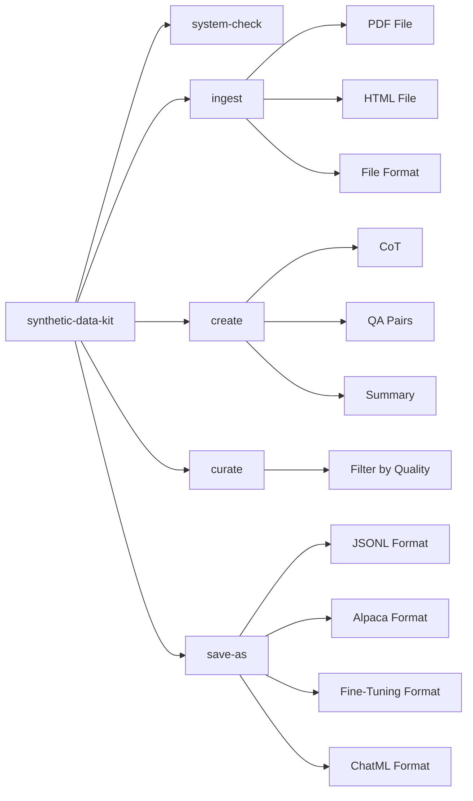

# Synthetic Data Kit

Tool for generating high-quality synthetic datasets to fine-tune LLMs.

Generate Reasoning Traces, QA Pairs, save them to a fine-tuning format with a simple CLI.

> [Checkout our guide on using the tool to unlock task-specific reasoning in Llama-3 family](https://github.com/meta-llama/synthetic-data-kit/tree/main/use-cases/adding_reasoning_to_llama_3)

# What does Synthetic Data Kit offer? 

Fine-Tuning Large Language Models is easy. There are many mature tools that you can use to fine-tune Llama model family using various post-training techniques.

### Why target data preparation?

Multiple tools support standardized formats. However, most of the times your dataset is not structured in "user", "assistant" threads or in a certain format that plays well with a fine-tuning packages. 

This toolkit simplifies the journey of:

- Using a LLM (vLLM or any local/external API endpoint) to generate examples
- Modular 4 command flow
- Converting your existing files to fine-tuning friendly formats
- Creating synthetic datasets
- Supporting various formats of post-training fine-tuning

# How does Synthetic Data Kit offer it? 

The tool is designed to follow a simple CLI structure with 4 commands:

- `ingest` various file formats
- `create` your fine-tuning format: `QA` pairs, `QA` pairs with CoT, `summary` format
- `curate`: Using Llama as a judge to curate high quality examples. 
- `save-as`: After that you can simply save these to a format that your fine-tuning workflow requires.

You can override any parameter or detail by either using the CLI or overriding the default YAML config.


### Installation

#### From PyPI

```bash
# Create a new environment

conda create -n synthetic-data python=3.10 

conda activate synthetic-data

pip install synthetic-data-kit
```

#### (Alternatively) From Source

```bash
git clone https://github.com/meta-llama/synthetic-data-kit.git
cd synthetic-data-kit
pip install -e .
```

To get an overview of commands type: 

`synthetic-data-kit --help`

### 1. Tool Setup

- The tool can process both individual files and entire directories.

```bash
# Create directory structure for the 4-stage pipeline
mkdir -p data/{input,parsed,generated,curated,final}

# Or use the legacy structure (still supported)
mkdir -p data/{pdf,html,youtube,docx,ppt,txt,output,generated,cleaned,final}
```

- You also need a LLM backend that you will utilize for generating your dataset, if using vLLM:

```bash
# Start vLLM server
# Note you will need to grab your HF Authentication from: https://huggingface.co/settings/tokens
vllm serve meta-llama/Llama-3.3-70B-Instruct --port 8000
```

### 2. Usage

The flow follows 4 simple steps: `ingest`, `create`, `curate`, `save-as`. You can process individual files or entire directories. All data is now stored in Lance format by default.

```bash
# Check if your backend is running
synthetic-data-kit system-check

# SINGLE FILE PROCESSING (Original approach)
# Parse a document to a Lance dataset
synthetic-data-kit ingest docs/report.pdf
# This saves file to data/parsed/report.lance

# Generate QA pairs (default)
synthetic-data-kit create data/parsed/report.lance --type qa

OR 

# Generate Chain of Thought (CoT) reasoning examples
synthetic-data-kit create data/parsed/report.txt --type cot

# Both of these save file to data/generated/report_qa_pairs.json

# Filter content based on quality
synthetic-data-kit curate data/generated/report_qa_pairs.json

# Convert to alpaca fine-tuning format and save as HF arrow file
synthetic-data-kit save-as data/curated/report_cleaned.json --format alpaca --storage hf
```

### 2.1 Batch Directory Processing (New)

Process entire directories of files with a single command:

```bash
# Parse all documents in a directory
synthetic-data-kit ingest ./documents/
# Processes all .pdf, .html, .docx, .pptx, .txt files
# Saves parsed text files to data/parsed/

# Generate QA pairs for all text files
synthetic-data-kit create ./data/parsed/ --type qa
# Processes all .txt files in the directory
# Saves QA pairs to data/generated/

# Curate all generated files
synthetic-data-kit curate ./data/generated/ --threshold 8.0
# Processes all .json files in the directory
# Saves curated files to data/curated/

# Convert all curated files to training format
synthetic-data-kit save-as ./data/curated/ --format alpaca
# Processes all .json files in the directory
# Saves final files to data/final/
```

### 2.2 Preview Mode

Use `--preview` to see what files would be processed without actually processing them:

```bash
# Preview files before processing
synthetic-data-kit ingest ./documents --preview
# Shows: directory stats, file counts by extension, list of files

synthetic-data-kit create ./data/parsed --preview
# Shows: .txt files that would be processed
```
## Configuration

The toolkit uses a YAML configuration file (default: `configs/config.yaml`).

Note, this can be overridden via either CLI arguments OR passing a custom YAML file

```yaml
# Example configuration using vLLM
llm:
  provider: "vllm"

vllm:
  api_base: "http://localhost:8000/v1"
  model: "meta-llama/Llama-3.3-70B-Instruct"
  sleep_time: 0.1

generation:
  temperature: 0.7
  chunk_size: 4000
  num_pairs: 25
  max_context_length: 8000

curate:
  threshold: 7.0
  batch_size: 8
```

or using an API endpoint:

```yaml
# Example configuration using the llama API
llm:
  provider: "api-endpoint"

api-endpoint:
  api_base: "https://api.llama.com/v1"
  api_key: "llama-api-key"
  model: "Llama-4-Maverick-17B-128E-Instruct-FP8"
  sleep_time: 0.5
```

### Customizing Configuration

Create a overriding configuration file and use it with the `-c` flag:

```bash
synthetic-data-kit -c my_config.yaml ingest docs/paper.pdf
```

## Examples

### Processing a Single PDF Document

```bash
# Ingest PDF
synthetic-data-kit ingest research_paper.pdf

# Generate QA pairs
synthetic-data-kit create data/parsed/research_paper.txt -n 30

# Curate data
synthetic-data-kit curate data/generated/research_paper_qa_pairs.json -t 8.5

# Save in OpenAI fine-tuning format (JSON)
synthetic-data-kit save-as data/curated/research_paper_cleaned.json -f ft

# Save in OpenAI fine-tuning format (HF dataset)
synthetic-data-kit save-as data/curated/research_paper_cleaned.json -f ft --storage hf
```

### Processing Multiple Documents (Directory)

```bash
# Process all research papers in a directory
synthetic-data-kit ingest ./research_papers/

# Generate QA pairs for all parsed documents
synthetic-data-kit create ./data/parsed/ --type qa -n 30

# Curate all generated files
synthetic-data-kit curate ./data/generated/ -t 8.5

# Save all curated files in OpenAI fine-tuning format
synthetic-data-kit save-as ./data/curated/ -f ft --storage hf
```

### Preview Before Processing

```bash
# See what files would be processed
synthetic-data-kit ingest ./research_papers --preview
# Output:
# Directory: ./research_papers
# Total files: 15
# Supported files: 12
# Extensions: .pdf (8), .docx (3), .txt (1)
# Files: paper1.pdf, paper2.pdf, ...

# Preview with verbose output
synthetic-data-kit create ./data/parsed --preview --verbose
```

### Processing a YouTube Video

```bash
# Extract transcript
synthetic-data-kit ingest "https://www.youtube.com/watch?v=dQw4w9WgXcQ"

# Generate QA pairs with specific model
synthetic_data_kit create data/parsed/youtube_dQw4w9WgXcQ.lance
```

### Multimodal Usage

The tool can also handle multimodal data, extracting both text and images from documents.

```bash
# Ingest a PDF with multimodal support
synthetic-data-kit ingest docs/report.pdf --multimodal

# This will create a Lance dataset at data/parsed/report.lance
# with 'text' and 'image' columns.

# Generate multimodal-qa pairs from the ingested data
synthetic-data-kit create data/parsed/report.lance --type multimodal-qa
```

### Processing Multiple Files

```bash
# NEW: Process entire directories (recommended)
synthetic-data-kit ingest ./data/input/
synthetic-data-kit create ./data/parsed/ --type qa -n 20
synthetic-data-kit curate ./data/generated/ -t 7.5
synthetic-data-kit save-as ./data/curated/ -f chatml

# LEGACY: Bash script to process multiple files (still supported)
for file in data/pdf/*.pdf; do
  filename=$(basename "$file" .pdf)
  
  synthetic-data-kit ingest "$file"
  synthetic-data-kit create "data/parsed/${filename}.txt" -n 20
  synthetic-data-kit curate "data/generated/${filename}_qa_pairs.json" -t 7.5
  synthetic-data-kit save-as "data/curated/${filename}_cleaned.json" -f chatml
done
```

## Document Processing & Chunking

### How Chunking Works

The Synthetic Data Kit automatically handles documents of any size using an intelligent processing strategy:

- **Small documents** (< 8000 characters): Processed in a single API call for maximum context and quality
- **Large documents** (≥ 8000 characters): Automatically split into chunks with overlap to maintain context

### Controlling Chunking Behavior

You can customize chunking with CLI flags or config settings for both single files and directories:

```bash
# Single file with custom chunking
synthetic-data-kit create document.txt --type qa --chunk-size 2000 --chunk-overlap 100

# Directory processing with custom chunking
synthetic-data-kit create ./data/parsed/ --type cot --num-pairs 50 --chunk-size 6000 --verbose

# Preview directory processing with chunking details
synthetic-data-kit create ./data/parsed/ --preview --verbose
```

### Chunking Parameters

| Parameter | Default | Description |
|-----------|---------|-------------|
| `--chunk-size` | 4000 | Size of text chunks in characters |
| `--chunk-overlap` | 200 | Overlap between chunks to preserve context |
| `--verbose` | false | Show chunking details and progress |

### Understanding Chunking Output

When using `--verbose`, you'll see chunking information for both single files and directories:

```bash
# Single file verbose output
synthetic-data-kit create large_document.txt --type qa --num-pairs 20 --verbose

# Directory verbose output
synthetic-data-kit create ./data/parsed/ --type qa --num-pairs 20 --verbose
```

Output:
```
# Single file output
Generating QA pairs...
Document split into 8 chunks
Using batch size of 32
Processing 8 chunks to generate QA pairs...
  Generated 3 pairs from chunk 1 (total: 3/20)
  Generated 2 pairs from chunk 2 (total: 5/20)
  ...
  Reached target of 20 pairs. Stopping processing.
Generated 20 QA pairs total (requested: 20)

# Directory output
Processing directory: ./data/parsed/
Supported files: 5 (.txt files)
Progress: ████████████████████████████████████████ 100% (5/5 files)
✓ document1.txt: Generated 20 QA pairs
✓ document2.txt: Generated 18 QA pairs
✗ document3.txt: Failed - Invalid format
✓ document4.txt: Generated 20 QA pairs
✓ document5.txt: Generated 15 QA pairs

Processing Summary:
Total files: 5
Successful: 4
Failed: 1
Total pairs generated: 73
```

### Chunking logic

Both QA and CoT generation use the same chunking logic for files and directories:

```bash
# Single file processing
synthetic-data-kit create document.txt --type qa --num-pairs 100 --chunk-size 3000
synthetic-data-kit create document.txt --type cot --num-pairs 20 --chunk-size 3000

# Directory processing
synthetic-data-kit create ./data/parsed/ --type qa --num-pairs 100 --chunk-size 3000
synthetic-data-kit create ./data/parsed/ --type cot --num-pairs 20 --chunk-size 3000
```

## Advanced Usage

### Custom Prompt Templates

Edit the `prompts` section in your configuration file to customize generation behavior:

```yaml
prompts:
  qa_generation: |
    You are creating question-answer pairs for fine-tuning a legal assistant.
    Focus on technical legal concepts, precedents, and statutory interpretation.
    
    Below is a chunk of text about: {summary}...
    
    Create {num_pairs} high-quality question-answer pairs based ONLY on this text.
    
    Return ONLY valid JSON formatted as:
    [
      {
        "question": "Detailed legal question?",
        "answer": "Precise legal answer."
      },
      ...
    ]
    
    Text:
    ---
    {text}
    ---
```

### Mental Model:



## Troubleshooting FAQs:

### vLLM Server Issues

- Ensure vLLM is installed: `pip install vllm`
- Start server with: `vllm serve <model_name> --port 8000`
- Check connection: `synthetic-data-kit system-check`

### Memory Issues

If you encounter CUDA out of memory errors:
- Use a smaller model
- Reduce batch size in config
- Start vLLM with `--gpu-memory-utilization 0.85`

### JSON Parsing Issues

If you encounter issues with the `curate` command:
- Use the `-v` flag to enable verbose output
- Set smaller batch sizes in your config.yaml
- Ensure the LLM model supports proper JSON output
- Install json5 for enhanced JSON parsing: `pip install json5`

### Parser Errors

- Ensure required dependencies are installed for specific parsers:
  - PDF: `pip install pdfminer.six`
  - HTML: `pip install beautifulsoup4`
  - YouTube: `pip install pytubefix youtube-transcript-api`
  - DOCX: `pip install python-docx`
  - PPTX: `pip install python-pptx`

## License

Read more about the [License](./LICENSE)

## Contributing

Contributions are welcome! [Read our contributing guide](./CONTRIBUTING.md)