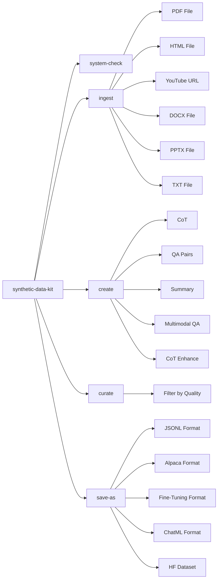

# Synthetic Data Kit

Tool for generating high-quality synthetic datasets to fine-tune LLMs.

Generate Reasoning Traces, QA Pairs, save them to a fine-tuning format with a simple CLI.

> [Checkout our guide on using the tool to unlock task-specific reasoning in Llama-3 family](https://github.com/meta-llama/synthetic-data-kit/tree/main/use-cases/adding_reasoning_to_llama_3)

# What does Synthetic Data Kit offer?

Fine-Tuning Large Language Models is easy. There are many mature tools that you can use to fine-tune Llama model family using various post-training techniques.

### Why target data preparation?

Multiple tools support standardized formats. However, most of the times your dataset is not structured in "user", "assistant" threads or in a certain format that plays well with a fine-tuning packages.

This toolkit simplifies the journey of:

- Using a LLM (vLLm or any local/external API endpoint) to generate examples. **Note: The LLM directly processes text content; no separate embedding model is used in this core Q&A generation workflow.**
- Modular 4 command flow
- Converting your existing files to fine-tuning friendly formats
- Creating synthetic datasets
- Supporting various formats of post-training fine-tuning

# How does Synthetic Data Kit offer it?

The tool is designed to follow a simple CLI structure with 4 commands:

- `ingest` various file formats
- `create` your fine-tuning format: `QA` pairs, `QA` pairs with CoT, `summary` format
- `curate`: Using Llama as a judge to curate high quality examples.
- `save-as`: After that you can simply save these to a format that your fine-tuning workflow requires.

You can override any parameter or detail by either using the CLI or overriding the default YAML config.


### Installation

```bash
uv add synthetic-data-kit
```

To get an overview of commands type:

`synthetic-data-kit --help`

### 1. Tool Setup

- The tool can process both individual files and entire directories.

```bash
# Create directory structure for the 4-stage pipeline
mkdir -p data/{input,parsed,generated,curated,final}

# Or use the legacy structure (still supported)
mkdir -p data/{pdf,html,youtube,docx,ppt,txt,output,generated,cleaned,final}
```

- You also need a LLM backend that you will utilize for generating your dataset. You can use either:

**Option 1: vLLM (Local)**
```bash
# Start vLLM server
# Note you will need to grab your HF Authentication from: https://huggingface.co/settings/tokens
vllm serve meta-llama/Llama-3.3-70B-Instruct --port 8000
```

**Option 2: OpenAI API Compatible Endpoints (Recommended)**
Create a `config.yaml` file with your API configuration:

```yaml
llm:
  provider: "api-endpoint"

api-endpoint:
  api_base: "https://openrouter.ai/api/v1"
  api_key: "your_api_key_here"
  model: "google/gemini-2.5-flash-lite"
```

**Important**: When using a config file, you must always include the `-c config.yaml` flag with all commands.

### 2. Usage

The flow follows 4 simple steps: `ingest`, `create`, `curate`, `save-as`. You can process individual files or entire directories. All data is now stored in Lance format by default.

```bash
# Check if your backend is running
synthetic-data-kit system-check

# Basic end-to-end example for a single file (without config):
synthetic-data-kit ingest docs/report.pdf                      # Parses document (saves to data/parsed/report.lance)
synthetic-data-kit create data/parsed/report.lance --type qa   # Generates QA pairs (saves to data/generated/report_qa_pairs.json)
synthetic-data-kit curate data/generated/report_qa_pairs.json  # Filters content by quality (saves to data/curated/report_cleaned.json)
synthetic-data-kit save-as data/curated/report_cleaned.json --format alpaca --storage hf # Converts to fine-tuning format

# Basic end-to-end example with config file (recommended):
synthetic-data-kit -c config.yaml ingest docs/report.pdf                      # Parses document (saves to data/parsed/report.lance)
synthetic-data-kit -c config.yaml create data/parsed/report.lance --type qa   # Generates QA pairs (saves to data/generated/report_qa_pairs.json)
synthetic-data-kit -c config.yaml curate data/generated/report_qa_pairs.json  # Filters content by quality (saves to data/curated/report_cleaned.json)
synthetic-data-kit -c config.yaml save-as data/curated/report_cleaned.json --format alpaca --storage hf # Converts to fine-tuning format
```

**Batch Directory Processing (Recommended)**

```bash
# Process an entire directory through the pipeline
mkdir -p data_gemini-2.5-flash-lite/{input,parsed,generated,curated,final}
synthetic-data-kit -c config.yaml ingest ./documents/ --output-dir data/parsed
synthetic-data-kit -c config.yaml create ./data/parsed/ --type qa --output-dir data/generated
synthetic-data-kit -c config.yaml curate ./data/generated/ --threshold 8.0 --output data/curated
synthetic-data-kit -c config.yaml save-as ./data/curated/ -f ft --storage hf --output data/final
```

**Note on Output Paths**: For directory processing, explicitly using `--output-dir` (for `ingest` and `create`) and `--output` (for `curate` and `save-as`) is crucial to ensure generated files are saved to the correct subdirectories (`data/parsed`, `data/generated`, `data/curated`, `data/final`), maintaining the intended pipeline structure. If these flags are omitted, files might be saved to default locations as configured in `config.yaml` or to the current working directory, which might not align with the desired output structure.

**Important**: When using a config file, you must always include the `-c config.yaml` flag with all commands to ensure proper configuration loading.

For detailed usage, specific examples, and CLI options, refer to the full documentation in `gitingest.md` or `DOCS.md`.

## Document Processing & Chunking

The Synthetic Data Kit automatically handles documents of any size using an intelligent processing strategy:

-   **Small documents** (< 8000 characters): Processed in a single API call for maximum context and quality.
-   **Large documents** (≥ 8000 characters): Automatically split into chunks with overlap to maintain context.

**Chunking Parameters**:

| Parameter | Default | Description |
|-----------|---------|-------------|
| `--chunk-size` | 4000 | Size of text chunks in **characters** |
| `--chunk-overlap` | 200 | Overlap between chunks to preserve context |
| `--verbose` | false | Show chunking details and progress |

**How Chunking Works**:
Chunks are generated in sequential order from the original document. Q&A generation (or other content generation) stops once the target number of pairs (`--num-pairs`) has been reached. This means that if enough content is generated from early chunks, the latter parts of a document may not be processed.

**Controlling Chunking Behavior**:
You can customize chunking with CLI flags (`--chunk-size`, `--chunk-overlap`) or via your configuration file ([`configs/config.yaml`](configs/config.yaml)).

Example:
```bash
# Single file with custom chunking (without config)
synthetic-data-kit create document.txt --type qa --chunk-size 2000 --chunk-overlap 100

# Single file with custom chunking (with config)
synthetic-data-kit -c config.yaml create document.txt --type qa --chunk-size 2000 --chunk-overlap 100

# Directory processing with custom chunking and verbose output (with config)
synthetic-data-kit -c config.yaml create ./data/parsed/ --type cot --chunk-size 6000 --verbose

# Preview files that would be processed (with config)
synthetic-data-kit -c config.yaml ingest ./documents --preview
synthetic-data-kit -c config.yaml create ./data/parsed --preview
```

For more detailed explanations and more examples of chunking behavior and interpreting verbose output, refer to `gitingest.md` or `DOCS.md`.

## Advanced Usage

### Custom Prompt Templates

Edit the `prompts` section in your configuration file to customize generation behavior:

```yaml
prompts:
  qa_generation: |
    You are creating question-answer pairs for fine-tuning a legal assistant.
    Focus on technical legal concepts, precedents, and statutory interpretation.

    Below is a chunk of text about: {summary}...

    Create {num_pairs} high-quality question-answer pairs based ONLY on this text.

    Return ONLY valid JSON formatted as:
    [
      {
        "question": "Detailed legal question?",
        "answer": "Precise legal answer."
      },
      ...
    ]

    Text:
    ---
    {text}
    ---
```

### Mental Model:



## Troubleshooting FAQs:

### vLLM Server Issues

- Ensure vLLM is installed: `pip install vllm`
- Start server with: `vllm serve <model_name> --port 8000`
- Check connection: `synthetic-data-kit system-check`

### Memory Issues

If you encounter CUDA out of memory errors:
- Use a smaller model
- Reduce batch size in config
- Start vLLM with `--gpu-memory-utilization 0.85`

### JSON Parsing Issues

If you encounter issues with the `curate` command:
- Use the `-v` flag to enable verbose output
- Set smaller batch sizes in your config.yaml
- Ensure the LLM model supports proper JSON output
- Install json5 for enhanced JSON parsing: `pip pip install json5`

### Parser Errors

- Ensure required dependencies are installed for specific parsers:
  - PDF: `pip install pdfminer.six`
  - HTML: `pip install beautifulsoup4`
  - YouTube: `pip install pytubefix youtube-transcript-api`
  - DOCX: `pip install python-docx`
  - PPTX: `pip install python-pptx`
